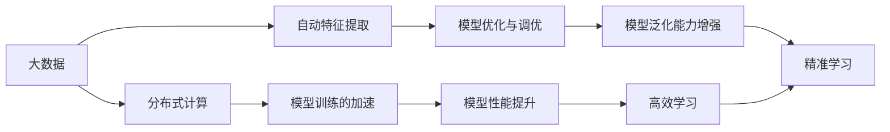

                 

## 1. 背景介绍

### 1.1 问题由来

人工智能（AI）的快速发展正在改变我们的世界，从智能家居到自动驾驶，AI正在各个领域创造前所未有的可能性。然而，AI的发展离不开数据的支撑。大数据的浪潮正在推动AI技术的不断演进，使得AI学习能够更加高效、精准。

### 1.2 问题核心关键点

大数据驱动AI学习的核心关键点包括以下几点：

- **数据的重要性**：AI学习本质上是从数据中学习模式，大数据为AI提供了更多样、更丰富的学习素材，使得AI模型能够从更多角度理解和处理问题。
- **分布式计算**：随着数据量的增加，传统的单机计算已经无法满足需求，分布式计算技术的应用使得大规模数据处理成为可能。
- **自动特征提取**：大数据往往包含大量冗余和噪声数据，自动特征提取技术可以从中提取出对模型有用的特征，提高模型性能。
- **模型训练的加速**：大数据使得模型训练的迭代次数增加，加速模型训练，提高模型的准确性和泛化能力。
- **模型优化与调优**：大数据为模型提供了更多的训练样本，可以更容易地发现模型的弱点并进行调优。

### 1.3 问题研究意义

大数据驱动AI学习的意义深远，主要体现在以下几个方面：

- **提高AI模型的性能**：大数据为AI模型提供了更多的训练样本，使得模型可以更好地学习数据分布，提高模型的准确性和泛化能力。
- **推动AI技术的进步**：大数据的应用促进了AI技术的不断发展，推动了深度学习、自然语言处理、计算机视觉等领域的进步。
- **促进跨领域应用**：大数据的应用为AI技术在医疗、金融、教育、交通等领域的深度应用提供了数据支持，推动了AI技术的跨领域应用。
- **提升数据价值**：大数据的应用使得数据能够更好地转化为信息，提高了数据价值，推动了数据驱动的决策制定。

## 2. 核心概念与联系

### 2.1 核心概念概述

为了更好地理解大数据驱动AI学习的过程，我们先介绍几个核心概念：

- **大数据**：指的是体量巨大、类型多样、价值密度低的数据集合。大数据的应用领域包括医疗、金融、交通、互联网等。
- **分布式计算**：指在多个计算节点上并行计算，以提高计算速度和处理能力的技术。
- **自动特征提取**：指从原始数据中自动提取对模型有用的特征，减少模型训练的时间和资源消耗。
- **模型训练的加速**：指通过并行计算、分布式计算等技术，加速模型训练的过程。
- **模型优化与调优**：指在模型训练过程中，对模型的超参数、结构等进行调整，以提高模型的性能。

这些概念之间的联系可以总结如下：

1. 大数据为AI学习提供了更多的训练样本，使得模型可以更好地学习数据分布。
2. 分布式计算技术能够处理大规模数据，使得模型训练可以加速。
3. 自动特征提取技术可以减少模型训练的时间和资源消耗。
4. 模型训练的加速和优化调优可以进一步提高模型的性能和泛化能力。
5. 通过以上技术的结合，AI学习可以在大数据的驱动下，更加高效、精准地完成学习任务。

### 2.2 核心概念原理和架构的 Mermaid 流程图



这个流程图展示了大数据、分布式计算、自动特征提取、模型训练加速和优化调优之间的联系，以及它们如何共同驱动AI的学习过程。

## 3. 核心算法原理 & 具体操作步骤

### 3.1 算法原理概述

大数据驱动AI学习的核心算法原理主要包括以下几个方面：

- **特征提取**：在大数据中自动提取对模型有用的特征，减少模型训练的时间和资源消耗。
- **分布式计算**：在多个计算节点上并行计算，以提高计算速度和处理能力。
- **模型训练的加速**：通过分布式计算等技术，加速模型训练的过程。
- **模型优化与调优**：在模型训练过程中，对模型的超参数、结构等进行调整，以提高模型的性能。

### 3.2 算法步骤详解

大数据驱动AI学习的算法步骤大致包括以下几个步骤：

1. **数据准备**：收集、整理、清洗大数据，将其转换为模型可以使用的格式。
2. **特征提取**：自动从数据中提取对模型有用的特征，减少模型训练的时间和资源消耗。
3. **分布式计算**：将数据分布在多个计算节点上，进行并行计算。
4. **模型训练**：在分布式计算环境中，对模型进行训练。
5. **模型优化与调优**：在模型训练过程中，对模型的超参数、结构等进行调整，以提高模型的性能。
6. **模型评估**：对训练好的模型进行评估，确保其性能符合要求。
7. **模型部署**：将训练好的模型部署到实际应用中，进行实际测试。

### 3.3 算法优缺点

大数据驱动AI学习的算法具有以下优点：

- **高效性**：大数据使得模型可以处理更多的训练样本，加速模型训练。
- **泛化能力强**：大数据提供了更多样、更丰富的学习素材，使得模型可以更好地学习数据分布，提高模型的泛化能力。
- **处理能力强**：分布式计算技术使得模型可以处理大规模数据，提高计算速度和处理能力。
- **适应性强**：自动特征提取技术可以适应不同类型的数据，提高模型的适应性。

同时，大数据驱动AI学习也存在一些缺点：

- **数据质量要求高**：大数据往往包含大量冗余和噪声数据，需要高质量的数据进行清洗和预处理。
- **计算资源需求大**：大数据的处理和计算需要大量的计算资源，可能对计算资源造成较大压力。
- **算法复杂度高**：算法复杂度较高，需要一定的技术储备和经验。
- **数据隐私问题**：大数据的处理可能涉及隐私问题，需要采取相应的保护措施。

### 3.4 算法应用领域

大数据驱动AI学习的方法可以应用于多个领域，包括但不限于以下几个方面：

- **医疗**：利用大数据驱动的AI学习，可以实现疾病诊断、基因分析、药物研发等。
- **金融**：利用大数据驱动的AI学习，可以实现风险评估、信用评分、投资策略优化等。
- **交通**：利用大数据驱动的AI学习，可以实现交通流量预测、交通管理优化、自动驾驶等。
- **电商**：利用大数据驱动的AI学习，可以实现推荐系统优化、库存管理、客户行为分析等。
- **智能制造**：利用大数据驱动的AI学习，可以实现质量检测、设备维护、生产调度优化等。

## 4. 数学模型和公式 & 详细讲解 & 举例说明

### 4.1 数学模型构建

在大数据驱动AI学习的过程中，我们通常会构建以下数学模型：

- **特征提取模型**：用于自动从数据中提取对模型有用的特征。
- **分布式计算模型**：用于描述并行计算的过程。
- **模型训练模型**：用于描述模型训练的过程。
- **模型优化模型**：用于描述模型优化与调优的过程。

### 4.2 公式推导过程

以特征提取为例，假设有n个样本，每个样本有m个特征，特征提取模型可以表示为：

$$
F(X) = [f_1(X_1), f_2(X_2), ..., f_m(X_n)]
$$

其中，$X_i$表示第i个样本，$f_j(X_i)$表示第i个样本的第j个特征。特征提取模型可以通过一些机器学习算法（如PCA、LDA等）进行训练。

### 4.3 案例分析与讲解

以医疗领域的疾病诊断为例，假设有一个包含10000个病人的大数据集，每个病人有100个特征（如年龄、性别、血压等）。我们希望构建一个AI模型，用于诊断是否患有某种疾病。我们可以首先使用特征提取模型，自动从数据中提取对模型有用的特征，然后使用分布式计算模型进行模型训练，最后通过模型优化模型，提高模型的性能和泛化能力。

## 5. 项目实践：代码实例和详细解释说明

### 5.1 开发环境搭建

在进行大数据驱动AI学习的项目实践前，我们需要准备好开发环境。以下是使用Python进行PyTorch开发的环境配置流程：

1. 安装Anaconda：从官网下载并安装Anaconda，用于创建独立的Python环境。
2. 创建并激活虚拟环境：
```bash
conda create -n pytorch-env python=3.8 
conda activate pytorch-env
```

3. 安装PyTorch：根据CUDA版本，从官网获取对应的安装命令。例如：
```bash
conda install pytorch torchvision torchaudio cudatoolkit=11.1 -c pytorch -c conda-forge
```

4. 安装相关库：
```bash
pip install numpy pandas scikit-learn torch
```

### 5.2 源代码详细实现

下面以医疗领域的疾病诊断任务为例，给出使用PyTorch进行特征提取、模型训练、模型优化等流程的Python代码实现。

```python
import torch
import numpy as np
import pandas as pd
from sklearn.decomposition import PCA
from sklearn.model_selection import train_test_split
from sklearn.metrics import accuracy_score
from torch import nn, optim

# 读取数据集
data = pd.read_csv('hospital_data.csv')

# 数据预处理
X = data.iloc[:, :-1].values
y = data.iloc[:, -1].values

# 特征提取
pca = PCA(n_components=50)
X_pca = pca.fit_transform(X)

# 数据分割
X_train, X_test, y_train, y_test = train_test_split(X_pca, y, test_size=0.2, random_state=42)

# 定义模型
class DiagnosisModel(nn.Module):
    def __init__(self):
        super(DiagnosisModel, self).__init__()
        self.fc1 = nn.Linear(50, 100)
        self.fc2 = nn.Linear(100, 2)
        self.softmax = nn.Softmax(dim=1)
        
    def forward(self, x):
        x = self.fc1(x)
        x = self.fc2(x)
        x = self.softmax(x)
        return x

# 定义损失函数和优化器
criterion = nn.CrossEntropyLoss()
optimizer = optim.Adam(model.parameters(), lr=0.001)

# 训练模型
model = DiagnosisModel()
device = torch.device('cuda' if torch.cuda.is_available() else 'cpu')
model.to(device)

for epoch in range(100):
    model.train()
    optimizer.zero_grad()
    outputs = model(X_train)
    loss = criterion(outputs, y_train.to(device))
    loss.backward()
    optimizer.step()
    
    model.eval()
    with torch.no_grad():
        test_outputs = model(X_test)
        predictions = torch.argmax(test_outputs, dim=1)
        accuracy = accuracy_score(y_test, predictions)
        print(f'Epoch {epoch+1}, Accuracy: {accuracy:.2f}')

# 模型评估
model.eval()
with torch.no_grad():
    test_outputs = model(X_test)
    predictions = torch.argmax(test_outputs, dim=1)
    accuracy = accuracy_score(y_test, predictions)
    print(f'Test Accuracy: {accuracy:.2f}')
```

### 5.3 代码解读与分析

让我们再详细解读一下关键代码的实现细节：

**数据预处理**：
- 读取数据集，并进行特征和标签的划分。
- 使用PCA进行特征提取，提取前50个主成分作为输入特征。

**模型定义**：
- 定义一个简单的神经网络模型，包含两个全连接层和一个softmax层。

**模型训练**：
- 定义损失函数和优化器。
- 在训练过程中，前向传播计算输出，计算损失函数并反向传播更新模型参数。
- 在每个epoch后，评估模型在测试集上的准确率。

**模型评估**：
- 在测试集上对模型进行评估，输出准确率。

可以看到，PyTorch提供了强大的深度学习框架，使得特征提取、模型训练和模型优化等过程变得简单高效。开发者可以将更多精力放在数据处理、模型改进等高层逻辑上，而不必过多关注底层的实现细节。

## 6. 实际应用场景

### 6.1 医疗诊断

大数据驱动的AI学习在医疗诊断领域有着广泛的应用。通过收集和分析海量的医疗数据，AI模型可以辅助医生进行疾病诊断、治疗方案推荐等。

在技术实现上，可以收集电子病历、影像数据、基因数据等医疗数据，构建医学领域的监督学习任务，对预训练模型进行微调。微调后的模型可以自动识别和提取疾病特征，输出疾病诊断结果，辅助医生做出更准确的诊断和治疗决策。

### 6.2 金融风险评估

金融领域也需要实时评估风险，以规避潜在的金融风险。传统的人工评估方式成本高、效率低，难以应对海量数据爆发的挑战。大数据驱动的AI学习为金融风险评估提供了新的解决方案。

具体而言，可以收集金融领域的各类数据，包括交易记录、市场动态、新闻报道等，对预训练语言模型进行微调。微调后的模型可以自动分析金融数据，预测市场趋势，评估信用风险，辅助金融机构做出更合理的风险决策。

### 6.3 智能客服

智能客服系统已经成为各行业的标配，通过收集和分析客户对话数据，AI模型可以自动理解客户意图，提供更准确的回复。

在技术实现上，可以收集客户的历史对话记录，将其标注为意图和答案对，对预训练模型进行微调。微调后的模型可以自动理解客户的意图，并从知识库中抽取相关信息，生成合适的回答。

### 6.4 智能推荐

智能推荐系统已经成为电商、视频、音乐等平台的重要组成部分，通过收集和分析用户的行为数据，AI模型可以为用户推荐更符合其兴趣的内容。

在技术实现上，可以收集用户的浏览、点击、评分等行为数据，将其标注为物品和用户之间的关系，对预训练模型进行微调。微调后的模型可以自动分析用户的兴趣，推荐符合用户偏好的物品。

## 7. 工具和资源推荐

### 7.1 学习资源推荐

为了帮助开发者系统掌握大数据驱动AI学习的理论基础和实践技巧，这里推荐一些优质的学习资源：

1. 《深度学习理论与实践》系列博文：由深度学习领域的专家撰写，深入浅出地介绍了深度学习的原理和应用。
2. CS231n《深度学习与计算机视觉》课程：斯坦福大学开设的计算机视觉领域的经典课程，涵盖了深度学习在计算机视觉中的应用。
3. 《Python数据科学手册》书籍：全面介绍了Python在数据科学中的应用，包括数据清洗、特征提取、模型训练等。
4. Kaggle平台：提供了大量的数据集和竞赛，有助于学习数据科学和机器学习技术。
5. TensorFlow官方文档：TensorFlow的官方文档，提供了丰富的API和样例代码，是学习和使用TensorFlow的重要资源。

通过对这些资源的学习实践，相信你一定能够快速掌握大数据驱动AI学习的精髓，并用于解决实际的AI问题。

### 7.2 开发工具推荐

高效的开发离不开优秀的工具支持。以下是几款用于大数据驱动AI学习开发的常用工具：

1. PyTorch：基于Python的开源深度学习框架，灵活的计算图，适合快速迭代研究。
2. TensorFlow：由Google主导开发的开源深度学习框架，生产部署方便，适合大规模工程应用。
3. Weights & Biases：模型训练的实验跟踪工具，可以记录和可视化模型训练过程中的各项指标，方便对比和调优。
4. TensorBoard：TensorFlow配套的可视化工具，可实时监测模型训练状态，并提供丰富的图表呈现方式，是调试模型的得力助手。

合理利用这些工具，可以显著提升大数据驱动AI学习的开发效率，加快创新迭代的步伐。

### 7.3 相关论文推荐

大数据驱动AI学习的相关研究还在不断发展，以下是几篇奠基性的相关论文，推荐阅读：

1. Google AI发布的《TensorFlow》论文：介绍了TensorFlow的基本架构和应用场景，是TensorFlow的入门必读。
2. Microsoft发布的《深度学习与计算机视觉》论文：涵盖了深度学习在计算机视觉领域的应用，包括特征提取、模型训练等。
3. NVIDIA发布的《GPU加速深度学习》论文：介绍了GPU加速深度学习的原理和实现方法，是深度学习与并行计算结合的典范。
4. IBM发布的《深度学习在医疗领域的应用》论文：介绍了深度学习在医疗领域的应用，包括疾病诊断、影像分析等。
5. Facebook发布的《深度学习在金融领域的应用》论文：介绍了深度学习在金融领域的应用，包括信用评分、风险评估等。

这些论文代表了大数据驱动AI学习的最新研究成果，有助于了解和掌握前沿技术。

## 8. 总结：未来发展趋势与挑战

### 8.1 总结

本文对大数据驱动AI学习的原理和实现进行了全面系统的介绍。通过详细介绍特征提取、分布式计算、模型训练和优化等关键环节，展示了大数据驱动AI学习的全流程。

通过本文的系统梳理，可以看到，大数据驱动AI学习在各个领域的应用前景广阔，能够显著提升模型的性能和泛化能力，为AI技术的发展提供了有力支持。未来，伴随大数据技术的不断演进和AI算法的持续创新，大数据驱动AI学习必将在更多领域得到应用，为经济社会发展注入新的动力。

### 8.2 未来发展趋势

大数据驱动AI学习的未来发展趋势包括以下几个方面：

1. **数据量的持续增长**：随着物联网、5G等技术的普及，数据量将持续增长，为AI学习提供了更丰富的素材。
2. **分布式计算的普及**：分布式计算技术的应用将进一步普及，使得大规模数据处理成为可能。
3. **自动特征提取的改进**：自动特征提取技术将不断改进，使得模型能够更好地从数据中提取有用的特征。
4. **模型训练的加速**：随着计算能力的提升，模型训练将变得更加高效，加速模型训练。
5. **模型优化与调优的优化**：模型的优化与调优将不断改进，提高模型的性能和泛化能力。

这些趋势将进一步推动AI技术的进步，带来更多智能化、普适化的应用场景。

### 8.3 面临的挑战

尽管大数据驱动AI学习的发展前景广阔，但在迈向更加智能化、普适化应用的过程中，它仍面临着诸多挑战：

1. **数据质量问题**：大数据中往往包含大量冗余和噪声数据，需要高质量的数据进行清洗和预处理。
2. **计算资源需求大**：大数据的处理和计算需要大量的计算资源，可能对计算资源造成较大压力。
3. **算法复杂度高**：算法复杂度较高，需要一定的技术储备和经验。
4. **数据隐私问题**：大数据的处理可能涉及隐私问题，需要采取相应的保护措施。
5. **模型的可解释性问题**：AI模型的复杂性使得其决策过程难以解释，可能影响应用的可信度和可控性。

### 8.4 研究展望

面对大数据驱动AI学习所面临的挑战，未来的研究需要在以下几个方面寻求新的突破：

1. **数据清洗和预处理技术的提升**：提升数据清洗和预处理技术，减少数据中的冗余和噪声，提高数据质量。
2. **分布式计算技术的优化**：优化分布式计算技术，提升大数据处理和计算的效率，降低计算资源成本。
3. **自动特征提取技术的改进**：改进自动特征提取技术，提高模型从数据中提取有用特征的能力。
4. **模型优化与调优方法的创新**：创新模型优化与调优方法，提高模型的性能和泛化能力。
5. **模型可解释性的增强**：增强模型的可解释性，提高模型的可信度和可控性。

这些研究方向的探索，必将引领大数据驱动AI学习技术迈向更高的台阶，为构建安全、可靠、可解释、可控的智能系统铺平道路。面向未来，大数据驱动AI学习技术还需要与其他人工智能技术进行更深入的融合，如知识表示、因果推理、强化学习等，多路径协同发力，共同推动自然语言理解和智能交互系统的进步。只有勇于创新、敢于突破，才能不断拓展AI学习模型的边界，让智能技术更好地造福人类社会。

## 9. 附录：常见问题与解答

**Q1：大数据驱动AI学习是否适用于所有NLP任务？**

A: 大数据驱动AI学习在大多数NLP任务上都能取得不错的效果，特别是对于数据量较小的任务。但对于一些特定领域的任务，如医学、法律等，仅仅依靠通用语料预训练的模型可能难以很好地适应。此时需要在特定领域语料上进一步预训练，再进行微调，才能获得理想效果。

**Q2：如何选择合适的学习率？**

A: 学习率一般要比预训练时小1-2个数量级，如果使用过大的学习率，容易破坏预训练权重，导致过拟合。一般建议从1e-5开始调参，逐步减小学习率，直至收敛。也可以使用warmup策略，在开始阶段使用较小的学习率，再逐渐过渡到预设值。需要注意的是，不同的优化器(如AdamW、Adafactor等)以及不同的学习率调度策略，可能需要设置不同的学习率阈值。

**Q3：大数据驱动AI学习面临哪些资源瓶颈？**

A: 大数据的处理和计算需要大量的计算资源，可能对计算资源造成较大压力。同时，模型的存储和读取也可能占用大量时间和空间。因此需要采用一些资源优化技术，如梯度积累、混合精度训练、模型并行等，来突破硬件瓶颈。

**Q4：如何缓解大数据驱动AI学习的过拟合问题？**

A: 过拟合是大数据驱动AI学习面临的主要挑战，尤其是在标注数据不足的情况下。常见的缓解策略包括：
1. 数据增强：通过回译、近义替换等方式扩充训练集
2. 正则化：使用L2正则、Dropout、Early Stopping等避免过拟合
3. 对抗训练：引入对抗样本，提高模型鲁棒性
4. 参数高效微调：只调整少量参数(如Adapter、Prefix等)，减小过拟合风险
5. 多模型集成：训练多个模型，取平均输出，抑制过拟合

这些策略往往需要根据具体任务和数据特点进行灵活组合。只有在数据、模型、训练、推理等各环节进行全面优化，才能最大限度地发挥大数据驱动AI学习的威力。

**Q5：大数据驱动AI学习在落地部署时需要注意哪些问题？**

A: 将大数据驱动AI学习模型转化为实际应用，还需要考虑以下因素：
1. 模型裁剪：去除不必要的层和参数，减小模型尺寸，加快推理速度
2. 量化加速：将浮点模型转为定点模型，压缩存储空间，提高计算效率
3. 服务化封装：将模型封装为标准化服务接口，便于集成调用
4. 弹性伸缩：根据请求流量动态调整资源配置，平衡服务质量和成本
5. 监控告警：实时采集系统指标，设置异常告警阈值，确保服务稳定性
6. 安全防护：采用访问鉴权、数据脱敏等措施，保障数据和模型安全

大数据驱动AI学习为NLP应用开启了广阔的想象空间，但如何将强大的性能转化为稳定、高效、安全的业务价值，还需要工程实践的不断打磨。

---

作者：禅与计算机程序设计艺术 / Zen and the Art of Computer Programming

