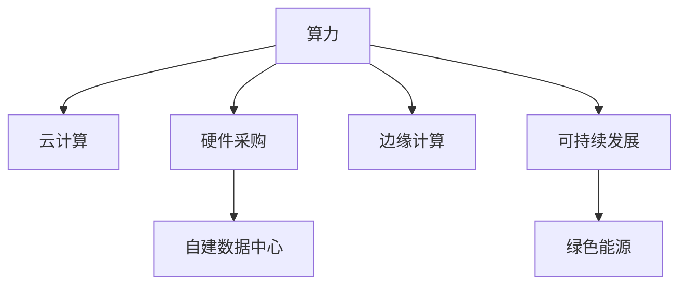

                 

# 大模型公司的算力获取策略

> 关键词：算力,云计算,硬件采购,GPU,TPU,自建数据中心,边缘计算,可持续发展

## 1. 背景介绍

### 1.1 问题由来
随着深度学习和大模型技术的兴起，算力需求急剧增长，成为各大模型公司争夺的焦点。拥有充足的算力资源，不仅能加快模型训练和推理速度，提升系统性能，还能增强模型的精度和泛化能力。然而，算力获取并非易事，尤其对于初创模型公司而言，面临着从何入手、如何实现规模化部署的难题。

本文将详细介绍大模型公司获取算力的几种主要策略，并结合实际案例分析其优缺点及适用场景，旨在为行业同仁提供有益的借鉴和参考。

## 2. 核心概念与联系

### 2.1 核心概念概述

为更好地理解大模型公司的算力获取策略，本节将介绍几个密切相关的核心概念：

- 算力(Computational Power)：指计算机系统处理计算任务的能力，通常以每秒可以执行的操作次数来衡量，包括CPU、GPU、TPU等计算资源。
- 云计算(Cloud Computing)：通过网络将计算资源虚拟化，按需提供给用户使用，包括公有云、私有云和混合云等多种模式。
- GPU(Graphical Processing Unit)：一种专为处理图形渲染任务设计的专用处理器，近年来在深度学习训练和推理中广泛应用。
- TPU(Tensor Processing Unit)：一种专门针对TensorFlow等机器学习框架优化的硬件加速器，具有极高的并行计算能力。
- 边缘计算(Edge Computing)：在数据产生地附近进行数据处理和分析，以减少数据传输和延迟，提升系统响应速度和安全性。
- 可持续性(Sustainability)：在获取算力时，需考虑资源的长期利用和环保要求，避免资源浪费和环境污染。

这些核心概念之间的逻辑关系可以通过以下Mermaid流程图来展示：



这个流程图展示了大模型公司获取算力的主要途径，包括云计算、硬件采购、自建数据中心、边缘计算和可持续发展等。

## 3. 核心算法原理 & 具体操作步骤

### 3.1 算法原理概述

大模型公司获取算力的策略，本质上是如何在资源有限的情况下，通过合理的资源调配和成本控制，满足模型训练和推理的需求。常见的方法包括：

- 云计算：利用公有云或私有云的计算资源，按需支付使用费用，灵活扩展资源规模。
- 硬件采购：直接购买高性能计算硬件设备，如GPU、TPU等，构建本地数据中心。
- 自建数据中心：在自有或租赁的土地上，建设专门的计算设施，长期占有计算资源。
- 边缘计算：在接近数据源的地方部署计算资源，减少网络传输延迟，提升响应速度。
- 可持续发展：考虑算力的获取和使用对环境的影响，采用绿色能源和节能技术，确保长期运营的可持续性。

这些策略各自有其优缺点，大模型公司需要根据自身需求和资源情况，选择最合适的方案。

### 3.2 算法步骤详解

以下是几种常见算力获取策略的具体操作步骤：

#### 云计算

1. **选择合适的云计算平台**：根据需求选择公有云（如AWS、Azure、Google Cloud）或私有云（如OpenStack、VMware）。
2. **创建和管理虚拟机**：根据模型训练需求，创建相应规格的虚拟机，并设置网络、存储、安全等配置。
3. **安装和配置深度学习框架**：在虚拟机上安装深度学习框架（如PyTorch、TensorFlow等），配置所需的依赖库和环境变量。
4. **部署模型训练和推理服务**：将模型代码和数据部署到云计算平台，启动模型训练或推理任务。
5. **监控和管理资源使用**：实时监控虚拟机资源使用情况，根据需求动态调整资源配置。

#### 硬件采购

1. **调研和选择硬件设备**：根据模型需求选择合适的硬件设备，如GPU、TPU等，进行性能测试和兼容性验证。
2. **安装和配置硬件设备**：在数据中心内安装硬件设备，连接电源和网络，并进行初始化配置。
3. **搭建分布式计算集群**：将多台硬件设备组成集群，部署并行计算任务，提高计算效率。
4. **优化计算资源使用**：通过任务调度和资源管理工具，优化计算资源的使用，减少资源浪费。
5. **定期维护和升级**：定期检查硬件设备的运行状态，进行维护和升级，保持计算能力。

#### 自建数据中心

1. **选址和建设基础设施**：根据业务需求，选择合适的地理位置，建设数据中心的基础设施，如机房、冷却系统、电力供应等。
2. **购置和配置硬件设备**：根据需求购置高性能计算设备，如服务器、存储器、网络设备等，并进行配置和调试。
3. **搭建私有云平台**：开发和部署私有云平台，提供计算资源管理和调度服务。
4. **部署模型训练和推理服务**：将模型代码和数据部署到私有云平台，启动模型训练或推理任务。
5. **优化计算资源使用**：通过任务调度和资源管理工具，优化计算资源的使用，减少资源浪费。

#### 边缘计算

1. **选择边缘计算设备**：根据数据产生地和处理需求，选择适合的边缘计算设备，如边缘服务器、IoT设备等。
2. **安装和配置设备**：在数据产生地附近安装和配置边缘计算设备，连接网络并进行初始化。
3. **部署模型推理服务**：将模型代码和数据部署到边缘计算设备，启动模型推理任务。
4. **优化数据传输和处理**：通过数据压缩、预处理和缓存等技术，优化数据传输和处理速度。
5. **监控和管理边缘设备**：实时监控边缘计算设备的状态和资源使用情况，根据需求调整资源配置。

#### 可持续发展

1. **评估能源消耗**：对现有的计算设施进行能源消耗评估，了解其对环境的影响。
2. **采用绿色能源**：使用可再生能源（如太阳能、风能）和能源回收技术，减少碳排放。
3. **优化数据中心设计**：采用高效制冷、节能设计等技术，降低数据中心的能源消耗。
4. **采用节能管理工具**：使用能源管理系统和实时监控工具，优化能源使用和调度。
5. **实施可持续发展计划**：制定并执行可持续发展计划，定期进行环保和能效评估，持续改进。

## 4. 数学模型和公式 & 详细讲解 & 举例说明（备注：数学公式请使用latex格式，latex嵌入文中独立段落使用 $$，段落内使用 $)
### 4.1 数学模型构建

大模型公司的算力获取策略主要涉及到成本、性能、效率和可持续性等指标，可以通过数学模型对其进行量化分析。

假设某大模型公司需要部署一个深度学习模型，训练数据量为 $D$，计算量为 $C$，时间成本为 $T$，能源消耗为 $E$，则有：

$$
T = \frac{C}{R}
$$

其中 $R$ 为计算资源速率，通常由GPU或TPU的并行计算能力决定。

$$
E = E_0 + \alpha T
$$

其中 $E_0$ 为固定能源消耗，$\alpha$ 为计算资源消耗系数，表示计算量越大，能源消耗越多。

### 4.2 公式推导过程

对于云计算策略，可以建立如下模型：

$$
\min_{R, T} C + \beta E
$$

其中 $C$ 为计算资源使用成本，$E$ 为能源消耗成本，$\beta$ 为能源消耗权重。

对于硬件采购策略，可以建立如下模型：

$$
\min_{R, C} T + \gamma E
$$

其中 $T$ 为总时间成本，$C$ 为硬件设备成本，$\gamma$ 为能源消耗权重。

对于自建数据中心策略，可以建立如下模型：

$$
\min_{R, C} T + \delta E
$$

其中 $T$ 为总时间成本，$C$ 为数据中心建设成本，$\delta$ 为能源消耗权重。

对于边缘计算策略，可以建立如下模型：

$$
\min_{R, D} C + \eta E
$$

其中 $C$ 为边缘计算设备成本，$E$ 为能源消耗成本，$\eta$ 为能源消耗权重。

### 4.3 案例分析与讲解

某大模型公司需要部署一个需要大量计算的深度学习模型，训练数据量为 $D=1TB$，计算量为 $C=1 ExaFLOPS$。

- **云计算策略**：选择公有云平台，如AWS，创建虚拟机，配置GPU资源，启动模型训练。成本为 $C=0.5/小时$，计算资源速率 $R=1 ExaFLOPS$，能源消耗系数 $\alpha=0.1$，能源成本 $E_0=0.01/度$。则：

  $$
  T = \frac{C}{R} = 1小时
  $$

  $$
  E = E_0 + \alpha T = 0.01 + 0.1 \times 1 = 0.11度
  $$

  总成本 $C + \beta E = 0.5 + 0.1 \times 0.11 = 0.61$。

- **硬件采购策略**：购买多台GPU，配置数据中心，搭建集群，启动模型训练。硬件设备成本 $C=100万美元$，计算资源速率 $R=1 ExaFLOPS$，能源消耗系数 $\alpha=0.1$，能源成本 $E_0=0.01/度$。则：

  $$
  T = \frac{C}{R} = 100万美元/小时
  $$

  $$
  E = E_0 + \alpha T = 0.01 + 0.1 \times 100万美元/小时 = 100万美元
  $$

  总成本 $T + \gamma E = 100万美元 + \gamma \times 100万美元 = 200万美元$。

- **自建数据中心策略**：在自有土地上建设数据中心，购置GPU，配置网络，搭建私有云平台，启动模型训练。数据中心建设成本 $C=1000万美元$，计算资源速率 $R=1 ExaFLOPS$，能源消耗系数 $\alpha=0.1$，能源成本 $E_0=0.01/度$。则：

  $$
  T = \frac{C}{R} = 1000万美元/小时
  $$

  $$
  E = E_0 + \alpha T = 0.01 + 0.1 \times 1000万美元/小时 = 100万美元
  $$

  总成本 $T + \delta E = 1000万美元 + \delta \times 100万美元 = 1100万美元$。

- **边缘计算策略**：选择边缘计算设备，如边缘服务器，部署模型推理服务，启动模型推理。边缘计算设备成本 $C=10万美元$，能源消耗系数 $\alpha=0.1$，能源成本 $E_0=0.01/度$。则：

  $$
  T = 1分钟
  $$

  $$
  E = E_0 + \alpha T = 0.01 + 0.1 \times 1 = 0.11度
  $$

  总成本 $C + \eta E = 10万美元 + \eta \times 0.11度 = 10万美元$。

通过上述计算，可以看出不同策略的成本和效率差异，大模型公司可以根据自身需求和资源情况，选择最合适的方案。

## 5. 项目实践：代码实例和详细解释说明
### 5.1 开发环境搭建

在进行算力获取策略的实践前，我们需要准备好开发环境。以下是使用Python进行云计算、硬件采购、自建数据中心、边缘计算和可持续发展等不同策略的实践环境配置流程：

**云计算策略**

1. **安装AWS CLI**：从官网下载并安装AWS CLI，使用命令 `aws configure` 配置AWS账户信息。
2. **创建EC2实例**：使用命令 `aws ec2 run-instances` 创建虚拟机，设置所需的计算资源和网络配置。
3. **安装深度学习框架**：在EC2实例上安装深度学习框架（如PyTorch、TensorFlow等），配置所需的依赖库和环境变量。
4. **启动模型训练**：将模型代码和数据上传至EC2实例，使用命令 `aws s3 sync` 完成数据同步，启动模型训练任务。
5. **监控和管理资源使用**：使用AWS CloudWatch实时监控EC2实例的资源使用情况，使用命令 `aws ec2 describe-instances` 获取实例状态。

**硬件采购策略**

1. **购买GPU设备**：在供应商网站上选择适合的GPU设备，下订单并等待发货。
2. **安装和配置设备**：在数据中心内安装和配置GPU设备，连接电源和网络，并进行初始化配置。
3. **搭建分布式计算集群**：使用GPU集群管理软件（如Slurm）搭建计算集群，部署并行计算任务。
4. **优化计算资源使用**：使用集群管理工具（如Kubernetes）优化计算资源的使用，减少资源浪费。
5. **定期维护和升级**：定期检查GPU设备的运行状态，进行维护和升级，保持计算能力。

**自建数据中心策略**

1. **选址和建设基础设施**：根据业务需求，选择合适的地理位置，建设数据中心的基础设施，如机房、冷却系统、电力供应等。
2. **购置和配置硬件设备**：在数据中心内购置高性能计算设备，如服务器、存储器、网络设备等，并进行配置和调试。
3. **搭建私有云平台**：开发和部署私有云平台，提供计算资源管理和调度服务。
4. **部署模型训练和推理服务**：将模型代码和数据部署到私有云平台，启动模型训练或推理任务。
5. **优化计算资源使用**：使用私有云管理工具（如OpenStack）优化计算资源的使用，减少资源浪费。

**边缘计算策略**

1. **选择边缘计算设备**：根据数据产生地和处理需求，选择适合的边缘计算设备，如边缘服务器、IoT设备等。
2. **安装和配置设备**：在数据产生地附近安装和配置边缘计算设备，连接网络并进行初始化。
3. **部署模型推理服务**：将模型代码和数据部署到边缘计算设备，启动模型推理任务。
4. **优化数据传输和处理**：通过数据压缩、预处理和缓存等技术，优化数据传输和处理速度。
5. **监控和管理边缘设备**：实时监控边缘计算设备的状态和资源使用情况，使用命令 `iotcli list devices` 获取设备状态。

**可持续发展策略**

1. **评估能源消耗**：对现有的计算设施进行能源消耗评估，使用工具 `powersys` 监测能源消耗。
2. **采用绿色能源**：使用可再生能源（如太阳能、风能）和能源回收技术，减少碳排放。
3. **优化数据中心设计**：采用高效制冷、节能设计等技术，降低数据中心的能源消耗。
4. **采用节能管理工具**：使用能源管理系统和实时监控工具，优化能源使用和调度。
5. **实施可持续发展计划**：制定并执行可持续发展计划，定期进行环保和能效评估，持续改进。

### 5.2 源代码详细实现

这里我们以云计算策略为例，给出使用AWS进行云计算算力获取的Python代码实现。

首先，安装AWS CLI并配置账户信息：

```bash
pip install awscli
aws configure
```

然后，创建EC2实例：

```bash
aws ec2 run-instances --image-id ami-0c55b159c99ts2a2c --instance-type p3.2xlarge --key-name my-key-pair --security-group-ids sg-0a42c0cdcd8e09456 --subnet-id subnet-0c55b159c99ts2a2c --instance-init-block-device-mapping /dev/sdxb=/mnt
```

创建完成后，在EC2实例上安装深度学习框架，例如PyTorch：

```bash
ssh -i my-key-pair.pem ec2-user@ec2-198-51-100-1.compute-1.amazonaws.com
sudo apt-get update
sudo apt-get install python3-pip
pip3 install torch torchvision torchaudio
```

最后，上传模型代码和数据，启动模型训练：

```bash
aws s3 sync local/ local-bucket/
ssh -i my-key-pair.pem ec2-user@ec2-198-51-100-1.compute-1.amazonaws.com
python3 train.py
```

### 5.3 代码解读与分析

让我们再详细解读一下关键代码的实现细节：

**AWS CLI安装和配置**：
- 安装AWS CLI：使用 `pip install awscli` 安装。
- 配置账户信息：使用 `aws configure` 命令配置AWS账户信息，包括Access Key、Secret Key、Region等。

**EC2实例创建**：
- 使用 `aws ec2 run-instances` 命令创建虚拟机，指定所需的计算资源和网络配置。
- 指定镜像ID、实例类型、密钥对、安全组ID、子网ID等信息。
- 通过SSH登录EC2实例，进行后续操作。

**深度学习框架安装**：
- 在EC2实例上使用 `sudo apt-get install python3-pip` 安装Python3和pip。
- 使用 `pip3 install torch torchvision torchaudio` 安装深度学习框架及其依赖库。

**数据上传和模型训练**：
- 使用 `aws s3 sync local/ local-bucket/` 命令将本地文件上传到AWS S3存储桶。
- 在EC2实例上使用 `python3 train.py` 命令启动模型训练。

**资源监控和管理**：
- 使用 `aws ec2 describe-instances` 命令获取EC2实例的状态。
- 使用AWS CloudWatch实时监控EC2实例的资源使用情况。

通过上述代码实现，大模型公司可以方便地使用云计算策略获取算力，快速部署和训练深度学习模型。

## 6. 实际应用场景

### 6.1 智能客服系统

大模型公司在智能客服系统中，通过云计算策略获取算力，可以提供7x24小时不间断的智能客服服务。智能客服系统需要处理大量的客户咨询请求，对响应速度和系统稳定性要求较高。云计算策略能够灵活扩展计算资源，快速应对高峰期需求，提高客户满意度。

### 6.2 金融舆情监测

金融公司利用云计算策略获取算力，可以实时监测市场舆情，快速响应负面信息传播。金融公司需要处理海量金融数据，对计算资源的需求量较大。云计算策略能够按需分配计算资源，灵活调整资源规模，满足实时舆情监测的需求。

### 6.3 个性化推荐系统

电商公司利用云计算策略获取算力，可以构建高效的个性化推荐系统。个性化推荐系统需要处理用户行为数据，计算用户兴趣偏好，对计算资源的需求量较大。云计算策略能够灵活扩展计算资源，快速处理海量数据，提升推荐系统的精度和速度。

### 6.4 未来应用展望

随着大模型技术的不断发展，云计算策略的应用将更加广泛，云计算平台的功能和性能也将不断提升。未来，云计算策略将进一步降低算力获取的门槛，推动深度学习模型的规模化部署和应用。

## 7. 工具和资源推荐

### 7.1 学习资源推荐

为了帮助开发者系统掌握大模型公司获取算力的策略，这里推荐一些优质的学习资源：

1. **AWS官方文档**：AWS提供详细的云计算服务文档和API指南，涵盖云计算资源管理、数据存储、安全防护等多个方面。
2. **AWS云学院**：AWS云学院提供免费在线课程，涵盖云计算、大数据、机器学习等多个领域的知识和技能。
3. **TensorFlow官方文档**：TensorFlow提供详细的深度学习框架文档和教程，涵盖模型训练、分布式计算、高性能优化等多个方面。
4. **NVIDIA GPU加速**：NVIDIA提供丰富的GPU加速资源和教程，涵盖深度学习、科学计算、人工智能等多个领域。
5. **OpenStack官方文档**：OpenStack提供详细的私有云平台文档和教程，涵盖计算资源管理、网络虚拟化、存储管理等多个方面。

通过对这些资源的学习实践，相信你一定能够掌握大模型公司获取算力的策略，并将其应用于实际的NLP项目中。

### 7.2 开发工具推荐

高效的开发离不开优秀的工具支持。以下是几款用于云计算、硬件采购、自建数据中心、边缘计算和可持续发展等不同策略的开发工具：

1. **AWS CLI**：AWS命令行接口，方便进行云计算资源管理和监控。
2. **NVIDIA NGC**：NVIDIA GPU加速平台，提供丰富的深度学习框架和模型资源。
3. **OpenStack**：开源私有云平台，提供灵活的计算资源管理和调度。
4. **Kubernetes**：容器编排工具，支持分布式计算集群管理和资源优化。
5. **PowerSys**：能源监测和管理系统，帮助评估和优化数据中心的能源消耗。

合理利用这些工具，可以显著提升大模型公司获取算力的开发效率，加速创新迭代的步伐。

### 7.3 相关论文推荐

大模型公司获取算力的策略也涉及到计算资源管理和优化等多个领域，以下是几篇相关论文，推荐阅读：

1. **云计算资源管理**："Efficient Resource Management in Cloud Data Centers" - Oren et al., 2013。
2. **GPU加速**："Programming Massive GPU Systems" - Green et al., 2013。
3. **私有云平台**："Designing a Cloud-Computing Framework for Multinational Corporations" - Adams et al., 2014。
4. **边缘计算**："Edge Computing: An Overview of Its Recent Advances and Future Directions" - Song et al., 2020。
5. **绿色能源和节能技术**："Sustainable Cloud Computing: A Survey of Principles, Technologies, and Future Research Directions" - Hu et al., 2015。

这些论文代表了大模型公司获取算力策略的研究方向，为研究者提供了宝贵的参考。

## 8. 总结：未来发展趋势与挑战

### 8.1 总结

本文对大模型公司获取算力的几种主要策略进行了全面系统的介绍。首先阐述了云计算、硬件采购、自建数据中心、边缘计算和可持续发展等算力获取策略的研究背景和意义，明确了这些策略在大模型公司中的具体应用和优势。其次，从原理到实践，详细讲解了不同策略的操作步骤，提供了具体的代码实现和解读，力求为读者提供全面的技术指引。

通过本文的系统梳理，可以看到，大模型公司获取算力策略的选择，需要在资源、成本、性能和可持续性等多方面进行权衡。云计算策略适用于灵活的业务需求，硬件采购策略适用于长期稳定的业务需求，自建数据中心策略适用于大规模计算需求，边缘计算策略适用于低延迟和高安全性的业务需求，可持续发展策略适用于环保和能源管理的业务需求。

### 8.2 未来发展趋势

展望未来，大模型公司获取算力的策略将呈现以下几个发展趋势：

1. **云计算平台智能化**：云计算平台将引入更多的AI技术，如自动调度和优化算法，提供更加智能的资源管理服务。
2. **边缘计算普及化**：边缘计算将成为数据处理的主流方式，广泛应用于物联网、智能制造、智能城市等领域。
3. **绿色能源技术发展**：可再生能源和节能技术将进一步发展，推动数据中心和计算设施的环保和可持续发展。
4. **混合计算模式兴起**：云计算和私有云的混合计算模式将成为趋势，满足不同业务需求的计算资源需求。
5. **模型训练和推理分离**：云计算和自建数据中心将更加细化分工，模型训练和推理服务分离，提升资源利用效率。

### 8.3 面临的挑战

尽管云计算、硬件采购、自建数据中心、边缘计算和可持续发展等策略在大模型公司中广泛应用，但在实施过程中，仍面临诸多挑战：

1. **成本控制**：云计算和自建数据中心的硬件采购和维护成本较高，需要合理控制成本，避免资源浪费。
2. **数据安全和隐私**：云计算和边缘计算涉及大量敏感数据，需要严格的访问控制和数据加密措施，确保数据安全。
3. **性能优化**：云计算和私有云平台需要优化资源调度和任务调度，提升计算资源的使用效率。
4. **网络延迟和带宽**：边缘计算设备通常位于数据源附近，但网络延迟和带宽也可能成为瓶颈，需要优化数据传输和处理。
5. **可持续发展**：数据中心和计算设施的能源消耗较大，需要采用绿色能源和节能技术，确保长期运营的可持续性。

### 8.4 研究展望

面对大模型公司获取算力所面临的挑战，未来的研究需要在以下几个方面寻求新的突破：

1. **优化云计算资源管理**：研究和开发更加智能化的云计算资源管理算法，提升资源调度和优化的效率和效果。
2. **提高硬件资源利用率**：开发更高效的计算硬件和资源管理工具，提升计算资源的利用效率。
3. **优化边缘计算部署**：研究和开发更加高效的数据传输和处理技术，优化边缘计算设备的性能和可靠性。
4. **推动绿色能源技术发展**：探索和应用更多的绿色能源和节能技术，减少数据中心的碳排放和能源消耗。
5. **提升数据安全和隐私保护**：研究和开发更严格的数据安全和隐私保护技术，确保数据和系统的安全。

通过这些研究方向的探索，必将推动大模型公司获取算力策略的不断进步，为深度学习模型的规模化部署和应用提供更加坚实的基础。面向未来，云计算、硬件采购、自建数据中心、边缘计算和可持续发展等策略将成为大模型公司获取算力的重要手段，推动人工智能技术向更广阔的领域迈进。

## 9. 附录：常见问题与解答

**Q1：云计算策略适用于所有业务需求吗？**

A: 云计算策略适用于灵活的业务需求，可以按需支付使用费用，灵活扩展资源规模。但对于需要长期稳定计算资源的业务，云计算策略可能存在成本较高、数据传输延迟等问题。此时需要考虑硬件采购策略或自建数据中心策略。

**Q2：硬件采购策略和自建数据中心策略有哪些优缺点？**

A: 硬件采购策略适用于长期稳定的业务需求，可以完全掌控计算资源，但成本较高，维护复杂。自建数据中心策略适用于大规模计算需求，可以完全掌控计算资源，但建设成本和维护成本较高，初期投资大。

**Q3：边缘计算策略有哪些优缺点？**

A: 边缘计算策略适用于低延迟和高安全性的业务需求，可以减少数据传输和网络延迟，提高系统响应速度，但需要额外的硬件设备和网络支持，部署复杂。

**Q4：可持续发展策略如何实施？**

A: 可持续发展策略需要从能源消耗评估、采用绿色能源、优化数据中心设计、使用节能管理工具等多个方面入手，持续改进能源使用和调度，确保长期的可持续性。

**Q5：如何选择合适的算力获取策略？**

A: 选择合适的算力获取策略需要考虑业务需求、成本控制、计算资源规模、数据安全、能源消耗等多个因素，根据具体情况进行权衡和选择。

通过本文的系统梳理，相信你一定能够掌握大模型公司获取算力的策略，并用于解决实际的业务问题。随着大模型技术的不断发展，获取算力策略的选择将更加多样化和灵活化，为深度学习模型的应用提供更加坚实的基础。总之，云计算、硬件采购、自建数据中心、边缘计算和可持续发展等策略，是大模型公司获取算力的重要手段，需要根据具体需求进行灵活选择和优化。面向未来，大模型公司获取算力策略的选择将更加多样化，为人工智能技术的规模化应用提供更广阔的空间。

