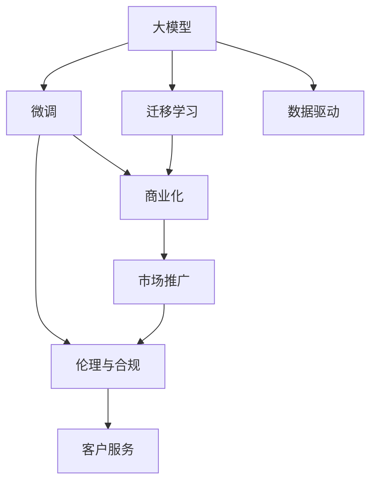

                 

# 大模型创业者的成功与挑战

> 关键词：大模型创业、成功案例、数据驱动、技术创新、商业化挑战、人工智能伦理

## 1. 背景介绍

### 1.1 问题由来
近年来，人工智能(AI)技术的迅猛发展为各行业注入了新活力，也为创业者提供了前所未有的机遇。特别是随着深度学习、自然语言处理(NLP)等领域的突破，大模型(大规模预训练语言模型)的崛起，引发了一场关于未来商业模式的深刻变革。

大模型创业，是指利用大模型技术，结合商业洞察，开发面向特定应用场景的AI解决方案。这种模式以技术为核心竞争力，能够快速迭代、低成本入局，缩短产品开发周期，从而迅速占领市场。但同时，大模型创业也面临诸多挑战，如高昂的数据需求、算力成本、商业化路径等，需要不断探索和突破。

### 1.2 问题核心关键点
大模型创业的成功，关键在于以下三点：

1. **数据驱动的创新**：基于大模型的自然语言理解和生成能力，结合特定领域数据进行微调，快速迭代出适应市场需求的创新产品。
2. **技术协同优化**：深度学习、NLP、软件工程等多学科的协同优化，提升模型的性能和产品的竞争力。
3. **商业模式的探索**：将技术成果转化为可行的商业模式，构建可持续发展的商业生态。

但同时，大模型创业也面临着数据获取、算力成本、知识产权保护等挑战。

## 2. 核心概念与联系

### 2.1 核心概念概述

为更好地理解大模型创业，本节将介绍几个密切相关的核心概念：

- **大模型(Large Language Models, LLMs)**：以自回归(如GPT)或自编码(如BERT)模型为代表的大规模预训练语言模型。通过在大规模无标签文本语料上进行预训练，学习通用的语言表示，具备强大的语言理解和生成能力。
- **微调(Fine-tuning)**：指在预训练模型的基础上，使用下游任务的少量标注数据，通过有监督学习优化模型在特定任务上的性能。
- **迁移学习(Transfer Learning)**：指将一个领域学习到的知识，迁移应用到另一个不同但相关的领域的学习范式。
- **商业化(Commercialization)**：将AI技术转化为商业产品或服务的过程，涉及技术开发、市场推广、客户服务等多个环节。
- **伦理与合规(Ethics & Compliance)**：确保AI产品的开发和应用符合法律法规和社会道德规范，避免滥用和偏见。

这些核心概念之间的逻辑关系可以通过以下Mermaid流程图来展示：



这个流程图展示了大模型创业的核心概念及其之间的关系：

1. 大模型通过预训练获得基础能力。
2. 微调使得通用大模型更好地适应特定任务，在应用场景中取得更优表现。
3. 迁移学习是连接预训练模型与下游任务的桥梁，可以通过微调或直接迁移实现。
4. 商业化将技术成果转化为可持续发展的商业模式。
5. 伦理与合规确保技术应用符合法律法规和社会道德规范。
6. 数据驱动是技术创新的源泉，促进模型的持续优化。

这些概念共同构成了大模型创业的框架，使得技术开发者能够系统性地构建、优化和商业化AI产品。

## 3. 核心算法原理 & 具体操作步骤
### 3.1 算法原理概述

大模型创业的核心算法原理是深度学习和大规模预训练模型技术。其核心思想是：利用大模型强大的自然语言处理能力，结合特定领域的标注数据，进行有监督学习，优化模型性能，最终实现商业化应用。

具体步骤如下：

1. **数据准备**：收集特定领域的数据，并进行标注，构建训练集、验证集和测试集。
2. **模型选择**：选择合适的预训练大模型，如BERT、GPT等，作为基础模型。
3. **模型微调**：在预训练模型的基础上，使用标注数据进行微调，优化模型在特定任务上的性能。
4. **商业化部署**：将微调后的模型集成到商业化产品中，进行市场推广和客户服务。
5. **持续优化**：根据用户反馈和市场变化，不断优化模型和产品，提升用户体验和市场竞争力。

### 3.2 算法步骤详解

以下是详细的操作步骤：

**Step 1: 数据准备**

1. **收集标注数据**：收集特定领域的标注数据，构建训练集、验证集和测试集。标注数据应涵盖尽可能多的应用场景和问题类型。

2. **数据预处理**：对数据进行清洗、归一化、分词等处理，确保数据质量。

3. **划分数据集**：将数据集划分为训练集、验证集和测试集，一般采用80:10:10的比例。

**Step 2: 模型选择**

1. **选择预训练模型**：选择合适的预训练大模型，如BERT、GPT等，作为基础模型。这些模型已经在通用的语言表示上取得了卓越的性能，可以大幅提升特定领域的微调效果。

2. **加载模型**：使用对应的预训练模型库加载模型，如TensorFlow Hub、PyTorch Hub等。

**Step 3: 模型微调**

1. **任务适配层设计**：根据具体任务设计合适的任务适配层，如分类、匹配、生成等。

2. **选择优化器**：选择合适的优化器，如AdamW、SGD等，设置学习率、批大小、迭代轮数等超参数。

3. **模型训练**：在训练集上训练模型，使用验证集评估模型性能，及时调整超参数。

4. **模型测试**：在测试集上评估模型性能，对比微调前后的精度提升。

**Step 4: 商业化部署**

1. **模型集成**：将微调后的模型集成到商业化产品中，如智能客服、金融舆情监测、个性化推荐系统等。

2. **部署环境配置**：根据产品需求配置部署环境，如服务器、存储、网络等。

3. **系统集成**：将模型与现有系统进行集成，确保流畅运行。

**Step 5: 持续优化**

1. **用户反馈收集**：通过用户反馈收集系统的问题和需求。

2. **模型优化**：根据用户反馈和市场变化，优化模型和产品。

3. **迭代发布**：将优化后的模型和产品进行迭代发布，提升用户体验和市场竞争力。

### 3.3 算法优缺点

大模型创业的优势在于：

1. **快速迭代**：利用预训练模型的基础能力，快速迭代出适应市场需求的创新产品。
2. **低成本入局**：相比于从头训练模型，微调可以在已有预训练模型的基础上进行，节省了大量时间和成本。
3. **高性能输出**：微调后的模型通常具有较高的性能，能够更好地适应特定任务。

但同时也存在以下缺点：

1. **数据依赖高**：微调模型对标注数据的需求较高，标注成本也较高。
2. **算力成本高**：预训练模型和微调模型对算力的需求较高，尤其是在大规模模型上。
3. **知识产权问题**：使用预训练模型可能涉及知识产权问题，需要进行合法合规的使用。
4. **伦理风险**：微调模型可能继承预训练模型的偏见和有害信息，需注意伦理风险。

## 4. 数学模型和公式 & 详细讲解 & 举例说明

### 4.1 数学模型构建

假设大模型为 $M_{\theta}$，其中 $\theta$ 为模型参数。给定标注数据集 $D=\{(x_i,y_i)\}_{i=1}^N$，其中 $x_i$ 为输入，$y_i$ 为标签。微调的优化目标是最小化经验风险，即找到最优参数：

$$
\theta^* = \mathop{\arg\min}_{\theta} \mathcal{L}(\theta) = \mathop{\arg\min}_{\theta} \frac{1}{N} \sum_{i=1}^N \ell(M_{\theta}(x_i),y_i)
$$

其中 $\ell$ 为损失函数，如交叉熵损失。

### 4.2 公式推导过程

以二分类任务为例，假设模型 $M_{\theta}$ 在输入 $x$ 上的输出为 $\hat{y}=M_{\theta}(x) \in [0,1]$，表示样本属于正类的概率。真实标签 $y \in \{0,1\}$。则二分类交叉熵损失函数定义为：

$$
\ell(M_{\theta}(x),y) = -[y\log \hat{y} + (1-y)\log (1-\hat{y})]
$$

将其代入经验风险公式，得：

$$
\mathcal{L}(\theta) = -\frac{1}{N}\sum_{i=1}^N [y_i\log M_{\theta}(x_i)+(1-y_i)\log(1-M_{\theta}(x_i))]
$$

根据链式法则，损失函数对参数 $\theta_k$ 的梯度为：

$$
\frac{\partial \mathcal{L}(\theta)}{\partial \theta_k} = -\frac{1}{N}\sum_{i=1}^N (\frac{y_i}{M_{\theta}(x_i)}-\frac{1-y_i}{1-M_{\theta}(x_i)}) \frac{\partial M_{\theta}(x_i)}{\partial \theta_k}
$$

其中 $\frac{\partial M_{\theta}(x_i)}{\partial \theta_k}$ 可进一步递归展开，利用自动微分技术完成计算。

### 4.3 案例分析与讲解

假设我们使用BERT模型对命名实体识别(NER)任务进行微调。数据集包括标注好的文本和标签，模型的输出为文本中每个位置的标注标签。

1. **数据准备**：收集标注好的NER数据集，将文本和标签分成训练集、验证集和测试集。
2. **模型选择**：选择BERT模型，加载预训练模型和任务适配层。
3. **微调**：在训练集上训练模型，使用验证集评估模型性能，调整超参数。
4. **测试**：在测试集上评估模型性能，对比微调前后的精度提升。

## 5. 项目实践：代码实例和详细解释说明

### 5.1 开发环境搭建

在进行微调实践前，我们需要准备好开发环境。以下是使用Python进行PyTorch开发的环境配置流程：

1. 安装Anaconda：从官网下载并安装Anaconda，用于创建独立的Python环境。

2. 创建并激活虚拟环境：
```bash
conda create -n pytorch-env python=3.8 
conda activate pytorch-env
```

3. 安装PyTorch：根据CUDA版本，从官网获取对应的安装命令。例如：
```bash
conda install pytorch torchvision torchaudio cudatoolkit=11.1 -c pytorch -c conda-forge
```

4. 安装Transformers库：
```bash
pip install transformers
```

5. 安装各类工具包：
```bash
pip install numpy pandas scikit-learn matplotlib tqdm jupyter notebook ipython
```

完成上述步骤后，即可在`pytorch-env`环境中开始微调实践。

### 5.2 源代码详细实现

下面我们以命名实体识别(NER)任务为例，给出使用Transformers库对BERT模型进行微调的PyTorch代码实现。

首先，定义NER任务的数据处理函数：

```python
from transformers import BertTokenizer
from torch.utils.data import Dataset
import torch

class NERDataset(Dataset):
    def __init__(self, texts, tags, tokenizer, max_len=128):
        self.texts = texts
        self.tags = tags
        self.tokenizer = tokenizer
        self.max_len = max_len
        
    def __len__(self):
        return len(self.texts)
    
    def __getitem__(self, item):
        text = self.texts[item]
        tags = self.tags[item]
        
        encoding = self.tokenizer(text, return_tensors='pt', max_length=self.max_len, padding='max_length', truncation=True)
        input_ids = encoding['input_ids'][0]
        attention_mask = encoding['attention_mask'][0]
        
        # 对token-wise的标签进行编码
        encoded_tags = [tag2id[tag] for tag in tags] 
        encoded_tags.extend([tag2id['O']] * (self.max_len - len(encoded_tags)))
        labels = torch.tensor(encoded_tags, dtype=torch.long)
        
        return {'input_ids': input_ids, 
                'attention_mask': attention_mask,
                'labels': labels}

# 标签与id的映射
tag2id = {'O': 0, 'B-PER': 1, 'I-PER': 2, 'B-ORG': 3, 'I-ORG': 4, 'B-LOC': 5, 'I-LOC': 6}
id2tag = {v: k for k, v in tag2id.items()}

# 创建dataset
tokenizer = BertTokenizer.from_pretrained('bert-base-cased')

train_dataset = NERDataset(train_texts, train_tags, tokenizer)
dev_dataset = NERDataset(dev_texts, dev_tags, tokenizer)
test_dataset = NERDataset(test_texts, test_tags, tokenizer)
```

然后，定义模型和优化器：

```python
from transformers import BertForTokenClassification, AdamW

model = BertForTokenClassification.from_pretrained('bert-base-cased', num_labels=len(tag2id))

optimizer = AdamW(model.parameters(), lr=2e-5)
```

接着，定义训练和评估函数：

```python
from torch.utils.data import DataLoader
from tqdm import tqdm
from sklearn.metrics import classification_report

device = torch.device('cuda') if torch.cuda.is_available() else torch.device('cpu')
model.to(device)

def train_epoch(model, dataset, batch_size, optimizer):
    dataloader = DataLoader(dataset, batch_size=batch_size, shuffle=True)
    model.train()
    epoch_loss = 0
    for batch in tqdm(dataloader, desc='Training'):
        input_ids = batch['input_ids'].to(device)
        attention_mask = batch['attention_mask'].to(device)
        labels = batch['labels'].to(device)
        model.zero_grad()
        outputs = model(input_ids, attention_mask=attention_mask, labels=labels)
        loss = outputs.loss
        epoch_loss += loss.item()
        loss.backward()
        optimizer.step()
    return epoch_loss / len(dataloader)

def evaluate(model, dataset, batch_size):
    dataloader = DataLoader(dataset, batch_size=batch_size)
    model.eval()
    preds, labels = [], []
    with torch.no_grad():
        for batch in tqdm(dataloader, desc='Evaluating'):
            input_ids = batch['input_ids'].to(device)
            attention_mask = batch['attention_mask'].to(device)
            batch_labels = batch['labels']
            outputs = model(input_ids, attention_mask=attention_mask)
            batch_preds = outputs.logits.argmax(dim=2).to('cpu').tolist()
            batch_labels = batch_labels.to('cpu').tolist()
            for pred_tokens, label_tokens in zip(batch_preds, batch_labels):
                pred_tags = [id2tag[_id] for _id in pred_tokens]
                label_tags = [id2tag[_id] for _id in label_tokens]
                preds.append(pred_tags[:len(label_tags)])
                labels.append(label_tags)
                
    print(classification_report(labels, preds))
```

最后，启动训练流程并在测试集上评估：

```python
epochs = 5
batch_size = 16

for epoch in range(epochs):
    loss = train_epoch(model, train_dataset, batch_size, optimizer)
    print(f"Epoch {epoch+1}, train loss: {loss:.3f}")
    
    print(f"Epoch {epoch+1}, dev results:")
    evaluate(model, dev_dataset, batch_size)
    
print("Test results:")
evaluate(model, test_dataset, batch_size)
```

以上就是使用PyTorch对BERT进行命名实体识别任务微调的完整代码实现。可以看到，得益于Transformers库的强大封装，我们可以用相对简洁的代码完成BERT模型的加载和微调。

### 5.3 代码解读与分析

让我们再详细解读一下关键代码的实现细节：

**NERDataset类**：
- `__init__`方法：初始化文本、标签、分词器等关键组件。
- `__len__`方法：返回数据集的样本数量。
- `__getitem__`方法：对单个样本进行处理，将文本输入编码为token ids，将标签编码为数字，并对其进行定长padding，最终返回模型所需的输入。

**tag2id和id2tag字典**：
- 定义了标签与数字id之间的映射关系，用于将token-wise的预测结果解码回真实的标签。

**训练和评估函数**：
- 使用PyTorch的DataLoader对数据集进行批次化加载，供模型训练和推理使用。
- 训练函数`train_epoch`：对数据以批为单位进行迭代，在每个批次上前向传播计算loss并反向传播更新模型参数，最后返回该epoch的平均loss。
- 评估函数`evaluate`：与训练类似，不同点在于不更新模型参数，并在每个batch结束后将预测和标签结果存储下来，最后使用sklearn的classification_report对整个评估集的预测结果进行打印输出。

**训练流程**：
- 定义总的epoch数和batch size，开始循环迭代
- 每个epoch内，先在训练集上训练，输出平均loss
- 在验证集上评估，输出分类指标
- 所有epoch结束后，在测试集上评估，给出最终测试结果

可以看到，PyTorch配合Transformers库使得BERT微调的代码实现变得简洁高效。开发者可以将更多精力放在数据处理、模型改进等高层逻辑上，而不必过多关注底层的实现细节。

当然，工业级的系统实现还需考虑更多因素，如模型的保存和部署、超参数的自动搜索、更灵活的任务适配层等。但核心的微调范式基本与此类似。

## 6. 实际应用场景
### 6.1 智能客服系统

基于大语言模型微调的对话技术，可以广泛应用于智能客服系统的构建。传统客服往往需要配备大量人力，高峰期响应缓慢，且一致性和专业性难以保证。而使用微调后的对话模型，可以7x24小时不间断服务，快速响应客户咨询，用自然流畅的语言解答各类常见问题。

在技术实现上，可以收集企业内部的历史客服对话记录，将问题和最佳答复构建成监督数据，在此基础上对预训练对话模型进行微调。微调后的对话模型能够自动理解用户意图，匹配最合适的答案模板进行回复。对于客户提出的新问题，还可以接入检索系统实时搜索相关内容，动态组织生成回答。如此构建的智能客服系统，能大幅提升客户咨询体验和问题解决效率。

### 6.2 金融舆情监测

金融机构需要实时监测市场舆论动向，以便及时应对负面信息传播，规避金融风险。传统的人工监测方式成本高、效率低，难以应对网络时代海量信息爆发的挑战。基于大语言模型微调的文本分类和情感分析技术，为金融舆情监测提供了新的解决方案。

具体而言，可以收集金融领域相关的新闻、报道、评论等文本数据，并对其进行主题标注和情感标注。在此基础上对预训练语言模型进行微调，使其能够自动判断文本属于何种主题，情感倾向是正面、中性还是负面。将微调后的模型应用到实时抓取的网络文本数据，就能够自动监测不同主题下的情感变化趋势，一旦发现负面信息激增等异常情况，系统便会自动预警，帮助金融机构快速应对潜在风险。

### 6.3 个性化推荐系统

当前的推荐系统往往只依赖用户的历史行为数据进行物品推荐，无法深入理解用户的真实兴趣偏好。基于大语言模型微调技术，个性化推荐系统可以更好地挖掘用户行为背后的语义信息，从而提供更精准、多样的推荐内容。

在实践中，可以收集用户浏览、点击、评论、分享等行为数据，提取和用户交互的物品标题、描述、标签等文本内容。将文本内容作为模型输入，用户的后续行为（如是否点击、购买等）作为监督信号，在此基础上微调预训练语言模型。微调后的模型能够从文本内容中准确把握用户的兴趣点。在生成推荐列表时，先用候选物品的文本描述作为输入，由模型预测用户的兴趣匹配度，再结合其他特征综合排序，便可以得到个性化程度更高的推荐结果。

### 6.4 未来应用展望

随着大语言模型微调技术的发展，未来其在更多领域的应用前景广阔。

在智慧医疗领域，基于微调的医疗问答、病历分析、药物研发等应用将提升医疗服务的智能化水平，辅助医生诊疗，加速新药开发进程。

在智能教育领域，微调技术可应用于作业批改、学情分析、知识推荐等方面，因材施教，促进教育公平，提高教学质量。

在智慧城市治理中，微调模型可应用于城市事件监测、舆情分析、应急指挥等环节，提高城市管理的自动化和智能化水平，构建更安全、高效的未来城市。

此外，在企业生产、社会治理、文娱传媒等众多领域，基于大模型微调的人工智能应用也将不断涌现，为经济社会发展注入新的动力。相信随着预训练语言模型和微调方法的持续演进，大模型微调技术必将在构建人机协同的智能时代中扮演越来越重要的角色。

## 7. 工具和资源推荐
### 7.1 学习资源推荐

为了帮助开发者系统掌握大模型微调的理论基础和实践技巧，这里推荐一些优质的学习资源：

1. 《Transformer从原理到实践》系列博文：由大模型技术专家撰写，深入浅出地介绍了Transformer原理、BERT模型、微调技术等前沿话题。

2. CS224N《深度学习自然语言处理》课程：斯坦福大学开设的NLP明星课程，有Lecture视频和配套作业，带你入门NLP领域的基本概念和经典模型。

3. 《Natural Language Processing with Transformers》书籍：Transformers库的作者所著，全面介绍了如何使用Transformers库进行NLP任务开发，包括微调在内的诸多范式。

4. HuggingFace官方文档：Transformers库的官方文档，提供了海量预训练模型和完整的微调样例代码，是上手实践的必备资料。

5. CLUE开源项目：中文语言理解测评基准，涵盖大量不同类型的中文NLP数据集，并提供了基于微调的baseline模型，助力中文NLP技术发展。

通过对这些资源的学习实践，相信你一定能够快速掌握大语言模型微调的精髓，并用于解决实际的NLP问题。
###  7.2 开发工具推荐

高效的开发离不开优秀的工具支持。以下是几款用于大语言模型微调开发的常用工具：

1. PyTorch：基于Python的开源深度学习框架，灵活动态的计算图，适合快速迭代研究。大部分预训练语言模型都有PyTorch版本的实现。

2. TensorFlow：由Google主导开发的开源深度学习框架，生产部署方便，适合大规模工程应用。同样有丰富的预训练语言模型资源。

3. Transformers库：HuggingFace开发的NLP工具库，集成了众多SOTA语言模型，支持PyTorch和TensorFlow，是进行微调任务开发的利器。

4. Weights & Biases：模型训练的实验跟踪工具，可以记录和可视化模型训练过程中的各项指标，方便对比和调优。与主流深度学习框架无缝集成。

5. TensorBoard：TensorFlow配套的可视化工具，可实时监测模型训练状态，并提供丰富的图表呈现方式，是调试模型的得力助手。

6. Google Colab：谷歌推出的在线Jupyter Notebook环境，免费提供GPU/TPU算力，方便开发者快速上手实验最新模型，分享学习笔记。

合理利用这些工具，可以显著提升大语言模型微调任务的开发效率，加快创新迭代的步伐。

### 7.3 相关论文推荐

大语言模型和微调技术的发展源于学界的持续研究。以下是几篇奠基性的相关论文，推荐阅读：

1. Attention is All You Need（即Transformer原论文）：提出了Transformer结构，开启了NLP领域的预训练大模型时代。

2. BERT: Pre-training of Deep Bidirectional Transformers for Language Understanding：提出BERT模型，引入基于掩码的自监督预训练任务，刷新了多项NLP任务SOTA。

3. Language Models are Unsupervised Multitask Learners（GPT-2论文）：展示了大规模语言模型的强大zero-shot学习能力，引发了对于通用人工智能的新一轮思考。

4. Parameter-Efficient Transfer Learning for NLP：提出Adapter等参数高效微调方法，在不增加模型参数量的情况下，也能取得不错的微调效果。

5. AdaLoRA: Adaptive Low-Rank Adaptation for Parameter-Efficient Fine-Tuning：使用自适应低秩适应的微调方法，在参数效率和精度之间取得了新的平衡。

这些论文代表了大语言模型微调技术的发展脉络。通过学习这些前沿成果，可以帮助研究者把握学科前进方向，激发更多的创新灵感。

## 8. 总结：未来发展趋势与挑战

### 8.1 总结

本文对大模型创业的成功与挑战进行了全面系统的介绍。首先阐述了大模型创业的背景和意义，明确了数据驱动和算法创新的核心价值。其次，从原理到实践，详细讲解了微调模型和大模型创业的技术实现流程，给出了微调任务开发的完整代码实例。同时，本文还广泛探讨了微调方法在智能客服、金融舆情、个性化推荐等多个行业领域的应用前景，展示了微调范式的巨大潜力。此外，本文精选了微调技术的各类学习资源，力求为开发者提供全方位的技术指引。

通过本文的系统梳理，可以看到，大模型创业结合了技术创新和商业洞察，具备强大的市场竞争力。但同时，大模型创业也面临诸多挑战，如高昂的数据需求、算力成本、商业化路径等，需要不断探索和突破。

### 8.2 未来发展趋势

展望未来，大模型创业将呈现以下几个发展趋势：

1. **数据驱动的创新**：基于大规模标注数据和实际应用场景，进一步优化微调模型，提升其适应性。
2. **技术协同优化**：深度学习、NLP、软件工程等多学科的协同优化，提升模型的性能和产品的竞争力。
3. **商业模式的探索**：结合大数据、云计算等技术，构建多层次、多渠道的商业生态。
4. **伦理与合规**：在模型训练和应用中融入伦理导向，确保AI技术的健康发展。
5. **持续学习**：采用在线学习、增量学习等技术，使模型能够不断学习新知识，适应不断变化的市场需求。
6. **跨领域融合**：与其他AI技术进行更深入的融合，如知识图谱、因果推理、强化学习等，多路径协同发力，共同推动自然语言理解和智能交互系统的进步。

以上趋势凸显了大模型创业的广阔前景。这些方向的探索发展，必将进一步提升AI产品的性能和应用范围，为经济社会发展注入新的动力。

### 8.3 面临的挑战

尽管大模型创业取得了不少成就，但在迈向更加智能化、普适化应用的过程中，仍面临诸多挑战：

1. **数据依赖高**：大模型微调对标注数据的需求较高，标注成本也较高。如何降低数据获取成本，提高数据质量，是创业团队面临的重要问题。
2. **算力成本高**：预训练模型和微调模型对算力的需求较高，尤其是在大规模模型上。如何降低算力成本，提高模型效率，是亟待解决的技术难题。
3. **知识产权问题**：使用预训练模型可能涉及知识产权问题，需要进行合法合规的使用。如何在创新中保持合规，避免知识产权纠纷，是创业团队必须关注的问题。
4. **伦理风险**：微调模型可能继承预训练模型的偏见和有害信息，需注意伦理风险。如何在模型训练和应用中融入伦理导向，确保AI技术的健康发展，是重要的研究方向。
5. **市场推广**：如何将技术成果转化为可行的商业模式，构建可持续发展的商业生态，是创业团队必须解决的实际问题。
6. **持续优化**：随着市场和用户需求的变化，模型和产品需要进行持续优化和迭代，保持竞争力。如何高效进行模型优化和产品迭代，是创业团队面临的挑战。

正视这些挑战，积极应对并寻求突破，将是大模型创业成功的关键。相信随着学界和产业界的共同努力，这些挑战终将一一被克服，大模型创业必将在构建人机协同的智能时代中扮演越来越重要的角色。

### 8.4 研究展望

面对大模型创业所面临的诸多挑战，未来的研究需要在以下几个方面寻求新的突破：

1. **数据驱动的创新**：探索无监督和半监督微调方法，降低对标注数据的需求，充分利用非结构化数据进行模型优化。
2. **技术协同优化**：开发更加参数高效的微调方法，如Prefix-Tuning、LoRA等，在参数效率和精度之间取得新的平衡。
3. **跨领域融合**：与其他AI技术进行更深入的融合，如知识图谱、因果推理、强化学习等，提升模型的综合能力和应用范围。
4. **伦理与合规**：在模型训练和应用中融入伦理导向，确保AI技术的健康发展。
5. **持续学习**：采用在线学习、增量学习等技术，使模型能够不断学习新知识，适应不断变化的市场需求。
6. **模型裁剪与压缩**：采用模型裁剪、量化加速等技术，降低模型大小和计算成本，提高模型效率。
7. **跨模态融合**：将视觉、语音、文本等多模态信息进行融合，提升模型的理解能力和应用范围。

这些研究方向的探索，必将引领大模型创业技术的不断进步，为经济社会发展注入新的动力。面向未来，大模型创业需要不断地创新和突破，才能在构建人机协同的智能时代中扮演越来越重要的角色。

## 9. 附录：常见问题与解答

**Q1：大模型创业是否适用于所有NLP任务？**

A: 大模型微调在大多数NLP任务上都能取得不错的效果，特别是对于数据量较小的任务。但对于一些特定领域的任务，如医学、法律等，仅仅依靠通用语料预训练的模型可能难以很好地适应。此时需要在特定领域语料上进一步预训练，再进行微调，才能获得理想效果。此外，对于一些需要时效性、个性化很强的任务，如对话、推荐等，微调方法也需要针对性的改进优化。

**Q2：微调过程中如何选择合适的学习率？**

A: 微调的学习率一般要比预训练时小1-2个数量级，如果使用过大的学习率，容易破坏预训练权重，导致过拟合。一般建议从1e-5开始调参，逐步减小学习率，直至收敛。也可以使用warmup策略，在开始阶段使用较小的学习率，再逐渐过渡到预设值。需要注意的是，不同的优化器(如AdamW、Adafactor等)以及不同的学习率调度策略，可能需要设置不同的学习率阈值。

**Q3：采用大模型微调时会面临哪些资源瓶颈？**

A: 目前主流的预训练大模型动辄以亿计的参数规模，对算力、内存、存储都提出了很高的要求。GPU/TPU等高性能设备是必不可少的，但即便如此，超大批次的训练和推理也可能遇到显存不足的问题。因此需要采用一些资源优化技术，如梯度积累、混合精度训练、模型并行等，来突破硬件瓶颈。同时，模型的存储和读取也可能占用大量时间和空间，需要采用模型压缩、稀疏化存储等方法进行优化。

**Q4：如何缓解微调过程中的过拟合问题？**

A: 过拟合是微调面临的主要挑战，尤其是在标注数据不足的情况下。常见的缓解策略包括：
1. 数据增强：通过回译、近义替换等方式扩充训练集
2. 正则化：使用L2正则、Dropout、Early Stopping等避免过拟合
3. 对抗训练：引入对抗样本，提高模型鲁棒性
4. 参数高效微调：只调整少量参数(如Adapter、Prefix等)，减小过拟合风险
5. 多模型集成：训练多个微调模型，取平均输出，抑制过拟合

这些策略往往需要根据具体任务和数据特点进行灵活组合。只有在数据、模型、训练、推理等各环节进行全面优化，才能最大限度地发挥大模型微调的威力。

**Q5：微调模型在落地部署时需要注意哪些问题？**

A: 将微调模型转化为实际应用，还需要考虑以下因素：
1. 模型裁剪：去除不必要的层和参数，减小模型尺寸，加快推理速度
2. 量化加速：将浮点模型转为定点模型，压缩存储空间，提高计算效率
3. 服务化封装：将模型封装为标准化服务接口，便于集成调用
4. 弹性伸缩：根据请求流量动态调整资源配置，平衡服务质量和成本
5. 监控告警：实时采集系统指标，设置异常告警阈值，确保服务稳定性
6. 安全防护：采用访问鉴权、数据脱敏等措施，保障数据和模型安全

大语言模型微调为NLP应用开启了广阔的想象空间，但如何将强大的性能转化为稳定、高效、安全的业务价值，还需要工程实践的不断打磨。唯有从数据、算法、工程、业务等多个维度协同发力，才能真正实现人工智能技术在垂直行业的规模化落地。总之，微调需要开发者根据具体任务，不断迭代和优化模型、数据和算法，方能得到理想的效果。

---

作者：禅与计算机程序设计艺术 / Zen and the Art of Computer Programming

