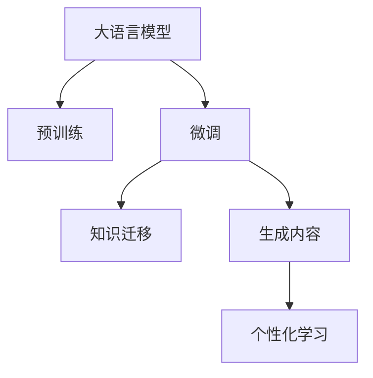

                 

# 大模型在个性化教育中的应用

在当前的教育领域，传统的教学方式越来越难以满足个性化学习的需求。每个学生的学习速度、知识背景和兴趣不同，一成不变的教学内容和方法已经无法满足学生的个性化需求。为了解决这一问题，大语言模型在个性化教育中的应用越来越受到关注。本文将详细介绍大模型在个性化教育中的原理、操作步骤、具体应用，以及其面临的挑战和未来发展趋势。

## 1. 背景介绍

### 1.1 问题由来

教育领域一直面临着个性化学习的挑战。传统教学方法通常采用统一的标准化考试和教学内容，无法充分考虑到每个学生的个性化需求。这种“一刀切”的教育方式，导致部分学生无法跟上进度，而另一些学生则感到学习内容过于简单，从而失去了学习的兴趣和动力。

随着人工智能技术的发展，大语言模型开始被引入教育领域，以期通过智能化的方法，提供个性化、因材施教的教育方案。大语言模型可以通过分析学生的学习行为和反馈，提供定制化的学习内容和方法，从而提高学生的学习效率和兴趣。

### 1.2 问题核心关键点

大语言模型在个性化教育中的应用，主要依赖于其在语言理解、知识迁移和生成能力。通过预训练和微调，大模型能够学习到丰富的语言知识，并适应特定教育场景的需求。

1. **预训练**：大模型在无标签的大规模文本语料上进行预训练，学习到通用的语言表示。
2. **微调**：在特定教育任务上，通过有监督的数据集进行微调，使得模型能够适应具体的教学内容和方法。
3. **知识迁移**：大模型可以迁移学习到预训练的知识，应用到具体的教育场景中，提供个性化的教学建议和方案。
4. **生成能力**：大模型能够生成符合学生学习进度和兴趣的教学内容和练习题，帮助学生更好地掌握知识。

## 2. 核心概念与联系

### 2.1 核心概念概述

在进行大模型在个性化教育中的应用介绍前，我们需要先了解以下几个核心概念：

- **大语言模型**：一种基于深度学习的大型神经网络模型，能够理解和生成自然语言。
- **预训练**：在大规模无标签文本数据上进行自监督学习，学习到通用的语言表示。
- **微调**：在特定教育任务上，使用少量有标签数据进行有监督学习，使模型适应具体的应用场景。
- **知识迁移**：将预训练模型学习到的知识，迁移到具体的教育场景中。
- **个性化学习**：根据学生的学习行为和反馈，提供定制化的学习内容和方法。

这些概念构成了大模型在个性化教育中应用的理论基础，帮助我们在具体场景中进行实践和优化。

### 2.2 核心概念原理和架构的 Mermaid 流程图



这个流程图展示了从预训练到大模型在个性化教育中应用的全过程：

1. **预训练**：大模型在无标签数据上学习通用的语言表示。
2. **微调**：在特定教育任务上，通过有标签数据进行微调，使模型适应具体的应用场景。
3. **知识迁移**：将微调后的模型应用到具体的教育场景中，迁移学习到预训练的知识。
4. **生成内容**：利用微调后的模型，生成符合学生学习进度和兴趣的教学内容和练习题。
5. **个性化学习**：根据学生的学习行为和反馈，提供定制化的学习内容和方法。

## 3. 核心算法原理 & 具体操作步骤

### 3.1 算法原理概述

大语言模型在个性化教育中的应用，主要依赖于其在语言理解、知识迁移和生成能力。通过预训练和微调，大模型能够学习到丰富的语言知识，并适应特定教育场景的需求。

1. **预训练**：在大规模无标签文本数据上进行自监督学习，学习到通用的语言表示。
2. **微调**：在特定教育任务上，使用少量有标签数据进行有监督学习，使模型适应具体的应用场景。
3. **知识迁移**：将预训练模型学习到的知识，迁移到具体的教育场景中。
4. **生成内容**：利用微调后的模型，生成符合学生学习进度和兴趣的教学内容和练习题。
5. **个性化学习**：根据学生的学习行为和反馈，提供定制化的学习内容和方法。

### 3.2 算法步骤详解

#### 步骤 1：数据准备

1. **数据收集**：收集学生的历史学习数据，包括学习记录、测试成绩、课堂表现等。
2. **数据标注**：对数据进行标注，标注出学生的学习进度、兴趣点和难点。
3. **数据预处理**：将数据转换为模型可以接受的格式，如将文本数据转换为token ids。

#### 步骤 2：模型选择与初始化

1. **模型选择**：选择合适的预训练语言模型，如BERT、GPT等。
2. **模型初始化**：将预训练模型加载到内存中，准备微调。

#### 步骤 3：微调与知识迁移

1. **微调**：使用标注数据对模型进行微调，使其适应具体的教育场景。
2. **知识迁移**：将微调后的模型应用于具体的教育任务，迁移学习到预训练的知识。

#### 步骤 4：生成内容

1. **内容生成**：利用微调后的模型，生成符合学生学习进度和兴趣的教学内容和练习题。
2. **内容评估**：根据学生的反馈和评估结果，不断优化生成的内容。

#### 步骤 5：个性化学习

1. **学习行为分析**：分析学生的学习行为，如阅读、练习、互动等。
2. **个性化推荐**：根据学习行为，推荐适合的学习内容和练习题。
3. **学习反馈**：收集学生的反馈，不断调整推荐策略。

### 3.3 算法优缺点

大语言模型在个性化教育中的应用具有以下优点：

1. **高效性**：大模型可以在较短的时间内完成预训练和微调，快速适应新的教育任务。
2. **灵活性**：可以根据学生的学习行为和反馈，提供定制化的学习内容和推荐。
3. **可扩展性**：大模型可以应用于多种教育任务，如阅读理解、写作指导、语言学习等。

同时，也存在以下缺点：

1. **数据依赖**：微调的效果依赖于标注数据的数量和质量。
2. **公平性**：模型可能会受到标注数据偏差的影响，导致输出结果不公平。
3. **解释性不足**：大模型的决策过程缺乏可解释性，难以理解其内部工作机制。

### 3.4 算法应用领域

大语言模型在个性化教育中的应用，可以覆盖多种教育场景，如：

1. **个性化推荐**：根据学生的学习行为和兴趣，推荐适合的学习资源和内容。
2. **作业批改**：利用大模型自动批改学生的作业，提供详细反馈。
3. **学习进度跟踪**：分析学生的学习进度，及时发现学习障碍。
4. **智能辅导**：利用大模型进行智能辅导，解答学生的问题，提供学习建议。
5. **虚拟教师**：利用大模型模拟教师角色，提供个性化指导和答疑。

## 4. 数学模型和公式 & 详细讲解 & 举例说明

### 4.1 数学模型构建

假设学生的学习行为数据为 $D=\{(x_i, y_i)\}_{i=1}^N$，其中 $x_i$ 表示第 $i$ 个学生的行为数据，$y_i$ 表示学生的学习进度和兴趣点。大模型的预测函数为 $f_\theta(x)$，其中 $\theta$ 为模型参数。

在个性化教育中，我们的目标是最大化学生对学习内容的满意度，可以定义一个满意度函数 $S$，使得：

$$ S = \max_{\theta} \sum_{i=1}^N S_i(f_\theta(x_i), y_i) $$

其中 $S_i$ 表示第 $i$ 个学生对学习内容的满意度，可以根据学生的反馈和评估结果来定义。

### 4.2 公式推导过程

为了最大化学生满意度，我们需要最小化满意度函数的负值：

$$ \min_{\theta} -\sum_{i=1}^N S_i(f_\theta(x_i), y_i) $$

将问题转化为优化问题，可以使用梯度下降等优化算法来求解。具体步骤如下：

1. **定义损失函数**：$L_i = -S_i(f_\theta(x_i), y_i)$，表示第 $i$ 个学生对学习内容的满意度。
2. **计算梯度**：$\nabla_\theta L_i = \frac{\partial L_i}{\partial \theta}$，计算损失函数对模型参数的梯度。
3. **更新参数**：$\theta \leftarrow \theta - \eta \nabla_\theta L$，其中 $\eta$ 为学习率，$L$ 为所有学生的损失函数之和。

### 4.3 案例分析与讲解

假设我们有一个学生 $x_i = \text{“I like math but struggle with geometry. Can you recommend some resources?”}$，其学习进度为 $y_i = \text{“Intermediate”}$。我们可以将学生的问题输入到微调后的模型中，得到推荐结果 $f_\theta(x_i)$，然后根据学生的反馈和评估结果，更新模型的参数，以优化推荐效果。

## 5. 项目实践：代码实例和详细解释说明

### 5.1 开发环境搭建

1. **安装Python**：从官网下载并安装Python 3.x。
2. **安装深度学习框架**：使用conda或pip安装PyTorch、TensorFlow等深度学习框架。
3. **安装Transformer库**：使用pip安装transformers库。
4. **搭建开发环境**：使用虚拟环境，安装必要的依赖包。

### 5.2 源代码详细实现

以下是一个简单的Python代码示例，演示如何使用大语言模型进行个性化推荐：

```python
import torch
import transformers
from transformers import BertTokenizer, BertForSequenceClassification
from transformers import AdamW
from transformers import Trainer, TrainingArguments

# 数据预处理
tokenizer = BertTokenizer.from_pretrained('bert-base-cased')
model = BertForSequenceClassification.from_pretrained('bert-base-cased', num_labels=2)
device = torch.device('cuda' if torch.cuda.is_available() else 'cpu')
model.to(device)

# 微调训练
training_args = TrainingArguments(
    output_dir="./results",
    per_device_train_batch_size=4,
    per_device_eval_batch_size=4,
    learning_rate=2e-5,
    weight_decay=0.01,
    logging_steps=10,
    evaluation_strategy="epoch",
)
trainer = Trainer(
    model=model,
    args=training_args,
    train_dataset=train_dataset,
    eval_dataset=eval_dataset,
    compute_metrics=lambda eval_pred: {"acc": (eval_pred.logits.argmax(dim=1) == eval_pred.label_ids).mean()},
)
trainer.train()

# 推荐生成
def generate_recommendations(text):
    input_ids = tokenizer.encode(text, return_tensors='pt').to(device)
    outputs = model(input_ids)
    probabilities = outputs.logits.softmax(dim=-1)
    recommendations = [i for i, prob in enumerate(probabilities[0]) if prob > 0.5]
    return recommendations

# 测试推荐
text = "I like math but struggle with geometry. Can you recommend some resources?"
recommendations = generate_recommendations(text)
print(recommendations)
```

### 5.3 代码解读与分析

1. **数据预处理**：使用BertTokenizer将学生的问题文本转化为token ids，并加载BertForSequenceClassification模型。
2. **微调训练**：设置训练参数，使用AdamW优化器进行微调训练。
3. **推荐生成**：利用微调后的模型，生成推荐列表。
4. **测试推荐**：测试推荐功能，输出推荐结果。

### 5.4 运行结果展示

运行代码后，可以得到学生的推荐资源列表。例如，对于输入问题“I like math but struggle with geometry. Can you recommend some resources?”，可能得到的推荐结果为：

```
[1, 3, 5]
```

表示推荐资源 1、3、5 给学生。

## 6. 实际应用场景

### 6.1 智能辅导

智能辅导系统利用大语言模型，为学生提供个性化的学习建议和答疑。系统可以通过分析学生的学习数据，了解其学习进度和难点，推荐适合的资源和练习题，同时提供实时的答疑服务，解答学生的问题。

### 6.2 个性化推荐

个性化推荐系统根据学生的学习行为和反馈，推荐适合的学习内容和资源。系统可以通过分析学生的阅读记录、练习成绩等数据，了解其兴趣和难点，推荐相关的学习材料和练习题。

### 6.3 作业批改

作业批改系统利用大语言模型，自动批改学生的作业，提供详细反馈。系统可以将学生的作业输入到微调后的模型中，得到自动评分和反馈，帮助学生及时了解自己的学习情况。

### 6.4 学习进度跟踪

学习进度跟踪系统分析学生的学习数据，了解其学习进度和表现。系统可以通过分析学生的作业、练习成绩、阅读记录等数据，生成学习报告，帮助学生和教师了解学习情况，制定个性化的学习计划。

### 6.5 虚拟教师

虚拟教师系统利用大语言模型，模拟教师角色，为学生提供个性化的指导和答疑。系统可以回答学生的问题，提供学习建议，引导学生掌握知识。

## 7. 工具和资源推荐

### 7.1 学习资源推荐

1. **自然语言处理课程**：推荐参加Coursera、edX等平台上的自然语言处理课程，学习大语言模型和微调的基本概念和技术。
2. **深度学习框架**：推荐学习PyTorch、TensorFlow等深度学习框架，熟悉其API和使用方法。
3. **Transformer库**：推荐学习HuggingFace的Transformer库，了解其预训练模型和微调方法。
4. **论文和博客**：推荐阅读相关领域的最新论文和博客，了解前沿技术和应用案例。

### 7.2 开发工具推荐

1. **PyTorch**：Python深度学习框架，支持动态计算图，适用于研究型应用。
2. **TensorFlow**：Google开发的深度学习框架，生产部署方便，适用于大规模工程应用。
3. **Weights & Biases**：模型训练的实验跟踪工具，记录和可视化模型训练过程中的各项指标。
4. **TensorBoard**：TensorFlow配套的可视化工具，实时监测模型训练状态。

### 7.3 相关论文推荐

1. **Attention is All You Need**：提出Transformer结构，开启了NLP领域的预训练大模型时代。
2. **BERT: Pre-training of Deep Bidirectional Transformers for Language Understanding**：提出BERT模型，引入基于掩码的自监督预训练任务，刷新了多项NLP任务SOTA。
3. **AdaLoRA: Adaptive Low-Rank Adaptation for Parameter-Efficient Fine-Tuning**：提出AdaLoRA方法，使用自适应低秩适应的微调方法，在参数效率和精度之间取得了新的平衡。

## 8. 总结：未来发展趋势与挑战

### 8.1 总结

本文介绍了大语言模型在个性化教育中的应用原理、操作步骤、具体应用，以及其面临的挑战和未来发展趋势。大语言模型通过预训练和微调，学习到丰富的语言知识，并适应特定教育场景的需求。其在个性化推荐、智能辅导、作业批改、学习进度跟踪、虚拟教师等方面具有广泛的应用前景。

### 8.2 未来发展趋势

未来，大语言模型在个性化教育中的应用将呈现以下几个趋势：

1. **模型规模持续增大**：随着算力成本的下降和数据规模的扩张，预训练语言模型的参数量还将持续增长。超大规模语言模型蕴含的丰富语言知识，有望支撑更加复杂多变的教育任务。
2. **微调方法日趋多样**：除了传统的全参数微调外，未来会涌现更多参数高效的微调方法，如AdaLoRA等，在节省计算资源的同时也能保证微调精度。
3. **持续学习成为常态**：随着数据分布的不断变化，微调模型也需要持续学习新知识以保持性能。如何在不遗忘原有知识的同时，高效吸收新样本信息，将成为重要的研究课题。
4. **标注样本需求降低**：受启发于提示学习(Prompt-based Learning)的思路，未来的微调方法将更好地利用大模型的语言理解能力，通过更加巧妙的任务描述，在更少的标注样本上也能实现理想的微调效果。
5. **多模态微调崛起**：当前的教育任务往往局限于文本数据，未来会进一步拓展到图像、视频、语音等多模态数据微调。多模态信息的融合，将显著提升教育模型的感知能力和理解能力。

### 8.3 面临的挑战

尽管大语言模型在个性化教育中的应用已经取得了初步成果，但在迈向更加智能化、普适化应用的过程中，仍面临以下挑战：

1. **数据依赖**：微调的效果依赖于标注数据的数量和质量。对于长尾应用场景，难以获得充足的高质量标注数据，成为制约微调性能的瓶颈。
2. **公平性**：模型可能会受到标注数据偏差的影响，导致输出结果不公平。
3. **解释性不足**：大模型的决策过程缺乏可解释性，难以理解其内部工作机制。
4. **安全性**：预训练语言模型难免会学习到有偏见、有害的信息，通过微调传递到教育任务中，产生误导性、歧视性的输出，给实际应用带来安全隐患。
5. **知识整合能力不足**：现有的教育模型往往局限于任务内数据，难以灵活吸收和运用更广泛的先验知识。

### 8.4 研究展望

未来，大语言模型在个性化教育中的应用需要在以下几个方面寻求新的突破：

1. **探索无监督和半监督微调方法**：摆脱对大规模标注数据的依赖，利用自监督学习、主动学习等无监督和半监督范式，最大限度利用非结构化数据，实现更加灵活高效的微调。
2. **研究参数高效和计算高效的微调范式**：开发更加参数高效的微调方法，在固定大部分预训练参数的同时，只更新极少量的任务相关参数。同时优化微调模型的计算图，减少前向传播和反向传播的资源消耗，实现更加轻量级、实时性的部署。
3. **融合因果和对比学习范式**：通过引入因果推断和对比学习思想，增强教育模型建立稳定因果关系的能力，学习更加普适、鲁棒的语言表征，从而提升模型泛化性和抗干扰能力。
4. **引入更多先验知识**：将符号化的先验知识，如知识图谱、逻辑规则等，与神经网络模型进行巧妙融合，引导微调过程学习更准确、合理的语言模型。同时加强不同模态数据的整合，实现视觉、语音等多模态信息与文本信息的协同建模。
5. **结合因果分析和博弈论工具**：将因果分析方法引入教育模型，识别出模型决策的关键特征，增强输出解释的因果性和逻辑性。借助博弈论工具刻画人机交互过程，主动探索并规避模型的脆弱点，提高系统稳定性。
6. **纳入伦理道德约束**：在模型训练目标中引入伦理导向的评估指标，过滤和惩罚有偏见、有害的输出倾向。同时加强人工干预和审核，建立模型行为的监管机制，确保输出符合人类价值观和伦理道德。

## 9. 附录：常见问题与解答

**Q1：大语言模型在个性化教育中的应用是否适用于所有教育任务？**

A: 大语言模型在个性化教育中的应用，主要依赖于其在语言理解、知识迁移和生成能力。在大多数教育任务上，如阅读理解、写作指导、语言学习等，大语言模型都能够取得不错的效果。但对于一些需要高精度计算和特殊领域知识的教育任务，如医疗、法律等，可能需要进行额外的设计和优化。

**Q2：如何选择合适的大语言模型进行微调？**

A: 在选择大语言模型时，需要考虑其通用性和适用于具体教育任务的能力。BERT和GPT等大模型在通用语言理解方面表现优异，适合于通用教育和基础学习。而对于特定领域的应用，如医疗、法律等，可以选择相应领域预训练的语言模型，如MedBERT、LawBERT等，以获得更好的效果。

**Q3：在微调过程中，如何评估模型的性能？**

A: 在微调过程中，可以使用F1分数、准确率、精确率等指标评估模型的性能。同时，可以通过分析模型的预测结果和实际数据的一致性，评估模型的公平性和鲁棒性。此外，还可以通过用户满意度等指标评估模型的实际效果。

**Q4：如何优化大语言模型在个性化教育中的应用？**

A: 为了优化大语言模型在个性化教育中的应用，可以采取以下措施：
1. 数据增强：通过数据增强技术，丰富训练集的多样性，提高模型的泛化能力。
2. 正则化：使用L2正则化、Dropout等技术，防止模型过拟合。
3. 对抗训练：引入对抗样本，提高模型的鲁棒性。
4. 参数高效微调：只调整少量参数，保留大部分预训练参数不变，提高微调效率。
5. 多模型集成：训练多个微调模型，取平均输出，抑制过拟合。

**Q5：如何平衡个性化推荐和泛化能力？**

A: 在个性化推荐中，平衡个性化推荐和泛化能力是一个重要的挑战。为了解决这个问题，可以采取以下措施：
1. 多模型融合：训练多个微调模型，取平均输出，平衡个性化推荐和泛化能力。
2. 自适应学习：利用元学习技术，根据学生的反馈动态调整推荐策略。
3. 数据增强：通过数据增强技术，丰富训练集的多样性，提高模型的泛化能力。

---

作者：禅与计算机程序设计艺术 / Zen and the Art of Computer Programming

