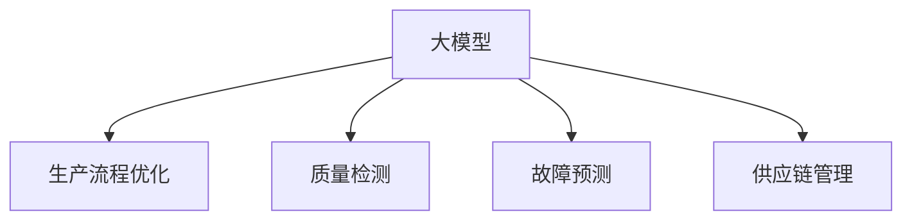

                 

# 大模型在制造业的应用前景

## 1. 背景介绍

### 1.1 问题由来

制造业是一个高度依赖自动化和智能化技术的应用领域。近年来，随着人工智能(AI)技术的发展，特别是深度学习模型在大数据、高并发的场景中展现出的卓越性能，使得其在制造业中的应用逐渐增多。例如，智能预测、质量检测、故障诊断、供应链优化等领域，大模型通过深度学习算法，可以高效处理海量数据，提供决策支持。

然而，制造业中的数据通常具有高维度、非结构化、实时性要求高等特点。传统的数据科学和机器学习技术在处理这些数据时往往效率较低，精度不高。因此，需要寻求新的技术手段，以适应制造业的实时需求和复杂的生产环境。

### 1.2 问题核心关键点

大模型在制造业中的应用，主要集中在以下几个核心点：

1. **数据处理能力**：大模型通常以Transformer结构为基础，能够高效处理高维、非结构化数据，支持实时数据分析和预测。
2. **复杂决策支持**：大模型通过训练海量数据，能够提供复杂的决策支持，帮助企业进行生产调度、质量控制等。
3. **多模态融合**：大模型具备处理图像、声音、文本等多模态数据的能力，适合制造业中多种传感器数据的融合应用。
4. **跨领域泛化**：大模型在多个领域均有优异表现，可以应用于不同类型制造业的生产流程和产品研发。

### 1.3 问题研究意义

探讨大模型在制造业中的应用前景，对提升制造业的智能化水平、提高生产效率、降低成本具有重要意义：

1. **提升智能化水平**：大模型能够高效处理制造业数据，提供智能化决策支持，提升生产过程的自动化和智能化水平。
2. **提高生产效率**：通过实时数据分析和预测，大模型能够优化生产流程，提高生产效率和产品合格率。
3. **降低成本**：大模型在故障预测、质量检测等方面的应用，可以减少生产过程中的人力成本和物料损耗。
4. **推动数字化转型**：大模型助力制造业数字化转型，为未来智能制造的发展打下坚实基础。

## 2. 核心概念与联系

### 2.1 核心概念概述

要理解大模型在制造业中的应用，需要先掌握几个关键概念：

- **大模型**：指以深度学习模型为核心的超大规模模型，如Transformer、BERT等。这些模型通过大量数据的训练，学习到丰富的语义和结构化知识。
- **生产流程优化**：指通过数据分析和建模，对生产流程进行优化，提高生产效率和质量。
- **质量检测**：通过图像识别、传感器数据分析等技术，检测产品质量，减少不合格品率。
- **故障预测**：利用历史数据和模型预测，提前发现设备故障，减少停机时间和维护成本。
- **供应链管理**：通过数据分析和预测，优化供应链流程，提高物流效率和库存管理水平。

这些概念之间的联系，可以通过以下Mermaid流程图来展示：



大模型在制造业中的应用，主要是通过在各个环节上进行数据处理和分析，辅助企业优化生产流程，提高生产效率和质量，降低成本，并推动数字化转型。

## 3. 核心算法原理 & 具体操作步骤
### 3.1 算法原理概述

大模型在制造业中的应用，主要是通过预训练-微调的方式。预训练阶段，大模型通过学习海量数据，掌握通用的语言和知识表示。微调阶段，根据特定制造环境的需求，对模型进行适配，使其能够处理特定的数据和任务。

具体来说，包括以下几个步骤：

1. **数据准备**：收集制造领域的各类数据，包括文本、图像、声音等，并进行清洗和标注。
2. **模型选择**：选择合适的预训练模型，如BERT、Transformer等，作为初始化参数。
3. **任务适配**：根据具体任务需求，设计任务适配层，如分类、回归、目标检测等。
4. **微调训练**：使用标注数据对模型进行有监督训练，调整模型参数，使其在特定任务上表现最佳。
5. **部署应用**：将训练好的模型部署到实际生产环境中，进行实时数据处理和预测。

### 3.2 算法步骤详解

以生产流程优化为例，以下是详细的操作步骤：

**Step 1: 数据准备**
- 收集制造领域的各类数据，如生产日志、设备状态、产品质量等，并进行预处理。
- 清洗数据，去除噪声和异常值。
- 标注数据，对生产数据进行分类，如正常生产、异常生产、设备故障等。

**Step 2: 模型选择**
- 选择合适的预训练模型，如BERT、Transformer等。
- 导入模型，并将其复制到数据处理环境中。

**Step 3: 任务适配**
- 根据生产流程优化任务，设计任务适配层。
- 在适配层中，添加必要的输入层、输出层、损失函数等。
- 将适配层与预训练模型连接，形成完整的模型结构。

**Step 4: 微调训练**
- 将标注数据分成训练集、验证集和测试集。
- 设置微调超参数，如学习率、批大小、迭代轮数等。
- 使用训练集进行微调训练，在验证集上评估模型性能。
- 根据验证集上的性能，调整超参数，继续训练，直到模型收敛。

**Step 5: 部署应用**
- 将训练好的模型部署到生产环境中，如嵌入式设备、云平台等。
- 实时读取生产数据，输入到模型中进行处理和预测。
- 根据模型的预测结果，进行生产调度、质量控制等决策。

### 3.3 算法优缺点

大模型在制造业中的应用，有以下优点：

1. **高效处理复杂数据**：大模型能够高效处理高维度、非结构化数据，提供实时决策支持。
2. **提升生产效率**：通过优化生产流程，减少停机时间和物料损耗，提高生产效率。
3. **多模态融合**：大模型具备处理图像、声音、文本等多种模态数据的能力，适合制造业的多样化需求。
4. **降低维护成本**：通过预测设备故障，减少停机时间和维护成本。

同时，也存在一些缺点：

1. **资源需求高**：大模型的训练和部署需要高性能计算资源，如GPU、TPU等。
2. **数据依赖性高**：模型的性能依赖于标注数据的质量和数量，标注成本较高。
3. **模型解释性差**：大模型的决策过程较难解释，缺乏可解释性。
4. **鲁棒性不足**：在特定制造环境下的泛化能力可能有限，模型可能对输入数据的微小变化敏感。

### 3.4 算法应用领域

大模型在制造业中的应用，主要包括以下几个领域：

1. **生产调度优化**：利用大模型对生产数据进行实时分析，优化生产调度，提高生产效率。
2. **质量检测**：通过图像识别和传感器数据分析，检测产品质量，减少不合格品率。
3. **故障预测**：利用历史数据和模型预测，提前发现设备故障，减少停机时间和维护成本。
4. **供应链管理**：通过数据分析和预测，优化供应链流程，提高物流效率和库存管理水平。
5. **工艺改进**：通过数据分析，优化生产工艺，提高产品质量和生产效率。
6. **设备运维**：利用大模型对设备状态进行监控和预测，减少设备停机时间，提高设备利用率。

这些应用领域展示了大模型在制造业中广泛的应用前景，极大地提升了制造业的生产效率和智能化水平。

## 4. 数学模型和公式 & 详细讲解 & 举例说明
### 4.1 数学模型构建

以生产调度优化为例，构建数学模型：

设生产数据为 $X$，生产调度优化目标为 $Y$，大模型为 $M_{\theta}$。模型的训练目标为最小化损失函数：

$$
\min_{\theta} \mathcal{L}(M_{\theta}(X), Y)
$$

其中，$\mathcal{L}$ 为损失函数，常用的有均方误差损失、交叉熵损失等。

### 4.2 公式推导过程

以均方误差损失为例，推导生产调度优化的损失函数：

设 $X$ 为输入的生产数据，$Y$ 为优化目标。则均方误差损失函数为：

$$
\mathcal{L}(M_{\theta}(X), Y) = \frac{1}{N} \sum_{i=1}^N (Y_i - M_{\theta}(X_i))^2
$$

其中，$N$ 为样本数量，$Y_i$ 为第 $i$ 个样本的真实值，$M_{\theta}(X_i)$ 为模型对第 $i$ 个样本的预测值。

### 4.3 案例分析与讲解

假设生产过程中有 $N$ 个任务，每个任务的加工时间为 $t_i$，大模型 $M_{\theta}$ 的输入为 $t_i$，输出为 $y_i$，表示任务 $i$ 是否完成。则生产调度优化的目标为：

$$
\min_{\theta} \mathcal{L}(M_{\theta}(t), y)
$$

其中，$y = (y_1, y_2, ..., y_N)$，$y_i$ 表示任务 $i$ 是否完成，$y_i = 1$ 表示任务完成，$y_i = 0$ 表示任务未完成。

模型训练时，使用标注数据 $(t_i, y_i)$ 进行优化，最小化均方误差损失。训练好的模型 $M_{\theta}$ 可以实时处理新的生产数据 $t$，输出任务完成情况 $y$，辅助进行生产调度决策。

## 5. 项目实践：代码实例和详细解释说明
### 5.1 开发环境搭建

以下是使用PyTorch进行制造业领域大模型微调的开发环境配置流程：

1. 安装Anaconda：从官网下载并安装Anaconda，用于创建独立的Python环境。
2. 创建并激活虚拟环境：
```bash
conda create -n manufacturing-env python=3.8 
conda activate manufacturing-env
```
3. 安装PyTorch：根据CUDA版本，从官网获取对应的安装命令。例如：
```bash
conda install pytorch torchvision torchaudio cudatoolkit=11.1 -c pytorch -c conda-forge
```
4. 安装TensorFlow：
```bash
conda install tensorflow
```
5. 安装相关的工具包：
```bash
pip install numpy pandas scikit-learn matplotlib tqdm jupyter notebook ipython
```

完成上述步骤后，即可在`manufacturing-env`环境中开始微调实践。

### 5.2 源代码详细实现

以生产流程优化为例，以下是使用PyTorch进行制造业领域大模型微调的代码实现：

```python
import torch
import torch.nn as nn
import torch.optim as optim
import pandas as pd
import numpy as np

# 定义模型结构
class ManufacturingModel(nn.Module):
    def __init__(self):
        super(ManufacturingModel, self).__init__()
        self.layers = nn.Sequential(
            nn.Linear(input_size, hidden_size),
            nn.ReLU(),
            nn.Linear(hidden_size, output_size),
            nn.Sigmoid()
        )

    def forward(self, x):
        x = self.layers(x)
        return x

# 定义损失函数
def loss_function(model, x, y):
    y_pred = model(x)
    loss = nn.BCELoss()(y_pred, y)
    return loss

# 准备数据
train_data = pd.read_csv('train.csv')
test_data = pd.read_csv('test.csv')

# 数据预处理
train_x = train_data[['time', 'temperature', 'humidity', 'pressure']].to_numpy()
train_y = train_data['status'].to_numpy()
test_x = test_data[['time', 'temperature', 'humidity', 'pressure']].to_numpy()
test_y = test_data['status'].to_numpy()

# 定义模型和优化器
model = ManufacturingModel()
optimizer = optim.Adam(model.parameters(), lr=0.001)
loss_function = loss_function(model, train_x, train_y)

# 训练模型
for epoch in range(num_epochs):
    optimizer.zero_grad()
    loss = loss_function(model, train_x, train_y)
    loss.backward()
    optimizer.step()
    print(f'Epoch {epoch+1}, loss: {loss:.4f}')

# 测试模型
test_loss = loss_function(model, test_x, test_y)
print(f'Test loss: {test_loss:.4f}')
```

这段代码实现了一个简单的制造业生产流程优化模型，主要步骤如下：

1. 定义模型结构，包含输入层、隐藏层和输出层。
2. 定义损失函数，使用二分类交叉熵损失函数。
3. 准备数据，将生产数据和标签读入Pandas DataFrame中。
4. 数据预处理，将数据转换为Numpy数组。
5. 定义模型和优化器，使用Adam优化器进行训练。
6. 训练模型，通过循环迭代进行反向传播和优化器更新。
7. 测试模型，计算测试集上的损失。

通过这段代码，你可以快速搭建一个初步的制造业生产流程优化模型，并进行微调训练。

### 5.3 代码解读与分析

下面我们对代码中的关键部分进行解读与分析：

**数据准备**
- `train_data` 和 `test_data` 分别表示训练集和测试集的Pandas DataFrame。
- `train_x` 和 `test_x` 分别表示输入特征，包含时间、温度、湿度和压力等。
- `train_y` 和 `test_y` 分别表示标签，表示生产任务是否完成。

**模型结构**
- `ManufacturingModel` 类定义了一个简单的生产流程优化模型，包含输入层、隐藏层和输出层。
- 使用线性层和ReLU激活函数作为隐藏层，输出层使用Sigmoid函数进行二分类。

**损失函数**
- `loss_function` 函数定义了二分类交叉熵损失函数。
- 将模型的输出 $y_{pred}$ 和真实标签 $y$ 作为输入，计算损失。

**训练模型**
- `for` 循环用于迭代训练过程，每次迭代进行前向传播和反向传播。
- `optimizer.zero_grad()` 用于清除梯度，避免梯度累积。
- `loss.backward()` 用于反向传播计算梯度。
- `optimizer.step()` 用于更新模型参数。

**测试模型**
- 在测试集上计算损失，输出结果。

通过这段代码，你可以清晰地看到大模型在制造业中的应用流程，包括数据准备、模型定义、训练和测试等步骤。这些代码可以帮助你快速实现初步的制造业大模型微调。

## 6. 实际应用场景
### 6.1 智能调度优化

智能调度优化是大模型在制造业中的一个典型应用。通过实时数据分析和优化，生产调度系统能够提高生产效率，减少停机时间和物料损耗。例如：

1. **生产计划优化**：利用大模型对生产数据进行实时分析，预测生产需求，优化生产计划，提高生产效率。
2. **任务优先级调整**：根据生产任务的紧急程度和重要性，利用大模型优化任务优先级，提升整体生产效率。
3. **设备维护调度**：利用大模型预测设备故障，优化设备维护计划，减少停机时间和维护成本。

通过大模型的实时分析和优化，生产调度系统能够更加灵活、高效地管理生产流程，提高生产效率和产品质量。

### 6.2 质量检测

质量检测是大模型在制造业中的另一个重要应用。通过图像识别和传感器数据分析，大模型能够实时检测产品质量，减少不合格品率。例如：

1. **图像识别**：利用大模型对产品图片进行分类和识别，检测产品质量缺陷。
2. **传感器数据分析**：利用大模型分析传感器数据，检测产品生产过程中的异常情况，及时调整生产参数。
3. **缺陷预测**：利用大模型对历史数据进行分析，预测产品质量缺陷，提前进行干预。

通过大模型的高效处理和分析能力，质量检测系统能够实时监测产品质量，减少不合格品率，提升产品合格率。

### 6.3 故障预测

故障预测是大模型在制造业中的重要应用之一，通过预测设备故障，能够减少停机时间和维护成本。例如：

1. **设备状态监测**：利用大模型对设备状态数据进行实时分析，预测设备故障。
2. **维护计划优化**：根据设备状态预测结果，优化设备维护计划，减少停机时间和维护成本。
3. **故障诊断**：利用大模型对设备故障数据进行分析，诊断设备故障原因，进行快速修复。

通过大模型的预测和诊断能力，故障预测系统能够提前发现设备故障，减少停机时间和维护成本，提高设备利用率。

### 6.4 供应链管理

供应链管理是大模型在制造业中的重要应用之一，通过数据分析和优化，能够提高物流效率和库存管理水平。例如：

1. **需求预测**：利用大模型对市场需求进行预测，优化库存管理。
2. **物流优化**：利用大模型对物流数据进行分析，优化物流路径和运输方式，提高物流效率。
3. **风险管理**：利用大模型对供应链风险进行预测和评估，制定应对策略。

通过大模型的数据分析和优化能力，供应链管理能够更好地应对市场需求变化，优化物流和库存管理，提高供应链效率和灵活性。

### 6.5 工艺改进

工艺改进是大模型在制造业中的重要应用之一，通过数据分析和优化，能够提高产品质量和生产效率。例如：

1. **工艺参数优化**：利用大模型对生产工艺数据进行分析，优化生产参数。
2. **质量控制**：利用大模型对产品质量数据进行分析，实时监测产品质量，进行质量控制。
3. **材料优化**：利用大模型对材料数据进行分析，优化材料使用，提高生产效率。

通过大模型的数据分析和优化能力，工艺改进系统能够更好地优化生产工艺，提高产品质量和生产效率。

### 6.6 设备运维

设备运维是大模型在制造业中的重要应用之一，通过预测设备状态和故障，能够减少停机时间和维护成本。例如：

1. **设备状态监测**：利用大模型对设备状态数据进行实时分析，预测设备故障。
2. **维护计划优化**：根据设备状态预测结果，优化设备维护计划，减少停机时间和维护成本。
3. **故障诊断**：利用大模型对设备故障数据进行分析，诊断设备故障原因，进行快速修复。

通过大模型的预测和诊断能力，设备运维系统能够提前发现设备故障，减少停机时间和维护成本，提高设备利用率。

## 7. 工具和资源推荐
### 7.1 学习资源推荐

为了帮助开发者系统掌握大模型在制造业中的应用，这里推荐一些优质的学习资源：

1. **《深度学习》书籍**：深入浅出地介绍了深度学习的基本概念和算法，适合初学者和进阶者。
2. **Coursera《深度学习》课程**：由斯坦福大学开设的深度学习课程，提供丰富的视频和作业，帮助学习深度学习理论。
3. **PyTorch官方文档**：提供了详细的PyTorch教程和API文档，适合开发者快速上手。
4. **HuggingFace官方文档**：提供了丰富的预训练模型和微调样例，适合快速实现大模型微调。
5. **Kaggle竞赛平台**：提供了大量的制造业数据集和竞赛任务，适合实战练习。

通过对这些资源的学习实践，相信你一定能够快速掌握大模型在制造业中的应用，并用于解决实际的制造问题。

### 7.2 开发工具推荐

高效的开发离不开优秀的工具支持。以下是几款用于制造业领域大模型微调开发的常用工具：

1. **PyTorch**：基于Python的开源深度学习框架，灵活的计算图，适合快速迭代研究。
2. **TensorFlow**：由Google主导开发的深度学习框架，生产部署方便，适合大规模工程应用。
3. **Transformers库**：HuggingFace开发的NLP工具库，集成了丰富的预训练语言模型，适合快速实现大模型微调。
4. **Jupyter Notebook**：交互式编程环境，方便开发者进行模型调试和可视化。
5. **Keras**：高层次神经网络API，易于上手，适合初学者和快速实现模型。

合理利用这些工具，可以显著提升大模型在制造业中的应用开发效率，加快创新迭代的步伐。

### 7.3 相关论文推荐

大模型在制造业中的应用研究，主要集中在以下几个领域：

1. **《深度学习在制造业中的应用》**：介绍深度学习在生产调度、质量检测、故障预测等方面的应用。
2. **《基于深度学习的生产调度优化》**：探讨深度学习模型在生产调度优化中的潜力。
3. **《图像识别在质量检测中的应用》**：介绍图像识别技术在质量检测中的实际应用。
4. **《故障预测与诊断》**：探讨深度学习在故障预测与诊断中的应用。
5. **《基于深度学习的供应链优化》**：介绍深度学习在供应链优化中的应用。

这些论文代表了大模型在制造业中的最新研究成果，通过学习这些前沿成果，可以帮助研究者把握学科前进方向，激发更多的创新灵感。

## 8. 总结：未来发展趋势与挑战
### 8.1 研究成果总结

大模型在制造业中的应用，取得了显著的成果。主要体现在以下几个方面：

1. **提高生产效率**：通过优化生产调度、质量检测、工艺改进等，提高了制造业的生产效率和产品质量。
2. **减少维护成本**：通过故障预测和设备运维，减少了停机时间和维护成本。
3. **优化供应链管理**：通过需求预测和物流优化，提高了供应链的灵活性和效率。

这些成果展示了大模型在制造业中的强大潜力，为制造业的数字化转型和智能化升级提供了有力支持。

### 8.2 未来发展趋势

展望未来，大模型在制造业中的应用，将呈现以下几个发展趋势：

1. **更高效的数据处理**：随着数据量的增大和数据种类的增加，大模型将更高效地处理高维、非结构化数据。
2. **更精细的生产调度**：通过实时数据分析和优化，大模型将实现更精细的生产调度，提高生产效率。
3. **更准确的质量检测**：通过图像识别和传感器数据分析，大模型将实现更准确的质量检测，减少不合格品率。
4. **更智能的故障预测**：通过深度学习和大数据分析，大模型将实现更智能的故障预测，减少设备停机时间。
5. **更灵活的供应链管理**：通过实时数据分析和优化，大模型将实现更灵活的供应链管理，提高物流效率。

这些趋势展示了大模型在制造业中的广泛应用前景，未来大模型将进一步推动制造业的智能化和数字化进程。

### 8.3 面临的挑战

尽管大模型在制造业中的应用已经取得了不少成果，但在应用过程中仍面临一些挑战：

1. **数据获取难度大**：制造业数据通常具有高维度、非结构化、实时性要求高等特点，获取数据难度较大。
2. **模型训练成本高**：大模型的训练需要高性能计算资源，如GPU、TPU等，训练成本较高。
3. **模型解释性差**：大模型的决策过程较难解释，缺乏可解释性。
4. **鲁棒性不足**：在特定制造环境下的泛化能力可能有限，模型可能对输入数据的微小变化敏感。
5. **安全性和隐私保护**：大模型需要处理敏感的生产数据，隐私保护和安全问题亟需解决。

这些挑战需要进一步的研究和技术突破，以推动大模型在制造业中的更广泛应用。

### 8.4 研究展望

未来大模型在制造业中的应用，需要在以下几个方面进行研究：

1. **高效数据处理技术**：开发高效的数据处理算法和工具，解决制造业数据处理难题。
2. **低成本训练方法**：探索低成本的模型训练方法，如分布式训练、联邦学习等，降低模型训练成本。
3. **可解释性增强**：研究可解释性增强技术，提高模型的可解释性和透明性。
4. **鲁棒性提升**：研究鲁棒性提升技术，提高模型在不同制造环境下的泛化能力。
5. **隐私保护技术**：研究隐私保护技术，保护制造业数据的隐私和安全。

这些研究方向将推动大模型在制造业中的更广泛应用，为制造业的数字化转型和智能化升级提供有力支持。

## 9. 附录：常见问题与解答

**Q1: 大模型在制造业中的数据获取难度大，如何解决？**

A: 数据获取难度大是制造业中的一个常见问题。为了解决这个问题，可以采用以下方法：

1. **数据收集**：利用传感器、监控设备等，实时收集生产数据。
2. **数据标注**：对收集到的数据进行标注，标注过程可以采用半监督学习、主动学习等方法，减少标注成本。
3. **数据增强**：通过数据增强技术，如数据扩充、数据合成等，增加训练集的多样性。
4. **数据共享**：与供应商、合作伙伴等共享数据，扩大数据获取渠道。

通过这些方法，可以缓解大模型在制造业中数据获取的难度，提升模型的训练效果。

**Q2: 大模型在制造业中的模型解释性差，如何解决？**

A: 大模型的决策过程较难解释，缺乏可解释性。为了解决这个问题，可以采用以下方法：

1. **可解释性技术**：使用可解释性技术，如LIME、SHAP等，解释大模型的决策过程。
2. **模型简化**：使用模型简化技术，如模型剪枝、模型压缩等，减小模型复杂度，提高可解释性。
3. **特征工程**：通过特征工程，提取关键特征，提高模型的可解释性。

通过这些方法，可以提高大模型在制造业中的可解释性，增加模型的透明性和可信度。

**Q3: 大模型在制造业中的鲁棒性不足，如何解决？**

A: 大模型在特定制造环境下的泛化能力可能有限，模型可能对输入数据的微小变化敏感。为了解决这个问题，可以采用以下方法：

1. **数据扩充**：通过数据扩充技术，增加训练集的多样性，提高模型的泛化能力。
2. **对抗训练**：引入对抗样本，提高模型的鲁棒性，防止模型过拟合。
3. **迁移学习**：利用迁移学习技术，将预训练模型知识迁移到特定制造环境，提高模型的鲁棒性。
4. **模型集成**：使用模型集成技术，如Bagging、Boosting等，提高模型的泛化能力和鲁棒性。

通过这些方法，可以提高大模型在制造业中的鲁棒性，提升模型在不同制造环境下的表现。

**Q4: 大模型在制造业中的安全性和隐私保护问题如何解决？**

A: 大模型需要处理敏感的生产数据，隐私保护和安全问题亟需解决。为了解决这个问题，可以采用以下方法：

1. **数据加密**：对敏感数据进行加密处理，保护数据隐私。
2. **联邦学习**：采用联邦学习技术，在本地设备上进行模型训练，保护数据隐私。
3. **访问控制**：采用访问控制技术，限制对数据的访问权限，保护数据安全。
4. **隐私计算**：采用隐私计算技术，保护数据隐私，同时实现数据分析和模型训练。

通过这些方法，可以保护大模型在制造业中的数据隐私和安全，提升模型的可靠性和可信度。

---

作者：禅与计算机程序设计艺术 / Zen and the Art of Computer Programming

