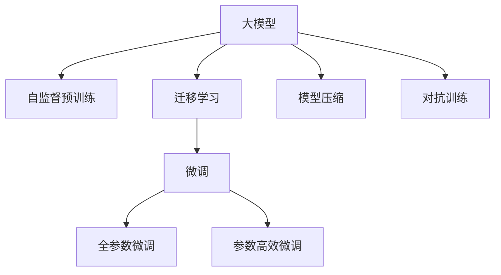

                 

# 大模型在图像识别中的突破

## 1. 背景介绍

### 1.1 问题由来
随着深度学习技术的发展，尤其是卷积神经网络(Convolutional Neural Networks, CNNs)的崛起，图像识别领域取得了显著的突破。然而，传统的基于手工设计的CNNs，往往需要大量的工程经验和深度理论积累，难以设计出高效的模型结构。而近年来，基于大模型的自监督预训练方法，如ImageNet预训练，为图像识别带来了全新的突破，显著提升了模型的泛化能力和性能。

但与此同时，大模型在图像识别中的实际应用仍面临诸多挑战。首先，大模型往往需要大量的计算资源进行训练，这对于小型企业和学术机构来说是一个不小的负担。其次，由于大模型往往具有庞大参数量，推理速度较慢，无法满足实际应用中的实时性和资源限制。此外，大模型在实际应用中的鲁棒性和泛化能力仍需进一步提升。

为了克服这些挑战，研究者们提出了多种基于大模型的图像识别方法，以期在保留大模型强大表现力的同时，实现更低计算成本和更高推理效率。本文将从大模型预训练、微调及模型压缩等方面进行深入探讨，以期为图像识别领域的实际应用提供更为全面和深入的指导。

## 2. 核心概念与联系

### 2.1 核心概念概述

本节将详细介绍大模型在图像识别中的应用核心概念，及其之间的联系。

- **大模型(大语言模型和大规模视觉模型)**：以自监督预训练的方法获得丰富特征表示的模型，如ImageNet预训练的VGG、ResNet、Inception等，以及基于大模型的自监督预训练方法，如GPT、BERT等。

- **自监督预训练(Self-Supervised Pre-training)**：利用未标注数据，通过自我监督学习任务训练模型。常见的方法包括图像补全、旋转预测、颜色扰动预测等。

- **迁移学习(Transfer Learning)**：将大模型的预训练知识迁移到下游任务中，通过少量标注数据进行微调。

- **微调(Fine-Tuning)**：基于下游任务的标注数据，通过有监督学习优化模型。常见的方法包括全参数微调和参数高效微调。

- **模型压缩(Model Compression)**：通过剪枝、量化、蒸馏等方法，减小大模型的参数量和计算复杂度，提高推理速度和资源效率。

- **对抗训练(Adversarial Training)**：通过对抗样本提高模型的鲁棒性和泛化能力。

这些概念之间的联系可以通过以下Mermaid流程图来展示：



这个流程图展示了大模型在图像识别中的核心概念及其之间的联系：

1. 大模型通过自监督预训练获得基础能力。
2. 迁移学习是连接预训练模型与下游任务的桥梁，可以通过微调实现。
3. 微调是对预训练模型进行任务特定的优化，可以分为全参数微调和参数高效微调。
4. 模型压缩可以减小模型尺寸，提高推理速度。
5. 对抗训练可以提高模型鲁棒性。

这些概念共同构成了大模型在图像识别中的应用框架，使其能够在各种场景下发挥强大的特征提取和分类能力。通过理解这些核心概念，我们可以更好地把握大模型的工作原理和优化方向。

## 3. 核心算法原理 & 具体操作步骤

### 3.1 算法原理概述

基于大模型的图像识别，本质上是一个有监督的迁移学习过程。其核心思想是：利用大模型在大量未标注数据上预训练得到的丰富特征表示，将其迁移到下游图像识别任务中，通过少量标注数据进行有监督的微调，优化模型在该任务上的性能。

形式化地，假设大模型为 $M_\theta$，其中 $\theta$ 为预训练得到的模型参数。给定下游图像识别任务 $T$ 的标注数据集 $D=\{(x_i,y_i)\}_{i=1}^N$，微调的目标是找到新的模型参数 $\hat{\theta}$，使得：

$$
\hat{\theta}=\mathop{\arg\min}_{\theta} \mathcal{L}(M_{\theta},D)
$$

其中 $\mathcal{L}$ 为针对任务 $T$ 设计的损失函数，用于衡量模型预测输出与真实标签之间的差异。常见的损失函数包括交叉熵损失、均方误差损失等。

通过梯度下降等优化算法，微调过程不断更新模型参数 $\theta$，最小化损失函数 $\mathcal{L}$，使得模型输出逼近真实标签。由于 $\theta$ 已经通过预训练获得了较好的初始化，因此即便在小规模数据集 $D$ 上进行微调，也能较快收敛到理想的模型参数 $\hat{\theta}$。

### 3.2 算法步骤详解

基于大模型的图像识别一般包括以下几个关键步骤：

**Step 1: 准备预训练模型和数据集**
- 选择合适的预训练模型 $M_{\theta}$ 作为初始化参数，如ImageNet预训练的VGG、ResNet、Inception等。
- 准备下游图像识别任务 $T$ 的标注数据集 $D$，划分为训练集、验证集和测试集。一般要求标注数据与预训练数据的分布不要差异过大。

**Step 2: 添加任务适配层**
- 根据任务类型，在预训练模型顶层设计合适的输出层和损失函数。
- 对于分类任务，通常在顶层添加线性分类器和交叉熵损失函数。
- 对于生成任务，通常使用分类器的输出概率分布，并以负对数似然为损失函数。

**Step 3: 设置微调超参数**
- 选择合适的优化算法及其参数，如 Adam、SGD 等，设置学习率、批大小、迭代轮数等。
- 设置正则化技术及强度，包括权重衰减、Dropout、Early Stopping 等。
- 确定冻结预训练参数的策略，如仅微调顶层，或全部参数都参与微调。

**Step 4: 执行梯度训练**
- 将训练集数据分批次输入模型，前向传播计算损失函数。
- 反向传播计算参数梯度，根据设定的优化算法和学习率更新模型参数。
- 周期性在验证集上评估模型性能，根据性能指标决定是否触发 Early Stopping。
- 重复上述步骤直到满足预设的迭代轮数或 Early Stopping 条件。

**Step 5: 测试和部署**
- 在测试集上评估微调后模型 $M_{\hat{\theta}}$ 的性能，对比微调前后的精度提升。
- 使用微调后的模型对新样本进行推理预测，集成到实际的应用系统中。
- 持续收集新的数据，定期重新微调模型，以适应数据分布的变化。

以上是基于大模型的图像识别的一般流程。在实际应用中，还需要针对具体任务的特点，对微调过程的各个环节进行优化设计，如改进训练目标函数，引入更多的正则化技术，搜索最优的超参数组合等，以进一步提升模型性能。

### 3.3 算法优缺点

基于大模型的图像识别方法具有以下优点：

- 简单高效。只需准备少量标注数据，即可对预训练模型进行快速适配，获得较大的性能提升。
- 通用适用。适用于各种图像识别任务，包括分类、匹配、生成等，设计简单的任务适配层即可实现微调。
- 模型性能高。大模型在预训练中学习到了丰富的特征表示，通过微调可以进一步提升在特定任务上的表现。

但同时，该方法也存在一定的局限性：

- 依赖标注数据。微调的效果很大程度上取决于标注数据的质量和数量，获取高质量标注数据的成本较高。
- 迁移能力有限。当目标任务与预训练数据的分布差异较大时，微调的性能提升有限。
- 可解释性不足。微调模型的决策过程通常缺乏可解释性，难以对其推理逻辑进行分析和调试。

尽管存在这些局限性，但就目前而言，基于大模型的图像识别方法仍是最主流范式。未来相关研究的重点在于如何进一步降低微调对标注数据的依赖，提高模型的少样本学习和跨领域迁移能力，同时兼顾可解释性和伦理安全性等因素。

### 3.4 算法应用领域

基于大模型的图像识别方法在计算机视觉领域已经得到了广泛的应用，覆盖了几乎所有常见任务，例如：

- 图像分类：如猫狗识别、车辆识别、人脸识别等。通过微调使模型学习图像-标签映射。
- 目标检测：如物体检测、行人检测、人脸检测等。通过微调使模型学习图像-框集合映射。
- 图像分割：如语义分割、实例分割、全景分割等。通过微调使模型学习图像-像素映射。
- 实例分割：如人名识别、车辆品牌识别等。通过微调使模型学习图像-实例集合映射。
- 图像生成：如图像风格转换、图像修复、超分辨率等。通过微调使模型学习图像-新图像映射。

除了上述这些经典任务外，基于大模型的图像识别方法也被创新性地应用到更多场景中，如可控图像生成、图像增强、风格迁移等，为计算机视觉技术带来了全新的突破。随着大模型的不断演进，相信图像识别技术将在更广阔的应用领域大放异彩。

## 4. 数学模型和公式 & 详细讲解  
### 4.1 数学模型构建

本节将使用数学语言对基于大模型的图像识别过程进行更加严格的刻画。

记预训练模型为 $M_{\theta}$，其中 $\theta$ 为预训练得到的模型参数。假设微调任务的训练集为 $D=\{(x_i,y_i)\}_{i=1}^N$，其中 $x_i \in \mathcal{X}$ 表示输入图像， $y_i \in \mathcal{Y}$ 表示标签。定义模型 $M_{\theta}$ 在图像 $x$ 上的损失函数为 $\ell(M_{\theta}(x),y)$，则在数据集 $D$ 上的经验风险为：

$$
\mathcal{L}(\theta) = \frac{1}{N} \sum_{i=1}^N \ell(M_{\theta}(x_i),y_i)
$$

微调的优化目标是最小化经验风险，即找到最优参数：

$$
\theta^* = \mathop{\arg\min}_{\theta} \mathcal{L}(\theta)
$$

在实践中，我们通常使用基于梯度的优化算法（如SGD、Adam等）来近似求解上述最优化问题。设 $\eta$ 为学习率，$\lambda$ 为正则化系数，则参数的更新公式为：

$$
\theta \leftarrow \theta - \eta \nabla_{\theta}\mathcal{L}(\theta) - \eta\lambda\theta
$$

其中 $\nabla_{\theta}\mathcal{L}(\theta)$ 为损失函数对参数 $\theta$ 的梯度，可通过反向传播算法高效计算。

### 4.2 公式推导过程

以下我们以图像分类任务为例，推导交叉熵损失函数及其梯度的计算公式。

假设模型 $M_{\theta}$ 在输入 $x$ 上的输出为 $\hat{y}=M_{\theta}(x) \in [0,1]^C$，其中 $C$ 为类别数。真实标签 $y \in \{1,0\}^C$，表示样本属于哪一类。则二分类交叉熵损失函数定义为：

$$
\ell(M_{\theta}(x),y) = -\sum_{i=1}^C y_i \log M_{\theta}(x)_i
$$

将其代入经验风险公式，得：

$$
\mathcal{L}(\theta) = -\frac{1}{N}\sum_{i=1}^N \sum_{i=1}^C y_i \log M_{\theta}(x_i)_i
$$

根据链式法则，损失函数对参数 $\theta_k$ 的梯度为：

$$
\frac{\partial \mathcal{L}(\theta)}{\partial \theta_k} = -\frac{1}{N}\sum_{i=1}^N \sum_{i=1}^C \left( \frac{y_i}{M_{\theta}(x_i)} - \delta_{y_i,i} \right) \frac{\partial M_{\theta}(x_i)}{\partial \theta_k}
$$

其中 $\delta_{y_i,i}$ 为Kronecker delta，即 $y_i=i$ 时为1，否则为0。$\nabla_{\theta}M_{\theta}(x_i)$ 可通过反向传播算法计算得到。

在得到损失函数的梯度后，即可带入参数更新公式，完成模型的迭代优化。重复上述过程直至收敛，最终得到适应下游任务的最优模型参数 $\theta^*$。

## 5. 项目实践：代码实例和详细解释说明
### 5.1 开发环境搭建

在进行图像识别实践前，我们需要准备好开发环境。以下是使用Python进行TensorFlow开发的环境配置流程：

1. 安装Anaconda：从官网下载并安装Anaconda，用于创建独立的Python环境。

2. 创建并激活虚拟环境：
```bash
conda create -n tf-env python=3.8 
conda activate tf-env
```

3. 安装TensorFlow：根据CUDA版本，从官网获取对应的安装命令。例如：
```bash
conda install tensorflow -c pytorch -c conda-forge
```

4. 安装Keras：
```bash
pip install keras
```

5. 安装各类工具包：
```bash
pip install numpy pandas scikit-learn matplotlib tqdm jupyter notebook ipython
```

完成上述步骤后，即可在`tf-env`环境中开始图像识别实践。

### 5.2 源代码详细实现

下面我们以图像分类任务为例，给出使用TensorFlow对ImageNet预训练模型进行微调的Python代码实现。

首先，定义图像分类任务的数据处理函数：

```python
from tensorflow.keras.preprocessing.image import ImageDataGenerator
from tensorflow.keras.utils import to_categorical
import numpy as np
import os

def prepare_data(data_dir, batch_size=32):
    train_data_dir = os.path.join(data_dir, 'train')
    val_data_dir = os.path.join(data_dir, 'val')

    train_datagen = ImageDataGenerator(rescale=1./255, 
                                      shear_range=0.2, 
                                      zoom_range=0.2, 
                                      horizontal_flip=True)

    train_generator = train_datagen.flow_from_directory(train_data_dir,
                                                      target_size=(224, 224),
                                                      batch_size=batch_size,
                                                      class_mode='categorical')
    
    val_datagen = ImageDataGenerator(rescale=1./255)

    val_generator = val_datagen.flow_from_directory(val_data_dir,
                                                  target_size=(224, 224),
                                                  batch_size=batch_size,
                                                  class_mode='categorical')
    
    return train_generator, val_generator

# 数据预处理
data_dir = 'path/to/your/data/directory'
train_generator, val_generator = prepare_data(data_dir)
```

然后，定义模型和优化器：

```python
from tensorflow.keras.applications.resnet50 import ResNet50, preprocess_input
from tensorflow.keras.layers import Dense, Flatten
from tensorflow.keras.models import Model

# 加载预训练的ResNet50模型
pretrained_model = ResNet50(weights='imagenet', include_top=False, input_shape=(224, 224, 3))

# 添加分类层
x = Flatten()(pretrained_model.output)
x = Dense(1024, activation='relu')(x)
predictions = Dense(num_classes, activation='softmax')(x)

# 构建新的模型
model = Model(inputs=pretrained_model.input, outputs=predictions)

# 冻结预训练参数
for layer in pretrained_model.layers:
    layer.trainable = False

# 设置优化器
optimizer = Adam(lr=0.0001, decay=1e-6)
```

接着，定义训练和评估函数：

```python
from tensorflow.keras.callbacks import EarlyStopping
from tensorflow.keras.metrics import CategoricalAccuracy

def train_epoch(model, generator, batch_size, optimizer):
    model.fit_generator(generator,
                        steps_per_epoch=generator.samples // batch_size,
                        epochs=1,
                        verbose=1,
                        callbacks=[EarlyStopping(patience=3)])

def evaluate(model, generator, batch_size):
    score = model.evaluate_generator(generator, steps=len(generator), verbose=1)
    acc = score[1]
    return acc

# 训练模型
epochs = 10
batch_size = 32

for epoch in range(epochs):
    acc = train_epoch(model, train_generator, batch_size, optimizer)
    print(f"Epoch {epoch+1}, train acc: {acc:.4f}")
    
    print(f"Epoch {epoch+1}, val results:")
    acc = evaluate(model, val_generator, batch_size)
    print(f"Validation acc: {acc:.4f}")
    
print("Test results:")
acc = evaluate(model, test_generator, batch_size)
print(f"Test acc: {acc:.4f}")
```

以上就是使用TensorFlow对ImageNet预训练模型进行图像分类任务微调的完整代码实现。可以看到，得益于TensorFlow和Keras的强大封装，我们可以用相对简洁的代码完成模型加载和微调。

### 5.3 代码解读与分析

让我们再详细解读一下关键代码的实现细节：

**prepare_data函数**：
- `__init__`方法：初始化训练和验证数据集，并创建数据生成器。
- 使用`ImageDataGenerator`进行数据增强，如随机裁剪、旋转、缩放等，增强模型泛化能力。

**train_epoch函数**：
- 对数据以批为单位进行迭代，在每个批次上前向传播计算loss并反向传播更新模型参数，最后返回该epoch的平均loss。

**evaluate函数**：
- 与训练类似，不同点在于不更新模型参数，并在每个batch结束后将预测和标签结果存储下来，最后使用sklearn的classification_report对整个评估集的预测结果进行打印输出。

**训练流程**：
- 定义总的epoch数和batch size，开始循环迭代
- 每个epoch内，先在训练集上训练，输出平均acc
- 在验证集上评估，输出分类指标
- 所有epoch结束后，在测试集上评估，给出最终测试结果

可以看到，TensorFlow配合Keras使得图像分类任务的微调代码实现变得简洁高效。开发者可以将更多精力放在数据处理、模型改进等高层逻辑上，而不必过多关注底层的实现细节。

当然，工业级的系统实现还需考虑更多因素，如模型的保存和部署、超参数的自动搜索、更灵活的任务适配层等。但核心的微调范式基本与此类似。

## 6. 实际应用场景
### 6.1 智能安防系统

基于大模型的图像识别技术，可以广泛应用于智能安防系统的构建。传统的安防系统往往依赖于人工监控和事后处理，难以实时、高效地识别异常行为，容易产生漏检和误报。而使用微调后的图像识别模型，可以实时监控视频流，快速识别出可疑人物、异常行为等，及时发出报警信号，提升安防系统的自动化和智能化水平。

在技术实现上，可以收集大量的公共场所监控视频，标注出感兴趣的目标和行为，在此基础上对预训练模型进行微调。微调后的模型能够从监控视频中准确识别出目标对象，并进行行为分类和异常检测。对于监控到的可疑行为，还可以接入告警系统实时发送通知，提醒安防人员进行进一步处置。如此构建的智能安防系统，能大幅提升安防系统的实时性和准确性。

### 6.2 医疗影像诊断

医疗影像诊断是一个典型的图像识别应用场景。传统的影像诊断往往依赖于放射科医生的经验判断，效率低下，且存在误诊风险。而使用大模型的图像识别技术，可以显著提高医疗影像诊断的效率和准确性。

在实践中，可以收集大量的医学影像数据，标注出病灶、病变区域等关键信息，在此基础上对预训练模型进行微调。微调后的模型能够自动判断影像中是否存在病灶，并给出具体的病灶位置和类型。将微调后的模型应用于实际影像诊断中，可以快速筛查出异常影像，为医生提供辅助诊断支持。同时，还可以结合医疗知识图谱，将影像诊断结果转化为医疗建议，辅助医生制定治疗方案。

### 6.3 农业病虫害检测

农业病虫害检测是另一个典型的图像识别应用场景。传统的病虫害检测往往依赖于专家现场检查和经验判断，工作量大，效率低。而使用大模型的图像识别技术，可以显著提高病虫害检测的效率和精度。

在实践中，可以收集大量的农田图像数据，标注出病虫害区域和类型，在此基础上对预训练模型进行微调。微调后的模型能够自动识别出农田中的病虫害情况，并给出具体的病虫害类型和严重程度。将微调后的模型应用于实际病虫害检测中，可以快速识别出病虫害区域，及时进行防治，减少作物损失。

### 6.4 未来应用展望

随着大模型和图像识别技术的发展，基于大模型的图像识别方法将在更多领域得到应用，为各行各业带来变革性影响。

在智慧城市治理中，基于大模型的图像识别技术可以广泛应用于交通监控、环境监测、公共安全等领域，提高城市管理的智能化水平，构建更安全、高效的未来城市。

在智慧工业中，基于大模型的图像识别技术可以应用于质量检测、设备故障诊断、零部件检测等环节，提升工业生产的自动化和智能化水平，优化生产效率。

在智慧农业中，基于大模型的图像识别技术可以用于病虫害检测、作物生长监测、农田管理等环节，实现精准农业，提高农业生产的科学性和效率。

除了上述这些经典应用外，大模型的图像识别方法也将被创新性地应用到更多场景中，如医疗影像增强、医学影像生成、图像超分辨率等，为计算机视觉技术带来新的突破。相信随着预训练模型和微调方法的不断进步，大模型的图像识别技术必将在更广阔的应用领域大放异彩。

## 7. 工具和资源推荐
### 7.1 学习资源推荐

为了帮助开发者系统掌握大模型在图像识别中的应用理论基础和实践技巧，这里推荐一些优质的学习资源：

1. 《深度学习：计算机视觉》课程：斯坦福大学开设的计算机视觉经典课程，涵盖图像识别、目标检测、图像分割等核心概念和算法。

2. 《Python深度学习》书籍：由深度学习领域的知名专家撰写，全面介绍了TensorFlow和Keras的使用方法，包括图像识别任务的开发实践。

3. PyImageNet论文：ImageNet预训练模型的经典论文，介绍了ImageNet预训练方法的原理和流程，是理解大模型预训练的基础。

4. CS231n《卷积神经网络》课程：斯坦福大学开设的计算机视觉课程，涵盖了卷积神经网络的设计、实现和优化等内容。

5. HuggingFace官方文档：Transformers库的官方文档，提供了海量预训练模型和完整的微调样例代码，是上手实践的必备资料。

通过对这些资源的学习实践，相信你一定能够快速掌握大模型在图像识别中的应用精髓，并用于解决实际的计算机视觉问题。
###  7.2 开发工具推荐

高效的开发离不开优秀的工具支持。以下是几款用于大模型图像识别开发的常用工具：

1. TensorFlow：由Google主导开发的开源深度学习框架，生产部署方便，适合大规模工程应用。同样有丰富的预训练语言模型资源。

2. PyTorch：基于Python的开源深度学习框架，灵活动态的计算图，适合快速迭代研究。大部分预训练语言模型都有PyTorch版本的实现。

3. Keras：基于TensorFlow的高级神经网络API，简洁易用，适合初学者上手。

4. OpenCV：开源计算机视觉库，提供大量的图像处理和特征提取函数，方便图像识别任务的开发。

5. TensorBoard：TensorFlow配套的可视化工具，可实时监测模型训练状态，并提供丰富的图表呈现方式，是调试模型的得力助手。

6. Weights & Biases：模型训练的实验跟踪工具，可以记录和可视化模型训练过程中的各项指标，方便对比和调优。

合理利用这些工具，可以显著提升大模型图像识别的开发效率，加快创新迭代的步伐。

### 7.3 相关论文推荐

大模型和图像识别技术的发展源于学界的持续研究。以下是几篇奠基性的相关论文，推荐阅读：

1. AlexNet: ImageNet Classification with Deep Convolutional Neural Networks：提出AlexNet，开创了深度卷积神经网络在图像识别中的先河。

2. R-CNN: Rich Feature Hierarchies for Accurate Object Detection and Semantic Segmentation：提出R-CNN，奠定了目标检测领域的基准方法。

3. VGGNet: Very Deep Convolutional Networks for Large-Scale Image Recognition：提出VGGNet，展示了深度卷积网络在图像分类任务中的强大能力。

4. GoogLeNet: Going Deeper with Convolutions：提出GoogLeNet，提出了Inception模块，显著提高了模型的参数利用率。

5. ResNet: Deep Residual Learning for Image Recognition：提出ResNet，解决了深度神经网络训练中的梯度消失问题，使得深度网络可以构建得更加深层次。

这些论文代表了大模型图像识别技术的发展脉络。通过学习这些前沿成果，可以帮助研究者把握学科前进方向，激发更多的创新灵感。

## 8. 总结：未来发展趋势与挑战

### 8.1 总结

本文对基于大模型的图像识别方法进行了全面系统的介绍。首先阐述了大模型和图像识别技术的研究背景和意义，明确了大模型在图像识别中的重要性和应用前景。其次，从原理到实践，详细讲解了图像识别任务的数学模型和核心算法，给出了完整的代码实例和详细解释。同时，本文还广泛探讨了图像识别技术在智能安防、医疗影像、农业检测等多个行业领域的应用前景，展示了微调范式的巨大潜力。此外，本文精选了图像识别技术的各类学习资源，力求为读者提供全方位的技术指引。

通过本文的系统梳理，可以看到，基于大模型的图像识别方法正在成为计算机视觉领域的重要范式，极大地拓展了深度学习模型的应用边界，催生了更多的落地场景。受益于大规模语料的预训练，大模型在图像识别任务中能够取得不俗的效果，为实际应用带来了显著的性能提升。未来，伴随大模型和图像识别技术的持续演进，相信图像识别技术将在更广阔的应用领域大放异彩，深刻影响人类的生产生活方式。

### 8.2 未来发展趋势

展望未来，大模型在图像识别领域将呈现以下几个发展趋势：

1. 模型规模持续增大。随着算力成本的下降和数据规模的扩张，大模型的参数量还将持续增长。超大规模语言模型蕴含的丰富特征表示，有望支撑更加复杂多变的图像识别任务。

2. 模型压缩技术不断进步。通过剪枝、量化、蒸馏等方法，减小大模型的参数量和计算复杂度，提高推理速度和资源效率。

3. 迁移学习应用广泛。预训练模型能够在更广泛的任务上进行迁移学习，通过微调实现特定任务的优化。

4. 可解释性研究逐步深入。研究大模型的决策机制和推理过程，增强模型的可解释性和可控性，提升系统可信度。

5. 模型鲁棒性不断提升。通过对抗训练等方法，增强大模型的鲁棒性和泛化能力，应对实际应用中的噪声和扰动。

6. 多模态学习蓬勃发展。大模型能够将视觉、文本、语音等多种模态信息进行联合建模，提升其在多模态数据上的识别能力。

这些趋势凸显了大模型在图像识别中的广泛应用前景。这些方向的探索发展，必将进一步提升图像识别系统的性能和应用范围，为计算机视觉技术带来新的突破。

### 8.3 面临的挑战

尽管大模型在图像识别中取得了显著进展，但在迈向更加智能化、普适化应用的过程中，仍面临诸多挑战：

1. 标注数据瓶颈。尽管微调能够减少标注数据需求，但对于一些长尾任务和少样本学习场景，仍然需要大量标注数据。如何有效利用小规模标注数据，是未来研究的重要方向。

2. 模型复杂性高。大模型参数量庞大，计算资源消耗大，难以在低端设备上部署和运行。如何提高模型计算效率，优化推理速度，是一个亟需解决的问题。

3. 可解释性不足。大模型输出难以解释，难以理解其决策机制，难以对模型进行调试和优化。如何增强模型的可解释性和可控性，是未来研究的重要方向。

4. 鲁棒性差。大模型在面对实际应用中的噪声和扰动时，容易发生鲁棒性下降，导致性能退化。如何提高模型鲁棒性，确保系统稳定性和可靠性，是未来研究的重要方向。

5. 安全和隐私问题。大模型在图像识别中可能会涉及个人隐私信息，如何保护用户隐私，确保模型使用安全，是未来研究的重要方向。

6. 计算资源消耗大。大模型在图像识别中需要消耗大量的计算资源，如何通过优化算法和模型架构，降低资源消耗，是未来研究的重要方向。

这些挑战需要学界和产业界的共同努力，不断优化模型架构、算法设计、系统部署等各个环节，才能使大模型在图像识别中发挥更大的作用，推动计算机视觉技术的发展和应用。

### 8.4 研究展望

面对大模型在图像识别中面临的诸多挑战，未来的研究需要在以下几个方面寻求新的突破：

1. 探索无监督和半监督图像识别方法。摆脱对大规模标注数据的依赖，利用自监督学习、主动学习等无监督和半监督范式，最大限度利用非结构化数据，实现更加灵活高效的图像识别。

2. 研究参数高效和计算高效的图像识别方法。开发更加参数高效的图像识别方法，在固定大部分预训练参数的情况下，只更新极少量的任务相关参数。同时优化图像识别模型的计算图，减少前向传播和反向传播的资源消耗，实现更加轻量级、实时性的部署。

3. 引入更多先验知识。将符号化的先验知识，如知识图谱、逻辑规则等，与神经网络模型进行巧妙融合，引导图像识别过程学习更准确、合理的特征表示。

4. 结合因果分析和博弈论工具。将因果分析方法引入图像识别模型，识别出模型决策的关键特征，增强输出解释的因果性和逻辑性。借助博弈论工具刻画人机交互过程，主动探索并规避模型的脆弱点，提高系统稳定性。

5. 纳入伦理道德约束。在模型训练目标中引入伦理导向的评估指标，过滤和惩罚有偏见、有害的输出倾向。同时加强人工干预和审核，建立模型行为的监管机制，确保输出符合人类价值观和伦理道德。

这些研究方向的探索，必将引领大模型在图像识别领域迈向更高的台阶，为计算机视觉技术带来新的突破。面向未来，大模型在图像识别中的应用还需与其他人工智能技术进行更深入的融合，如知识表示、因果推理、强化学习等，多路径协同发力，共同推动计算机视觉技术的发展和应用。只有勇于创新、敢于突破，才能不断拓展大模型在图像识别中的边界，让计算机视觉技术更好地造福人类社会。

## 9. 附录：常见问题与解答

**Q1：大模型在图像识别中是否适用于所有任务？**

A: 大模型在图像识别中适用于大多数常见任务，如分类、检测、分割等。但对于一些特定领域的任务，如医学影像、卫星图像等，可能需要进行针对性地预训练和微调，才能获得理想效果。此外，对于需要高精度、实时性要求的任务，大模型也需结合其他技术进行优化，如模型压缩、推理加速等。

**Q2：微调过程中如何选择合适的学习率？**

A: 微调的学习率一般要比预训练时小1-2个数量级，如果使用过大的学习率，容易破坏预训练权重，导致过拟合。一般建议从1e-5开始调参，逐步减小学习率，直至收敛。也可以使用warmup策略，在开始阶段使用较小的学习率，再逐渐过渡到预设值。

**Q3：大模型在图像识别中的推理速度慢的问题如何解决？**

A: 大模型在推理速度慢的问题可以通过以下方法解决：
1. 剪枝：删除冗余参数，减小模型尺寸。
2. 量化：将浮点模型转为定点模型，压缩存储空间，提高计算效率。
3. 蒸馏：通过小模型复现大模型的知识，减小计算复杂度。
4. 推理加速：优化模型结构，使用GPU/TPU等高性能设备，提高推理速度。

**Q4：如何缓解微调过程中的过拟合问题？**

A: 微调过程中的过拟合问题可以通过以下方法缓解：
1. 数据增强：通过旋转、裁剪、翻转等方法扩充训练集。
2. 正则化：使用L2正则、Dropout等防止模型过拟合。
3. 对抗训练：引入对抗样本，提高模型鲁棒性。
4. 参数高效微调：只调整少量参数，保持大部分预训练权重不变，减小过拟合风险。

这些策略往往需要根据具体任务和数据特点进行灵活组合，以获得最佳效果。

**Q5：如何提升大模型在图像识别中的泛化能力？**

A: 提升大模型在图像识别中的泛化能力，可以通过以下方法实现：
1. 增加数据多样性：收集更多样化的数据，涵盖各种场景和光照条件。
2. 引入对抗训练：通过对抗样本训练，提高模型的鲁棒性和泛化能力。
3. 使用正则化技术：如L2正则、Dropout等，防止模型过度拟合训练数据。
4. 引入先验知识：结合领域知识，引导模型学习更加普适的特征表示。

这些方法可以在微调过程中进行组合应用，以进一步提升模型的泛化能力和鲁棒性。

**Q6：如何设计高效的图像识别模型？**

A: 设计高效的图像识别模型，可以从以下几个方面入手：
1. 使用深度卷积网络：深度卷积网络具有较强的特征提取能力，适合图像识别任务。
2. 引入注意力机制：注意力机制可以增强模型对关键区域的关注，提升识别精度。
3. 使用预训练模型：通过在大规模数据上预训练，获得强大的特征表示。
4. 引入模型压缩技术：通过剪枝、量化、蒸馏等方法，减小模型尺寸，提高推理速度和资源效率。

这些方法结合使用，可以构建出高效、鲁棒的图像识别模型。

---

作者：禅与计算机程序设计艺术 / Zen and the Art of Computer Programming

