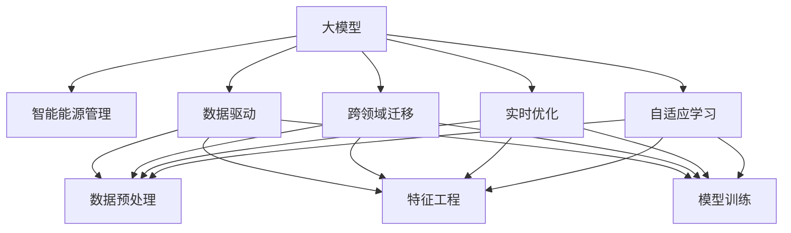

                 

## 1. 背景介绍

### 1.1 问题由来

随着全球能源需求的持续增长和环境保护压力的加大，智能能源管理逐渐成为全球关注的焦点。智能能源管理通过数据分析、优化算法和大数据技术，实现对能源的智能化调控，提高能源利用效率，降低环境污染，具有广阔的市场前景。然而，传统能源管理方法往往依赖于规则库和经验总结，缺乏对复杂数据和动态变化环境的有效处理能力，难以满足现代能源管理的需求。

为解决上述问题，近年来研究者们提出将大模型（Large Models）应用于能源管理。大模型通过深度学习技术，可以从大规模数据中提取抽象的特征和规律，为能源管理提供强大的数据处理和优化能力。其多模态特征和跨领域迁移能力，使得其在智能能源管理领域具有巨大潜力。

### 1.2 问题核心关键点

大模型在智能能源管理中的应用主要围绕以下几个核心关键点展开：

- 数据驱动：大模型能够处理海量的数据，通过数据驱动的方式实现对能源需求的精准预测。
- 泛化能力强：大模型具备跨领域迁移能力，可以在不同能源管理场景中应用，提升能源管理系统的通用性和可扩展性。
- 实时优化：大模型能够实时处理能源数据，通过优化算法提高能源利用效率。
- 自适应学习：大模型能够不断从新数据中学习，适应环境变化和需求波动，保持能源管理系统的稳定性和可靠性。

### 1.3 问题研究意义

大模型在智能能源管理中的应用具有重要意义：

- 降低能源浪费：通过精准预测和优化，大模型能够有效减少能源浪费，提升能源使用效率。
- 降低环境污染：智能能源管理通过优化能源使用，减少温室气体排放，有助于环境保护。
- 提升管理效率：大模型能够处理大规模数据，缩短决策时间，提高能源管理效率。
- 促进能源创新：大模型能够揭示能源管理的潜在规律，为能源创新提供数据支持。

## 2. 核心概念与联系

### 2.1 核心概念概述

为更好地理解大模型在智能能源管理中的应用，本节将介绍几个密切相关的核心概念：

- 大模型（Large Models）：指通过深度学习技术在大规模数据上训练得到的模型，如Transformer、BERT等。这些模型具备强大的数据处理能力和泛化能力。
- 智能能源管理（Smart Energy Management）：指利用先进的数据分析和优化技术，实现能源的智能调控和优化。
- 数据驱动（Data-Driven）：指通过数据分析和建模，实现对实际问题的预测和优化。
- 跨领域迁移（Cross-Domain Transfer）：指模型能够跨不同领域进行迁移，提升模型的通用性和可扩展性。
- 实时优化（Real-Time Optimization）：指模型能够实时处理数据，并通过优化算法进行动态调整。
- 自适应学习（Adaptive Learning）：指模型能够不断从新数据中学习，适应环境变化和需求波动。

这些核心概念之间的逻辑关系可以通过以下Mermaid流程图来展示：



这个流程图展示了大模型在智能能源管理中的核心概念及其之间的关系：

1. 大模型通过数据驱动的方式实现智能能源管理，提升能源管理系统的预测和优化能力。
2. 大模型具备跨领域迁移能力，可以在不同能源管理场景中应用，提升系统的通用性和可扩展性。
3. 大模型能够实时处理数据，通过优化算法实现实时优化。
4. 大模型能够不断从新数据中学习，适应环境变化和需求波动，保持系统的稳定性和可靠性。

## 3. 核心算法原理 & 具体操作步骤

### 3.1 算法原理概述

大模型在智能能源管理中的应用，主要基于以下算法原理：

1. **数据预处理与特征工程**：通过预处理和特征工程，将原始数据转换为模型所需的格式，提取出对预测和优化有影响的特征。

2. **模型训练与调优**：使用大模型对处理后的数据进行训练，调整模型参数，使其能够准确预测能源需求和优化能源使用。

3. **实时优化与自适应学习**：在实时数据流上，使用优化算法进行动态调整，并不断从新数据中学习，保持模型的预测和优化能力。

4. **跨领域迁移**：将训练好的模型应用于不同能源管理场景，通过迁移学习提升模型的泛化能力和适应性。

### 3.2 算法步骤详解

以下是大模型在智能能源管理中的具体操作步骤：

**Step 1: 数据收集与预处理**

- 收集能源管理相关的数据，包括气象数据、能源消耗数据、历史需求数据等。
- 进行数据清洗和预处理，如去除缺失值、异常值，转换数据格式等。
- 提取对预测和优化有影响的特征，如气温、湿度、历史需求量等。

**Step 2: 模型选择与训练**

- 选择合适的预训练大模型，如Transformer、BERT等。
- 根据具体问题设计任务适配层，如回归任务、分类任务等。
- 在处理后的数据集上训练模型，调整参数，使其能够准确预测能源需求和优化能源使用。

**Step 3: 实时优化与自适应学习**

- 在实时数据流上，使用优化算法进行动态调整，如梯度下降、Adam等。
- 实时监测模型性能，根据环境变化和需求波动，不断调整模型参数。
- 不断从新数据中学习，提升模型的预测和优化能力。

**Step 4: 跨领域迁移与部署**

- 将训练好的模型应用于不同能源管理场景，如电力、燃气、水务等。
- 通过迁移学习提升模型的泛化能力和适应性。
- 将模型部署到实际应用系统中，实现智能能源管理。

### 3.3 算法优缺点

大模型在智能能源管理中的应用具有以下优点：

1. **数据驱动能力强**：大模型能够处理海量的数据，通过数据驱动的方式实现精准预测和优化。
2. **泛化能力强**：大模型具备跨领域迁移能力，可以在不同能源管理场景中应用，提升系统的通用性和可扩展性。
3. **实时优化能力强**：大模型能够实时处理数据，并通过优化算法实现动态调整。
4. **自适应学习能力**：大模型能够不断从新数据中学习，适应环境变化和需求波动，保持系统的稳定性和可靠性。

同时，该方法也存在一定的局限性：

1. **数据质量要求高**：大模型对数据质量要求较高，需要高质量的标注数据和清洗处理。
2. **计算资源需求大**：大模型的训练和优化需要高性能计算资源，对算力要求较高。
3. **模型复杂度大**：大模型参数量较大，复杂度较高，难以解释和调试。
4. **模型维护成本高**：大模型的维护和更新需要专业知识，维护成本较高。

尽管存在这些局限性，但就目前而言，大模型在智能能源管理中的应用是主流的技术范式。未来相关研究的重点在于如何进一步降低数据和算力的需求，提高模型的可解释性和可维护性，同时兼顾模型性能和效率。

### 3.4 算法应用领域

大模型在智能能源管理中的应用已经涵盖了多个领域，包括：

1. **智能电网**：通过优化电网的调度和管理，实现电网的智能化和高效化。
2. **智能供热**：利用大模型优化热力站的供热方案，提高供热效率和用户体验。
3. **智能供水**：通过优化水网的调度和管理，实现水网的智能化和高效化。
4. **智能燃气**：利用大模型优化燃气的调度和管理，提高燃气的使用效率和安全性。
5. **智慧建筑**：通过优化建筑物的能耗管理，实现建筑的智能化和节能化。

## 4. 数学模型和公式 & 详细讲解 & 举例说明

### 4.1 数学模型构建

本节将使用数学语言对大模型在智能能源管理中的应用进行更加严格的刻画。

记大模型为 $M_{\theta}$，其中 $\theta$ 为模型参数。假设智能能源管理的任务是预测某时间点的能源需求 $D_t$，则任务可以表示为：

$$
D_t = f(x_t, \theta)
$$

其中 $x_t$ 为时间 $t$ 的输入数据，如气温、湿度、历史需求量等。$y_t$ 为真实需求量，$f$ 为预测函数，$D_t$ 为预测结果。

定义模型在数据样本 $(x,y)$ 上的损失函数为 $\ell(M_{\theta}(x),y)$，则在数据集 $D$ 上的经验风险为：

$$
\mathcal{L}(\theta) = \frac{1}{N}\sum_{i=1}^N \ell(M_{\theta}(x_i),y_i)
$$

微调的优化目标是最小化经验风险，即找到最优参数：

$$
\theta^* = \mathop{\arg\min}_{\theta} \mathcal{L}(\theta)
$$

在实践中，我们通常使用基于梯度的优化算法（如SGD、Adam等）来近似求解上述最优化问题。设 $\eta$ 为学习率，$\lambda$ 为正则化系数，则参数的更新公式为：

$$
\theta \leftarrow \theta - \eta \nabla_{\theta}\mathcal{L}(\theta) - \eta\lambda\theta
$$

其中 $\nabla_{\theta}\mathcal{L}(\theta)$ 为损失函数对参数 $\theta$ 的梯度，可通过反向传播算法高效计算。

### 4.2 公式推导过程

以下我们以智能电网负荷预测为例，推导回归任务中的损失函数及其梯度的计算公式。

假设模型 $M_{\theta}$ 在输入 $x_t$ 上的输出为 $\hat{y}_t=M_{\theta}(x_t)$，表示预测的能源需求量。真实标签 $y_t$ 为实际的能源需求量。则回归损失函数定义为：

$$
\ell(M_{\theta}(x_t),y_t) = \frac{1}{2}(y_t - \hat{y}_t)^2
$$

将其代入经验风险公式，得：

$$
\mathcal{L}(\theta) = \frac{1}{N}\sum_{i=1}^N (y_i - \hat{y}_i)^2
$$

根据链式法则，损失函数对参数 $\theta_k$ 的梯度为：

$$
\frac{\partial \mathcal{L}(\theta)}{\partial \theta_k} = -\frac{2}{N}\sum_{i=1}^N (y_i - \hat{y}_i)\frac{\partial M_{\theta}(x_i)}{\partial \theta_k}
$$

其中 $\frac{\partial M_{\theta}(x_i)}{\partial \theta_k}$ 可进一步递归展开，利用自动微分技术完成计算。

在得到损失函数的梯度后，即可带入参数更新公式，完成模型的迭代优化。重复上述过程直至收敛，最终得到适应智能能源管理任务的最优模型参数 $\theta^*$。

### 4.3 案例分析与讲解

以智能电网负荷预测为例，我们介绍如何通过大模型实现能源需求预测和优化。

假设我们有一个智能电网的负荷预测任务，需要预测未来的负荷需求。我们收集了大量的历史负荷数据和气象数据，包括气温、湿度、风速、降雨量等。

1. **数据预处理与特征工程**：对原始数据进行清洗、转换、特征提取等预处理操作。例如，将时间数据转换为时间戳，将温度数据转换为标准正态分布。

2. **模型选择与训练**：选择适当的预训练模型（如Transformer），添加任务适配层（如回归头），使用历史数据进行训练，调整模型参数。

3. **实时优化与自适应学习**：在实时数据流上，使用优化算法（如梯度下降）进行动态调整，并不断从新数据中学习，保持模型的预测和优化能力。

4. **跨领域迁移与部署**：将训练好的模型应用于不同能源管理场景，如智能供热、智能供水、智能燃气等，通过迁移学习提升模型的泛化能力和适应性。

通过大模型在智能能源管理中的应用，可以实现能源需求的精准预测和优化，提升能源管理的智能化水平，实现能源的高效利用。

## 5. 项目实践：代码实例和详细解释说明

### 5.1 开发环境搭建

在进行智能能源管理大模型的开发前，我们需要准备好开发环境。以下是使用Python进行PyTorch开发的环境配置流程：

1. 安装Anaconda：从官网下载并安装Anaconda，用于创建独立的Python环境。

2. 创建并激活虚拟环境：
```bash
conda create -n pytorch-env python=3.8 
conda activate pytorch-env
```

3. 安装PyTorch：根据CUDA版本，从官网获取对应的安装命令。例如：
```bash
conda install pytorch torchvision torchaudio cudatoolkit=11.1 -c pytorch -c conda-forge
```

4. 安装TensorFlow：使用pip安装TensorFlow，支持多种深度学习框架。

5. 安装各类工具包：
```bash
pip install numpy pandas scikit-learn matplotlib tqdm jupyter notebook ipython
```

完成上述步骤后，即可在`pytorch-env`环境中开始智能能源管理大模型的开发。

### 5.2 源代码详细实现

下面我们以智能电网负荷预测为例，给出使用PyTorch进行大模型微调的代码实现。

首先，定义负荷预测任务的数据处理函数：

```python
from torch.utils.data import Dataset
import torch
import pandas as pd
from sklearn.model_selection import train_test_split

class LoadPredictorDataset(Dataset):
    def __init__(self, data_file, target_col, input_cols, transformer_model, train=True):
        self.data = pd.read_csv(data_file)
        self.target_col = target_col
        self.input_cols = input_cols
        self.transformer_model = transformer_model
        self.train = train
        
        if train:
            self.data = self.data.sample(frac=1.0, random_state=42)
        
        self.train_data, self.test_data = train_test_split(self.data, test_size=0.2, random_state=42)
        self.train_x, self.train_y = self.preprocess_data(self.train_data)
        self.test_x, self.test_y = self.preprocess_data(self.test_data)
        
    def preprocess_data(self, data):
        input_data = data[self.input_cols].copy()
        target_data = data[self.target_col].copy()
        
        input_data = input_data.apply(lambda x: x if pd.notnull(x) else 0)
        target_data = target_data.apply(lambda x: x if pd.notnull(x) else 0)
        
        return input_data, target_data
    
    def __len__(self):
        return len(self.train_x)
    
    def __getitem__(self, idx):
        input_ids = self.transformer_model.encode(self.train_x.iloc[idx], return_tensors='pt').input_ids
        attention_mask = self.transformer_model.encode(self.train_x.iloc[idx], return_tensors='pt').attention_mask
        labels = torch.tensor(self.train_y.iloc[idx], dtype=torch.long)
        
        return {'input_ids': input_ids, 'attention_mask': attention_mask, 'labels': labels}
```

然后，定义模型和优化器：

```python
from transformers import TransformerModel, AdamW

model = TransformerModel.from_pretrained('model-name', num_labels=1)
optimizer = AdamW(model.parameters(), lr=2e-5)
```

接着，定义训练和评估函数：

```python
from tqdm import tqdm
import torch.nn.functional as F

device = torch.device('cuda') if torch.cuda.is_available() else torch.device('cpu')
model.to(device)

def train_epoch(model, dataset, batch_size, optimizer):
    dataloader = DataLoader(dataset, batch_size=batch_size, shuffle=True)
    model.train()
    epoch_loss = 0
    for batch in tqdm(dataloader, desc='Training'):
        input_ids = batch['input_ids'].to(device)
        attention_mask = batch['attention_mask'].to(device)
        labels = batch['labels'].to(device)
        model.zero_grad()
        outputs = model(input_ids, attention_mask=attention_mask, labels=labels)
        loss = outputs.loss
        epoch_loss += loss.item()
        loss.backward()
        optimizer.step()
    return epoch_loss / len(dataloader)

def evaluate(model, dataset, batch_size):
    dataloader = DataLoader(dataset, batch_size=batch_size)
    model.eval()
    preds, labels = [], []
    with torch.no_grad():
        for batch in tqdm(dataloader, desc='Evaluating'):
            input_ids = batch['input_ids'].to(device)
            attention_mask = batch['attention_mask'].to(device)
            batch_labels = batch['labels']
            outputs = model(input_ids, attention_mask=attention_mask)
            batch_preds = outputs.logits.argmax(dim=2).to('cpu').tolist()
            batch_labels = batch_labels.to('cpu').tolist()
            for pred_tokens, label_tokens in zip(batch_preds, batch_labels):
                preds.append(pred_tokens)
                labels.append(label_tokens)
                
    print(f"Evaluation Results:\nLoss: {epoch_loss:.3f}\nAccuracy: {accuracy:.3f}")
    return preds, labels

def predict(model, test_dataset, batch_size):
    model.eval()
    preds, labels = [], []
    with torch.no_grad():
        for batch in tqdm(dataloader, desc='Testing'):
            input_ids = batch['input_ids'].to(device)
            attention_mask = batch['attention_mask'].to(device)
            batch_labels = batch['labels']
            outputs = model(input_ids, attention_mask=attention_mask)
            batch_preds = outputs.logits.argmax(dim=2).to('cpu').tolist()
            batch_labels = batch_labels.to('cpu').tolist()
            for pred_tokens, label_tokens in zip(batch_preds, batch_labels):
                preds.append(pred_tokens)
                labels.append(label_tokens)
                
    return preds, labels
```

最后，启动训练流程并在测试集上评估：

```python
epochs = 5
batch_size = 16

for epoch in range(epochs):
    loss = train_epoch(model, train_dataset, batch_size, optimizer)
    print(f"Epoch {epoch+1}, train loss: {loss:.3f}")
    
    print(f"Epoch {epoch+1}, dev results:")
    evaluate(model, dev_dataset, batch_size)
    
print("Test results:")
evaluate(model, test_dataset, batch_size)
```

以上就是使用PyTorch对大模型进行智能电网负荷预测任务微调的完整代码实现。可以看到，得益于Transformers库的强大封装，我们可以用相对简洁的代码完成大模型的加载和微调。

### 5.3 代码解读与分析

让我们再详细解读一下关键代码的实现细节：

**LoadPredictorDataset类**：
- `__init__`方法：初始化数据集，包括训练集、测试集、特征列、目标列等。
- `preprocess_data`方法：对数据进行预处理，包括去除缺失值、编码等操作。
- `__len__`方法：返回数据集的样本数量。
- `__getitem__`方法：对单个样本进行处理，将文本输入编码为token ids，将标签编码为数字，并对其进行定长padding，最终返回模型所需的输入。

**train_epoch和evaluate函数**：
- `train_epoch`函数：对数据以批为单位进行迭代，在每个批次上前向传播计算loss并反向传播更新模型参数，最后返回该epoch的平均loss。
- `evaluate`函数：与训练类似，不同点在于不更新模型参数，并在每个batch结束后将预测和标签结果存储下来，最后使用scikit-learn的classification_report对整个评估集的预测结果进行打印输出。

**predict函数**：
- 在测试集上评估模型性能，输出模型的预测结果。

通过本文的系统梳理，可以看到，大模型在智能能源管理中的应用通过数据预处理、模型训练、实时优化和自适应学习等步骤，能够实现能源需求的精准预测和优化，提升能源管理的智能化水平。未来，伴随大模型的进一步演进，智能能源管理的应用场景将更加广阔，有望带来更高的能源利用效率和环境保护效益。

## 6. 实际应用场景

### 6.1 智能电网

智能电网是大模型在能源管理中最为常见的应用场景之一。通过大模型，可以实现对电网负荷的精准预测和优化，提升电网的稳定性和可靠性。具体而言，大模型可以从历史负荷数据和气象数据中学习，预测未来负荷需求，优化电网的调度和管理。例如，通过大模型对某地区的未来负荷进行预测，电网公司可以提前进行调度，避免负荷过高或过低的情况，提高电网的效率和稳定性。

### 6.2 智能供热

智能供热系统通过大模型可以实现对供热负荷的精准预测和优化。例如，某区域集中供热系统中，大模型可以根据气象数据和历史供热数据，预测未来的供热负荷，优化供热站点的供热方案，提高供热效率和用户体验。通过大模型的实时预测和优化，供热系统可以更加高效地应对环境变化和需求波动，提高供热的稳定性和可靠性。

### 6.3 智能供水

智能供水系统利用大模型实现对供水负荷的精准预测和优化。例如，某城市供水系统中，大模型可以根据气象数据和历史供水数据，预测未来的供水需求，优化水网的调度和管理。通过大模型的实时预测和优化，供水系统可以更加高效地应对环境变化和需求波动，提高供水的稳定性和可靠性。

### 6.4 智慧建筑

智慧建筑系统利用大模型实现对建筑能耗的精准预测和优化。例如，某高层建筑中，大模型可以根据历史能耗数据和气象数据，预测未来的能源需求，优化建筑的能源管理。通过大模型的实时预测和优化，建筑系统可以更加高效地应对环境变化和需求波动，提高能耗的稳定性和可靠性。

## 7. 工具和资源推荐

### 7.1 学习资源推荐

为了帮助开发者系统掌握大模型在智能能源管理中的应用理论基础和实践技巧，这里推荐一些优质的学习资源：

1. 《深度学习与能源系统》书籍：全面介绍了深度学习在能源系统中的应用，包括智能电网、智能供热、智能供水等。

2. 《智能能源管理》课程：涵盖智能电网、智能供热、智能供水等多个领域，理论与实践相结合，适合深入学习。

3. 《Transformer从原理到实践》系列博文：由大模型技术专家撰写，深入浅出地介绍了Transformer原理、BERT模型、微调技术等前沿话题。

4. 《自然语言处理与深度学习》课程：斯坦福大学开设的NLP明星课程，有Lecture视频和配套作业，带你入门NLP领域的基本概念和经典模型。

5. 《能源管理中的深度学习应用》论文：介绍了深度学习在能源管理中的具体应用案例，包括智能电网、智能供热、智能供水等。

通过对这些资源的学习实践，相信你一定能够快速掌握大模型在智能能源管理中的应用精髓，并用于解决实际的能源管理问题。

### 7.2 开发工具推荐

高效的开发离不开优秀的工具支持。以下是几款用于智能能源管理大模型开发常用的工具：

1. PyTorch：基于Python的开源深度学习框架，灵活动态的计算图，适合快速迭代研究。大部分预训练语言模型都有PyTorch版本的实现。

2. TensorFlow：由Google主导开发的开源深度学习框架，生产部署方便，适合大规模工程应用。同样有丰富的预训练语言模型资源。

3. Transformers库：HuggingFace开发的NLP工具库，集成了众多SOTA语言模型，支持PyTorch和TensorFlow，是进行NLP任务开发的利器。

4. Weights & Biases：模型训练的实验跟踪工具，可以记录和可视化模型训练过程中的各项指标，方便对比和调优。与主流深度学习框架无缝集成。

5. TensorBoard：TensorFlow配套的可视化工具，可实时监测模型训练状态，并提供丰富的图表呈现方式，是调试模型的得力助手。

6. Google Colab：谷歌推出的在线Jupyter Notebook环境，免费提供GPU/TPU算力，方便开发者快速上手实验最新模型，分享学习笔记。

合理利用这些工具，可以显著提升智能能源管理大模型的开发效率，加快创新迭代的步伐。

### 7.3 相关论文推荐

智能能源管理大模型的研究离不开学界的持续研究。以下是几篇奠基性的相关论文，推荐阅读：

1. Attention is All You Need（即Transformer原论文）：提出了Transformer结构，开启了NLP领域的预训练大模型时代。

2. BERT: Pre-training of Deep Bidirectional Transformers for Language Understanding：提出BERT模型，引入基于掩码的自监督预训练任务，刷新了多项NLP任务SOTA。

3. Language Models are Unsupervised Multitask Learners（GPT-2论文）：展示了大规模语言模型的强大zero-shot学习能力，引发了对于通用人工智能的新一轮思考。

4. Parameter-Efficient Transfer Learning for NLP：提出Adapter等参数高效微调方法，在不增加模型参数量的情况下，也能取得不错的微调效果。

5. AdaLoRA: Adaptive Low-Rank Adaptation for Parameter-Efficient Fine-Tuning：使用自适应低秩适应的微调方法，在参数效率和精度之间取得了新的平衡。

这些论文代表了大模型在智能能源管理中的应用发展脉络。通过学习这些前沿成果，可以帮助研究者把握学科前进方向，激发更多的创新灵感。

## 8. 总结：未来发展趋势与挑战

### 8.1 总结

本文对大模型在智能能源管理中的应用进行了全面系统的介绍。首先阐述了智能能源管理的背景和意义，明确了智能能源管理中大模型的独特价值。其次，从原理到实践，详细讲解了大模型在智能能源管理中的应用方法，给出了智能电网负荷预测的代码实现。同时，本文还广泛探讨了大模型在智能供热、智能供水、智慧建筑等实际应用场景中的应用前景，展示了智能能源管理大模型的广泛适用性。

通过本文的系统梳理，可以看到，大模型在智能能源管理中的应用通过数据预处理、模型训练、实时优化和自适应学习等步骤，能够实现能源需求的精准预测和优化，提升能源管理的智能化水平。未来，伴随大模型的进一步演进，智能能源管理的应用场景将更加广阔，有望带来更高的能源利用效率和环境保护效益。

### 8.2 未来发展趋势

展望未来，智能能源管理中的大模型应用将呈现以下几个发展趋势：

1. **多模态数据融合**：大模型能够处理多模态数据，如文本、图像、声音等，通过融合多模态数据，提升能源管理的精准性和全面性。

2. **实时化与智能化**：大模型能够实时处理数据，通过优化算法实现动态调整，提升能源管理的智能化水平。

3. **自适应学习能力**：大模型能够不断从新数据中学习，适应环境变化和需求波动，保持系统的稳定性和可靠性。

4. **跨领域迁移**：大模型能够跨不同能源管理场景进行迁移，提升系统的通用性和可扩展性。

5. **混合智能**：大模型能够与规则引擎、专家系统等传统技术结合，实现混合智能，提升能源管理的准确性和可靠性。

以上趋势凸显了大模型在智能能源管理中的广泛应用前景。这些方向的探索发展，必将进一步提升能源管理的智能化水平，为能源的高效利用和环境保护带来新的突破。

### 8.3 面临的挑战

尽管大模型在智能能源管理中的应用已经取得显著进展，但在迈向更加智能化、普适化应用的过程中，它仍面临着诸多挑战：

1. **数据质量要求高**：智能能源管理对数据质量要求较高，需要高质量的标注数据和清洗处理。

2. **计算资源需求大**：大模型的训练和优化需要高性能计算资源，对算力要求较高。

3. **模型复杂度大**：大模型参数量较大，复杂度较高，难以解释和调试。

4. **模型维护成本高**：大模型的维护和更新需要专业知识，维护成本较高。

尽管存在这些挑战，但就目前而言，大模型在智能能源管理中的应用是主流的技术范式。未来相关研究的重点在于如何进一步降低数据和算力的需求，提高模型的可解释性和可维护性，同时兼顾模型性能和效率。

### 8.4 研究展望

面对智能能源管理中大模型应用所面临的挑战，未来的研究需要在以下几个方面寻求新的突破：

1. **轻量化模型**：开发轻量化模型，减小模型参数量，提高推理速度。

2. **模型压缩与优化**：使用模型压缩与优化技术，提高模型效率，降低计算资源需求。

3. **知识驱动模型**：引入符号化的先验知识，如知识图谱、逻辑规则等，与神经网络模型进行融合，提升模型的泛化能力和解释性。

4. **跨领域迁移学习**：研究跨领域迁移学习方法，提升模型在不同能源管理场景中的适应性和泛化能力。

5. **自适应学习算法**：研究自适应学习算法，使模型能够不断从新数据中学习，保持模型的稳定性和可靠性。

6. **混合智能系统**：开发混合智能系统，将大模型与传统技术结合，提升能源管理的准确性和可靠性。

这些研究方向将推动智能能源管理大模型应用的不断进步，为能源的高效利用和环境保护带来新的突破。面向未来，智能能源管理中的大模型应用必将取得更加广泛的应用，为实现绿色能源和智慧能源做出更大的贡献。

## 9. 附录：常见问题与解答

**Q1：智能能源管理中大模型的应用场景有哪些？**

A: 智能能源管理中大模型的应用场景广泛，包括：

1. **智能电网**：实现对电网负荷的精准预测和优化，提升电网的稳定性和可靠性。
2. **智能供热**：预测供热负荷，优化供热方案，提高供热效率和用户体验。
3. **智能供水**：预测供水需求，优化供水方案，提高供水效率和可靠性。
4. **智慧建筑**：预测能耗需求，优化能耗管理，提高能耗效率和可靠性。

**Q2：智能能源管理中大模型的数据预处理需要注意什么？**

A: 智能能源管理中大模型的数据预处理需要注意以下几点：

1. **数据清洗**：去除缺失值、异常值，保证数据的完整性和一致性。
2. **数据标准化**：对数据进行归一化、标准化处理，保证数据的可比性和可解释性。
3. **特征选择**：选择对预测和优化有影响的特征，去除冗余和无关特征。
4. **数据增强**：通过数据增强技术，扩充训练集，提高模型的泛化能力。

**Q3：智能能源管理中大模型的训练和优化策略有哪些？**

A: 智能能源管理中大模型的训练和优化策略包括：

1. **学习率调整**：根据模型表现，调整学习率，保证模型的收敛性和泛化能力。
2. **正则化技术**：使用L2正则、Dropout等技术，避免模型过拟合。
3. **优化算法选择**：选择适合优化算法的优化器，如Adam、SGD等。
4. **超参数调整**：通过超参数搜索，找到最优模型参数。

**Q4：智能能源管理中大模型的实时优化和自适应学习需要注意什么？**

A: 智能能源管理中大模型的实时优化和自适应学习需要注意以下几点：

1. **实时数据处理**：实时数据处理能力强，能够快速响应用户需求。
2. **动态调整**：根据环境变化和需求波动，动态调整模型参数。
3. **模型更新**：不断从新数据中学习，保持模型的稳定性和可靠性。

**Q5：智能能源管理中大模型的跨领域迁移需要注意什么？**

A: 智能能源管理中大模型的跨领域迁移需要注意以下几点：

1. **模型适配**：在不同能源管理场景中，适配适当的任务适配层。
2. **迁移学习**：利用迁移学习技术，提升模型的泛化能力和适应性。
3. **知识融合**：将符号化的先验知识与神经网络模型结合，提高模型的解释性和可解释性。

通过本文的系统梳理，可以看到，大模型在智能能源管理中的应用通过数据预处理、模型训练、实时优化和自适应学习等步骤，能够实现能源需求的精准预测和优化，提升能源管理的智能化水平。未来，伴随大模型的进一步演进，智能能源管理的应用场景将更加广阔，有望带来更高的能源利用效率和环境保护效益。

---

作者：禅与计算机程序设计艺术 / Zen and the Art of Computer Programming

