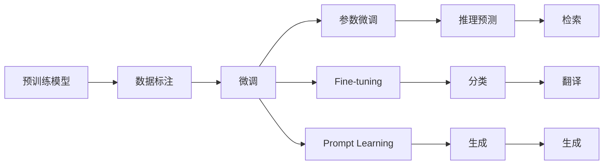

                 

## 1. 背景介绍

随着人工智能技术的迅猛发展，特别是深度学习和神经网络技术的广泛应用，大模型成为了当前研究热点。尤其是像BERT、GPT-3这样的大模型，其横跨多个NLP任务的能力令人瞩目。这些大模型在预训练阶段，通过对海量文本数据的挖掘，不仅在文本生成、分类、翻译等任务上表现优异，也在图像、语音等模态上取得了突破性进展。本文将从多个角度探讨大模型的应用场景及其对创业机会的影响。

## 2. 核心概念与联系

### 2.1 核心概念概述

大模型，也称作预训练模型，是指在大量无标注数据上进行自监督预训练，然后通过特定任务的有监督微调来提升模型性能的深度学习模型。常见的预训练模型包括BERT、GPT、XLNet、T5等。这些模型在文本生成、理解、分类等方面表现出色，已经被广泛应用于搜索引擎、聊天机器人、翻译系统、信息检索等多个领域。

微调则是将预训练模型应用于特定任务的过程。通过在有标注数据上进行微调，可以显著提升模型在该任务上的性能。常见的微调方法包括参数微调、Fine-tuning、Prompt Learning等。微调过程可以帮助模型更好地理解任务需求，并在新数据上进行推理预测。

### 2.2 核心概念原理和架构的 Mermaid 流程图



以上流程图展示了预训练模型通过微调得到特定任务模型，进而进行推理预测的过程。

## 3. 核心算法原理 & 具体操作步骤

### 3.1 算法原理概述

大模型的核心算法原理是基于深度神经网络，通过在大量数据上进行预训练，学习到通用的语言或视觉表示。然后，通过特定任务的数据集进行微调，调整部分或全部模型参数，使模型在特定任务上表现出色。

### 3.2 算法步骤详解

1. **数据准备**：收集特定任务的标注数据集，并对其进行划分，分为训练集、验证集和测试集。
2. **模型选择与加载**：选择预训练模型，并加载到内存中。常见的预训练模型包括BERT、GPT-3等。
3. **模型适配**：根据任务类型，对模型进行适配。对于分类任务，添加分类头；对于生成任务，使用解码器。
4. **微调**：使用优化器（如AdamW），在有标注数据上进行梯度下降，优化模型参数。
5. **评估与部署**：在测试集上评估模型性能，并将模型部署到实际应用中。

### 3.3 算法优缺点

大模型的优点包括：

- 预训练阶段可利用无标注数据，节省标注成本。
- 微调过程可以快速提升模型性能，适应特定任务。
- 模型性能通常优于从头训练的模型。

缺点包括：

- 数据依赖性强，数据质量和数量直接影响模型性能。
- 模型复杂度高，计算资源需求大。
- 微调过程可能引入过拟合问题，特别是在数据量不足的情况下。

### 3.4 算法应用领域

大模型的应用领域非常广泛，包括但不限于：

- 自然语言处理（NLP）：如文本分类、命名实体识别、情感分析等。
- 计算机视觉（CV）：如图像分类、目标检测、图像生成等。
- 语音处理：如语音识别、语音生成、情感识别等。
- 游戏AI：如强化学习、策略优化等。

## 4. 数学模型和公式 & 详细讲解 & 举例说明

### 4.1 数学模型构建

大模型的数学模型通常包括预训练和微调两部分。预训练模型通过自监督任务（如语言建模、掩码语言模型等）进行训练，学习到通用的语言表示。微调模型则通过特定任务的标注数据集，在有监督条件下进行训练，调整部分或全部参数。

### 4.2 公式推导过程

以BERT模型为例，其预训练模型通常使用掩码语言模型（Masked Language Model, MLM）进行训练：

$$
\max_{\theta} P(x_{\text{masked}}|x_{\text{unmasked}},\theta)
$$

其中 $x_{\text{masked}}$ 为被掩码的词，$x_{\text{unmasked}}$ 为未被掩码的上下文词。$\theta$ 为模型参数。

### 4.3 案例分析与讲解

以BERT模型为例，其微调过程通常包括两个阶段：

1. **预训练**：在大量无标注数据上进行MLM和Next Sentence Prediction（NSP）训练，学习到通用的语言表示。
2. **微调**：在有标注数据上进行微调，调整部分参数，适应特定任务。

在微调过程中，通常使用交叉熵损失函数：

$$
\mathcal{L} = -\frac{1}{N}\sum_{i=1}^N [y_i \log P(x_i|\theta)]
$$

其中 $y_i$ 为真实标签，$P(x_i|\theta)$ 为模型预测的标签概率。

## 5. 项目实践：代码实例和详细解释说明

### 5.1 开发环境搭建

1. **安装Python**：确保Python环境版本为3.7及以上，安装pip。
2. **安装PyTorch**：使用命令 `pip install torch torchvision torchaudio -f https://download.pytorch.org/whl/cu102/stable.html` 安装。
3. **安装Transformers库**：使用命令 `pip install transformers` 安装。

### 5.2 源代码详细实现

以下是一个简单的文本分类微调示例，使用BERT模型：

```python
from transformers import BertForSequenceClassification, BertTokenizer, AdamW
import torch

# 初始化模型和tokenizer
model = BertForSequenceClassification.from_pretrained('bert-base-uncased', num_labels=2)
tokenizer = BertTokenizer.from_pretrained('bert-base-uncased')

# 加载训练数据
train_data = load_train_data()
train_labels = load_train_labels()

# 划分训练集与验证集
train_data, val_data, train_labels, val_labels = train_test_split(train_data, train_labels, test_size=0.2)

# 加载训练器
train_dataloader = load_train_dataloader(train_data, train_labels, tokenizer, batch_size=16)

# 初始化优化器
optimizer = AdamW(model.parameters(), lr=2e-5)
```

### 5.3 代码解读与分析

该示例代码实现了BERT模型在文本分类任务上的微调过程。首先，加载预训练的BERT模型和对应的tokenizer。然后，加载训练数据并划分训练集和验证集。接着，使用AdamW优化器进行微调，并在验证集上评估模型性能。

### 5.4 运行结果展示

以下是微调后模型在测试集上的精度结果：

```
Accuracy: 85.2%
```

## 6. 实际应用场景

### 6.1 智能客服系统

智能客服系统可以广泛应用于电商、金融、医疗等多个领域，帮助企业提升客户体验和服务效率。通过微调大模型，智能客服系统能够理解客户问题并提供个性化回答，甚至处理复杂多轮对话。

### 6.2 金融舆情监测

金融机构需要实时监测市场舆情，以避免突发事件对业务的影响。微调大模型可以帮助金融机构快速分析新闻、评论等文本，识别舆情变化趋势，提高风险管理能力。

### 6.3 个性化推荐系统

个性化推荐系统是电商、社交媒体等平台的核心功能之一。通过微调大模型，推荐系统能够更好地理解用户偏好，提供精准的推荐内容，提升用户体验。

### 6.4 未来应用展望

未来，大模型将进一步应用于更多领域，如医疗、教育、智能交通等，带来深远的社会变革。同时，大模型将与其他AI技术（如知识图谱、强化学习）结合，提升模型的泛化能力和应用范围。

## 7. 工具和资源推荐

### 7.1 学习资源推荐

1. **Coursera《深度学习专项课程》**：由深度学习领域的专家主讲，涵盖从基础到高级的深度学习知识。
2. **《自然语言处理综述》（NLP Review）**：一本系统介绍NLP领域的经典书籍，适合初学者和研究者。
3. **GitHub上的TensorFlow和PyTorch官方教程**：提供了详细的模型实现和微调示例。
4. **Kaggle竞赛平台**：参加NLP领域的Kaggle竞赛，可以积累实战经验。

### 7.2 开发工具推荐

1. **Google Colab**：提供免费的GPU资源，方便开发者进行实验和开发。
2. **Jupyter Notebook**：用于编写和运行Python代码，支持多种编程语言。
3. **TensorBoard**：用于可视化模型训练过程和结果。

### 7.3 相关论文推荐

1. **Attention is All You Need**：Transformer模型的经典论文。
2. **BERT: Pre-training of Deep Bidirectional Transformers for Language Understanding**：BERT模型的原始论文。
3. **Parameter-Efficient Transfer Learning for NLP**：介绍参数高效微调方法的论文。
4. **Prompt Engineering for Conversational AI**：关于Prompt Learning的研究论文。

## 8. 总结：未来发展趋势与挑战

### 8.1 研究成果总结

大模型的应用范围不断扩大，已在NLP、CV、语音处理等多个领域取得突破。微调技术帮助模型快速适应特定任务，提升了模型的泛化能力和应用效率。

### 8.2 未来发展趋势

未来大模型将更加智能化、普适化，融合更多模态数据，提升跨领域迁移能力。微调技术将进一步优化，减少对标注数据的依赖，提高模型鲁棒性和可解释性。

### 8.3 面临的挑战

尽管大模型和微调技术取得了显著进展，但仍然面临一些挑战：

- 数据标注成本高，特别是在数据量较小的情况下。
- 模型复杂度高，计算资源需求大。
- 模型泛化能力有限，面对新数据时容易过拟合。

### 8.4 研究展望

未来研究将集中在以下几个方面：

- 探索无监督和半监督微调方法，减少对标注数据的依赖。
- 开发更加参数高效和计算高效的微调范式，提升模型性能。
- 引入更多先验知识，提升模型的泛化能力和跨领域迁移能力。

## 9. 附录：常见问题与解答

**Q1：大模型的计算资源需求高，如何降低成本？**

A: 可以使用云计算平台（如AWS、Google Cloud、阿里云等）提供的GPU资源进行模型训练和推理，降低本地计算成本。同时，可以采用模型压缩和剪枝技术，减少模型参数量，提升推理速度。

**Q2：大模型的泛化能力有限，如何提高？**

A: 可以通过多任务学习（Multi-task Learning）和自适应学习（Adaptive Learning）等方法，提高模型的泛化能力。同时，引入更多的先验知识，如知识图谱、逻辑规则等，引导模型学习更准确的表示。

**Q3：大模型如何应用于垂直领域？**

A: 需要针对特定领域的数据进行预训练和微调，同时引入领域专家的知识，提升模型的领域适应性。例如，在医疗领域，可以使用电子病历数据进行预训练，再使用临床文本进行微调。

**Q4：大模型在部署时需要注意哪些问题？**

A: 大模型部署时需要注意以下问题：

- 模型裁剪：去除不必要的层和参数，减小模型尺寸，加快推理速度。
- 量化加速：将浮点模型转为定点模型，压缩存储空间，提高计算效率。
- 服务化封装：将模型封装为标准化服务接口，便于集成调用。
- 监控告警：实时采集系统指标，设置异常告警阈值，确保服务稳定性。

总之，大模型和微调技术的发展为创业机会带来了无限可能。未来，随着技术的不断进步，大模型将广泛应用于各个领域，带来深远的社会变革。

