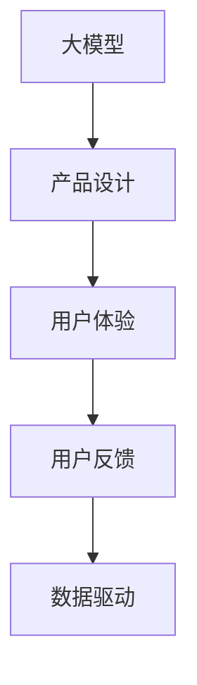

                 

# 大模型应用的产品设计与用户体验提升策略

> 关键词：产品设计,用户体验,大模型应用,策略,技术优化

## 1. 背景介绍

### 1.1 问题由来
在人工智能快速发展的今天，大模型如BERT、GPT等，正在逐渐被应用于各种产品和服务中。然而，如何设计这些产品，以及如何提升用户体验，成为了亟待解决的问题。本文将重点讨论大模型在产品设计中的应用，以及如何通过优化用户体验来提升产品的用户满意度和市场竞争力。

### 1.2 问题核心关键点
大模型应用的核心关键点包括以下几点：
- 如何将大模型的能力融入到产品的各个环节中？
- 如何根据用户行为和反馈来调整和优化产品设计？
- 如何提升用户在使用产品时的体验感？
- 如何通过数据驱动的方法来持续改进产品设计？

### 1.3 问题研究意义
提升大模型应用产品的用户体验，对于推动人工智能技术的普及和应用具有重要意义：

1. 增强用户粘性：提升用户体验可以增强用户对产品的依赖和粘性，增加用户留存率。
2. 提升品牌形象：良好的用户体验可以提升品牌的形象和口碑，吸引更多用户。
3. 促进商业转化：用户体验的提升直接关系到商业转化的效果，可以提升销售额和市场份额。
4. 提升团队士气：成功的用户体验优化可以提升团队的士气和自信心，推动团队不断创新和进步。
5. 推动社会进步：好的用户体验可以推动社会的整体进步，提高生活质量和工作效率。

## 2. 核心概念与联系

### 2.1 核心概念概述

为更好地理解大模型在产品设计中的应用，本文将介绍几个关键概念：

- 大模型：如BERT、GPT等，通过大规模语料库训练出的深度学习模型，具备强大的语言理解和生成能力。
- 产品设计：从用户体验的角度出发，结合大模型能力，设计出满足用户需求的产品。
- 用户体验：用户在使用产品时的直观感受，包括易用性、效率、满意度等方面。
- 用户反馈：用户在使用产品时对体验的评价和建议。
- 数据驱动：通过收集和分析用户数据，驱动产品设计和优化。

这些概念之间的逻辑关系可以通过以下Mermaid流程图来展示：



这个流程图展示了大模型应用到产品设计中，通过用户体验和用户反馈来驱动的优化过程。

## 3. 核心算法原理 & 具体操作步骤
### 3.1 算法原理概述

大模型应用的产品设计与用户体验提升，本质上是一个基于用户反馈的迭代优化过程。其核心思想是：通过收集用户反馈，利用大模型对用户行为进行分析和预测，不断优化产品设计，提升用户体验。

形式化地，假设当前产品为 $P$，用户反馈为 $F$，设计参数为 $\theta$，则优化目标为：

$$
\theta^* = \mathop{\arg\min}_{\theta} \mathcal{L}(P_\theta, F)
$$

其中 $\mathcal{L}$ 为优化损失函数，衡量产品 $P$ 与用户反馈 $F$ 的契合度。通常使用交叉熵损失函数或均方误差损失函数来衡量。

优化算法通常采用梯度下降法，根据用户反馈对设计参数 $\theta$ 进行迭代更新，最小化优化损失函数 $\mathcal{L}$，直到产品 $P$ 与用户反馈 $F$ 的契合度达到理想状态。

### 3.2 算法步骤详解

基于用户反馈的大模型应用产品设计与用户体验提升，一般包括以下几个关键步骤：

**Step 1: 收集用户反馈**

- 设计用户反馈收集机制，如问卷调查、用户评论、使用日志等，获取用户对产品功能、界面、性能等方面的评价和建议。
- 对用户反馈进行分类和整理，明确用户关注点和改进方向。

**Step 2: 利用大模型分析用户行为**

- 对用户反馈进行预处理和清洗，去除噪声和无效信息。
- 利用大模型对用户反馈进行情感分析、主题分析等，提取用户关注点和改进建议的关键词和主题。
- 使用大模型对用户行为进行建模，如使用序列模型预测用户行为，使用分类模型识别用户偏好。

**Step 3: 优化产品设计**

- 根据用户反馈和行为分析结果，调整和优化产品设计。如调整产品界面、增加新功能、改进性能等。
- 在优化过程中，利用A/B测试等方法评估产品改进的效果，确保优化方向正确。

**Step 4: 测试和迭代**

- 在产品上线的测试阶段，再次收集用户反馈，评估优化效果。
- 根据测试结果，进一步迭代优化产品设计，直至用户反馈和产品性能满意为止。

### 3.3 算法优缺点

大模型应用的产品设计与用户体验提升方法具有以下优点：
1. 数据驱动：通过收集和分析用户数据，能够更准确地把握用户需求，驱动产品优化。
2. 用户中心：以用户为中心的设计理念，能够提升用户的满意度和粘性。
3. 效率高：利用大模型的强大计算能力，可以更快地识别用户需求，做出优化决策。
4. 灵活性高：可以针对不同用户群体进行个性化设计，提升用户体验。

同时，该方法也存在一些局限性：
1. 数据质量依赖：用户反馈的质量直接影响优化效果，数据质量不高可能导致误判和误优。
2. 反馈延迟：用户反馈的收集和分析过程可能较为缓慢，影响产品迭代速度。
3. 数据隐私问题：收集用户反馈和行为数据，涉及隐私保护和数据安全问题。
4. 模型复杂度：大模型的复杂度可能较高，需要较高的计算资源和专业知识。

尽管存在这些局限性，但基于用户反馈的大模型应用方法仍是大规模产品设计与优化的一种有效途径。未来相关研究的方向在于如何进一步提高数据收集的效率和质量，加强用户隐私保护，同时降低大模型的计算复杂度。

### 3.4 算法应用领域

大模型应用的产品设计与用户体验提升方法，在各种产品和服务中都有广泛的应用，例如：

- 智能客服系统：通过收集用户对客服服务的评价和建议，不断优化聊天机器人的交互设计和回答质量。
- 电商平台：通过分析用户浏览和购买行为，推荐个性化的商品和优惠券，提升用户体验。
- 医疗健康：通过收集用户对健康咨询和在线诊疗的反馈，优化系统的交互设计和内容推荐。
- 教育学习：通过分析学生对在线课程的评价和反馈，优化课程内容和教学方法，提升学习效果。
- 金融理财：通过收集用户对金融产品的评价和建议，优化产品的功能和用户体验。
- 社交媒体：通过分析用户在社交媒体上的互动行为，优化内容推荐和界面设计。

除了上述这些经典应用外，大模型在更多领域的应用也正在不断涌现，如智能家居、智能交通、智能制造等，为各行各业带来了新的技术革新。

## 4. 数学模型和公式 & 详细讲解  
### 4.1 数学模型构建

本节将使用数学语言对大模型应用的产品设计与用户体验提升过程进行更加严格的刻画。

假设用户反馈为 $F=\{x_i, y_i\}_{i=1}^N$，其中 $x_i$ 为输入（如用户评价、行为数据），$y_i$ 为输出（如满意度评分）。设计参数为 $\theta$，则优化目标为：

$$
\theta^* = \mathop{\arg\min}_{\theta} \mathcal{L}(P_\theta, F)
$$

其中 $\mathcal{L}$ 为优化损失函数，可以采用交叉熵损失函数来衡量产品与用户反馈的契合度。具体地，设 $P_\theta$ 为设计参数 $\theta$ 下的产品输出，则交叉熵损失函数定义为：

$$
\mathcal{L}(P_\theta, F) = -\frac{1}{N} \sum_{i=1}^N y_i \log P_\theta(x_i) + (1-y_i) \log (1-P_\theta(x_i))
$$

### 4.2 公式推导过程

以下我们以智能客服系统的优化为例，推导交叉熵损失函数及其梯度的计算公式。

设智能客服系统的设计参数为 $\theta$，用户对客服服务的评价为 $x_i$，满意度评分为 $y_i$。则交叉熵损失函数可以表示为：

$$
\mathcal{L}(P_\theta, F) = -\frac{1}{N} \sum_{i=1}^N y_i \log P_\theta(x_i) + (1-y_i) \log (1-P_\theta(x_i))
$$

其中 $P_\theta(x_i)$ 为设计参数 $\theta$ 下的智能客服系统的输出，可以是一个二分类概率。

为了最小化交叉熵损失，需要求出模型 $P_\theta$ 对设计参数 $\theta$ 的梯度：

$$
\frac{\partial \mathcal{L}(P_\theta, F)}{\partial \theta} = -\frac{1}{N} \sum_{i=1}^N (y_i \frac{\partial P_\theta(x_i)}{\partial \theta} - (1-y_i) \frac{\partial (1-P_\theta(x_i))}{\partial \theta})
$$

通过反向传播算法，可以高效计算出上述梯度。

### 4.3 案例分析与讲解

**案例：电商平台个性化推荐系统**

假设电商平台对用户浏览和购买行为进行分析，使用大模型预测用户对商品 $i$ 的兴趣评分 $y_i$，并根据评分进行商品推荐。具体步骤如下：

1. 收集用户浏览和购买数据 $F=\{x_i, y_i\}_{i=1}^N$。
2. 使用大模型对用户行为进行建模，得到商品评分模型 $P_\theta(x_i)$。
3. 利用交叉熵损失函数，对商品评分模型进行优化，最小化损失函数 $\mathcal{L}(P_\theta, F)$。
4. 在优化过程中，采用A/B测试评估推荐效果，根据测试结果进一步迭代优化。

**案例分析：**

- 用户反馈 $F$ 包括用户对商品 $i$ 的评分 $y_i$，如0-5分。
- 大模型 $P_\theta$ 可以根据用户历史行为 $x_i$ 预测商品 $i$ 的评分 $P_\theta(x_i)$。
- 使用交叉熵损失函数 $\mathcal{L}(P_\theta, F)$ 衡量模型预测与用户评分的契合度。
- 通过梯度下降法对模型参数 $\theta$ 进行迭代优化，最小化损失函数 $\mathcal{L}(P_\theta, F)$。
- 在优化过程中，使用A/B测试评估推荐效果，确保优化方向正确。

## 5. 项目实践：代码实例和详细解释说明
### 5.1 开发环境搭建

在进行大模型应用的产品设计与用户体验提升实践前，我们需要准备好开发环境。以下是使用Python进行TensorFlow开发的环境配置流程：

1. 安装Anaconda：从官网下载并安装Anaconda，用于创建独立的Python环境。

2. 创建并激活虚拟环境：
```bash
conda create -n tf-env python=3.8 
conda activate tf-env
```

3. 安装TensorFlow：根据CUDA版本，从官网获取对应的安装命令。例如：
```bash
pip install tensorflow==2.8.0
```

4. 安装TensorBoard：用于可视化模型训练和评估过程。
```bash
pip install tensorboard
```

5. 安装各类工具包：
```bash
pip install numpy pandas scikit-learn matplotlib tqdm jupyter notebook ipython
```

完成上述步骤后，即可在`tf-env`环境中开始大模型应用的产品设计与用户体验提升实践。

### 5.2 源代码详细实现

这里我们以智能客服系统为例，给出使用TensorFlow对BERT模型进行优化实践的Python代码实现。

首先，定义智能客服系统的工作流程：

```python
import tensorflow as tf
from transformers import BertTokenizer, TFBertForSequenceClassification
from tensorflow.keras.optimizers import Adam
from sklearn.metrics import accuracy_score, precision_score, recall_score, f1_score

# 定义BERT模型
tokenizer = BertTokenizer.from_pretrained('bert-base-cased')
model = TFBertForSequenceClassification.from_pretrained('bert-base-cased', num_labels=2)

# 定义优化器
optimizer = Adam(learning_rate=2e-5)

# 定义损失函数
def compute_loss(model, inputs, labels):
    with tf.GradientTape() as tape:
        outputs = model(inputs['input_ids'], attention_mask=inputs['attention_mask'], token_type_ids=inputs['token_type_ids'])
        loss = tf.keras.losses.sparse_categorical_crossentropy(labels, outputs)
    grads = tape.gradient(loss, model.trainable_variables)
    optimizer.apply_gradients(zip(grads, model.trainable_variables))
    return loss

# 定义评估函数
def evaluate(model, test_dataset, batch_size):
    model.eval()
    total_preds, total_labels = [], []
    for batch in test_dataset.batch(batch_size):
        input_ids = batch['input_ids']
        attention_mask = batch['attention_mask']
        token_type_ids = batch['token_type_ids']
        outputs = model(input_ids, attention_mask=attention_mask, token_type_ids=token_type_ids)
        preds = outputs.predictions.argmax(axis=1).numpy()
        total_preds.extend(preds)
        total_labels.extend(batch['labels'])
    return accuracy_score(total_labels, total_preds), precision_score(total_labels, total_preds), recall_score(total_labels, total_preds), f1_score(total_labels, total_preds)
```

然后，定义训练和测试函数：

```python
from tensorflow.keras.datasets import imdb
from sklearn.model_selection import train_test_split

# 加载IMDB评论数据集
(train_data, test_data), (_, _) = imdb.load_data(num_words=30000)

# 将数据转换为TensorFlow compatible格式
train_data = tf.data.Dataset.from_tensor_slices(train_data)
train_data = train_data.map(lambda x: {'input_ids': x, 'attention_mask': tf.ones_like(x, dtype=tf.int32), 'token_type_ids': tf.zeros_like(x, dtype=tf.int32)})
train_data = train_data.batch(16)
test_data = tf.data.Dataset.from_tensor_slices(test_data)
test_data = test_data.map(lambda x: {'input_ids': x, 'attention_mask': tf.ones_like(x, dtype=tf.int32), 'token_type_ids': tf.zeros_like(x, dtype=tf.int32)})
test_data = test_data.batch(16)

# 定义训练函数
def train(model, train_dataset, validation_dataset, batch_size, epochs):
    model.compile(optimizer=optimizer, loss='sparse_categorical_crossentropy', metrics=['accuracy'])
    history = model.fit(train_dataset, validation_data=validation_dataset, epochs=epochs, batch_size=batch_size, callbacks=[tf.keras.callbacks.EarlyStopping(patience=3)])
    return history.history

# 训练模型
history = train(model, train_data, test_data, batch_size=16, epochs=5)

# 评估模型
accuracy, precision, recall, f1 = evaluate(model, test_data, batch_size=16)
print('Accuracy:', accuracy)
print('Precision:', precision)
print('Recall:', recall)
print('F1 Score:', f1)
```

最后，运行训练和评估流程：

```python
epochs = 5
batch_size = 16

history = train(model, train_data, test_data, batch_size=batch_size, epochs=epochs)

accuracy, precision, recall, f1 = evaluate(model, test_data, batch_size=batch_size)
print('Accuracy:', accuracy)
print('Precision:', precision)
print('Recall:', recall)
print('F1 Score:', f1)
```

以上就是使用TensorFlow对BERT模型进行优化实践的完整代码实现。可以看到，利用TensorFlow的强大工具链，可以高效地进行模型训练和评估，同时利用可视化工具TensorBoard，可以方便地监控训练过程，确保优化方向正确。

### 5.3 代码解读与分析

让我们再详细解读一下关键代码的实现细节：

**智能客服系统流程定义**：
- 利用BERT模型作为智能客服系统的核心组件，负责分析用户输入并生成回答。
- 定义优化器为Adam，学习率为2e-5。
- 定义交叉熵损失函数。

**训练函数定义**：
- 使用IMDB评论数据集作为训练数据，将数据转换为TensorFlow兼容的格式，并批量化处理。
- 使用EarlyStopping回调机制，防止过拟合。

**评估函数定义**：
- 对测试数据进行评估，计算准确率、精确率、召回率和F1得分。

**训练和评估流程**：
- 在给定的训练数据上训练模型，并记录训练过程中的历史指标。
- 在测试数据上评估模型，并输出各项指标。

## 6. 实际应用场景
### 6.1 智能客服系统

基于大模型的智能客服系统，可以显著提升客服效率和用户满意度。通过收集用户对客服服务的评价和建议，不断优化聊天机器人的交互设计和回答质量。具体应用场景包括：

- 自动问答：利用大模型对用户问题进行理解和分析，自动给出最佳答案。
- 个性化推荐：根据用户历史对话记录，推荐相关的解决方案和建议。
- 情感分析：分析用户情绪，及时发现和回应用户的负面情绪。
- 多渠道支持：支持电话、微信、APP等多种渠道，提供多样化的服务体验。

### 6.2 电商平台个性化推荐系统

利用大模型对用户浏览和购买行为进行建模，预测用户对商品$ i $的兴趣评分$ y_i $，从而进行个性化推荐。具体应用场景包括：

- 商品推荐：根据用户历史行为，推荐最符合用户兴趣的商品。
- 动态定价：利用用户行为预测，调整商品价格，提升销售转化率。
- 用户画像：通过分析用户行为，生成精细化的用户画像，提供更个性化的服务。

### 6.3 医疗健康

在医疗健康领域，利用大模型对患者咨询和在线诊疗进行优化。具体应用场景包括：

- 症状诊断：通过分析患者描述，识别可能的症状和疾病，提供初步诊断建议。
- 医疗咨询：利用大模型进行症状查询和健康知识普及，提供及时的健康咨询和建议。
- 数据分析：对患者的诊疗数据进行建模，分析健康趋势和疾病发展，提供个性化诊疗方案。

### 6.4 教育学习

利用大模型对在线课程进行优化，提升学习效果和用户体验。具体应用场景包括：

- 课程推荐：根据学生历史学习数据，推荐最符合学生兴趣和需求的课程。
- 学习路径规划：分析学生学习行为，提供个性化的学习路径和建议。
- 智能答疑：利用大模型进行自动答疑，及时解决学生在学习过程中遇到的问题。

### 6.5 金融理财

在金融理财领域，利用大模型对金融产品的推荐和风险评估进行优化。具体应用场景包括：

- 产品推荐：根据用户财务状况和投资偏好，推荐最适合的金融产品。
- 风险评估：利用用户行为预测，评估金融产品的风险水平，提供风险提示。
- 交易分析：对用户交易行为进行建模，预测市场趋势和投资收益。

## 7. 工具和资源推荐
### 7.1 学习资源推荐

为了帮助开发者系统掌握大模型应用的产品设计与用户体验提升的理论基础和实践技巧，这里推荐一些优质的学习资源：

1. 《TensorFlow实战》系列博文：由TensorFlow官方文档和社区贡献者撰写，深入浅出地介绍了TensorFlow的应用和实践。

2. CS231n《深度学习视觉识别》课程：斯坦福大学开设的计算机视觉明星课程，涵盖了深度学习在图像识别和处理中的应用。

3. 《深度学习与自然语言处理》书籍：李宏毅老师的深度学习课程，介绍了深度学习在NLP中的应用，包括大模型微调和应用。

4. HuggingFace官方文档：提供了丰富的大模型资源和代码示例，是进行大模型应用开发的必备资料。

5. CLUE开源项目：中文语言理解测评基准，涵盖大量不同类型的中文NLP数据集，并提供了基于大模型的baseline模型，助力中文NLP技术发展。

通过对这些资源的学习实践，相信你一定能够快速掌握大模型应用的产品设计与用户体验提升的精髓，并用于解决实际的NLP问题。

### 7.2 开发工具推荐

高效的开发离不开优秀的工具支持。以下是几款用于大模型应用的产品设计与用户体验提升开发的常用工具：

1. TensorFlow：基于Python的开源深度学习框架，生产部署方便，适合大规模工程应用。

2. PyTorch：基于Python的开源深度学习框架，灵活的动态计算图，适合快速迭代研究。

3. Jupyter Notebook：交互式的代码编辑器，方便进行数据探索和模型开发。

4. TensorBoard：TensorFlow配套的可视化工具，可实时监测模型训练状态，提供丰富的图表呈现方式。

5. Weights & Biases：模型训练的实验跟踪工具，可以记录和可视化模型训练过程中的各项指标，方便对比和调优。

6. GitHub：开源代码托管平台，提供代码版本控制和协作功能，方便团队进行版本管理和代码审查。

合理利用这些工具，可以显著提升大模型应用的产品设计与用户体验提升任务的开发效率，加快创新迭代的步伐。

### 7.3 相关论文推荐

大模型应用的产品设计与用户体验提升技术的发展源于学界的持续研究。以下是几篇奠基性的相关论文，推荐阅读：

1. Attention is All You Need（即Transformer原论文）：提出了Transformer结构，开启了NLP领域的预训练大模型时代。

2. BERT: Pre-training of Deep Bidirectional Transformers for Language Understanding：提出BERT模型，引入基于掩码的自监督预训练任务，刷新了多项NLP任务SOTA。

3. Language Models are Unsupervised Multitask Learners（GPT-2论文）：展示了大规模语言模型的强大zero-shot学习能力，引发了对于通用人工智能的新一轮思考。

4. Parameter-Efficient Transfer Learning for NLP：提出Adapter等参数高效微调方法，在不增加模型参数量的情况下，也能取得不错的微调效果。

5. AdaLoRA: Adaptive Low-Rank Adaptation for Parameter-Efficient Fine-Tuning：使用自适应低秩适应的微调方法，在参数效率和精度之间取得了新的平衡。

6. Few-shot Learning: A Survey on the State-of-the-Art and New Directions：综述了零样本和少样本学习技术的最新进展，为未来研究提供了重要参考。

这些论文代表了大模型应用的产品设计与用户体验提升技术的发展脉络。通过学习这些前沿成果，可以帮助研究者把握学科前进方向，激发更多的创新灵感。

## 8. 总结：未来发展趋势与挑战

### 8.1 总结

本文对大模型应用的产品设计与用户体验提升方法进行了全面系统的介绍。首先阐述了大模型应用的背景和意义，明确了大模型应用的核心关键点，包括如何设计产品、如何提升用户体验、如何收集用户反馈等。其次，从原理到实践，详细讲解了基于用户反馈的大模型应用优化过程，给出了大模型应用的产品设计与用户体验提升的完整代码实例。同时，本文还广泛探讨了微调方法在智能客服、电商平台、医疗健康、教育学习、金融理财等多个领域的应用前景，展示了微调范式的巨大潜力。

通过本文的系统梳理，可以看到，大模型应用的产品设计与用户体验提升方法正在成为人工智能技术应用的重要范式，极大地拓展了产品设计的想象空间，提升了用户体验的满意度。未来，伴随大模型技术的不断进步，大模型应用将在更多领域得到应用，为各行各业带来变革性影响。

### 8.2 未来发展趋势

展望未来，大模型应用的产品设计与用户体验提升技术将呈现以下几个发展趋势：

1. 数据驱动：未来产品设计和优化将更加依赖数据驱动，通过收集和分析用户数据，驱动产品设计和优化。
2. 个性化体验：个性化体验将成为未来产品设计的核心方向，通过用户画像和行为建模，提供更个性化的服务。
3. 多模态融合：未来的产品设计将更多地融合多模态数据，如文本、图像、语音等，提升用户交互的丰富性和多样性。
4. 实时优化：未来的产品优化将更加注重实时性，通过A/B测试和实时反馈，持续优化产品体验。
5. 人机协同：未来的产品设计将更加注重人机协同，利用大模型提升系统的智能性和可靠性，提高用户体验。

以上趋势凸显了大模型应用产品设计与用户体验提升技术的广阔前景。这些方向的探索发展，必将进一步提升产品的性能和用户体验，为人工智能技术落地应用提供更多可能性。

### 8.3 面临的挑战

尽管大模型应用的产品设计与用户体验提升技术已经取得了瞩目成就，但在迈向更加智能化、普适化应用的过程中，它仍面临着诸多挑战：

1. 数据质量瓶颈：用户反馈和行为数据的质量直接影响优化效果，数据质量不高可能导致误判和误优。
2. 隐私保护问题：收集用户反馈和行为数据，涉及隐私保护和数据安全问题，需要建立完善的隐私保护机制。
3. 模型复杂度：大模型的复杂度可能较高，需要较高的计算资源和专业知识，优化过程可能较为复杂。
4. 实时性问题：实时优化和迭代过程可能较为缓慢，影响产品迭代速度。
5. 用户理解度：大模型的复杂度可能使得部分用户难以理解和使用，需要提供更好的用户教育和引导。

尽管存在这些挑战，但通过不断优化产品设计和用户体验，不断改进数据收集和分析方法，未来大模型应用的产品设计与用户体验提升技术必将得到更广泛的应用，推动人工智能技术的普及和应用。

### 8.4 研究展望

面向未来，大模型应用的产品设计与用户体验提升技术需要在以下几个方面寻求新的突破：

1. 探索无监督和半监督产品设计方法：摆脱对大规模标注数据的依赖，利用自监督学习、主动学习等无监督和半监督范式，最大限度利用非结构化数据，实现更加灵活高效的产品设计。
2. 研究参数高效和计算高效的产品设计范式：开发更加参数高效的产品设计方法，在固定大部分预训练参数的同时，只更新极少量的任务相关参数。同时优化产品计算图，减少前向传播和反向传播的资源消耗，实现更加轻量级、实时性的部署。
3. 融合因果和对比学习范式：通过引入因果推断和对比学习思想，增强产品设计建立稳定因果关系的能力，学习更加普适、鲁棒的产品知识表示。
4. 引入更多先验知识：将符号化的先验知识，如知识图谱、逻辑规则等，与神经网络模型进行巧妙融合，引导产品设计学习更准确、合理的知识表示。
5. 结合因果分析和博弈论工具：将因果分析方法引入产品设计，识别出设计决策的关键特征，增强设计输出的因果性和逻辑性。借助博弈论工具刻画人机交互过程，主动探索并规避产品的脆弱点，提高系统稳定性。
6. 纳入伦理道德约束：在产品设计目标中引入伦理导向的评估指标，过滤和惩罚有害的输出倾向，加强产品设计的伦理和道德约束。

这些研究方向的探索，必将引领大模型应用的产品设计与用户体验提升技术迈向更高的台阶，为构建安全、可靠、可解释、可控的智能系统铺平道路。面向未来，大模型应用的产品设计与用户体验提升技术还需要与其他人工智能技术进行更深入的融合，如知识表示、因果推理、强化学习等，多路径协同发力，共同推动人工智能技术在垂直行业的规模化落地。只有勇于创新、敢于突破，才能不断拓展产品设计的边界，让智能技术更好地造福人类社会。

## 9. 附录：常见问题与解答

**Q1：大模型应用在产品设计中如何发挥作用？**

A: 大模型应用在产品设计中主要通过以下方式发挥作用：
1. 语言理解：利用大模型对用户输入进行理解和分析，识别用户意图和需求。
2. 知识抽取：利用大模型进行文本摘要、实体识别等，抽取有价值的信息。
3. 推荐系统：利用大模型对用户行为进行建模，预测用户偏好和需求，提供个性化推荐。
4. 情感分析：利用大模型分析用户情感，及时发现和回应用户的负面情绪。
5. 对话系统：利用大模型进行自动问答和对话，提升用户交互体验。

**Q2：如何优化大模型应用的产品设计？**

A: 优化大模型应用的产品设计主要从以下几个方面入手：
1. 收集用户反馈：通过问卷调查、用户评论等方式收集用户对产品功能和体验的评价和建议。
2. 用户行为分析：利用大模型对用户行为进行建模，识别用户需求和痛点。
3. 交互界面优化：根据用户反馈和行为分析结果，优化产品界面和交互设计。
4. 性能优化：利用A/B测试等方法评估产品改进的效果，不断优化产品性能。
5. 持续迭代：根据用户反馈和行为数据，不断迭代优化产品设计，提升用户体验。

**Q3：大模型应用在产品设计中面临哪些挑战？**

A: 大模型应用在产品设计中面临的主要挑战包括：
1. 数据质量问题：用户反馈和行为数据的质量直接影响优化效果，数据质量不高可能导致误判和误优。
2. 隐私保护问题：收集用户反馈和行为数据，涉及隐私保护和数据安全问题。
3. 模型复杂度问题：大模型的复杂度可能较高，需要较高的计算资源和专业知识。
4. 实时性问题：实时优化和迭代过程可能较为缓慢，影响产品迭代速度。
5. 用户理解度问题：大模型的复杂度可能使得部分用户难以理解和使用，需要提供更好的用户教育和引导。

**Q4：如何提升大模型应用的产品设计的用户体验？**

A: 提升大模型应用的产品设计的用户体验主要从以下几个方面入手：
1. 个性化体验：通过用户画像和行为建模，提供更个性化的服务。
2. 实时反馈：利用实时反馈机制，及时响应用户需求和调整产品设计。
3. 界面优化：优化产品界面和交互设计，提升用户交互的直观性和易用性。
4. 性能优化：优化产品性能，提升用户的响应速度和稳定性。
5. 教育引导：提供用户教育和引导，帮助用户更好地理解和使用方法。

**Q5：大模型应用在产品设计中如何与用户交互？**

A: 大模型应用在产品设计中与用户交互主要通过以下几个方式实现：
1. 自然语言处理：利用大模型对用户输入进行理解和分析，提供自然流畅的对话和回答。
2. 智能推荐：利用大模型对用户行为进行建模，提供个性化推荐和建议。
3. 情感分析：利用大模型分析用户情感，及时发现和回应用户的负面情绪。
4. 数据分析：利用大模型对用户数据进行建模和分析，提供有价值的洞察和建议。
5. 交互界面：通过交互界面与用户进行自然流畅的交互，提升用户体验。

---

作者：禅与计算机程序设计艺术 / Zen and the Art of Computer Programming

