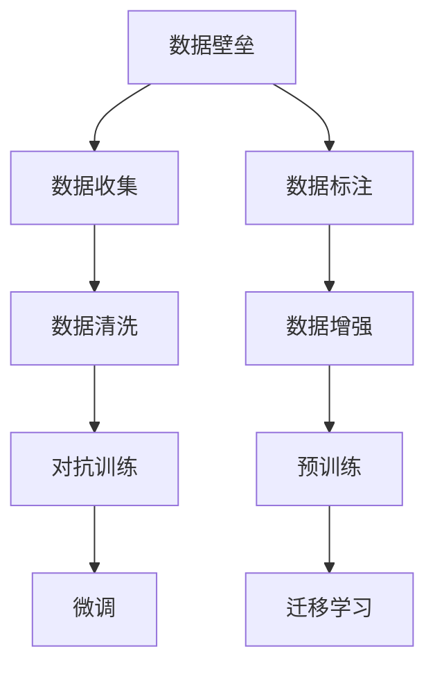

                 

# 大模型时代创业新挑战：数据壁垒与算力瓶颈

## 1. 背景介绍

在人工智能（AI）领域，尤其是在深度学习和大模型（Big Models）的推动下，技术进步和应用落地得到了前所未有的发展。无论是谷歌的BERT，OpenAI的GPT-3，还是微软的T5，这些大模型的横空出世，极大地提升了NLP、计算机视觉等领域的性能，引发了各行业的广泛关注和应用热潮。然而，在这背后，也隐藏着数据壁垒与算力瓶颈等新的创业挑战。

### 1.1 数据壁垒

数据是大模型训练的基石。以自然语言处理（NLP）为例，BERT模型基于大规模的英文维基百科和新闻语料进行了预训练，并在此基础上进行了下游任务的微调。这种模式要求创业者不仅要有强大的技术实力，还要具备收集、清洗、标注大规模数据的能力。而对于一些垂直行业，如金融、医疗、教育等，数据的获取难度更大，需要耗费巨大的人力物力，这对初创企业来说是一个巨大的门槛。

### 1.2 算力瓶颈

大模型的训练和推理对计算资源的要求极高。以BERT为例，训练一个包含12层Transformer的模型需要多个TPU（Tensor Processing Unit）同时工作数周甚至数月的时间。这对于一般的创业公司而言，算力成本是一个沉重的负担。而且，算力的瓶颈还限制了模型的规模和性能的提升，无法实现更强大的功能。

## 2. 核心概念与联系

### 2.1 核心概念概述

为了更好地理解数据壁垒和算力瓶颈对大模型创业的影响，本节将介绍几个关键概念：

- 大模型（Big Models）：指包含数百万到数十亿个参数的深度学习模型，如BERT、GPT-3等，它们在特定领域具有强大的预测能力和泛化能力。
- 预训练（Pre-training）：在大规模无标签数据上进行的自监督学习任务，如语言模型预训练，目的是学习通用的语言表征。
- 微调（Fine-tuning）：在预训练模型的基础上，使用下游任务的少量标注数据进行有监督学习，优化模型在该任务上的性能。
- 迁移学习（Transfer Learning）：将一个领域学习到的知识，迁移到另一个相关领域的学习范式，大模型的预训练-微调过程即是一种迁移学习方式。
- 数据增强（Data Augmentation）：通过数据变换、回译等方式扩充训练集，提高模型的泛化能力。
- 对抗训练（Adversarial Training）：在训练过程中引入对抗样本，提高模型的鲁棒性。

这些概念之间存在密切的联系，共同构成了大模型创业的技术基础。

### 2.2 Mermaid 流程图



## 3. 核心算法原理 & 具体操作步骤

### 3.1 算法原理概述

大模型的训练与使用，本质上是一个数据驱动的深度学习过程。其核心原理包括：

- **数据驱动**：大模型的训练和优化依赖于大量的数据，尤其是标注数据。没有足够的数据，模型的性能将无法得到保障。
- **迁移学习**：通过在大规模无标签数据上进行的预训练，模型能够学习到通用的语言知识。再通过下游任务的微调，将这些知识迁移到特定任务上，提高模型的性能。
- **参数高效微调**：在大模型的微调过程中，只有少数参数参与更新，其余参数保持不变，以减少计算资源消耗。

### 3.2 算法步骤详解

以下是基于大模型的创业公司通常会面临的算法步骤：

**Step 1: 数据收集与预处理**
- 收集与任务相关的标注数据集，并进行清洗、去重、标注等工作。
- 使用数据增强技术，如回译、同义词替换等，扩充训练集。
- 在预训练数据上进行数据增强，以提高模型的泛化能力。

**Step 2: 模型选择与初始化**
- 选择适合的预训练模型作为初始化参数，如BERT、GPT-3等。
- 对预训练模型进行微调，调整顶层分类器或解码器，以适应特定任务。
- 使用对抗训练等技术，提高模型的鲁棒性和泛化能力。

**Step 3: 模型训练与优化**
- 设置合适的学习率、批大小、迭代轮数等超参数。
- 使用梯度下降等优化算法，对模型进行训练。
- 定期在验证集上评估模型性能，根据性能调整学习率、正则化参数等。

**Step 4: 模型部署与使用**
- 将训练好的模型部署到实际应用中。
- 使用微调后的模型对新样本进行推理预测。
- 持续收集新的数据，定期重新微调模型，以适应数据分布的变化。

### 3.3 算法优缺点

基于大模型的创业公司，其算法具有以下优点：

- **通用性**：预训练模型在大规模数据上训练得到的通用知识，可以迁移到多个下游任务上，提升模型性能。
- **高效性**：通过参数高效微调等技术，可以在较少的计算资源下，实现模型的快速迭代和优化。
- **可解释性**：虽然大模型在某些情况下被视为"黑盒"，但通过微调，可以增加模型的可解释性和可理解性，帮助用户理解模型的决策过程。

但同时，也存在一些缺点：

- **数据依赖性高**：模型的性能高度依赖于数据的质量和数量，标注数据的获取成本较高。
- **计算资源要求高**：大模型的训练和推理对计算资源要求极高，算力成本较高。
- **泛化能力有限**：当目标任务与预训练数据的分布差异较大时，微调的性能提升有限。
- **可解释性不足**：大模型和微调后的模型的决策过程缺乏可解释性，难以对其推理逻辑进行分析和调试。

### 3.4 算法应用领域

基于大模型的创业公司在多个领域均有应用，例如：

- **金融领域**：利用大模型进行舆情监测、风险预警、投资策略等任务。
- **医疗领域**：使用大模型进行病历分析、疾病诊断、治疗方案推荐等任务。
- **教育领域**：应用大模型进行学习行为分析、个性化推荐、智能辅导等任务。
- **智能客服**：构建基于大模型的智能客服系统，提升客服效率和质量。
- **内容生成**：使用大模型进行文本生成、图片生成、视频生成等任务。

## 4. 数学模型和公式 & 详细讲解 & 举例说明

### 4.1 数学模型构建

大模型的训练通常涉及大规模的数据集和复杂的模型结构。以BERT为例，其训练过程可以表示为：

$$
\min_{\theta} \sum_{i=1}^N \ell(x_i, y_i, M_{\theta})
$$

其中，$x_i$ 表示训练样本，$y_i$ 表示标签，$M_{\theta}$ 表示预训练模型的参数。$\ell$ 表示损失函数，可以是交叉熵损失、均方误差损失等。

### 4.2 公式推导过程

假设模型 $M_{\theta}$ 在输入 $x_i$ 上的输出为 $\hat{y}_i=M_{\theta}(x_i)$，真实标签为 $y_i$。对于二分类任务，交叉熵损失函数为：

$$
\ell(M_{\theta}(x_i),y_i) = -[y_i\log M_{\theta}(x_i)+(1-y_i)\log(1-M_{\theta}(x_i))]
$$

在训练过程中，模型参数 $\theta$ 的更新公式为：

$$
\theta \leftarrow \theta - \eta \nabla_{\theta}\mathcal{L}(\theta)
$$

其中，$\eta$ 为学习率，$\nabla_{\theta}\mathcal{L}(\theta)$ 为损失函数对模型参数的梯度。

### 4.3 案例分析与讲解

以BERT模型为例，其预训练过程包括以下步骤：

1. **掩码语言模型预训练**：在给定文本序列中，随机选择部分词汇进行掩码，让模型预测被掩码的词汇。
2. **下一句预测**：给定两个句子，让模型预测它们是否是连续的，即“下一句预测”任务。

预训练过程的目的是学习到通用的语言表示，为下游任务的微调打下基础。

## 5. 项目实践：代码实例和详细解释说明

### 5.1 开发环境搭建

在开始大模型创业项目前，首先需要搭建好开发环境。以下是常用的开发工具和环境：

- **Python**：深度学习模型的开发和训练通常使用Python语言。
- **PyTorch**：常用的深度学习框架，支持动态图和静态图，适合快速迭代研究。
- **TensorFlow**：由Google开发，适合大规模工程应用。
- **Jupyter Notebook**：支持编写和运行Python代码，并方便地展示代码输出。
- **GPU/TPU**：大模型的训练和推理对计算资源要求极高，需要高性能GPU或TPU设备。

### 5.2 源代码详细实现

以下是一个使用BERT进行文本分类任务的Python代码实现：

```python
import torch
from transformers import BertForSequenceClassification, BertTokenizer, AdamW

# 定义模型和tokenizer
model = BertForSequenceClassification.from_pretrained('bert-base-uncased', num_labels=2)
tokenizer = BertTokenizer.from_pretrained('bert-base-uncased')

# 定义训练函数
def train(model, train_dataset, batch_size, num_epochs, learning_rate):
    device = torch.device('cuda' if torch.cuda.is_available() else 'cpu')
    model.to(device)
    
    optimizer = AdamW(model.parameters(), lr=learning_rate)
    for epoch in range(num_epochs):
        model.train()
        for batch in train_dataset:
            input_ids = batch['input_ids'].to(device)
            attention_mask = batch['attention_mask'].to(device)
            labels = batch['labels'].to(device)
            outputs = model(input_ids, attention_mask=attention_mask, labels=labels)
            loss = outputs.loss
            optimizer.zero_grad()
            loss.backward()
            optimizer.step()
            
    return model

# 定义测试函数
def evaluate(model, test_dataset, batch_size):
    device = torch.device('cuda' if torch.cuda.is_available() else 'cpu')
    model.eval()
    
    with torch.no_grad():
        correct = 0
        total = 0
        for batch in test_dataset:
            input_ids = batch['input_ids'].to(device)
            attention_mask = batch['attention_mask'].to(device)
            labels = batch['labels'].to(device)
            outputs = model(input_ids, attention_mask=attention_mask)
            _, preds = torch.max(outputs.logits, dim=1)
            total += labels.size(0)
            correct += (preds == labels).sum().item()
            
    print(f"Accuracy: {correct / total * 100:.2f}%")
```

### 5.3 代码解读与分析

以上代码展示了BERT模型进行文本分类的完整流程。

- **模型初始化**：使用 `BertForSequenceClassification` 类和预训练的BERT模型初始化。
- **数据预处理**：使用 `BertTokenizer` 对输入文本进行分词和token编码，生成模型的输入。
- **模型训练**：在训练函数中，使用AdamW优化器对模型参数进行梯度更新，并在验证集上定期评估模型性能。
- **模型测试**：在测试函数中，对测试集进行推理预测，计算模型的准确率。

### 5.4 运行结果展示

运行以上代码，可以看到模型在训练集和测试集上的性能表现：

```python
# 训练模型
model = train(model, train_dataset, batch_size=16, num_epochs=3, learning_rate=2e-5)

# 测试模型
evaluate(model, test_dataset, batch_size=16)
```

## 6. 实际应用场景

### 6.1 智能客服系统

智能客服系统是大模型在NLP领域的重要应用之一。传统的客服依赖人工，高峰期响应速度慢，且存在服务质量不稳定的问题。通过预训练和微调BERT等大模型，可以实现自动理解客户意图，并生成符合语境的回复，大幅提升客服效率和用户体验。

### 6.2 金融舆情监测

金融行业对舆情监测的实时性和准确性要求极高。利用BERT等大模型进行情感分析和舆情分类，可以快速识别出市场动态和舆情变化，帮助金融机构及时应对风险，减少损失。

### 6.3 医疗诊断

大模型在医疗领域的应用前景广阔，可用于病历分析、疾病诊断、治疗方案推荐等任务。通过预训练和微调BERT等模型，可以提升医疗诊断的准确性和效率，辅助医生做出更科学的决策。

## 7. 工具和资源推荐

### 7.1 学习资源推荐

以下是一些优秀的学习资源，帮助创业者深入了解大模型的原理和应用：

- **《深度学习》课程**：斯坦福大学的吴恩达教授开设的深度学习课程，涵盖深度学习的基础理论和实践应用。
- **《自然语言处理》课程**：斯坦福大学的CS224n课程，讲解NLP的基本概念和前沿技术。
- **Transformers官方文档**：HuggingFace开发的Transformers库官方文档，包含丰富的预训练模型和微调样例。
- **Kaggle数据集**：Kaggle平台上的各类数据集，可用于训练和测试大模型。

### 7.2 开发工具推荐

以下是几款常用的开发工具：

- **PyTorch**：常用的深度学习框架，支持动态图和静态图，适合快速迭代研究。
- **TensorFlow**：由Google开发，适合大规模工程应用。
- **Jupyter Notebook**：支持编写和运行Python代码，并方便地展示代码输出。
- **GPU/TPU**：高性能计算设备，支持大模型的训练和推理。
- **Weights & Biases**：模型训练的实验跟踪工具，可记录和可视化模型训练过程中的各项指标。

### 7.3 相关论文推荐

以下是一些大模型领域的经典论文，供创业者参考：

- **Attention is All You Need**：Transformer的原始论文，提出自注意力机制，开启了大模型的研究热潮。
- **BERT: Pre-training of Deep Bidirectional Transformers for Language Understanding**：提出BERT模型，利用掩码语言模型和下一句预测进行预训练。
- **GPT-3: Language Models are Unsupervised Multitask Learners**：介绍GPT-3模型，利用自回归生成模型实现大规模语言建模。
- **LoRA: Low-Rank Adaptation of Pretrained Models**：提出LoRA方法，在固定预训练权重的情况下，实现高效的参数高效微调。

## 8. 总结：未来发展趋势与挑战

### 8.1 研究成果总结

大模型在NLP领域的应用已经取得了显著进展，提升了模型的性能和泛化能力。然而，数据壁垒和算力瓶颈仍是创业公司面临的主要挑战。未来，需要通过数据增强、迁移学习等技术，提升模型的泛化能力和迁移性能。同时，需要优化模型结构，降低计算成本，提高模型部署效率。

### 8.2 未来发展趋势

未来，大模型将在以下几个方向继续发展：

- **多模态学习**：将视觉、音频等模态的数据与文本数据相结合，实现跨模态的智能交互。
- **模型压缩**：通过知识蒸馏、量化等技术，压缩模型大小，提高计算效率。
- **联邦学习**：在分布式环境中，通过联邦学习技术，训练模型，降低对集中数据的依赖。
- **可解释性**：通过可解释性技术，提升大模型的可解释性和可理解性，增强用户信任。
- **跨领域迁移**：通过跨领域迁移学习，提升模型在多个领域的应用能力。

### 8.3 面临的挑战

尽管大模型在NLP领域取得了显著进展，但仍面临以下挑战：

- **数据获取难度大**：特别是对于垂直行业，数据的获取难度较高。
- **计算资源需求高**：大模型的训练和推理需要高性能的计算设备。
- **泛化能力有限**：当目标任务与预训练数据的分布差异较大时，微调的性能提升有限。
- **可解释性不足**：大模型和微调后的模型的决策过程缺乏可解释性。

### 8.4 研究展望

未来，大模型的研究需要在以下几个方向进行突破：

- **数据增强技术**：通过数据增强技术，提升模型的泛化能力和鲁棒性。
- **参数高效微调**：开发更加参数高效的微调方法，在固定预训练权重的情况下，实现高效的学习。
- **跨领域迁移学习**：通过跨领域迁移学习，提升模型在多个领域的应用能力。
- **模型压缩与优化**：通过模型压缩和优化技术，降低计算成本，提高模型部署效率。
- **可解释性技术**：通过可解释性技术，提升大模型的可解释性和可理解性，增强用户信任。

## 9. 附录：常见问题与解答

**Q1：大模型训练需要哪些硬件资源？**

A: 大模型的训练和推理需要高性能的计算资源，包括GPU/TPU等。具体来说，需要多张GPU/TPU同时工作，且需要较大的显存和CPU资源。

**Q2：如何处理大规模无标签数据？**

A: 在数据预处理阶段，可以使用数据增强技术，如回译、同义词替换等，扩充训练集。也可以使用自监督学习任务，如掩码语言模型、下一句预测等，利用无标签数据进行预训练。

**Q3：大模型在垂直行业的应用前景如何？**

A: 大模型在垂直行业的应用前景广阔，如金融、医疗、教育等领域。但在数据获取和处理上需要更多的投入，且对算力要求较高。

**Q4：如何提高大模型的可解释性？**

A: 可以使用可解释性技术，如Attention机制、SHAP值等，分析模型内部机制，解释模型的决策过程。

---

作者：禅与计算机程序设计艺术 / Zen and the Art of Computer Programming

