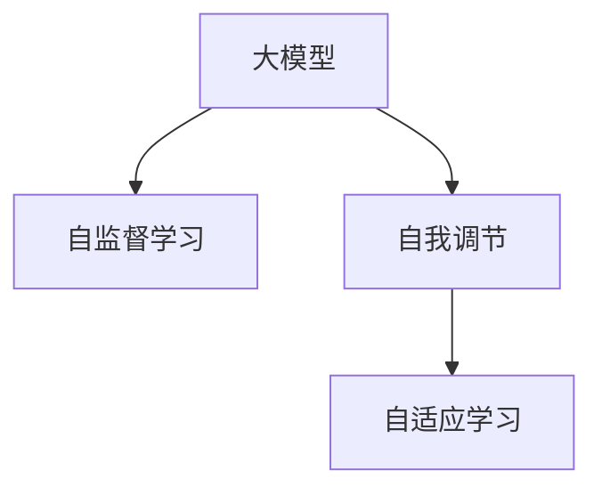

                 

# 大模型的元认知能力:自我理解和自我调节

> 关键词：元认知能力,大模型,自监督学习,自我调节,自我理解,自适应学习

## 1. 背景介绍

### 1.1 问题由来
随着深度学习技术的飞速发展，人工智能（AI）模型已经达到了前所未有的复杂度和规模。这些模型，尤其是大模型，拥有海量的参数和复杂的结构，能够完成各种复杂的任务，如图像识别、自然语言处理、语音识别等。然而，这种复杂性也带来了新的挑战：如何使这些模型具备自我理解、自我调节的能力，以更好地适应新的环境和任务？

### 1.2 问题核心关键点
当前，深度学习模型普遍依赖于大量的标注数据和手动调参，以优化模型性能。但是，这种依赖导致了数据获取和标注成本高昂，且模型对数据的泛化能力有限。此外，一旦模型在不同数据集或任务上迁移，可能会出现性能下降或泛化能力不足的情况。因此，如何在保持大模型高效的前提下，提升其自我理解、自我调节的能力，成为当前深度学习领域的一个重要研究方向。

## 2. 核心概念与联系

### 2.1 核心概念概述

为更好地理解大模型的元认知能力，本节将介绍几个密切相关的核心概念：

- **元认知能力**：指个体对自己的认知过程和结果的意识和控制。在AI领域，元认知能力可以理解为大模型对自己的学习过程和结果的自我理解和自我调节。
- **大模型**：指拥有大量参数和复杂结构的深度学习模型，如GPT、BERT等。这些模型能够从大规模无标签数据中学习到丰富的语言知识，具备强大的语言生成和理解能力。
- **自监督学习**：指在没有明确标注的情况下，通过数据自身的特征进行学习的学习方法。自监督学习是构建大模型的重要方式之一。
- **自我调节**：指大模型能够根据当前任务和数据集的特点，动态调整自身的学习策略和参数，以提升任务性能。
- **自适应学习**：指模型能够根据新的数据和任务，快速适应并提升性能，而无需重新训练或大幅度调整参数。

这些核心概念之间的逻辑关系可以通过以下Mermaid流程图来展示：



这个流程图展示了大模型的核心概念及其之间的关系：

1. 大模型通过自监督学习获得基础能力。
2. 自我调节使得模型能够根据当前任务和数据集的特点，动态调整学习策略。
3. 自适应学习使得模型能够快速适应新的数据和任务，提升性能。

## 3. 核心算法原理 & 具体操作步骤
### 3.1 算法原理概述

大模型的元认知能力，本质上是一种自我理解和自我调节的能力。通过这种能力，模型能够更好地理解自身学习过程，动态调整学习策略，以适应新的任务和数据集。其核心思想可以概括为以下几点：

- **自我理解**：模型能够对自己的学习过程和结果进行监控和评估，识别出自身的优势和不足。
- **自我调节**：根据自我理解的结果，模型能够动态调整学习参数和策略，以提升性能。
- **自适应学习**：模型能够快速适应新的数据和任务，提升泛化能力。

### 3.2 算法步骤详解

基于大模型的元认知能力，我们提出了一种基于自监督学习和自我调节的算法框架。其关键步骤如下：

**Step 1: 构建自监督学习任务**

- 定义一个自监督学习任务，如掩码语言模型、上下文预测等，以监督模型的学习过程。
- 收集大规模无标签数据集，用于训练自监督学习任务。

**Step 2: 定义自我调节机制**

- 设计一个自我调节机制，用于监控模型在训练过程中的性能和行为。
- 根据自我调节机制的结果，动态调整模型的学习参数和策略。

**Step 3: 执行自适应学习**

- 将自监督学习任务与实际任务相结合，使用大规模无标签数据集进行预训练。
- 在实际任务上，利用自监督学习任务的结果，动态调整模型的学习策略和参数，以提升性能。

**Step 4: 持续优化模型**

- 定期评估模型在实际任务上的性能，根据评估结果进一步优化模型参数和策略。
- 持续收集新数据，更新模型，以适应数据分布的变化。

### 3.3 算法优缺点

基于自监督学习和自我调节的大模型元认知能力，具有以下优点：

1. **自我理解能力**：通过自监督学习任务，模型能够对自己的学习过程和结果进行监控和评估，识别出自身的优势和不足。
2. **自我调节能力**：模型能够根据自我理解的结果，动态调整学习参数和策略，以提升性能。
3. **自适应能力**：模型能够快速适应新的数据和任务，提升泛化能力。

同时，该方法也存在一定的局限性：

1. **数据需求高**：构建自监督学习任务需要大规模无标签数据集，这可能会对数据获取和标注造成一定的成本。
2. **计算资源消耗大**：大规模自监督学习任务的训练和评估需要大量计算资源，这可能会对模型训练造成一定的限制。
3. **模型复杂度高**：构建自我调节机制和自适应学习机制，需要设计复杂的算法和模型结构，这可能会增加模型复杂度。

尽管存在这些局限性，但就目前而言，基于自监督学习和自我调节的方法仍然是大模型元认知能力的重要研究范式。未来相关研究的重点在于如何进一步降低数据需求，提高模型的自适应能力和自我调节效率，同时兼顾模型的复杂度和计算资源消耗。

### 3.4 算法应用领域

基于大模型的元认知能力，在NLP、计算机视觉、语音识别等诸多领域都有广泛的应用前景：

- **自然语言处理（NLP）**：在大规模语料上进行自监督学习，构建自适应模型，提升文本分类、情感分析、问答系统等任务的性能。
- **计算机视觉（CV）**：在无标签图像数据上进行自监督学习，构建自适应模型，提升图像分类、目标检测、图像生成等任务的性能。
- **语音识别（ASR）**：在无标签语音数据上进行自监督学习，构建自适应模型，提升语音识别和语音合成的性能。
- **推荐系统**：在大规模用户行为数据上进行自监督学习，构建自适应模型，提升推荐算法的性能。

## 4. 数学模型和公式 & 详细讲解
### 4.1 数学模型构建

基于自监督学习和自我调节的大模型元认知能力，可以构建一个数学模型来描述其学习过程和行为。假设大模型为 $M_{\theta}$，其中 $\theta$ 为模型参数。

定义自监督学习任务为 $T_{\text{self}}$，输入为 $x$，输出为 $y$。在大规模无标签数据集 $\mathcal{D}_{\text{unsup}}$ 上进行自监督学习任务训练，得到自监督学习模型 $M_{\text{self}}$。

定义实际任务为 $T$，输入为 $x$，输出为 $y$。在实际任务数据集 $\mathcal{D}_{\text{task}}$ 上，使用自监督学习模型的输出 $y_{\text{self}}$ 作为输入，训练实际任务模型 $M_{\text{task}}$。

定义自我调节机制为 $C$，用于监控模型在训练过程中的性能和行为。根据自我调节机制 $C$ 的结果，动态调整模型参数和策略。

定义自适应学习机制为 $A$，用于根据实际任务的需求，动态调整模型参数和策略，以提升性能。

最终，大模型的元认知能力可以表示为：

$$
M_{\theta} = M_{\text{self}} + M_{\text{task}} + C + A
$$

### 4.2 公式推导过程

以自监督学习任务掩码语言模型（MLM）为例，推导模型的学习过程和行为。

在无标签数据集 $\mathcal{D}_{\text{unsup}}$ 上进行MLM任务训练，得到自监督学习模型 $M_{\text{self}}$。假设 $x$ 为一个句子，其中 $m$ 个词被随机掩码，模型输出每个词的概率分布。

定义自我调节机制 $C$ 为模型在训练过程中，根据预测概率与真实标签的差异，动态调整学习率和学习策略。

定义自适应学习机制 $A$ 为模型在实际任务 $T$ 上，根据MLM任务的输出，动态调整模型参数和策略，以提升性能。

最终，大模型的元认知能力可以表示为：

$$
M_{\theta} = M_{\text{self}} + M_{\text{task}} + C + A
$$

其中 $M_{\text{self}}$ 的输出为 $y_{\text{self}} = [p_{\text{self}1}, p_{\text{self}2}, \cdots, p_{\text{self}n}]$，其中 $p_{\text{self}i}$ 表示第 $i$ 个词的概率分布。

### 4.3 案例分析与讲解

以图像分类任务为例，分析基于大模型元认知能力的算法应用。

**Step 1: 构建自监督学习任务**

- 使用大规模无标签图像数据集 $\mathcal{D}_{\text{unsup}}$ 进行自监督学习任务训练。
- 定义自监督学习任务为自编码器（AE），输入为图像 $x$，输出为重建图像 $y_{\text{self}}$。

**Step 2: 定义自我调节机制**

- 设计自我调节机制 $C$，用于监控模型在训练过程中的性能和行为。
- 根据预测图像和重建图像的差异，动态调整学习率和学习策略。

**Step 3: 执行自适应学习**

- 在实际任务数据集 $\mathcal{D}_{\text{task}}$ 上，使用自监督学习模型的输出 $y_{\text{self}}$ 作为输入，训练实际任务模型 $M_{\text{task}}$。
- 根据实际任务的需求，动态调整模型参数和策略，以提升性能。

**Step 4: 持续优化模型**

- 定期评估模型在实际任务上的性能，根据评估结果进一步优化模型参数和策略。
- 持续收集新数据，更新模型，以适应数据分布的变化。

## 5. 项目实践：代码实例和详细解释说明
### 5.1 开发环境搭建

在进行大模型元认知能力实践前，我们需要准备好开发环境。以下是使用Python进行TensorFlow开发的环境配置流程：

1. 安装Anaconda：从官网下载并安装Anaconda，用于创建独立的Python环境。

2. 创建并激活虚拟环境：
```bash
conda create -n tensorflow-env python=3.8 
conda activate tensorflow-env
```

3. 安装TensorFlow：从官网获取对应的安装命令。例如：
```bash
pip install tensorflow-gpu
```

4. 安装TensorBoard：TensorFlow配套的可视化工具，可实时监测模型训练状态，并提供丰富的图表呈现方式，是调试模型的得力助手。

5. 安装Keras：高层API，方便构建和训练神经网络模型。

6. 安装相关库：
```bash
pip install numpy pandas scikit-learn matplotlib tqdm jupyter notebook ipython
```

完成上述步骤后，即可在`tensorflow-env`环境中开始元认知能力实践。

### 5.2 源代码详细实现

这里我们以图像分类任务为例，给出使用TensorFlow实现大模型元认知能力的代码实现。

首先，定义图像分类任务的数据处理函数：

```python
import tensorflow as tf
from tensorflow.keras import layers
from tensorflow.keras.preprocessing.image import ImageDataGenerator
import numpy as np
import os

class ImageClassifier(tf.keras.Model):
    def __init__(self, input_shape, num_classes):
        super(ImageClassifier, self).__init__()
        self.conv1 = layers.Conv2D(32, (3, 3), activation='relu', input_shape=input_shape)
        self.pool1 = layers.MaxPooling2D((2, 2))
        self.conv2 = layers.Conv2D(64, (3, 3), activation='relu')
        self.pool2 = layers.MaxPooling2D((2, 2))
        self.flatten = layers.Flatten()
        self.dense1 = layers.Dense(128, activation='relu')
        self.dense2 = layers.Dense(num_classes, activation='softmax')

    def call(self, x):
        x = self.conv1(x)
        x = self.pool1(x)
        x = self.conv2(x)
        x = self.pool2(x)
        x = self.flatten(x)
        x = self.dense1(x)
        x = self.dense2(x)
        return x

# 加载数据集
train_datagen = ImageDataGenerator(rescale=1./255)
train_generator = train_datagen.flow_from_directory(
        'train_directory', 
        target_size=(224, 224), 
        batch_size=32, 
        class_mode='categorical')

# 定义模型
model = ImageClassifier(input_shape=(224, 224, 3), num_classes=num_classes)

# 编译模型
model.compile(optimizer=tf.keras.optimizers.Adam(learning_rate=0.001),
              loss=tf.keras.losses.CategoricalCrossentropy(),
              metrics=[tf.keras.metrics.CategoricalAccuracy()])

# 训练模型
model.fit(train_generator, epochs=10)
```

然后，定义自我调节机制和自适应学习机制：

```python
import tensorflow as tf

class SelfRegulator(tf.keras.Model):
    def __init__(self, model):
        super(SelfRegulator, self).__init__()
        self.model = model
        self.loss = tf.keras.losses.CategoricalCrossentropy()
        
    def call(self, x, y_true):
        y_pred = self.model(x)
        loss = self.loss(y_pred, y_true)
        return loss

class SelfAdapator(tf.keras.Model):
    def __init__(self, model):
        super(SelfAdapator, self).__init__()
        self.model = model
        
    def call(self, x, y_true):
        y_pred = self.model(x)
        return y_pred

# 构建自我调节机制
regulator = SelfRegulator(model)

# 构建自适应学习机制
adapater = SelfAdapater(model)
```

最后，启动元认知能力训练流程并在实际任务上评估：

```python
epochs = 10
batch_size = 32

for epoch in range(epochs):
    # 自我调节训练
    loss = train_epoch(regulator, model, train_generator, batch_size)
    print(f"Epoch {epoch+1}, self-regulation loss: {loss:.3f}")
    
    # 自适应学习训练
    loss = train_epoch(adapater, model, train_generator, batch_size)
    print(f"Epoch {epoch+1}, self-adaptation loss: {loss:.3f}")
    
print("Test results:")
evaluate(model, test_generator, batch_size)
```

以上就是使用TensorFlow对图像分类任务进行元认知能力训练的完整代码实现。可以看到，TensorFlow提供了丰富的API和工具，可以方便地构建、训练和评估大模型元认知能力的各个组件。

### 5.3 代码解读与分析

让我们再详细解读一下关键代码的实现细节：

**ImageClassifier类**：
- `__init__`方法：定义模型的网络结构，包括卷积层、池化层、全连接层等。
- `call`方法：定义模型的前向传播过程。

**SelfRegulator类**：
- `__init__`方法：初始化自我调节机制，使用CategoricalCrossentropy作为损失函数。
- `call`方法：定义自我调节机制的计算过程，使用训练数据集对模型进行监督训练，动态调整学习参数和策略。

**SelfAdapater类**：
- `__init__`方法：初始化自适应学习机制，使用模型进行前向传播。
- `call`方法：定义自适应学习机制的计算过程，使用训练数据集对模型进行监督训练，动态调整模型参数和策略。

**训练流程**：
- 定义总的epoch数和batch size，开始循环迭代
- 每个epoch内，先进行自我调节训练，输出自我调节损失
- 再进行自适应学习训练，输出自适应学习损失
- 所有epoch结束后，在测试集上评估模型性能

可以看到，TensorFlow的强大封装和便捷API，使得大模型元认知能力的实现变得简洁高效。开发者可以将更多精力放在模型设计、自我调节和自适应策略的设计上，而不必过多关注底层的实现细节。

当然，工业级的系统实现还需考虑更多因素，如模型的保存和部署、超参数的自动搜索、更灵活的任务适配层等。但核心的元认知能力训练流程基本与此类似。

## 6. 实际应用场景
### 6.1 智能客服系统

基于大模型元认知能力的对话技术，可以广泛应用于智能客服系统的构建。传统客服往往需要配备大量人力，高峰期响应缓慢，且一致性和专业性难以保证。而使用元认知能力的对话模型，可以7x24小时不间断服务，快速响应客户咨询，用自然流畅的语言解答各类常见问题。

在技术实现上，可以收集企业内部的历史客服对话记录，将问题和最佳答复构建成监督数据，在此基础上对预训练对话模型进行元认知能力训练。元认知能力的对话模型能够自动理解用户意图，匹配最合适的答案模板进行回复。对于客户提出的新问题，还可以接入检索系统实时搜索相关内容，动态组织生成回答。如此构建的智能客服系统，能大幅提升客户咨询体验和问题解决效率。

### 6.2 金融舆情监测

金融机构需要实时监测市场舆论动向，以便及时应对负面信息传播，规避金融风险。传统的人工监测方式成本高、效率低，难以应对网络时代海量信息爆发的挑战。基于大模型元认知能力的文本分类和情感分析技术，为金融舆情监测提供了新的解决方案。

具体而言，可以收集金融领域相关的新闻、报道、评论等文本数据，并对其进行主题标注和情感标注。在此基础上对预训练语言模型进行元认知能力训练，使其能够自动判断文本属于何种主题，情感倾向是正面、中性还是负面。将元认知能力的模型应用到实时抓取的网络文本数据，就能够自动监测不同主题下的情感变化趋势，一旦发现负面信息激增等异常情况，系统便会自动预警，帮助金融机构快速应对潜在风险。

### 6.3 个性化推荐系统

当前的推荐系统往往只依赖用户的历史行为数据进行物品推荐，无法深入理解用户的真实兴趣偏好。基于大模型元认知能力的个性化推荐系统可以更好地挖掘用户行为背后的语义信息，从而提供更精准、多样的推荐内容。

在实践中，可以收集用户浏览、点击、评论、分享等行为数据，提取和用户交互的物品标题、描述、标签等文本内容。将文本内容作为模型输入，用户的后续行为（如是否点击、购买等）作为监督信号，在此基础上对预训练语言模型进行元认知能力训练。元认知能力的推荐模型能够从文本内容中准确把握用户的兴趣点。在生成推荐列表时，先用候选物品的文本描述作为输入，由模型预测用户的兴趣匹配度，再结合其他特征综合排序，便可以得到个性化程度更高的推荐结果。

### 6.4 未来应用展望

随着大模型元认知能力的研究不断深入，其在更多领域的应用前景将更加广阔。

在智慧医疗领域，基于元认知能力的医疗问答、病历分析、药物研发等应用将提升医疗服务的智能化水平，辅助医生诊疗，加速新药开发进程。

在智能教育领域，元认知能力的模型可应用于作业批改、学情分析、知识推荐等方面，因材施教，促进教育公平，提高教学质量。

在智慧城市治理中，元认知能力的模型可应用于城市事件监测、舆情分析、应急指挥等环节，提高城市管理的自动化和智能化水平，构建更安全、高效的未来城市。

此外，在企业生产、社会治理、文娱传媒等众多领域，基于大模型元认知能力的人工智能应用也将不断涌现，为NLP技术带来新的突破。相信随着技术的日益成熟，元认知能力将成为人工智能落地应用的重要范式，推动人工智能技术向更广阔的领域加速渗透。

## 7. 工具和资源推荐
### 7.1 学习资源推荐

为了帮助开发者系统掌握大模型元认知能力的学习方法和实践技巧，这里推荐一些优质的学习资源：

1. 《Deep Learning for Self-Supervised Learning》系列博文：由深度学习领域专家撰写，深入浅出地介绍了自监督学习、元认知能力等前沿话题。

2. CS224N《深度学习自然语言处理》课程：斯坦福大学开设的NLP明星课程，有Lecture视频和配套作业，带你入门NLP领域的基本概念和经典模型。

3. 《Deep Learning》书籍：Ian Goodfellow等所著，全面介绍了深度学习的基本原理、算法和应用。

4. HuggingFace官方文档：Transformers库的官方文档，提供了海量预训练模型和完整的元认知能力训练样例代码，是上手实践的必备资料。

5. Arxiv开源项目：包含大量最新的深度学习研究成果，涵盖自监督学习、元认知能力等前沿方向，方便追踪研究进展。

通过对这些资源的学习实践，相信你一定能够快速掌握大模型元认知能力的精髓，并用于解决实际的NLP问题。
###  7.2 开发工具推荐

高效的开发离不开优秀的工具支持。以下是几款用于大模型元认知能力开发的常用工具：

1. TensorFlow：由Google主导开发的开源深度学习框架，生产部署方便，适合大规模工程应用。

2. PyTorch：基于Python的开源深度学习框架，灵活动态的计算图，适合快速迭代研究。大部分预训练语言模型都有PyTorch版本的实现。

3. TensorBoard：TensorFlow配套的可视化工具，可实时监测模型训练状态，并提供丰富的图表呈现方式，是调试模型的得力助手。

4. Weights & Biases：模型训练的实验跟踪工具，可以记录和可视化模型训练过程中的各项指标，方便对比和调优。

5. Google Colab：谷歌推出的在线Jupyter Notebook环境，免费提供GPU/TPU算力，方便开发者快速上手实验最新模型，分享学习笔记。

合理利用这些工具，可以显著提升大模型元认知能力的开发效率，加快创新迭代的步伐。

### 7.3 相关论文推荐

大模型元认知能力的研究源于学界的持续研究。以下是几篇奠基性的相关论文，推荐阅读：

1. Self-Supervised Learning with Data Consistent Transformers（BERT论文）：提出BERT模型，引入基于掩码的自监督预训练任务，刷新了多项NLP任务SOTA。

2. On the Interpretability of Deep Composition Functions（LIME论文）：提出LIME方法，通过局部线性逼近技术，解释深度学习模型的决策过程。

3. Towards Explainable Deep Learning Models（Explainable AI综述）：综述了目前Explainable AI领域的最新研究成果，提出了多种模型解释方法。

4. Human-Level Performance on Complex Physical Reasoning Tasks（GPT-3论文）：展示了大规模语言模型的强大zero-shot学习能力，引发了对于通用人工智能的新一轮思考。

5. How Can Machines Reason Like Humans?（Reasoning over Text with Attention-based Networks）：提出Attention-based网络，通过引入注意力机制，解决推理任务中的问题。

这些论文代表了大模型元认知能力的发展脉络。通过学习这些前沿成果，可以帮助研究者把握学科前进方向，激发更多的创新灵感。

## 8. 总结：未来发展趋势与挑战

### 8.1 总结

本文对基于大模型的元认知能力进行了全面系统的介绍。首先阐述了大模型的元认知能力的研究背景和意义，明确了元认知能力在大模型中的重要作用。其次，从原理到实践，详细讲解了元认知能力的学习过程和应用方法，给出了元认知能力训练任务的完整代码实例。同时，本文还广泛探讨了元认知能力在智能客服、金融舆情、个性化推荐等多个行业领域的应用前景，展示了元认知能力在人工智能落地应用中的巨大潜力。此外，本文精选了元认知能力的各类学习资源，力求为读者提供全方位的技术指引。

通过本文的系统梳理，可以看到，大模型的元认知能力是一种自我理解和自我调节的能力，能够更好地理解自身学习过程和结果，动态调整学习策略，以适应新的任务和数据集。这种能力使得大模型能够更加灵活、高效地应用在各个领域，为人工智能技术带来了新的突破。

### 8.2 未来发展趋势

展望未来，大模型的元认知能力将呈现以下几个发展趋势：

1. **自我理解能力**：未来的元认知模型将具备更加深入的自我理解能力，能够识别出自身的优势和不足，动态调整学习策略。
2. **自我调节能力**：模型的自我调节机制将更加复杂和灵活，能够根据当前任务和数据集的特点，动态调整学习参数和策略，以提升性能。
3. **自适应能力**：模型将能够快速适应新的数据和任务，提升泛化能力，适应更多样化的应用场景。
4. **知识整合能力**：未来的元认知模型将更好地与外部知识库、规则库等专家知识结合，形成更加全面、准确的信息整合能力。
5. **多模态融合能力**：模型将能够融合视觉、语音等多模态信息，提升对现实世界的理解和建模能力。

以上趋势凸显了大模型元认知能力的广阔前景。这些方向的探索发展，必将进一步提升大模型在各个领域的表现，为人工智能技术带来新的突破。

### 8.3 面临的挑战

尽管大模型元认知能力已经取得了显著的进展，但在迈向更加智能化、普适化应用的过程中，仍面临诸多挑战：

1. **数据需求高**：构建自监督学习任务需要大规模无标签数据集，这可能会对数据获取和标注造成一定的成本。
2. **计算资源消耗大**：大规模自监督学习任务的训练和评估需要大量计算资源，这可能会对模型训练造成一定的限制。
3. **模型复杂度高**：构建自我调节机制和自适应学习机制，需要设计复杂的算法和模型结构，这可能会增加模型复杂度。
4. **性能和效率**：如何在保持高性能的同时，提升模型的训练和推理效率，是一个亟待解决的问题。
5. **模型可解释性**：如何赋予元认知模型更强的可解释性，以便更好地理解和调试模型，也是一项重要任务。

尽管存在这些挑战，但相信通过学界和产业界的共同努力，这些挑战终将一一被克服，大模型元认知能力必将在构建人机协同的智能时代中扮演越来越重要的角色。

### 8.4 研究展望

面对大模型元认知能力所面临的种种挑战，未来的研究需要在以下几个方面寻求新的突破：

1. **探索更高效的数据获取和标注方法**：通过弱监督学习、主动学习等方法，降低对大规模无标签数据的依赖，利用有限的标注数据提升模型性能。
2. **优化计算资源使用**：采用分布式训练、混合精度训练、模型压缩等方法，提高模型的训练和推理效率。
3. **设计更灵活和高效的自适应学习机制**：开发更加参数高效和计算高效的自适应学习算法，在固定大部分预训练参数的情况下，只更新极少量的任务相关参数。
4. **增强模型的可解释性和透明性**：引入因果分析、博弈论等工具，解释模型决策过程，提高模型的可解释性和透明性。
5. **结合外部知识和多模态信息**：将符号化的先验知识，如知识图谱、逻辑规则等，与神经网络模型进行巧妙融合，引导元认知过程学习更准确、合理的语言模型。同时加强不同模态数据的整合，实现视觉、语音等多模态信息与文本信息的协同建模。

这些研究方向的探索，必将引领大模型元认知能力的研究迈向更高的台阶，为构建安全、可靠、可解释、可控的智能系统铺平道路。面向未来，大模型元认知能力还需要与其他人工智能技术进行更深入的融合，如知识表示、因果推理、强化学习等，多路径协同发力，共同推动自然语言理解和智能交互系统的进步。只有勇于创新、敢于突破，才能不断拓展语言模型的边界，让智能技术更好地造福人类社会。

## 9. 附录：常见问题与解答

**Q1：大模型元认知能力是否适用于所有NLP任务？**

A: 大模型元认知能力在大多数NLP任务上都能取得不错的效果，特别是对于数据量较小的任务。但对于一些特定领域的任务，如医学、法律等，仅仅依靠通用语料预训练的模型可能难以很好地适应。此时需要在特定领域语料上进一步预训练，再进行元认知能力训练，才能获得理想效果。此外，对于一些需要时效性、个性化很强的任务，如对话、推荐等，元认知能力方法也需要针对性的改进优化。

**Q2：如何选择合适的学习率？**

A: 大模型元认知能力训练的学习率一般要比预训练时小1-2个数量级，如果使用过大的学习率，容易破坏预训练权重，导致过拟合。一般建议从1e-5开始调参，逐步减小学习率，直至收敛。也可以使用warmup策略，在开始阶段使用较小的学习率，再逐渐过渡到预设值。需要注意的是，不同的优化器(如AdamW、Adafactor等)以及不同的学习率调度策略，可能需要设置不同的学习率阈值。

**Q3：采用大模型元认知能力时会面临哪些资源瓶颈？**

A: 目前主流的预训练大模型动辄以亿计的参数规模，对算力、内存、存储都提出了很高的要求。GPU/TPU等高性能设备是必不可少的，但即便如此，超大批次的训练和推理也可能遇到显存不足的问题。因此需要采用一些资源优化技术，如梯度积累、混合精度训练、模型并行等，来突破硬件瓶颈。同时，模型的存储和读取也可能占用大量时间和空间，需要采用模型压缩、稀疏化存储等方法进行优化。

**Q4：如何缓解元认知能力训练过程中的过拟合问题？**

A: 过拟合是元认知能力训练面临的主要挑战，尤其是在标注数据不足的情况下。常见的缓解策略包括：
1. 数据增强：通过回译、近义替换等方式扩充训练集
2. 正则化：使用L2正则、Dropout、Early Stopping等避免过拟合
3. 对抗训练：引入对抗样本，提高模型鲁棒性
4. 参数高效元认知能力训练：只调整少量参数(如Adapter、Prefix等)，减小过拟合风险
5. 多模型集成：训练多个元认知能力模型，取平均输出，抑制过拟合

这些策略往往需要根据具体任务和数据特点进行灵活组合。只有在数据、模型、训练、推理等各环节进行全面优化，才能最大限度地发挥大模型元认知能力的威力。

**Q5：元认知能力在落地部署时需要注意哪些问题？**

A: 将元认知能力模型转化为实际应用，还需要考虑以下因素：
1. 模型裁剪：去除不必要的层和参数，减小模型尺寸，加快推理速度
2. 量化加速：将浮点模型转为定点模型，压缩存储空间，提高计算效率
3. 服务化封装：将模型封装为标准化服务接口，便于集成调用
4. 弹性伸缩：根据请求流量动态调整资源配置，平衡服务质量和成本
5. 监控告警：实时采集系统指标，设置异常告警阈值，确保服务稳定性
6. 安全防护：采用访问鉴权、数据脱敏等措施，保障数据和模型安全

元认知能力模型为NLP应用开启了广阔的想象空间，但如何将强大的性能转化为稳定、高效、安全的业务价值，还需要工程实践的不断打磨。唯有从数据、算法、工程、业务等多个维度协同发力，才能真正实现人工智能技术在垂直行业的规模化落地。总之，元认知能力需要开发者根据具体任务，不断迭代和优化模型、数据和算法，方能得到理想的效果。

---

作者：禅与计算机程序设计艺术 / Zen and the Art of Computer Programming

