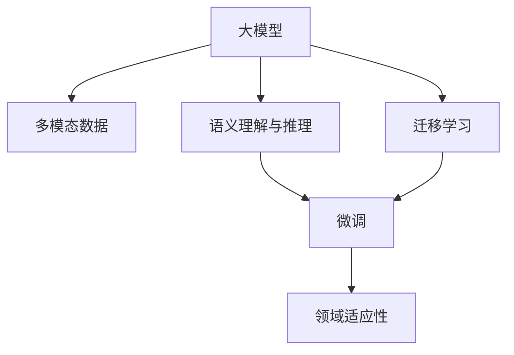

                 

## 1. 背景介绍

### 1.1 问题由来

随着科技的进步和社会的数字化转型，智慧园区的建设成为了新兴的热门话题。智慧园区集成了物联网(IoT)、人工智能(AI)、大数据、云计算等多种先进技术，为园区内的企业提供智能化的管理、服务和运营支持。在智慧园区中，如何通过智能化手段提升园区的管理效率和服务水平，是当前创业者面临的一个重要挑战。

大模型技术的兴起，为智慧园区管理平台带来了新的可能性。大模型通过大规模数据训练得到的强大学习能力，能够在园区内进行各类场景的智能化应用，如园区安全监控、能耗管理、垃圾分类、访客管理、无人驾驶、智能运维等。通过大模型赋能智慧园区，可以大幅提升园区管理的智能化水平，帮助创业者打造高效、便捷、智能化的园区管理平台。

### 1.2 问题核心关键点

大模型赋能智慧园区的关键在于选择合适的预训练模型、合理的数据预处理、有效的模型微调和应用部署。具体来说：

- 选择合适的预训练模型：需要考虑模型的性能、适用领域、可扩展性等因素。例如，对于安全监控任务，可以选择基于视觉的多模态大模型；对于能耗管理任务，可以选择基于时间序列分析的大模型。
- 合理的数据预处理：数据的质量和多样性直接影响模型的性能。需要收集、清洗、标注多样化的园区数据，并进行合适的数据增强和格式化。
- 有效的模型微调：通过在大模型上进行微调，可以更好地适应园区特定的需求，提高模型的精准度和实用性。
- 应用部署：将微调后的模型集成到智慧园区平台中，并进行必要的部署优化，以支持实时、高效的推理和交互。

### 1.3 问题研究意义

大模型赋能智慧园区，对于提升园区管理效率、降低运营成本、改善用户体验、增强园区竞争力等方面具有重要意义：

1. **提升管理效率**：通过自动化、智能化手段，园区内的各项管理任务可以更加高效、精确地完成，减少人为误差和疏漏。
2. **降低运营成本**：智能化管理系统可以优化资源配置，降低人力、物力、能耗等运营成本。
3. **改善用户体验**：智能化的园区服务能够提升员工和访客的体验，提高他们的满意度和忠诚度。
4. **增强园区竞争力**：智能化园区管理平台可以作为园区核心竞争力的一部分，吸引更多的企业入驻。

## 2. 核心概念与联系

### 2.1 核心概念概述

为更好地理解大模型在智慧园区中的应用，本节将介绍几个密切相关的核心概念：

- 大模型：指通过大规模数据训练得到的深度学习模型，具有强大的学习能力，能够处理复杂的多模态数据，适用于各类智能化应用。
- 多模态数据：指融合了不同类型数据（如文本、图像、音频等）的信息，能够更全面地反映现实世界。
- 语义理解与推理：指模型理解输入数据中的语义信息，并进行推理、推理和决策的能力。
- 迁移学习：指将一个领域学习到的知识迁移到另一个领域，加速模型的适应过程。
- 微调：指在大模型的基础上，通过特定任务的少量数据进行微调，以适应新任务的范式。
- 领域适应性：指模型在不同领域（如园区、医院、工厂等）中的适应性，能够灵活应对不同的应用场景。

这些核心概念之间的逻辑关系可以通过以下Mermaid流程图来展示：



这个流程图展示了大模型在智慧园区中的核心概念及其之间的关系：

1. 大模型通过融合多模态数据，学习语言的通用表示，具备强大的语义理解与推理能力。
2. 迁移学习使得大模型能够从预训练模型中迁移学习通用知识，快速适应新任务。
3. 微调是大模型在特定任务上的适配过程，能够显著提升模型在该任务上的性能。
4. 领域适应性确保了模型在不同领域（如智慧园区）中的高效应用，实现了更好的用户体验和业务效果。

## 3. 核心算法原理 & 具体操作步骤
### 3.1 算法原理概述

大模型赋能智慧园区的核心算法原理是迁移学习和微调。具体来说，以下是基于大模型的微调算法原理：

1. **数据准备**：收集、清洗、标注园区内的多模态数据，作为微调的输入。
2. **预训练模型选择**：根据任务需求选择合适的预训练模型。
3. **微调模型训练**：在大模型的基础上，通过微调过程优化模型，使其适应园区特定的任务。
4. **应用部署**：将微调后的模型集成到智慧园区平台中，进行实时推理和交互。

### 3.2 算法步骤详解

大模型在智慧园区的微调步骤如下：

**Step 1: 数据准备**

- 收集园区内的多模态数据，包括文本、图像、声音、传感器数据等。
- 清洗和预处理数据，去除噪声和异常值。
- 对数据进行标注，如分类、检测、推理等任务需要标注相应的标签。
- 对数据进行增强，增加多样性和数量，如旋转、缩放、平移等。

**Step 2: 预训练模型选择**

- 根据任务需求选择合适的预训练模型，如BERT、GPT、ViT等。
- 对于视觉任务，可以选择基于视觉的预训练模型，如ResNet、Inception等。
- 对于文本任务，可以选择基于语言理解的预训练模型，如BERT、GPT等。

**Step 3: 模型微调**

- 在大模型的基础上，设计任务适配层，如分类器、检测器、推理器等。
- 在微调过程中，使用交叉熵损失、均方误差损失等作为损失函数。
- 使用Adam、SGD等优化算法，设置合适的学习率和批大小。
- 进行多次迭代训练，不断优化模型参数，提高模型在特定任务上的表现。
- 在训练过程中，使用正则化、Dropout等技术防止过拟合。

**Step 4: 应用部署**

- 将微调后的模型集成到智慧园区平台中，部署为Web服务或API接口。
- 根据园区需求，设计友好的用户界面和交互方式。
- 进行必要的性能优化，如模型压缩、量化加速、推理优化等。
- 进行实际场景的测试和验证，确保系统稳定性和高效性。

### 3.3 算法优缺点

大模型赋能智慧园区的微调方法具有以下优点：

1. **高效性**：通过微调过程，可以在少量标注数据上获得较高的性能提升，加速模型的训练和部署。
2. **灵活性**：可以根据园区需求进行定制化开发，灵活适应不同的应用场景。
3. **可扩展性**：通过在大模型上进行微调，可以轻松扩展到其他领域和任务。

同时，该方法也存在一些局限性：

1. **数据依赖**：微调效果很大程度上取决于标注数据的质量和数量。
2. **过拟合风险**：在微调过程中，需要防止模型过拟合，尤其是面对小规模数据集时。
3. **计算资源消耗**：大模型的微调过程需要较大的计算资源，如高性能GPU、TPU等。
4. **部署复杂度**：将微调后的模型集成到智慧园区平台中，需要进行必要的部署优化和性能调优。

### 3.4 算法应用领域

大模型赋能智慧园区的方法在多个应用领域取得了显著成效：

1. **园区安全监控**：利用大模型进行视频监控、异常检测、行为识别等任务，提升园区安全管理水平。
2. **能耗管理**：通过大模型进行能源使用分析、异常检测、预测等任务，优化园区能源管理。
3. **垃圾分类**：利用大模型进行图像识别、语音识别等任务，实现垃圾自动分类和回收。
4. **访客管理**：通过大模型进行人脸识别、身份验证等任务，实现高效、便捷的访客管理。
5. **无人驾驶**：利用大模型进行路径规划、环境感知、行为决策等任务，推动园区内的无人驾驶应用。
6. **智能运维**：通过大模型进行设备故障预测、维护计划制定等任务，提升园区运维效率。

## 4. 数学模型和公式 & 详细讲解 & 举例说明

### 4.1 数学模型构建

在智慧园区管理平台中，大模型的应用需要构建数学模型，以指导微调过程。以下是一个基本的数学模型构建框架：

设园区内的多模态数据为 $D=\{(x_i, y_i)\}_{i=1}^N$，其中 $x_i$ 为多模态数据（如图像、文本、声音），$y_i$ 为对应的标签（如安全事件、能耗数据、垃圾类型等）。假设大模型为 $M_{\theta}$，其中 $\theta$ 为模型参数。

定义模型 $M_{\theta}$ 在数据样本 $(x,y)$ 上的损失函数为 $\ell(M_{\theta}(x),y)$，则在数据集 $D$ 上的经验风险为：

$$
\mathcal{L}(\theta) = \frac{1}{N}\sum_{i=1}^N \ell(M_{\theta}(x_i),y_i)
$$

微调的优化目标是最小化经验风险，即找到最优参数：

$$
\theta^* = \mathop{\arg\min}_{\theta} \mathcal{L}(\theta)
$$

在实践中，我们通常使用基于梯度的优化算法（如Adam、SGD等）来近似求解上述最优化问题。设 $\eta$ 为学习率，$\lambda$ 为正则化系数，则参数的更新公式为：

$$
\theta \leftarrow \theta - \eta \nabla_{\theta}\mathcal{L}(\theta) - \eta\lambda\theta
$$

其中 $\nabla_{\theta}\mathcal{L}(\theta)$ 为损失函数对参数 $\theta$ 的梯度，可通过反向传播算法高效计算。

### 4.2 公式推导过程

以下我们以园区安全监控任务为例，推导交叉熵损失函数及其梯度的计算公式。

假设模型 $M_{\theta}$ 在输入 $x$ 上的输出为 $\hat{y}=M_{\theta}(x) \in [0,1]$，表示样本属于安全事件的预测概率。真实标签 $y \in \{0,1\}$。则二分类交叉熵损失函数定义为：

$$
\ell(M_{\theta}(x),y) = -[y\log \hat{y} + (1-y)\log (1-\hat{y})]
$$

将其代入经验风险公式，得：

$$
\mathcal{L}(\theta) = -\frac{1}{N}\sum_{i=1}^N [y_i\log M_{\theta}(x_i)+(1-y_i)\log(1-M_{\theta}(x_i))]
$$

根据链式法则，损失函数对参数 $\theta_k$ 的梯度为：

$$
\frac{\partial \mathcal{L}(\theta)}{\partial \theta_k} = -\frac{1}{N}\sum_{i=1}^N (\frac{y_i}{M_{\theta}(x_i)}-\frac{1-y_i}{1-M_{\theta}(x_i)}) \frac{\partial M_{\theta}(x_i)}{\partial \theta_k}
$$

其中 $\frac{\partial M_{\theta}(x_i)}{\partial \theta_k}$ 可进一步递归展开，利用自动微分技术完成计算。

在得到损失函数的梯度后，即可带入参数更新公式，完成模型的迭代优化。重复上述过程直至收敛，最终得到适应园区安全监控任务的最优模型参数 $\theta^*$。

## 5. 项目实践：代码实例和详细解释说明

### 5.1 开发环境搭建

在进行大模型微调实践前，我们需要准备好开发环境。以下是使用Python进行PyTorch开发的环境配置流程：

1. 安装Anaconda：从官网下载并安装Anaconda，用于创建独立的Python环境。

2. 创建并激活虚拟环境：
```bash
conda create -n pytorch-env python=3.8 
conda activate pytorch-env
```

3. 安装PyTorch：根据CUDA版本，从官网获取对应的安装命令。例如：
```bash
conda install pytorch torchvision torchaudio cudatoolkit=11.1 -c pytorch -c conda-forge
```

4. 安装Transformers库：
```bash
pip install transformers
```

5. 安装各类工具包：
```bash
pip install numpy pandas scikit-learn matplotlib tqdm jupyter notebook ipython
```

完成上述步骤后，即可在`pytorch-env`环境中开始微调实践。

### 5.2 源代码详细实现

下面我们以园区安全监控任务为例，给出使用Transformers库对BERT模型进行微调的PyTorch代码实现。

首先，定义园区安全监控任务的数据处理函数：

```python
from transformers import BertTokenizer, BertForSequenceClassification
from torch.utils.data import Dataset
import torch

class SecurityMonitoringDataset(Dataset):
    def __init__(self, texts, labels, tokenizer, max_len=128):
        self.texts = texts
        self.labels = labels
        self.tokenizer = tokenizer
        self.max_len = max_len
        
    def __len__(self):
        return len(self.texts)
    
    def __getitem__(self, item):
        text = self.texts[item]
        label = self.labels[item]
        
        encoding = self.tokenizer(text, return_tensors='pt', max_length=self.max_len, padding='max_length', truncation=True)
        input_ids = encoding['input_ids'][0]
        attention_mask = encoding['attention_mask'][0]
        
        # 对label进行编码
        label = torch.tensor([label], dtype=torch.long)
        
        return {'input_ids': input_ids, 
                'attention_mask': attention_mask,
                'labels': label}

# 标签与id的映射
label2id = {'normal': 0, 'abnormal': 1}
id2label = {v: k for k, v in label2id.items()}

# 创建dataset
tokenizer = BertTokenizer.from_pretrained('bert-base-cased')

train_dataset = SecurityMonitoringDataset(train_texts, train_labels, tokenizer)
dev_dataset = SecurityMonitoringDataset(dev_texts, dev_labels, tokenizer)
test_dataset = SecurityMonitoringDataset(test_texts, test_labels, tokenizer)
```

然后，定义模型和优化器：

```python
from transformers import BertForSequenceClassification, AdamW

model = BertForSequenceClassification.from_pretrained('bert-base-cased', num_labels=len(label2id))

optimizer = AdamW(model.parameters(), lr=2e-5)
```

接着，定义训练和评估函数：

```python
from torch.utils.data import DataLoader
from tqdm import tqdm
from sklearn.metrics import classification_report

device = torch.device('cuda') if torch.cuda.is_available() else torch.device('cpu')
model.to(device)

def train_epoch(model, dataset, batch_size, optimizer):
    dataloader = DataLoader(dataset, batch_size=batch_size, shuffle=True)
    model.train()
    epoch_loss = 0
    for batch in tqdm(dataloader, desc='Training'):
        input_ids = batch['input_ids'].to(device)
        attention_mask = batch['attention_mask'].to(device)
        labels = batch['labels'].to(device)
        model.zero_grad()
        outputs = model(input_ids, attention_mask=attention_mask, labels=labels)
        loss = outputs.loss
        epoch_loss += loss.item()
        loss.backward()
        optimizer.step()
    return epoch_loss / len(dataloader)

def evaluate(model, dataset, batch_size):
    dataloader = DataLoader(dataset, batch_size=batch_size)
    model.eval()
    preds, labels = [], []
    with torch.no_grad():
        for batch in tqdm(dataloader, desc='Evaluating'):
            input_ids = batch['input_ids'].to(device)
            attention_mask = batch['attention_mask'].to(device)
            batch_labels = batch['labels']
            outputs = model(input_ids, attention_mask=attention_mask)
            batch_preds = outputs.logits.argmax(dim=2).to('cpu').tolist()
            batch_labels = batch_labels.to('cpu').tolist()
            for pred, label in zip(batch_preds, batch_labels):
                preds.append(pred)
                labels.append(label)
                
    print(classification_report(labels, preds))
```

最后，启动训练流程并在测试集上评估：

```python
epochs = 5
batch_size = 16

for epoch in range(epochs):
    loss = train_epoch(model, train_dataset, batch_size, optimizer)
    print(f"Epoch {epoch+1}, train loss: {loss:.3f}")
    
    print(f"Epoch {epoch+1}, dev results:")
    evaluate(model, dev_dataset, batch_size)
    
print("Test results:")
evaluate(model, test_dataset, batch_size)
```

以上就是使用PyTorch对BERT进行园区安全监控任务微调的完整代码实现。可以看到，得益于Transformers库的强大封装，我们可以用相对简洁的代码完成BERT模型的加载和微调。

### 5.3 代码解读与分析

让我们再详细解读一下关键代码的实现细节：

**SecurityMonitoringDataset类**：
- `__init__`方法：初始化文本、标签、分词器等关键组件。
- `__len__`方法：返回数据集的样本数量。
- `__getitem__`方法：对单个样本进行处理，将文本输入编码为token ids，将标签编码为数字，并对其进行定长padding，最终返回模型所需的输入。

**label2id和id2label字典**：
- 定义了标签与数字id之间的映射关系，用于将模型预测结果解码为实际的标签。

**训练和评估函数**：
- 使用PyTorch的DataLoader对数据集进行批次化加载，供模型训练和推理使用。
- 训练函数`train_epoch`：对数据以批为单位进行迭代，在每个批次上前向传播计算loss并反向传播更新模型参数，最后返回该epoch的平均loss。
- 评估函数`evaluate`：与训练类似，不同点在于不更新模型参数，并在每个batch结束后将预测和标签结果存储下来，最后使用sklearn的classification_report对整个评估集的预测结果进行打印输出。

**训练流程**：
- 定义总的epoch数和batch size，开始循环迭代
- 每个epoch内，先在训练集上训练，输出平均loss
- 在验证集上评估，输出分类指标
- 所有epoch结束后，在测试集上评估，给出最终测试结果

可以看到，PyTorch配合Transformers库使得BERT微调的代码实现变得简洁高效。开发者可以将更多精力放在数据处理、模型改进等高层逻辑上，而不必过多关注底层的实现细节。

当然，工业级的系统实现还需考虑更多因素，如模型的保存和部署、超参数的自动搜索、更灵活的任务适配层等。但核心的微调范式基本与此类似。

## 6. 实际应用场景
### 6.1 智能安防监控

在园区安防监控中，通过大模型进行视频监控和异常检测，可以大幅提升园区安全管理水平。利用多模态大模型，可以对视频中的图像、声音、行为等进行联合分析，识别出异常行为并进行预警。具体而言：

1. **视频监控**：通过大模型对视频流进行实时分析，检测出异常行为，如入侵、异常事件等，及时通知安保人员。
2. **异常检测**：通过大模型对视频帧进行行为分析，检测出异常行为，如快速奔跑、打斗等，进行自动报警。
3. **行为识别**：通过大模型对视频中的行为进行分类，如人员行为、车辆行为等，辅助安保人员进行决策。

### 6.2 能耗管理

在园区能耗管理中，通过大模型进行能源使用分析和异常检测，可以优化园区能源管理，降低能耗成本。具体而言：

1. **能源使用分析**：通过大模型对传感器数据进行时间序列分析，预测能源使用趋势，优化能源使用策略。
2. **异常检测**：通过大模型对传感器数据进行异常检测，识别出能源使用异常情况，及时进行维护和调整。
3. **故障预测**：通过大模型对传感器数据进行故障预测，提前发现设备故障，减少停机时间。

### 6.3 垃圾分类

在园区垃圾分类中，通过大模型进行图像识别和语音识别，可以大幅提升垃圾分类的准确性和效率。具体而言：

1. **图像识别**：通过大模型对垃圾图片进行分类，识别出垃圾种类，自动进行分类和回收。
2. **语音识别**：通过大模型对垃圾分类信息进行语音识别，记录垃圾类型和分类结果，方便后续管理。

### 6.4 访客管理

在园区访客管理中，通过大模型进行人脸识别和身份验证，可以实现高效、便捷的访客管理。具体而言：

1. **人脸识别**：通过大模型对人脸图像进行识别，自动判断访客身份，并进行访问控制。
2. **身份验证**：通过大模型对访客信息进行比对，验证其身份，并生成访问记录。

### 6.5 无人驾驶

在园区无人驾驶中，通过大模型进行路径规划、环境感知、行为决策，可以推动园区内的无人驾驶应用。具体而言：

1. **路径规划**：通过大模型对地图和传感器数据进行路径规划，生成最优路径。
2. **环境感知**：通过大模型对环境进行感知，识别出障碍物、行人等，进行避障和决策。
3. **行为决策**：通过大模型对交通规则和场景进行推理，做出合适的行为决策。

## 7. 工具和资源推荐
### 7.1 学习资源推荐

为了帮助开发者系统掌握大模型赋能智慧园区的方法，这里推荐一些优质的学习资源：

1. 《Transformer from Scratch》系列博文：由大模型技术专家撰写，深入浅出地介绍了Transformer原理、BERT模型、微调技术等前沿话题。

2. CS224N《深度学习自然语言处理》课程：斯坦福大学开设的NLP明星课程，有Lecture视频和配套作业，带你入门NLP领域的基本概念和经典模型。

3. 《Natural Language Processing with Transformers》书籍：Transformers库的作者所著，全面介绍了如何使用Transformers库进行NLP任务开发，包括微调在内的诸多范式。

4. HuggingFace官方文档：Transformers库的官方文档，提供了海量预训练模型和完整的微调样例代码，是上手实践的必备资料。

5. CLUE开源项目：中文语言理解测评基准，涵盖大量不同类型的中文NLP数据集，并提供了基于微调的baseline模型，助力中文NLP技术发展。

通过对这些资源的学习实践，相信你一定能够快速掌握大模型赋能智慧园区的方法，并用于解决实际的NLP问题。

### 7.2 开发工具推荐

高效的开发离不开优秀的工具支持。以下是几款用于大模型微调开发的常用工具：

1. PyTorch：基于Python的开源深度学习框架，灵活动态的计算图，适合快速迭代研究。大部分预训练语言模型都有PyTorch版本的实现。

2. TensorFlow：由Google主导开发的开源深度学习框架，生产部署方便，适合大规模工程应用。同样有丰富的预训练语言模型资源。

3. Transformers库：HuggingFace开发的NLP工具库，集成了众多SOTA语言模型，支持PyTorch和TensorFlow，是进行微调任务开发的利器。

4. Weights & Biases：模型训练的实验跟踪工具，可以记录和可视化模型训练过程中的各项指标，方便对比和调优。与主流深度学习框架无缝集成。

5. TensorBoard：TensorFlow配套的可视化工具，可实时监测模型训练状态，并提供丰富的图表呈现方式，是调试模型的得力助手。

6. Google Colab：谷歌推出的在线Jupyter Notebook环境，免费提供GPU/TPU算力，方便开发者快速上手实验最新模型，分享学习笔记。

合理利用这些工具，可以显著提升大模型微调的开发效率，加快创新迭代的步伐。

### 7.3 相关论文推荐

大模型赋能智慧园区的方法在学界和工业界都有广泛的讨论和研究。以下是几篇奠基性的相关论文，推荐阅读：

1. Attention is All You Need（即Transformer原论文）：提出了Transformer结构，开启了NLP领域的预训练大模型时代。

2. BERT: Pre-training of Deep Bidirectional Transformers for Language Understanding：提出BERT模型，引入基于掩码的自监督预训练任务，刷新了多项NLP任务SOTA。

3. Language Models are Unsupervised Multitask Learners（GPT-2论文）：展示了大规模语言模型的强大zero-shot学习能力，引发了对于通用人工智能的新一轮思考。

4. Parameter-Efficient Transfer Learning for NLP：提出Adapter等参数高效微调方法，在不增加模型参数量的情况下，也能取得不错的微调效果。

5. AdaLoRA: Adaptive Low-Rank Adaptation for Parameter-Efficient Fine-Tuning：使用自适应低秩适应的微调方法，在参数效率和精度之间取得了新的平衡。

这些论文代表了大模型赋能智慧园区技术的发展脉络。通过学习这些前沿成果，可以帮助研究者把握学科前进方向，激发更多的创新灵感。

## 8. 总结：未来发展趋势与挑战

### 8.1 总结

本文对大模型赋能智慧园区的方法进行了全面系统的介绍。首先阐述了智慧园区的背景和重要性，明确了大模型赋能智慧园区的方法的核心要点。其次，从原理到实践，详细讲解了微调的数学原理和关键步骤，给出了微调任务开发的完整代码实例。同时，本文还广泛探讨了微调方法在园区安防监控、能耗管理、垃圾分类、访客管理等多个应用领域的应用前景，展示了微调范式的巨大潜力。此外，本文精选了微调技术的各类学习资源，力求为读者提供全方位的技术指引。

通过本文的系统梳理，可以看到，大模型赋能智慧园区的方法正在成为智慧园区管理的重要范式，极大地提升了园区的智能化管理水平，为创业者打造智能化园区管理平台提供了有力的技术支持。未来，伴随大模型和微调方法的持续演进，相信智慧园区管理平台将更加智能、高效，能够更好地服务于企业和员工，提升园区的整体价值。

### 8.2 未来发展趋势

展望未来，大模型赋能智慧园区的方法将呈现以下几个发展趋势：

1. **模型规模不断增大**：随着算力成本的下降和数据规模的扩张，大模型的参数量还将持续增长。超大规模语言模型蕴含的丰富语言知识，有望支撑更加复杂多变的园区应用任务。

2. **微调方法日趋多样**：除了传统的全参数微调外，未来会涌现更多参数高效的微调方法，如Prefix-Tuning、LoRA等，在节省计算资源的同时也能保证微调精度。

3. **持续学习成为常态**：随着数据分布的不断变化，微调模型也需要持续学习新知识以保持性能。如何在不遗忘原有知识的同时，高效吸收新样本信息，将成为重要的研究课题。

4. **数据依赖性降低**：受启发于提示学习(Prompt-based Learning)的思路，未来的微调方法将更好地利用大模型的语言理解能力，通过更加巧妙的任务描述，在更少的标注样本上也能实现理想的微调效果。

5. **多模态融合增强**：当前的大模型通常聚焦于单模态数据，未来会进一步拓展到多模态数据融合。多模态信息的融合，将显著提升语言模型对现实世界的理解和建模能力。

6. **跨领域迁移能力提升**：通过多领域、多任务的数据训练，大模型将具备更强的跨领域迁移能力，能够灵活适应不同的园区应用场景。

以上趋势凸显了大模型赋能智慧园区技术的广阔前景。这些方向的探索发展，必将进一步提升园区管理的智能化水平，为智慧园区的数字化转型注入新的动力。

### 8.3 面临的挑战

尽管大模型赋能智慧园区的方法已经取得了瞩目成就，但在迈向更加智能化、普适化应用的过程中，它仍面临着诸多挑战：

1. **数据依赖性高**：微调效果很大程度上取决于标注数据的质量和数量。对于小规模应用场景，难以获得充足的高质量标注数据，成为制约微调性能的瓶颈。如何进一步降低微调对标注样本的依赖，将是一大难题。

2. **模型鲁棒性不足**：当前微调模型面对域外数据时，泛化性能往往大打折扣。对于测试样本的微小扰动，微调模型的预测也容易发生波动。如何提高微调模型的鲁棒性，避免灾难性遗忘，还需要更多理论和实践的积累。

3. **推理效率有待提高**：大规模语言模型虽然精度高，但在实际部署时往往面临推理速度慢、内存占用大等效率问题。如何在保证性能的同时，简化模型结构，提升推理速度，优化资源占用，将是重要的优化方向。

4. **可解释性亟需加强**：当前微调模型更像是"黑盒"系统，难以解释其内部工作机制和决策逻辑。对于园区管理中的高风险应用，算法的可解释性和可审计性尤为重要。如何赋予微调模型更强的可解释性，将是亟待攻克的难题。

5. **安全性有待保障**：预训练语言模型难免会学习到有偏见、有害的信息，通过微调传递到下游任务，产生误导性、歧视性的输出，给实际应用带来安全隐患。如何从数据和算法层面消除模型偏见，避免恶意用途，确保输出的安全性，也将是重要的研究课题。

6. **知识整合能力不足**：现有的微调模型往往局限于任务内数据，难以灵活吸收和运用更广泛的先验知识。如何让微调过程更好地与外部知识库、规则库等专家知识结合，形成更加全面、准确的信息整合能力，还有很大的想象空间。

正视微调面临的这些挑战，积极应对并寻求突破，将是大模型赋能智慧园区技术走向成熟的必由之路。相信随着学界和产业界的共同努力，这些挑战终将一一被克服，大模型赋能智慧园区必将在构建安全、可靠、可解释、可控的智能系统铺平道路。

### 8.4 研究展望

面对大模型赋能智慧园区所面临的种种挑战，未来的研究需要在以下几个方面寻求新的突破：

1. **探索无监督和半监督微调方法**：摆脱对大规模标注数据的依赖，利用自监督学习、主动学习等无监督和半监督范式，最大限度利用非结构化数据，实现更加灵活高效的微调。

2. **研究参数高效和计算高效的微调范式**：开发更加参数高效的微调方法，在固定大部分预训练参数的同时，只更新极少量的任务相关参数。同时优化微调模型的计算图，减少前向传播和反向传播的资源消耗，实现更加轻量级、实时性的部署。

3. **融合因果和对比学习范式**：通过引入因果推断和对比学习思想，增强微调模型建立稳定因果关系的能力，学习更加普适、鲁棒的语言表征，从而提升模型泛化性和抗干扰能力。

4. **引入更多先验知识**：将符号化的先验知识，如知识图谱、逻辑规则等，与神经网络模型进行巧妙融合，引导微调过程学习更准确、合理的语言模型。同时加强不同模态数据的整合，实现视觉、语音等多模态信息与文本信息的协同建模。

5. **结合因果分析和博弈论工具**：将因果分析方法引入微调模型，识别出模型决策的关键特征，增强输出解释的因果性和逻辑性。借助博弈论工具刻画人机交互过程，主动探索并规避模型的脆弱点，提高系统稳定性。

6. **纳入伦理道德约束**：在模型训练目标中引入伦理导向的评估指标，过滤和惩罚有偏见、有害的输出倾向。同时加强人工干预和审核，建立模型行为的监管机制，确保输出符合人类价值观和伦理道德。

这些研究方向的探索，必将引领大模型赋能智慧园区技术迈向更高的台阶，为智慧园区的数字化转型注入新的动力。面向未来，大模型赋能智慧园区技术还需要与其他人工智能技术进行更深入的融合，如知识表示、因果推理、强化学习等，多路径协同发力，共同推动智慧园区的数字化进程。只有勇于创新、敢于突破，才能不断拓展大模型的边界，让智能技术更好地服务于人类社会。

## 9. 附录：常见问题与解答

**Q1：大模型微调是否适用于所有园区应用？**

A: 大模型微调在大多数园区应用上都能取得不错的效果，特别是对于数据量较小的任务。但对于一些特定领域的任务，如园区规划、物流管理等，需要进一步结合领域知识进行模型训练和微调，以获得更精准的输出结果。

**Q2：微调过程中如何选择合适的学习率？**

A: 微调的学习率一般要比预训练时小1-2个数量级，如果使用过大的学习率，容易破坏预训练权重，导致过拟合。一般建议从1e-5开始调参，逐步减小学习率，直至收敛。也可以使用warmup策略，在开始阶段使用较小的学习率，再逐渐过渡到预设值。需要注意的是，不同的优化器(如Adam、SGD等)以及不同的学习率调度策略，可能需要设置不同的学习率阈值。

**Q3：采用大模型微调时会面临哪些资源瓶颈？**

A: 目前主流的预训练大模型动辄以亿计的参数规模，对算力、内存、存储都提出了很高的要求。GPU/TPU等高性能设备是必不可少的，但即便如此，超大批次的训练和推理也可能遇到显存不足的问题。因此需要采用一些资源优化技术，如梯度积累、混合精度训练、模型并行等，来突破硬件瓶颈。同时，模型的存储和读取也可能占用大量时间和空间，需要采用模型压缩、稀疏化存储等方法进行优化。

**Q4：如何缓解微调过程中的过拟合问题？**

A: 过拟合是微调面临的主要挑战，尤其是在微调数据量较少的情况下。常见的缓解策略包括：
1. 数据增强：通过回译、近义替换等方式扩充训练集
2. 正则化：使用L2正则、Dropout、Early Stopping等防止过拟合
3. 对抗训练：引入对抗样本，提高模型鲁棒性
4. 参数高效微调：只调整少量参数(如Adapter、Prefix等)，减小过拟合风险
5. 多模型集成：训练多个微调模型，取平均输出，抑制过拟合

这些策略往往需要根据具体任务和数据特点进行灵活组合。只有在数据、模型、训练、推理等各环节进行全面优化，才能最大限度地发挥大模型微调的威力。

**Q5：如何优化大模型在园区管理平台中的部署？**

A: 将大模型微调后集成到园区管理平台中，需要进行必要的优化：
1. 模型裁剪：去除不必要的层和参数，减小模型尺寸，加快推理速度
2. 量化加速：将浮点模型转为定点模型，压缩存储空间，提高计算效率
3. 服务化封装：将模型封装为标准化服务接口，便于集成调用
4. 弹性伸缩：根据请求流量动态调整资源配置，平衡服务质量和成本
5. 监控告警：实时采集系统指标，设置异常告警阈值，确保服务稳定性
6. 安全防护：采用访问鉴权、数据脱敏等措施，保障数据和模型安全

通过这些优化措施，可以确保大模型在园区管理平台中高效、稳定地运行。

---

作者：禅与计算机程序设计艺术 / Zen and the Art of Computer Programming

