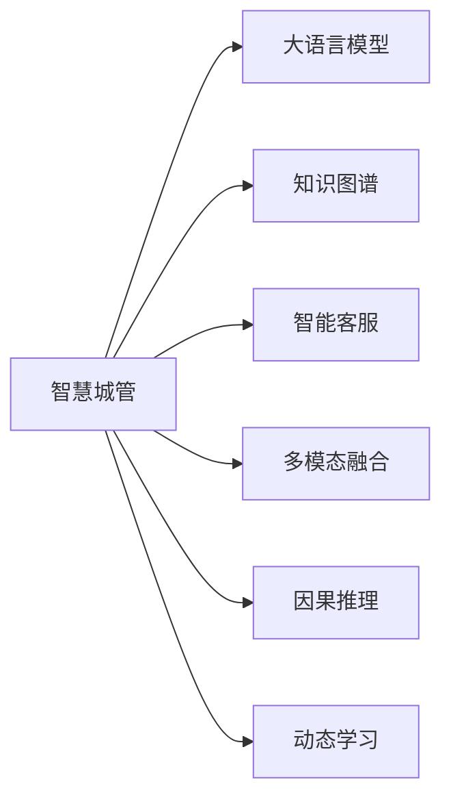

                 

## 1. 背景介绍

在当今数字化转型的大背景下，智慧城市建设已成为各国城市管理的重要方向。智慧城管作为智慧城市的关键组成部分，通过整合各类城市运行数据，实时感知、分析、处理城市问题，极大地提高了城市管理的效率和精度。然而，传统的智慧城管系统往往依赖于大量人工规则，难以实现全面的智能化和自动化。大语言模型的崛起，为智慧城管注入了新动力，通过赋予系统更强大的语言理解和推理能力，提升了城管问题的识别和处理效率。

### 1.1 问题由来

传统的智慧城管系统在运行过程中存在诸多不足：

- **问题识别困难**：城市问题种类繁多，如乱扔垃圾、噪音扰民、占道经营等，传统系统往往依赖人工规则，难以覆盖所有场景，导致问题识别率低。
- **处理效率低下**：许多城市问题需要人工进行核实和处理，不仅耗时费力，还存在人为失误。
- **数据分析不足**：传统的城市运行数据往往结构化程度低，缺乏深度挖掘和分析，难以支撑科学决策。

大语言模型的大规模预训练和微调技术，为智慧城管提供了更智能、更高效的数据处理和问题识别手段。通过引入大模型，城管系统可以在实时数据中自动识别问题，快速生成处理建议，提升问题解决效率。

### 1.2 问题核心关键点

大语言模型在智慧城管中的应用主要围绕以下几个核心关键点展开：

- **数据融合**：将城市运行的多源异构数据进行整合，构建统一的数据融合平台，为大模型提供高效输入。
- **实时处理**：利用大模型的语言理解和推理能力，实时识别城市问题，快速生成处理建议。
- **知识图谱构建**：将城市运行的各类知识进行结构化存储，构建知识图谱，辅助大模型进行知识检索和推理。
- **智能决策**：基于大模型的多模态融合能力和因果分析能力，为城市管理提供科学决策支持。
- **动态优化**：利用大模型的持续学习和微调能力，不断优化模型性能，适应城市运行变化。

### 1.3 问题研究意义

智慧城管系统的智能化升级，不仅能够提高城市管理的效率和精度，还能有效提升市民的满意度，促进城市治理的公平性。大语言模型的应用，将智慧城管系统的能力提升到了一个新的高度，实现了以下几方面的重要意义：

1. **提高问题识别准确率**：通过大模型的语言理解能力，智慧城管系统能够更准确地识别各类城市问题，减少误判和漏判。
2. **加速问题处理流程**：利用大模型的推理和生成能力，智能决策系统可以快速生成问题处理建议，提升问题处理效率。
3. **强化数据分析能力**：大模型能够从海量城市运行数据中提取深度特征，辅助城市决策者进行科学决策。
4. **提升市民参与度**：通过智能客服系统，市民可以更加方便地报告和反馈城市问题，提升市民参与度和满意度。
5. **优化资源配置**：智能决策系统能够根据城市问题的热度和重要性，自动分配资源，实现精细化管理。

## 2. 核心概念与联系

### 2.1 核心概念概述

为更好地理解大语言模型在智慧城管中的应用，本节将介绍几个关键概念：

- **智慧城管**：利用信息技术手段，实现城市运行数据的全面感知、实时处理和科学决策，提高城市管理效率的系统。
- **大语言模型**：基于深度学习技术的语言模型，如BERT、GPT等，具备强大的语言理解和生成能力，广泛应用于自然语言处理(NLP)领域。
- **知识图谱**：通过实体、关系和属性等结构化信息，构建的知识表示体系，用于知识存储和推理。
- **智能客服**：通过自然语言处理技术，提供智能化的客服服务，帮助用户快速解决问题。
- **多模态融合**：将文本、图像、语音等多种信息进行融合，提升智能系统的感知和理解能力。
- **因果推理**：利用因果推断理论，进行系统行为的解释和预测，增强决策的科学性。
- **动态学习**：通过持续学习和微调，使智能系统能够不断适应环境变化，保持高性能。

这些概念之间的逻辑关系可以通过以下Mermaid流程图来展示：



这个流程图展示了大语言模型在智慧城管系统中的应用，以及与知识图谱、智能客服、多模态融合、因果推理和动态学习之间的联系。

## 3. 核心算法原理 & 具体操作步骤

### 3.1 算法原理概述

智慧城管系统中的大语言模型应用，本质上是将大模型视为一个强大的语言理解和推理工具，通过其在大规模数据上的预训练能力，抽取城市问题的关键特征，并进行智能决策。

形式化地，设智慧城管系统中预训练语言模型为 $M_{\theta}$，其中 $\theta$ 为预训练得到的模型参数。给定城市问题数据集 $D=\{(x_i, y_i)\}_{i=1}^N$，每个样本 $(x_i, y_i)$ 由问题描述 $x_i$ 和标签 $y_i$ 构成，其中 $y_i$ 为问题类型（如乱扔垃圾、噪音扰民等）。微调的目标是找到新的模型参数 $\hat{\theta}$，使得：

$$
\hat{\theta}=\mathop{\arg\min}_{\theta} \mathcal{L}(M_{\theta},D)
$$

其中 $\mathcal{L}$ 为针对问题识别和处理任务设计的损失函数，用于衡量模型预测输出与真实标签之间的差异。常见的损失函数包括交叉熵损失、均方误差损失等。

通过梯度下降等优化算法，微调过程不断更新模型参数 $\theta$，最小化损失函数 $\mathcal{L}$，使得模型输出逼近真实标签。由于 $\theta$ 已经通过预训练获得了较好的初始化，因此即便在标注数据量较少的情况下，也能较快收敛到理想的模型参数 $\hat{\theta}$。

### 3.2 算法步骤详解

基于大语言模型的智慧城管微调一般包括以下几个关键步骤：

**Step 1: 数据准备与预处理**
- 收集城市运行的各类数据，包括图像、语音、文本等，并进行清洗、去重、标注等预处理。
- 将标注数据划分为训练集、验证集和测试集。

**Step 2: 数据融合与特征抽取**
- 将多源异构数据进行整合，构建统一的数据融合平台，提供高效的数据输入。
- 利用大模型的语言理解能力，从文本数据中提取关键特征，用于问题识别和处理。

**Step 3: 模型微调与训练**
- 选择合适的预训练语言模型 $M_{\theta}$ 作为初始化参数，如 BERT、GPT 等。
- 添加任务适配层，定义模型在问题识别和处理任务上的输出层和损失函数。
- 设置微调超参数，包括学习率、批大小、迭代轮数等。

**Step 4: 模型评估与优化**
- 在训练集上执行梯度训练，不断优化模型参数。
- 在验证集上周期性评估模型性能，根据性能指标决定是否触发 Early Stopping。
- 根据测试集上的表现，评估微调后的模型性能，对比微调前后的提升效果。

**Step 5: 模型部署与动态优化**
- 将微调后的模型部署到实际的城市管理系统中。
- 持续收集新的城市运行数据，定期重新微调模型，以适应数据分布的变化。

以上是基于大语言模型进行智慧城管微调的一般流程。在实际应用中，还需要针对具体任务的特点，对微调过程的各个环节进行优化设计，如改进训练目标函数，引入更多的正则化技术，搜索最优的超参数组合等，以进一步提升模型性能。

### 3.3 算法优缺点

基于大语言模型的智慧城管微调方法具有以下优点：

1. **高效问题识别**：大语言模型能够从文本数据中提取深度特征，实现高精度的城市问题识别。
2. **快速生成建议**：利用大模型的生成能力，智能决策系统可以快速生成问题处理建议，提升处理效率。
3. **科学决策支持**：通过多模态融合和因果推理，为城市管理提供科学决策依据。
4. **动态优化性能**：大模型的持续学习和微调能力，使其能够不断适应城市运行变化，保持高性能。

同时，该方法也存在一定的局限性：

1. **标注数据成本高**：尽管微调方法对标注数据的需求相对较低，但在城市问题多样化的场景下，仍需大量标注样本。
2. **模型泛化能力有限**：大模型在特定领域的应用效果可能受到领域知识的限制，泛化能力有待提升。
3. **推理速度慢**：超大规模模型在推理过程中可能面临速度和资源瓶颈，需要优化推理效率。
4. **可解释性不足**：大模型的决策过程缺乏可解释性，难以进行有效调试和优化。

尽管存在这些局限性，但就目前而言，基于大语言模型的微调方法仍是目前智慧城管系统中最主流的选择。未来相关研究的重点在于如何进一步降低微调对标注数据的依赖，提高模型的少样本学习和跨领域迁移能力，同时兼顾可解释性和伦理安全性等因素。

### 3.4 算法应用领域

基于大语言模型微调的智慧城管方法，已经在诸多城市管理任务上取得了显著效果，涵盖城市问题识别、智能客服、智能决策等多个方面。例如：

- **城市问题识别**：利用大模型对城市运行的各类文本数据进行智能分析，识别各类问题，如乱扔垃圾、噪音扰民、占道经营等。
- **智能客服系统**：通过自然语言处理技术，构建智能客服系统，帮助市民快速报告和反馈城市问题，提升问题解决效率。
- **智能决策支持**：将大模型与知识图谱、地理信息等数据融合，辅助城市决策者进行科学决策，优化资源配置。
- **动态优化**：利用大模型的持续学习能力，动态调整城市管理策略，应对突发事件和环境变化。

除了上述这些任务外，大语言模型微调技术还被创新性地应用于城市运行的各类场景中，如智能交通管理、公共服务监测、应急响应等，为智慧城管系统的智能化升级提供了新的思路和方法。

## 4. 数学模型和公式 & 详细讲解  
### 4.1 数学模型构建

本节将使用数学语言对基于大语言模型的智慧城管微调过程进行更加严格的刻画。

记智慧城管系统中预训练语言模型为 $M_{\theta}$，其中 $\theta$ 为预训练得到的模型参数。设城市问题数据集为 $D=\{(x_i, y_i)\}_{i=1}^N, x_i \in \mathcal{X}, y_i \in \{1,2,...,K\}$，其中 $K$ 为问题类型的数量。

定义模型 $M_{\theta}$ 在输入 $x_i$ 上的输出为 $\hat{y}=M_{\theta}(x_i) \in [0,1]^K$，表示模型对问题 $i$ 属于类型 $k$ 的概率。则多分类交叉熵损失函数定义为：

$$
\ell(M_{\theta}(x_i),y_i) = -\sum_{k=1}^K y_{ik}\log \hat{y}_{ik}
$$

其中 $y_{ik}$ 为 $y_i$ 中第 $k$ 个元素。

将上述损失函数代入经验风险公式，得：

$$
\mathcal{L}(\theta) = -\frac{1}{N}\sum_{i=1}^N \sum_{k=1}^K y_{ik}\log \hat{y}_{ik}
$$

通过梯度下降等优化算法，微调过程不断更新模型参数 $\theta$，最小化损失函数 $\mathcal{L}$，使得模型输出逼近真实标签。由于 $\theta$ 已经通过预训练获得了较好的初始化，因此即便在标注数据量较少的情况下，也能较快收敛到理想的模型参数 $\hat{\theta}$。

### 4.2 公式推导过程

以下我们以城市问题识别任务为例，推导多分类交叉熵损失函数及其梯度的计算公式。

假设模型 $M_{\theta}$ 在输入 $x_i$ 上的输出为 $\hat{y}=M_{\theta}(x_i) \in [0,1]^K$，表示模型对问题 $i$ 属于类型 $k$ 的概率。真实标签 $y_i \in \{1,2,...,K\}$。则多分类交叉熵损失函数定义为：

$$
\ell(M_{\theta}(x_i),y_i) = -\sum_{k=1}^K y_{ik}\log \hat{y}_{ik}
$$

将其代入经验风险公式，得：

$$
\mathcal{L}(\theta) = -\frac{1}{N}\sum_{i=1}^N \sum_{k=1}^K y_{ik}\log \hat{y}_{ik}
$$

根据链式法则，损失函数对参数 $\theta_k$ 的梯度为：

$$
\frac{\partial \mathcal{L}(\theta)}{\partial \theta_k} = -\frac{1}{N}\sum_{i=1}^N \sum_{k=1}^K (\delta_{ik}-\hat{y}_{ik}) \frac{\partial \hat{y}_{ik}}{\partial \theta_k}
$$

其中 $\delta_{ik}=\begin{cases}
1, & y_i=k \\
0, & y_i \neq k
\end{cases}$ 为标签的二值化表示，$\frac{\partial \hat{y}_{ik}}{\partial \theta_k}$ 为模型的导数计算过程。

在得到损失函数的梯度后，即可带入参数更新公式，完成模型的迭代优化。重复上述过程直至收敛，最终得到适应智慧城管系统任务的最优模型参数 $\hat{\theta}$。

## 5. 项目实践：代码实例和详细解释说明
### 5.1 开发环境搭建

在进行智慧城管系统的微调实践前，我们需要准备好开发环境。以下是使用Python进行PyTorch开发的环境配置流程：

1. 安装Anaconda：从官网下载并安装Anaconda，用于创建独立的Python环境。

2. 创建并激活虚拟环境：
```bash
conda create -n pytorch-env python=3.8 
conda activate pytorch-env
```

3. 安装PyTorch：根据CUDA版本，从官网获取对应的安装命令。例如：
```bash
conda install pytorch torchvision torchaudio cudatoolkit=11.1 -c pytorch -c conda-forge
```

4. 安装Transformers库：
```bash
pip install transformers
```

5. 安装各类工具包：
```bash
pip install numpy pandas scikit-learn matplotlib tqdm jupyter notebook ipython
```

完成上述步骤后，即可在`pytorch-env`环境中开始微调实践。

### 5.2 源代码详细实现

下面我以城市问题识别任务为例，给出使用Transformers库对BERT模型进行微调的PyTorch代码实现。

首先，定义城市问题识别任务的数据处理函数：

```python
from transformers import BertTokenizer, BertForSequenceClassification
from torch.utils.data import Dataset
import torch

class CityIssueDataset(Dataset):
    def __init__(self, texts, tags, tokenizer, max_len=128):
        self.texts = texts
        self.tags = tags
        self.tokenizer = tokenizer
        self.max_len = max_len
        
    def __len__(self):
        return len(self.texts)
    
    def __getitem__(self, item):
        text = self.texts[item]
        tags = self.tags[item]
        
        encoding = self.tokenizer(text, return_tensors='pt', max_length=self.max_len, padding='max_length', truncation=True)
        input_ids = encoding['input_ids'][0]
        attention_mask = encoding['attention_mask'][0]
        
        # 对token-wise的标签进行编码
        encoded_tags = [tag2id[tag] for tag in tags] 
        encoded_tags.extend([tag2id['O']] * (self.max_len - len(encoded_tags)))
        labels = torch.tensor(encoded_tags, dtype=torch.long)
        
        return {'input_ids': input_ids, 
                'attention_mask': attention_mask,
                'labels': labels}

# 标签与id的映射
tag2id = {'O': 0, 'Littering': 1, 'Noise': 2, 'Obstruction': 3, 'Other': 4}
id2tag = {v: k for k, v in tag2id.items()}

# 创建dataset
tokenizer = BertTokenizer.from_pretrained('bert-base-cased')

train_dataset = CityIssueDataset(train_texts, train_tags, tokenizer)
dev_dataset = CityIssueDataset(dev_texts, dev_tags, tokenizer)
test_dataset = CityIssueDataset(test_texts, test_tags, tokenizer)
```

然后，定义模型和优化器：

```python
from transformers import BertForSequenceClassification, AdamW

model = BertForSequenceClassification.from_pretrained('bert-base-cased', num_labels=len(tag2id))

optimizer = AdamW(model.parameters(), lr=2e-5)
```

接着，定义训练和评估函数：

```python
from torch.utils.data import DataLoader
from tqdm import tqdm
from sklearn.metrics import classification_report

device = torch.device('cuda') if torch.cuda.is_available() else torch.device('cpu')
model.to(device)

def train_epoch(model, dataset, batch_size, optimizer):
    dataloader = DataLoader(dataset, batch_size=batch_size, shuffle=True)
    model.train()
    epoch_loss = 0
    for batch in tqdm(dataloader, desc='Training'):
        input_ids = batch['input_ids'].to(device)
        attention_mask = batch['attention_mask'].to(device)
        labels = batch['labels'].to(device)
        model.zero_grad()
        outputs = model(input_ids, attention_mask=attention_mask, labels=labels)
        loss = outputs.loss
        epoch_loss += loss.item()
        loss.backward()
        optimizer.step()
    return epoch_loss / len(dataloader)

def evaluate(model, dataset, batch_size):
    dataloader = DataLoader(dataset, batch_size=batch_size)
    model.eval()
    preds, labels = [], []
    with torch.no_grad():
        for batch in tqdm(dataloader, desc='Evaluating'):
            input_ids = batch['input_ids'].to(device)
            attention_mask = batch['attention_mask'].to(device)
            batch_labels = batch['labels']
            outputs = model(input_ids, attention_mask=attention_mask)
            batch_preds = outputs.logits.argmax(dim=2).to('cpu').tolist()
            batch_labels = batch_labels.to('cpu').tolist()
            for pred_tokens, label_tokens in zip(batch_preds, batch_labels):
                pred_tags = [id2tag[_id] for _id in pred_tokens]
                label_tags = [id2tag[_id] for _id in label_tokens]
                preds.append(pred_tags[:len(label_tags)])
                labels.append(label_tags)
                
    print(classification_report(labels, preds))
```

最后，启动训练流程并在测试集上评估：

```python
epochs = 5
batch_size = 16

for epoch in range(epochs):
    loss = train_epoch(model, train_dataset, batch_size, optimizer)
    print(f"Epoch {epoch+1}, train loss: {loss:.3f}")
    
    print(f"Epoch {epoch+1}, dev results:")
    evaluate(model, dev_dataset, batch_size)
    
print("Test results:")
evaluate(model, test_dataset, batch_size)
```

以上就是使用PyTorch对BERT进行城市问题识别任务微调的完整代码实现。可以看到，得益于Transformers库的强大封装，我们可以用相对简洁的代码完成BERT模型的加载和微调。

### 5.3 代码解读与分析

让我们再详细解读一下关键代码的实现细节：

**CityIssueDataset类**：
- `__init__`方法：初始化文本、标签、分词器等关键组件。
- `__len__`方法：返回数据集的样本数量。
- `__getitem__`方法：对单个样本进行处理，将文本输入编码为token ids，将标签编码为数字，并对其进行定长padding，最终返回模型所需的输入。

**tag2id和id2tag字典**：
- 定义了标签与数字id之间的映射关系，用于将token-wise的预测结果解码回真实的标签。

**训练和评估函数**：
- 使用PyTorch的DataLoader对数据集进行批次化加载，供模型训练和推理使用。
- 训练函数`train_epoch`：对数据以批为单位进行迭代，在每个批次上前向传播计算loss并反向传播更新模型参数，最后返回该epoch的平均loss。
- 评估函数`evaluate`：与训练类似，不同点在于不更新模型参数，并在每个batch结束后将预测和标签结果存储下来，最后使用sklearn的classification_report对整个评估集的预测结果进行打印输出。

**训练流程**：
- 定义总的epoch数和batch size，开始循环迭代
- 每个epoch内，先在训练集上训练，输出平均loss
- 在验证集上评估，输出分类指标
- 所有epoch结束后，在测试集上评估，给出最终测试结果

可以看到，PyTorch配合Transformers库使得BERT微调的代码实现变得简洁高效。开发者可以将更多精力放在数据处理、模型改进等高层逻辑上，而不必过多关注底层的实现细节。

当然，工业级的系统实现还需考虑更多因素，如模型的保存和部署、超参数的自动搜索、更灵活的任务适配层等。但核心的微调范式基本与此类似。

## 6. 实际应用场景
### 6.1 智能客服系统

基于大语言模型的智慧城管对话技术，可以广泛应用于智能客服系统的构建。传统客服往往需要配备大量人力，高峰期响应缓慢，且一致性和专业性难以保证。而使用微调后的对话模型，可以7x24小时不间断服务，快速响应客户咨询，用自然流畅的语言解答各类常见问题。

在技术实现上，可以收集企业内部的历史客服对话记录，将问题和最佳答复构建成监督数据，在此基础上对预训练对话模型进行微调。微调后的对话模型能够自动理解用户意图，匹配最合适的答案模板进行回复。对于客户提出的新问题，还可以接入检索系统实时搜索相关内容，动态组织生成回答。如此构建的智能客服系统，能大幅提升客户咨询体验和问题解决效率。

### 6.2 金融舆情监测

金融机构需要实时监测市场舆论动向，以便及时应对负面信息传播，规避金融风险。传统的人工监测方式成本高、效率低，难以应对网络时代海量信息爆发的挑战。基于大语言模型微调的文本分类和情感分析技术，为金融舆情监测提供了新的解决方案。

具体而言，可以收集金融领域相关的新闻、报道、评论等文本数据，并对其进行主题标注和情感标注。在此基础上对预训练语言模型进行微调，使其能够自动判断文本属于何种主题，情感倾向是正面、中性还是负面。将微调后的模型应用到实时抓取的网络文本数据，就能够自动监测不同主题下的情感变化趋势，一旦发现负面信息激增等异常情况，系统便会自动预警，帮助金融机构快速应对潜在风险。

### 6.3 个性化推荐系统

当前的推荐系统往往只依赖用户的历史行为数据进行物品推荐，无法深入理解用户的真实兴趣偏好。基于大语言模型微调技术，个性化推荐系统可以更好地挖掘用户行为背后的语义信息，从而提供更精准、多样的推荐内容。

在实践中，可以收集用户浏览、点击、评论、分享等行为数据，提取和用户交互的物品标题、描述、标签等文本内容。将文本内容作为模型输入，用户的后续行为（如是否点击、购买等）作为监督信号，在此基础上微调预训练语言模型。微调后的模型能够从文本内容中准确把握用户的兴趣点。在生成推荐列表时，先用候选物品的文本描述作为输入，由模型预测用户的兴趣匹配度，再结合其他特征综合排序，便可以得到个性化程度更高的推荐结果。

### 6.4 未来应用展望

随着大语言模型微调技术的发展，其在智慧城管系统中的应用前景将更加广阔。未来，大语言模型将在智慧城管中扮演越来越重要的角色，推动城市管理智能化、精细化、高效化发展。

在智慧交通管理方面，大语言模型可以实时监测交通流量，识别交通违规行为，辅助交警部门进行智能执法。在公共服务监测方面，利用大模型的多模态融合能力，可以对公共设施运行情况进行全面感知，提高公共服务质量。在应急响应方面，大语言模型可以分析突发事件的历史数据，预测事件发展趋势，辅助城市管理部门进行快速响应和决策。

此外，在智慧能源、智慧环境、智慧旅游等多个领域，大语言模型微调技术也将大放异彩，为智慧城市建设提供强大动力。相信随着技术的不断进步，大语言模型微调将为智慧城管系统带来更多创新应用，构建更智能、更高效的城市治理体系。

## 7. 工具和资源推荐
### 7.1 学习资源推荐

为了帮助开发者系统掌握大语言模型微调的理论基础和实践技巧，这里推荐一些优质的学习资源：

1. 《Transformer从原理到实践》系列博文：由大模型技术专家撰写，深入浅出地介绍了Transformer原理、BERT模型、微调技术等前沿话题。

2. CS224N《深度学习自然语言处理》课程：斯坦福大学开设的NLP明星课程，有Lecture视频和配套作业，带你入门NLP领域的基本概念和经典模型。

3. 《Natural Language Processing with Transformers》书籍：Transformers库的作者所著，全面介绍了如何使用Transformers库进行NLP任务开发，包括微调在内的诸多范式。

4. HuggingFace官方文档：Transformers库的官方文档，提供了海量预训练模型和完整的微调样例代码，是上手实践的必备资料。

5. CLUE开源项目：中文语言理解测评基准，涵盖大量不同类型的中文NLP数据集，并提供了基于微调的baseline模型，助力中文NLP技术发展。

通过对这些资源的学习实践，相信你一定能够快速掌握大语言模型微调的精髓，并用于解决实际的NLP问题。
###  7.2 开发工具推荐

高效的开发离不开优秀的工具支持。以下是几款用于大语言模型微调开发的常用工具：

1. PyTorch：基于Python的开源深度学习框架，灵活动态的计算图，适合快速迭代研究。大部分预训练语言模型都有PyTorch版本的实现。

2. TensorFlow：由Google主导开发的开源深度学习框架，生产部署方便，适合大规模工程应用。同样有丰富的预训练语言模型资源。

3. Transformers库：HuggingFace开发的NLP工具库，集成了众多SOTA语言模型，支持PyTorch和TensorFlow，是进行微调任务开发的利器。

4. Weights & Biases：模型训练的实验跟踪工具，可以记录和可视化模型训练过程中的各项指标，方便对比和调优。与主流深度学习框架无缝集成。

5. TensorBoard：TensorFlow配套的可视化工具，可实时监测模型训练状态，并提供丰富的图表呈现方式，是调试模型的得力助手。

6. Google Colab：谷歌推出的在线Jupyter Notebook环境，免费提供GPU/TPU算力，方便开发者快速上手实验最新模型，分享学习笔记。

合理利用这些工具，可以显著提升大语言模型微调任务的开发效率，加快创新迭代的步伐。

### 7.3 相关论文推荐

大语言模型和微调技术的发展源于学界的持续研究。以下是几篇奠基性的相关论文，推荐阅读：

1. Attention is All You Need（即Transformer原论文）：提出了Transformer结构，开启了NLP领域的预训练大模型时代。

2. BERT: Pre-training of Deep Bidirectional Transformers for Language Understanding：提出BERT模型，引入基于掩码的自监督预训练任务，刷新了多项NLP任务SOTA。

3. Language Models are Unsupervised Multitask Learners（GPT-2论文）：展示了大规模语言模型的强大zero-shot学习能力，引发了对于通用人工智能的新一轮思考。

4. Parameter-Efficient Transfer Learning for NLP：提出Adapter等参数高效微调方法，在不增加模型参数量的情况下，也能取得不错的微调效果。

5. Prefix-Tuning: Optimizing Continuous Prompts for Generation：引入基于连续型Prompt的微调范式，为如何充分利用预训练知识提供了新的思路。

6. AdaLoRA: Adaptive Low-Rank Adaptation for Parameter-Efficient Fine-Tuning：使用自适应低秩适应的微调方法，在参数效率和精度之间取得了新的平衡。

这些论文代表了大语言模型微调技术的发展脉络。通过学习这些前沿成果，可以帮助研究者把握学科前进方向，激发更多的创新灵感。

## 8. 总结：未来发展趋势与挑战

### 8.1 总结

本文对基于大语言模型的智慧城管微调方法进行了全面系统的介绍。首先阐述了大语言模型和微调技术的研究背景和意义，明确了微调在拓展预训练模型应用、提升智慧城管系统效能方面的独特价值。其次，从原理到实践，详细讲解了智慧城管系统中大语言模型微调的过程，给出了微调任务开发的完整代码实例。同时，本文还广泛探讨了微调方法在智慧城管系统中的应用场景，展示了微调范式的巨大潜力。此外，本文精选了微调技术的各类学习资源，力求为读者提供全方位的技术指引。

通过本文的系统梳理，可以看到，基于大语言模型的微调方法正在成为智慧城管系统的核心技术，极大地提高了城市管理的效率和精度，提升了市民的满意度。未来，随着大语言模型微调技术的不断发展，智慧城管系统的智能化水平将进一步提升，为构建更加智慧、高效的城市治理体系提供新的动力。

### 8.2 未来发展趋势

展望未来，大语言模型微调技术将呈现以下几个发展趋势：

1. **模型规模持续增大**。随着算力成本的下降和数据规模的扩张，预训练语言模型的参数量还将持续增长。超大规模语言模型蕴含的丰富语言知识，有望支撑更加复杂多变的智慧城管微调。

2. **微调方法日趋多样**。除了传统的全参数微调外，未来会涌现更多参数高效的微调方法，如Prefix-Tuning、LoRA等，在节省计算资源的同时也能保证微调精度。

3. **持续学习成为常态**。随着数据分布的不断变化，微调模型也需要持续学习新知识以保持性能。如何在不遗忘原有知识的同时，高效吸收新样本信息，将成为重要的研究课题。

4. **标注样本需求降低**。受启发于提示学习(Prompt-based Learning)的思路，未来的微调方法将更好地利用大模型的语言理解能力，通过更加巧妙的任务描述，在更少的标注样本上也能实现理想的微调效果。

5. **多模态微调崛起**。当前的微调主要聚焦于纯文本数据，未来会进一步拓展到图像、视频、语音等多模态数据微调。多模态信息的融合，将显著提升智慧城管系统的感知和理解能力。

6. **模型通用性增强**。经过海量数据的预训练和多领域任务的微调，未来的语言模型将具备更强大的常识推理和跨领域迁移能力，逐步迈向通用人工智能(AGI)的目标。

以上趋势凸显了大语言模型微调技术的广阔前景。这些方向的探索发展，必将进一步提升智慧城管系统的性能和应用范围，为构建智能、高效、安全的城市治理体系提供新的思路和方法。

### 8.3 面临的挑战

尽管大语言模型微调技术已经取得了瞩目成就，但在迈向更加智能化、普适化应用的过程中，它仍面临着诸多挑战：

1. **标注成本瓶颈**。尽管微调方法对标注数据的需求相对较低，但在城市问题多样化的场景下，仍需大量标注样本。如何进一步降低微调对标注样本的依赖，将是一大难题。

2. **模型鲁棒性不足**。当前微调模型面对域外数据时，泛化性能往往大打折扣。对于测试样本的微小扰动，微调模型的预测也容易发生波动。如何提高微调模型的鲁棒性，避免灾难性遗忘，还需要更多理论和实践的积累。

3. **推理效率有待提高**。超大规模模型在推理过程中可能面临速度和资源瓶颈，需要优化推理效率。

4. **可解释性亟需加强**。当前微调模型更像是"黑盒"系统，难以解释其内部工作机制和决策逻辑。对于医疗、金融等高风险应用，算法的可解释性和可审计性尤为重要。

5. **安全性有待保障**。预训练语言模型难免会学习到有偏见、有害的信息，通过微调传递到智慧城管系统中，产生误导性、歧视性的输出，给实际应用带来安全隐患。

6. **知识整合能力不足**。现有的微调模型往往局限于任务内数据，难以灵活吸收和运用更广泛的先验知识。如何让微调过程更好地与外部知识库、规则库等专家知识结合，形成更加全面、准确的信息整合能力，还有很大的想象空间。

正视微调面临的这些挑战，积极应对并寻求突破，将是大语言模型微调走向成熟的必由之路。相信随着学界和产业界的共同努力，这些挑战终将一一被克服，大语言模型微调必将在构建智慧城管系统、推动城市管理智能化转型中发挥越来越重要的作用。

### 8.4 研究展望

面对大语言模型微调所面临的挑战，未来的研究需要在以下几个方面寻求新的突破：

1. **探索无监督和半监督微调方法**。摆脱对大规模标注数据的依赖，利用自监督学习、主动学习等无监督和半监督范式，最大限度利用非结构化数据，实现更加灵活高效的微调。

2. **研究参数高效和计算高效的微调范式**。开发更加参数高效的微调方法，在固定大部分预训练参数的同时，只更新极少量的任务相关参数。同时优化微调模型的计算图，减少前向传播和反向传播的资源消耗，实现更加轻量级、实时性的部署。

3. **融合因果和对比学习范式**。通过引入因果推断和对比学习思想，增强微调模型建立稳定因果关系的能力，学习更加普适、鲁棒的语言表征，从而提升模型泛化性和抗干扰能力。

4. **引入更多先验知识**。将符号化的先验知识，如知识图谱、逻辑规则等，与神经网络模型进行巧妙融合，引导微调过程学习更准确、合理的语言模型。同时加强不同模态数据的整合，实现视觉、语音等多模态信息与文本信息的协同建模。

5. **结合因果分析和博弈论工具**。将因果分析方法引入微调模型，识别出模型决策的关键特征，增强输出解释的因果性和逻辑性。借助博弈论工具刻画人机交互过程，主动探索并规避模型的脆弱点，提高系统稳定性。

6. **纳入伦理道德约束**。在模型训练目标中引入伦理导向的评估指标，过滤和惩罚有偏见、有害的输出倾向。同时加强人工干预和审核，建立模型行为的监管机制，确保输出符合人类价值观和伦理道德。

这些研究方向的探索，必将引领大语言模型微调技术迈向更高的台阶，为构建安全、可靠、可解释、可控的智能系统铺平道路。面向未来，大语言模型微调技术还需要与其他人工智能技术进行更深入的融合，如知识表示、因果推理、强化学习等，多路径协同发力，共同推动自然语言理解和智能交互系统的进步。只有勇于创新、敢于突破，才能不断拓展语言模型的边界，让智能技术更好地造福人类社会。

## 9. 附录：常见问题与解答

**Q1：大语言模型微调是否适用于所有智慧城管任务？**

A: 大语言模型微调在大多数智慧城管任务上都能取得不错的效果，特别是对于数据量较小的任务。但对于一些特定领域的任务，如交通监控、能源管理等，仅依赖通用语料预训练的模型可能难以很好地适应。此时需要在特定领域语料上进一步预训练，再进行微调，才能获得理想效果。

**Q2：微调过程中如何选择合适的学习率？**

A: 微调的学习率一般要比预训练时小1-2个数量级，如果使用过大的学习率，容易破坏预训练权重，导致过拟合。一般建议从1e-5开始调参，逐步减小学习率，直至收敛。也可以使用warmup策略，在开始阶段使用较小的学习率，再逐渐过渡到预设值。需要注意的是，不同的优化器(如AdamW、Adafactor等)以及不同的学习率调度策略，可能需要设置不同的学习率阈值。

**Q3：采用大模型微调时会面临哪些资源瓶颈？**

A: 目前主流的预训练大模型动辄以亿计的参数规模，对算力、内存、存储都提出了很高的要求。GPU/TPU等高性能设备是必不可少的，但即便如此，超大批次的训练和推理也可能遇到显存不足的问题。因此需要采用一些资源优化技术，如梯度积累、混合精度训练、模型并行等，来突破硬件瓶颈。同时，模型的存储和读取也可能占用大量时间和空间，需要采用模型压缩、稀疏化存储等方法进行优化。

**Q4：如何缓解微调过程中的过拟合问题？**

A: 过拟合是微调面临的主要挑战，尤其是在标注数据不足的情况下。常见的缓解策略包括：
1. 数据增强：通过回译、近义替换等方式扩充训练集
2. 正则化：使用L2正则、Dropout、Early Stopping等避免过拟合
3. 对抗训练：引入对抗样本，提高模型鲁棒性
4. 参数高效微调：只调整少量参数(如Adapter、Prefix等)，减小过拟合风险
5. 多模型集成：训练多个微调模型，取平均输出，抑制过拟合

这些策略往往需要根据具体任务和数据特点进行灵活组合。只有在数据、模型、训练、推理等各环节进行全面优化，才能最大限度地发挥大模型微调的威力。

**Q5：微调模型在落地部署时需要注意哪些问题？**

A: 将微调模型转化为实际应用，还需要考虑以下因素：
1. 模型裁剪：去除不必要的层和参数，减小模型尺寸，加快推理速度
2. 量化加速：将浮点模型转为定点模型，压缩存储空间，提高计算效率
3. 服务化封装：将模型封装为标准化服务接口，便于集成调用
4. 弹性伸缩：根据请求流量动态调整资源配置，平衡服务质量和成本
5. 监控告警：实时采集系统指标，设置异常告警阈值，确保服务稳定性
6. 安全防护：采用访问鉴权、数据脱敏等措施，保障数据和模型安全

大语言模型微调为智慧城管系统提供了强大的支持，但如何将强大的性能转化为稳定、高效的服务，还需要工程实践的不断打磨。只有从数据、算法、工程、业务等多个维度协同发力，才能真正实现人工智能技术在智慧城管中的应用价值。

总之，大语言模型微调技术正在引领智慧城管系统的智能化升级，成为推动城市治理现代化的重要力量。通过不断探索和创新，大语言模型微调必将在智慧城管中发挥更大的作用，为构建更加智能、高效、安全的城市治理体系做出更大贡献。

---

作者：禅与计算机程序设计艺术 / Zen and the Art of Computer Programming

