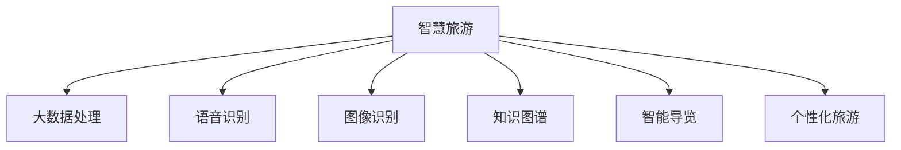

                 

# 大模型赋能智慧旅游，创业者如何提供智能导览与个性化旅游服务？

在数字化、智能化的浪潮中，旅游行业正经历着深刻的变革。借助人工智能（AI）和大数据技术，智慧旅游成为旅游行业转型升级的重要方向。本文将探讨如何利用大模型赋能智慧旅游，帮助创业者提供智能导览与个性化旅游服务。

## 1. 背景介绍

### 1.1 问题由来

随着互联网和移动设备的普及，旅游方式和体验正在发生变化。传统的旅游模式难以满足游客多样化和个性化的需求，亟需通过技术手段提升旅游服务的智能化水平。智慧旅游作为新一代旅游服务模式，通过数字化、网络化、智能化手段，改善游客体验，提升旅游质量。

大模型作为AI领域的重要技术，具有强大的语言理解和生成能力，能够为智慧旅游提供有力支持。利用大模型，可以实现语音识别、文本翻译、语义分析等功能，为游客提供智能导览、个性化推荐、智能客服等服务，从而大幅提升旅游体验和运营效率。

### 1.2 问题核心关键点

智慧旅游的核心在于通过技术手段提升旅游体验，其关键点包括：
- **大数据处理**：收集和分析游客行为数据，进行个性化推荐。
- **语音识别与生成**：实现自然语言交互，提升导览和客服体验。
- **图像识别与生成**：通过图像识别技术，增强游览体验，如景物介绍、路径规划等。
- **知识图谱**：整合海量知识，提升导游讲解的深度和广度。

## 2. 核心概念与联系

### 2.1 核心概念概述

- **大模型**：指通过大规模无标签数据训练得到的深度学习模型，如GPT、BERT等。这些模型能够学习到丰富的语言知识和常识，具备强大的自然语言处理能力。
- **智慧旅游**：利用AI和大数据技术，通过数字化、网络化、智能化手段，提升旅游服务的质量和游客体验。
- **智能导览**：利用AI技术，为游客提供语音导览、图像识别导览等服务。
- **个性化旅游**：根据游客的兴趣、偏好和行为数据，提供定制化的旅游服务和推荐。

### 2.2 核心概念联系

智慧旅游与大模型的关系可以通过以下Mermaid流程图来展示：



这个流程图展示了大模型在智慧旅游中的作用：

1. 大数据处理：收集游客行为数据，构建知识图谱，提供数据支撑。
2. 语音识别与生成：通过大模型实现自然语言交互，提供智能导览和客服服务。
3. 图像识别：利用大模型进行景物识别，提升导览体验。
4. 知识图谱：整合海量知识，提升导游讲解的深度和广度。
5. 智能导览：基于大模型生成的导览内容，实现游客互动和个性化推荐。
6. 个性化旅游：利用大模型进行游客行为分析，提供定制化的旅游服务。

这些核心概念共同构成了智慧旅游的实现框架，使大模型在智慧旅游中发挥着至关重要的作用。

## 3. 核心算法原理 & 具体操作步骤

### 3.1 算法原理概述

智慧旅游中的智能导览和个性化旅游服务，主要依赖于大模型在自然语言处理（NLP）和计算机视觉（CV）领域的应用。其算法原理如下：

1. **自然语言处理（NLP）**：通过预训练的大模型，对游客提出的问题进行理解和回答，提供个性化的旅游服务。
2. **计算机视觉（CV）**：利用大模型对旅游场景进行图像识别，提供导览和推荐服务。
3. **知识图谱**：构建旅游领域的知识图谱，通过大模型进行关联和推理，提升导游讲解的深度和广度。

### 3.2 算法步骤详解

以智能导览为例，具体的算法步骤如下：

1. **数据准备**：收集游客的语音指令和景点介绍文本，构建训练数据集。
2. **模型训练**：使用大模型进行预训练，并在旅游场景上进行微调，使其适应特定场景。
3. **语音识别**：将游客的语音指令转换为文本。
4. **意图识别**：利用大模型对文本进行意图分析，确定游客的需求。
5. **路径规划**：根据游客需求，结合景点信息，规划最优游览路径。
6. **语音生成**：利用大模型生成导览语音，为游客提供路径指引和景点介绍。

### 3.3 算法优缺点

**优点**：
- **高效性**：大模型能够高效地处理大量的自然语言和图像数据，提升导览和推荐效率。
- **灵活性**：大模型具备高度灵活的适应能力，能够根据不同场景进行定制化调整。
- **可靠性**：大模型经过大规模训练，具备较高的准确性和鲁棒性，能够稳定提供服务。

**缺点**：
- **成本高**：预训练大模型的构建和微调需要大量的计算资源和时间。
- **数据依赖**：大模型的效果依赖于数据质量，需要高质量的旅游场景数据和游客行为数据。
- **隐私风险**：需要处理游客的个人信息，可能存在隐私泄露的风险。

### 3.4 算法应用领域

基于大模型的智慧旅游应用，已经广泛应用于多个领域：

- **旅游景区**：通过智能导览和个性化推荐，提升游客体验，优化景区管理。
- **在线旅游平台**：提供智能客服、行程规划、景点介绍等服务，提高平台的用户粘性和满意度。
- **旅游目的地**：利用知识图谱进行文化讲解和历史介绍，提升旅游目的地的文化价值和吸引力。

## 4. 数学模型和公式 & 详细讲解 & 举例说明

### 4.1 数学模型构建

在智慧旅游中，大模型主要用于自然语言处理和图像识别任务。以下是这两种任务的数学模型构建：

- **自然语言处理（NLP）**：使用Transformer模型进行预训练，以生成语言模型或序列标注模型。
- **计算机视觉（CV）**：使用卷积神经网络（CNN）或注意力机制（Attention）模型进行预训练，以生成图像分类或目标检测模型。

### 4.2 公式推导过程

以自然语言处理为例，假设大模型为$M$，输入为$x$，输出为$y$，则预测过程可以表示为：

$$
y = M(x)
$$

其中$M$为预训练好的Transformer模型，$x$为输入的文本，$y$为模型输出的语言表示。

### 4.3 案例分析与讲解

以图像识别为例，假设大模型为$M$，输入为$I$，输出为$y$，则预测过程可以表示为：

$$
y = M(I)
$$

其中$M$为预训练好的CNN或Attention模型，$I$为输入的图像，$y$为模型输出的类别标签。

## 5. 项目实践：代码实例和详细解释说明

### 5.1 开发环境搭建

为了实现智慧旅游中的智能导览和个性化服务，我们需要搭建一个基于大模型的开发环境。以下是环境搭建的具体步骤：

1. **安装Python和PyTorch**：使用Anaconda安装Python和PyTorch，并创建虚拟环境。
2. **安装其他依赖**：安装TensorFlow、TensorBoard、Weights & Biases等工具包。
3. **下载预训练模型**：从官网下载预训练模型，如BERT、GPT等，并进行本地部署。

### 5.2 源代码详细实现

以下是一个简单的智能导览系统代码实现，包含语音识别、意图分析和语音生成的部分：

```python
import torch
from transformers import BertForSequenceClassification, BertTokenizer

# 初始化模型和分词器
model = BertForSequenceClassification.from_pretrained('bert-base-cased', num_labels=2)
tokenizer = BertTokenizer.from_pretrained('bert-base-cased')

# 定义语音识别函数
def speech_to_text(speech):
    # 将语音转换为文本
    text = ...

    # 分词并转换为模型输入
    input_ids = tokenizer(text, return_tensors='pt').input_ids
    attention_mask = tokenizer(text, return_tensors='pt').attention_mask

    # 前向传播计算模型输出
    with torch.no_grad():
        output = model(input_ids, attention_mask=attention_mask)
        logits = output.logits

    # 计算预测结果
    _, predicted_label = torch.max(logits, dim=1)
    return predicted_label

# 定义意图分析函数
def analyze_intent(text):
    # 将文本输入模型
    input_ids = tokenizer(text, return_tensors='pt').input_ids
    attention_mask = tokenizer(text, return_tensors='pt').attention_mask

    # 前向传播计算模型输出
    with torch.no_grad():
        output = model(input_ids, attention_mask=attention_mask)
        logits = output.logits

    # 计算预测结果
    _, predicted_label = torch.max(logits, dim=1)
    return predicted_label

# 定义语音生成函数
def generate_speech(intent, path):
    # 根据意图和路径生成导览语音
    speech = ...

    # 返回语音
    return speech
```

### 5.3 代码解读与分析

上述代码实现了一个简单的智能导览系统，包含语音识别、意图分析和语音生成三个主要模块。以下是关键代码的解读与分析：

- **语音识别函数**：将语音转换为文本，并进行分词和向量化处理，输入到BertForSequenceClassification模型中进行意图分类。
- **意图分析函数**：将文本输入模型，进行意图分类，确定游客的需求。
- **语音生成函数**：根据游客的意图和游览路径，生成导览语音，提供路径指引和景点介绍。

## 6. 实际应用场景

### 6.1 智慧旅游景区

在智慧旅游景区中，智能导览系统可以提供语音导览、景点介绍和路径规划等服务。游客通过语音指令或输入文本，系统能够快速识别并生成相应的导览内容，提升游览体验。

以一个公园景区为例，系统可以：

- **语音导览**：游客通过语音输入请求，系统提供语音导览服务，介绍景点历史和文化。
- **路径规划**：根据游客兴趣，结合景点信息，生成最优游览路径。
- **景点推荐**：根据游客行为数据，推荐热门景点和活动，提高游客满意度。

### 6.2 在线旅游平台

在线旅游平台可以利用智能导览和个性化推荐，提升用户粘性和满意度。平台可以通过以下方式实现：

- **智能客服**：利用大模型进行问答和处理订单，提高客服效率。
- **行程规划**：根据用户偏好，提供个性化的行程推荐。
- **景点介绍**：提供景点介绍和评分，帮助用户做出选择。

### 6.3 旅游目的地

旅游目的地可以利用知识图谱和大模型，提供深度文化讲解和历史介绍。目的地可以：

- **文化讲解**：通过大模型进行文化讲解，提升游客的文化体验。
- **历史介绍**：利用知识图谱进行历史关联和推理，提供历史故事和背景。
- **游客引导**：结合游客行为数据，提供个性化的游客引导和推荐。

## 7. 工具和资源推荐

### 7.1 学习资源推荐

为了帮助开发者掌握智慧旅游开发的技术，推荐以下学习资源：

1. **《智慧旅游：大数据与AI的应用》**：介绍智慧旅游的基本概念和实现方法，适合初学者入门。
2. **《自然语言处理综论》**：涵盖NLP的基本原理和技术，适合深入学习。
3. **《计算机视觉基础》**：介绍CV的基本概念和实现方法，适合深度学习工程师。
4. **HuggingFace官方文档**：提供丰富的预训练模型和代码样例，适合实战练习。
5. **Kaggle竞赛**：参加Kaggle的智慧旅游竞赛，实践和提升开发技能。

### 7.2 开发工具推荐

以下是一些常用的开发工具，可以帮助开发者提高开发效率：

1. **PyTorch**：深度学习框架，适合构建智慧旅游中的NLP和CV模型。
2. **TensorFlow**：深度学习框架，适合大规模模型训练和部署。
3. **Weights & Biases**：实验跟踪工具，记录和可视化模型训练过程。
4. **TensorBoard**：可视化工具，实时监测模型训练状态。
5. **Jupyter Notebook**：交互式开发环境，适合模型开发和实验。

### 7.3 相关论文推荐

以下是几篇重要的智慧旅游相关的论文，推荐阅读：

1. **智慧旅游中的深度学习研究**：综述了智慧旅游中的深度学习应用，适合了解整体趋势。
2. **基于知识图谱的旅游信息抽取**：介绍利用知识图谱进行旅游信息抽取的技术，适合深入研究。
3. **自然语言处理在智慧旅游中的应用**：介绍NLP在智慧旅游中的应用，适合实际开发。
4. **计算机视觉在智慧旅游中的应用**：介绍CV在智慧旅游中的应用，适合技术实践。

## 8. 总结：未来发展趋势与挑战

### 8.1 总结

本文探讨了如何利用大模型赋能智慧旅游，帮助创业者提供智能导览与个性化旅游服务。通过系统介绍大模型在智慧旅游中的应用，希望为开发者提供参考和指导。

### 8.2 未来发展趋势

未来智慧旅游的发展趋势包括：

1. **技术融合**：结合AI、VR/AR、物联网等技术，提供沉浸式和交互式的旅游体验。
2. **数据驱动**：通过大数据分析，提供个性化的旅游推荐和优化。
3. **知识图谱**：构建旅游领域的知识图谱，提升导游讲解的深度和广度。
4. **智能客服**：利用大模型提供智能客服，提高用户体验。
5. **语音识别**：利用大模型提供语音识别和生成服务，提升导览和客服体验。

### 8.3 面临的挑战

智慧旅游的发展面临以下挑战：

1. **数据隐私**：需要处理大量的游客数据，存在隐私泄露风险。
2. **技术成本**：大模型的构建和微调需要大量的计算资源和时间。
3. **用户体验**：需要提升系统的交互性和用户体验，避免出现技术故障。
4. **模型鲁棒性**：需要提升模型的鲁棒性，应对多变的环境和用户需求。

### 8.4 研究展望

未来的研究展望包括：

1. **隐私保护**：研究隐私保护技术，确保游客数据的安全。
2. **高效计算**：研究高效的计算方法，降低模型训练和推理成本。
3. **智能客服**：研究智能客服的交互技术和自然语言生成技术。
4. **知识图谱**：构建更加全面和准确的旅游知识图谱，提升导游讲解的深度和广度。
5. **技术融合**：研究AI、VR/AR、物联网等技术的融合应用，提升旅游体验。

## 9. 附录：常见问题与解答

### Q1：智慧旅游中的大模型如何提升用户体验？

A: 大模型通过自然语言处理和计算机视觉技术，能够提供语音导览、景点介绍、路径规划等个性化服务，提升用户体验。例如，通过语音识别和意图分析，系统能够快速响应游客需求，提供语音导览服务，提高游览效率和互动性。

### Q2：如何确保智慧旅游系统的安全性？

A: 智慧旅游系统需要确保数据隐私和安全，防止游客信息泄露。可以采用数据脱敏、访问控制、加密存储等措施，保障数据安全。同时，需要对系统进行定期审计和安全评估，确保系统的稳定性和可靠性。

### Q3：如何提高智慧旅游系统的鲁棒性？

A: 智慧旅游系统的鲁棒性可以通过数据增强、正则化、对抗训练等技术手段提升。例如，通过数据增强技术扩充训练集，提升模型的泛化能力；通过正则化技术避免过拟合；通过对抗训练技术增强模型的鲁棒性，防止模型对噪声的敏感性。

### Q4：智慧旅游系统如何处理多语言支持？

A: 智慧旅游系统可以通过多语言模型和翻译模型支持多语言服务。例如，利用BERT等预训练模型进行多语言训练，支持不同语言的用户交互。同时，可以利用翻译模型将用户指令翻译成系统支持的语言，实现多语言支持。

### Q5：智慧旅游系统如何提升导览服务的实时性？

A: 智慧旅游系统可以通过模型压缩、分布式训练、模型并行等技术手段提升导览服务的实时性。例如，通过模型压缩技术减小模型体积，提高推理速度；通过分布式训练技术加快模型训练速度；通过模型并行技术提升模型计算效率。

