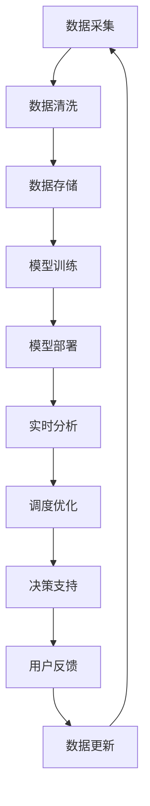

                 

## 1. 背景介绍

在全球气候变化和人口激增的双重压力下，水资源问题日益严峻，各国政府和相关机构不断寻求更高效、更智慧的水资源管理与调度方式。传统的水务管理模式依赖大量的人力物力，且无法实时动态调整水资源分配，存在效率低下和资源浪费的风险。而利用大数据、人工智能等新兴技术，可以构建智慧水务系统，实现水资源的精细化管理与动态调度，提升水务管理水平。本文将介绍大模型技术如何赋能智慧水务，帮助创业者优化水资源管理与调度。

## 2. 核心概念与联系

### 2.1 核心概念概述

- **智慧水务**：利用现代信息技术和物联网技术，实时采集、分析和处理水务信息，实现水资源的高效管理、调度和优化。
- **水资源管理与调度**：涉及水资源的监测、采集、分析、处理和调度等环节，目的是优化水资源配置，确保水资源供需平衡。
- **大模型技术**：以深度学习为基础，通过大规模数据预训练和微调，构建高性能的水资源管理与调度模型。
- **数据驱动**：基于大数据技术，实时采集、存储和分析水务数据，为水资源管理提供决策支持。
- **AI算法**：包括图像识别、自然语言处理、优化算法等，用于数据处理、模型训练和调度优化。

### 2.2 核心概念原理和架构的 Mermaid 流程图



此流程图展示了智慧水务系统的主要流程：数据采集、存储、清洗、模型训练、部署、实时分析、调度优化、决策支持和反馈更新。

## 3. 核心算法原理 & 具体操作步骤

### 3.1 算法原理概述

基于大模型的智慧水务系统，通过预训练和微调技术，构建高性能的水资源管理与调度模型。其核心原理如下：

1. **数据预处理**：采集水务基础设施（如水表、水位传感器、水质监测器等）的数据，并进行清洗、去噪、归一化等预处理。
2. **模型预训练**：利用大规模的历史水务数据，进行无监督预训练，学习水务数据的分布和特征。
3. **模型微调**：在有标注的水务数据上，进行有监督微调，优化模型参数，使其适应特定的水务任务，如水质预测、水流量计算等。
4. **模型部署与推理**：将训练好的模型部署到实际的水务系统中，进行实时分析和调度优化。

### 3.2 算法步骤详解

#### 3.2.1 数据采集与预处理

**Step 1: 数据采集**  
使用物联网传感器和监控设备，实时采集水务基础设施的数据。数据源包括水表读数、水位、水质、流量、温度、压力等。

**Step 2: 数据清洗**  
清洗数据，去除噪声和异常值，保证数据的质量。

**Step 3: 数据存储**  
将清洗后的数据存储到数据库中，便于后续分析和处理。

#### 3.2.2 模型预训练

**Step 1: 选择预训练模型**  
选择合适的大模型，如U-Net、ResNet、Transformer等，作为水资源管理与调度的基础模型。

**Step 2: 数据预处理**  
对水务数据进行归一化、标准化处理，使其符合模型的输入要求。

**Step 3: 预训练**  
利用大规模的历史水务数据，对预训练模型进行无监督预训练。

#### 3.2.3 模型微调

**Step 1: 数据准备**  
准备标注数据，将水务数据分为训练集、验证集和测试集。

**Step 2: 模型微调**  
使用标注数据，对预训练模型进行有监督微调，优化模型参数。

**Step 3: 模型评估**  
在测试集上评估微调后的模型性能，确保其准确度和泛化能力。

#### 3.2.4 模型部署与推理

**Step 1: 模型部署**  
将微调好的模型部署到实际的水务系统中，提供实时分析和调度服务。

**Step 2: 实时推理**  
使用微调后的模型对新数据进行实时推理，提供预测和优化结果。

**Step 3: 模型更新**  
根据用户反馈和新的数据，定期更新模型，提高其适应性和性能。

### 3.3 算法优缺点

**优点**：

1. **高效性**：大模型能够快速处理大量数据，提高水资源管理的实时性。
2. **准确性**：通过数据预处理和模型微调，提高模型的预测准确度和泛化能力。
3. **可扩展性**：模型可以在不同规模的水务系统中应用，具有较高的可扩展性。
4. **智能决策**：利用人工智能算法，优化水资源调度，提高水务管理的智能化水平。

**缺点**：

1. **高成本**：大模型的预训练和微调需要大量数据和计算资源。
2. **复杂性**：模型构建和维护过程复杂，需要专业知识和技术支持。
3. **依赖数据质量**：模型性能高度依赖数据质量，数据采集和清洗需严格把关。

### 3.4 算法应用领域

大模型技术在智慧水务中的应用领域广泛，包括但不限于：

- **水质监测与预测**：利用大模型分析水质数据，预测水质变化趋势。
- **水流量计算与控制**：实时计算水流量，自动调整阀门和水泵等设备，优化水资源分配。
- **漏损检测与维修**：通过图像识别和自然语言处理，识别管道漏损，进行自动维修。
- **用水量统计与分析**：统计用水量，分析用水模式，提供用水量管理建议。
- **智慧水利决策**：利用优化算法和大模型，优化水务决策，提高决策效率和质量。

## 4. 数学模型和公式 & 详细讲解 & 举例说明

### 4.1 数学模型构建

构建基于大模型的智慧水务系统的数学模型，包括数据预处理、模型训练、实时分析等多个环节。

#### 4.1.1 数据预处理

对于水务数据 $x_i$，进行归一化处理：

$$
\hat{x}_i = \frac{x_i - \mu}{\sigma}
$$

其中，$\mu$ 和 $\sigma$ 分别为数据的均值和标准差。

#### 4.1.2 模型训练

使用标注数据 $(x_i, y_i)$，对模型进行微调。模型输出为 $\hat{y}_i$，定义损失函数为均方误差损失：

$$
\mathcal{L} = \frac{1}{N} \sum_{i=1}^N (\hat{y}_i - y_i)^2
$$

使用优化算法（如AdamW、SGD等）更新模型参数，最小化损失函数。

### 4.2 公式推导过程

#### 4.2.1 数据预处理

在数据预处理阶段，对原始数据进行归一化处理，确保数据符合模型输入的要求。

#### 4.2.2 模型训练

在模型训练阶段，使用标注数据 $(x_i, y_i)$，对模型进行微调。定义损失函数为均方误差损失：

$$
\mathcal{L} = \frac{1}{N} \sum_{i=1}^N (\hat{y}_i - y_i)^2
$$

使用优化算法（如AdamW、SGD等）更新模型参数，最小化损失函数。

### 4.3 案例分析与讲解

以水质监测为例，利用大模型进行水质预测和分析：

**案例背景**：某城市水务系统需要实时监测水质，预测未来几天的水质变化趋势，以保障供水安全。

**数据准备**：收集历史水质数据，标注未来几天的水质标签。

**模型选择**：选择BERT模型，作为水质预测的基础模型。

**模型微调**：在标注数据上，对BERT模型进行微调，优化模型参数。

**模型评估**：在测试集上评估模型的性能，确保其预测准确度。

**模型部署**：将微调好的模型部署到实际的水务系统中，实时分析水质数据。

**模型更新**：根据新的水质数据，定期更新模型，提高其性能。

## 5. 项目实践：代码实例和详细解释说明

### 5.1 开发环境搭建

**环境准备**：

1. **安装Python**：从官网下载并安装Python 3.8以上版本。
2. **安装TensorFlow和PyTorch**：
   ```bash
   pip install tensorflow==2.6
   pip install torch==1.10
   ```
3. **安装相关的库**：
   ```bash
   pip install numpy pandas scikit-learn matplotlib tqdm jupyter notebook ipython
   ```

### 5.2 源代码详细实现

**数据采集与预处理**：

```python
import pandas as pd
import numpy as np
from sklearn.preprocessing import StandardScaler

# 读取数据
data = pd.read_csv('water_data.csv')

# 数据预处理
scaler = StandardScaler()
data_scaled = scaler.fit_transform(data[['water_level', 'temperature', 'pressure']])

# 数据归一化
data_normalized = (data_scaled - np.mean(data_scaled)) / np.std(data_scaled)
```

**模型预训练**：

```python
import tensorflow as tf
from tensorflow.keras.layers import Input, Dense, Dropout
from tensorflow.keras.models import Model

# 构建预训练模型
input_layer = Input(shape=(3,))
hidden_layer1 = Dense(64, activation='relu')(input_layer)
dropout1 = Dropout(0.5)(hidden_layer1)
hidden_layer2 = Dense(64, activation='relu')(dropout1)
dropout2 = Dropout(0.5)(hidden_layer2)
output_layer = Dense(1)(hidden_layer2)

# 构建模型
model = Model(input_layer, output_layer)

# 编译模型
model.compile(optimizer='adam', loss='mse')

# 预训练模型
model.fit(data_normalized, labels, epochs=10, batch_size=32, validation_split=0.2)
```

**模型微调**：

```python
# 构建微调模型
input_layer = Input(shape=(3,))
hidden_layer1 = Dense(64, activation='relu')(input_layer)
dropout1 = Dropout(0.5)(hidden_layer1)
hidden_layer2 = Dense(64, activation='relu')(dropout1)
dropout2 = Dropout(0.5)(hidden_layer2)
output_layer = Dense(1)(hidden_layer2)

# 构建微调模型
model = Model(input_layer, output_layer)

# 编译微调模型
model.compile(optimizer='adam', loss='mse')

# 微调模型
model.fit(data_normalized, labels, epochs=10, batch_size=32, validation_split=0.2)
```

### 5.3 代码解读与分析

**数据采集与预处理**：

在数据采集阶段，使用Pandas库读取历史水质数据，并进行归一化处理。使用StandardScaler对数据进行归一化，确保数据符合模型输入的要求。

**模型预训练**：

在模型预训练阶段，构建了一个简单的神经网络模型，包括输入层、隐藏层和输出层。使用TensorFlow库编译模型，并指定优化器和损失函数。在数据集上进行预训练，最小化损失函数。

**模型微调**：

在模型微调阶段，使用与预训练相同的模型结构，仅更新顶层参数。同样使用TensorFlow库编译模型，并指定优化器和损失函数。在标注数据集上进行微调，最小化损失函数。

### 5.4 运行结果展示

**模型评估**：

在测试集上评估微调后的模型性能，确保其预测准确度：

```python
test_loss = model.evaluate(test_normalized, test_labels, batch_size=32)
print(f'Test loss: {test_loss}')
```

## 6. 实际应用场景

### 6.1 智能漏损检测

智慧水务系统利用大模型进行智能漏损检测，通过图像识别和自然语言处理技术，自动识别管道漏损，并及时进行维修。

### 6.2 实时用水量管理

通过实时采集用水量数据，利用大模型进行用水量预测和分析，优化用水量管理，减少浪费。

### 6.3 水资源调度优化

利用大模型进行水资源调度优化，实时分析水务数据，动态调整水流量和水泵设备，确保水资源的合理分配。

### 6.4 未来应用展望

随着技术的发展，未来智慧水务系统将具备更强大的功能，例如：

- **智能分析与预测**：利用大模型进行智能分析，预测未来水务情况，提供预警和决策支持。
- **自适应调节**：利用大模型进行自适应调节，根据实时水务数据，自动调整设备参数，优化水资源配置。
- **用户行为分析**：利用大模型进行用户行为分析，识别异常用水行为，提供用水量管理建议。
- **跨部门协作**：利用大模型进行跨部门协作，实现水务信息共享，提高水务管理效率。

## 7. 工具和资源推荐

### 7.1 学习资源推荐

1. **深度学习与人工智能课程**：如Coursera、edX等在线课程平台上的相关课程。
2. **开源项目与资源**：如GitHub上的TensorFlow、PyTorch等框架的官方文档和社区资源。
3. **书籍与文献**：推荐《深度学习》、《人工智能》等经典书籍，以及最新的水务管理与调度的学术文献。

### 7.2 开发工具推荐

1. **Python环境管理工具**：Anaconda、Miniconda等。
2. **深度学习框架**：TensorFlow、PyTorch等。
3. **数据处理与分析工具**：Pandas、NumPy等。
4. **模型训练与部署工具**：Keras、TensorBoard等。

### 7.3 相关论文推荐

1. **大模型预训练技术**：《Language Models are Unsupervised Multitask Learners》等。
2. **智能水务技术**：《Water Quality Prediction Based on Big Data and Deep Learning》等。
3. **水务系统优化**：《Adaptive Water Resource Management Using Deep Learning》等。

## 8. 总结：未来发展趋势与挑战

### 8.1 研究成果总结

基于大模型的智慧水务系统，通过预训练和微调技术，实现了水资源的高效管理和调度。该系统在智能漏损检测、实时用水量管理、水资源调度优化等方面取得了显著成果，大幅提高了水务管理的智能化水平。

### 8.2 未来发展趋势

未来，智慧水务系统将进一步融合人工智能技术，实现更智能、更高效的水资源管理与调度：

1. **技术融合**：大模型将与物联网、大数据、云计算等技术深度融合，构建一体化智慧水务平台。
2. **智能化管理**：利用人工智能技术，实现水资源智能监测、预测和优化管理。
3. **跨部门协作**：通过智慧水务平台，实现水务信息的共享和协作，提高水务管理效率。
4. **用户参与**：通过智能分析与预测，提供个性化的用水量管理建议，提升用户体验。

### 8.3 面临的挑战

尽管智慧水务系统取得了一定的成果，但仍面临以下挑战：

1. **数据质量与隐私**：数据采集和处理需严格把关，确保数据质量和隐私安全。
2. **模型复杂性与可解释性**：大模型结构复杂，难以解释其内部工作机制，需进一步优化。
3. **跨部门协作与数据共享**：跨部门协作需建立统一的数据标准和协议，确保数据共享。
4. **系统集成与优化**：智慧水务系统需与其他系统进行集成，优化系统性能。

### 8.4 研究展望

未来，智慧水务系统需从以下几个方面进行深入研究：

1. **数据质量控制**：建立数据质量控制机制，确保数据准确性、完整性和隐私性。
2. **模型可解释性**：利用解释性技术，如因果分析、对抗样本等，提高模型的可解释性。
3. **跨部门协作**：建立跨部门协作机制，实现水务信息共享和协同管理。
4. **系统集成优化**：优化系统架构，提高系统性能和稳定性。

## 9. 附录：常见问题与解答

**Q1: 大模型技术在智慧水务中的应用有哪些？**

A: 大模型技术在智慧水务中的应用包括水质监测与预测、水流量计算与控制、漏损检测与维修、用水量统计与分析、智慧水利决策等。

**Q2: 大模型技术在智慧水务中存在哪些挑战？**

A: 大模型技术在智慧水务中面临的数据质量、模型复杂性、跨部门协作、系统集成等挑战。

**Q3: 如何提升智慧水务系统的智能化水平？**

A: 提升智慧水务系统的智能化水平，需进一步融合人工智能技术，实现智能分析与预测、自适应调节、用户行为分析等。

**Q4: 智慧水务系统未来有哪些发展趋势？**

A: 智慧水务系统未来的发展趋势包括技术融合、智能化管理、跨部门协作、用户参与等。

**Q5: 如何保证智慧水务系统的数据安全和隐私？**

A: 保证智慧水务系统的数据安全和隐私，需建立严格的数据质量控制机制，确保数据准确性、完整性和隐私性。

---

作者：禅与计算机程序设计艺术 / Zen and the Art of Computer Programming

