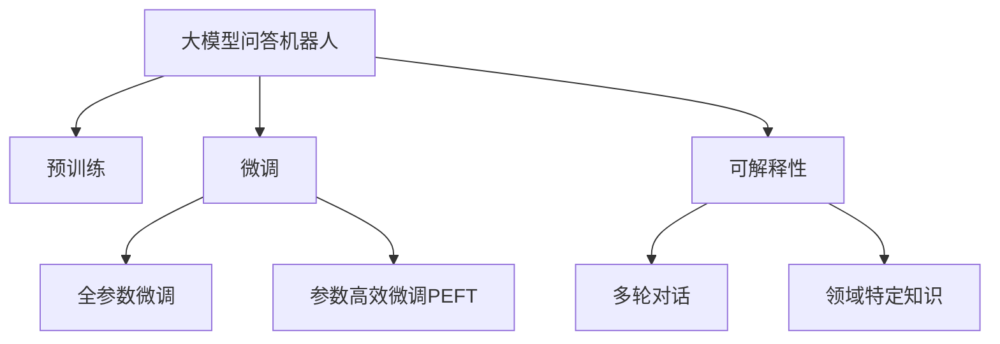

                 

# 大模型问答机器人的智能化交互

## 1. 背景介绍

近年来，随着人工智能技术的迅猛发展，自然语言处理（Natural Language Processing, NLP）和问答系统（Question Answering, QA）的应用越来越广泛，从智能客服、虚拟助手到医疗咨询、教育辅导，问答机器人（QA robots）在各行各业中发挥着越来越重要的作用。传统基于规则和模板的问答系统在复杂多变的实际应用中显得力不从心，而基于深度学习的大模型问答系统逐渐成为主流。

### 1.1 问题由来
现代大模型问答系统往往以大规模预训练语言模型为基础，通过微调等方式适应特定的问答任务。然而，这些大模型通常是通用模型，没有经过特定领域的知识训练，因此在处理领域特定的问答任务时，效果不尽如人意。此外，预训练语言模型需要大量的计算资源，这对于中小型企业和初创公司来说是一个巨大的负担。

### 1.2 问题核心关键点
大模型问答机器人需要在实际应用中具备以下关键特性：
- **高效性**：在有限计算资源下，快速响应用户查询。
- **准确性**：提供准确的回答，避免错误信息。
- **可解释性**：解释回答的依据，增强用户信任。
- **可定制性**：适应特定领域的问答需求，提升回答质量。
- **智能交互**：支持多轮对话，提供更自然的交互体验。

本文将聚焦于如何通过智能化交互，提升大模型问答机器人的性能和用户体验。

## 2. 核心概念与联系

### 2.1 核心概念概述

为更好地理解大模型问答机器人的智能化交互，本节将介绍几个密切相关的核心概念：

- **大模型问答机器人**：基于深度学习的大规模预训练语言模型，通过微调等方式适应特定问答任务，提供高效、准确、可解释的回答。
- **预训练**：指在大量无标签文本数据上，通过自监督学习任务训练通用语言模型的过程。预训练使得模型学习到语言的通用表示。
- **微调**：指在预训练模型的基础上，使用下游任务的少量标注数据，通过有监督学习优化模型在特定任务上的性能。
- **可解释性**：指模型的回答能够提供依据，用户能够理解模型的推理过程和决策逻辑。
- **交互式问答**：指问答系统支持多轮对话，能够理解上下文，提供连贯的回答。
- **领域特定知识**：指针对特定领域的知识库和规则，通过预训练和微调引入，提高模型的回答质量。

这些核心概念之间的逻辑关系可以通过以下Mermaid流程图来展示：



这个流程图展示了大模型问答机器人的核心概念及其之间的关系：

1. 大模型问答机器人通过预训练获得基础能力。
2. 微调是对预训练模型进行任务特定的优化，可以分为全参数微调和参数高效微调（PEFT）。
3. 可解释性能够使用户理解模型的决策过程。
4. 交互式问答使得系统能够处理多轮对话，提供连贯的回答。
5. 领域特定知识通过预训练和微调引入，提升回答质量。

## 3. 核心算法原理 & 具体操作步骤

### 3.1 算法原理概述

大模型问答机器人的智能化交互核心在于如何提升回答的准确性和可解释性，同时提供多轮对话支持。

- **回答准确性**：通过微调，让模型能够从特定领域的知识库中学习，提高回答的准确性。
- **回答可解释性**：通过可解释性模块，解释模型的推理过程和决策依据。
- **多轮对话**：通过上下文管理模块，保存对话历史，支持多轮对话交互。

### 3.2 算法步骤详解

基于智能化交互的大模型问答机器人，其微调和优化流程一般包括以下几个关键步骤：

**Step 1: 准备预训练模型和数据集**
- 选择合适的预训练语言模型，如BERT、GPT等。
- 准备问答任务的数据集，包括问题和答案。

**Step 2: 添加任务适配层**
- 根据问答任务类型，在预训练模型顶层设计合适的输出层和损失函数。
- 对于分类任务，通常在顶层添加分类器，使用交叉熵损失函数。
- 对于生成任务，通常使用语言模型的解码器输出概率分布，并以负对数似然为损失函数。

**Step 3: 设置微调超参数**
- 选择合适的优化算法及其参数，如AdamW、SGD等，设置学习率、批大小、迭代轮数等。
- 设置正则化技术及强度，包括权重衰减、Dropout、Early Stopping等。
- 确定冻结预训练参数的策略，如仅微调顶层，或全部参数都参与微调。

**Step 4: 执行梯度训练**
- 将训练集数据分批次输入模型，前向传播计算损失函数。
- 反向传播计算参数梯度，根据设定的优化算法和学习率更新模型参数。
- 周期性在验证集上评估模型性能，根据性能指标决定是否触发 Early Stopping。
- 重复上述步骤直到满足预设的迭代轮数或 Early Stopping 条件。

**Step 5: 测试和部署**
- 在测试集上评估微调后模型的效果，对比微调前后的精度提升。
- 使用微调后的模型对新样本进行推理预测，集成到实际的应用系统中。
- 持续收集新的数据，定期重新微调模型，以适应数据分布的变化。

### 3.3 算法优缺点

基于智能化交互的大模型问答机器人具有以下优点：
1. 结合领域特定知识，能够快速响应领域内的复杂问题。
2. 可解释性使得用户能够理解和信任模型的回答。
3. 多轮对话支持提供了更加自然流畅的交互体验。
4. 参数高效微调技术在固定大部分预训练参数的情况下，仍能取得不错的提升。

同时，该方法也存在一定的局限性：
1. 依赖高质量标注数据。微调的效果很大程度上取决于标注数据的质量和数量，获取高质量标注数据的成本较高。
2. 迁移能力有限。当目标任务与预训练数据的分布差异较大时，微调的性能提升有限。
3. 可解释性不足。尽管可解释性模块提升了回答的可理解性，但仍可能存在模型内部推理过程难以解释的情况。
4. 对话流畅度问题。多轮对话系统在处理复杂上下文时，容易出现对话不连贯或断层。

尽管存在这些局限性，但就目前而言，基于智能化交互的微调方法仍是问答机器人应用的主流范式。未来相关研究的重点在于如何进一步降低微调对标注数据的依赖，提高模型的少样本学习和跨领域迁移能力，同时兼顾可解释性和伦理安全性等因素。

### 3.4 算法应用领域

基于大模型问答机器人的智能化交互方法，已经在医疗咨询、教育辅导、智能客服等多个领域得到了广泛应用，为这些行业带来了新的发展机遇。

- **医疗咨询**：通过医生问答机器人，提供快速、准确的医学知识查询和疾病咨询，辅助医生诊疗。
- **教育辅导**：基于智能问答系统，提供个性化学习建议和问题解答，提升教学效果。
- **智能客服**：使用问答机器人处理常见客户问题，提升客户服务效率和满意度。
- **金融理财**：通过智能问答系统，提供金融产品推荐和理财咨询，帮助用户做出更明智的决策。

## 4. 数学模型和公式 & 详细讲解

### 4.1 数学模型构建

本节将使用数学语言对大模型问答机器人的智能化交互过程进行更加严格的刻画。

记问答系统为 $M_{\theta}$，其中 $\theta$ 为模型参数。假设问答任务 $T$ 的训练集为 $D=\{(x_i,y_i)\}_{i=1}^N$，其中 $x_i$ 为问题，$y_i$ 为答案。

定义模型 $M_{\theta}$ 在数据样本 $(x,y)$ 上的损失函数为 $\ell(M_{\theta}(x),y)$，则在数据集 $D$ 上的经验风险为：

$$
\mathcal{L}(\theta) = \frac{1}{N} \sum_{i=1}^N \ell(M_{\theta}(x_i),y_i)
$$

微调的优化目标是最小化经验风险，即找到最优参数：

$$
\theta^* = \mathop{\arg\min}_{\theta} \mathcal{L}(\theta)
$$

在实践中，我们通常使用基于梯度的优化算法（如SGD、Adam等）来近似求解上述最优化问题。设 $\eta$ 为学习率，$\lambda$ 为正则化系数，则参数的更新公式为：

$$
\theta \leftarrow \theta - \eta \nabla_{\theta}\mathcal{L}(\theta) - \eta\lambda\theta
$$

其中 $\nabla_{\theta}\mathcal{L}(\theta)$ 为损失函数对参数 $\theta$ 的梯度，可通过反向传播算法高效计算。

### 4.2 公式推导过程

以下我们以问答分类任务为例，推导交叉熵损失函数及其梯度的计算公式。

假设模型 $M_{\theta}$ 在输入 $x$ 上的输出为 $\hat{y}=M_{\theta}(x) \in [0,1]$，表示样本属于正类的概率。真实标签 $y \in \{0,1\}$。则二分类交叉熵损失函数定义为：

$$
\ell(M_{\theta}(x),y) = -[y\log \hat{y} + (1-y)\log (1-\hat{y})]
$$

将其代入经验风险公式，得：

$$
\mathcal{L}(\theta) = -\frac{1}{N}\sum_{i=1}^N [y_i\log M_{\theta}(x_i)+(1-y_i)\log(1-M_{\theta}(x_i))]
$$

根据链式法则，损失函数对参数 $\theta_k$ 的梯度为：

$$
\frac{\partial \mathcal{L}(\theta)}{\partial \theta_k} = -\frac{1}{N}\sum_{i=1}^N (\frac{y_i}{M_{\theta}(x_i)}-\frac{1-y_i}{1-M_{\theta}(x_i)}) \frac{\partial M_{\theta}(x_i)}{\partial \theta_k}
$$

其中 $\frac{\partial M_{\theta}(x_i)}{\partial \theta_k}$ 可进一步递归展开，利用自动微分技术完成计算。

在得到损失函数的梯度后，即可带入参数更新公式，完成模型的迭代优化。重复上述过程直至收敛，最终得到适应下游任务的最优模型参数 $\theta^*$。

## 5. 项目实践：代码实例和详细解释说明

### 5.1 开发环境搭建

在进行问答机器人智能化交互实践前，我们需要准备好开发环境。以下是使用Python进行PyTorch开发的环境配置流程：

1. 安装Anaconda：从官网下载并安装Anaconda，用于创建独立的Python环境。

2. 创建并激活虚拟环境：
```bash
conda create -n pytorch-env python=3.8 
conda activate pytorch-env
```

3. 安装PyTorch：根据CUDA版本，从官网获取对应的安装命令。例如：
```bash
conda install pytorch torchvision torchaudio cudatoolkit=11.1 -c pytorch -c conda-forge
```

4. 安装Transformers库：
```bash
pip install transformers
```

5. 安装各类工具包：
```bash
pip install numpy pandas scikit-learn matplotlib tqdm jupyter notebook ipython
```

完成上述步骤后，即可在`pytorch-env`环境中开始问答机器人的智能化交互实践。

### 5.2 源代码详细实现

下面我们以问答分类任务为例，给出使用Transformers库对BERT模型进行智能化交互的PyTorch代码实现。

首先，定义问答分类任务的数据处理函数：

```python
from transformers import BertTokenizer
from torch.utils.data import Dataset
import torch

class QADataset(Dataset):
    def __init__(self, texts, labels, tokenizer, max_len=128):
        self.texts = texts
        self.labels = labels
        self.tokenizer = tokenizer
        self.max_len = max_len
        
    def __len__(self):
        return len(self.texts)
    
    def __getitem__(self, item):
        text = self.texts[item]
        label = self.labels[item]
        
        encoding = self.tokenizer(text, return_tensors='pt', max_length=self.max_len, padding='max_length', truncation=True)
        input_ids = encoding['input_ids'][0]
        attention_mask = encoding['attention_mask'][0]
        
        # 对label进行编码
        encoded_label = [1 if label==1 else 0]
        encoded_label.extend([0] * (self.max_len - len(encoded_label)))
        labels = torch.tensor(encoded_label, dtype=torch.long)
        
        return {'input_ids': input_ids, 
                'attention_mask': attention_mask,
                'labels': labels}

# 定义label与id的映射
label2id = {1: 0, 0: 1}

# 创建dataset
tokenizer = BertTokenizer.from_pretrained('bert-base-cased')

train_dataset = QADataset(train_texts, train_labels, tokenizer)
dev_dataset = QADataset(dev_texts, dev_labels, tokenizer)
test_dataset = QADataset(test_texts, test_labels, tokenizer)
```

然后，定义模型和优化器：

```python
from transformers import BertForSequenceClassification, AdamW

model = BertForSequenceClassification.from_pretrained('bert-base-cased', num_labels=2)

optimizer = AdamW(model.parameters(), lr=2e-5)
```

接着，定义训练和评估函数：

```python
from torch.utils.data import DataLoader
from tqdm import tqdm
from sklearn.metrics import accuracy_score

device = torch.device('cuda') if torch.cuda.is_available() else torch.device('cpu')
model.to(device)

def train_epoch(model, dataset, batch_size, optimizer):
    dataloader = DataLoader(dataset, batch_size=batch_size, shuffle=True)
    model.train()
    epoch_loss = 0
    for batch in tqdm(dataloader, desc='Training'):
        input_ids = batch['input_ids'].to(device)
        attention_mask = batch['attention_mask'].to(device)
        labels = batch['labels'].to(device)
        model.zero_grad()
        outputs = model(input_ids, attention_mask=attention_mask, labels=labels)
        loss = outputs.loss
        epoch_loss += loss.item()
        loss.backward()
        optimizer.step()
    return epoch_loss / len(dataloader)

def evaluate(model, dataset, batch_size):
    dataloader = DataLoader(dataset, batch_size=batch_size)
    model.eval()
    preds, labels = [], []
    with torch.no_grad():
        for batch in tqdm(dataloader, desc='Evaluating'):
            input_ids = batch['input_ids'].to(device)
            attention_mask = batch['attention_mask'].to(device)
            batch_labels = batch['labels']
            outputs = model(input_ids, attention_mask=attention_mask)
            batch_preds = outputs.logits.argmax(dim=1).to('cpu').tolist()
            batch_labels = batch_labels.to('cpu').tolist()
            for pred, label in zip(batch_preds, batch_labels):
                preds.append(int(pred))
                labels.append(int(label))
                
    print("Accuracy: ", accuracy_score(labels, preds))
```

最后，启动训练流程并在测试集上评估：

```python
epochs = 5
batch_size = 16

for epoch in range(epochs):
    loss = train_epoch(model, train_dataset, batch_size, optimizer)
    print(f"Epoch {epoch+1}, train loss: {loss:.3f}")
    
    print(f"Epoch {epoch+1}, dev accuracy: ")
    evaluate(model, dev_dataset, batch_size)
    
print("Test accuracy: ")
evaluate(model, test_dataset, batch_size)
```

以上就是使用PyTorch对BERT进行问答分类任务智能化交互的完整代码实现。可以看到，得益于Transformers库的强大封装，我们可以用相对简洁的代码完成BERT模型的加载和微调。

### 5.3 代码解读与分析

让我们再详细解读一下关键代码的实现细节：

**QADataset类**：
- `__init__`方法：初始化文本、标签、分词器等关键组件。
- `__len__`方法：返回数据集的样本数量。
- `__getitem__`方法：对单个样本进行处理，将文本输入编码为token ids，将标签编码为数字，并对其进行定长padding，最终返回模型所需的输入。

**label2id字典**：
- 定义了标签与数字id之间的映射关系，用于将token-wise的预测结果解码回真实的标签。

**训练和评估函数**：
- 使用PyTorch的DataLoader对数据集进行批次化加载，供模型训练和推理使用。
- 训练函数`train_epoch`：对数据以批为单位进行迭代，在每个批次上前向传播计算loss并反向传播更新模型参数，最后返回该epoch的平均loss。
- 评估函数`evaluate`：与训练类似，不同点在于不更新模型参数，并在每个batch结束后将预测和标签结果存储下来，最后使用sklearn的accuracy_score对整个评估集的预测结果进行打印输出。

**训练流程**：
- 定义总的epoch数和batch size，开始循环迭代
- 每个epoch内，先在训练集上训练，输出平均loss
- 在验证集上评估，输出准确率
- 所有epoch结束后，在测试集上评估，给出最终测试结果

可以看到，PyTorch配合Transformers库使得BERT微调的代码实现变得简洁高效。开发者可以将更多精力放在数据处理、模型改进等高层逻辑上，而不必过多关注底层的实现细节。

当然，工业级的系统实现还需考虑更多因素，如模型的保存和部署、超参数的自动搜索、更灵活的任务适配层等。但核心的智能化交互范式基本与此类似。

## 6. 实际应用场景

### 6.1 智能客服系统

基于大模型问答机器人的智能化交互技术，可以广泛应用于智能客服系统的构建。传统客服往往需要配备大量人力，高峰期响应缓慢，且一致性和专业性难以保证。而使用问答机器人，可以7x24小时不间断服务，快速响应客户咨询，用自然流畅的语言解答各类常见问题。

在技术实现上，可以收集企业内部的历史客服对话记录，将问题和最佳答复构建成监督数据，在此基础上对预训练问答模型进行智能化交互微调。微调后的问答系统能够自动理解用户意图，匹配最合适的答案模板进行回复。对于客户提出的新问题，还可以接入检索系统实时搜索相关内容，动态组织生成回答。如此构建的智能客服系统，能大幅提升客户咨询体验和问题解决效率。

### 6.2 金融舆情监测

金融机构需要实时监测市场舆论动向，以便及时应对负面信息传播，规避金融风险。传统的人工监测方式成本高、效率低，难以应对网络时代海量信息爆发的挑战。基于大模型问答机器人的智能化交互技术，为金融舆情监测提供了新的解决方案。

具体而言，可以收集金融领域相关的新闻、报道、评论等文本数据，并对其进行主题标注和情感标注。在此基础上对预训练语言模型进行微调，使其能够自动判断文本属于何种主题，情感倾向是正面、中性还是负面。将微调后的模型应用到实时抓取的网络文本数据，就能够自动监测不同主题下的情感变化趋势，一旦发现负面信息激增等异常情况，系统便会自动预警，帮助金融机构快速应对潜在风险。

### 6.3 个性化推荐系统

当前的推荐系统往往只依赖用户的历史行为数据进行物品推荐，无法深入理解用户的真实兴趣偏好。基于大模型问答机器人的智能化交互技术，个性化推荐系统可以更好地挖掘用户行为背后的语义信息，从而提供更精准、多样的推荐内容。

在实践中，可以收集用户浏览、点击、评论、分享等行为数据，提取和用户交互的物品标题、描述、标签等文本内容。将文本内容作为模型输入，用户的后续行为（如是否点击、购买等）作为监督信号，在此基础上微调预训练语言模型。微调后的模型能够从文本内容中准确把握用户的兴趣点。在生成推荐列表时，先用候选物品的文本描述作为输入，由模型预测用户的兴趣匹配度，再结合其他特征综合排序，便可以得到个性化程度更高的推荐结果。

### 6.4 未来应用展望

随着大模型问答机器人的智能化交互技术不断发展，其应用场景将不断扩展，带来更多创新应用。

在智慧医疗领域，基于问答机器人，构建医学知识查询、疾病咨询、健康管理等应用，为患者提供快速、准确的健康信息服务。

在智能教育领域，基于问答机器人，构建智能答疑、作业批改、个性化学习推荐等功能，提升教学效果和学习体验。

在智慧城市治理中，基于问答机器人，构建城市事件监测、舆情分析、应急指挥等功能，提高城市管理的自动化和智能化水平，构建更安全、高效的未来城市。

此外，在企业生产、社会治理、文娱传媒等众多领域，基于问答机器人的人工智能应用也将不断涌现，为NLP技术带来新的突破。相信随着预训练语言模型和智能化交互技术的持续演进，问答机器人在构建人机协同的智能时代中扮演越来越重要的角色。

## 7. 工具和资源推荐
### 7.1 学习资源推荐

为了帮助开发者系统掌握大模型问答机器人的智能化交互理论基础和实践技巧，这里推荐一些优质的学习资源：

1. 《Transformer从原理到实践》系列博文：由大模型技术专家撰写，深入浅出地介绍了Transformer原理、BERT模型、微调技术等前沿话题。

2. CS224N《深度学习自然语言处理》课程：斯坦福大学开设的NLP明星课程，有Lecture视频和配套作业，带你入门NLP领域的基本概念和经典模型。

3. 《Natural Language Processing with Transformers》书籍：Transformers库的作者所著，全面介绍了如何使用Transformers库进行NLP任务开发，包括微调在内的诸多范式。

4. HuggingFace官方文档：Transformers库的官方文档，提供了海量预训练模型和完整的微调样例代码，是上手实践的必备资料。

5. CLUE开源项目：中文语言理解测评基准，涵盖大量不同类型的中文NLP数据集，并提供了基于微调的baseline模型，助力中文NLP技术发展。

通过对这些资源的学习实践，相信你一定能够快速掌握大模型问答机器人的智能化交互精髓，并用于解决实际的NLP问题。
###  7.2 开发工具推荐

高效的开发离不开优秀的工具支持。以下是几款用于问答机器人智能化交互开发的常用工具：

1. PyTorch：基于Python的开源深度学习框架，灵活动态的计算图，适合快速迭代研究。大部分预训练语言模型都有PyTorch版本的实现。

2. TensorFlow：由Google主导开发的开源深度学习框架，生产部署方便，适合大规模工程应用。同样有丰富的预训练语言模型资源。

3. Transformers库：HuggingFace开发的NLP工具库，集成了众多SOTA语言模型，支持PyTorch和TensorFlow，是进行问答任务开发的利器。

4. Weights & Biases：模型训练的实验跟踪工具，可以记录和可视化模型训练过程中的各项指标，方便对比和调优。与主流深度学习框架无缝集成。

5. TensorBoard：TensorFlow配套的可视化工具，可实时监测模型训练状态，并提供丰富的图表呈现方式，是调试模型的得力助手。

6. Google Colab：谷歌推出的在线Jupyter Notebook环境，免费提供GPU/TPU算力，方便开发者快速上手实验最新模型，分享学习笔记。

合理利用这些工具，可以显著提升大模型问答机器人的智能化交互任务的开发效率，加快创新迭代的步伐。

### 7.3 相关论文推荐

大模型问答机器人智能化交互的发展源于学界的持续研究。以下是几篇奠基性的相关论文，推荐阅读：

1. Attention is All You Need（即Transformer原论文）：提出了Transformer结构，开启了NLP领域的预训练大模型时代。

2. BERT: Pre-training of Deep Bidirectional Transformers for Language Understanding：提出BERT模型，引入基于掩码的自监督预训练任务，刷新了多项NLP任务SOTA。

3. Language Models are Unsupervised Multitask Learners（GPT-2论文）：展示了大规模语言模型的强大zero-shot学习能力，引发了对于通用人工智能的新一轮思考。

4. Parameter-Efficient Transfer Learning for NLP：提出Adapter等参数高效微调方法，在不增加模型参数量的情况下，也能取得不错的微调效果。

5. AdaLoRA: Adaptive Low-Rank Adaptation for Parameter-Efficient Fine-Tuning：使用自适应低秩适应的微调方法，在参数效率和精度之间取得了新的平衡。

6. Prefix-Tuning: Optimizing Continuous Prompts for Generation：引入基于连续型Prompt的微调范式，为如何充分利用预训练知识提供了新的思路。

这些论文代表了大模型问答机器人智能化交互的发展脉络。通过学习这些前沿成果，可以帮助研究者把握学科前进方向，激发更多的创新灵感。

## 8. 总结：未来发展趋势与挑战

### 8.1 总结

本文对基于智能化交互的大模型问答机器人进行了全面系统的介绍。首先阐述了大模型问答机器人智能化交互的研究背景和意义，明确了智能化交互在提升回答准确性和可解释性、支持多轮对话等方面的独特价值。其次，从原理到实践，详细讲解了智能化交互的数学原理和关键步骤，给出了智能化交互任务开发的完整代码实例。同时，本文还广泛探讨了智能化交互方法在智能客服、金融舆情、个性化推荐等多个领域的应用前景，展示了智能化交互范式的巨大潜力。此外，本文精选了智能化交互技术的各类学习资源，力求为开发者提供全方位的技术指引。

通过本文的系统梳理，可以看到，基于智能化交互的大模型问答机器人正在成为NLP领域的重要范式，极大地拓展了预训练语言模型的应用边界，催生了更多的落地场景。得益于大规模语料的预训练，智能问答机器人能够快速响应领域内的复杂问题，提供高效、准确、可解释的回答，为各行各业带来了新的发展机遇。未来，伴随预训练语言模型和智能化交互方法的持续演进，问答机器人必将在构建人机协同的智能时代中扮演越来越重要的角色。

### 8.2 未来发展趋势

展望未来，大模型问答机器人的智能化交互技术将呈现以下几个发展趋势：

1. **领域知识增强**：未来的智能问答系统将更加注重领域知识的引入，通过构建专门领域的知识图谱、规则库等，提升回答的准确性和丰富性。
2. **多模态融合**：智能问答系统将支持图像、语音、视频等多模态数据的输入，实现多模态信息与文本信息的协同建模，提升回答的全面性和多样性。
3. **自适应学习**：智能问答系统将具备更强的自适应能力，能够根据用户的反馈和互动历史，动态调整模型参数，提高回答的个性化和连贯性。
4. **交互式推理**：智能问答系统将支持更加复杂的交互推理任务，能够理解并执行自然语言中的推理指令，提供更深入、全面的回答。
5. **伦理和安全**：智能问答系统将更加注重伦理和安全问题，通过设置隐私保护机制、可信度评估、内容审核等功能，确保回答的合法性和无害性。
6. **实时性和高性能**：智能问答系统将追求更高的实时性和性能，通过分布式训练、模型压缩、推理优化等技术，提升系统的响应速度和计算效率。

以上趋势凸显了大模型问答机器人智能化交互技术的广阔前景。这些方向的探索发展，必将进一步提升问答系统的性能和用户体验，为各行各业带来更高效的解决方案。

### 8.3 面临的挑战

尽管大模型问答机器人智能化交互技术已经取得了显著进展，但在迈向更加智能化、普适化应用的过程中，它仍面临着诸多挑战：

1. **数据隐私和安全**：智能问答系统需要处理大量的用户数据，如何保护用户隐私，避免数据泄露和滥用，是一个重要问题。
2. **模型鲁棒性和泛化能力**：智能问答系统在面对新的或异常情况时，可能会出现回答错误或断层，如何提升模型的鲁棒性和泛化能力，仍是一个需要解决的问题。
3. **复杂对话管理**：多轮对话系统在处理复杂上下文时，容易出现对话不连贯或断层，如何设计更智能的对话管理策略，是一个技术难题。
4. **跨领域适配**：智能问答系统在不同领域应用时，需要重新训练或微调模型，如何实现更高效的跨领域适配，是一个需要解决的问题。
5. **可解释性和透明性**：智能问答系统的回答往往缺乏可解释性，如何增强模型的可解释性和透明性，是提升用户信任的关键。
6. **资源消耗**：大模型问答系统需要大量的计算资源，如何优化模型结构和推理过程，减少资源消耗，是一个需要解决的问题。

这些挑战亟需学术界和工业界共同努力，通过技术创新和应用优化，实现智能问答系统的进一步发展。

### 8.4 研究展望

面对大模型问答机器人智能化交互所面临的挑战，未来的研究需要在以下几个方面寻求新的突破：

1. **自监督预训练**：探索无监督或半监督预训练方法，利用更多的非标注数据，提升模型的泛化能力。
2. **跨领域迁移学习**：研究跨领域迁移学习技术，实现模型在不同领域之间的高效迁移和适配。
3. **动态知识图谱**：构建动态更新的知识图谱，实现领域知识的持续增强和更新。
4. **自适应学习**：研究自适应学习算法，使模型能够根据用户的反馈和互动历史，动态调整参数，提升回答的个性化和连贯性。
5. **交互式推理**：研究交互式推理方法，使模型能够理解并执行自然语言中的推理指令，提供更深入、全面的回答。
6. **多模态融合**：研究多模态信息融合技术，实现图像、语音、视频等多模态数据与文本信息的协同建模，提升回答的全面性和多样性。
7. **伦理和安全**：研究隐私保护和安全机制，确保智能问答系统的回答合法、无害。

这些研究方向的探索，必将引领智能问答系统迈向更高的台阶，为各行各业带来更高效的解决方案。面向未来，智能问答系统需要在智能化交互、领域知识增强、跨领域迁移、自适应学习等方面不断寻求突破，才能真正实现人机协同的智能时代。

## 9. 附录：常见问题与解答

**Q1：大模型问答机器人是否适用于所有NLP任务？**

A: 大模型问答机器人对于文本分类、问答、摘要等任务具有很强的适应性，但针对一些特定领域的任务，如医学、法律等，仍然需要进一步预训练和微调。

**Q2：微调过程中如何选择合适的学习率？**

A: 微调的学习率一般要比预训练时小1-2个数量级，以避免破坏预训练权重。一般建议从1e-5开始调参，逐步减小学习率，直至收敛。也可以使用warmup策略，在开始阶段使用较小的学习率，再逐渐过渡到预设值。

**Q3：采用大模型问答机器人时需要注意哪些问题？**

A: 在落地部署问答机器人时，需要注意以下问题：
1. 数据隐私和安全：保护用户隐私，避免数据泄露和滥用。
2. 模型鲁棒性：提升模型的鲁棒性和泛化能力，避免断层和错误。
3. 对话管理：设计更智能的对话管理策略，确保对话连贯性和一致性。
4. 跨领域适配：实现更高效的跨领域适配，提升回答准确性。
5. 可解释性和透明性：增强模型的可解释性和透明性，提升用户信任。
6. 资源消耗：优化模型结构和推理过程，减少资源消耗。

**Q4：如何缓解微调过程中的过拟合问题？**

A: 缓解微调过程中的过拟合问题，可以采取以下策略：
1. 数据增强：通过回译、近义替换等方式扩充训练集。
2. 正则化：使用L2正则、Dropout、Early Stopping等避免过拟合。
3. 对抗训练：引入对抗样本，提高模型鲁棒性。
4. 参数高效微调：只调整少量参数，减小过拟合风险。

这些策略需要根据具体任务和数据特点进行灵活组合，以达到最佳效果。

**Q5：如何评估问答机器人的性能？**

A: 评估问答机器人性能通常使用准确率、召回率、F1-score等指标。同时，还需要考虑回答的可解释性和连贯性。可以通过用户满意度调查、专家评审等方式综合评估系统的性能。

---

作者：禅与计算机程序设计艺术 / Zen and the Art of Computer Programming

