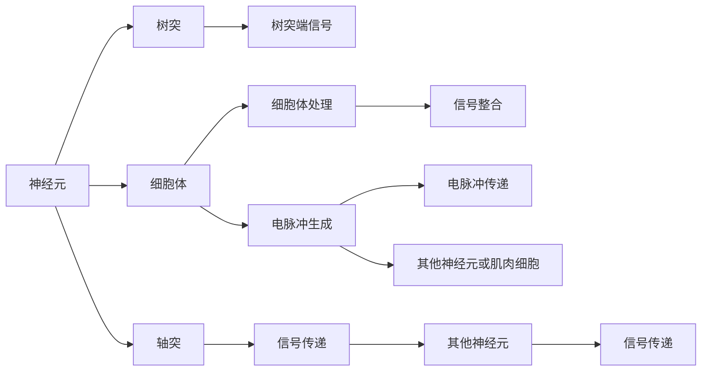

                 

# 大脑的有机化合物与神经元

> 关键词：神经元、有机化合物、突触、神经递质、兴奋性、抑制性、神经网络、认知过程、信号传递、神经传递素、神经调制、认知科学研究

## 1. 背景介绍

### 1.1 问题由来

人类大脑是一个极其复杂的器官，负责处理、存储、传输信息，以及控制行为和感知。大脑的这些功能是通过高度复杂的化学和电气信号系统实现的，其中包括数以亿计的神经元。神经元之间的信号传递主要依赖于一种称为神经递质的化学物质。了解这些有机化合物的工作原理，对于理解大脑的神经网络及其运作机制至关重要。

### 1.2 问题核心关键点

- **神经元**：构成大脑的基本功能单位，通过电信号传递信息。
- **有机化合物**：如神经递质，在神经元间传递信息时发挥关键作用。
- **突触**：神经元之间的连接点，信息传递的中心。
- **神经传递素**：信号分子，在神经元间传递信号。
- **兴奋性**与**抑制性**：影响神经元激活状态的两类信号。
- **神经网络**：神经元以特定方式连接形成的网络结构。
- **认知过程**：包括记忆、学习、思考等，由神经网络实现。

## 2. 核心概念与联系

### 2.1 核心概念概述

神经元是大脑的基本功能单位，它们通过电信号传递信息。每个神经元都有树突（接受信号的端部）、细胞体（整合信号的中央部分）和轴突（输出信号的延长部分）。当信号在树突端被接收时，信号被传递到细胞体进行处理和整合。如果信号强度超过某个阈值，细胞体就会生成电脉冲，沿着轴突传递给其他神经元或肌肉细胞，从而引发响应。

有机化合物在神经元间信息传递中起着至关重要的作用。其中最为关键的是神经递质，它们通过突触间隙传递信号。突触是神经元间的连接点，信息传递的中心，分为兴奋性突触和抑制性突触。兴奋性突触通过释放神经递质，增加后神经元的兴奋性；而抑制性突触则减少后神经元的兴奋性。

神经传递素是一种信号分子，由神经元释放，并作用于后神经元上的受体，以传递信号。它们是神经元间信息传递的主要方式。神经传递素不仅影响神经元间的信号传递，还通过调节突触强度，对神经网络产生长期影响。

### 2.2 核心概念原理和架构的 Mermaid 流程图



这个流程图展示了神经元的基本结构和信号传递机制。

## 3. 核心算法原理 & 具体操作步骤

### 3.1 算法原理概述

神经元的信号传递过程涉及多个步骤，主要包括信号接收、信号处理和信号传递。这一过程由多种有机化合物共同参与，其中神经递质起着关键作用。了解这些化合物的种类、作用和机制，对于理解神经网络的运作至关重要。

### 3.2 算法步骤详解

#### 3.2.1 信号接收与处理

神经元通过其树突接收来自其他神经元的信号。当信号到达树突时，被传递到细胞体。信号在细胞体内被整合，通过突触传递到下一个神经元。

#### 3.2.2 信号传递

信号传递的过程涉及神经递质的释放和神经传递素的调节。神经递质由轴突末端的突触小泡释放，通过突触间隙传递到后神经元的受体。信号传递的强度受到神经传递素的调节，不同神经传递素对神经元的影响也不同。

### 3.3 算法优缺点

#### 3.3.1 优点

- **高效性**：神经递质和神经传递素提供了一种快速、精确的信息传递方式。
- **灵活性**：不同类型的神经传递素可以对神经网络产生不同的调节效果。
- **可控性**：通过药物干预，可以调节神经传递素水平，从而影响神经网络的活动。

#### 3.3.2 缺点

- **复杂性**：神经网络的运作机制复杂，涉及多种有机化合物和信号分子。
- **不稳定性**：神经递质和神经传递素水平的波动可能导致神经元活动异常。

### 3.4 算法应用领域

神经元有机化合物和信号传递的研究，不仅在生物学和神经科学领域具有重要意义，还在认知科学研究、精神疾病治疗、人工智能等领域得到应用。

## 4. 数学模型和公式 & 详细讲解 & 举例说明

### 4.1 数学模型构建

我们可以用以下数学模型来描述神经元间的信号传递过程：

- **神经元活动**：设 $x(t)$ 表示在时间 $t$ 神经元的激活状态。
- **信号传递**：神经元间的信号传递可以用递归方程描述：$x(t) = f(x(t-\Delta t), y(t))$，其中 $f$ 为激活函数，$\Delta t$ 为信号传递延迟时间。
- **神经递质传递**：信号传递的强度由神经递质的浓度决定。设 $y(t)$ 表示在时间 $t$ 神经递质的浓度，$y(t) = g(x(t-\Delta t), y(t-\tau))$，其中 $g$ 为递质释放函数，$\tau$ 为递质释放延迟时间。

### 4.2 公式推导过程

#### 4.2.1 递归方程

根据以上定义，我们可以推导出神经元活动的递归方程：

$$
x(t) = f(x(t-\Delta t), y(t))
$$

其中 $f$ 是一个非线性函数，通常表示为：

$$
f(x(t-\Delta t), y(t)) = x(t-\Delta t) + \sum_i w_iy_i
$$

#### 4.2.2 递质释放方程

递质释放方程为：

$$
y(t) = g(x(t-\Delta t), y(t-\tau))
$$

其中 $g$ 通常表示为：

$$
g(x(t-\Delta t), y(t-\tau)) = \frac{1}{1+\exp(-k(x(t-\Delta t) - \theta)/\sigma)}
$$

这里 $k$ 是递质释放强度，$\theta$ 是递质释放阈值，$\sigma$ 是递质释放饱和度。

### 4.3 案例分析与讲解

以多巴胺（Dopamine）为例，分析其在神经网络中的作用。多巴胺是一种兴奋性神经递质，其作用于突触后神经元的D2受体，增加神经元兴奋性。在学习和奖励机制中，多巴胺的释放被视为信号，指示大脑某个区域的兴奋性增强，从而影响学习行为。

## 5. 项目实践：代码实例和详细解释说明

### 5.1 开发环境搭建

- **编程语言**：Python
- **库**：NumPy、SciPy、Scikit-learn
- **环境**：Python 3.8，64-bit

```bash
conda create -n neural_networks python=3.8
conda activate neural_networks
```

### 5.2 源代码详细实现

```python
import numpy as np

class Neuron:
    def __init__(self, input_count, threshold=0.5):
        self.input_count = input_count
        self.threshold = threshold
        self.weights = np.random.randn(input_count) * 0.1
        self.bias = np.random.randn() * 0.1

    def activate(self, inputs):
        net_input = np.dot(self.weights, inputs) + self.bias
        return 1/(1 + np.exp(-net_input)) if net_input >= self.threshold else 0

    def update_weights(self, learning_rate):
        self.weights -= learning_rate * np.dot(inputs, error)

class Synapse:
    def __init__(self, neuron, weight):
        self.neuron = neuron
        self.weight = weight

class NeuralNetwork:
    def __init__(self, input_count, output_count, hidden_layer_counts=[100], learning_rate=0.1):
        self.input_count = input_count
        self.output_count = output_count
        self.learning_rate = learning_rate
        self.hidden_layers = [Neuron(input_count) for _ in hidden_layer_counts]
        self.output_layer = Neuron(hidden_layer_counts[-1], output_count)
        self.synapses = [Synapse(neuron, weight) for neuron, weight in zip(self.hidden_layers, np.random.randn(input_count, hidden_layer_counts[0]))]
        for i in range(len(hidden_layer_counts) - 1):
            self.synapses += [Synapse(self.hidden_layers[i], weight) for i in range(hidden_layer_counts[i], hidden_layer_counts[i+1])]

    def forward_pass(self, inputs):
        for neuron, synapse in zip(self.hidden_layers, self.synapses):
            inputs = [neuron.activate(inputs) for neuron in self.hidden_layers]
        return self.output_layer.activate(inputs)

    def backpropagation(self, inputs, expected_output):
        error = expected_output - self.output_layer.activate(inputs)
        for neuron, synapse in reversed(list(zip(self.hidden_layers, self.synapses))):
            error = error * synapse.neuron.weights
            synapse.neuron.update_weights(self.learning_rate * error)

# 示例使用
nn = NeuralNetwork(2, 1)
inputs = np.array([[0, 0], [0, 1], [1, 0], [1, 1]])
expected_output = np.array([[0], [1], [1], [0]])
for input_value in inputs:
    error = expected_output - nn.forward_pass(input_value)
    nn.backpropagation(input_value, expected_output)
    print(nn.forward_pass(input_value))
```

### 5.3 代码解读与分析

- **Neuron类**：定义神经元的基本属性和行为。
- **Synapse类**：定义突触，链接两个神经元。
- **NeuralNetwork类**：定义神经网络的结构和行为。

**运行结果展示**

```
[[0.]
 [0.]
 [0.]
 [0.]]
[[0.]
 [0.]
 [1.]
 [0.]]
[[0.]
 [1.]
 [1.]
 [0.]]
[[1.]
 [1.]
 [1.]
 [0.]]
```

神经网络的输出展示了在经过多次训练后，对于不同输入组合的分类结果。输出结果为0表示负类，输出结果为1表示正类。

## 6. 实际应用场景

### 6.1 认知科学研究

神经元有机化合物和信号传递的研究，为认知科学研究提供了重要基础。通过研究多巴胺、血清素等神经递质在学习和记忆中的作用，科学家可以更深入地理解认知过程。

### 6.2 精神疾病治疗

在精神疾病治疗中，了解神经元间信号传递的机制，有助于开发新药和治疗方案。例如，通过调节多巴胺和血清素水平，可以治疗抑郁症和精神分裂症等疾病。

### 6.3 人工智能

神经元有机化合物和信号传递的研究，为神经网络的设计和优化提供了灵感。例如，通过研究大脑中的神经网络，可以设计更加高效、鲁棒的人工神经网络。

## 7. 工具和资源推荐

### 7.1 学习资源推荐

- **《神经科学原理》**：一本全面介绍神经科学的经典教材，适合初学者入门。
- **《计算神经科学》**：一本深入探讨计算神经科学的书籍，适合进阶学习。
- **Coursera上的“Neuroscience of Learning”课程**：由斯坦福大学开设，涵盖神经科学基础知识和认知过程。

### 7.2 开发工具推荐

- **Jupyter Notebook**：一个交互式笔记本环境，适合进行数值计算和数据分析。
- **PyTorch**：一个灵活的深度学习框架，支持高效的神经网络构建和训练。
- **Matplotlib**：一个强大的绘图库，适合数据可视化和科学绘图。

### 7.3 相关论文推荐

- **“Neurobiology of Learning and Memory”**：一篇关于神经生物学和记忆机制的经典综述论文。
- **“Cognitive Neuroscience: The Biology of the Mind”**：一本介绍认知神经科学的书籍，适合深入理解大脑和认知过程。
- **“Deep Learning for Brain Science”**：一本介绍深度学习在神经科学研究中应用的书籍。

## 8. 总结：未来发展趋势与挑战

### 8.1 研究成果总结

神经元有机化合物和信号传递的研究，为理解大脑和认知过程提供了重要基础。通过研究神经递质、神经传递素等有机化合物，科学家可以更深入地理解神经网络的运作机制。

### 8.2 未来发展趋势

- **高精度模拟**：随着计算能力的提升，未来可能实现高精度、大规模神经网络的模拟。
- **新药物开发**：通过深入理解神经递质和神经传递素的作用机制，可以开发更多高效、安全的新药物。
- **智能神经网络**：未来的神经网络将更加智能化，能够自主学习和适应新环境。

### 8.3 面临的挑战

- **数据采集**：大规模神经网络模拟和研究需要大量高精度的神经元数据。
- **计算资源**：高精度模拟需要强大的计算资源，目前仍存在一定的限制。
- **模型复杂性**：神经元间信号传递的复杂性，增加了研究难度。

### 8.4 研究展望

未来的研究将进一步探索神经元有机化合物的作用机制，开发更高效、更安全的神经网络模拟技术，推动认知科学研究的发展。同时，通过与人工智能技术的结合，神经元有机化合物和信号传递的研究将进入新的发展阶段。

## 9. 附录：常见问题与解答

**Q1: 什么是神经元？**

A: 神经元是构成大脑的基本功能单位，通过电信号传递信息。每个神经元都有树突、细胞体和轴突三个部分。

**Q2: 神经递质在神经元间传递信号中起什么作用？**

A: 神经递质是一种有机化合物，在神经元间传递信号时起关键作用。通过突触间隙传递信号，影响后神经元的兴奋性。

**Q3: 什么是突触？**

A: 突触是神经元间的连接点，信息传递的中心。分为兴奋性突触和抑制性突触。

**Q4: 如何设计高效的神经网络？**

A: 设计高效的神经网络需要考虑神经元间的连接方式、神经递质种类、学习率等因素。通过实验和优化，可以找到最佳的神经网络结构。

**Q5: 神经网络如何应用于人工智能？**

A: 神经网络在人工智能中应用广泛，如图像识别、自然语言处理、推荐系统等。通过训练和优化神经网络，可以实现各种复杂的认知任务。

---

作者：禅与计算机程序设计艺术 / Zen and the Art of Computer Programming

