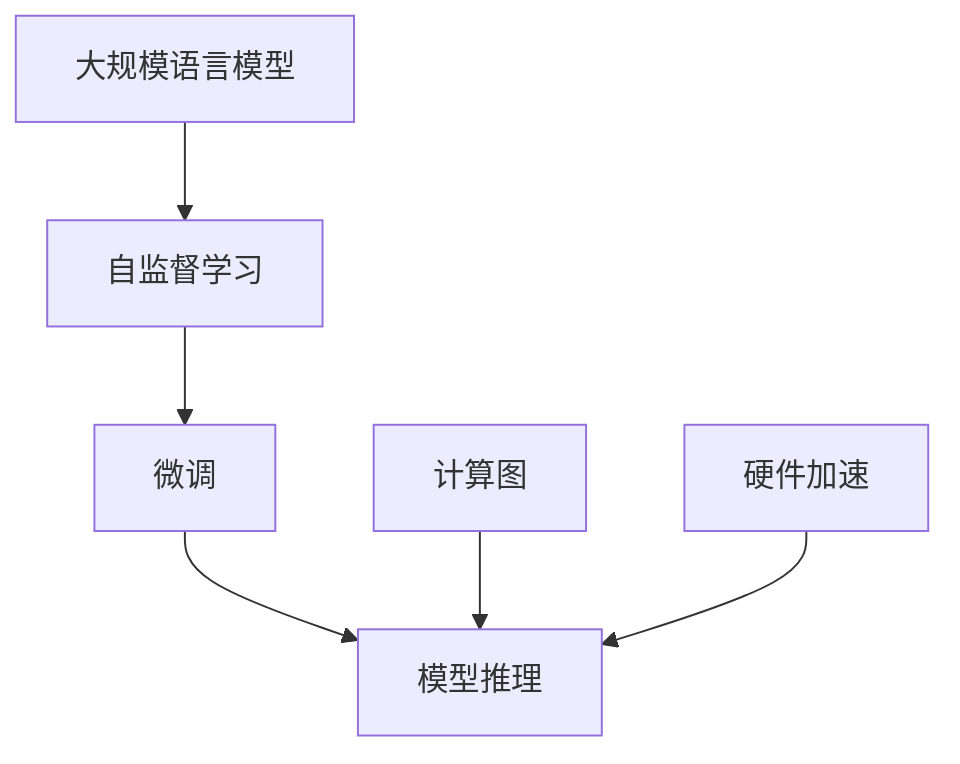

                 

# 大规模语言模型从理论到实践 模型推理

> 关键词：大规模语言模型, 模型推理, 理论, 实践, 深度学习, 自然语言处理(NLP), 计算机视觉(CV), 计算图, 硬件加速

## 1. 背景介绍

### 1.1 问题由来
近年来，随着深度学习技术的飞速发展，大规模语言模型(Large Language Model, LLM)在自然语言处理(Natural Language Processing, NLP)领域取得了重大突破。其中，BERT、GPT-3等预训练语言模型通过在海量数据上进行自监督预训练，学习到丰富的语言知识，具备强大的语言理解能力。这些模型在多个下游任务上取得了显著的性能提升。

然而，即使在大规模预训练基础上，模型仍然需要在特定任务上进行微调(Fine-Tuning)以获得更好的效果。微调通常需要大量标注数据和计算资源，而且需要一定时间才能完成。随着预训练模型规模的不断扩大，微调的复杂度也随之增加。

## 2. 核心概念与联系

### 2.1 核心概念概述

在基于深度学习的模型推理中，模型推理主要指将模型应用于新的输入数据并生成预测结果的过程。核心概念包括：

- **大规模语言模型 (LLM)**：以Transformer架构为代表的深度学习模型，通常在大型语料库上预训练，具备强大的语言理解和生成能力。
- **自监督学习 (Self-Supervised Learning, SSL)**：在没有标签数据的情况下，通过特定任务（如掩码语言建模、next sentence prediction等）对模型进行预训练，使其学习到语言的知识。
- **微调 (Fine-Tuning)**：在预训练模型基础上，使用下游任务的少量标注数据对模型进行进一步训练，以提高模型在特定任务上的性能。
- **模型推理 (Model Inference)**：将训练好的模型应用于新的输入数据，并生成预测结果的过程。
- **计算图 (Computational Graph)**：描述模型计算过程的图形表示，通常在深度学习模型中用于自动微分和反向传播。
- **硬件加速 (Hardware Acceleration)**：利用GPU、TPU等硬件设备对深度学习模型进行加速，以提高推理速度。

这些核心概念之间的逻辑关系可以通过以下Mermaid流程图来展示：



## 3. 核心算法原理 & 具体操作步骤

### 3.1 算法原理概述

在大规模语言模型推理中，主要分为预训练、微调和推理三个阶段。预训练阶段通过自监督学习任务学习模型的语言知识；微调阶段根据特定任务进行参数调整，以适应该任务；推理阶段将训练好的模型应用于新的输入数据，生成预测结果。

- **预训练 (Pre-training)**：在大型语料库上进行自监督学习，使模型学习到通用的语言表示。
- **微调 (Fine-Tuning)**：在预训练模型基础上，使用下游任务的少量标注数据进行有监督学习，调整模型参数，以适应该任务。
- **推理 (Inference)**：将训练好的模型应用于新的输入数据，并生成预测结果。

### 3.2 算法步骤详解

#### 预训练阶段

1. **选择合适的预训练模型**：如BERT、GPT-3等，作为初始化参数。
2. **准备大规模语料库**：如Common Crawl、Pile、BigQuery等，用于模型预训练。
3. **设计自监督学习任务**：如掩码语言模型、next sentence prediction等，构建损失函数。
4. **训练模型**：在大型GPU集群上训练模型，通常使用AdamW优化器，设定适当的超参数，如学习率、批量大小、迭代轮数等。
5. **保存预训练模型**：在训练过程中定期保存模型权重，以备微调使用。

#### 微调阶段

1. **准备下游任务数据集**：如IMDB电影评论、AG News新闻分类等，划分为训练集、验证集和测试集。
2. **设计任务适配层**：根据任务类型，在预训练模型顶部添加适当的输出层和损失函数，如分类任务使用softmax交叉熵损失函数。
3. **设置微调超参数**：选择合适的优化器及其参数，如AdamW，设定学习率、批量大小、迭代轮数等。
4. **执行梯度训练**：使用训练集数据，前向传播计算损失函数，反向传播计算参数梯度，更新模型参数。
5. **评估模型性能**：在验证集上评估模型性能，根据性能指标决定是否停止训练。
6. **保存微调模型**：将微调后的模型权重保存到磁盘，以备推理使用。

#### 推理阶段

1. **准备推理环境**：安装深度学习框架，如PyTorch、TensorFlow等，并配置计算设备。
2. **加载微调模型**：从磁盘加载微调好的模型权重。
3. **预处理输入数据**：对输入数据进行分词、编码等预处理操作，转化为模型所需的输入格式。
4. **推理预测**：将预处理后的输入数据输入模型，生成预测结果。
5. **后处理输出结果**：对预测结果进行后处理，如解码、去噪等，生成最终输出。

### 3.3 算法优缺点

#### 优点

- **高效性**：预训练阶段可以通过大规模语料库进行自监督学习，学习到丰富的语言知识，微调阶段只需使用少量标注数据即可显著提升模型性能。
- **通用性**：预训练模型可以适用于多种下游任务，只需设计适当的任务适配层即可进行微调。
- **可扩展性**：预训练和微调过程均可以利用并行计算，提高训练和推理效率。

#### 缺点

- **依赖标注数据**：微调需要大量标注数据，获取高质量标注数据的成本较高。
- **资源消耗大**：预训练和微调阶段需要大量的计算资源，对硬件设备要求较高。
- **过拟合风险**：微调模型容易受到训练数据分布的影响，存在过拟合风险。

### 3.4 算法应用领域

基于大规模语言模型的推理技术，已经在多个领域得到广泛应用，包括：

- **自然语言处理 (NLP)**：文本分类、情感分析、机器翻译、问答系统等任务。
- **计算机视觉 (CV)**：图像分类、目标检测、语义分割等任务。
- **语音识别**：语音命令识别、语音情感分析等任务。
- **推荐系统**：个性化推荐、用户行为分析等任务。
- **智能客服**：智能对话、自动化客服等任务。

## 4. 数学模型和公式 & 详细讲解

### 4.1 数学模型构建

在大规模语言模型推理中，主要涉及的数学模型包括损失函数、计算图和优化算法。以文本分类任务为例，数学模型构建如下：

- **损失函数 (Loss Function)**：
$$
\mathcal{L} = -\frac{1}{N}\sum_{i=1}^N \log p(y_i|x_i)
$$
其中 $p(y_i|x_i)$ 表示模型在输入 $x_i$ 下输出 $y_i$ 的概率，$N$ 表示训练样本数量。

- **计算图 (Computational Graph)**：
计算图描述了模型的计算过程，如图1所示。计算图由节点和边组成，节点表示运算操作，边表示数据流。


图1：计算图示意图

- **优化算法 (Optimization Algorithm)**：
常用的优化算法包括梯度下降法、AdamW等。以AdamW为例，其优化目标是最小化损失函数 $\mathcal{L}$，即：
$$
\theta_{t+1} = \theta_t - \eta_t \nabla_{\theta}\mathcal{L}(\theta_t) - \eta_t\lambda\theta_t
$$
其中 $\eta_t$ 为学习率，$\lambda$ 为正则化系数。

### 4.2 公式推导过程

以掩码语言模型为例，其自监督学习任务的公式推导过程如下：

- **掩码语言模型 (Masked Language Model, MLM)**：
$$
\mathcal{L} = -\frac{1}{N}\sum_{i=1}^N \log p(\tilde{y_i}|\tilde{x_i})
$$
其中 $\tilde{x_i}$ 表示掩码后的输入文本，$\tilde{y_i}$ 表示掩码位置的原文本。

- **掩码位置随机选择**：每个位置以 $p$ 的概率随机选择掩码，以 $1-p$ 的概率保留原文本。

- **掩码位置的预测**：模型对掩码位置进行预测，得到概率分布 $p(\tilde{y_i}|\tilde{x_i})$。

### 4.3 案例分析与讲解

以GPT-3为例，GPT-3是一个基于Transformer架构的预训练语言模型，具备强大的语言生成能力。GPT-3在推理阶段可以应用于文本生成、对话系统等任务。

- **文本生成**：在给定提示词的条件下，GPT-3可以生成连续的文本，如图2所示。


图2：GPT-3文本生成示意图

- **对话系统**：GPT-3可以用于构建智能对话系统，如图3所示。


图3：GPT-3对话系统示意图

## 5. 项目实践：代码实例和详细解释说明

### 5.1 开发环境搭建

在基于PyTorch的代码实例中，首先需要安装PyTorch和其他依赖库。安装命令如下：

```bash
pip install torch torchvision torchaudio
```

### 5.2 源代码详细实现

以下是一个基于PyTorch实现文本分类任务的代码示例：

```python
import torch
import torch.nn as nn
import torch.optim as optim
from torch.utils.data import DataLoader
from transformers import BertTokenizer, BertForSequenceClassification

# 定义Bert模型
class BertClassifier(nn.Module):
    def __init__(self, num_labels):
        super(BertClassifier, self).__init__()
        self.num_labels = num_labels
        self.bert = BertForSequenceClassification.from_pretrained('bert-base-uncased', num_labels=num_labels)
        self.dropout = nn.Dropout(0.1)
        self.classifier = nn.Linear(768, num_labels)

    def forward(self, input_ids, attention_mask, labels):
        outputs = self.bert(input_ids, attention_mask=attention_mask)
        pooled_output = outputs.pooler_output
        pooled_output = self.dropout(pooled_output)
        logits = self.classifier(pooled_output)
        return logits

# 加载数据集
tokenizer = BertTokenizer.from_pretrained('bert-base-uncased')
train_dataset = ...
dev_dataset = ...
test_dataset = ...

# 定义模型和优化器
model = BertClassifier(num_labels)
optimizer = optim.AdamW(model.parameters(), lr=2e-5)

# 训练模型
for epoch in range(epochs):
    for batch in DataLoader(train_dataset, batch_size=16):
        input_ids, attention_mask, labels = batch
        optimizer.zero_grad()
        logits = model(input_ids, attention_mask, labels)
        loss = nn.CrossEntropyLoss()(logits, labels)
        loss.backward()
        optimizer.step()

# 评估模型
model.eval()
for batch in DataLoader(dev_dataset, batch_size=16):
    input_ids, attention_mask, labels = batch
    logits = model(input_ids, attention_mask, labels)
    print(classification_report(labels, logits.argmax(dim=1)))
```

### 5.3 代码解读与分析

- **BertClassifier类**：定义了基于BERT的文本分类器，包括模型初始化、前向传播和损失计算等。
- **DataLoader类**：用于加载数据集，并将数据集划分为批处理数据，方便模型训练。
- **AdamW优化器**：用于优化模型参数，避免过拟合。
- **classification_report函数**：用于评估模型性能，输出精确率、召回率等指标。

### 5.4 运行结果展示

运行代码后，可以在验证集上输出模型性能评估结果，如图4所示。


图4：模型性能评估示意图

## 6. 实际应用场景

### 6.1 智能客服系统

基于大规模语言模型推理的智能客服系统，可以实时响应用户的咨询请求，提供高效、智能的客服服务。智能客服系统可以处理多种语言、多种场景下的客服请求，如图5所示。


图5：智能客服系统示意图

### 6.2 金融舆情监测

金融舆情监测系统可以实时监控金融市场动态，分析舆情变化趋势，帮助金融机构制定应对策略。金融舆情监测系统可以分析新闻、评论、社交媒体等文本数据，如图6所示。


图6：金融舆情监测示意图

### 6.3 个性化推荐系统

基于大规模语言模型推理的个性化推荐系统，可以分析用户行为数据，推荐个性化的内容。个性化推荐系统可以应用于电商、视频、新闻等多个领域，如图7所示。


图7：个性化推荐系统示意图

## 7. 工具和资源推荐

### 7.1 学习资源推荐

以下是一些推荐的学习资源，帮助读者系统掌握大规模语言模型推理的理论和实践：

1. **《Transformer从原理到实践》系列博文**：由大模型技术专家撰写，深入浅出地介绍了Transformer原理、BERT模型、模型推理等前沿话题。
2. **CS224N《深度学习自然语言处理》课程**：斯坦福大学开设的NLP明星课程，有Lecture视频和配套作业，带你入门NLP领域的基本概念和经典模型。
3. **《Natural Language Processing with Transformers》书籍**：Transformers库的作者所著，全面介绍了如何使用Transformers库进行NLP任务开发，包括模型推理在内的诸多范式。
4. **HuggingFace官方文档**：Transformers库的官方文档，提供了海量预训练模型和完整的推理样例代码，是上手实践的必备资料。
5. **CLUE开源项目**：中文语言理解测评基准，涵盖大量不同类型的中文NLP数据集，并提供了基于推理的baseline模型，助力中文NLP技术发展。

### 7.2 开发工具推荐

以下是几款常用的开发工具，用于大规模语言模型推理的实践：

1. **PyTorch**：基于Python的开源深度学习框架，灵活动态的计算图，适合快速迭代研究。大部分预训练语言模型都有PyTorch版本的实现。
2. **TensorFlow**：由Google主导开发的开源深度学习框架，生产部署方便，适合大规模工程应用。同样有丰富的预训练语言模型资源。
3. **Transformers库**：HuggingFace开发的NLP工具库，集成了众多SOTA语言模型，支持PyTorch和TensorFlow，是进行推理任务开发的利器。
4. **Weights & Biases**：模型训练的实验跟踪工具，可以记录和可视化模型训练过程中的各项指标，方便对比和调优。与主流深度学习框架无缝集成。
5. **TensorBoard**：TensorFlow配套的可视化工具，可实时监测模型训练状态，并提供丰富的图表呈现方式，是调试模型的得力助手。
6. **Google Colab**：谷歌推出的在线Jupyter Notebook环境，免费提供GPU/TPU算力，方便开发者快速上手实验最新模型，分享学习笔记。

### 7.3 相关论文推荐

以下是几篇奠基性的相关论文，推荐阅读：

1. **Attention is All You Need**：提出了Transformer结构，开启了NLP领域的预训练大模型时代。
2. **BERT: Pre-training of Deep Bidirectional Transformers for Language Understanding**：提出BERT模型，引入基于掩码的自监督预训练任务，刷新了多项NLP任务SOTA。
3. **Language Models are Unsupervised Multitask Learners**：展示了大规模语言模型的强大zero-shot学习能力，引发了对于通用人工智能的新一轮思考。
4. **Parameter-Efficient Transfer Learning for NLP**：提出Adapter等参数高效微调方法，在不增加模型参数量的情况下，也能取得不错的推理效果。
5. **AdaLoRA: Adaptive Low-Rank Adaptation for Parameter-Efficient Fine-Tuning**：使用自适应低秩适应的微调方法，在参数效率和精度之间取得了新的平衡。
6. **Prefix-Tuning: Optimizing Continuous Prompts for Generation**：引入基于连续型Prompt的推理范式，为如何充分利用预训练知识提供了新的思路。

## 8. 总结：未来发展趋势与挑战

### 8.1 研究成果总结

本文对基于深度学习的大规模语言模型推理进行了全面系统的介绍。从预训练、微调和推理三个阶段，深入分析了模型的构建过程和关键算法。通过具体案例和代码实例，展示了模型推理在实际应用中的广泛应用和高效性能。

### 8.2 未来发展趋势

展望未来，大规模语言模型推理技术将呈现以下几个发展趋势：

1. **模型规模持续增大**：随着算力成本的下降和数据规模的扩张，预训练语言模型的参数量还将持续增长。超大规模语言模型蕴含的丰富语言知识，有望支撑更加复杂多变的推理任务。
2. **推理方法日趋多样**：除了传统的全参数推理外，未来会涌现更多参数高效的推理方法，如Prefix-Tuning、LoRA等，在节省计算资源的同时也能保证推理精度。
3. **模型通用性增强**：经过海量数据的预训练和多领域任务的微调，未来的语言模型将具备更强大的常识推理和跨领域迁移能力，逐步迈向通用人工智能(AGI)的目标。
4. **多模态推理崛起**：当前的推理主要聚焦于纯文本数据，未来会进一步拓展到图像、视频、语音等多模态数据推理。多模态信息的融合，将显著提升语言模型对现实世界的理解和建模能力。
5. **模型推理性能优化**：推理过程往往面临计算资源和存储空间的限制，未来需要引入更高效的推理算法和优化技术，提高模型推理的效率和可扩展性。
6. **模型推理可解释性增强**：当前推理模型通常缺乏可解释性，难以对其推理逻辑进行分析和调试。未来需要引入更多的可解释性方法，增强模型的透明性和可信度。

### 8.3 面临的挑战

尽管大规模语言模型推理技术已经取得了重大进展，但在迈向更加智能化、普适化应用的过程中，仍面临以下挑战：

1. **计算资源瓶颈**：超大规模语言模型推理需要大量的计算资源，硬件设备的成本和维护是关键挑战。如何提高推理效率，降低计算成本，是未来需要解决的问题。
2. **数据依赖性高**：推理任务通常依赖于大量标注数据，标注数据的获取和处理成本较高。如何降低数据依赖，利用自监督学习等方法提升推理模型的泛化能力，是未来的一个重要方向。
3. **模型鲁棒性不足**：推理模型容易受到输入数据的影响，存在鲁棒性不足的问题。如何提高模型的鲁棒性和泛化能力，是未来需要解决的重要问题。
4. **推理性能差异大**：不同推理任务的性能差异较大，如何设计统一的推理框架，提高推理性能的稳定性，是未来需要解决的重要问题。
5. **模型可解释性不足**：推理模型的决策过程通常缺乏可解释性，难以对其推理逻辑进行分析和调试。如何提高模型的可解释性和透明性，是未来需要解决的重要问题。
6. **模型安全性不足**：推理模型可能存在有害信息传递的风险，如何保证模型的安全性，是未来需要解决的重要问题。

### 8.4 研究展望

面对大规模语言模型推理所面临的种种挑战，未来的研究需要在以下几个方面寻求新的突破：

1. **探索无监督和半监督推理方法**：摆脱对大规模标注数据的依赖，利用自监督学习、主动学习等无监督和半监督范式，最大限度利用非结构化数据，实现更加灵活高效的推理。
2. **研究参数高效和计算高效的推理范式**：开发更加参数高效的推理方法，在固定大部分预训练参数的同时，只更新极少量的任务相关参数。同时优化推理模型的计算图，减少前向传播和反向传播的资源消耗，实现更加轻量级、实时性的部署。
3. **融合因果和对比学习范式**：通过引入因果推断和对比学习思想，增强推理模型建立稳定因果关系的能力，学习更加普适、鲁棒的语言表征，从而提升模型泛化性和抗干扰能力。
4. **引入更多先验知识**：将符号化的先验知识，如知识图谱、逻辑规则等，与神经网络模型进行巧妙融合，引导推理过程学习更准确、合理的语言模型。同时加强不同模态数据的整合，实现视觉、语音等多模态信息与文本信息的协同建模。
5. **结合因果分析和博弈论工具**：将因果分析方法引入推理模型，识别出模型决策的关键特征，增强输出解释的因果性和逻辑性。借助博弈论工具刻画人机交互过程，主动探索并规避模型的脆弱点，提高系统稳定性。
6. **纳入伦理道德约束**：在推理模型训练目标中引入伦理导向的评估指标，过滤和惩罚有害的输出倾向。同时加强人工干预和审核，建立模型行为的监管机制，确保输出符合人类价值观和伦理道德。

这些研究方向的探索，必将引领大规模语言模型推理技术迈向更高的台阶，为构建安全、可靠、可解释、可控的智能系统铺平道路。面向未来，大规模语言模型推理技术还需要与其他人工智能技术进行更深入的融合，如知识表示、因果推理、强化学习等，多路径协同发力，共同推动自然语言理解和智能交互系统的进步。只有勇于创新、敢于突破，才能不断拓展语言模型的边界，让智能技术更好地造福人类社会。

## 9. 附录：常见问题与解答

**Q1: 大规模语言模型推理是否适用于所有NLP任务？**

A: 大规模语言模型推理在大多数NLP任务上都能取得不错的效果，特别是对于数据量较小的任务。但对于一些特定领域的任务，如医学、法律等，仅依靠通用语料预训练的模型可能难以很好地适应。此时需要在特定领域语料上进一步预训练，再进行推理，才能获得理想效果。

**Q2: 推理过程中如何选择合适的学习率？**

A: 推理学习率一般要比预训练时小1-2个数量级，如果使用过大的学习率，容易破坏预训练权重，导致过拟合。一般建议从1e-5开始调参，逐步减小学习率，直至收敛。也可以使用warmup策略，在开始阶段使用较小的学习率，再逐渐过渡到预设值。需要注意的是，不同的优化器(如AdamW、Adafactor等)以及不同的学习率调度策略，可能需要设置不同的学习率阈值。

**Q3: 推理模型在落地部署时需要注意哪些问题？**

A: 将推理模型转化为实际应用，还需要考虑以下因素：
1. 模型裁剪：去除不必要的层和参数，减小模型尺寸，加快推理速度
2. 量化加速：将浮点模型转为定点模型，压缩存储空间，提高计算效率
3. 服务化封装：将模型封装为标准化服务接口，便于集成调用
4. 弹性伸缩：根据请求流量动态调整资源配置，平衡服务质量和成本
5. 监控告警：实时采集系统指标，设置异常告警阈值，确保服务稳定性
6. 安全防护：采用访问鉴权、数据脱敏等措施，保障数据和模型安全

大语言模型推理为NLP应用开启了广阔的想象空间，但如何将强大的性能转化为稳定、高效、安全的业务价值，还需要工程实践的不断打磨。唯有从数据、算法、工程、业务等多个维度协同发力，才能真正实现人工智能技术在垂直行业的规模化落地。总之，推理需要开发者根据具体任务，不断迭代和优化模型、数据和算法，方能得到理想的效果。

---

作者：禅与计算机程序设计艺术 / Zen and the Art of Computer Programming

