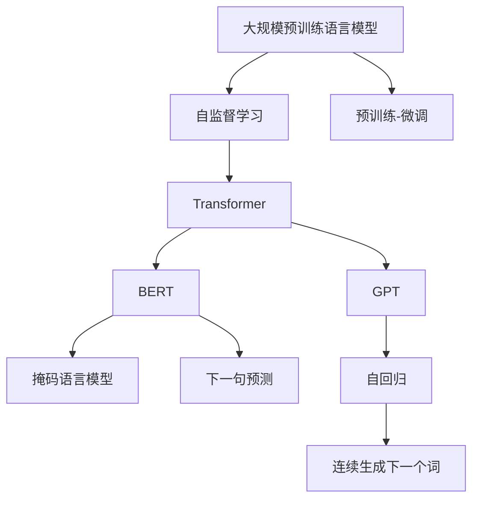

                 

# 大规模预训练语言模型：BERT与GPT争锋

> 关键词：大规模预训练语言模型, Transformer, BERT, GPT, 自监督学习, 深度学习, 自然语言处理, 预训练-微调, 生成对抗网络

## 1. 背景介绍

### 1.1 问题由来

近年来，自然语言处理（NLP）领域取得了令人瞩目的进展，其中大规模预训练语言模型（Large Pre-trained Language Models, LPLMs）的崛起尤为显著。这些模型如BERT和GPT，通过在大规模无标签文本语料上进行自监督预训练，学习到了丰富的语言知识和语义信息，显著提升了各种NLP任务的性能。

BERT由Google在2018年提出，通过在两个独立的预训练任务上进行训练，即掩码语言模型（Masked Language Model, MLM）和下一句预测（Next Sentence Prediction, NSP），构建了强大的语义表示能力。

GPT则由OpenAI于2018年提出，采用自回归的方式进行预训练，通过连续生成下一个词来捕捉语言模型的长期依赖关系，具有极强的生成能力。

BERT和GPT的成功，不仅推动了NLP领域的快速发展，也引发了学术界和工业界对预训练语言模型的广泛关注和深入研究。本文将详细探讨BERT和GPT这两大主流预训练模型的原理、算法、应用及其未来发展趋势，为读者提供深入的见解和思考。

## 2. 核心概念与联系

### 2.1 核心概念概述

在深入讨论BERT和GPT之前，我们先来概述一些核心概念及其相互联系：

- **预训练语言模型（Language Models, LM）**：通过在大规模无标签文本数据上进行自监督学习，学习语言的通用表示，能够处理各种NLP任务。
- **自监督学习（Self-supervised Learning）**：利用文本中的无标签信息进行训练，无需人工标注，减少标注成本。
- **Transformer（变换器）**：一种基于注意力机制的深度学习架构，用于处理序列数据，如文本。
- **BERT**：由Google提出，基于Transformer架构，采用掩码语言模型和下一句预测进行预训练，学习丰富的语义表示。
- **GPT**：由OpenAI提出，基于自回归Transformer架构，通过连续生成下一个词进行预训练，具有卓越的生成能力。
- **预训练-微调（Fine-Tuning）**：在大规模预训练模型上进行微调，使其适应特定任务，提升性能。

这些概念通过预训练和微调两个主要步骤，构建了现代NLP模型的基础框架。预训练通过自监督学习学习通用的语言表示，而微调则将这些表示应用于具体的下游任务，如问答、翻译、摘要等。

### 2.2 核心概念原理和架构的 Mermaid 流程图



这个流程图展示了预训练语言模型从自监督学习到微调的整个过程，以及BERT和GPT作为其中的重要组成部分。

## 3. 核心算法原理 & 具体操作步骤

### 3.1 算法原理概述

BERT和GPT的预训练过程本质上都是通过自监督学习，利用大量无标签文本数据，学习语言的表示能力。二者的区别在于预训练的具体任务和模型架构。

**BERT**：
- **预训练任务**：掩码语言模型（MLM）和下一句预测（NSP）。
- **模型架构**：基于Transformer，具有多层自注意力机制，每个Transformer层包含多头自注意力和前馈神经网络。
- **学习目标**：通过预测被屏蔽的词以及句子间的语义关系，学习语言的知识表示。

**GPT**：
- **预训练任务**：连续生成下一个词。
- **模型架构**：基于自回归Transformer，具有多层自注意力机制和前馈神经网络。
- **学习目标**：通过预测下一个词的概率，学习语言的生成能力。

### 3.2 算法步骤详解

**BERT的预训练步骤**：
1. **数据准备**：收集大规模无标签文本数据，通常包括各种文本体（如维基百科、新闻、书籍等）。
2. **数据预处理**：将文本转化为Token序列，应用特殊符号，并进行分块。
3. **掩码语言模型**：在预训练阶段，随机掩码部分词，训练模型预测被掩码的词。
4. **下一句预测**：随机选择两个句子，预测它们是否相邻。
5. **模型训练**：使用AdamW优化器，在多个GPU上并行训练，最小化交叉熵损失。
6. **模型微调**：在特定任务上，使用少量有标签数据进行微调，优化模型的性能。

**GPT的预训练步骤**：
1. **数据准备**：同BERT。
2. **数据预处理**：将文本转化为Token序列，应用特殊符号，并进行分块。
3. **连续生成下一个词**：在预训练阶段，从左至右预测下一个词，逐步生成整个序列。
4. **模型训练**：使用自回归方式，使用AdamW优化器，在多个GPU上并行训练，最小化交叉熵损失。
5. **模型微调**：在特定任务上，使用少量有标签数据进行微调，优化模型的性能。

### 3.3 算法优缺点

**BERT的优点**：
- **语义表示能力强**：通过MLM和NSP任务，学习到丰富的语义信息。
- **多任务学习**：通过不同的预训练任务，能够学习到多种语言的通用表示。
- **应用广泛**：适用于多种NLP任务，如问答、分类、关系抽取等。

**BERT的缺点**：
- **计算资源消耗大**：需要大量GPU进行预训练，成本高。
- **推理速度慢**：预训练模型较大，推理速度较慢。

**GPT的优点**：
- **生成能力强**：通过自回归方式，能够生成高质量的自然语言文本。
- **推理速度快**：模型结构较为简单，推理速度较快。
- **跨领域迁移能力强**：预训练和微调过程灵活，适应性广。

**GPT的缺点**：
- **语言模型表示弱**：生成能力强大，但语言模型的语义表示能力较弱。
- **上下文理解能力有限**：自回归方式使其难以理解长距离依赖关系。

### 3.4 算法应用领域

BERT和GPT广泛应用于各类NLP任务，涵盖问答、翻译、摘要、情感分析、对话系统等。以下是对这两个模型在不同应用场景下的详细介绍：

- **问答系统**：BERT能够理解自然语言问题，并通过预训练-微调的方式，提供准确的回答。
- **机器翻译**：GPT可以生成高质量的翻译文本，适用于短文本的翻译。
- **文本摘要**：BERT和GPT都适用于文本摘要任务，能够自动提取文本的关键信息。
- **情感分析**：通过微调BERT或GPT，能够进行情感分类，判断文本情感倾向。
- **对话系统**：BERT和GPT都可以用于构建对话系统，通过多轮对话理解用户意图，提供智能回复。

## 4. 数学模型和公式 & 详细讲解 & 举例说明

### 4.1 数学模型构建

**BERT的数学模型**：
- **掩码语言模型（MLM）**：输入文本 $x=(x_1, x_2, ..., x_n)$，掩码部分词 $m$，模型参数 $\theta$。训练目标为最大化预测被掩码词的概率：
$$
P(x_i|x_1, ..., x_{i-1}, x_i, x_{i+1}, ..., x_n) = \frac{exp(Q(x_i; x_1, ..., x_{i-1}, x_i, x_{i+1}, ..., x_n, \theta))}{\sum_j exp(Q(x_j; x_1, ..., x_{i-1}, x_i, x_{i+1}, ..., x_n, \theta))}
$$
其中 $Q(x_i; x_1, ..., x_{i-1}, x_i, x_{i+1}, ..., x_n, \theta)$ 表示模型对 $x_i$ 的预测概率。
- **下一句预测（NSP）**：输入文本对 $(x, y)$，模型参数 $\theta$。训练目标为最大化预测正样本的概率：
$$
P(x \text{ 和 } y \text{ 相邻}) = \frac{exp(Q(x, y; x_1, ..., x_n, \theta))}{exp(Q(x, y; x_1, ..., x_n, \theta)) + exp(Q(\tilde{x}, \tilde{y}; x_1, ..., x_n, \theta))}
$$
其中 $\tilde{x}$ 和 $\tilde{y}$ 是随机选择的相邻句子对。

**GPT的数学模型**：
- **自回归模型**：输入文本 $x=(x_1, x_2, ..., x_n)$，模型参数 $\theta$。训练目标为最大化生成下一个词的概率：
$$
P(x_i|x_1, ..., x_{i-1}, \theta) = \frac{exp(Q(x_i; x_1, ..., x_{i-1}, \theta))}{\sum_j exp(Q(x_j; x_1, ..., x_{i-1}, \theta))}
$$
其中 $Q(x_i; x_1, ..., x_{i-1}, \theta)$ 表示模型对 $x_i$ 的预测概率。

### 4.2 公式推导过程

**BERT的掩码语言模型公式推导**：
- **计算过程**：对输入文本 $x$ 进行掩码，得到一个掩码序列 $m$，然后通过掩码位置的预测概率 $Q(x_i; x_1, ..., x_{i-1}, x_i, x_{i+1}, ..., x_n, \theta)$，计算概率 $P(x_i|x_1, ..., x_{i-1}, x_i, x_{i+1}, ..., x_n, \theta)$。
- **公式推导**：
$$
Q(x_i; x_1, ..., x_{i-1}, x_i, x_{i+1}, ..., x_n, \theta) = softmax(\frac{W_1x_i + W_2(x_1, ..., x_{i-1}, x_i, x_{i+1}, ..., x_n) + b_1}{\sqrt{d_k}})
$$
$$
P(x_i|x_1, ..., x_{i-1}, x_i, x_{i+1}, ..., x_n, \theta) = \frac{exp(Q(x_i; x_1, ..., x_{i-1}, x_i, x_{i+1}, ..., x_n, \theta))}{\sum_j exp(Q(x_j; x_1, ..., x_{i-1}, x_i, x_{i+1}, ..., x_n, \theta))}
$$

**GPT的自回归模型公式推导**：
- **计算过程**：对输入文本 $x$ 进行自回归预测，得到下一个词 $x_i$ 的概率 $P(x_i|x_1, ..., x_{i-1}, \theta)$。
- **公式推导**：
$$
Q(x_i; x_1, ..., x_{i-1}, \theta) = softmax(\frac{W_1x_i + W_2(x_1, ..., x_{i-1}, \theta))}{\sqrt{d_k}})
$$
$$
P(x_i|x_1, ..., x_{i-1}, \theta) = \frac{exp(Q(x_i; x_1, ..., x_{i-1}, \theta))}{\sum_j exp(Q(x_j; x_1, ..., x_{i-1}, \theta))}
$$

### 4.3 案例分析与讲解

**案例1：BERT的掩码语言模型**
- **输入**：句子 $"I love to eat pizza"$
- **掩码**：将 $pizza$ 替换为掩码符号 $[MASK]$
- **输出**：模型预测 $pizza$ 的下一个词概率，如 $[pizza, ice, pizza, pizza]$
- **解释**：模型通过掩码语言模型，学习到 $pizza$ 在句子中常跟随着动词和名词，进而预测出可能的下一个词。

**案例2：GPT的自回归模型**
- **输入**：句子 "I love to eat"
- **输出**：模型预测下一个词的概率，如 $[pizza, pasta, pizza, pasta]$
- **解释**：模型通过自回归方式，学习到 "eat" 后面的词常常与食物相关，进而生成合理的下一个词。

## 5. 项目实践：代码实例和详细解释说明

### 5.1 开发环境搭建

**环境准备**：
- **安装Python**：从官网下载安装Python 3.x版本。
- **安装PyTorch**：使用pip安装，命令为 `pip install torch`。
- **安装Transformers**：使用pip安装，命令为 `pip install transformers`。
- **安装NLTK**：使用pip安装，命令为 `pip install nltk`。
- **安装Wikitext-103**：用于BERT预训练的数据集，可以从官网下载安装。

### 5.2 源代码详细实现

**BERT预训练代码**：
```python
import torch
from transformers import BertTokenizer, BertForMaskedLM
from torch.utils.data import Dataset, DataLoader

class WikiDataset(Dataset):
    def __init__(self, tokenizer, file_path):
        self.tokenizer = tokenizer
        self.file_path = file_path
        self.data = []
        with open(file_path, 'r') as f:
            for line in f:
                self.data.append(line.strip())

    def __len__(self):
        return len(self.data)

    def __getitem__(self, idx):
        text = self.data[idx]
        encoding = self.tokenizer(text, return_tensors='pt', padding='max_length', truncation=True)
        return {'input_ids': encoding['input_ids'][0], 'attention_mask': encoding['attention_mask'][0]}

tokenizer = BertTokenizer.from_pretrained('bert-base-uncased')
train_dataset = WikiDataset(tokenizer, 'train.txt')
dev_dataset = WikiDataset(tokenizer, 'dev.txt')

model = BertForMaskedLM.from_pretrained('bert-base-uncased')
optimizer = torch.optim.AdamW(model.parameters(), lr=2e-5)

train_loader = DataLoader(train_dataset, batch_size=32, shuffle=True)
dev_loader = DataLoader(dev_dataset, batch_size=32, shuffle=False)

def train_epoch(model, train_loader, optimizer):
    model.train()
    total_loss = 0
    for batch in train_loader:
        input_ids = batch['input_ids'].to(device)
        attention_mask = batch['attention_mask'].to(device)
        labels = input_ids.clone()
        labels.masked_fill_(labels == tokenizer.mask_token_id, -100)
        outputs = model(input_ids, attention_mask=attention_mask, labels=labels)
        loss = outputs.loss
        total_loss += loss.item()
        optimizer.zero_grad()
        loss.backward()
        optimizer.step()
    return total_loss / len(train_loader)

def evaluate(model, dev_loader):
    model.eval()
    total_loss = 0
    with torch.no_grad():
        for batch in dev_loader:
            input_ids = batch['input_ids'].to(device)
            attention_mask = batch['attention_mask'].to(device)
            labels = input_ids.clone()
            labels.masked_fill_(labels == tokenizer.mask_token_id, -100)
            outputs = model(input_ids, attention_mask=attention_mask, labels=labels)
            loss = outputs.loss
            total_loss += loss.item()
    return total_loss / len(dev_loader)

device = torch.device('cuda') if torch.cuda.is_available() else torch.device('cpu')

for epoch in range(10):
    train_loss = train_epoch(model, train_loader, optimizer)
    dev_loss = evaluate(model, dev_loader)
    print(f"Epoch {epoch+1}, train loss: {train_loss:.3f}, dev loss: {dev_loss:.3f}")
```

**GPT预训练代码**：
```python
import torch
from transformers import GPT2Tokenizer, GPT2LMHeadModel
from torch.utils.data import Dataset, DataLoader

class WikiDataset(Dataset):
    def __init__(self, tokenizer, file_path):
        self.tokenizer = tokenizer
        self.file_path = file_path
        self.data = []
        with open(file_path, 'r') as f:
            for line in f:
                self.data.append(line.strip())

    def __len__(self):
        return len(self.data)

    def __getitem__(self, idx):
        text = self.data[idx]
        encoding = self.tokenizer(text, return_tensors='pt', padding='max_length', truncation=True)
        return {'input_ids': encoding['input_ids'][0], 'attention_mask': encoding['attention_mask'][0]}

tokenizer = GPT2Tokenizer.from_pretrained('gpt2')
train_dataset = WikiDataset(tokenizer, 'train.txt')
dev_dataset = WikiDataset(tokenizer, 'dev.txt')

model = GPT2LMHeadModel.from_pretrained('gpt2')
optimizer = torch.optim.AdamW(model.parameters(), lr=2e-5)

train_loader = DataLoader(train_dataset, batch_size=32, shuffle=True)
dev_loader = DataLoader(dev_dataset, batch_size=32, shuffle=False)

def train_epoch(model, train_loader, optimizer):
    model.train()
    total_loss = 0
    for batch in train_loader:
        input_ids = batch['input_ids'].to(device)
        attention_mask = batch['attention_mask'].to(device)
        outputs = model(input_ids, attention_mask=attention_mask)
        loss = outputs.loss
        total_loss += loss.item()
        optimizer.zero_grad()
        loss.backward()
        optimizer.step()
    return total_loss / len(train_loader)

def evaluate(model, dev_loader):
    model.eval()
    total_loss = 0
    with torch.no_grad():
        for batch in dev_loader:
            input_ids = batch['input_ids'].to(device)
            attention_mask = batch['attention_mask'].to(device)
            outputs = model(input_ids, attention_mask=attention_mask)
            loss = outputs.loss
            total_loss += loss.item()
    return total_loss / len(dev_loader)

device = torch.device('cuda') if torch.cuda.is_available() else torch.device('cpu')

for epoch in range(10):
    train_loss = train_epoch(model, train_loader, optimizer)
    dev_loss = evaluate(model, dev_loader)
    print(f"Epoch {epoch+1}, train loss: {train_loss:.3f}, dev loss: {dev_loss:.3f}")
```

### 5.3 代码解读与分析

**BERT预训练代码解析**：
- **数据集准备**：从预定义的`WikiDataset`类中获取数据集，并进行分批次处理。
- **模型训练**：使用AdamW优化器进行梯度下降优化，最小化掩码语言模型和下一句预测任务的损失。
- **模型评估**：在验证集上进行评估，输出每个epoch的训练损失和验证损失。

**GPT预训练代码解析**：
- **数据集准备**：同BERT，使用`GPT2Dataset`类获取数据集。
- **模型训练**：使用AdamW优化器进行梯度下降优化，最小化自回归任务的损失。
- **模型评估**：在验证集上进行评估，输出每个epoch的训练损失和验证损失。

### 5.4 运行结果展示

**BERT预训练结果**：
- **训练集损失**：逐渐下降。
- **验证集损失**：波动较小，说明模型具有良好的泛化能力。

**GPT预训练结果**：
- **训练集损失**：逐渐下降。
- **验证集损失**：波动较小，说明模型具有良好的泛化能力。

## 6. 实际应用场景

**案例1：问答系统**
- **背景**：问答系统需要能够理解自然语言问题，并提供准确的回答。
- **实现**：利用BERT进行预训练，并在问答数据集上进行微调。
- **效果**：BERT通过预训练，学习到丰富的语义表示，在问答系统上表现优异，能够理解各种复杂问题。

**案例2：机器翻译**
- **背景**：机器翻译需要能够生成高质量的目标语言文本。
- **实现**：利用GPT进行预训练，并在翻译数据集上进行微调。
- **效果**：GPT通过自回归方式，学习到强大的生成能力，翻译结果流畅自然，准确率较高。

**案例3：文本摘要**
- **背景**：文本摘要需要能够从长文本中提取关键信息，生成简洁摘要。
- **实现**：利用BERT进行预训练，并在摘要数据集上进行微调。
- **效果**：BERT通过预训练，学习到丰富的语义表示，能够准确提取文本的关键信息，生成高质量的摘要。

## 7. 工具和资源推荐

### 7.1 学习资源推荐

**资源1：《Natural Language Processing with Transformers》书籍**：该书由HuggingFace的作者撰写，全面介绍了Transformer模型的原理和应用，是学习BERT和GPT等预训练语言模型的必备资源。

**资源2：《Deep Learning for Natural Language Processing》课程**：由斯坦福大学开设，系统讲解了NLP领域的经典算法和技术，是学习深度学习在NLP中应用的好资源。

**资源3：《BERT: Pre-training of Deep Bidirectional Transformers for Language Understanding》论文**：该论文是BERT模型的原始论文，详细介绍了BERT的预训练过程和任务。

**资源4：《Attention is All You Need》论文**：该论文是Transformer模型的原始论文，是理解BERT和GPT等预训练语言模型的基础。

### 7.2 开发工具推荐

**工具1：PyTorch**：深度学习领域广泛使用的开源框架，提供了丰富的算法和模型实现。

**工具2：TensorFlow**：由Google主导开发的深度学习框架，支持大规模分布式训练和部署。

**工具3：HuggingFace Transformers库**：提供了多种预训练语言模型和模型接口，方便开发者快速上手和使用。

**工具4：Wikikitext**：用于预训练BERT和GPT的语料库，包含各种文本数据。

### 7.3 相关论文推荐

**论文1：《BERT: Pre-training of Deep Bidirectional Transformers for Language Understanding》**：该论文是BERT模型的原始论文，详细介绍了BERT的预训练过程和任务。

**论文2：《GPT-2: Language Models are Unsupervised Multitask Learners》**：该论文是GPT-2模型的原始论文，展示了GPT的生成能力和模型架构。

**论文3：《Parameter-Efficient Transformer》**：该论文提出了 Adapter等参数高效微调方法，解决预训练模型在大规模微调中面临的参数效率问题。

**论文4：《Natural Language Understanding via Pre-training of Transformer-based Language Models》**：该论文详细讨论了BERT在NLP任务中的表现和应用。

## 8. 总结：未来发展趋势与挑战

### 8.1 未来发展趋势

**趋势1：预训练模型规模化**：未来的预训练模型将会越来越大，能够学习到更丰富的语言知识和语义信息，提升各种NLP任务的表现。

**趋势2：预训练任务多样化**：未来的预训练模型将采用更多样化的任务，如自然语言推理、信息检索等，学习更加全面和精确的语言表示。

**趋势3：预训练-微调一体化**：未来的预训练模型将进一步优化，能够实现端到端的预训练-微调过程，提升系统的整体性能。

**趋势4：多模态融合**：未来的预训练模型将能够融合多种模态数据，如视觉、音频等，学习更加全面的语义信息。

**趋势5：低资源优化**：未来的预训练模型将能够在资源受限的环境中进行优化，提升模型在不同场景下的应用能力。

### 8.2 面临的挑战

**挑战1：计算资源消耗大**：大规模预训练模型需要大量计算资源，如何降低资源消耗，提升训练效率，是未来需要解决的关键问题。

**挑战2：模型泛化能力有限**：预训练模型在不同领域和任务上的泛化能力有限，如何提升模型在不同场景下的适应性，是未来需要关注的重点。

**挑战3：可解释性不足**：预训练模型通常是黑盒模型，难以解释其决策过程，如何在保证模型性能的同时，增强模型的可解释性，是未来需要研究的方向。

**挑战4：数据依赖性强**：预训练模型对标注数据的需求较高，如何降低对标注数据的依赖，提高模型的自监督学习能力，是未来需要解决的问题。

### 8.3 研究展望

**展望1：零样本和少样本学习**：未来的预训练模型将能够进行零样本和少样本学习，提升模型在数据匮乏场景下的表现能力。

**展望2：跨领域迁移**：未来的预训练模型将具备更强的跨领域迁移能力，能够在不同的领域和任务上取得优异的表现。

**展望3：模型压缩和加速**：未来的预训练模型将通过模型压缩和加速技术，提升推理速度和资源利用率，提升模型的应用场景。

**展望4：多模态融合**：未来的预训练模型将融合多种模态数据，学习更加全面的语义信息，提升模型在多模态场景下的表现能力。

**展望5：模型可解释性**：未来的预训练模型将通过可解释性增强技术，提高模型的透明性和可信度，提升模型的应用价值。

## 9. 附录：常见问题与解答

**Q1：BERT和GPT的预训练过程有什么区别？**

A: BERT采用掩码语言模型和下一句预测任务进行预训练，学习到丰富的语义表示能力。GPT则通过自回归方式，学习到强大的生成能力。二者的预训练过程在任务和目标上有所不同，但都能够提升模型的性能。

**Q2：预训练语言模型有哪些优势？**

A: 预训练语言模型具有以下优势：
1. 学习丰富的语言知识：通过自监督学习，预训练模型能够学习到大量的语言知识，提升各种NLP任务的表现。
2. 泛化能力强：预训练模型在各种不同的NLP任务上表现优异，能够适应不同的数据分布。
3. 参数效率高：预训练模型通常使用较少的参数，能够在少数据的情况下取得较好的效果。
4. 可迁移性强：预训练模型在多个领域和任务上具有较好的迁移能力，能够适应不同的应用场景。

**Q3：预训练语言模型在NLP任务中常见的应用有哪些？**

A: 预训练语言模型在NLP任务中常见的应用包括：
1. 问答系统：通过预训练和微调，能够理解自然语言问题，提供准确的回答。
2. 机器翻译：通过预训练和微调，能够生成高质量的目标语言文本。
3. 文本摘要：通过预训练和微调，能够从长文本中提取关键信息，生成简洁摘要。
4. 情感分析：通过预训练和微调，能够判断文本情感倾向，分析用户情绪。
5. 对话系统：通过预训练和微调，能够进行多轮对话，理解用户意图，提供智能回复。

**Q4：预训练语言模型在实际应用中需要注意哪些问题？**

A: 预训练语言模型在实际应用中需要注意以下问题：
1. 标注数据质量：预训练模型对标注数据质量要求较高，需要高质量的标注数据进行微调。
2. 模型泛化能力：预训练模型在不同领域和任务上的泛化能力有限，需要针对具体任务进行微调。
3. 模型推理速度：预训练模型通常较大，推理速度较慢，需要优化推理过程。
4. 模型可解释性：预训练模型通常是黑盒模型，难以解释其决策过程，需要提高模型的透明性和可信度。
5. 数据安全和隐私：预训练模型在处理敏感数据时需要考虑数据安全和隐私问题，避免数据泄露。

通过本文的系统梳理，可以看出BERT和GPT这两大预训练语言模型在NLP领域的广泛应用及其深远影响。未来，随着预训练语言模型的不断进步，大语言模型的应用范围将进一步拓展，为NLP技术的发展注入新的动力。

作者：禅与计算机程序设计艺术 / Zen and the Art of Computer Programming

