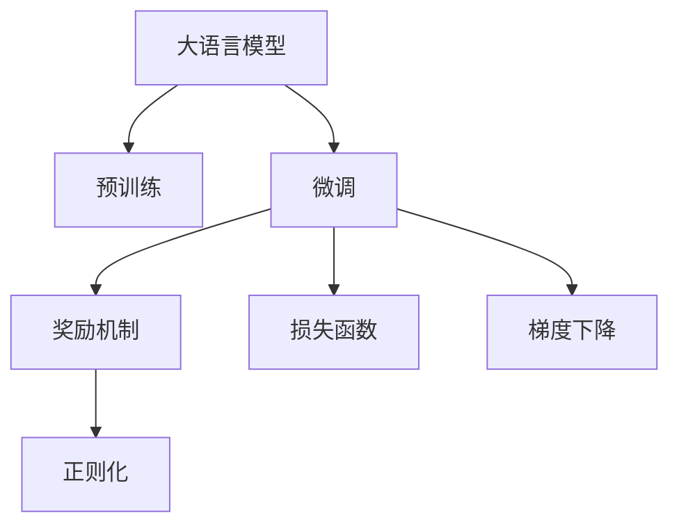

                 

# 大语言模型原理与工程实践：奖励模型

## 1. 背景介绍

### 1.1 问题由来
在自然语言处理(Natural Language Processing, NLP)领域，大语言模型(Large Language Models, LLMs)如BERT、GPT等，通过在大规模无标签文本语料上进行预训练，学习到了丰富的语言知识和常识，展示了卓越的通用语言能力。但这种通用模型难以直接应用于特定领域或复杂任务，需要进行有监督微调。而微调过程中，如何设计合适的奖励机制，引导模型学习到对目标任务有用的知识，成为一个关键问题。

### 1.2 问题核心关键点
奖励机制在基于监督学习的大语言模型微调中，起到了举足轻重的作用。有效的奖励机制能够指导模型更有效地学习，避免过拟合，提升微调效果。奖励机制需要兼顾公平性、鲁棒性和可解释性，以便在实际应用中推广使用。

### 1.3 问题研究意义
研究合理的奖励机制，对于提升大语言模型的微调性能，减少过拟合风险，增强模型的泛化能力，具有重要意义：

1. **减少过拟合**：通过引入奖励机制，可以有效避免模型对训练数据的过拟合。
2. **增强泛化能力**：良好的奖励机制能够引导模型学习到对新任务有利的知识，提升模型的泛化能力。
3. **提高性能**：有效的奖励机制能够使模型在特定任务上获得更好的性能表现。
4. **可解释性**：明晰的奖励机制有助于理解模型的学习过程，便于后续的调试和优化。
5. **推动模型普及**：统一的、合理的奖励机制，可以推广到大规模的应用中，促进模型在各个领域中的落地应用。

## 2. 核心概念与联系

### 2.1 核心概念概述

为更好地理解奖励机制在大语言模型微调中的作用，本节将介绍几个密切相关的核心概念：

- **大语言模型(Large Language Models, LLMs)**：如BERT、GPT等，通过在大规模无标签文本语料上进行预训练，学习通用的语言表示，具备强大的语言理解和生成能力。

- **微调(Fine-tuning)**：指在预训练模型的基础上，使用下游任务的少量标注数据，通过有监督学习优化模型在特定任务上的性能。

- **奖励机制(Reward Mechanism)**：设计并引入适当的奖励函数，引导模型学习到目标任务相关的知识，避免过拟合，提高模型性能。

- **正则化(Regularization)**：如L2正则、Dropout等，防止模型对训练数据过拟合，保证模型泛化能力。

- **损失函数(Loss Function)**：衡量模型输出与真实标签之间的差异，常用的有交叉熵损失、均方误差损失等。

- **梯度下降(Gradient Descent)**：一种常见的优化算法，通过反向传播计算梯度，更新模型参数，使损失函数最小化。

这些概念之间通过奖励机制相互联系，共同构成了大语言模型微调的核心框架，使其能够在特定任务上发挥优势。

### 2.2 核心概念原理和架构的 Mermaid 流程图(Mermaid 流程节点中不要有括号、逗号等特殊字符)


这个流程图展示了从预训练模型到微调模型的转换过程，其中奖励机制和正则化、损失函数、梯度下降相互配合，共同优化模型的微调过程。

## 3. 核心算法原理 & 具体操作步骤
### 3.1 算法原理概述

大语言模型微调中的奖励机制，本质上是利用一些特定的正向或负向奖励，引导模型在训练过程中更多地关注与目标任务相关的特征。奖励机制可以分为两类：正向奖励和负向奖励。正向奖励是指在模型对正确答案进行预测时，给予奖励；负向奖励则是指在模型对错误答案进行预测时，给予惩罚。

### 3.2 算法步骤详解

#### 3.2.1 正向奖励机制
正向奖励机制主要通过在损失函数中引入奖励项来实现。设模型在输入 $x$ 上的输出为 $\hat{y}$，真实标签为 $y$。假设奖励函数为 $R(\hat{y}, y)$，则微调的优化目标可以定义为：

$$
\mathcal{L}(\theta) = \frac{1}{N}\sum_{i=1}^N [\ell(M_{\theta}(x_i),y_i) + R(M_{\theta}(x_i),y_i)]
$$

其中 $\ell$ 为损失函数，$N$ 为样本数。正向奖励项 $R(M_{\theta}(x_i),y_i)$ 用于在模型对正确答案进行预测时，给予奖励。

#### 3.2.2 负向奖励机制
负向奖励机制则通过在损失函数中引入惩罚项来实现。同样设模型在输入 $x$ 上的输出为 $\hat{y}$，真实标签为 $y$。假设惩罚函数为 $P(\hat{y}, y)$，则微调的优化目标可以定义为：

$$
\mathcal{L}(\theta) = \frac{1}{N}\sum_{i=1}^N [\ell(M_{\theta}(x_i),y_i) - P(M_{\theta}(x_i),y_i)]
$$

其中负向惩罚项 $P(M_{\theta}(x_i),y_i)$ 用于在模型对错误答案进行预测时，给予惩罚。

#### 3.2.3 奖励项设计
奖励项的设计需要根据具体任务的特点来确定。以下是一些常见的奖励机制设计：

- **最大似然奖励(Maximum Likelihood Reward)**：适用于分类任务，奖励模型预测的正确概率。
- **KL散度奖励(Kullback-Leibler Divergence Reward)**：适用于生成任务，奖励模型生成的概率分布与真实分布之间的KL散度。
- **Confidence Reward**：奖励模型的预测置信度，对于具有高置信度的正确预测给予奖励。
- **Entropy Reward**：奖励模型的预测不确定性，对于不确定性适中的模型给予奖励。

### 3.3 算法优缺点

#### 3.3.1 优点
奖励机制在大语言模型微调中具有以下优点：

1. **增强泛化能力**：通过正向奖励机制，模型更关注与目标任务相关的特征，从而提升模型的泛化能力。
2. **减少过拟合**：通过负向奖励机制，模型在训练过程中被鼓励关注正确的特征，避免对训练数据的过拟合。
3. **提升性能**：合理的奖励机制能够使模型在特定任务上获得更好的性能表现。
4. **可解释性**：明晰的奖励机制有助于理解模型的学习过程，便于后续的调试和优化。

#### 3.3.2 缺点
同时，奖励机制也存在一些缺点：

1. **设计困难**：奖励项的设计需要根据具体任务的特点进行精心设计，有时难以找到合适的奖励函数。
2. **奖励退火问题**：如果奖励机制设计不当，可能出现奖励退火（Reward Anonymization）问题，即模型在训练过程中逐渐降低对奖励的响应，导致性能下降。
3. **复杂性增加**：奖励机制的引入增加了微调模型的复杂性，需要更多的计算资源和时间。
4. **泛化能力下降**：如果奖励机制设计不当，可能导致模型对训练数据的泛化能力下降。

### 3.4 算法应用领域

奖励机制在大语言模型微调中的应用，已经覆盖了多个领域，包括但不限于：

- **文本分类**：如情感分析、主题分类等任务，通过正向奖励机制，引导模型学习文本与标签之间的关联。
- **命名实体识别**：如人名、地名、机构名等实体的识别，通过正向奖励机制，使模型学习到实体的边界和类型。
- **机器翻译**：将源语言翻译成目标语言，通过正向奖励机制，使模型学习到语言的映射关系。
- **对话系统**：使机器能够与人自然对话，通过正向奖励机制，引导模型学习到对话上下文和意图匹配。
- **文本生成**：如文本摘要、故事生成等任务，通过正向奖励机制，使模型学习到文本生成中的语法和语义。

除了上述这些经典任务外，奖励机制还可在各种自然语言处理任务中应用，引导模型学习到特定的语言特征，提升任务性能。

## 4. 数学模型和公式 & 详细讲解 & 举例说明

### 4.1 数学模型构建

#### 4.1.1 奖励函数设计
设模型在输入 $x$ 上的输出为 $\hat{y}$，真实标签为 $y$。假设奖励函数为 $R(\hat{y}, y)$，则微调的优化目标可以定义为：

$$
\mathcal{L}(\theta) = \frac{1}{N}\sum_{i=1}^N [\ell(M_{\theta}(x_i),y_i) + \lambda R(M_{\theta}(x_i),y_i)]
$$

其中 $\ell$ 为损失函数，$N$ 为样本数，$\lambda$ 为奖励函数的权重。奖励函数 $R(\hat{y}, y)$ 可根据任务特点设计，如最大似然奖励、KL散度奖励等。

#### 4.1.2 正向奖励项
正向奖励项 $R(\hat{y}, y)$ 可根据任务设计。以下是一些常见的正向奖励项：

- **最大似然奖励(Maximum Likelihood Reward)**：适用于分类任务，奖励模型预测的正确概率。

$$
R(\hat{y}, y) = \max(0, y - \hat{y})
$$

其中 $y$ 为真实标签，$\hat{y}$ 为模型预测值。

- **KL散度奖励(Kullback-Leibler Divergence Reward)**：适用于生成任务，奖励模型生成的概率分布与真实分布之间的KL散度。

$$
R(\hat{y}, y) = -\sum_k p_k \log q_k
$$

其中 $p_k$ 为真实分布的真实概率，$q_k$ 为模型生成的概率。

- **Confidence Reward**：奖励模型的预测置信度，对于具有高置信度的正确预测给予奖励。

$$
R(\hat{y}, y) = \max(0, \log(1 + e^{\hat{y}}) - \log(1 + e^{-\hat{y}}))
$$

其中 $\hat{y}$ 为模型预测值。

### 4.2 公式推导过程

#### 4.2.1 正向奖励项推导
以最大似然奖励为例，推导正向奖励项的计算公式。假设模型在输入 $x$ 上的输出为 $\hat{y}$，真实标签为 $y$。则最大似然奖励项为：

$$
R(\hat{y}, y) = \max(0, y - \hat{y})
$$

对于分类任务，模型输出的概率分布为：

$$
\hat{p}_k = \frac{e^{\hat{y}_k}}{\sum_k e^{\hat{y}_k}}
$$

其中 $\hat{y}_k$ 为模型对类别 $k$ 的预测概率。则最大似然奖励项可以表示为：

$$
R(\hat{y}, y) = \max(0, y) - \hat{p}_y
$$

其中 $y$ 为真实标签，$\hat{p}_y$ 为模型对类别 $y$ 的预测概率。

### 4.3 案例分析与讲解

#### 4.3.1 命名实体识别
在命名实体识别(NER)任务中，可以使用最大似然奖励项引导模型学习实体的边界和类型。假设输入文本为 $x$，模型预测的实体边界为 $b$，类型标签为 $t$。则最大似然奖励项可以表示为：

$$
R(b, t) = \max(0, \hat{p}_b - \hat{p}_{b'})
$$

其中 $\hat{p}_b$ 为模型预测的实体边界概率，$\hat{p}_{b'}$ 为模型预测的错误边界概率。

#### 4.3.2 文本生成
在文本生成任务中，可以使用KL散度奖励项引导模型学习到合理的概率分布。假设模型生成的文本为 $y$，真实文本为 $x$。则KL散度奖励项可以表示为：

$$
R(y, x) = -\sum_k p_k \log q_k
$$

其中 $p_k$ 为真实文本中单词 $k$ 的概率，$q_k$ 为模型生成单词 $k$ 的概率。

## 5. 项目实践：代码实例和详细解释说明

### 5.1 开发环境搭建

在进行微调实践前，我们需要准备好开发环境。以下是使用Python进行PyTorch开发的环境配置流程：

1. 安装Anaconda：从官网下载并安装Anaconda，用于创建独立的Python环境。

2. 创建并激活虚拟环境：
```bash
conda create -n pytorch-env python=3.8 
conda activate pytorch-env
```

3. 安装PyTorch：根据CUDA版本，从官网获取对应的安装命令。例如：
```bash
conda install pytorch torchvision torchaudio cudatoolkit=11.1 -c pytorch -c conda-forge
```

4. 安装Transformers库：
```bash
pip install transformers
```

5. 安装各类工具包：
```bash
pip install numpy pandas scikit-learn matplotlib tqdm jupyter notebook ipython
```

完成上述步骤后，即可在`pytorch-env`环境中开始微调实践。

### 5.2 源代码详细实现

这里我们以命名实体识别(NER)任务为例，给出使用Transformers库对BERT模型进行微调的PyTorch代码实现。

首先，定义NER任务的数据处理函数：

```python
from transformers import BertTokenizer
from torch.utils.data import Dataset
import torch

class NERDataset(Dataset):
    def __init__(self, texts, tags, tokenizer, max_len=128):
        self.texts = texts
        self.tags = tags
        self.tokenizer = tokenizer
        self.max_len = max_len
        
    def __len__(self):
        return len(self.texts)
    
    def __getitem__(self, item):
        text = self.texts[item]
        tags = self.tags[item]
        
        encoding = self.tokenizer(text, return_tensors='pt', max_length=self.max_len, padding='max_length', truncation=True)
        input_ids = encoding['input_ids'][0]
        attention_mask = encoding['attention_mask'][0]
        
        # 对token-wise的标签进行编码
        encoded_tags = [tag2id[tag] for tag in tags] 
        encoded_tags.extend([tag2id['O']] * (self.max_len - len(encoded_tags)))
        labels = torch.tensor(encoded_tags, dtype=torch.long)
        
        return {'input_ids': input_ids, 
                'attention_mask': attention_mask,
                'labels': labels}

# 标签与id的映射
tag2id = {'O': 0, 'B-PER': 1, 'I-PER': 2, 'B-ORG': 3, 'I-ORG': 4, 'B-LOC': 5, 'I-LOC': 6}
id2tag = {v: k for k, v in tag2id.items()}

# 创建dataset
tokenizer = BertTokenizer.from_pretrained('bert-base-cased')

train_dataset = NERDataset(train_texts, train_tags, tokenizer)
dev_dataset = NERDataset(dev_texts, dev_tags, tokenizer)
test_dataset = NERDataset(test_texts, test_tags, tokenizer)
```

然后，定义模型和优化器：

```python
from transformers import BertForTokenClassification, AdamW

model = BertForTokenClassification.from_pretrained('bert-base-cased', num_labels=len(tag2id))

optimizer = AdamW(model.parameters(), lr=2e-5)
```

接着，定义训练和评估函数：

```python
from torch.utils.data import DataLoader
from tqdm import tqdm
from sklearn.metrics import classification_report

device = torch.device('cuda') if torch.cuda.is_available() else torch.device('cpu')
model.to(device)

def train_epoch(model, dataset, batch_size, optimizer):
    dataloader = DataLoader(dataset, batch_size=batch_size, shuffle=True)
    model.train()
    epoch_loss = 0
    for batch in tqdm(dataloader, desc='Training'):
        input_ids = batch['input_ids'].to(device)
        attention_mask = batch['attention_mask'].to(device)
        labels = batch['labels'].to(device)
        model.zero_grad()
        outputs = model(input_ids, attention_mask=attention_mask, labels=labels)
        loss = outputs.loss
        epoch_loss += loss.item()
        loss.backward()
        optimizer.step()
    return epoch_loss / len(dataloader)

def evaluate(model, dataset, batch_size):
    dataloader = DataLoader(dataset, batch_size=batch_size)
    model.eval()
    preds, labels = [], []
    with torch.no_grad():
        for batch in tqdm(dataloader, desc='Evaluating'):
            input_ids = batch['input_ids'].to(device)
            attention_mask = batch['attention_mask'].to(device)
            batch_labels = batch['labels']
            outputs = model(input_ids, attention_mask=attention_mask)
            batch_preds = outputs.logits.argmax(dim=2).to('cpu').tolist()
            batch_labels = batch_labels.to('cpu').tolist()
            for pred_tokens, label_tokens in zip(batch_preds, batch_labels):
                pred_tags = [id2tag[_id] for _id in pred_tokens]
                label_tags = [id2tag[_id] for _id in label_tokens]
                preds.append(pred_tags[:len(label_tags)])
                labels.append(label_tags)
                
    print(classification_report(labels, preds))
```

最后，启动训练流程并在测试集上评估：

```python
epochs = 5
batch_size = 16

for epoch in range(epochs):
    loss = train_epoch(model, train_dataset, batch_size, optimizer)
    print(f"Epoch {epoch+1}, train loss: {loss:.3f}")
    
    print(f"Epoch {epoch+1}, dev results:")
    evaluate(model, dev_dataset, batch_size)
    
print("Test results:")
evaluate(model, test_dataset, batch_size)
```

以上就是使用PyTorch对BERT进行命名实体识别任务微调的完整代码实现。可以看到，得益于Transformers库的强大封装，我们可以用相对简洁的代码完成BERT模型的加载和微调。

### 5.3 代码解读与分析

让我们再详细解读一下关键代码的实现细节：

**NERDataset类**：
- `__init__`方法：初始化文本、标签、分词器等关键组件。
- `__len__`方法：返回数据集的样本数量。
- `__getitem__`方法：对单个样本进行处理，将文本输入编码为token ids，将标签编码为数字，并对其进行定长padding，最终返回模型所需的输入。

**tag2id和id2tag字典**：
- 定义了标签与数字id之间的映射关系，用于将token-wise的预测结果解码回真实的标签。

**训练和评估函数**：
- 使用PyTorch的DataLoader对数据集进行批次化加载，供模型训练和推理使用。
- 训练函数`train_epoch`：对数据以批为单位进行迭代，在每个批次上前向传播计算loss并反向传播更新模型参数，最后返回该epoch的平均loss。
- 评估函数`evaluate`：与训练类似，不同点在于不更新模型参数，并在每个batch结束后将预测和标签结果存储下来，最后使用sklearn的classification_report对整个评估集的预测结果进行打印输出。

**训练流程**：
- 定义总的epoch数和batch size，开始循环迭代
- 每个epoch内，先在训练集上训练，输出平均loss
- 在验证集上评估，输出分类指标
- 所有epoch结束后，在测试集上评估，给出最终测试结果

可以看到，PyTorch配合Transformers库使得BERT微调的代码实现变得简洁高效。开发者可以将更多精力放在数据处理、模型改进等高层逻辑上，而不必过多关注底层的实现细节。

当然，工业级的系统实现还需考虑更多因素，如模型的保存和部署、超参数的自动搜索、更灵活的任务适配层等。但核心的微调范式基本与此类似。

## 6. 实际应用场景

### 6.1 智能客服系统

基于大语言模型微调的对话技术，可以广泛应用于智能客服系统的构建。传统客服往往需要配备大量人力，高峰期响应缓慢，且一致性和专业性难以保证。而使用微调后的对话模型，可以7x24小时不间断服务，快速响应客户咨询，用自然流畅的语言解答各类常见问题。

在技术实现上，可以收集企业内部的历史客服对话记录，将问题和最佳答复构建成监督数据，在此基础上对预训练对话模型进行微调。微调后的对话模型能够自动理解用户意图，匹配最合适的答案模板进行回复。对于客户提出的新问题，还可以接入检索系统实时搜索相关内容，动态组织生成回答。如此构建的智能客服系统，能大幅提升客户咨询体验和问题解决效率。

### 6.2 金融舆情监测

金融机构需要实时监测市场舆论动向，以便及时应对负面信息传播，规避金融风险。传统的人工监测方式成本高、效率低，难以应对网络时代海量信息爆发的挑战。基于大语言模型微调的文本分类和情感分析技术，为金融舆情监测提供了新的解决方案。

具体而言，可以收集金融领域相关的新闻、报道、评论等文本数据，并对其进行主题标注和情感标注。在此基础上对预训练语言模型进行微调，使其能够自动判断文本属于何种主题，情感倾向是正面、中性还是负面。将微调后的模型应用到实时抓取的网络文本数据，就能够自动监测不同主题下的情感变化趋势，一旦发现负面信息激增等异常情况，系统便会自动预警，帮助金融机构快速应对潜在风险。

### 6.3 个性化推荐系统

当前的推荐系统往往只依赖用户的历史行为数据进行物品推荐，无法深入理解用户的真实兴趣偏好。基于大语言模型微调技术，个性化推荐系统可以更好地挖掘用户行为背后的语义信息，从而提供更精准、多样的推荐内容。

在实践中，可以收集用户浏览、点击、评论、分享等行为数据，提取和用户交互的物品标题、描述、标签等文本内容。将文本内容作为模型输入，用户的后续行为（如是否点击、购买等）作为监督信号，在此基础上微调预训练语言模型。微调后的模型能够从文本内容中准确把握用户的兴趣点。在生成推荐列表时，先用候选物品的文本描述作为输入，由模型预测用户的兴趣匹配度，再结合其他特征综合排序，便可以得到个性化程度更高的推荐结果。

### 6.4 未来应用展望

随着大语言模型微调技术的不断发展，基于微调范式将在更多领域得到应用，为传统行业带来变革性影响。

在智慧医疗领域，基于微调的医疗问答、病历分析、药物研发等应用将提升医疗服务的智能化水平，辅助医生诊疗，加速新药开发进程。

在智能教育领域，微调技术可应用于作业批改、学情分析、知识推荐等方面，因材施教，促进教育公平，提高教学质量。

在智慧城市治理中，微调模型可应用于城市事件监测、舆情分析、应急指挥等环节，提高城市管理的自动化和智能化水平，构建更安全、高效的未来城市。

此外，在企业生产、社会治理、文娱传媒等众多领域，基于大模型微调的人工智能应用也将不断涌现，为经济社会发展注入新的动力。相信随着技术的日益成熟，微调方法将成为人工智能落地应用的重要范式，推动人工智能技术在各个领域中的广泛应用。

## 7. 工具和资源推荐

### 7.1 学习资源推荐

为了帮助开发者系统掌握大语言模型微调的理论基础和实践技巧，这里推荐一些优质的学习资源：

1. 《Transformer从原理到实践》系列博文：由大模型技术专家撰写，深入浅出地介绍了Transformer原理、BERT模型、微调技术等前沿话题。

2. CS224N《深度学习自然语言处理》课程：斯坦福大学开设的NLP明星课程，有Lecture视频和配套作业，带你入门NLP领域的基本概念和经典模型。

3. 《Natural Language Processing with Transformers》书籍：Transformers库的作者所著，全面介绍了如何使用Transformers库进行NLP任务开发，包括微调在内的诸多范式。

4. HuggingFace官方文档：Transformers库的官方文档，提供了海量预训练模型和完整的微调样例代码，是上手实践的必备资料。

5. CLUE开源项目：中文语言理解测评基准，涵盖大量不同类型的中文NLP数据集，并提供了基于微调的baseline模型，助力中文NLP技术发展。

通过对这些资源的学习实践，相信你一定能够快速掌握大语言模型微调的精髓，并用于解决实际的NLP问题。

### 7.2 开发工具推荐

高效的开发离不开优秀的工具支持。以下是几款用于大语言模型微调开发的常用工具：

1. PyTorch：基于Python的开源深度学习框架，灵活动态的计算图，适合快速迭代研究。大部分预训练语言模型都有PyTorch版本的实现。

2. TensorFlow：由Google主导开发的开源深度学习框架，生产部署方便，适合大规模工程应用。同样有丰富的预训练语言模型资源。

3. Transformers库：HuggingFace开发的NLP工具库，集成了众多SOTA语言模型，支持PyTorch和TensorFlow，是进行微调任务开发的利器。

4. Weights & Biases：模型训练的实验跟踪工具，可以记录和可视化模型训练过程中的各项指标，方便对比和调优。与主流深度学习框架无缝集成。

5. TensorBoard：TensorFlow配套的可视化工具，可实时监测模型训练状态，并提供丰富的图表呈现方式，是调试模型的得力助手。

6. Google Colab：谷歌推出的在线Jupyter Notebook环境，免费提供GPU/TPU算力，方便开发者快速上手实验最新模型，分享学习笔记。

合理利用这些工具，可以显著提升大语言模型微调任务的开发效率，加快创新迭代的步伐。

### 7.3 相关论文推荐

大语言模型和微调技术的发展源于学界的持续研究。以下是几篇奠基性的相关论文，推荐阅读：

1. Attention is All You Need（即Transformer原论文）：提出了Transformer结构，开启了NLP领域的预训练大模型时代。

2. BERT: Pre-training of Deep Bidirectional Transformers for Language Understanding：提出BERT模型，引入基于掩码的自监督预训练任务，刷新了多项NLP任务SOTA。

3. Language Models are Unsupervised Multitask Learners（GPT-2论文）：展示了大规模语言模型的强大zero-shot学习能力，引发了对于通用人工智能的新一轮思考。

4. Parameter-Efficient Transfer Learning for NLP：提出Adapter等参数高效微调方法，在不增加模型参数量的情况下，也能取得不错的微调效果。

5. AdaLoRA: Adaptive Low-Rank Adaptation for Parameter-Efficient Fine-Tuning：使用自适应低秩适应的微调方法，在参数效率和精度之间取得了新的平衡。

6. Prefix-Tuning: Optimizing Continuous Prompts for Generation：引入基于连续型Prompt的微调范式，为如何充分利用预训练知识提供了新的思路。

这些论文代表了大语言模型微调技术的发展脉络。通过学习这些前沿成果，可以帮助研究者把握学科前进方向，激发更多的创新灵感。

## 8. 总结：未来发展趋势与挑战

### 8.1 总结

本文对大语言模型微调中的奖励机制进行了全面系统的介绍。首先阐述了奖励机制在大语言模型微调中的核心作用，明确了奖励机制设计的重要性。其次，从原理到实践，详细讲解了奖励机制的数学模型、正向奖励项、负向奖励项等关键内容，给出了微调任务开发的完整代码实例。同时，本文还广泛探讨了奖励机制在智能客服、金融舆情、个性化推荐等多个行业领域的应用前景，展示了奖励机制的广泛适用性。

通过本文的系统梳理，可以看到，奖励机制在大语言模型微调中扮演着重要角色，能够有效引导模型学习到目标任务相关的知识，提升微调效果。未来，随着奖励机制的进一步研究，其在大语言模型微调中的应用前景将更加广阔。

### 8.2 未来发展趋势

展望未来，奖励机制在大语言模型微调中的应用将呈现以下几个发展趋势：

1. **参数高效**：未来的奖励机制将更加注重参数效率，通过精简奖励项的设计，在不增加模型参数量的情况下，提升微调效果。
2. **数据驱动**：随着数据标注成本的降低，更多的无监督和半监督奖励机制将出现，利用数据本身的结构信息，引导模型学习。
3. **多模态融合**：未来的奖励机制将更加注重多模态数据的融合，结合视觉、语音等多种模态信息，提升模型的泛化能力和鲁棒性。
4. **因果学习**：引入因果推理机制，使奖励机制能够更好地解释模型的决策过程，提升模型的可解释性和可控性。
5. **协同学习**：未来的奖励机制将更加注重模型间的协同学习，通过多模型集成和知识共享，提升整体微调效果。

这些趋势凸显了奖励机制在大语言模型微调中的重要性，也表明其在推动NLP技术发展方面的巨大潜力。未来，奖励机制将在多领域、多模态、多任务的微调中发挥更大的作用，成为大语言模型微调不可或缺的重要组件。

### 8.3 面临的挑战

尽管奖励机制在大语言模型微调中具有诸多优势，但其设计和实施也面临诸多挑战：

1. **设计复杂**：奖励机制的设计需要考虑多方面因素，如任务特点、数据分布、模型结构等，有时难以找到合适的奖励函数。
2. **计算复杂**：奖励机制的引入增加了微调模型的计算复杂度，需要更多的计算资源和时间。
3. **可解释性不足**：复杂的奖励机制可能使得模型的决策过程难以解释，导致调试和优化困难。
4. **泛化能力下降**：奖励机制设计不当可能导致模型对训练数据的泛化能力下降，影响微调效果。
5. **公平性问题**：奖励机制可能导致模型对某些样本的偏见，影响模型的公平性和可靠性。

### 8.4 研究展望

面对奖励机制在大语言模型微调中面临的挑战，未来的研究需要在以下几个方面寻求新的突破：

1. **自动化奖励设计**：通过强化学习等自动化方法，自动寻找最优的奖励函数，减少人工设计的工作量。
2. **模型参数优化**：通过优化模型结构，减少奖励机制对计算资源的需求，提升微调效率。
3. **公平性约束**：引入公平性约束，确保奖励机制设计合理，避免模型对某些样本的偏见。
4. **多任务学习**：通过多任务学习机制，使奖励机制能够同时引导模型学习多个任务的知识，提升模型的多任务适应能力。
5. **模型自适应**：研究模型自适应的奖励机制，使模型能够根据任务和数据的特点，动态调整奖励函数的参数。

通过这些研究方向的探索，未来的奖励机制将更加智能、灵活、公平，为NLP技术的进一步发展提供新的动力。

## 9. 附录：常见问题与解答

**Q1：奖励机制在大语言模型微调中是否必须引入？**

A: 奖励机制在大语言模型微调中并非必须引入，但有效的奖励机制能够显著提升微调效果。在特定任务上，如果能够设计合适的奖励函数，并合理调整权重，奖励机制可以引导模型学习到对目标任务有用的知识，提升模型性能。但若设计不当，奖励机制也可能导致模型性能下降或泛化能力下降。

**Q2：如何设计有效的奖励机制？**

A: 设计有效的奖励机制需要考虑多方面因素，包括任务特点、数据分布、模型结构等。以下是一些常见的奖励机制设计方法：

1. **最大似然奖励**：适用于分类任务，奖励模型预测的正确概率。
2. **KL散度奖励**：适用于生成任务，奖励模型生成的概率分布与真实分布之间的KL散度。
3. **Confidence Reward**：奖励模型的预测置信度，对于具有高置信度的正确预测给予奖励。
4. **Entropy Reward**：奖励模型的预测不确定性，对于不确定性适中的模型给予奖励。
5. **多任务奖励**：结合多个任务的目标函数，引导模型学习多个任务的知识。

设计奖励机制时，需要进行充分的实验和验证，找到最适合的奖励函数和权重。

**Q3：奖励机制的权重应该如何确定？**

A: 奖励机制的权重通常需要根据任务特点和数据分布进行调整。一般来说，权重越大，该奖励项对模型训练的影响越大。可以通过实验验证，找到最优的权重组合。通常情况下，建议从较小的权重开始，逐步增加权重，直到模型性能不再提升为止。

**Q4：奖励机制如何避免过拟合？**

A: 奖励机制设计不当可能导致模型对训练数据的过拟合。为避免过拟合，可以采用以下方法：

1. **数据增强**：通过回译、近义替换等方式扩充训练集。
2. **正则化**：使用L2正则、Dropout等正则化技术，防止模型过拟合。
3. **对抗训练**：加入对抗样本，提高模型鲁棒性。
4. **模型集成**：通过多模型集成，减少单一模型的过拟合风险。

这些方法可以结合使用，提升模型的泛化能力和鲁棒性。

**Q5：奖励机制如何与预训练模型结合使用？**

A: 奖励机制可以与预训练模型结合使用，提升微调效果。具体做法如下：

1. **预训练模型微调**：在预训练模型的基础上进行微调，引入奖励机制引导模型学习。
2. **多层次奖励**：在不同层次的模型上引入不同的奖励机制，综合提升模型性能。
3. **迁移学习**：将预训练模型的知识迁移到微调模型中，提升微调效果。

通过合理的结合使用，奖励机制可以进一步提升大语言模型的微调效果，使其在特定任务上取得更好的性能表现。

**Q6：奖励机制在多任务学习中的应用**

A: 奖励机制在多任务学习中具有重要应用，可以通过以下方法实现：

1. **联合训练**：在多个任务上联合训练模型，共享预训练权重，同时引入多任务奖励机制。
2. **自适应奖励**：根据任务和数据的特点，动态调整奖励函数的参数，使模型能够更好地适应多个任务。
3. **模型融合**：通过模型融合技术，结合不同任务的奖励机制，提升整体微调效果。

这些方法可以结合使用，提升模型的多任务适应能力和泛化能力。

---

作者：禅与计算机程序设计艺术 / Zen and the Art of Computer Programming

