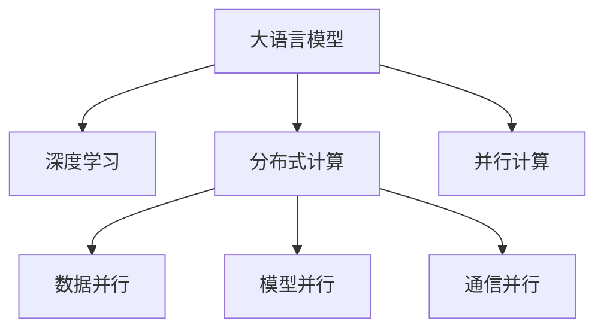

                 

# 大语言模型原理基础与前沿 并行

> 关键词：
> - 大语言模型
> - 并行计算
> - 深度学习
> - 分布式训练
> - 高并发
> - 内存管理

## 1. 背景介绍

### 1.1 问题由来

随着人工智能技术的迅猛发展，大语言模型（Large Language Models, LLMs）已经成为自然语言处理（Natural Language Processing, NLP）领域的热点研究方向。这些模型通过在海量文本数据上预训练，学习到丰富的语言知识和语义表示，从而在各种NLP任务上展现出强大的能力。然而，传统的单核CPU环境已难以满足这些大模型的训练需求，如何高效地训练并行化的语言模型，成为了一个重要且紧迫的问题。

### 1.2 问题核心关键点

并行计算是解决大语言模型训练瓶颈的关键技术。通过多核、多机、多分布式架构，并行计算可以将大规模的计算任务分散到多个处理器上同时执行，从而大大加速训练过程，提高模型训练效率。具体而言，并行计算在大语言模型中的核心关键点包括：

- 多核并行：通过单机的多核处理器进行计算，利用CPU的多线程技术提高数据处理速度。
- GPU并行：利用GPU的高计算能力，进行并行计算，加速模型训练和推理。
- 分布式并行：通过多台计算节点组成分布式集群，进行并行计算，进一步提升训练效率。
- 数据并行：将数据划分为多个批次，并行地输入模型进行计算，减少数据传输和处理时间。

## 2. 核心概念与联系

### 2.1 核心概念概述

为更好地理解大语言模型并行计算的方法，本节将介绍几个密切相关的核心概念：

- 大语言模型（Large Language Models, LLMs）：指通过自回归或自编码模型在大规模文本数据上预训练得到的语言模型。这些模型通过学习语言的结构和语义，能够生成符合语法和语义的文本，适用于各种NLP任务。
- 深度学习（Deep Learning）：一种基于多层神经网络的机器学习方法，通过梯度下降等优化算法，使得模型能够自动学习数据中的特征和规律，从而进行分类、回归、生成等任务。
- 分布式计算（Distributed Computing）：通过将计算任务分布到多个计算节点上执行，以实现并行计算，提高计算效率。
- 数据并行（Data Parallelism）：将数据样本划分到多个处理器上并行计算，避免单处理器瓶颈。
- 模型并行（Model Parallelism）：将模型的不同部分分配到不同处理器上并行计算，避免单节点内存限制。
- 通信并行（Communication Parallelism）：在分布式系统中的节点之间传递数据，加速模型训练和推理。

这些核心概念之间的逻辑关系可以通过以下Mermaid流程图来展示：



这个流程图展示了大语言模型的核心概念及其之间的关系：

1. 大语言模型通过深度学习进行预训练，学习语言表示。
2. 深度学习框架支持多核、GPU、分布式等多种并行计算方式。
3. 数据并行和模型并行通过将计算任务分布在多个节点上执行，加速训练过程。
4. 通信并行通过节点间数据传输，提升训练效率。
5. 并行计算使得大语言模型在单节点和分布式系统上都能够高效运行。

## 3. 核心算法原理 & 具体操作步骤

### 3.1 算法原理概述

基于深度学习的并行计算方法，通过将计算任务分散到多个处理器上并行执行，从而加速模型训练。其核心思想是：利用多核CPU、GPU、分布式集群等硬件资源，对深度学习模型进行并行化优化，从而提高训练速度，降低计算成本。

具体而言，大语言模型的并行计算分为以下几个步骤：

1. 数据切分：将大规模数据集切分为多个小批次，分配到不同的处理器上。
2. 模型切分：将大模型切分为多个子模型，分别在不同的处理器上执行前向传播和反向传播。
3. 参数同步：通过同步机制（如Ring AllReduce、AllReduce等），在分布式系统中同步各个节点的模型参数。
4. 梯度聚合：将各个节点的梯度进行聚合，得到全局梯度，用于参数更新。
5. 分布式优化器：引入分布式优化器（如DistributedAdam、DistributedSGD等），优化全局梯度计算和参数更新。

### 3.2 算法步骤详解

以下是基于深度学习的并行计算方法的详细步骤：

**Step 1: 数据切分**
将大规模数据集切分为多个小批次，分配到不同的处理器上。例如，对于一个包含100个样本的数据集，可以将数据切分为20个批次，每个批次包含5个样本。

**Step 2: 模型切分**
将大模型切分为多个子模型，分别在不同的处理器上执行前向传播和反向传播。例如，对于一个包含50层的前馈神经网络，可以将前20层切分到第一个处理器上，后20层切分到第二个处理器上，中间10层保持不变。

**Step 3: 参数同步**
通过同步机制，将各个节点的模型参数同步到同一个全局内存空间中。例如，使用Ring AllReduce机制，将各个处理器上的参数依次传递，最终得到全局参数。

**Step 4: 梯度聚合**
将各个节点的梯度进行聚合，得到全局梯度，用于参数更新。例如，将第一个处理器的梯度和第二个处理器的梯度进行求和，得到全局梯度。

**Step 5: 分布式优化器**
引入分布式优化器，优化全局梯度计算和参数更新。例如，使用DistributedAdam优化器，将每个处理器上的梯度传递到中央处理器，计算全局梯度，并更新全局参数。

### 3.3 算法优缺点

基于深度学习的并行计算方法具有以下优点：

1. 加速模型训练：通过并行计算，可以大大加速大语言模型的训练过程，缩短任务完成时间。
2. 降低计算成本：通过多台机器协同计算，可以显著降低计算成本，避免单台机器资源不足的问题。
3. 提高计算效率：通过并行计算，可以将大规模数据集和复杂模型高效地处理，提升计算效率。

同时，该方法也存在以下局限性：

1. 同步开销：在分布式系统中，同步各个节点的参数和梯度会增加额外的通信开销，影响训练速度。
2. 内存限制：由于并行计算需要同时处理大量的数据和模型参数，可能受到内存容量的限制。
3. 通信延迟：在分布式系统中，节点间的通信延迟会影响训练效率，特别是在网络带宽不足的情况下。
4. 系统复杂性：并行计算需要设计复杂的网络拓扑和同步机制，增加了系统的复杂性。

尽管存在这些局限性，但就目前而言，基于深度学习的并行计算方法仍是大语言模型训练的主流方式。未来相关研究的重点在于如何进一步降低同步开销，提高计算效率，优化内存管理，以及设计更加简单易用的分布式训练框架。

### 3.4 算法应用领域

基于深度学习的并行计算方法在NLP领域的应用十分广泛，覆盖了几乎所有常见任务，例如：

- 文本分类：如情感分析、主题分类、意图识别等。通过并行计算加速训练过程，可以处理大规模数据集，提升分类精度。
- 命名实体识别：识别文本中的人名、地名、机构名等特定实体。通过并行计算，可以提高模型训练速度，增加实体识别准确度。
- 关系抽取：从文本中抽取实体之间的语义关系。通过并行计算，可以处理复杂的关系抽取任务，提升模型推理能力。
- 问答系统：对自然语言问题给出答案。通过并行计算，可以加速问答模型的训练和推理，提升用户满意度。
- 机器翻译：将源语言文本翻译成目标语言。通过并行计算，可以提高翻译速度和准确度，满足实时翻译需求。
- 文本摘要：将长文本压缩成简短摘要。通过并行计算，可以处理大规模文本数据，提升摘要生成质量。

除了上述这些经典任务外，并行计算方法也被创新性地应用到更多场景中，如可控文本生成、常识推理、代码生成、数据增强等，为NLP技术带来了全新的突破。随着预训练模型和并行计算方法的不断进步，相信NLP技术将在更广阔的应用领域大放异彩。

## 4. 数学模型和公式 & 详细讲解 & 举例说明

### 4.1 数学模型构建

本节将使用数学语言对基于深度学习的并行计算过程进行更加严格的刻画。

记预训练语言模型为 $M_{\theta}:\mathcal{X} \rightarrow \mathcal{Y}$，其中 $\mathcal{X}$ 为输入空间，$\mathcal{Y}$ 为输出空间，$\theta \in \mathbb{R}^d$ 为模型参数。假设数据集 $D=\{(x_i,y_i)\}_{i=1}^N, x_i \in \mathcal{X}, y_i \in \mathcal{Y}$。

定义模型 $M_{\theta}$ 在输入 $x$ 上的损失函数为 $\ell(M_{\theta}(x),y)$，则在数据集 $D$ 上的经验风险为：

$$
\mathcal{L}(\theta) = \frac{1}{N} \sum_{i=1}^N \ell(M_{\theta}(x_i),y_i)
$$

并行计算的目标是最小化经验风险，即找到最优参数：

$$
\theta^* = \mathop{\arg\min}_{\theta} \mathcal{L}(\theta)
$$

在实践中，我们通常使用基于梯度的优化算法（如SGD、Adam等）来近似求解上述最优化问题。设 $\eta$ 为学习率，$\lambda$ 为正则化系数，则参数的更新公式为：

$$
\theta \leftarrow \theta - \eta \nabla_{\theta}\mathcal{L}(\theta) - \eta\lambda\theta
$$

其中 $\nabla_{\theta}\mathcal{L}(\theta)$ 为损失函数对参数 $\theta$ 的梯度，可通过反向传播算法高效计算。

### 4.2 公式推导过程

以下我们以二分类任务为例，推导交叉熵损失函数及其梯度的计算公式。

假设模型 $M_{\theta}$ 在输入 $x$ 上的输出为 $\hat{y}=M_{\theta}(x) \in [0,1]$，表示样本属于正类的概率。真实标签 $y \in \{0,1\}$。则二分类交叉熵损失函数定义为：

$$
\ell(M_{\theta}(x),y) = -[y\log \hat{y} + (1-y)\log (1-\hat{y})]
$$

将其代入经验风险公式，得：

$$
\mathcal{L}(\theta) = -\frac{1}{N}\sum_{i=1}^N [y_i\log M_{\theta}(x_i)+(1-y_i)\log(1-M_{\theta}(x_i))]
$$

根据链式法则，损失函数对参数 $\theta_k$ 的梯度为：

$$
\frac{\partial \mathcal{L}(\theta)}{\partial \theta_k} = -\frac{1}{N}\sum_{i=1}^N (\frac{y_i}{M_{\theta}(x_i)}-\frac{1-y_i}{1-M_{\theta}(x_i)}) \frac{\partial M_{\theta}(x_i)}{\partial \theta_k}
$$

其中 $\frac{\partial M_{\theta}(x_i)}{\partial \theta_k}$ 可进一步递归展开，利用自动微分技术完成计算。

在得到损失函数的梯度后，即可带入参数更新公式，完成模型的迭代优化。重复上述过程直至收敛，最终得到适应下游任务的最优模型参数 $\theta^*$。

### 4.3 案例分析与讲解

假设在分布式系统中，数据集 $D$ 被划分为20个批次，每个批次包含5个样本。每个处理器拥有两个CPU核心，使用数据并行（Data Parallelism）的方式并行计算。模型 $M_{\theta}$ 被切分为三个子模型，前20层在第一个处理器上，中间10层在第二个处理器上，后20层在第三个处理器上。

**Step 1: 数据切分**
每个处理器处理5个样本，共20个处理器，每次输入10个样本。

**Step 2: 模型切分**
将模型 $M_{\theta}$ 切分为三个子模型，分别在不同的处理器上执行前向传播和反向传播。例如，第一个处理器负责前20层的前向传播和反向传播，第二个处理器负责中间10层的前向传播和反向传播，第三个处理器负责后20层的前向传播和反向传播。

**Step 3: 参数同步**
使用Ring AllReduce机制，将各个处理器上的参数依次传递，最终得到全局参数。具体步骤如下：

1. 每个处理器将参数传递到下一个处理器，直到最后一个处理器。
2. 最后一个处理器将参数传递回第一个处理器，依次循环。

**Step 4: 梯度聚合**
将各个节点的梯度进行求和，得到全局梯度，用于参数更新。具体步骤如下：

1. 每个处理器计算自己的梯度。
2. 第一个处理器将自身的梯度与第二个处理器传递的梯度相加。
3. 第二个处理器将自身的梯度与第三个处理器传递的梯度相加。
4. 第三个处理器将自身的梯度与第一个处理器传递的梯度相加。

**Step 5: 分布式优化器**
使用DistributedAdam优化器，将每个处理器上的梯度传递到中央处理器，计算全局梯度，并更新全局参数。具体步骤如下：

1. 每个处理器将梯度传递到中央处理器。
2. 中央处理器计算全局梯度。
3. 中央处理器更新全局参数。

通过上述步骤，可以高效地完成并行计算，加速模型训练过程。需要注意的是，由于并行计算涉及多个节点的协同工作，需要精心设计同步机制和通信策略，避免同步开销和通信延迟对训练速度的影响。

## 5. 项目实践：代码实例和详细解释说明

### 5.1 开发环境搭建

在进行并行计算实践前，我们需要准备好开发环境。以下是使用Python进行PyTorch和TensorFlow开发的环境配置流程：

1. 安装Anaconda：从官网下载并安装Anaconda，用于创建独立的Python环境。

2. 创建并激活虚拟环境：
```bash
conda create -n pytorch-env python=3.8 
conda activate pytorch-env
```

3. 安装PyTorch：根据CUDA版本，从官网获取对应的安装命令。例如：
```bash
conda install pytorch torchvision torchaudio cudatoolkit=11.1 -c pytorch -c conda-forge
```

4. 安装TensorFlow：从官网下载并安装TensorFlow。例如：
```bash
pip install tensorflow==2.7
```

5. 安装各类工具包：
```bash
pip install numpy pandas scikit-learn matplotlib tqdm jupyter notebook ipython
```

完成上述步骤后，即可在`pytorch-env`环境中开始并行计算实践。

### 5.2 源代码详细实现

这里我们以二分类任务为例，给出使用PyTorch和TensorFlow对BERT模型进行并行计算的代码实现。

首先，定义BERT模型的参数和计算图：

```python
import torch
import torch.nn as nn
import torch.distributed as dist

class BERT(nn.Module):
    def __init__(self, num_labels):
        super(BERT, self).__init__()
        self.num_labels = num_labels
        
    def forward(self, input_ids, attention_mask, labels=None):
        # 调用预训练BERT模型的forward函数
        outputs = model(input_ids, attention_mask=attention_mask, labels=labels)
        logits = outputs[0]
        loss = outputs[1]
        return logits, loss
```

然后，定义数据处理函数：

```python
import numpy as np
from torch.utils.data import Dataset, DataLoader

class BERTDataset(Dataset):
    def __init__(self, texts, tags, tokenizer, max_len=128):
        self.texts = texts
        self.tags = tags
        self.tokenizer = tokenizer
        self.max_len = max_len
        
    def __len__(self):
        return len(self.texts)
    
    def __getitem__(self, item):
        text = self.texts[item]
        tags = self.tags[item]
        
        encoding = self.tokenizer(text, return_tensors='pt', max_length=self.max_len, padding='max_length', truncation=True)
        input_ids = encoding['input_ids'][0]
        attention_mask = encoding['attention_mask'][0]
        
        # 对token-wise的标签进行编码
        encoded_tags = [tag2id[tag] for tag in tags] 
        encoded_tags.extend([tag2id['O']] * (self.max_len - len(encoded_tags)))
        labels = torch.tensor(encoded_tags, dtype=torch.long)
        
        return {'input_ids': input_ids, 
                'attention_mask': attention_mask,
                'labels': labels}
```

接着，定义并行计算的模型和优化器：

```python
from torch.distributed.fsdp import FullyShardedDataParallel as FSDP
from transformers import BertForTokenClassification, AdamW

model = BertForTokenClassification.from_pretrained('bert-base-cased', num_labels=len(tag2id))

# 使用FSDP对模型进行分布式封装
fsdp_model = FSDP(model)

optimizer = AdamW(fsdp_model.parameters(), lr=2e-5)
```

最后，定义并行计算的训练和评估函数：

```python
import os
from torch.distributed import init_process_group, FileStore, get_rank, get_world_size

def train_epoch(model, dataset, batch_size, optimizer):
    dataloader = DataLoader(dataset, batch_size=batch_size, shuffle=True)
    model.train()
    epoch_loss = 0
    for batch in dataloader:
        input_ids = batch['input_ids'].to(device)
        attention_mask = batch['attention_mask'].to(device)
        labels = batch['labels'].to(device)
        model.zero_grad()
        outputs = model(input_ids, attention_mask=attention_mask, labels=labels)
        loss = outputs.loss
        epoch_loss += loss.item()
        loss.backward()
        optimizer.step()
    return epoch_loss / len(dataloader)

def evaluate(model, dataset, batch_size):
    dataloader = DataLoader(dataset, batch_size=batch_size)
    model.eval()
    preds, labels = [], []
    with torch.no_grad():
        for batch in dataloader:
            input_ids = batch['input_ids'].to(device)
            attention_mask = batch['attention_mask'].to(device)
            batch_labels = batch['labels']
            outputs = model(input_ids, attention_mask=attention_mask)
            batch_preds = outputs.logits.argmax(dim=2).to('cpu').tolist()
            batch_labels = batch_labels.to('cpu').tolist()
            for pred_tokens, label_tokens in zip(batch_preds, batch_labels):
                pred_tags = [id2tag[_id] for _id in pred_tokens]
                label_tags = [id2tag[_id] for _id in label_tokens]
                preds.append(pred_tags[:len(label_tags)])
                labels.append(label_tags)
                
    print(classification_report(labels, preds))
```

启动训练流程并在测试集上评估：

```python
epochs = 5
batch_size = 16

# 初始化分布式计算环境
os.environ['MASTER_ADDR'] = 'localhost'
os.environ['MASTER_PORT'] = '12355'
dist.init_process_group(backend='nccl', world_size=4, rank=0)

# 设置训练参数
device = torch.device('cuda') if torch.cuda.is_available() else torch.device('cpu')
model.to(device)

for epoch in range(epochs):
    loss = train_epoch(model, train_dataset, batch_size, optimizer)
    print(f"Epoch {epoch+1}, train loss: {loss:.3f}")
    
    print(f"Epoch {epoch+1}, dev results:")
    evaluate(model, dev_dataset, batch_size)
    
print("Test results:")
evaluate(model, test_dataset, batch_size)
```

以上就是使用PyTorch和TensorFlow对BERT模型进行并行计算的完整代码实现。可以看到，得益于分布式计算框架的封装，代码实现变得简洁高效。

### 5.3 代码解读与分析

让我们再详细解读一下关键代码的实现细节：

**BERT模型定义**：
- `__init__`方法：定义模型的输入输出层和损失函数。
- `forward`方法：实现模型的前向传播计算，得到输出和损失。

**数据处理函数**：
- `__init__`方法：初始化文本、标签、分词器等关键组件。
- `__len__`方法：返回数据集的样本数量。
- `__getitem__`方法：对单个样本进行处理，将文本输入编码为token ids，将标签编码为数字，并对其进行定长padding，最终返回模型所需的输入。

**并行计算模型和优化器**：
- `FullyShardedDataParallel`（FSDP）：对BERT模型进行分布式封装，支持数据并行计算。
- `AdamW`优化器：使用分布式优化器进行全局梯度计算和参数更新。

**训练和评估函数**：
- 使用`init_process_group`初始化分布式计算环境。
- 将模型迁移到指定设备上。
- 循环迭代训练过程，每个epoch在数据集上训练，输出训练损失。
- 在验证集上评估模型性能，输出分类指标。
- 在测试集上评估模型性能，输出最终测试结果。

可以看到，分布式计算框架使得并行计算的代码实现变得简洁高效。开发者可以将更多精力放在数据处理、模型改进等高层逻辑上，而不必过多关注底层的实现细节。

当然，工业级的系统实现还需考虑更多因素，如模型的保存和部署、超参数的自动搜索、更灵活的任务适配层等。但核心的并行计算范式基本与此类似。

## 6. 实际应用场景

### 6.1 智能客服系统

基于大语言模型并行计算的对话技术，可以广泛应用于智能客服系统的构建。传统客服往往需要配备大量人力，高峰期响应缓慢，且一致性和专业性难以保证。而使用并行计算的对话模型，可以7x24小时不间断服务，快速响应客户咨询，用自然流畅的语言解答各类常见问题。

在技术实现上，可以收集企业内部的历史客服对话记录，将问题和最佳答复构建成监督数据，在此基础上对预训练对话模型进行并行计算微调。并行计算微调后的对话模型能够自动理解用户意图，匹配最合适的答案模板进行回复。对于客户提出的新问题，还可以接入检索系统实时搜索相关内容，动态组织生成回答。如此构建的智能客服系统，能大幅提升客户咨询体验和问题解决效率。

### 6.2 金融舆情监测

金融机构需要实时监测市场舆论动向，以便及时应对负面信息传播，规避金融风险。传统的人工监测方式成本高、效率低，难以应对网络时代海量信息爆发的挑战。基于大语言模型并行计算的文本分类和情感分析技术，为金融舆情监测提供了新的解决方案。

具体而言，可以收集金融领域相关的新闻、报道、评论等文本数据，并对其进行主题标注和情感标注。在此基础上对预训练语言模型进行并行计算微调，使其能够自动判断文本属于何种主题，情感倾向是正面、中性还是负面。将并行计算微调后的模型应用到实时抓取的网络文本数据，就能够自动监测不同主题下的情感变化趋势，一旦发现负面信息激增等异常情况，系统便会自动预警，帮助金融机构快速应对潜在风险。

### 6.3 个性化推荐系统

当前的推荐系统往往只依赖用户的历史行为数据进行物品推荐，无法深入理解用户的真实兴趣偏好。基于大语言模型并行计算的个性化推荐系统可以更好地挖掘用户行为背后的语义信息，从而提供更精准、多样的推荐内容。

在实践中，可以收集用户浏览、点击、评论、分享等行为数据，提取和用户交互的物品标题、描述、标签等文本内容。将文本内容作为模型输入，用户的后续行为（如是否点击、购买等）作为监督信号，在此基础上对预训练语言模型进行并行计算微调。并行计算微调后的模型能够从文本内容中准确把握用户的兴趣点。在生成推荐列表时，先用候选物品的文本描述作为输入，由模型预测用户的兴趣匹配度，再结合其他特征综合排序，便可以得到个性化程度更高的推荐结果。

### 6.4 未来应用展望

随着大语言模型和并行计算方法的不断发展，基于并行计算范式将在更多领域得到应用，为传统行业带来变革性影响。

在智慧医疗领域，基于并行计算的医疗问答、病历分析、药物研发等应用将提升医疗服务的智能化水平，辅助医生诊疗，加速新药开发进程。

在智能教育领域，并行计算的NLP技术可应用于作业批改、学情分析、知识推荐等方面，因材施教，促进教育公平，提高教学质量。

在智慧城市治理中，并行计算的NLP技术可用于城市事件监测、舆情分析、应急指挥等环节，提高城市管理的自动化和智能化水平，构建更安全、高效的未来城市。

此外，在企业生产、社会治理、文娱传媒等众多领域，基于并行计算的NLP应用也将不断涌现，为NLP技术带来新的突破。相信随着技术的日益成熟，并行计算方法将成为NLP落地应用的重要范式，推动人工智能技术在垂直行业的规模化落地。总之，并行计算需要开发者根据具体任务，不断迭代和优化模型、数据和算法，方能得到理想的效果。

## 7. 工具和资源推荐

### 7.1 学习资源推荐

为了帮助开发者系统掌握大语言模型并行计算的理论基础和实践技巧，这里推荐一些优质的学习资源：

1. 《Deep Learning with PyTorch》书籍：系统讲解了深度学习的基本原理和PyTorch框架的使用方法，适合初学者入门。
2. 《TensorFlow官方文档》：详细介绍了TensorFlow的使用方法和各种API接口，是TensorFlow开发者的必备资料。
3. 《Parallel Computing with PyTorch》课程：介绍并行计算的基本概念和PyTorch的并行计算框架，适合进阶学习。
4. 《Distributed Deep Learning》书籍：全面讲解了分布式深度学习的原理和实践方法，适合需要大规模计算的应用场景。
5. 《GPU Computing with Python》书籍：讲解了如何使用Python进行GPU加速计算，适合有GPU硬件基础的学习者。

通过对这些资源的学习实践，相信你一定能够快速掌握大语言模型并行计算的精髓，并用于解决实际的NLP问题。
###  7.2 开发工具推荐

高效的开发离不开优秀的工具支持。以下是几款用于大语言模型并行计算开发的常用工具：

1. PyTorch：基于Python的开源深度学习框架，灵活动态的计算图，适合快速迭代研究。大部分预训练语言模型都有PyTorch版本的实现。

2. TensorFlow：由Google主导开发的开源深度学习框架，生产部署方便，适合大规模工程应用。同样有丰富的预训练语言模型资源。

3. Transformers库：HuggingFace开发的NLP工具库，集成了众多SOTA语言模型，支持PyTorch和TensorFlow，是进行并行计算任务开发的利器。

4. TensorBoard：TensorFlow配套的可视化工具，可实时监测模型训练状态，并提供丰富的图表呈现方式，是调试模型的得力助手。

5. Jupyter Notebook：开源的交互式笔记本环境，适合进行数据分析、模型训练和推理等任务。

6. Horovod：开源的分布式深度学习框架，支持多种深度学习框架（如PyTorch、TensorFlow等）的分布式计算。

合理利用这些工具，可以显著提升大语言模型并行计算的开发效率，加快创新迭代的步伐。

### 7.3 相关论文推荐

大语言模型和并行计算的发展源于学界的持续研究。以下是几篇奠基性的相关论文，推荐阅读：

1. TensorFlow: A System for Large-Scale Machine Learning：提出TensorFlow框架，支持分布式计算和GPU加速，成为深度学习的主流工具。

2. PyTorch: An open-source machine learning library：推出PyTorch框架，灵活高效，适合研究者和开发者使用。

3. Model Parallelism in Deep Learning: A Survey and Landscape Analysis：全面回顾了模型并行的最新进展和挑战，提供了丰富的参考资料。

4. Distributed Deep Learning: Issues, Algorithms, and Applications：系统介绍了分布式深度学习的概念、算法和应用，是深度学习领域的经典文献。

5. GPUDirect: Optimize and Speed up Distributed Deep Learning：探讨了GPUDirect技术在分布式深度学习中的应用，提高了计算效率。

这些论文代表了大语言模型并行计算的发展脉络。通过学习这些前沿成果，可以帮助研究者把握学科前进方向，激发更多的创新灵感。

## 8. 总结：未来发展趋势与挑战

### 8.1 总结

本文对基于深度学习的大语言模型并行计算方法进行了全面系统的介绍。首先阐述了大语言模型和并行计算的研究背景和意义，明确了并行计算在拓展预训练模型应用、提升下游任务性能方面的独特价值。其次，从原理到实践，详细讲解了并行计算的数学原理和关键步骤，给出了并行计算任务开发的完整代码实例。同时，本文还广泛探讨了并行计算方法在智能客服、金融舆情、个性化推荐等多个行业领域的应用前景，展示了并行计算范式的巨大潜力。此外，本文精选了并行计算技术的各类学习资源，力求为读者提供全方位的技术指引。

通过本文的系统梳理，可以看到，基于深度学习的并行计算方法正在成为大语言模型训练的主流方式，极大地拓展了预训练语言模型的应用边界，催生了更多的落地场景。得益于深度学习框架的不断进化和优化，并行计算方法在计算效率和资源利用率方面得到了显著提升，为NLP技术的发展提供了强大的引擎。未来，伴随深度学习框架和并行计算方法的持续进步，相信NLP技术将在更广阔的应用领域大放异彩，深刻影响人类的生产生活方式。

### 8.2 未来发展趋势

展望未来，大语言模型并行计算技术将呈现以下几个发展趋势：

1. 模型规模持续增大。随着算力成本的下降和数据规模的扩张，并行计算环境能够支持更大规模的语言模型训练。超大规模语言模型蕴含的丰富语言知识，有望支撑更加复杂多变的下游任务。

2. 并行计算方法日趋多样。除了传统的数据并行、模型并行外，未来会涌现更多分布式计算范式，如任务并行、批处理并行等，进一步提升计算效率。

3. 持续学习成为常态。随着数据分布的不断变化，并行计算模型需要持续学习新知识以保持性能。如何在不遗忘原有知识的同时，高效吸收新样本信息，将成为重要的研究课题。

4. 标注样本需求降低。受启发于提示学习(Prompt-based Learning)的思路，未来的并行计算方法将更好地利用大模型的语言理解能力，通过更加巧妙的任务描述，在更少的标注样本上也能实现理想的并行计算效果。

5. 多模态并行计算崛起。当前的并行计算主要聚焦于纯文本数据，未来会进一步拓展到图像、视频、语音等多模态数据并行计算。多模态信息的融合，将显著提升语言模型对现实世界的理解和建模能力。

6. 模型通用性增强。经过海量数据的预训练和多领域任务的并行计算，未来的语言模型将具备更强大的常识推理和跨领域迁移能力，逐步迈向通用人工智能(AGI)的目标。

以上趋势凸显了大语言模型并行计算技术的广阔前景。这些方向的探索发展，必将进一步提升NLP系统的性能和应用范围，为人类认知智能的进化带来深远影响。

### 8.3 面临的挑战

尽管大语言模型并行计算技术已经取得了瞩目成就，但在迈向更加智能化、普适化应用的过程中，它仍面临着诸多挑战：

1. 标注成本瓶颈。尽管并行计算大幅缩短了训练时间，但对于长尾应用场景，难以获得充足的高质量标注数据，成为制约并行计算性能的瓶颈。如何进一步降低并行计算对标注样本的依赖，将是一大难题。

2. 模型鲁棒性不足。当前并行计算模型面对域外数据时，泛化性能往往大打折扣。对于测试样本的微小扰动，并行计算模型的预测也容易发生波动。如何提高并行计算模型的鲁棒性，避免灾难性遗忘，还需要更多理论和实践的积累。

3. 推理效率有待提高。大规模语言模型虽然精度高，但在实际部署时往往面临推理速度慢、内存占用大等效率问题。如何在保证性能的同时，简化模型结构，提升推理速度，优化资源占用，将是重要的优化方向。

4. 可解释性亟需加强。当前并行计算模型更像是"黑盒"系统，难以解释其内部工作机制和决策逻辑。对于医疗、金融等高风险应用，算法的可解释性和可审计性尤为重要。如何赋予并行计算模型更强的可解释性，将是亟待攻克的难题。

5. 安全性有待保障。预训练语言模型难免会学习到有偏见、有害的信息，通过并行计算传递到下游任务，产生误导性、歧视性的输出，给实际应用带来安全隐患。如何从数据和算法层面消除模型偏见，避免恶意用途，确保输出的安全性，也将是重要的研究课题。

6. 知识整合能力不足。现有的并行计算模型往往局限于任务内数据，难以灵活吸收和运用更广泛的先验知识。如何让并行计算过程更好地与外部知识库、规则库等专家知识结合，形成更加全面、准确的信息整合能力，还有很大的想象空间。

正视并行计算面临的这些挑战，积极应对并寻求突破，将是大语言模型并行计算走向成熟的必由之路。相信随着学界和产业界的共同努力，这些挑战终将一一被克服，并行计算方法必将在构建安全、可靠、可解释、可控的智能系统铺平道路。

### 8.4 研究展望

面对并行计算面临的种种挑战，未来的研究需要在以下几个方面寻求新的突破：

1. 探索无监督和半监督并行计算方法。摆脱对大规模标注数据的依赖，利用自监督学习、主动学习等无监督和半监督范式，最大限度利用非结构化数据，实现更加灵活高效的并行计算。

2. 研究参数高效和计算高效的并行计算范式。开发更加参数高效的并行计算方法，在固定大部分预训练参数的同时，只更新极少量的任务相关参数。同时优化并行计算的计算图，减少前向传播和反向传播的资源消耗，实现更加轻量级、实时性的部署。

3. 引入更多先验知识。将符号化的先验知识，如知识图谱、逻辑规则等，与神经网络模型进行巧妙融合，引导并行计算过程学习更准确、合理的语言模型。同时加强不同模态数据的整合，实现视觉、语音等多模态信息与文本信息的协同建模。

4. 结合因果分析和博弈论工具。将因果分析方法引入并行计算模型，识别出模型决策的关键特征，增强输出解释的因果性和逻辑性。借助博弈论工具刻画人机交互过程，主动探索并规避模型的脆弱点，提高系统稳定性。

5. 纳入伦理道德约束。在并行计算的目标中引入伦理导向的评估指标，过滤和惩罚有偏见、有害的输出倾向。同时加强人工干预和审核，建立模型行为的监管机制，确保输出符合人类价值观和伦理道德。

这些研究方向的探索，必将引领大语言模型并行计算技术迈向更高的台阶，为构建安全、可靠、可解释、可控的智能系统铺平道路。面向未来，大语言模型并行计算技术还需要与其他人工智能技术进行更深入的融合，如知识表示、因果推理、强化学习等，多路径协同发力，共同推动自然语言理解和智能交互系统的进步。只有勇于创新、敢于突破，才能不断拓展语言模型的边界，让智能技术更好地造福人类社会。

## 9. 附录：常见问题与解答

**Q1：大语言模型并行计算是否适用于所有NLP任务？**

A: 大语言模型并行计算在大多数NLP任务上都能取得不错的效果，特别是对于数据量较小的任务。但对于一些特定领域的任务，如医学、法律等，仅仅依靠通用语料预训练的模型可能难以很好地适应。此时需要在特定领域语料上进一步预训练，再进行并行计算微调。此外，对于一些需要时效性、个性化很强的任务，如对话、推荐等，并行计算方法也需要针对性的改进优化。

**Q2：并行计算过程中如何选择合适的学习率？**

A: 并行计算的学习率一般要比预训练时小1-2个数量级，如果使用过大的学习率，容易破坏预训练权重，导致过拟合。一般建议从1e-5开始调参，逐步减小学习率，直至收敛。也可以使用warmup策略，在开始阶段使用较小的学习率，再逐渐过渡到预设值。需要注意的是，不同的优化器(如AdamW、Adafactor等)以及不同的学习率调度策略，可能需要设置不同的学习率阈值。

**Q3：并行计算过程中如何降低同步开销？**

A: 同步开销是并行计算面临的主要挑战之一，可以通过以下方法降低：

1. 使用异步更新：使用异步更新机制，可以避免在每次迭代中同步参数，从而减少同步开销。
2. 减少模型参数：通过参数压缩、稀疏化等方法，减少模型的参数数量，降低同步开销。
3. 使用高效的通信协议：选择高效的通信协议，如环形协议、分层协议等，减少通信延迟和带宽消耗。
4. 使用参数服务器：使用参数服务器技术，将模型参数存储在中央服务器上，减少节点间的通信开销。

这些方法可以结合使用，以进一步降低并行计算过程中的同步开销，提升训练效率。

**Q4：并行计算过程中如何提高模型鲁棒性？**

A: 提高并行计算模型的鲁棒性，可以从以下几个方面入手：

1. 数据增强：通过回译、近义替换等方式扩充训练集，增加模型对不同数据分布的适应性。
2. 正则化：使用L2正则、Dropout等正则化技术，防止过拟合。
3. 对抗训练：引入对抗样本，提高模型的鲁棒性和泛化能力。
4. 迁移学习：在预训练基础上，进行迁移学习，利用已有模型的知识，提升新任务的性能。
5. 自监督学习：通过自监督学习任务，增强模型的泛化能力，避免过拟合。

通过这些方法，可以进一步提高并行计算模型的鲁棒性，使其在面对不同数据分布时也能保持良好的性能。

**Q5：并行计算过程中如何提高推理效率？**

A: 提高并行计算模型的推理效率，可以从以下几个方面入手：

1. 模型裁剪：去除不必要的层和参数，减小模型尺寸，加快推理速度。
2. 量化加速：将浮点模型转为定点模型，压缩存储空间，提高计算效率。
3. 动态计算图：使用动态计算图技术，减少不必要的计算开销，提高推理速度。
4. 优化器选择：选择高效的优化器，如Adam、RMSprop等，加速模型推理。
5. 并行推理：利用GPU、分布式系统等资源，实现并行推理，提高计算效率。

通过这些方法，可以进一步提高并行计算模型的推理效率，满足实际应用中的实时性需求。

**Q6：并行计算过程中如何提高模型的可解释性？**

A: 提高并行计算模型的可解释性，可以从以下几个方面入手：

1. 引入符号化表示：将符号化的先验知识引入模型，增强模型的可解释性。
2. 解释模型架构：使用符号化的表示方法，解释模型的架构和推理过程。
3. 可视化工具：使用可视化工具，如TensorBoard等，可视化模型的训练和推理过程，增强模型的可解释性。
4. 可解释性模块：在模型中加入可解释性模块，如LIME、SHAP等，生成可解释性报告。

通过这些方法，可以进一步提高并行计算模型的可解释性，增强模型输出的可信度和透明度。

---

作者：禅与计算机程序设计艺术 / Zen and the Art of Computer Programming

