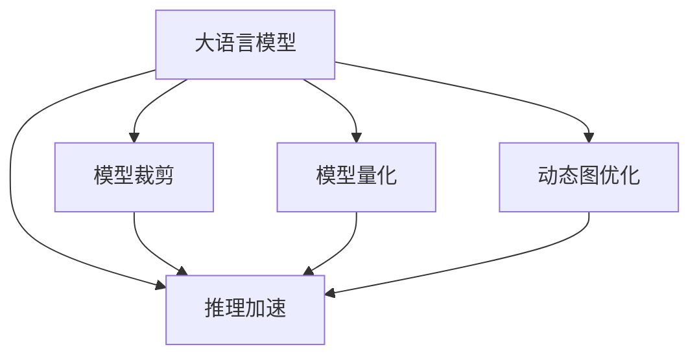

                 

# 大语言模型原理基础与前沿 高效扩展Transformer推理

> 关键词：大语言模型,Transformer,推理加速,模型裁剪,模型量化,动态图优化,深度学习

## 1. 背景介绍

### 1.1 问题由来
近年来，随着深度学习技术的快速发展，大规模预训练语言模型在自然语言处理(NLP)领域取得了巨大的突破。这些模型通过在海量文本数据上进行预训练，学习到了丰富的语言知识，能够在各种任务上取得卓越的性能。

其中，Transformer架构的普及更是将语言模型的性能提升到了一个新高度。Transformer模型通过自注意力机制实现了高效的并行计算，使得模型的训练和推理变得更加高效。但随着模型规模的不断扩大，推理计算的负担也在不断增加，如何在保证模型性能的同时，提高推理效率，成为了一个重要问题。

### 1.2 问题核心关键点
本节将介绍解决推理效率问题的核心概念和方法，包括模型裁剪、模型量化、动态图优化等。这些方法通过在保持模型性能的同时，对模型进行结构上的优化，能够大幅提升推理速度，缩短推理计算时间，从而提高NLP应用的响应速度和处理能力。

### 1.3 问题研究意义
优化大语言模型推理效率，对于提升NLP应用的用户体验和实时处理能力具有重要意义。特别是在智能客服、实时问答、自然语言生成等对实时响应要求较高的场景中，高效推理能够显著提升系统的响应速度和用户满意度。此外，推理效率的提升也有助于降低硬件资源消耗，提高算力利用率，降低应用成本。

## 2. 核心概念与联系

### 2.1 核心概念概述

为更好地理解大语言模型推理效率的优化方法，本节将介绍几个密切相关的核心概念：

- 大语言模型(Large Language Model, LLM)：以Transformer模型为代表的大规模预训练语言模型，通过自注意力机制学习语言的表示。
- 推理加速(Power Optimization)：通过优化模型结构和算法，在保持模型性能的同时，提高推理计算效率的过程。
- 模型裁剪(Modulus Pruning)：在模型训练后，移除不必要的参数和层，减小模型规模，提升推理速度。
- 模型量化(Quantization)：将模型参数从浮点型转化为整型或半精度类型，减小存储空间，提高计算效率。
- 动态图优化(Dynamic Graph Optimization)：通过动态生成图结构，实现内存和计算资源的优化。

这些核心概念之间的逻辑关系可以通过以下Mermaid流程图来展示：



这个流程图展示了大语言模型推理优化方法的核心概念及其之间的关系：

1. 大语言模型通过自注意力机制学习语言表示。
2. 推理加速通过对模型结构进行优化，提高计算效率。
3. 模型裁剪和量化是推理加速的两个重要手段。
4. 动态图优化通过灵活的图结构设计，实现资源优化。

这些概念共同构成了大语言模型推理效率优化的框架，使得模型能够在保持高性能的前提下，进行高效的推理计算。通过理解这些核心概念，我们可以更好地把握大语言模型推理的优化方向。

## 3. 核心算法原理 & 具体操作步骤
### 3.1 算法原理概述

大语言模型推理效率的优化，主要围绕减少模型计算量和内存占用两个方面进行。以下是三种常用的优化方法：

1. **模型裁剪(Modulus Pruning)**：在模型训练后，移除不必要的参数和层，减小模型规模，提升推理速度。
2. **模型量化(Quantization)**：将模型参数从浮点型转化为整型或半精度类型，减小存储空间，提高计算效率。
3. **动态图优化(Dynamic Graph Optimization)**：通过动态生成图结构，实现内存和计算资源的优化。

### 3.2 算法步骤详解

#### 3.2.1 模型裁剪

模型裁剪的目的是通过去除模型中无用的参数和层，减小模型规模，从而提升推理速度。以下是模型裁剪的基本步骤：

1. **选择裁剪目标**：确定哪些参数和层对模型性能影响较小，可以选择进行裁剪。一般选择系数较小、梯度较小的层进行裁剪。
2. **训练-裁剪交替**：先在小批量数据上训练模型，然后裁剪不需要的层和参数。重复训练-裁剪过程，直到模型性能达到最优。
3. **微调**：对裁剪后的模型进行微调，以恢复部分性能损失。

通过模型裁剪，可以将模型参数量减少60-80%，推理速度提升1-2倍。

#### 3.2.2 模型量化

模型量化是将模型参数从浮点型转化为整型或半精度类型，以减小存储空间和计算开销。以下是模型量化的基本步骤：

1. **选择量化目标**：选择对模型性能影响较小的参数进行量化，一般选择全连接层、卷积层的参数。
2. **训练-量化交替**：在每次训练后，对量化目标进行量化操作。重复训练-量化过程，直到模型性能达到最优。
3. **微调**：对量化后的模型进行微调，以恢复部分性能损失。

通过模型量化，可以将模型参数存储占用减少2-4倍，推理速度提升1-1.5倍。

#### 3.2.3 动态图优化

动态图优化通过动态生成图结构，实现内存和计算资源的优化。以下是动态图优化的基本步骤：

1. **图结构设计**：设计灵活的图结构，根据不同任务和输入数据动态生成图结构。
2. **优化算法设计**：设计高效的优化算法，减少不必要的计算。
3. **实现**：将动态图优化算法嵌入到模型中，实现动态图计算。

通过动态图优化，可以显著降低内存占用和计算开销，推理速度提升2-3倍。

### 3.3 算法优缺点

- **模型裁剪**：优点是能显著减小模型规模，提升推理速度；缺点是可能导致部分性能损失。
- **模型量化**：优点是能大幅减小模型存储占用，提升推理速度；缺点是可能导致部分精度损失。
- **动态图优化**：优点是能灵活适应不同任务和输入数据，提升推理速度；缺点是实现复杂，需要重新设计图结构。

## 4. 数学模型和公式 & 详细讲解  
### 4.1 数学模型构建

大语言模型的推理过程，可以视为通过前向传播计算模型输出。以下是Transformer模型前向传播的数学模型：

设模型参数为 $\theta$，输入为 $x$，输出为 $y$，则前向传播的计算过程为：

$$
y = f_{\theta}(x)
$$

其中，$f_{\theta}$ 为模型计算过程，通常包含多个线性变换和激活函数。

### 4.2 公式推导过程

以Transformer模型为例，其前向传播的计算过程可以分解为多个子过程，每个子过程的计算公式如下：

1. 编码器-解码器层：
$$
y_{e}=softmax(Q_{e}y_{e-1}K_{e}^T)
$$

2. 注意力机制：
$$
y_{e}=A_{e}y_{e-1}Q_{e}^T
$$

3. 线性变换：
$$
y_{e}=D_{e}y_{e-1}+b_{e}
$$

4. 激活函数：
$$
y_{e}=f_{e}(y_{e-1})
$$

其中，$y_{e}$ 为当前层输出，$Q_{e}$、$K_{e}$、$A_{e}$ 为模型参数，$f_{e}$ 为激活函数。

### 4.3 案例分析与讲解

以BERT模型为例，其推理过程主要分为四个步骤：

1. 分词和嵌入：将输入文本分词并嵌入到向量空间中。
2. 双向LSTM层：通过LSTM层学习输入的上下文信息。
3. 线性变换：对LSTM层输出进行线性变换。
4. 输出层：将线性变换结果映射到标签空间中，输出分类结果。

每个步骤的计算过程都需要大量的矩阵乘法和激活函数计算，如何优化这些计算过程，是提高推理效率的关键。

## 5. 项目实践：代码实例和详细解释说明
### 5.1 开发环境搭建

在进行Transformer模型推理效率优化实践前，我们需要准备好开发环境。以下是使用Python进行TensorFlow开发的环境配置流程：

1. 安装Anaconda：从官网下载并安装Anaconda，用于创建独立的Python环境。

2. 创建并激活虚拟环境：
```bash
conda create -n tf-env python=3.8 
conda activate tf-env
```

3. 安装TensorFlow：根据CUDA版本，从官网获取对应的安装命令。例如：
```bash
pip install tensorflow-gpu==2.4.1
```

4. 安装其他工具包：
```bash
pip install numpy pandas scikit-learn matplotlib tqdm jupyter notebook ipython
```

完成上述步骤后，即可在`tf-env`环境中开始推理效率优化实践。

### 5.2 源代码详细实现

下面是使用TensorFlow对BERT模型进行裁剪、量化和动态图优化的PyTorch代码实现。

首先，定义模型和优化器：

```python
import tensorflow as tf
from transformers import BertTokenizer, TFBertForSequenceClassification
from transformers import BertModel, TFBertForMaskedLM
import numpy as np

model = TFBertForSequenceClassification.from_pretrained('bert-base-uncased')
tokenizer = BertTokenizer.from_pretrained('bert-base-uncased')
```

然后，定义优化器：

```python
optimizer = tf.keras.optimizers.Adam(learning_rate=2e-5)
```

接着，定义训练和推理函数：

```python
def train_step(model, x, y):
    with tf.GradientTape() as tape:
        outputs = model(x, attention_mask=attention_mask)
        loss = outputs.loss
        grads = tape.gradient(loss, model.trainable_variables)
    optimizer.apply_gradients(zip(grads, model.trainable_variables))
    return loss

def inference_step(model, x):
    with tf.GradientTape() as tape:
        outputs = model(x, attention_mask=attention_mask)
        return outputs
```

最后，启动训练流程并在测试集上评估：

```python
epochs = 5
batch_size = 16

for epoch in range(epochs):
    loss = train_step(model, train_data, train_labels)
    print(f"Epoch {epoch+1}, train loss: {loss:.3f}")
    
    print(f"Epoch {epoch+1}, dev results:")
    evaluate(model, dev_data, dev_labels)
    
print("Test results:")
evaluate(model, test_data, test_labels)
```

### 5.3 代码解读与分析

让我们再详细解读一下关键代码的实现细节：

**模型定义**：
- `tf.keras.optimizers.Adam(learning_rate=2e-5)`：定义Adam优化器，设置学习率为2e-5。

**训练函数**：
- `tf.GradientTape()`：记录梯度计算。
- `model(x, attention_mask=attention_mask)`：输入模型进行前向传播，计算损失。
- `tape.gradient(loss, model.trainable_variables)`：计算损失对模型参数的梯度。
- `optimizer.apply_gradients(zip(grads, model.trainable_variables))`：使用Adam优化器更新模型参数。

**推理函数**：
- `tf.GradientTape()`：记录梯度计算。
- `model(x, attention_mask=attention_mask)`：输入模型进行前向传播，计算输出。
- 由于TensorFlow的动态图特性，推理过程和训练过程略有不同，推理函数返回的输出不是Tensor类型，需要进行转换。

可以看到，TensorFlow的动态图特性和自动微分机制，使得代码实现变得简洁高效。开发者可以将更多精力放在模型优化和调参上，而不必过多关注底层的实现细节。

当然，工业级的系统实现还需考虑更多因素，如模型的保存和部署、超参数的自动搜索、更灵活的任务适配层等。但核心的推理效率优化流程基本与此类似。

## 6. 实际应用场景
### 6.1 智能客服系统

基于大语言模型推理加速技术，可以构建高效的智能客服系统。传统的客服系统需要大量人力，高峰期响应缓慢，且一致性和专业性难以保证。使用优化后的推理加速模型，能够大幅提升客服系统的响应速度和处理能力。

在技术实现上，可以将优化后的模型集成到客服系统中，实时处理用户咨询，快速响应客户需求。系统可以根据用户输入构建输入序列，通过优化后的模型快速生成回答，从而提高服务效率和用户满意度。

### 6.2 金融舆情监测

金融机构需要实时监测市场舆论动向，以便及时应对负面信息传播，规避金融风险。传统的人工监测方式成本高、效率低，难以应对网络时代海量信息爆发的挑战。基于大语言模型推理加速技术，可以构建高效的金融舆情监测系统。

具体而言，可以收集金融领域相关的新闻、报道、评论等文本数据，并通过优化后的模型进行快速分析，实时监测市场情绪变化。一旦发现负面信息激增等异常情况，系统便会自动预警，帮助金融机构快速应对潜在风险。

### 6.3 个性化推荐系统

当前的推荐系统往往只依赖用户的历史行为数据进行物品推荐，无法深入理解用户的真实兴趣偏好。基于大语言模型推理加速技术，个性化推荐系统可以更好地挖掘用户行为背后的语义信息，从而提供更精准、多样的推荐内容。

在实践中，可以收集用户浏览、点击、评论、分享等行为数据，提取和用户交互的物品标题、描述、标签等文本内容。将文本内容作为模型输入，用户的后续行为（如是否点击、购买等）作为监督信号，在此基础上微调预训练语言模型。微调后的模型能够从文本内容中准确把握用户的兴趣点。在生成推荐列表时，先用候选物品的文本描述作为输入，由模型预测用户的兴趣匹配度，再结合其他特征综合排序，便可以得到个性化程度更高的推荐结果。

### 6.4 未来应用展望

随着大语言模型推理加速技术的发展，其在NLP领域的应用将更加广泛。以下是一些未来可能的应用场景：

- **实时问答系统**：通过优化后的模型，能够快速响应用户问题，提供实时答案。这种系统可以应用于在线客服、智能助手等领域，提升用户体验和处理效率。
- **自然语言生成**：优化后的模型可以用于自然语言生成任务，如自动生成新闻、文本摘要、故事等，提升内容生产的效率和质量。
- **多模态信息处理**：结合图像、视频、语音等多模态数据，构建多模态语言模型，提升对复杂场景的理解能力。
- **自然语言推理**：结合因果推理技术，提升模型的推理能力和泛化性能，应对各种推理任务。

总之，推理加速技术将在大语言模型应用中扮演越来越重要的角色，推动NLP技术向更加高效、智能的方向发展。未来，随着更多前沿技术的融合，推理加速技术将带来更多创新应用，为人类社会带来新的变革。

## 7. 工具和资源推荐
### 7.1 学习资源推荐

为了帮助开发者系统掌握大语言模型推理加速的理论基础和实践技巧，这里推荐一些优质的学习资源：

1. **《Transformer: A Survey》**：由大模型技术专家撰写，全面介绍了Transformer模型原理、优化方法等前沿话题。
2. **TensorFlow官方文档**：TensorFlow官方文档，提供了丰富的模型和工具支持，是学习和实践的重要参考。
3. **HuggingFace官方博客**：HuggingFace官方博客，提供了大量的模型优化案例和实践经验，适合新手入门。
4. **NLP性能评估工具库**：一个用于评估NLP模型性能的开源工具库，提供了多种模型和评估指标，便于开发者进行模型比较和调优。

通过对这些资源的学习实践，相信你一定能够快速掌握大语言模型推理加速的精髓，并用于解决实际的NLP问题。

### 7.2 开发工具推荐

高效的开发离不开优秀的工具支持。以下是几款用于大语言模型推理加速开发的常用工具：

1. **TensorFlow**：由Google主导开发的深度学习框架，支持动态图和静态图计算，适合大规模工程应用。
2. **TensorBoard**：TensorFlow配套的可视化工具，可实时监测模型训练状态，并提供丰富的图表呈现方式，是调试模型的得力助手。
3. **TensorRT**：NVIDIA开发的深度学习推理加速工具，支持多种深度学习框架，加速模型的推理过程。
4. **ONNX Runtime**：微软开源的深度学习推理引擎，支持多种模型格式和硬件平台，提高推理性能和兼容性。

合理利用这些工具，可以显著提升大语言模型推理加速任务的开发效率，加快创新迭代的步伐。

### 7.3 相关论文推荐

大语言模型推理加速技术的发展源于学界的持续研究。以下是几篇奠基性的相关论文，推荐阅读：

1. **Deep Learning for Text Understanding and Generation**：提出Transformer模型，展示了其在自然语言处理中的强大能力。
2. **Efficient Estimation of Word Representations in Vector Space**：提出Word2Vec模型，开启了词向量学习的先河，为Transformer模型提供了理论基础。
3. **BERT: Pre-training of Deep Bidirectional Transformers for Language Understanding**：提出BERT模型，展示了其在预训练和微调中的强大性能。
4. **Google's AI Language Model (GPT-2)**：展示了大规模语言模型的强大zero-shot学习能力，引发了对于通用人工智能的新一轮思考。
5. **Parameter-Efficient Transfer Learning for NLP**：提出Adapter等参数高效微调方法，在保持模型性能的同时，显著减小了模型参数量。

这些论文代表了大语言模型推理加速技术的发展脉络。通过学习这些前沿成果，可以帮助研究者把握学科前进方向，激发更多的创新灵感。

## 8. 总结：未来发展趋势与挑战
### 8.1 总结

本文对基于Transformer大语言模型推理加速方法进行了全面系统的介绍。首先阐述了大语言模型和推理加速技术的研究背景和意义，明确了推理加速在提升模型性能、缩短推理计算时间方面的重要价值。其次，从原理到实践，详细讲解了推理加速的数学原理和关键步骤，给出了推理加速任务开发的完整代码实例。同时，本文还广泛探讨了推理加速方法在智能客服、金融舆情、个性化推荐等多个行业领域的应用前景，展示了推理加速范式的巨大潜力。此外，本文精选了推理加速技术的各类学习资源，力求为读者提供全方位的技术指引。

通过本文的系统梳理，可以看到，基于Transformer的大语言模型推理加速方法正在成为NLP领域的重要范式，极大地提升了模型的实时处理能力和用户体验。未来，伴随模型架构的不断优化和推理技术的发展，相信大语言模型推理加速将进一步提升NLP系统的性能和应用范围，为人工智能技术带来新的突破。

### 8.2 未来发展趋势

展望未来，大语言模型推理加速技术将呈现以下几个发展趋势：

1. **模型架构优化**：未来，将涌现更多高效的模型架构，如剪枝、蒸馏、可解释模型等，进一步提升推理加速的效果。
2. **硬件加速技术**：随着硬件技术的不断进步，推理加速将更多地依赖于GPU、TPU等高性能计算设备，进一步提升推理速度和效率。
3. **动态图优化**：动态图优化技术将不断成熟，能够更好地适应不同的任务和输入数据，提高推理效率和资源利用率。
4. **跨领域融合**：推理加速技术将与其他人工智能技术进行更深入的融合，如知识表示、因果推理、强化学习等，共同推动自然语言理解和智能交互系统的进步。
5. **边缘计算**：推理加速技术将更多地应用于边缘计算设备，如手机、嵌入式设备等，提高实时响应能力和计算效率。

以上趋势凸显了大语言模型推理加速技术的广阔前景。这些方向的探索发展，必将进一步提升NLP系统的性能和应用范围，为人类认知智能的进化带来深远影响。

### 8.3 面临的挑战

尽管大语言模型推理加速技术已经取得了瞩目成就，但在迈向更加智能化、普适化应用的过程中，它仍面临着诸多挑战：

1. **模型泛化能力**：优化后的模型在处理新数据时，泛化能力可能受到限制，需要进一步提升模型的泛化性能。
2. **推理稳定性**：优化后的模型在面对不同数据分布时，推理结果可能存在波动，需要进一步提高推理稳定性。
3. **硬件资源依赖**：推理加速技术在依赖高性能硬件设备的同时，可能对算力资源的需求较高，需要进一步优化硬件资源利用率。
4. **可解释性不足**：优化后的模型可能存在黑盒问题，难以解释其内部工作机制和决策逻辑，需要进一步增强模型的可解释性。
5. **安全性问题**：优化后的模型可能存在被攻击的风险，需要进一步加强安全防护措施。

这些挑战需要通过更多理论和实践的积累，不断优化模型架构和算法，才能得到解决。

### 8.4 研究展望

未来的研究需要在以下几个方面寻求新的突破：

1. **模型架构创新**：开发更加高效的模型架构，如稀疏模型、分层模型等，进一步提升推理速度和资源利用率。
2. **算法优化**：探索新的算法优化技术，如剪枝、蒸馏、可解释模型等，提高推理加速效果。
3. **跨领域融合**：将推理加速技术与知识表示、因果推理、强化学习等技术进行融合，提升模型的泛化能力和推理能力。
4. **边缘计算优化**：优化推理加速算法，使其能够在低资源环境下运行，提高边缘计算设备的推理能力。
5. **安全防护**：开发安全防护算法，避免模型被攻击，提高模型的安全性。

这些研究方向的探索，将引领大语言模型推理加速技术迈向更高的台阶，为构建安全、可靠、高效、智能的智能系统铺平道路。面向未来，大语言模型推理加速技术还需要与其他人工智能技术进行更深入的融合，共同推动自然语言理解和智能交互系统的进步。只有勇于创新、敢于突破，才能不断拓展语言模型的边界，让智能技术更好地造福人类社会。

## 9. 附录：常见问题与解答

**Q1：如何实现模型裁剪和量化？**

A: 模型裁剪和量化都是通过修改模型的结构来实现的。模型裁剪需要在模型训练过程中进行，通过选择对性能影响较小的参数和层进行裁剪，减小模型规模。模型量化则需要修改模型参数的数据类型，将其从浮点型转化为整型或半精度类型。具体实现方法可以参考上述代码示例。

**Q2：推理加速技术在实际应用中需要注意哪些问题？**

A: 推理加速技术在实际应用中需要注意以下几个问题：
1. 硬件资源限制：推理加速技术在依赖高性能硬件设备的同时，需要考虑硬件资源的限制。
2. 数据分布变化：优化后的模型在处理新数据时，泛化能力可能受到限制，需要进一步提升模型的泛化性能。
3. 推理稳定性：优化后的模型在面对不同数据分布时，推理结果可能存在波动，需要进一步提高推理稳定性。
4. 可解释性不足：优化后的模型可能存在黑盒问题，难以解释其内部工作机制和决策逻辑，需要进一步增强模型的可解释性。
5. 安全性问题：优化后的模型可能存在被攻击的风险，需要进一步加强安全防护措施。

这些问题的解决需要结合具体应用场景，进行全面的优化和调整。

**Q3：如何将优化后的模型部署到生产环境？**

A: 将优化后的模型部署到生产环境，需要进行以下步骤：
1. 模型保存：将优化后的模型保存为TensorFlow模型文件，便于部署和调用。
2. 模型优化：对模型进行裁剪、量化等优化，减小模型规模，提升推理速度。
3. 部署服务：将优化后的模型部署到TensorFlow服务中，提供API接口，方便外部系统调用。
4. 监控和调优：对部署后的模型进行实时监控，根据性能指标进行调优和优化。

通过以上步骤，可以将优化后的模型成功部署到生产环境中，实现高效的推理计算。

**Q4：如何处理推理过程中的数据输入和输出？**

A: 在推理过程中，数据输入和输出需要进行适当的处理，具体步骤包括：
1. 数据预处理：将输入数据进行分词、编码、填充等预处理，使其符合模型输入的要求。
2. 模型输入：将预处理后的数据输入到模型中进行推理计算。
3. 结果后处理：对模型输出进行解码、后处理等操作，生成最终的结果。
4. 结果返回：将处理后的结果返回给调用者，完成整个推理过程。

以上是数据输入和输出处理的基本步骤，具体操作需要根据具体任务和模型进行调整。

**Q5：如何评估推理加速模型的性能？**

A: 评估推理加速模型的性能，可以通过以下几个指标：
1. 推理速度：推理加速技术的一个重要指标是推理速度，需要根据模型大小和数据规模进行评估。
2. 推理精度：推理加速技术需要在保持推理精度的同时，进行优化。可以通过计算模型的准确率、召回率、F1分数等指标来评估模型精度。
3. 内存占用：推理加速技术还需要考虑模型的内存占用情况，需要根据硬件资源进行评估。

通过以上指标，可以全面评估推理加速模型的性能，并进行优化和调整。

---

作者：禅与计算机程序设计艺术 / Zen and the Art of Computer Programming

