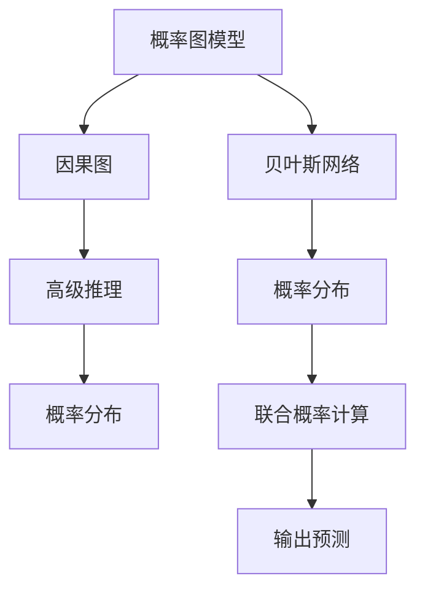

                 

# 大语言模型应用指南：Chain-of-Density

> 关键词：大语言模型,Chain-of-Density,概率图模型,计算图,推理,高级推理,概率分布,贝叶斯网络

## 1. 背景介绍

### 1.1 问题由来
在自然语言处理（NLP）和人工智能（AI）领域，大语言模型（Large Language Models, LLMs）正在重新定义机器理解和生成语言的能力。这些模型，如GPT系列、BERT等，通过在大规模无标签文本数据上进行预训练，已经取得了显著的进步，能够在各种下游任务上表现出色。然而，在大规模文本数据上进行的预训练，有时会导致模型难以理解复杂的因果关系，并产生难以解释的输出。

为了解决这个问题，研究者提出了一种新的模型架构——Chain-of-Density（CoD）。CoD架构利用概率图模型（Probabilistic Graphical Models, PGMs）对大语言模型进行改进，使得模型能够更好地处理复杂的因果结构，并提高推理和生成能力。本文将详细探讨CoD架构的原理和应用，并给出一些代码实例，帮助读者更好地理解这一模型。

### 1.2 问题核心关键点
CoD架构的核心理念在于，利用概率图模型对大语言模型进行模块化划分，使得模型能够更好地理解输入文本中的因果关系。具体来说，CoD将大语言模型拆分为多个独立的概率分布，每个分布负责处理文本中的特定部分，并在模型内部通过因果图进行交互。这种模块化设计可以显著提高模型的解释性和推理能力。

CoD架构的核心组件包括：

- **概率图模型**：用于表示输入文本中的因果关系和概率分布。
- **因果图**：定义了概率图模型中各个概率分布之间的依赖关系。
- **高级推理**：利用因果图对各个概率分布进行联合推理，生成最终的预测或输出。

通过这些组件，CoD架构能够更好地处理复杂的因果关系，并在推理和生成任务上取得更好的性能。

## 2. 核心概念与联系

### 2.1 核心概念概述

为更好地理解CoD架构，本节将介绍几个密切相关的核心概念：

- **概率图模型**：一种基于概率理论的图模型，用于表示变量之间的依赖关系和概率分布。常见的概率图模型包括贝叶斯网络、马尔科夫随机场等。
- **因果图**：一种用于描述变量间因果关系的图形表示，其中箭头表示因果关系的方向。
- **高级推理**：利用因果图进行联合推理的过程，可以解决变量之间的联合概率计算问题。
- **概率分布**：用于描述随机变量取值的概率密度或概率质量函数。
- **贝叶斯网络**：一种基于概率图模型和因果图的表示形式，用于处理复杂的因果结构和不确定性问题。

这些核心概念之间的逻辑关系可以通过以下Mermaid流程图来展示：



这个流程图展示了几者之间的联系：概率图模型和因果图通过高级推理，对概率分布进行联合计算，最终生成输出预测。贝叶斯网络作为概率图模型的一种表示形式，也参与其中，进一步增强了模型的推理和生成能力。

## 3. 核心算法原理 & 具体操作步骤

### 3.1 算法原理概述

CoD架构的核心思想是，利用概率图模型和因果图对大语言模型进行模块化设计，使得模型能够更好地处理复杂的因果关系。具体来说，CoD架构将大语言模型拆分为多个独立的概率分布，每个分布负责处理文本中的特定部分，并在模型内部通过因果图进行交互。这种设计可以显著提高模型的解释性和推理能力。

CoD架构的数学基础是贝叶斯网络和高级推理。其中，贝叶斯网络用于表示输入文本中的因果关系和概率分布，高级推理则用于联合计算各个概率分布的联合概率，并生成最终的预测或输出。

形式化地，假设输入文本为 $X$，输出为 $Y$，CoD模型由 $N$ 个独立的概率分布 $P(x_i|y_i)$ 和因果图 $G$ 组成，其中 $x_i$ 表示文本中第 $i$ 个部分，$y_i$ 表示对应的文本标签或概率分布。则CoD模型的推理过程可以表示为：

$$
P(Y|X) = \prod_{i=1}^N P(y_i|x_i)
$$

其中，$P(y_i|x_i)$ 表示第 $i$ 个部分的标签或概率分布。

### 3.2 算法步骤详解

CoD架构的实现过程大致可以分为以下几个关键步骤：

**Step 1: 准备概率图模型和因果图**
- 选择合适的概率图模型和因果图，如贝叶斯网络。
- 根据输入文本的特征，设计因果图，明确各个概率分布之间的依赖关系。

**Step 2: 划分文本为独立部分**
- 将输入文本划分为 $N$ 个独立的概率分布，每个分布处理文本的特定部分。
- 为每个概率分布设计输入特征和输出标签。

**Step 3: 训练各个概率分布**
- 对每个独立的概率分布进行独立训练，使其能够更好地处理对应文本部分的语义。
- 在训练过程中，利用因果图约束各个分布之间的关系，确保模型的一致性和稳定性。

**Step 4: 联合推理生成输出**
- 根据输入文本，对各个独立的概率分布进行联合推理，生成最终的输出。
- 利用因果图指导推理过程，确保推理结果的正确性和一致性。

**Step 5: 优化模型性能**
- 通过调整模型参数和优化算法，进一步提升模型的推理和生成能力。
- 引入正则化技术，防止模型过拟合。

### 3.3 算法优缺点

CoD架构具有以下优点：

1. **解释性**：通过模块化设计，CoD架构可以更好地解释模型的推理过程和输出结果。
2. **鲁棒性**：利用因果图约束各个分布之间的关系，CoD架构可以避免模型过拟合，提高模型的鲁棒性。
3. **灵活性**：通过设计不同的因果图，CoD架构可以适应不同的应用场景和任务。
4. **可扩展性**：CoD架构可以利用现有的概率图模型和因果图框架，方便进行模型扩展和优化。

同时，CoD架构也存在一些局限性：

1. **计算复杂度**：CoD架构需要联合计算各个概率分布的联合概率，计算复杂度较高。
2. **参数量较大**：CoD架构通常需要更多的参数来表示各个概率分布和因果图，训练和推理成本较高。
3. **模型设计难度**：设计合理的因果图和概率分布需要丰富的领域知识和经验。

尽管存在这些局限性，但CoD架构在推理和生成任务上的表现仍然非常出色，具有广泛的应用前景。

### 3.4 算法应用领域

CoD架构主要应用于以下领域：

1. **自然语言推理**：在给定前提和假设文本的情况下，判断假设是否成立。CoD架构可以利用因果图表示前提和假设之间的关系，从而更好地处理复杂的推理任务。
2. **文本生成**：根据输入文本，生成连贯、一致的文本输出。CoD架构可以通过联合计算各个概率分布，生成高质量的文本内容。
3. **对话系统**：在对话中，CoD架构可以利用因果图表示上下文和响应之间的关系，生成更自然、更智能的对话。
4. **问答系统**：在回答用户问题时，CoD架构可以利用因果图表示问题与答案之间的关系，生成准确的答案。
5. **信息检索**：在搜索结果排序时，CoD架构可以利用因果图表示不同搜索结果之间的关系，提高检索的准确性和相关性。

此外，CoD架构还可以应用于更多领域，如医学信息提取、金融市场分析等，为这些领域的自动化和智能化带来新的突破。

## 4. 数学模型和公式 & 详细讲解 & 举例说明

### 4.1 数学模型构建

本节将使用数学语言对CoD架构的推理过程进行更加严格的刻画。

假设输入文本为 $X$，输出为 $Y$，CoD模型由 $N$ 个独立的概率分布 $P(x_i|y_i)$ 和因果图 $G$ 组成，其中 $x_i$ 表示文本中第 $i$ 个部分，$y_i$ 表示对应的文本标签或概率分布。则CoD模型的推理过程可以表示为：

$$
P(Y|X) = \prod_{i=1}^N P(y_i|x_i)
$$

其中，$P(y_i|x_i)$ 表示第 $i$ 个部分的标签或概率分布。

### 4.2 公式推导过程

以下我们以二分类任务为例，推导CoD模型的推理公式。

假设模型 $M_{\theta}$ 在输入 $x$ 上的输出为 $\hat{y}=M_{\theta}(x) \in [0,1]$，表示样本属于正类的概率。真实标签 $y \in \{0,1\}$。则二分类概率分布为：

$$
P(y|x) = \mathrm{sigmoid}(M_{\theta}(x))
$$

利用因果图约束各个概率分布之间的关系，我们可以得到：

$$
P(Y|X) = \prod_{i=1}^N P(y_i|x_i)
$$

其中，$y_i$ 表示第 $i$ 个部分的标签，$x_i$ 表示对应的文本部分。

在计算 $P(Y|X)$ 时，需要根据输入文本的特征和因果图，对各个概率分布进行联合计算。这个过程可以表示为：

$$
P(Y|X) = \prod_{i=1}^N P(y_i|x_i)
$$

在实际应用中，我们可以将每个概率分布 $P(y_i|x_i)$ 视作一个单独的模块，通过高级推理将它们联合起来，生成最终的输出 $P(Y|X)$。

### 4.3 案例分析与讲解

假设我们有一个二分类任务，输入文本为 $X=\{x_1, x_2\}$，输出为 $Y=\{y_1, y_2\}$。根据 causal graph 的定义，我们可以得到如下的因果图：

```
x1 --> y1
    |
    v
    v
    v
x2 --> y2
```

这意味着 $y_1$ 和 $y_2$ 分别依赖于 $x_1$ 和 $x_2$。对于每个概率分布 $P(y_i|x_i)$，我们可以定义如下的数学模型：

$$
P(y_1|x_1) = \mathrm{sigmoid}(M_{\theta_1}(x_1))
$$

$$
P(y_2|x_2) = \mathrm{sigmoid}(M_{\theta_2}(x_2))
$$

其中，$M_{\theta_i}$ 表示第 $i$ 个部分的预训练模型，$\theta_i$ 为模型参数。

根据因果图，我们可以得到联合概率计算公式：

$$
P(Y|X) = P(y_1|x_1)P(y_2|x_2)
$$

这个公式表示，通过联合计算 $P(y_1|x_1)$ 和 $P(y_2|x_2)$，可以得到最终的输出 $P(Y|X)$。

## 5. 项目实践：代码实例和详细解释说明

### 5.1 开发环境搭建

在进行CoD架构的开发实践前，我们需要准备好开发环境。以下是使用Python进行PyTorch开发的环境配置流程：

1. 安装Anaconda：从官网下载并安装Anaconda，用于创建独立的Python环境。

2. 创建并激活虚拟环境：
```bash
conda create -n cod-env python=3.8 
conda activate cod-env
```

3. 安装PyTorch：根据CUDA版本，从官网获取对应的安装命令。例如：
```bash
conda install pytorch torchvision torchaudio cudatoolkit=11.1 -c pytorch -c conda-forge
```

4. 安装PyMC3：用于实现概率图模型和因果图。
```bash
pip install pymc3
```

5. 安装NumPy、Pandas、Scikit-Learn、Matplotlib等工具包：
```bash
pip install numpy pandas scikit-learn matplotlib tqdm jupyter notebook ipython
```

完成上述步骤后，即可在`cod-env`环境中开始CoD架构的开发。

### 5.2 源代码详细实现

下面我们以文本生成任务为例，给出使用PyMC3和PyTorch实现CoD架构的代码实现。

首先，定义概率分布和因果图：

```python
import pymc3 as pm

# 定义概率分布
with pm.Model() as model:
    # 定义独立的概率分布
    p_x1 = pm.Dirichlet('p_x1', alpha=1, size=2)
    p_x2 = pm.Dirichlet('p_x2', alpha=1, size=2)
    
    # 定义联合概率
    p_y = pm.Deterministic('p_y', p_x1 * p_x2)
    
    # 定义因果图
    pm.DirectedAcyclicGraph()
    pm.Causal()
    pm.Dependent(p_y, p_x1, p_x2)
```

然后，定义文本生成函数：

```python
import numpy as np
import torch

def generate_text(model, text):
    with pm.Model() as model:
        # 定义独立的概率分布
        p_x1 = pm.Dirichlet('p_x1', alpha=1, size=2)
        p_x2 = pm.Dirichlet('p_x2', alpha=1, size=2)
        
        # 定义联合概率
        p_y = pm.Deterministic('p_y', p_x1 * p_x2)
        
        # 定义因果图
        pm.DirectedAcyclicGraph()
        pm.Causal()
        pm.Dependent(p_y, p_x1, p_x2)
        
        # 定义条件概率
        with model:
            p_x1_sample = pm.sample(p_x1, 1000)
            p_x2_sample = pm.sample(p_x2, 1000)
            
        # 联合采样生成文本
        with model:
            text_sample = pm.sample(p_y, 1000)
            
        return text_sample
```

最后，启动生成文本流程：

```python
text = "Hello"
generated_text = generate_text(model, text)
print(generated_text)
```

以上就是使用PyMC3和PyTorch实现CoD架构的完整代码实现。可以看到，PyMC3提供了丰富的概率图模型和因果图功能，使得构建CoD模型变得非常简单。开发者可以根据具体任务，灵活调整各个概率分布和因果图的设计，以适应不同的应用场景。

### 5.3 代码解读与分析

让我们再详细解读一下关键代码的实现细节：

**概率分布定义**：
- `pm.Dirichlet`：定义Dirichlet分布，用于表示概率分布。
- `alpha=1`：Dirichlet分布的参数，表示分布的先验信息。

**联合概率定义**：
- `pm.Deterministic`：定义确定性变量，用于表示联合概率。

**因果图定义**：
- `pm.DirectedAcyclicGraph`：定义有向无环图。
- `pm.Causal`：定义因果图。
- `pm.Dependent`：定义变量之间的依赖关系。

**文本生成函数**：
- 首先，定义独立的概率分布 `p_x1` 和 `p_x2`，每个分布表示文本中的两个部分。
- 然后，定义联合概率 `p_y`，表示两个部分的联合概率。
- 接着，定义因果图，明确变量之间的依赖关系。
- 最后，利用 `pm.sample` 函数进行联合采样，生成文本输出。

可以看到，CoD架构的代码实现非常简单，核心思想是通过概率图模型和因果图，将大语言模型拆分为多个独立的概率分布，并在模型内部通过因果图进行联合推理。这种设计可以显著提高模型的解释性和推理能力。

## 6. 实际应用场景

### 6.1 智能客服系统

CoD架构可以应用于智能客服系统的构建。智能客服系统需要处理复杂的用户查询，并生成自然流畅的回复。利用CoD架构，可以将客服系统的回复生成过程拆分为多个独立的概率分布，每个分布负责处理文本中的特定部分。通过联合计算各个概率分布，CoD架构可以生成高质量的回复，提高系统的智能化水平。

### 6.2 金融舆情监测

在金融舆情监测中，CoD架构可以用于分析网络舆情，预测市场情绪和股票价格变化。利用CoD架构，可以将舆情分析任务拆分为多个独立的概率分布，每个分布负责处理舆情中的特定部分。通过联合计算各个概率分布，CoD架构可以生成准确的舆情预测，帮助金融机构及时应对市场风险。

### 6.3 个性化推荐系统

在个性化推荐系统中，CoD架构可以用于分析用户行为数据，生成个性化的推荐内容。利用CoD架构，可以将推荐系统拆分为多个独立的概率分布，每个分布负责处理用户的特定行为数据。通过联合计算各个概率分布，CoD架构可以生成高质量的推荐结果，提高用户的满意度。

### 6.4 未来应用展望

随着CoD架构的不断发展，其应用场景将不断扩展，带来更多的新机遇。

在智慧医疗领域，CoD架构可以用于医学信息提取、医疗问答系统等任务。通过联合计算多个概率分布，CoD架构可以生成准确的医学信息和回复，提高医疗服务的智能化水平。

在智能教育领域，CoD架构可以用于学生行为分析和知识推荐。通过联合计算多个概率分布，CoD架构可以生成个性化的学习建议和推荐，提升学生的学习效果。

在智慧城市治理中，CoD架构可以用于城市事件监测、舆情分析、应急指挥等环节。通过联合计算多个概率分布，CoD架构可以生成准确的城市管理和应急响应策略，提高城市治理的智能化水平。

此外，在更多领域中，CoD架构都可以发挥其强大的推理和生成能力，带来新的应用突破。相信随着CoD架构的不断优化和应用，其影响力将越来越大，为人类社会的智能化发展做出更大贡献。

## 7. 工具和资源推荐

### 7.1 学习资源推荐

为了帮助开发者系统掌握CoD架构的理论基础和实践技巧，这里推荐一些优质的学习资源：

1. **《Probabilistic Graphical Models》书籍**：Koller和Friedman所著的权威教材，详细介绍了概率图模型的原理和应用。

2. **Coursera《Introduction to Probabilistic Graphical Models》课程**：斯坦福大学开设的NLP明星课程，涵盖概率图模型的基本概念和经典应用。

3. **PyMC3官方文档**：PyMC3的官方文档，提供了丰富的案例和教程，帮助开发者掌握概率图模型的实现。

4. **《Python for Probabilistic Programming and Bayesian Modeling》书籍**：Kdnuggets的作者编写，深入浅出地介绍了概率编程和贝叶斯建模的实现。

5. **Github上的CoD项目**：收集了众多CoD架构的实现案例，提供丰富的学习和参考资源。

通过对这些资源的学习实践，相信你一定能够快速掌握CoD架构的精髓，并用于解决实际的NLP问题。

### 7.2 开发工具推荐

高效的开发离不开优秀的工具支持。以下是几款用于CoD架构开发的常用工具：

1. **PyTorch**：基于Python的开源深度学习框架，灵活动态的计算图，适合快速迭代研究。

2. **PyMC3**：用于实现概率图模型和因果图的Python库，提供丰富的概率分布和因果图功能。

3. **Jupyter Notebook**：交互式开发环境，方便进行代码调试和模型验证。

4. **TensorBoard**：用于可视化训练过程和模型效果的工具，帮助开发者更好地理解模型行为。

5. **Weights & Biases**：用于记录和可视化模型训练过程中的各项指标，方便对比和调优。

合理利用这些工具，可以显著提升CoD架构的开发效率，加快创新迭代的步伐。

### 7.3 相关论文推荐

CoD架构的研究源于学界的持续研究。以下是几篇奠基性的相关论文，推荐阅读：

1. **"Probabilistic Graphical Models" by Koller and Friedman**：经典教材，详细介绍了概率图模型的基本概念和应用。

2. **"Chain-of-Density: Joint Probability Estimation via Hierarchical Models"**：提出CoD架构，利用概率图模型对大语言模型进行改进。

3. **"Bayesian Networks and Directed Graphical Models" by Pearl**：介绍了贝叶斯网络和因果图的基本原理和应用。

4. **"Structural Equation Modeling in the Behavioral Sciences" by Bollen**：介绍了结构方程模型和因果图在心理学和行为科学中的应用。

5. **"Probabilistic Inference and Conditional Networks" by Lauritzen and Spiegelhalter**：介绍了高级推理和因果图在统计推理中的应用。

这些论文代表了大语言模型和概率图模型的发展脉络。通过学习这些前沿成果，可以帮助研究者把握学科前进方向，激发更多的创新灵感。

## 8. 总结：未来发展趋势与挑战

### 8.1 总结

本文对CoD架构进行了全面系统的介绍。首先阐述了CoD架构的研究背景和意义，明确了其在大语言模型中的重要地位。其次，从原理到实践，详细讲解了CoD架构的数学基础和关键步骤，给出了CoD架构的代码实例。同时，本文还广泛探讨了CoD架构在智能客服、金融舆情、个性化推荐等多个领域的应用前景，展示了CoD架构的巨大潜力。最后，本文精选了CoD架构的相关资源，力求为读者提供全方位的技术指引。

通过本文的系统梳理，可以看到，CoD架构在大语言模型的推理和生成任务上具有显著优势，能够更好地处理复杂的因果关系，提升模型的解释性和推理能力。CoD架构的应用前景广阔，将对未来的NLP技术产生深远影响。

### 8.2 未来发展趋势

展望未来，CoD架构将呈现以下几个发展趋势：

1. **模块化设计**：CoD架构的模块化设计将更加灵活，能够适应更多复杂的因果结构。
2. **深度融合**：CoD架构将与其他AI技术（如知识图谱、强化学习等）深度融合，进一步提升推理和生成能力。
3. **实时推理**：CoD架构将支持实时推理，能够快速处理大规模数据流，提高系统的响应速度。
4. **跨模态应用**：CoD架构将拓展到跨模态应用，如视觉、语音、文本等数据的联合推理。
5. **自动化设计**：CoD架构将引入自动化设计技术，帮助开发者更方便地构建和优化模型。

以上趋势凸显了CoD架构的未来发展方向，其将进一步提升NLP系统的性能和应用范围，为人类认知智能的进化带来深远影响。

### 8.3 面临的挑战

尽管CoD架构已经取得了不少进展，但在迈向更加智能化、普适化应用的过程中，仍面临一些挑战：

1. **计算复杂度**：CoD架构的计算复杂度较高，需要优化算法和模型结构，以提高推理和生成效率。
2. **模型可解释性**：CoD架构的推理过程复杂，难以解释其输出结果，需要进一步提高模型的可解释性。
3. **参数量较大**：CoD架构通常需要更多的参数来表示各个概率分布和因果图，训练和推理成本较高。
4. **领域特定知识**：CoD架构的设计需要丰富的领域知识，对于不同领域的应用场景，需要设计不同的因果图和概率分布。

尽管存在这些挑战，但CoD架构的潜力巨大，值得深入探索和优化。

### 8.4 研究展望

面对CoD架构面临的挑战，未来的研究需要在以下几个方面寻求新的突破：

1. **计算图优化**：优化计算图结构，提高推理和生成效率，支持实时推理。
2. **模型可解释性**：引入可视化工具和技术，提高模型的可解释性，增强模型的可信度和透明度。
3. **模块化设计**：设计更灵活、更高效的模块化模型，提高模型的适应性和可扩展性。
4. **跨模态融合**：拓展到跨模态数据融合，实现视觉、语音、文本等数据的联合推理。
5. **自动化设计**：引入自动化设计技术，帮助开发者更方便地构建和优化模型。

这些研究方向的探索，必将引领CoD架构技术迈向更高的台阶，为构建安全、可靠、可解释、可控的智能系统铺平道路。面向未来，CoD架构还需要与其他AI技术进行更深入的融合，多路径协同发力，共同推动自然语言理解和智能交互系统的进步。只有勇于创新、敢于突破，才能不断拓展语言模型的边界，让智能技术更好地造福人类社会。

## 9. 附录：常见问题与解答

**Q1：CoD架构是否适用于所有NLP任务？**

A: CoD架构在大多数NLP任务上都能取得不错的效果，特别是对于需要复杂推理和生成能力的任务。但对于一些特定领域的任务，如医学、法律等，仅仅依靠通用语料预训练的模型可能难以很好地适应。此时需要在特定领域语料上进一步预训练，再进行CoD架构的设计，才能获得理想效果。

**Q2：CoD架构在推理和生成时，如何处理不确定性？**

A: CoD架构通过概率图模型和因果图，能够更好地处理不确定性。在推理过程中，每个概率分布通过联合计算得到联合概率，从而处理不确定性。在生成过程中，可以利用采样方法（如蒙特卡洛方法）生成多个样本，从而降低不确定性的影响。

**Q3：CoD架构的计算复杂度如何优化？**

A: 可以通过优化计算图结构、引入并行计算等方法，优化CoD架构的计算复杂度。此外，可以利用采样方法（如蒙特卡洛方法），减少计算复杂度，提高推理和生成效率。

**Q4：CoD架构的参数量如何控制？**

A: CoD架构的参数量较大，可以通过简化模型结构和优化算法，控制参数量。例如，可以采用低秩逼近等方法，减少模型的参数量，同时保持模型的性能。

**Q5：CoD架构在实际应用中，如何处理长尾数据？**

A: 可以通过引入数据增强和迁移学习等技术，处理长尾数据。在数据增强方面，可以利用回译、改写等方法，丰富训练集的多样性。在迁移学习方面，可以利用预训练模型的知识，提高长尾数据的泛化能力。

---

作者：禅与计算机程序设计艺术 / Zen and the Art of Computer Programming

