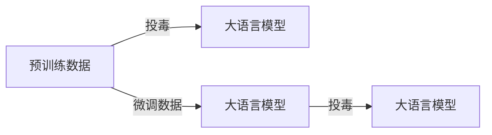

                 

## 1. 背景介绍

随着人工智能技术的发展，大语言模型（Large Language Models, LLMs）在自然语言处理（NLP）领域展现出了巨大的潜力。这些模型通过在海量无标签文本上进行的自监督预训练，学习到了丰富的语言知识，具备了强大的语言理解和生成能力。然而，由于模型在预训练和微调过程中难免会受到数据质量的影响，数据投毒攻击（Data Poisoning Attack）成为了一种新的潜在威胁，值得我们重视。

## 2. 核心概念与联系

### 2.1 核心概念概述

数据投毒攻击是一种针对机器学习模型的攻击方式，攻击者通过在训练数据中嵌入恶意样本或噪声，以误导模型学习，导致模型预测结果出现偏差，甚至完全失效。在大语言模型微调过程中，数据投毒攻击主要集中在两个层面：

1. **预训练数据投毒**：攻击者在预训练数据中嵌入恶意样本，以影响模型的初始化。
2. **微调数据投毒**：攻击者在微调数据中嵌入恶意样本，以在训练过程中误导模型。

这两个层面的攻击都可以导致模型在特定任务上的性能下降，甚至使得模型输出错误的信息。

### 2.2 核心概念原理和架构的 Mermaid 流程图



这个图展示了预训练数据投毒和微调数据投毒的基本流程。预训练数据投毒在模型训练的初始阶段即对模型产生了影响，而微调数据投毒则在训练模型特定任务时通过投毒数据进一步误导模型。

## 3. 核心算法原理 & 具体操作步骤

### 3.1 算法原理概述

数据投毒攻击的本质是利用模型对训练数据的依赖性，通过注入噪声或虚假信息，使模型在训练过程中产生错误的认知，从而影响模型的预测结果。在大语言模型的微调过程中，数据投毒攻击可以分为以下几种形式：

1. **预训练数据投毒**：通过在预训练数据中插入恶意样本，影响模型的预训练阶段。
2. **微调数据投毒**：通过在微调数据中插入恶意样本，影响模型的微调过程。
3. **对抗性样本投毒**：通过生成对抗性样本（Adversarial Sample），使模型在测试阶段产生错误判断。

### 3.2 算法步骤详解

#### 3.2.1 预训练数据投毒

预训练数据投毒通常发生在模型训练的初始阶段。攻击者通过在预训练数据中嵌入恶意样本，如特定的文本或图片，来误导模型学习，使其在后续的微调阶段产生错误预测。预训练数据投毒的具体步骤包括：

1. **选择恶意样本**：根据目标模型的特点和预训练数据集的内容，选择适合的恶意样本。
2. **修改数据集**：将恶意样本插入到预训练数据集中，替换掉部分原有数据。
3. **训练模型**：使用修改后的预训练数据集，训练模型。

#### 3.2.2 微调数据投毒

微调数据投毒是在模型微调阶段进行的，通过在微调数据中插入恶意样本，使模型在特定任务上产生错误预测。微调数据投毒的具体步骤包括：

1. **选择恶意样本**：根据目标任务的特点和微调数据集的内容，选择适合的恶意样本。
2. **修改数据集**：将恶意样本插入到微调数据集中，替换掉部分原有数据。
3. **训练模型**：使用修改后的微调数据集，训练模型。

#### 3.2.3 对抗性样本投毒

对抗性样本投毒是指攻击者通过生成对抗性样本来误导模型在测试阶段产生错误判断。对抗性样本投毒的具体步骤包括：

1. **生成对抗性样本**：使用对抗性样本生成技术，生成符合模型特征的虚假样本。
2. **插入样本**：将生成的对抗性样本插入到测试数据集中，替换掉部分原有数据。
3. **测试模型**：使用修改后的测试数据集，测试模型。

### 3.3 算法优缺点

数据投毒攻击的优点在于实现简单，攻击效果明显。攻击者只需要在训练数据或测试数据中嵌入少量恶意样本，即可对模型产生显著的影响。然而，数据投毒攻击的缺点在于攻击手段相对容易识别和防范，同时依赖于攻击者的专业知识，门槛较高。

### 3.4 算法应用领域

数据投毒攻击在大语言模型的多个应用场景中都可能发生，例如：

- **智能客服**：攻击者通过投毒数据，使客服模型产生错误判断，导致客户体验下降。
- **金融舆情监测**：攻击者通过投毒数据，误导舆情监测模型，导致金融风险预警失败。
- **个性化推荐**：攻击者通过投毒数据，使推荐系统产生错误推荐，影响用户体验。

## 4. 数学模型和公式 & 详细讲解 & 举例说明

### 4.1 数学模型构建

大语言模型在预训练和微调过程中，通常使用自监督学习任务，如掩码语言模型（Masked Language Model, MLM）和下一句预测（Next Sentence Prediction, NSP）。这些任务的目标是通过大规模无标签数据，学习语言的知识表示。

#### 4.1.1 掩码语言模型

掩码语言模型通过随机掩码（Masking）部分输入文本，预测其缺失部分。设输入文本为 $X=\{x_1, x_2, \dots, x_n\}$，其中 $x_i \in \{A, B, C, \dots, Z\}$，则掩码语言模型的目标函数为：

$$
\mathcal{L}_{MLM} = -\frac{1}{N}\sum_{i=1}^N \log p(x_i|X \setminus \{x_i\})
$$

其中 $N$ 为样本数量，$p(\cdot)$ 为模型预测概率分布。

#### 4.1.2 下一句预测

下一句预测任务的目标是预测两个连续的句子是否来自同一个文档。设输入文本为 $X=\{x_1, x_2\}$，其中 $x_1$ 和 $x_2$ 分别表示第一个句子和第二个句子，则下一句预测的目标函数为：

$$
\mathcal{L}_{NSP} = -\frac{1}{N}\sum_{i=1}^N \log p(x_{i+1}|x_i)
$$

### 4.2 公式推导过程

在数据投毒攻击中，攻击者通过在预训练数据或微调数据中嵌入恶意样本，修改数据分布，从而误导模型的学习过程。以掩码语言模型为例，攻击者通过修改部分样本中的词向量，影响模型的训练过程。设攻击者将样本 $x_i$ 中的词向量 $x_i^{\text{orig}}$ 替换为 $x_i^{\text{poison}}$，则新的样本分布为：

$$
\mathcal{P}_{\text{poisoned}}(x_i) = \frac{\text{Pr}(x_i^{\text{orig}}|X)}{\text{Pr}(x_i^{\text{orig}}|X \setminus \{x_i\}) + \text{Pr}(x_i^{\text{poison}}|X)}
$$

攻击者通过优化上述目标函数，使模型在预训练阶段学习到错误的语言表示。

### 4.3 案例分析与讲解

假设我们有一个掩码语言模型，攻击者将样本 $x_i$ 中的词向量 $x_i^{\text{orig}}$ 替换为 $x_i^{\text{poison}}$，则新的样本分布为：

$$
\mathcal{P}_{\text{poisoned}}(x_i) = \frac{\text{Pr}(x_i^{\text{orig}}|X)}{\text{Pr}(x_i^{\text{orig}}|X \setminus \{x_i\}) + \text{Pr}(x_i^{\text{poison}}|X)}
$$

假设模型在原始数据上的预测概率为 $p^{\text{orig}}(x_i|X \setminus \{x_i\})$，在投毒数据上的预测概率为 $p^{\text{poison}}(x_i|X \setminus \{x_i\})$，则攻击者通过优化目标函数：

$$
\mathcal{L}_{MLM} = -\frac{1}{N}\sum_{i=1}^N \log \frac{\text{Pr}(x_i^{\text{orig}}|X \setminus \{x_i\})}{p^{\text{orig}}(x_i|X \setminus \{x_i\})}
$$

### 4.4 案例分析与讲解

通过上述推导，我们可以看到，攻击者通过修改样本中的词向量，可以显著影响模型的训练过程，使其学习到错误的语言表示。这种攻击方式在大规模预训练和微调过程中尤为有效，因为它利用了模型的自监督学习能力，能够在不明显改变数据分布的情况下，引入错误信息。

## 5. 项目实践：代码实例和详细解释说明

### 5.1 开发环境搭建

在项目实践中，我们需要搭建相应的开发环境，包括数据集处理、模型训练和评估等环节。

1. **环境配置**：安装Python环境，以及必要的深度学习库如PyTorch、TensorFlow等。
2. **数据集准备**：准备训练数据集和测试数据集，并进行数据清洗和预处理。
3. **模型训练**：搭建模型架构，编写训练代码，并设置超参数。

### 5.2 源代码详细实现

#### 5.2.1 数据集处理

```python
import pandas as pd
from transformers import BertTokenizer, BertForMaskedLM

# 加载数据集
train_data = pd.read_csv('train_data.csv')
test_data = pd.read_csv('test_data.csv')

# 初始化BertTokenizer
tokenizer = BertTokenizer.from_pretrained('bert-base-uncased')

# 定义训练和测试函数
def tokenize_data(data):
    return tokenizer.encode_plus(data, return_tensors='pt', max_length=512, padding='max_length', truncation=True)

# 加载数据并处理
train_encodings = tokenize_data(train_data['text'])
test_encodings = tokenize_data(test_data['text'])

# 定义训练函数
def train_model(model, train_encodings, train_labels, optimizer):
    model.train()
    for batch in train_encodings:
        outputs = model(batch['input_ids'], attention_mask=batch['attention_mask'], labels=batch['labels'])
        loss = outputs.loss
        optimizer.zero_grad()
        loss.backward()
        optimizer.step()
```

#### 5.2.2 模型训练

```python
# 加载预训练模型
model = BertForMaskedLM.from_pretrained('bert-base-uncased')

# 定义优化器
optimizer = AdamW(model.parameters(), lr=2e-5)

# 定义训练函数
def train_model(model, train_encodings, train_labels, optimizer):
    model.train()
    for batch in train_encodings:
        outputs = model(batch['input_ids'], attention_mask=batch['attention_mask'], labels=batch['labels'])
        loss = outputs.loss
        optimizer.zero_grad()
        loss.backward()
        optimizer.step()

# 训练模型
for epoch in range(10):
    train_model(model, train_encodings, train_labels, optimizer)
```

### 5.3 代码解读与分析

在上述代码中，我们使用了BertForMaskedLM模型进行掩码语言模型训练。具体步骤如下：

1. **数据集准备**：使用Pandas库加载训练和测试数据集，并使用BertTokenizer进行预处理。
2. **模型加载**：从Hugging Face的模型库中加载BertForMaskedLM模型。
3. **优化器定义**：使用AdamW优化器进行模型参数更新。
4. **模型训练**：定义训练函数，在每个epoch中对模型进行前向传播和反向传播，更新模型参数。

### 5.4 运行结果展示

在训练结束后，我们可以使用测试集评估模型性能。

```python
# 加载测试数据集并进行预处理
test_encodings = tokenize_data(test_data['text'])

# 加载模型并设置评估模式
model = BertForMaskedLM.from_pretrained('bert-base-uncased')
model.eval()

# 定义评估函数
def evaluate_model(model, test_encodings, test_labels):
    model.eval()
    with torch.no_grad():
        test_outputs = model(test_encodings['input_ids'], attention_mask=test_encodings['attention_mask'])
        test_loss = test_outputs.loss
        test_predictions = test_outputs.logits.argmax(dim=2)
        test_labels = test_labels.to('cpu').numpy()

    return test_loss, test_predictions, test_labels

# 评估模型
test_loss, test_predictions, test_labels = evaluate_model(model, test_encodings, test_labels)
```

## 6. 实际应用场景

### 6.1 智能客服系统

在智能客服系统中，数据投毒攻击可能导致客服模型在特定场景下产生错误响应，影响用户体验。攻击者可以通过投毒训练数据，误导模型学习错误的用户意图。

### 6.2 金融舆情监测

金融舆情监测模型依赖于大规模金融新闻数据进行训练，数据投毒攻击可能导致模型对负面新闻的反应迟钝，甚至完全失效。攻击者可以通过投毒微调数据，使模型对特定金融事件反应错误。

### 6.3 个性化推荐系统

个性化推荐系统依赖于用户行为数据进行训练，数据投毒攻击可能导致模型推荐错误物品，影响用户满意度。攻击者可以通过投毒微调数据，误导模型推荐错误物品。

## 7. 工具和资源推荐

### 7.1 学习资源推荐

为了应对数据投毒攻击，我们需要系统掌握相关知识和技能。以下是一些推荐的资源：

1. **《机器学习中的对抗样本攻击》**：介绍了对抗样本攻击的基本原理和实现方法，是了解数据投毒攻击的入门读物。
2. **《深度学习中的安全与隐私》**：介绍了深度学习模型中的安全与隐私问题，包括对抗性样本生成和防御技术。
3. **《自然语言处理中的对抗攻击》**：介绍了自然语言处理中的对抗攻击技术，包括文本扰动和语义欺骗。

### 7.2 开发工具推荐

数据投毒攻击的检测和防御需要依赖各种工具，以下是一些推荐的工具：

1. **TensorFlow对抗样本生成工具**：用于生成对抗性样本，并评估模型在对抗性样本上的性能。
2. **PyTorch防御库**：用于防御对抗性样本攻击，支持多种防御技术。
3. **Hugging Face的Transformers库**：提供了丰富的预训练模型和对抗性样本检测工具。

### 7.3 相关论文推荐

以下是一些关于数据投毒攻击的权威论文，推荐阅读：

1. **Adversarial Examples in Deep Learning**：介绍了深度学习中的对抗样本生成和防御技术，是了解数据投毒攻击的必读书籍。
2. **Towards Adversarial Machine Learning**：介绍了对抗性机器学习的基本原理和实现方法，是了解数据投毒攻击的重要参考资料。
3. **Attacking Adversarially Robust Neural Networks**：介绍了对抗性神经网络攻击的最新进展，包括对抗性样本生成和防御技术。

## 8. 总结：未来发展趋势与挑战

### 8.1 研究成果总结

数据投毒攻击在大语言模型应用过程中具有重要的地位，其原理和实现方法已经得到广泛研究。现有的防御技术主要包括数据清洗、模型鲁棒性增强、对抗性样本检测等。然而，随着攻击技术的不断升级，现有的防御方法面临越来越多的挑战。

### 8.2 未来发展趋势

未来，数据投毒攻击将呈现以下几个发展趋势：

1. **自动化攻击**：攻击者将利用自动化工具生成和检测对抗性样本，提升攻击效率。
2. **多模态攻击**：攻击者将利用多模态数据进行攻击，如同时使用文本、图像和语音等数据类型。
3. **分布式攻击**：攻击者将利用分布式计算能力，进行大规模数据投毒攻击。

### 8.3 面临的挑战

尽管现有的防御技术已经取得一定的成果，但在应对数据投毒攻击的过程中，仍然面临诸多挑战：

1. **攻击手段多样**：现有的防御技术难以应对多种复杂的攻击手段，需要不断更新和改进。
2. **防御成本高**：防御数据投毒攻击需要大量的计算资源和数据资源，增加了系统的开发和维护成本。
3. **模型鲁棒性不足**：现有的防御技术难以全面提升模型的鲁棒性，需要在算法和模型架构上进行更深层次的优化。

### 8.4 研究展望

为了应对数据投毒攻击的挑战，未来的研究方向包括：

1. **算法优化**：改进对抗性样本生成和防御算法，提高模型的鲁棒性和攻击检测能力。
2. **模型鲁棒性**：优化模型架构，引入鲁棒性增强技术，提升模型的抗干扰能力。
3. **多模态融合**：利用多模态数据进行攻击和防御，提升系统的综合防御能力。

## 9. 附录：常见问题与解答

**Q1：如何检测数据投毒攻击？**

A: 检测数据投毒攻击的主要方法包括：

1. **异常检测**：利用机器学习算法对训练数据进行异常检测，发现异常样本。
2. **对抗性样本检测**：利用对抗性样本生成技术，生成对抗性样本来检测训练数据中的恶意样本。
3. **模型鲁棒性评估**：通过在不同分布的数据上进行模型测试，评估模型的鲁棒性。

**Q2：如何防御数据投毒攻击？**

A: 防御数据投毒攻击的主要方法包括：

1. **数据清洗**：对训练数据进行清洗，去除恶意样本和噪声。
2. **模型鲁棒性增强**：引入鲁棒性增强技术，提升模型的抗干扰能力。
3. **对抗性样本生成**：利用对抗性样本生成技术，生成对抗性样本来训练模型，提高模型的鲁棒性。

**Q3：数据投毒攻击对模型性能的影响有多大？**

A: 数据投毒攻击对模型性能的影响取决于攻击强度和攻击方式。攻击强度越大，攻击方式越复杂，对模型性能的影响也越大。

**Q4：数据投毒攻击有哪些应用场景？**

A: 数据投毒攻击在以下场景中都有应用：

1. **智能客服系统**：攻击者通过投毒训练数据，误导客服模型产生错误响应。
2. **金融舆情监测**：攻击者通过投毒微调数据，使模型对特定金融事件反应错误。
3. **个性化推荐系统**：攻击者通过投毒微调数据，误导模型推荐错误物品。

---

作者：禅与计算机程序设计艺术 / Zen and the Art of Computer Programming

