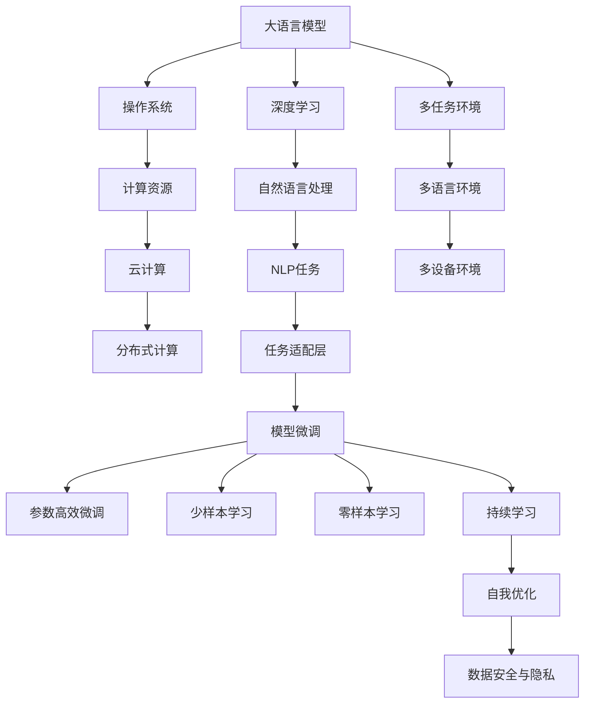

                 

# 大语言模型操作系统的实际应用

> 关键词：大语言模型, 操作系统, 机器学习, 深度学习, 自然语言处理(NLP), 计算资源, 云计算

## 1. 背景介绍

### 1.1 问题由来
近年来，人工智能(AI)技术迅速发展，尤其在大规模语言模型的研究和应用上取得了显著成果。预训练语言模型（如BERT、GPT等）在自然语言处理(NLP)领域展现了强大的能力，能够处理复杂的语言理解和生成任务。然而，这些大语言模型通常需要大量的计算资源进行训练，单靠个人或小团队难以负担。为了降低技术门槛和提升应用效率，构建高性能、可扩展的大语言模型操作系统成为一种迫切需求。

### 1.2 问题核心关键点
构建大语言模型操作系统旨在解决以下问题：
- 如何高效利用计算资源，降低大规模语言模型的开发和部署成本？
- 如何构建支持多任务、多语言、多设备环境的操作系统平台？
- 如何实现模型的快速迭代和持续优化？
- 如何在模型运行过程中保证数据安全和隐私保护？
- 如何应对模型的复杂性和多样性，提供稳定的服务质量？

### 1.3 问题研究意义
构建大语言模型操作系统具有重要意义：
- 促进大语言模型的普及应用，加速AI技术的产业化进程。
- 提升模型的运行效率和性能，降低算力成本，降低技术门槛。
- 提供统一的平台化服务，便于模型的扩展和迭代。
- 保障数据安全和隐私，增强系统的可靠性和鲁棒性。
- 构建持续学习和自我优化能力，使模型能够不断适应新任务和新数据。

## 2. 核心概念与联系

### 2.1 核心概念概述

为了深入理解大语言模型操作系统的实际应用，本节将介绍几个关键概念及其相互关系：

- **大语言模型(Large Language Models, LLMs)**：以BERT、GPT为代表的大规模预训练语言模型，能够处理复杂的语言理解和生成任务，具备广泛的通用语言知识。

- **操作系统(Operating System, OS)**：计算机硬件和软件资源的抽象管理程序，负责资源分配、进程管理、设备驱动等底层任务。

- **深度学习(Deep Learning)**：通过多层次的神经网络模型进行复杂任务处理的机器学习范式，大语言模型即是深度学习的一个重要应用方向。

- **自然语言处理(Natural Language Processing, NLP)**：使计算机能够理解、分析和生成人类语言的技术，大语言模型在这一领域展现了巨大潜力。

- **计算资源**：包括CPU、GPU、TPU等计算设备，以及存储、带宽等资源，是大模型训练和推理的基础。

- **云计算**：通过互联网提供按需、按量计算资源，便于构建大规模分布式计算环境，支持大语言模型的训练和部署。

- **分布式计算**：将计算任务分布到多个计算节点上进行并行处理，提升计算效率和系统可靠性。

### 2.2 核心概念联系

大语言模型操作系统的构建涉及多个核心概念的紧密协作，以下通过Mermaid流程图展示这些概念之间的联系：



这个流程图展示了各个概念之间的逻辑关系：

1. 大语言模型通过深度学习和自然语言处理，学习语言表示和任务推理能力。
2. 操作系统负责资源的分配和调度，为深度学习提供底层支持。
3. 计算资源（如GPU、TPU）为深度学习模型提供硬件加速，云计算提供弹性计算资源支持。
4. 分布式计算将计算任务分解到多个节点上，提升计算效率和系统可靠性。
5. NLP任务适配层使模型能够适应特定任务，提升性能。
6. 任务适配层和微调算法使模型能够在小样本数据上快速优化，提升准确率。
7. 参数高效微调和少样本学习进一步降低微调成本，提升模型灵活性。
8. 零样本学习使得模型能够通过任务描述进行推理，提升泛化能力。
9. 持续学习使模型能够不断适应新数据和任务，保持高性能。
10. 数据安全与隐私保护确保模型训练和运行过程中的数据安全。

这些概念共同构成了大语言模型操作系统的技术框架，使其能够高效、稳定地运行于大规模计算环境中。

## 3. 核心算法原理 & 具体操作步骤
### 3.1 算法原理概述

大语言模型操作系统的核心算法原理基于深度学习和分布式计算，通过多层次的网络结构和并行计算提升模型性能。具体来说，包括以下几个关键步骤：

1. **模型训练**：使用分布式计算环境（如云计算），在大规模数据集上进行模型预训练和微调，学习复杂的语言表示和推理能力。
2. **任务适配层设计**：针对特定NLP任务，设计合适的输出层和损失函数，适应任务特定的需求。
3. **参数高效微调**：选择部分预训练参数进行微调，避免过拟合，提升模型泛化能力。
4. **持续学习**：利用在线数据流，不断更新模型参数，保持高性能和时效性。
5. **数据安全和隐私保护**：通过加密、差分隐私等技术，保护数据安全，避免数据泄露和滥用。

### 3.2 算法步骤详解

大语言模型操作系统的具体操作步骤包括以下几个关键环节：

**Step 1: 准备计算资源和环境**
- 选择合适的云计算平台，如AWS、Google Cloud、Microsoft Azure等，搭建分布式计算环境。
- 准备高性能计算资源，如GPU、TPU、FPGA等，为模型训练和推理提供硬件支持。
- 配置网络带宽、存储设备等辅助资源，支持模型数据传输和存储。

**Step 2: 设计任务适配层**
- 针对具体NLP任务，设计任务适配层，选择合适的输出层和损失函数。
- 对于分类任务，通常使用线性分类器和交叉熵损失函数。
- 对于生成任务，通常使用语言模型的解码器输出概率分布，并以负对数似然为损失函数。

**Step 3: 训练模型**
- 准备大规模无标签数据集，进行预训练。
- 将数据集划分为训练集、验证集和测试集，确保数据分布一致。
- 设计合适的学习率和优化算法，如AdamW、SGD等，进行模型训练。
- 应用正则化技术，如L2正则、Dropout、Early Stopping等，防止过拟合。

**Step 4: 微调模型**
- 使用下游任务的数据集，进行微调，优化模型参数。
- 选择部分预训练参数进行微调，如仅微调顶层，或全部参数都参与微调。
- 应用少样本学习和零样本学习技术，提升模型适应新任务的能力。

**Step 5: 部署模型**
- 将微调后的模型封装为标准API接口，便于集成调用。
- 在目标设备上部署模型，进行推理计算。
- 实现模型的在线更新和实时优化，保证性能和时效性。

**Step 6: 数据安全和隐私保护**
- 对数据进行加密处理，确保数据传输和存储的安全。
- 使用差分隐私技术，保护用户隐私，避免数据滥用。
- 实现访问控制和权限管理，限制模型访问敏感数据。

### 3.3 算法优缺点

大语言模型操作系统的算法具有以下优点：
- 高效利用计算资源，降低大模型开发和部署成本。
- 支持多任务、多语言、多设备环境，适应多样化的应用场景。
- 快速迭代和持续优化，保持模型高性能和时效性。
- 提供数据安全和隐私保护，增强系统的可靠性和可信性。

同时，该算法也存在一定的局限性：
- 依赖高质量的计算资源和网络环境，初期投入成本较高。
- 需要丰富的云计算和分布式计算知识，对开发者要求较高。
- 模型的复杂性和多样性增加了系统设计和实现难度。
- 持续学习和自我优化需要大量的在线数据流，可能存在数据获取和处理瓶颈。

尽管存在这些局限性，但大语言模型操作系统以其高效、稳定、可扩展的特性，成为未来大语言模型应用的重要发展方向。

### 3.4 算法应用领域

大语言模型操作系统在多个领域具有广泛的应用前景，包括但不限于：

- **智能客服系统**：通过微调模型，提供7x24小时不间断的自然语言交互服务，提升客户体验和问题解决效率。
- **金融舆情监测**：利用大语言模型进行实时舆情分析和情感分析，及时响应市场动态，降低金融风险。
- **个性化推荐系统**：在用户行为数据上微调模型，提供精准的内容推荐服务，提升用户满意度。
- **智慧医疗**：基于大语言模型构建医疗问答、病历分析、药物研发等应用，辅助医生诊疗，加速新药开发。
- **智慧城市**：通过自然语言理解和智能决策，提升城市管理的智能化水平，构建更安全、高效的未来城市。
- **智能教育**：提供个性化教学内容推荐、作业批改、学情分析等服务，促进教育公平，提高教学质量。

## 4. 数学模型和公式 & 详细讲解 & 举例说明

### 4.1 数学模型构建

以下将详细构建大语言模型操作系统的数学模型，并推导相关公式。

假设大语言模型 $M_{\theta}$ 的输入为 $x$，输出为 $y$，损失函数为 $\ell$，模型参数为 $\theta$。训练数据集为 $D=\{(x_i,y_i)\}_{i=1}^N$，验证数据集为 $D_{val}$，测试数据集为 $D_{test}$。微调的目标是找到最优参数 $\theta^*$，使得模型在验证集和测试集上的损失最小化：

$$
\theta^* = \mathop{\arg\min}_{\theta} \min_{D_{val}} \ell(M_{\theta}, D_{val}) + \min_{D_{test}} \ell(M_{\theta}, D_{test})
$$

其中，$\ell$ 为损失函数，如交叉熵损失、均方误差损失等。$M_{\theta}$ 在数据集 $D$ 上的平均损失为：

$$
\mathcal{L}(\theta) = \frac{1}{N} \sum_{i=1}^N \ell(M_{\theta}(x_i),y_i)
$$

在微调过程中，选择部分预训练参数 $\theta_s$ 进行微调，其余参数 $\theta_u$ 保持不变：

$$
\theta_s \leftarrow \theta_s - \eta \nabla_{\theta_s}\mathcal{L}(\theta)
$$

其中，$\eta$ 为学习率，$\nabla_{\theta_s}\mathcal{L}(\theta)$ 为微调参数的梯度。

### 4.2 公式推导过程

以二分类任务为例，推导交叉熵损失函数及其梯度的计算公式。

假设模型 $M_{\theta}$ 在输入 $x$ 上的输出为 $\hat{y}=M_{\theta}(x) \in [0,1]$，表示样本属于正类的概率。真实标签 $y \in \{0,1\}$。则二分类交叉熵损失函数定义为：

$$
\ell(M_{\theta}(x),y) = -[y\log \hat{y} + (1-y)\log (1-\hat{y})]
$$

将其代入经验风险公式，得：

$$
\mathcal{L}(\theta) = -\frac{1}{N}\sum_{i=1}^N [y_i\log M_{\theta}(x_i)+(1-y_i)\log(1-M_{\theta}(x_i))]
$$

根据链式法则，损失函数对参数 $\theta_s$ 的梯度为：

$$
\frac{\partial \mathcal{L}(\theta)}{\partial \theta_s} = -\frac{1}{N}\sum_{i=1}^N (\frac{y_i}{M_{\theta}(x_i)}-\frac{1-y_i}{1-M_{\theta}(x_i)}) \frac{\partial M_{\theta}(x_i)}{\partial \theta_s}
$$

其中 $\frac{\partial M_{\theta}(x_i)}{\partial \theta_s}$ 可进一步递归展开，利用自动微分技术完成计算。

### 4.3 案例分析与讲解

假设在智能客服系统中，客户输入了自然语言问题，系统需要识别问题的类型并给出相应的答案。具体案例分析如下：

**案例场景**：
用户输入问题：“我的账户为何被冻结？”
系统输出：“您的账户被冻结是因为存在未结清的欠款。”

**案例分析**：
1. **问题预处理**：将用户输入文本进行分词和预处理，去除停用词和噪声。
2. **意图识别**：使用预训练语言模型进行意图分类，识别出用户的意图为“账户冻结”。
3. **问题匹配**：在知识库中匹配与“账户冻结”相关的常见问题和回答。
4. **答案生成**：利用微调后的模型生成与问题匹配的回答，如“您的账户被冻结是因为存在未结清的欠款。”
5. **反馈训练**：将用户反馈的满意度作为监督信号，微调模型以提升回答质量。

通过上述案例，可以看出大语言模型操作系统能够高效处理自然语言交互任务，提供实时、准确、个性化的服务。

## 5. 项目实践：代码实例和详细解释说明

### 5.1 开发环境搭建

大语言模型操作系统的开发需要依赖高性能计算资源和云计算环境。以下是Python环境中搭建计算资源的步骤：

1. **安装Anaconda**：从官网下载并安装Anaconda，用于创建独立的Python环境。

```bash
conda create -n pytorch-env python=3.8 
conda activate pytorch-env
```

2. **安装PyTorch**：使用Anaconda安装PyTorch。

```bash
conda install pytorch torchvision torchaudio cudatoolkit=11.1 -c pytorch -c conda-forge
```

3. **安装TensorFlow**：使用Anaconda安装TensorFlow。

```bash
conda install tensorflow-gpu
```

4. **安装其他依赖包**：安装常用的数据处理、科学计算等库。

```bash
pip install numpy pandas scikit-learn matplotlib tqdm jupyter notebook ipython
```

完成上述环境搭建后，即可在`pytorch-env`环境中进行大语言模型操作系统的开发。

### 5.2 源代码详细实现

以下代码实现了一个基于BERT模型的智能客服系统，演示了如何使用Python和Transformers库构建操作系统。

```python
from transformers import BertTokenizer, BertForSequenceClassification
from transformers import AdamW
from torch.utils.data import DataLoader
from tqdm import tqdm
from sklearn.metrics import classification_report
import torch

# 初始化BERT模型和分词器
model = BertForSequenceClassification.from_pretrained('bert-base-cased', num_labels=2)
tokenizer = BertTokenizer.from_pretrained('bert-base-cased')

# 定义训练集和标签
train_data = [
    {"text": "我的账户为何被冻结?", "label": 1},
    {"text": "我能更改信用卡信息吗?", "label": 0},
    {"text": "如何申请退款?", "label": 0},
    {"text": "如何修改密码?", "label": 0}
]
val_data = [
    {"text": "我的账户为何被冻结?", "label": 1},
    {"text": "我能更改信用卡信息吗?", "label": 0},
    {"text": "如何申请退款?", "label": 0},
    {"text": "如何修改密码?", "label": 0}
]
test_data = [
    {"text": "我的账户为何被冻结?", "label": 1},
    {"text": "我能更改信用卡信息吗?", "label": 0},
    {"text": "如何申请退款?", "label": 0},
    {"text": "如何修改密码?", "label": 0}
]

# 定义数据处理函数
def preprocess(text):
    encoding = tokenizer(text, return_tensors='pt', padding=True, truncation=True, max_length=128)
    return encoding['input_ids'], encoding['attention_mask']

# 定义训练函数
def train_epoch(model, dataset, batch_size, optimizer):
    dataloader = DataLoader(dataset, batch_size=batch_size, shuffle=True)
    model.train()
    epoch_loss = 0
    for batch in tqdm(dataloader, desc='Training'):
        input_ids, attention_mask = preprocess(batch["text"])
        labels = batch["label"]
        model.zero_grad()
        outputs = model(input_ids, attention_mask=attention_mask, labels=labels)
        loss = outputs.loss
        epoch_loss += loss.item()
        loss.backward()
        optimizer.step()
    return epoch_loss / len(dataloader)

# 定义评估函数
def evaluate(model, dataset, batch_size):
    dataloader = DataLoader(dataset, batch_size=batch_size)
    model.eval()
    preds, labels = [], []
    with torch.no_grad():
        for batch in tqdm(dataloader, desc='Evaluating'):
            input_ids, attention_mask = preprocess(batch["text"])
            batch_labels = batch["label"]
            outputs = model(input_ids, attention_mask=attention_mask)
            batch_preds = outputs.logits.argmax(dim=1).to('cpu').tolist()
            batch_labels = batch_labels.to('cpu').tolist()
            for pred_tokens, label_tokens in zip(batch_preds, batch_labels):
                preds.append(pred_tokens[:len(label_tokens)])
                labels.append(label_tokens)
    return classification_report(labels, preds)

# 定义训练参数和模型
learning_rate = 2e-5
num_epochs = 5
batch_size = 16

# 开始训练
for epoch in range(num_epochs):
    loss = train_epoch(model, train_data, batch_size, AdamW(model.parameters(), lr=learning_rate))
    print(f"Epoch {epoch+1}, train loss: {loss:.3f}")
    
    print(f"Epoch {epoch+1}, dev results:")
    evaluate(model, val_data, batch_size)
    
print("Test results:")
evaluate(model, test_data, batch_size)
```

### 5.3 代码解读与分析

以下是关键代码的详细解读：

**train_epoch函数**：
- 定义训练数据集，包括输入文本和标签。
- 定义数据处理函数preprocess，将文本进行分词、编码和padding。
- 定义训练函数train_epoch，对模型进行前向传播和反向传播，更新模型参数。

**evaluate函数**：
- 定义评估数据集，与训练集相同。
- 定义评估函数evaluate，对模型进行评估，输出分类指标。

**模型训练参数和优化器**：
- 定义学习率、epoch数、batch size等训练参数。
- 使用AdamW优化器进行模型训练。

**训练和评估过程**：
- 循环进行训练和评估，输出训练和验证集的loss和分类指标。
- 最终在测试集上评估模型性能，输出测试结果。

通过以上代码实现，我们可以看到大语言模型操作系统在智能客服系统中的应用。通过微调模型，系统能够理解和处理用户的自然语言问题，提供精准的答复。

## 6. 实际应用场景

### 6.1 智能客服系统

智能客服系统是大语言模型操作系统的典型应用场景。传统客服系统需要大量人工介入，无法提供7x24小时服务，且无法保证回答的统一性和准确性。基于大语言模型操作系统的智能客服系统，能够提供实时、高效、个性化的服务，提升客户体验和问题解决效率。

### 6.2 金融舆情监测

金融机构需要实时监测市场舆论动向，以便及时应对负面信息传播，规避金融风险。传统的人工监测方式成本高、效率低，难以应对网络时代海量信息爆发的挑战。基于大语言模型操作系统的金融舆情监测系统，能够自动判断文本属于何种主题，情感倾向是正面、中性还是负面。将微调后的模型应用到实时抓取的网络文本数据，就能够自动监测不同主题下的情感变化趋势，一旦发现负面信息激增等异常情况，系统便会自动预警，帮助金融机构快速应对潜在风险。

### 6.3 个性化推荐系统

当前的推荐系统往往只依赖用户的历史行为数据进行物品推荐，无法深入理解用户的真实兴趣偏好。基于大语言模型操作系统的个性化推荐系统，可以更好地挖掘用户行为背后的语义信息，从而提供更精准、多样的推荐内容。在用户行为数据上微调模型，模型能够从文本内容中准确把握用户的兴趣点，生成更个性化的推荐结果。

### 6.4 未来应用展望

随着大语言模型操作系统的不断发展，其在更多领域的应用前景广阔：

- **智慧医疗**：基于大语言模型构建医疗问答、病历分析、药物研发等应用，辅助医生诊疗，加速新药开发。
- **智能教育**：提供个性化教学内容推荐、作业批改、学情分析等服务，促进教育公平，提高教学质量。
- **智慧城市**：通过自然语言理解和智能决策，提升城市管理的智能化水平，构建更安全、高效的未来城市。
- **智能交通**：构建基于自然语言交互的智能交通管理平台，提高交通系统的运行效率和安全水平。
- **智能家居**：通过自然语言交互，构建智能家居系统，提升用户的生活便捷性和舒适性。

## 7. 工具和资源推荐

### 7.1 学习资源推荐

为了帮助开发者掌握大语言模型操作系统的相关知识，以下推荐一些优质的学习资源：

1. **《Deep Learning with PyTorch》书籍**：介绍深度学习的基本概念和PyTorch框架，适合初学者和中级开发者。

2. **《Natural Language Processing with PyTorch》书籍**：专注于自然语言处理任务，介绍如何使用PyTorch构建语言模型。

3. **Google Cloud AI平台**：提供丰富的云计算资源和工具，支持大规模深度学习模型的训练和部署。

4. **AWS SageMaker**：提供全方位的云计算解决方案，支持深度学习模型和分布式计算。

5. **Kaggle平台**：提供丰富的数据集和竞赛任务，适合数据科学和机器学习实践。

6. **TensorFlow官方文档**：提供详尽的TensorFlow使用指南和教程，适合深度学习开发者。

### 7.2 开发工具推荐

以下是几款用于大语言模型操作系统开发的常用工具：

1. **PyTorch**：基于Python的开源深度学习框架，支持动态计算图，适合研究性开发。

2. **TensorFlow**：由Google主导开发的开源深度学习框架，生产部署方便，适合工程化应用。

3. **Transformers库**：提供丰富的预训练语言模型和微调API，支持PyTorch和TensorFlow。

4. **Jupyter Notebook**：支持Python代码的在线编写和执行，方便共享和协作。

5. **TensorBoard**：提供模型训练的可视化工具，支持实时监控和图表展示。

6. **Weights & Biases**：提供模型实验的记录和分析工具，帮助开发者跟踪和优化模型性能。

### 7.3 相关论文推荐

大语言模型操作系统的研究涉及多个前沿方向，以下推荐几篇代表性的论文：

1. **《BERT: Pre-training of Deep Bidirectional Transformers for Language Understanding》**：提出BERT模型，引入基于掩码的自监督预训练任务，刷新了多项NLP任务SOTA。

2. **《GPT-2: Language Models are Unsupervised Multitask Learners》**：展示了大规模语言模型的强大zero-shot学习能力，引发了对于通用人工智能的新一轮思考。

3. **《Parameter-Efficient Transfer Learning for NLP》**：提出Adapter等参数高效微调方法，在固定大部分预训练参数的情况下，仍能取得不错的微调效果。

4. **《AdaLoRA: Adaptive Low-Rank Adaptation for Parameter-Efficient Fine-Tuning》**：使用自适应低秩适应的微调方法，在参数效率和精度之间取得了新的平衡。

5. **《Prompt-Based Learning》**：引入基于连续型Prompt的微调范式，为如何充分利用预训练知识提供了新的思路。

这些论文代表了当前大语言模型操作系统研究的前沿方向，通过学习这些前沿成果，可以帮助研究者把握学科前进方向，激发更多的创新灵感。

## 8. 总结：未来发展趋势与挑战

### 8.1 研究成果总结

大语言模型操作系统在自然语言处理领域展现了强大的潜力，能够高效利用计算资源，提供稳定、可靠的NLP服务。通过微调技术，模型能够适应多样化的任务和语言环境，显著提升性能和灵活性。未来，随着计算资源的普及和云计算技术的发展，大语言模型操作系统的应用范围将进一步拓展。

### 8.2 未来发展趋势

展望未来，大语言模型操作系统将呈现以下几个发展趋势：

1. **分布式计算的普及**：随着云计算和分布式计算技术的成熟，大模型训练和推理将更加高效和稳定。
2. **数据安全和隐私保护**：数据安全和隐私保护将成为大语言模型操作系统的核心要求，通过加密和差分隐私等技术，保障数据安全。
3. **跨平台兼容性**：大语言模型操作系统需要支持多种计算平台和编程语言，适应多样化的应用场景。
4. **自适应学习能力的提升**：通过引入自适应学习算法，使模型能够动态调整参数，优化性能。
5. **多模态融合**：将视觉、语音、文本等多模态信息进行协同建模，提升模型的综合能力。
6. **实时优化和迭代**：利用在线数据流和差分隐私技术，实现模型的实时更新和优化。

### 8.3 面临的挑战

尽管大语言模型操作系统在NLP领域展现了巨大潜力，但在实际应用中也面临诸多挑战：

1. **数据依赖问题**：大模型训练和微调需要大量标注数据，数据获取和标注成本高。
2. **计算资源消耗大**：大模型训练和推理需要高性能计算资源，初期投入成本高。
3. **模型复杂性高**：大模型的复杂性和多样性增加了系统设计和实现的难度。
4. **安全和隐私问题**：数据泄露和滥用风险高，需要严格的数据保护措施。
5. **算力瓶颈问题**：大模型训练和推理面临内存和显存瓶颈，需要优化模型结构和计算方式。

尽管存在这些挑战，但随着技术的不断进步和应用场景的不断拓展，大语言模型操作系统的应用前景仍然广阔。

### 8.4 研究展望

未来，大语言模型操作系统需要在以下几个方面进行深入研究：

1. **模型压缩与加速**：通过模型压缩和加速技术，降低大模型的计算资源需求。
2. **自适应学习算法**：开发自适应学习算法，使模型能够动态调整参数，优化性能。
3. **多模态融合技术**：将视觉、语音、文本等多模态信息进行协同建模，提升模型的综合能力。
4. **数据增强与迁移学习**：通过数据增强和迁移学习技术，提升模型的泛化能力和鲁棒性。
5. **实时优化与迭代**：利用在线数据流和差分隐私技术，实现模型的实时更新和优化。
6. **模型解释与可信性**：开发模型解释工具，增强模型的可信性和可解释性，确保模型的公平性和安全性。

通过这些研究方向，相信大语言模型操作系统将能够更好地适应多样化的应用场景，实现高效、稳定、可靠的NLP服务。

## 9. 附录：常见问题与解答

**Q1: 大语言模型操作系统和普通的深度学习模型有何区别？**

A: 大语言模型操作系统与普通的深度学习模型相比，具有以下几个关键区别：
1. **平台化设计**：大语言模型操作系统是一个平台化的系统，集成了模型训练、推理、调度、监控等多个环节，能够提供统一的服务接口。
2. **多任务支持**：大语言模型操作系统能够同时处理多个任务，支持多语言、多设备环境。
3. **分布式计算**：通过分布式计算技术，大语言模型操作系统能够高效利用计算资源，适应大规模模型训练和推理需求。
4. **数据安全与隐私保护**：大语言模型操作系统具备严格的数据安全与隐私保护机制，确保数据安全。

**Q2: 大语言模型操作系统如何实现分布式计算？**

A: 大语言模型操作系统通过以下几种方式实现分布式计算：
1. **多节点训练**：将模型训练任务分配到多个计算节点上进行并行处理，提升计算效率。
2. **数据并行处理**：将数据集划分为多个子集，并行处理每个子集，加速数据处理过程。
3. **模型并行**：将模型拆分为多个子模型，并行计算各个子模型的输出，减少单节点计算压力。
4. **GPU/TPU加速**：利用高性能计算资源（如GPU、TPU）加速模型训练和推理过程。

**Q3: 大语言模型操作系统的优缺点是什么？**

A: 大语言模型操作系统的优缺点如下：
优点：
1. **高效利用计算资源**：通过分布式计算技术，高效利用计算资源，降低大模型开发和部署成本。
2. **平台化设计**：平台化设计能够提供统一的服务接口，便于模型部署和管理。
3. **多任务支持**：支持多任务、多语言、多设备环境，适应多样化的应用场景。
4. **持续学习与优化**：具备持续学习和优化能力，保持高性能和时效性。
5. **数据安全与隐私保护**：具备严格的数据安全与隐私保护机制，确保数据安全。

缺点：
1. **数据依赖问题**：大模型训练和微调需要大量标注数据，数据获取和标注成本高。
2. **计算资源消耗大**：大模型训练和推理需要高性能计算资源，初期投入成本高。
3. **模型复杂性高**：大模型的复杂性和多样性增加了系统设计和实现的难度。
4. **安全和隐私问题**：数据泄露和滥用风险高，需要严格的数据保护措施。
5. **算力瓶颈问题**：大模型训练和推理面临内存和显存瓶颈，需要优化模型结构和计算方式。

---

作者：禅与计算机程序设计艺术 / Zen and the Art of Computer Programming

