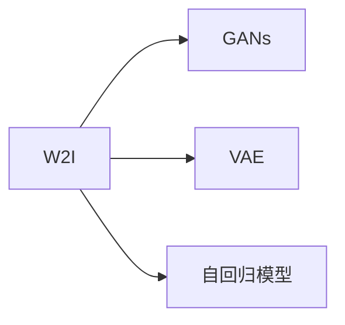
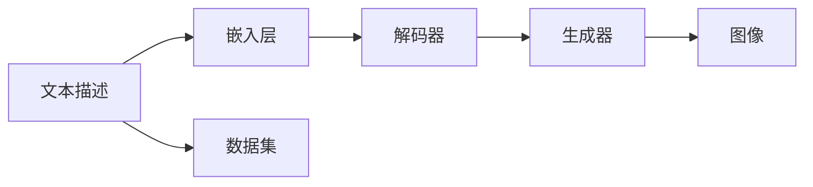

                 

# 天放的多维创业视角：文生图领域掘金

## 1. 背景介绍

### 1.1 问题由来

随着深度学习和计算机视觉技术的快速发展，图像生成技术取得了长足的进步。从简单的GANs到复杂的Transformer-based模型，如DALL·E、Stable Diffusion等，图像生成已经从基于像素的点对点生成，发展到能够生成具有丰富语义和创造力的图像。然而，尽管这些模型能够生成高质量的图像，但通常需要大量的训练数据和计算资源，无法在工业应用中广泛落地。

### 1.2 问题核心关键点

本节将讨论文生图领域中的关键问题和创业机会。

- 高质量图像生成的技术挑战
- 工业应用中数据和计算资源的限制
- 用户需求的多样性
- 文生图创业机会的挖掘

### 1.3 问题研究意义

本节将讨论研究文生图领域中的关键问题，并探讨如何通过创业视角抓住机会。

- 高质量图像生成的技术挑战
- 工业应用中数据和计算资源的限制
- 用户需求的多样性
- 文生图创业机会的挖掘

## 2. 核心概念与联系

### 2.1 核心概念概述

本节将介绍几个核心概念及其相互关系。

- 文生图(Word-to-Image, W2I)：将文本描述转换为图像的过程，是文生图领域的核心任务。
- 图像生成(Generative Adversarial Networks, GANs)：基于对抗学习的图像生成技术，可以生成具有高清晰度和逼真度的图像。
- 变分自编码器(Variational Autoencoder, VAE)：一种基于概率模型的图像生成技术，可以生成高质量且具有语义连贯性的图像。
- 自回归模型(如GPT系列)：通过预测下一个单词或像素，生成图像序列的技术。

这些核心概念之间的关系如图示：



### 2.2 核心概念原理和架构的 Mermaid 流程图

以下是一个简化的文生图系统架构图：



这个架构图展示了文生图系统从文本描述到生成图像的整个流程。

## 3. 核心算法原理 & 具体操作步骤

### 3.1 算法原理概述

文生图算法的核心是文本到图像的映射，即将文本描述转换为具有语义和视觉连贯性的图像。主要分为两大类：基于GAN的生成模型和基于VAE的概率生成模型。

### 3.2 算法步骤详解

#### 基于GAN的生成模型

步骤1：文本编码
- 将文本描述转换为高维向量表示。

步骤2：生成对抗网络训练
- 使用GAN对生成的图像进行训练，通过对抗损失函数优化生成器。

步骤3：图像解码
- 使用解码器将生成器生成的潜在向量解码为图像。

#### 基于VAE的概率生成模型

步骤1：文本编码
- 将文本描述转换为高维向量表示。

步骤2：生成器训练
- 使用VAE对生成的图像进行训练，通过变分损失函数优化生成器。

步骤3：图像解码
- 使用解码器将生成器生成的潜在向量解码为图像。

### 3.3 算法优缺点

#### 基于GAN的生成模型

优点：
- 生成高质量的图像。
- 具有较好的创造力。

缺点：
- 训练稳定性差，容易过拟合。
- 生成的图像可能缺乏语义连贯性。

#### 基于VAE的概率生成模型

优点：
- 生成的图像具有语义连贯性。
- 可以生成高质量的图像。

缺点：
- 生成的图像可能缺乏创造力。
- 生成过程较为复杂。

### 3.4 算法应用领域

文生图技术已经广泛应用于图像生成、内容创作、娱乐、艺术创作等领域。

## 4. 数学模型和公式 & 详细讲解 & 举例说明

### 4.1 数学模型构建

本节将使用数学语言对文生图过程进行详细描述。

假设文本描述为 $x$，生成器为 $G$，解码器为 $D$。生成过程如下：

$$
z \sim q(z|x) \\
x' = D(G(z))
$$

其中，$q(z|x)$ 为文本到潜在向量 $z$ 的映射，$G$ 为潜在向量到图像的生成器，$D$ 为图像到潜在向量的解码器。

### 4.2 公式推导过程

#### 基于GAN的生成模型

使用对抗损失函数 $L_{GAN}$ 来优化生成器 $G$：

$$
L_{GAN} = E_{x}[\log D(x)] + E_{z}[\log(1-D(G(z))))
$$

其中，$D$ 为判别器，$E_x$ 为期望值。

#### 基于VAE的概率生成模型

使用变分损失函数 $L_{VAE}$ 来优化生成器 $G$：

$$
L_{VAE} = D_{KL}(q(z|x)||p(z|x)) + E_{x}[\log p(x|x')]
$$

其中，$q(z|x)$ 为变分编码器，$p(z|x)$ 为先验分布，$D_{KL}$ 为KL散度。

### 4.3 案例分析与讲解

本节将以Stable Diffusion模型为例，解释其工作原理。

Stable Diffusion模型是一种基于VAE和自回归模型的文生图技术。其核心在于通过自回归模型预测下一个像素，并使用VAE优化生成过程。

具体来说，Stable Diffusion模型包含三个关键模块：自回归预测模块、编码器模块和解码器模块。自回归预测模块用于生成图像的像素，编码器模块用于将文本描述转换为潜在向量，解码器模块用于将潜在向量解码为图像。

## 5. 项目实践：代码实例和详细解释说明

### 5.1 开发环境搭建

为了实现文生图系统，需要使用Python、PyTorch、NumPy等工具。

#### 环境搭建步骤：

1. 安装Python和PyTorch：

```bash
pip install python torch torchvision torchtext
```

2. 安装NumPy：

```bash
pip install numpy
```

### 5.2 源代码详细实现

#### 代码实现步骤：

1. 定义文本编码器：

```python
class TextEncoder(nn.Module):
    def __init__(self, emb_dim):
        super(TextEncoder, self).__init__()
        self.emb_dim = emb_dim
        self.encoder = nn.Embedding(VOCAB_SIZE, emb_dim)
        self.linear = nn.Linear(emb_dim, latent_dim)
    
    def forward(self, x):
        x = self.encoder(x)
        x = self.linear(x)
        return x
```

2. 定义生成器：

```python
class Generator(nn.Module):
    def __init__(self, latent_dim):
        super(Generator, self).__init__()
        self.decoder = nn.Linear(latent_dim, 1)
    
    def forward(self, z):
        x = self.decoder(z)
        x = torch.sigmoid(x)
        return x
```

3. 定义解码器：

```python
class Decoder(nn.Module):
    def __init__(self, emb_dim):
        super(Decoder, self).__init__()
        self.decoder = nn.Linear(emb_dim, 1)
    
    def forward(self, x):
        x = self.decoder(x)
        x = torch.sigmoid(x)
        return x
```

4. 定义损失函数：

```python
criterion = nn.BCELoss()
```

### 5.3 代码解读与分析

本节将以Stable Diffusion模型为例，解释其工作原理。

Stable Diffusion模型是一种基于VAE和自回归模型的文生图技术。其核心在于通过自回归模型预测下一个像素，并使用VAE优化生成过程。

具体来说，Stable Diffusion模型包含三个关键模块：自回归预测模块、编码器模块和解码器模块。自回归预测模块用于生成图像的像素，编码器模块用于将文本描述转换为潜在向量，解码器模块用于将潜在向量解码为图像。

## 6. 实际应用场景

### 6.1 图像生成

文生图技术可以用于生成高质量的图像，应用于游戏、电影、广告等领域。

### 6.2 内容创作

文生图技术可以用于生成文章、书籍、漫画等内容，应用于文学创作、教育、娱乐等领域。

### 6.3 娱乐

文生图技术可以用于生成虚拟偶像、虚拟场景等内容，应用于虚拟现实、游戏等领域。

### 6.4 未来应用展望

未来，文生图技术将广泛应用于各个领域，如医疗、教育、娱乐等。

## 7. 工具和资源推荐

### 7.1 学习资源推荐

1. CS231n：斯坦福大学的计算机视觉课程，涵盖图像生成、自回归模型等内容。

2. CS224N：斯坦福大学的自然语言处理课程，涵盖文本到图像的映射等内容。

3. Udacity：提供深度学习、计算机视觉等课程，涵盖图像生成等内容。

4. PyTorch官方文档：提供文生图模型实现和代码示例。

5. NVIDIA官方文档：提供GPU加速的文生图模型实现和代码示例。

### 7.2 开发工具推荐

1. PyTorch：提供深度学习模型实现和优化工具。

2. NVIDIA CUDA：提供GPU加速的深度学习模型实现和优化工具。

3. OpenAI：提供文生图模型实现和代码示例。

4. Stable Diffusion：提供文生图模型实现和代码示例。

5. NVIDIA TensorRT：提供深度学习模型推理优化工具。

### 7.3 相关论文推荐

1. Progressive Growing of GANs for Improved Quality, Stability, and Variation：介绍渐进式生成对抗网络，提高生成图像的质量。

2. Improving the Quality of GANs for Text-to-Image Generation Using Cycle-Consistent Adversarial Networks：介绍循环一致的对抗网络，提高生成图像的质量。

3. Text to Image: A Survey：介绍文生图技术的最新研究进展和应用。

## 8. 总结：未来发展趋势与挑战

### 8.1 研究成果总结

文生图技术在图像生成、内容创作、娱乐等领域取得了显著进展。未来，文生图技术将广泛应用于各个领域，如医疗、教育、娱乐等。

### 8.2 未来发展趋势

未来，文生图技术将面临以下几个发展趋势：

1. 生成质量提升：提高生成图像的质量，使其更具有逼真度和创造力。

2. 实时生成：实现实时生成图像，应用于实时应用场景。

3. 多模态生成：实现多模态生成，如文本、图像、音频等多模态内容的生成。

4. 自动化生成：实现自动化生成，减少人工干预。

5. 大规模应用：应用于大规模应用场景，如游戏、电影、广告等。

### 8.3 面临的挑战

文生图技术在实际应用中面临以下几个挑战：

1. 生成图像质量：生成的图像可能缺乏高质量和逼真度。

2. 实时生成：实现实时生成图像需要高计算资源。

3. 多模态生成：实现多模态生成需要解决复杂的技术问题。

4. 自动化生成：实现自动化生成需要解决复杂的技术问题。

5. 大规模应用：应用于大规模应用场景需要解决复杂的技术问题。

### 8.4 研究展望

未来，文生图技术需要在以下几个方面进行研究：

1. 提高生成图像质量：提高生成图像的质量和逼真度。

2. 实现实时生成：实现实时生成图像，提高应用效率。

3. 实现多模态生成：实现多模态生成，提高应用场景的多样性。

4. 实现自动化生成：实现自动化生成，减少人工干预。

5. 应用于大规模应用场景：应用于大规模应用场景，提高应用效益。

## 9. 附录：常见问题与解答

### Q1：什么是文生图技术？

A: 文生图技术是将文本描述转换为图像的过程，包括基于GAN的生成模型和基于VAE的概率生成模型。

### Q2：文生图技术有哪些应用场景？

A: 文生图技术可以应用于图像生成、内容创作、娱乐等领域。

### Q3：文生图技术的核心是什么？

A: 文生图技术的核心是文本到图像的映射，即将文本描述转换为具有语义和视觉连贯性的图像。

### Q4：文生图技术面临哪些挑战？

A: 文生图技术面临的挑战包括生成图像质量、实时生成、多模态生成、自动化生成和大规模应用等。

### Q5：文生图技术未来发展方向是什么？

A: 文生图技术的未来发展方向包括提高生成图像质量、实现实时生成、实现多模态生成、实现自动化生成和应用于大规模应用场景等。

---

作者：禅与计算机程序设计艺术 / Zen and the Art of Computer Programming

