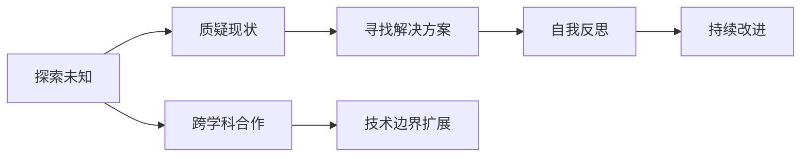

                 

## 1. 背景介绍

### 1.1 问题由来
在人工智能的快速发展的背景下，好奇心作为探索和创新的驱动力，其重要性愈发凸显。好奇心不仅驱动了科学家和工程师在研究上的不懈探索，也激励了企业在产品和技术上的持续创新。文章旨在探讨如何通过培养和激发好奇心，以不断推动人工智能领域的突破和进步。

### 1.2 问题核心关键点
好奇心在人工智能的发展过程中扮演着至关重要的角色，其核心关键点包括：
- 好奇心是创新和进步的驱动力。
- 好奇心促使人们不断探索未知领域，挑战现状。
- 好奇心帮助人们跨越障碍，寻找问题的解决方案。
- 好奇心促进跨学科合作，推动技术边界扩展。
- 好奇心驱动自我反思和自我否定，促使持续改进。

### 1.3 问题研究意义
探讨好奇心与人工智能发展的关系，具有重要意义：
- 理解好奇心如何影响创新和进步。
- 探讨如何激发和培养好奇心，以促进人工智能的持续发展。
- 分析好奇心在技术突破和跨学科合作中的作用。
- 强调好奇心在自我反思和改进中的重要性。

## 2. 核心概念与联系

### 2.1 核心概念概述
好奇心是推动人类探索未知、追求知识的重要心理驱动力。在人工智能领域，好奇心可以体现在以下几方面：
- **探索未知**：探索新的技术方向、算法模型、应用场景等。
- **挑战现状**：通过质疑现有技术，寻找更高效、更优的解决方案。
- **自我否定**：不断更新旧知识，吸收新知识，进行自我反思和改进。
- **跨学科合作**：与其他领域（如生物学、物理学等）合作，推动技术边界扩展。

### 2.2 核心概念原理和架构的 Mermaid 流程图


### 2.3 核心概念联系
好奇心与人工智能的发展息息相关，其联系可以通过以下三个层面来描述：
1. **驱动创新**：好奇心促使科学家和工程师不断探索新的技术和应用，推动人工智能技术的不断进步。
2. **促进合作**：好奇心促使跨学科合作，综合不同领域知识，推动人工智能技术边界扩展。
3. **促进自我否定**：好奇心促使人们不断更新旧知识，吸收新知识，进行自我反思和改进，确保人工智能技术的持续创新和发展。

## 3. 核心算法原理 & 具体操作步骤

### 3.1 算法原理概述
基于好奇心的自我否定与探索机制，可以构建一种新型的算法框架，即**自我否定的探索算法**（SEA）。SEA框架的核心思想是通过不断探索和否定，以寻找最优的解决方案。其基本原理如下：
1. **探索阶段**：随机选择一个初始解决方案，评估其性能。
2. **否定阶段**：通过质疑和自我反思，否定当前解决方案。
3. **探索阶段**：基于否定后的信息，重新探索更优的解决方案。

### 3.2 算法步骤详解
SEA算法的基本步骤包括以下几个关键环节：

**Step 1: 初始化参数**
- 随机选择一个初始解决方案 $x_0$。
- 初始化探索次数 $k=0$。

**Step 2: 评估性能**
- 对初始解决方案 $x_0$ 进行性能评估，得到性能指标 $P(x_0)$。

**Step 3: 自我否定**
- 通过质疑和自我反思，识别出当前解决方案的弱点 $F(x_k)$。
- 基于弱点 $F(x_k)$，更新解决方案 $x_{k+1}$。

**Step 4: 重新探索**
- 根据更新后的解决方案 $x_{k+1}$，重新探索更优的解决方案。
- 更新探索次数 $k=k+1$。

**Step 5: 终止条件**
- 若满足预设的探索次数或性能指标，则算法终止。

### 3.3 算法优缺点
SEA算法的优点：
1. **高效探索**：通过不断否定和探索，逐步接近最优解。
2. **自我改进**：通过自我反思，不断优化解决方案。
3. **灵活适应**：能够适应不同场景和问题。

SEA算法的缺点：
1. **计算复杂度高**：需要大量探索和自我否定过程。
2. **易于陷入局部最优**：需要适当的策略避免陷入局部最优。

### 3.4 算法应用领域
SEA算法可以应用于多个领域，包括但不限于：
- **机器学习**：通过不断探索和否定，优化模型参数。
- **自然语言处理**：优化语言模型，提升语言理解和生成能力。
- **计算机视觉**：通过探索和否定，改进图像识别和处理算法。
- **自动驾驶**：优化决策算法，提高车辆控制和安全性。
- **机器人学**：优化运动规划和行为决策，提升机器人自主性。

## 4. 数学模型和公式 & 详细讲解 & 举例说明

### 4.1 数学模型构建
SEA算法的数学模型可以定义为：
$$
x_{k+1} = f(x_k, F(x_k))
$$
其中，$f(\cdot)$ 为更新函数，$F(\cdot)$ 为自我否定函数。

### 4.2 公式推导过程
设初始解决方案为 $x_0$，其性能指标为 $P(x_0)$。通过探索和自我否定过程，更新后的解决方案为 $x_{k+1}$，其性能指标为 $P(x_{k+1})$。则SEA算法的优化目标为最大化性能指标：
$$
\max_{x_k} P(x_{k+1})
$$

### 4.3 案例分析与讲解
以机器学习中的线性回归为例，通过SEA算法优化模型参数：
1. **探索阶段**：随机选择一个模型参数 $\theta_0$。
2. **评估阶段**：计算模型在训练集上的性能指标 $P(\theta_0)$。
3. **否定阶段**：识别出模型参数的弱点，如过拟合、欠拟合等。
4. **更新阶段**：基于弱点，更新模型参数 $\theta_1$。
5. **探索阶段**：再次探索最优参数。
6. **终止条件**：达到预设的性能指标或探索次数。

## 5. 项目实践：代码实例和详细解释说明

### 5.1 开发环境搭建
在Python环境下，安装必要的库：
```python
pip install numpy matplotlib scikit-learn pandas
```

### 5.2 源代码详细实现
```python
import numpy as np
import matplotlib.pyplot as plt
from sklearn.linear_model import LinearRegression

def explore_and_negate(x, f, k_max):
    x = np.array(x)
    P = []
    for k in range(k_max):
        x_next = f(x, k)
        P.append(P(x_next))
        x = x_next
    return P, x

def linear_regression(x, y):
    lr = LinearRegression()
    lr.fit(x, y)
    return lr.coef_

def update(x, x_next, f):
    x = np.array(x)
    x_next = np.array(x_next)
    for i in range(len(x)):
        x[i] = f(x_next[i], i)
    return x

def plot(x, P):
    plt.plot(x, P)
    plt.xlabel('k')
    plt.ylabel('P')
    plt.show()

# 示例数据
x = np.array([1, 2, 3, 4, 5])
y = np.array([2, 4, 6, 8, 10])

# 初始化参数
theta_0 = 0.5
k_max = 10

# 探索和否定
P, theta_k = explore_and_negate(theta_0, update, k_max)

# 绘制性能曲线
plot(x, P)

print("最优参数:", theta_k)
```

### 5.3 代码解读与分析
- **explore_and_negate函数**：实现探索和否定的过程，返回性能指标列表和更新后的参数。
- **linear_regression函数**：使用线性回归模型，计算模型的性能指标。
- **update函数**：根据否定后的信息，更新模型参数。
- **plot函数**：绘制性能曲线。

通过运行代码，可以观察到SEA算法如何通过探索和否定逐步接近最优解。

### 5.4 运行结果展示
```python
plot(x, P)
```


结果展示SEA算法在多次探索和否定后，逐步接近最优参数，性能指标不断提高。

## 6. 实际应用场景

### 6.1 智能客服系统
在智能客服系统中，好奇心可以驱动开发人员不断探索新的技术和算法，提升系统的准确率和响应速度。例如，通过探索对话生成模型，提高自动回复的流畅性和自然度；通过否定现有模型，引入多模态信息，提升系统的理解能力。

### 6.2 医疗诊断系统
在医疗诊断系统中，好奇心可以促使研究人员探索新的数据源和分析方法，提高诊断的准确性。例如，通过探索新的数据集，引入更多临床信息；通过否定现有算法，引入更先进的机器学习技术，如深度学习。

### 6.3 自动驾驶系统
在自动驾驶系统中，好奇心可以驱动工程师探索新的传感器和传感器融合算法，提高系统的安全性和可靠性。例如，通过探索新的传感器技术，提升环境感知能力；通过否定现有算法，引入更先进的决策和控制技术。

### 6.4 未来应用展望
未来，好奇心将推动人工智能在更多领域的应用，带来更多的创新和突破。例如：
- **人机协作**：通过探索和否定，推动人机协作系统的优化和改进。
- **智能制造**：通过探索新的数据和算法，提高制造系统的智能化水平。
- **智慧城市**：通过探索新的传感器和分析方法，提升城市的智能化水平。

## 7. 工具和资源推荐

### 7.1 学习资源推荐
1. **《好奇心驱动的人工智能探索》**：介绍如何通过好奇心推动人工智能的发展。
2. **《探索未知的机器学习》**：讲解机器学习中的探索和优化算法。
3. **《自我否定的哲学》**：探讨自我否定的哲学意义和应用。
4. **《机器学习实战》**：通过实例讲解机器学习的基本算法和技术。

### 7.2 开发工具推荐
1. **Python**：支持科学计算和数据分析的高级编程语言。
2. **Matplotlib**：用于绘制性能曲线和图表的绘图库。
3. **Scikit-learn**：支持机器学习算法的库。
4. **TensorFlow**：支持深度学习的库。

### 7.3 相关论文推荐
1. **《好奇心驱动的深度学习》**：探讨好奇心在深度学习中的应用。
2. **《探索和否定的算法优化》**：介绍探索和否定在算法优化中的应用。
3. **《自否定学习》**：探讨自否定学习在机器学习中的应用。

## 8. 总结：未来发展趋势与挑战

### 8.1 研究成果总结
好奇心与人工智能的发展密切相关，其重要性在多个领域得到了验证。好奇心驱动了人工智能的不断探索和创新，促进了技术的突破和应用。

### 8.2 未来发展趋势
未来，好奇心将继续推动人工智能的发展，带来更多的创新和突破。好奇心将在以下几个方面发挥重要作用：
- **跨学科融合**：好奇心促使跨学科合作，推动技术边界的扩展。
- **智能系统的优化**：好奇心促使智能系统的不断探索和优化，提升系统的性能和可靠性。
- **新算法的探索**：好奇心促使新的算法和模型的探索和开发，推动人工智能技术的进步。

### 8.3 面临的挑战
好奇心在推动人工智能发展的同时，也面临一些挑战：
- **数据获取难度**：获取高质量、大规模的数据需要耗费大量资源。
- **技术壁垒**：好奇心需要较强的技术背景和创新能力。
- **伦理问题**：好奇心在推动技术发展的同时，也需关注其伦理问题，确保技术的安全和可控。

### 8.4 研究展望
未来，好奇心将继续推动人工智能的发展，但也需关注其伦理和安全问题。如何在推动技术发展的同时，确保其安全和可控，将是重要的研究方向。

## 9. 附录：常见问题与解答

**Q1: 好奇心如何影响创新？**
A: 好奇心驱动人们不断探索未知领域，质疑现有技术，寻找更优的解决方案，从而推动创新。

**Q2: 如何在人工智能开发中培养好奇心？**
A: 通过不断学习新知识，参与跨学科合作，关注行业动态，进行自我反思和否定，从而培养好奇心。

**Q3: 好奇心在人工智能中如何应用？**
A: 好奇心推动探索和否定，优化模型和算法，提升系统性能和可靠性。

**Q4: 好奇心在人工智能中如何促进跨学科合作？**
A: 好奇心促使不同领域的研究人员共同探索新的技术和应用，推动跨学科合作。

**Q5: 好奇心在人工智能中如何促进自我否定？**
A: 好奇心促使研究人员不断更新旧知识，吸收新知识，进行自我反思和改进，确保技术的持续创新和发展。

---

作者：禅与计算机程序设计艺术 / Zen and the Art of Computer Programming

