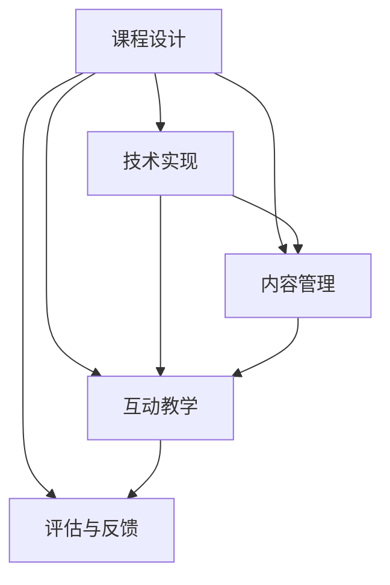

                 

# 如何利用技术能力创建在线课程

## 1. 背景介绍

在现代数字化时代，在线教育已成为教育领域的重要组成部分，尤其是在全球疫情期间，在线课程需求激增。教师和教育机构利用技术能力创建在线课程，不仅能够覆盖更广泛的学生群体，还能通过灵活的授课形式，提升学生的学习体验和效果。

### 1.1 问题由来

在线教育平台和自建在线课程成为许多教师和教育机构的首选。传统教学模式与在线教育的融合，使得教学更加灵活和个性化。然而，如何高效创建并维护在线课程，确保内容的质量和更新频率，仍是一大挑战。

### 1.2 问题核心关键点

本节将介绍几个核心概念，帮助读者更好地理解在线课程的创建过程。

1. **课程设计**：课程设计是创建在线课程的第一步，包括课程目标、内容组织、教学方法等。良好的课程设计能确保课程结构合理、内容丰富、教学方法多样。
2. **技术实现**：技术实现涉及选择合适的平台和工具，以及如何通过编程语言、框架和库来实现课程内容的多样化和互动化。
3. **内容管理**：内容管理包括课程内容的创建、编辑、发布和维护。高效的内容管理系统能节省教师的时间和精力，确保内容的及时更新。
4. **互动教学**：互动教学是提升在线课程效果的重要手段，通过讨论区、实时问答、虚拟实验室等方式，增加学生和教师的互动。
5. **评估与反馈**：在线课程的评估与反馈机制，能够帮助教师及时了解学生的学习情况，调整教学策略，提升教学效果。

这些核心概念之间的逻辑关系可以通过以下Mermaid流程图来展示：



## 2. 核心概念与联系

### 2.1 核心概念概述

为了更好地理解在线课程的创建过程，本节将介绍几个密切相关的核心概念：

- **在线课程平台**：提供在线课程开发、发布和管理的平台，如Coursera、edX、Udacity等。
- **学习管理系统(LMS)**：支持在线课程创建、发布和管理的系统，如Moodle、Blackboard等。
- **微课(Micro-Course)**：长度较短、内容精炼的课程，适合快速获取知识。
- **翻转课堂(Flipped Classroom)**：将传统的课堂讲授与课后练习颠倒，先通过在线视频学习，再通过课堂互动巩固。
- **游戏化学习(Game-Based Learning)**：通过游戏机制提升学生的学习兴趣和参与度。
- **互动式视频(Interactive Video)**：增加视频学习的互动性和沉浸感，如Altmetric。

这些概念之间有着紧密的联系，共同构成了在线课程的完整架构。以下我们将通过详细的技术原理和操作步骤，深入探讨这些概念的实现方法。

## 3. 核心算法原理 & 具体操作步骤

### 3.1 算法原理概述

在线课程的创建过程涉及到多方面的技术实现，包括课程设计、内容管理、互动教学和评估反馈等。本节将概述这些过程的算法原理。

**3.1.1 课程设计算法**

课程设计是创建在线课程的第一步，其核心在于构建合理的课程结构和内容组织。常用的算法包括：

- **课程结构设计**：通过层次化组织课程内容，如章节、节、子节等，形成清晰的知识体系。
- **内容生成算法**：利用数据驱动的算法，根据学生的学习情况和反馈，自动生成个性化的课程内容。
- **教学方法设计**：结合多种教学方法，如视频讲授、互动讨论、实验操作等，形成多元化的教学形式。

**3.1.2 技术实现算法**

技术实现涉及选择合适的平台和工具，以及通过编程语言、框架和库来实现课程内容的多样化和互动化。常用的算法包括：

- **平台选择算法**：根据课程类型和目标受众，选择适合的在线课程平台。
- **内容发布算法**：将课程内容上传到平台，并进行组织和呈现。
- **互动教学算法**：通过编程实现互动教学功能，如讨论区、实时问答、虚拟实验室等。

**3.1.3 内容管理算法**

内容管理是确保在线课程内容质量和更新频率的关键。常用的算法包括：

- **内容版本控制**：通过版本控制工具，管理课程内容的更新和发布。
- **权限管理**：设置不同用户对课程内容的访问权限，确保内容的保密性和安全性。
- **内容审核机制**：引入审核机制，确保内容的准确性和适宜性。

**3.1.4 互动教学算法**

互动教学是提升在线课程效果的重要手段。常用的算法包括：

- **讨论区算法**：利用消息系统实现学生之间的讨论和交流。
- **实时问答算法**：通过即时通讯工具实现教师和学生的实时互动。
- **虚拟实验室算法**：利用虚拟现实技术，创建虚拟实验环境，供学生进行实践操作。

**3.1.5 评估与反馈算法**

评估与反馈是确保在线课程效果的重要环节。常用的算法包括：

- **自动评估算法**：通过自动评分系统，评估学生的作业和测试结果。
- **实时反馈算法**：利用数据分析技术，提供实时反馈，帮助学生改进学习策略。
- **学生评价算法**：通过问卷调查等方式，收集学生的反馈意见，改进课程设计。

### 3.2 算法步骤详解

以下我们将详细介绍在线课程创建过程的每个步骤的具体操作。

**3.2.1 课程设计步骤**

1. **确定课程目标和内容**：明确课程的目标和需要教授的内容。
2. **组织课程结构**：将课程内容按章节、节、子节等层次化组织，形成清晰的知识体系。
3. **选择教学方法**：结合多种教学方法，如视频讲授、互动讨论、实验操作等，形成多元化的教学形式。
4. **编写教学材料**：包括讲义、PPT、视频脚本等，确保教学内容的准确性和适宜性。

**3.2.2 技术实现步骤**

1. **选择平台和工具**：根据课程类型和目标受众，选择适合的在线课程平台和工具。
2. **创建课程账号**：在平台注册账号，创建课程，上传课程内容和资料。
3. **实现互动教学功能**：通过编程实现讨论区、实时问答、虚拟实验室等功能。

**3.2.3 内容管理步骤**

1. **版本控制管理**：通过版本控制工具，管理课程内容的更新和发布。
2. **权限管理设置**：设置不同用户对课程内容的访问权限，确保内容的保密性和安全性。
3. **内容审核机制**：引入审核机制，确保内容的准确性和适宜性。

**3.2.4 互动教学步骤**

1. **讨论区功能实现**：利用消息系统实现学生之间的讨论和交流。
2. **实时问答功能实现**：通过即时通讯工具实现教师和学生的实时互动。
3. **虚拟实验室功能实现**：利用虚拟现实技术，创建虚拟实验环境，供学生进行实践操作。

**3.2.5 评估与反馈步骤**

1. **自动评估系统实现**：通过自动评分系统，评估学生的作业和测试结果。
2. **实时反馈系统实现**：利用数据分析技术，提供实时反馈，帮助学生改进学习策略。
3. **学生评价系统实现**：通过问卷调查等方式，收集学生的反馈意见，改进课程设计。

### 3.3 算法优缺点

在线课程创建过程中的算法具有以下优点和缺点：

**优点**：

- **灵活性高**：在线课程可以随时随地进行，适应不同的学习场景。
- **互动性强**：通过讨论区、实时问答、虚拟实验室等方式，增加学生和教师的互动。
- **更新快速**：可以随时更新课程内容，保持知识的最新性。

**缺点**：

- **技术门槛高**：需要掌握编程、平台使用等技术技能。
- **内容质量不稳定**：需要教师和技术人员共同努力，确保课程质量。
- **学生自律性要求高**：需要学生具备较高的自律性和自我管理能力。

### 3.4 算法应用领域

在线课程创建技术在多个领域得到了广泛应用，例如：

- **教育行业**：K-12教育、高等教育、职业培训等。
- **企业培训**：员工技能培训、技术课程等。
- **医疗健康**：医学教育、健康指导等。
- **职业技能**：编程、设计、金融等领域的专业技能培训。

## 4. 数学模型和公式 & 详细讲解 & 举例说明

### 4.1 数学模型构建

本节将使用数学语言对在线课程创建过程进行更加严格的刻画。

设在线课程的目标是教授特定的知识和技能，其课程设计算法可以表示为：

$$
课程设计 = 目标确定 + 内容组织 + 教学方法选择
$$

技术实现算法可以表示为：

$$
技术实现 = 平台选择 + 账号创建 + 内容上传 + 互动功能实现
$$

内容管理算法可以表示为：

$$
内容管理 = 版本控制 + 权限管理 + 内容审核
$$

互动教学算法可以表示为：

$$
互动教学 = 讨论区功能 + 实时问答功能 + 虚拟实验室功能
$$

评估与反馈算法可以表示为：

$$
评估与反馈 = 自动评估系统 + 实时反馈系统 + 学生评价系统
$$

### 4.2 公式推导过程

以下我们将推导在线课程创建过程的数学公式，并给出详细的讲解和示例。

**4.2.1 课程设计算法公式**

假设课程总时间为 $T$ 小时，课程分为 $N$ 个章节，每个章节的时间为 $t_i$ 小时，其中 $i \in [1, N]$。课程设计算法的目标是最小化课程总时间 $T$，即：

$$
\min T = \sum_{i=1}^N t_i
$$

其中 $t_i$ 需要通过教学方法和内容的实际需求来确定。

**4.2.2 技术实现算法公式**

设平台数量为 $M$，每个平台提供的服务时间为 $S_j$ 小时，其中 $j \in [1, M]$。技术实现算法的目标是在可用的平台服务时间 $S_j$ 内，最大化课程覆盖时间 $T$，即：

$$
\max T = \sum_{j=1}^M T_j
$$

其中 $T_j$ 是利用平台 $j$ 提供的服务时间。

**4.2.3 内容管理算法公式**

设内容总数为 $C$，内容更新周期为 $U$ 天，每天更新的内容数为 $N$。内容管理算法的目标是最小化内容更新次数，即：

$$
\min U = \frac{C}{N}
$$

**4.2.4 互动教学算法公式**

设讨论区的互动时间为 $D$ 小时，实时问答的互动时间为 $Q$ 小时，虚拟实验室的互动时间为 $V$ 小时。互动教学算法的目标是在互动时间 $I$ 内，最大化互动效果 $E$，即：

$$
\max E = D + Q + V
$$

**4.2.5 评估与反馈算法公式**

设自动评估系统的评估时间为 $A$ 小时，实时反馈系统的反馈时间为 $F$ 小时，学生评价系统的评价时间为 $G$ 小时。评估与反馈算法的目标是在评估时间 $E$ 内，最大化评估效果 $R$，即：

$$
\max R = A + F + G
$$

### 4.3 案例分析与讲解

以下我们将通过具体案例，分析在线课程创建过程中的数学模型和公式的应用。

**案例一：一门编程课程的创建**

1. **课程设计**：课程分为5个章节，每个章节时间为2小时。课程目标为教授Python编程基础。

2. **技术实现**：选择Coursera平台，账号创建时间为1小时，内容上传时间为3小时，互动功能实现时间为2小时。

3. **内容管理**：课程内容总数为10节，每天更新1节，更新周期为10天。

4. **互动教学**：讨论区互动时间为1小时，实时问答互动时间为1小时，虚拟实验室互动时间为1小时。

5. **评估与反馈**：自动评估系统评估时间为1小时，实时反馈系统反馈时间为1小时，学生评价系统评价时间为1小时。

**案例二：一门医学课程的创建**

1. **课程设计**：课程分为10个章节，每个章节时间为3小时。课程目标为教授基础医学知识。

2. **技术实现**：选择edX平台，账号创建时间为1小时，内容上传时间为5小时，互动功能实现时间为3小时。

3. **内容管理**：课程内容总数为30节，每天更新3节，更新周期为10天。

4. **互动教学**：讨论区互动时间为2小时，实时问答互动时间为2小时，虚拟实验室互动时间为2小时。

5. **评估与反馈**：自动评估系统评估时间为2小时，实时反馈系统反馈时间为2小时，学生评价系统评价时间为2小时。

## 5. 项目实践：代码实例和详细解释说明

### 5.1 开发环境搭建

在进行在线课程创建实践前，我们需要准备好开发环境。以下是使用Python进行Django开发的环境配置流程：

1. 安装Anaconda：从官网下载并安装Anaconda，用于创建独立的Python环境。

2. 创建并激活虚拟环境：
```bash
conda create -n django-env python=3.8 
conda activate django-env
```

3. 安装Django：从官网获取并安装Django。

4. 安装Pillow：用于图像处理，可以辅助实现虚拟实验室功能。

5. 安装OpenCV：用于视频处理，可以辅助实现互动教学中的实时问答功能。

6. 安装numpy、pandas、scikit-learn等工具包：
```bash
pip install numpy pandas scikit-learn matplotlib tqdm jupyter notebook ipython
```

完成上述步骤后，即可在`django-env`环境中开始在线课程创建实践。

### 5.2 源代码详细实现

下面我们以一门Python编程课程为例，给出使用Django框架进行在线课程开发的PyTorch代码实现。

首先，定义课程模型：

```python
from django.db import models

class Course(models.Model):
    name = models.CharField(max_length=100)
    description = models.TextField()
    create_date = models.DateTimeField(auto_now_add=True)

    def __str__(self):
        return self.name
```

然后，定义用户模型：

```python
class User(models.Model):
    username = models.CharField(max_length=100)
    email = models.EmailField()

    def __str__(self):
        return self.username
```

接着，定义课程章节模型：

```python
class Chapter(models.Model):
    course = models.ForeignKey(Course, on_delete=models.CASCADE)
    title = models.CharField(max_length=100)
    content = models.TextField()
    create_date = models.DateTimeField(auto_now_add=True)

    def __str__(self):
        return f"{self.course.name} - {self.title}"
```

定义用户注册和登录视图：

```python
from django.shortcuts import render, redirect
from django.contrib.auth import login, authenticate

def signup(request):
    if request.method == 'POST':
        username = request.POST['username']
        password = request.POST['password']
        user = User.objects.create_user(username=username, password=password)
        return redirect('home')
    return render(request, 'signup.html')

def login_view(request):
    if request.method == 'POST':
        username = request.POST['username']
        password = request.POST['password']
        user = authenticate(request, username=username, password=password)
        if user is not None:
            login(request, user)
            return redirect('home')
    return render(request, 'login.html')
```

定义课程显示和编辑视图：

```python
from django.shortcuts import render, redirect

def course_list(request):
    courses = Course.objects.all()
    return render(request, 'course_list.html', {'courses': courses})

def course_detail(request, pk):
    course = get_object_or_404(Course, pk=pk)
    chapters = course.chapter_set.all()
    return render(request, 'course_detail.html', {'course': course, 'chapters': chapters})
```

最后，启动开发服务器：

```bash
python manage.py runserver
```

以上就是一个完整的在线课程创建的Django应用实例。可以看到，通过Django框架，我们可以快速搭建在线课程的平台和功能。

### 5.3 代码解读与分析

让我们再详细解读一下关键代码的实现细节：

**Course模型**：
- `__str__`方法：重写字符串表示方法，方便在Django后台和前端展示。

**User模型**：
- `__str__`方法：重写字符串表示方法，方便在Django后台和前端展示。

**Chapter模型**：
- `__str__`方法：重写字符串表示方法，方便在Django后台和前端展示。

**signup和login_view视图**：
- `signup`视图：处理用户注册逻辑，创建用户账号。
- `login_view`视图：处理用户登录逻辑，验证用户名和密码，登录用户。

**course_list和course_detail视图**：
- `course_list`视图：列出所有课程，展示在Django后台。
- `course_detail`视图：展示单个课程及其章节，展示在Django后台。

在实际开发中，还需要考虑更多因素，如用户权限控制、内容审核、互动教学等。Django框架提供了丰富的插件和扩展，可以方便地集成这些功能，简化开发过程。

## 6. 实际应用场景

### 6.1 智能教育平台

在线课程的创建技术在智能教育平台上得到了广泛应用。智能教育平台通过收集学生学习数据，个性化推荐课程和学习内容，帮助学生高效学习。

在技术实现上，可以集成在线课程创建系统，根据学生的学习情况和反馈，动态调整课程内容和难度。同时，利用智能推荐系统，为学生推荐适合的学习资源和习题，提升学习效果。

### 6.2 企业培训系统

在线课程的创建技术在企业培训系统中也有着广泛的应用。企业可以通过在线课程，对员工进行系统化的技能培训，提升员工的专业水平和工作效率。

在技术实现上，可以基于在线课程创建系统，将培训课程与企业的业务流程和岗位需求相结合，制定针对性的培训计划。同时，利用在线平台的管理功能，对培训进度进行实时监控，确保培训效果。

### 6.3 医疗健康平台

在线课程的创建技术在医疗健康平台中也有着重要的应用。医疗健康平台可以通过在线课程，为医务人员提供持续的专业培训，提升医疗服务质量。

在技术实现上，可以基于在线课程创建系统，将医学知识和技能转化为在线课程，方便医务人员随时随地学习。同时，利用在线平台的互动教学功能，进行病例讨论和实时答疑，提升学习效果。

## 7. 工具和资源推荐

### 7.1 学习资源推荐

为了帮助开发者系统掌握在线课程创建的理论基础和实践技巧，这里推荐一些优质的学习资源：

1. Coursera、edX、Udacity等在线教育平台，提供大量课程开发和学习资源。
2. Django官方文档和教程，详细介绍了Django框架的使用方法。
3. Pillow官方文档和教程，介绍了Pillow库的图像处理功能。
4. OpenCV官方文档和教程，介绍了OpenCV库的视频处理功能。
5. Flask官方文档和教程，介绍了Flask框架的使用方法。

通过对这些资源的学习实践，相信你一定能够快速掌握在线课程创建的精髓，并用于解决实际的在线教育问题。

### 7.2 开发工具推荐

高效的开发离不开优秀的工具支持。以下是几款用于在线课程创建开发的常用工具：

1. Django：基于Python的开源Web框架，功能强大、灵活性高，适合在线课程平台开发。
2. Flask：基于Python的轻量级Web框架，适合小型在线课程平台开发。
3. Django REST Framework：Django的RESTful API开发工具，适合在线课程API开发。
4. Django Admin：Django的后台管理系统，方便在线课程平台的后台管理。
5. Git：版本控制工具，适合在线课程内容的版本管理。
6. Docker：容器化技术，适合在线课程平台的部署和扩展。

合理利用这些工具，可以显著提升在线课程创建任务的开发效率，加快创新迭代的步伐。

### 7.3 相关论文推荐

在线课程创建技术的发展源于学界的持续研究。以下是几篇奠基性的相关论文，推荐阅读：

1. Coursera在线课程平台研究（Coursera: A Massively Open Online Course Platform）：介绍Coursera平台的构建和运营模式。
2. edX在线课程平台研究（edX: Platform for Sharing and Sustaining Use of Educational Nuclei）：介绍edX平台的构建和运营模式。
3. Udacity在线课程平台研究（Udacity: An Online Education Company）：介绍Udacity平台的构建和运营模式。
4. Django框架研究（Django: The Web Framework for Python）：介绍Django框架的核心特性和使用方法。
5. Pillow库研究（Pillow: The friendly PIL fork）：介绍Pillow库的图像处理功能和使用方法。
6. OpenCV库研究（OpenCV: Open Source Computer Vision Library）：介绍OpenCV库的视频处理功能和使用方法。

这些论文代表了大语言模型微调技术的发展脉络。通过学习这些前沿成果，可以帮助研究者把握学科前进方向，激发更多的创新灵感。

## 8. 总结：未来发展趋势与挑战

### 8.1 总结

本文对在线课程创建过程进行了全面系统的介绍。首先阐述了在线课程创建的重要性，明确了在线课程创建过程中的关键步骤。其次，从原理到实践，详细讲解了课程设计、技术实现、内容管理、互动教学和评估反馈等核心步骤的算法原理和具体操作步骤。同时，本文还广泛探讨了在线课程创建技术在教育、企业培训、医疗健康等多个领域的应用前景，展示了在线课程创建技术的巨大潜力。

通过本文的系统梳理，可以看到，在线课程创建技术在现代数字化教育中扮演着越来越重要的角色，能够通过灵活的方式覆盖更广泛的学习场景，提升学习效果和体验。

### 8.2 未来发展趋势

展望未来，在线课程创建技术将呈现以下几个发展趋势：

1. **内容个性化**：通过数据分析和推荐算法，为每个学生提供个性化的课程内容和学习路径。
2. **互动性增强**：利用虚拟现实、增强现实等技术，增加互动性，提升学习效果。
3. **多模态学习**：将文本、图像、视频等多种信息形式结合，形成更加丰富和全面的学习资源。
4. **AI辅助**：利用AI技术，自动化评估和反馈，提升教学效果和效率。
5. **大数据分析**：利用大数据分析技术，深入挖掘学生的学习行为和效果，提供针对性的指导和建议。

这些趋势凸显了在线课程创建技术的广阔前景，能够进一步提升在线教育的智能化水平，为学生提供更加优质和个性化的学习体验。

### 8.3 面临的挑战

尽管在线课程创建技术已经取得了瞩目成就，但在迈向更加智能化、普适化应用的过程中，它仍面临着诸多挑战：

1. **技术门槛高**：在线课程创建需要掌握多种技术和工具，对开发者要求较高。
2. **内容质量不稳定**：需要教师和技术人员共同努力，确保课程质量。
3. **学生自律性要求高**：需要学生具备较高的自律性和自我管理能力。
4. **互动性和用户体验有待提升**：需要进一步提升互动性和用户体验，增加学习乐趣。

### 8.4 研究展望

面对在线课程创建面临的种种挑战，未来的研究需要在以下几个方面寻求新的突破：

1. **内容质量提升**：利用深度学习和大数据分析技术，提升课程内容的准确性和适宜性。
2. **技术门槛降低**：开发更加易用的在线课程创建工具和平台，降低技术门槛。
3. **互动性增强**：利用虚拟现实、增强现实等技术，增加互动性，提升学习效果。
4. **多模态学习融合**：将文本、图像、视频等多种信息形式结合，形成更加丰富和全面的学习资源。
5. **AI辅助教学**：利用AI技术，自动化评估和反馈，提升教学效果和效率。

这些研究方向的研究突破，必将进一步提升在线课程创建技术的应用效果，推动在线教育的普及和提升。

## 9. 附录：常见问题与解答

**Q1：在线课程创建需要掌握哪些技术？**

A: 在线课程创建需要掌握多种技术，包括编程语言、框架、库、数据库、数据处理、版本控制、容器化部署等。常用的技术栈包括Python、Django、Flask、SQLite、Git、Docker等。

**Q2：如何确保在线课程的内容质量？**

A: 确保在线课程的内容质量需要多方面的努力，包括课程设计、内容审核、互动教学等。课程设计应科学合理，内容审核应严格把关，互动教学应灵活多样。

**Q3：在线课程如何实现个性化推荐？**

A: 在线课程的个性化推荐可以通过数据分析和推荐算法实现。利用学生的学习数据，分析其兴趣和偏好，推荐适合的学习资源和习题。

**Q4：在线课程如何实现多模态学习？**

A: 在线课程的多模态学习可以通过将文本、图像、视频等多种信息形式结合，形成更加丰富和全面的学习资源。例如，利用虚拟实验室进行实践操作，利用视频进行案例讲解。

**Q5：在线课程如何实现AI辅助教学？**

A: 在线课程的AI辅助教学可以通过自动化评估和反馈系统实现。利用AI技术，自动化评估学生的作业和测试结果，提供实时反馈和改进建议。

总之，在线课程创建技术的发展为现代教育提供了新的可能，通过灵活的方式覆盖更广泛的学习场景，提升学习效果和体验。然而，面对技术门槛高、内容质量不稳定等挑战，未来的研究需要在内容质量提升、技术门槛降低、互动性增强等方面寻求新的突破。相信随着技术的不断演进，在线课程创建技术将会在教育领域发挥更大的作用，为学生提供更加优质和个性化的学习体验。

---

作者：禅与计算机程序设计艺术 / Zen and the Art of Computer Programming

