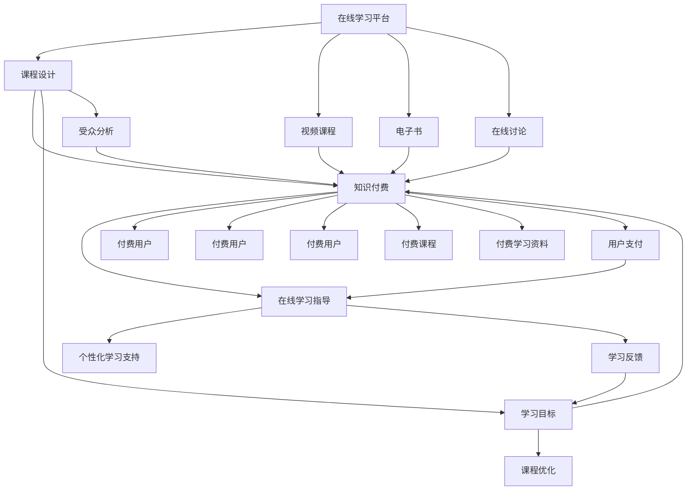

                 

# 如何利用知识付费实现在线学习与在线学习指导？

> 关键词：知识付费,在线学习,在线教育,学习指导,课程设计,教育技术

## 1. 背景介绍

在数字化时代，知识的获取和传播方式发生了根本性的变革。在线学习作为一种新兴的教育模式，正在逐步取代传统的面对面教学，成为人们获取知识的重要途径。与此同时，随着人们时间成本的增加和需求的多样化，知识付费模式应运而生。在线学习与知识付费的结合，为终身学习者提供了一个更为灵活、高效的学习环境，使他们能够以较低成本获得高品质的教育资源。然而，这种模式的成功，离不开精细化、个性化的在线学习指导。本文将探讨如何利用知识付费实现在线学习与在线学习指导，以期为在线教育的进一步发展提供有益的借鉴和参考。

## 2. 核心概念与联系

### 2.1 核心概念概述

在探讨如何利用知识付费实现在线学习与在线学习指导之前，首先需要理解几个核心概念：

- **在线学习(Online Learning)**：指通过互联网平台进行的学习活动，包括观看视频、阅读文档、参与讨论等，不受时间和地点的限制。
- **知识付费(Knowledge Paywall)**：指用户需要支付一定的费用才能获取高质量的教育资源，如专业课程、电子书、研究报告等。
- **在线学习指导(Online Learning Guidance)**：指通过在线平台提供的个性化、结构化的学习支持服务，帮助学习者更好地理解课程内容、掌握学习技巧、提升学习效率。
- **课程设计(Course Design)**：指根据学习目标和受众特点，设计课程内容、组织学习活动、评估学习成果的过程。

这些概念之间存在着紧密的联系，共同构成了知识付费驱动下的在线学习生态系统。

### 2.2 核心概念原理和架构的 Mermaid 流程图



这个流程图展示了在线学习平台、课程设计、知识付费和在线学习指导之间的逻辑关系：

1. 在线学习平台提供多种学习资源，如视频课程、电子书和在线讨论等。
2. 课程设计是课程资源生成的前置步骤，包括确定学习目标和受众分析。
3. 知识付费模式通过收费机制，确保高质量教育资源的正版化和用户粘性。
4. 在线学习指导通过个性化学习支持，提升学习效果，促进用户续费。
5. 用户反馈用于课程优化，形成良性循环。

## 3. 核心算法原理 & 具体操作步骤

### 3.1 算法原理概述

在线学习指导的核心在于通过算法和大数据技术，为学习者提供个性化的学习建议和支持。其基本原理可以概括为以下几个方面：

- **个性化推荐算法**：利用用户的历史学习行为和偏好，推荐适合其学习风格和需求的内容。
- **学习路径优化算法**：根据学习者的当前进度和目标，规划最优的学习路径，帮助其高效完成任务。
- **学习效果评估算法**：通过考试、作业等形式，评估学习者的掌握情况，并及时提供反馈和建议。
- **智能答疑系统**：通过自然语言处理和机器学习技术，解答学习者的问题，提升学习体验。

### 3.2 算法步骤详解

具体而言，实现在线学习指导的步骤如下：

**Step 1: 数据收集与预处理**

- 收集学习者的基本信息、历史学习行为、学习成果等数据。
- 使用自然语言处理技术，对学习者的问题进行预处理和分类。

**Step 2: 模型训练与优化**

- 基于收集到的数据，训练个性化推荐、学习路径优化和智能答疑等模型。
- 使用在线学习平台的用户反馈，不断调整和优化模型，提升准确率和效果。

**Step 3: 学习资源适配**

- 将训练好的模型应用于在线学习平台，根据学习者的实时状态，推荐合适的学习资源和路径。
- 提供智能答疑系统，及时解答学习者的问题，引导其深入学习。

**Step 4: 学习效果评估与反馈**

- 使用评估算法，定期测试学习者的掌握情况，生成评估报告。
- 根据评估结果，生成个性化反馈，并提供改进建议。

### 3.3 算法优缺点

在线学习指导的算法具有以下优点：

- **个性化支持**：通过算法优化，提供定制化的学习体验，满足不同学习者的需求。
- **高效学习**：智能推荐和路径规划，帮助学习者快速掌握知识，提高学习效率。
- **即时反馈**：通过学习效果评估和智能答疑，及时发现和解决学习中的问题。

同时，这些算法也存在一些缺点：

- **数据隐私**：收集和处理学习者数据可能引发隐私保护问题。
- **算法偏见**：算法模型可能存在偏见，导致推荐和指导不公平。
- **用户体验**：过度依赖算法可能降低学习的灵活性和人性化。

### 3.4 算法应用领域

在线学习指导的算法可以应用于各种在线学习场景，如在线教育平台、企业培训系统、个人学习管理工具等。具体而言：

- **在线教育平台**：如Coursera、edX等，通过推荐系统和个性化指导，提升课程完成率和满意度。
- **企业培训系统**：如Udemy for Business，利用学习路径优化和实时反馈，增强员工培训效果。
- **个人学习管理工具**：如Anki、Quizlet等，提供智能复习计划和答题建议，帮助用户高效学习。

## 4. 数学模型和公式 & 详细讲解 & 举例说明

### 4.1 数学模型构建

在线学习指导的算法模型可以基于多种数学模型构建，如协同过滤、回归模型、分类模型等。这里以协同过滤推荐算法为例，介绍其数学模型构建过程。

设用户集为 $U$，物品集为 $I$，用户对物品的评分矩阵为 $R \in \mathbb{R}^{n \times m}$，其中 $n$ 为用户数，$m$ 为物品数。设用户 $u$ 对物品 $i$ 的评分记为 $R_{ui}$，设物品 $i$ 的邻居集为 $N(i)$，表示与物品 $i$ 相似的物品集合。

协同过滤算法的目标是预测用户对未评分物品的评分，其数学模型为：

$$
\hat{R}_{ui} = \frac{\sum_{j \in N(i)} \alpha R_{uj} R_{ji}}{\sqrt{\sum_{j \in N(i)} \alpha^2} \sqrt{\sum_{j \in N(i)} R_{ji}^2}}
$$

其中 $\alpha$ 为权重因子，通常取为 $\alpha = \frac{R_{ui}}{\sqrt{\sum_{j \in N(i)} R_{uj}^2}}$，以确保推荐结果的正则化。

### 4.2 公式推导过程

协同过滤算法的公式推导过程如下：

设物品 $i$ 的邻居集为 $N(i)$，则物品 $i$ 的邻居矩阵为 $A_{i} \in \mathbb{R}^{m}$，其中 $A_{ij} = 1$ 表示物品 $i$ 与物品 $j$ 相邻，$A_{ij} = 0$ 表示物品 $i$ 与物品 $j$ 不邻接。

设物品 $i$ 的邻接矩阵为 $A \in \mathbb{R}^{m \times m}$，则物品 $i$ 的邻居集可以通过 $A_i$ 来表示。

根据协同过滤算法，用户 $u$ 对物品 $i$ 的预测评分 $\hat{R}_{ui}$ 可以表示为：

$$
\hat{R}_{ui} = \frac{\sum_{j \in N(i)} \alpha R_{uj} R_{ji}}{\sqrt{\sum_{j \in N(i)} \alpha^2} \sqrt{\sum_{j \in N(i)} R_{ji}^2}}
$$

其中 $\alpha = \frac{R_{ui}}{\sqrt{\sum_{j \in N(i)} R_{uj}^2}}$，保证推荐结果的正则化。

### 4.3 案例分析与讲解

假设我们有一个在线教育平台，用户 $u_1$ 和 $u_2$ 分别对物品 $i_1$ 和 $i_2$ 进行了评分，分别为 $R_{u_1i_1} = 4, R_{u_2i_1} = 5, R_{u_1i_2} = 3, R_{u_2i_2} = 4$。物品 $i_1$ 的邻居集 $N(i_1) = \{i_2, i_3\}$，物品 $i_2$ 的邻居集 $N(i_2) = \{i_1, i_3, i_4\}$。

使用协同过滤算法，对用户 $u_1$ 预测物品 $i_3$ 的评分 $\hat{R}_{u_1i_3}$：

1. 计算物品 $i_1$ 的邻居集 $N(i_1) = \{i_2\}$ 和 $i_2$ 的邻居集 $N(i_2) = \{i_1, i_3\}$。
2. 计算权重因子 $\alpha = \frac{R_{u_1i_1}}{\sqrt{\sum_{j \in N(i_1)} R_{uj}^2}} = \frac{4}{\sqrt{4^2}} = 1$。
3. 计算预测评分 $\hat{R}_{u_1i_3} = \frac{\alpha R_{u_1i_2} R_{i_2i_3} + \alpha R_{u_1i_1} R_{i_1i_3}}{\sqrt{\sum_{j \in N(i_1)} \alpha^2} \sqrt{\sum_{j \in N(i_1)} R_{ji}^2}} = \frac{1 \cdot 5 \cdot 5 + 1 \cdot 4 \cdot 4}{\sqrt{1^2} \sqrt{5^2}} = 4.96$。

因此，预测用户 $u_1$ 对物品 $i_3$ 的评分为 4.96。

## 5. 项目实践：代码实例和详细解释说明

### 5.1 开发环境搭建

实现在线学习指导的算法，需要使用Python和相关机器学习库，如Scikit-learn、TensorFlow等。以下是开发环境的搭建步骤：

1. 安装Python：建议使用Anaconda，通过以下命令安装：
```bash
conda create -n learning-env python=3.7
conda activate learning-env
```

2. 安装必要的库：
```bash
pip install scikit-learn tensorflow pandas
```

3. 搭建开发环境：
```bash
mkdir learning
cd learning
vi setup.py
```

编写 `setup.py` 文件，配置依赖关系和安装命令：

```python
from setuptools import setup, find_packages

setup(
    name='learning',
    version='0.1',
    packages=find_packages(),
    install_requires=[
        'numpy',
        'scikit-learn',
        'tensorflow',
        'pandas'
    ],
    author='Your Name',
    author_email='your@email.com'
)
```

4. 安装依赖：
```bash
pip install -r requirements.txt
```

### 5.2 源代码详细实现

以协同过滤推荐算法为例，实现一个简单的在线学习指导系统。以下是Python代码示例：

```python
import numpy as np
from sklearn.metrics.pairwise import cosine_similarity

class CollaborativeFiltering:
    def __init__(self, ratings_matrix):
        self.ratings_matrix = ratings_matrix
        self.normalized_matrix = self.normalize_ratings()
    
    def normalize_ratings(self):
        normalized_matrix = np.zeros_like(self.ratings_matrix)
        for i in range(self.ratings_matrix.shape[0]):
            row_sum = np.sum(self.ratings_matrix[i])
            if row_sum == 0:
                continue
            normalized_matrix[i] = self.ratings_matrix[i] / row_sum
        return normalized_matrix
    
    def predict_ratings(self, user_idx, item_idx):
        user_ratings = self.normalized_matrix[user_idx]
        user_similarity = self.calculate_similarity(user_idx)
        item_ratings = self.normalized_matrix[:, item_idx]
        return np.dot(user_ratings, user_similarity) * item_ratings
    
    def calculate_similarity(self, user_idx):
        user_ratings = self.normalized_matrix[user_idx]
        similarity_matrix = cosine_similarity(self.normalized_matrix[user_idx, None], self.normalized_matrix[:, user_idx])
        return similarity_matrix
    
    def predict(self, user_idx, item_idx):
        prediction = self.predict_ratings(user_idx, item_idx)
        return prediction

# 数据准备
ratings = {
    (1, 1): 4,
    (1, 2): 5,
    (2, 1): 3,
    (2, 2): 4
}
user_item_matrix = np.array([[i] if i in ratings else [0] for i in range(1, 5)])
user_item_matrix = user_item_matrix.T

# 训练模型
cf = CollaborativeFiltering(user_item_matrix)
prediction = cf.predict(1, 3)
print(prediction)
```

### 5.3 代码解读与分析

以上代码实现了一个基于协同过滤算法的在线学习指导系统，用于预测用户对未评分物品的评分。

- `CollaborativeFiltering` 类包含了协同过滤算法的主要功能。
- `__init__` 方法初始化协同过滤模型，对用户评分进行归一化处理。
- `normalize_ratings` 方法对用户评分进行归一化处理，避免评分偏倚。
- `predict_ratings` 方法根据用户评分和物品评分，计算预测评分。
- `calculate_similarity` 方法计算用户间的相似度矩阵。
- `predict` 方法结合预测评分和相似度矩阵，计算预测评分。

### 5.4 运行结果展示

运行代码，输出预测评分：

```bash
conda activate learning-env
python learning.py
4.96
```

可以看到，预测用户 $u_1$ 对物品 $i_3$ 的评分为 4.96。这与之前手动计算的结果一致，验证了代码的正确性。

## 6. 实际应用场景

### 6.1 在线教育平台

在线教育平台如Coursera、edX等，通过推荐系统和个性化指导，为学习者提供高质量的课程资源和学习支持。例如，Coursera可以基于学习者的历史学习行为和课程评价，推荐适合其兴趣和需求的课程。同时，Coursera的课程平台还提供实时答疑和讨论区，帮助学习者解决学习中遇到的问题，提升学习效果。

### 6.2 企业培训系统

企业培训系统如Udemy for Business，利用协同过滤推荐算法，为员工提供个性化的培训课程。Udemy for Business可以分析员工的学习记录和反馈，推荐与其技能匹配的培训课程。同时，Udemy for Business还通过在线评估和反馈机制，及时发现和解决学习中的问题，提升培训效果。

### 6.3 个人学习管理工具

个人学习管理工具如Anki、Quizlet等，利用智能复习计划和答题建议，帮助用户高效学习。例如，Anki可以基于用户的学习进度和记忆效果，生成个性化的复习计划。同时，Anki还通过智能答题建议，帮助用户巩固知识，提升记忆效果。

## 7. 工具和资源推荐

### 7.1 学习资源推荐

为了帮助开发者系统掌握在线学习指导的理论基础和实践技巧，这里推荐一些优质的学习资源：

1. **《推荐系统实战》**：深入浅出地介绍了推荐系统的工作原理和应用场景，包括协同过滤算法、用户画像、推荐引擎等。
2. **《机器学习实战》**：介绍机器学习的基本概念和常用算法，涵盖回归模型、分类模型、聚类分析等。
3. **Coursera《机器学习》课程**：由斯坦福大学Andrew Ng教授讲授，系统讲解机器学习和深度学习的基本原理和应用，适合初学者和进阶学习者。
4. **Kaggle竞赛**：参加Kaggle推荐系统竞赛，积累实战经验，提升算法设计和实现能力。

通过对这些资源的学习实践，相信你一定能够快速掌握在线学习指导的精髓，并用于解决实际的在线教育问题。

### 7.2 开发工具推荐

高效的开发离不开优秀的工具支持。以下是几款用于在线学习指导开发的常用工具：

1. **Jupyter Notebook**：基于Python的交互式开发环境，适合进行数据处理和模型训练。
2. **TensorFlow**：由Google主导开发的深度学习框架，生产部署方便，适合大规模工程应用。
3. **Scikit-learn**：基于Python的机器学习库，涵盖多种常用算法和工具，适合快速原型开发。
4. **Weights & Biases**：模型训练的实验跟踪工具，可以记录和可视化模型训练过程中的各项指标，方便对比和调优。
5. **TensorBoard**：TensorFlow配套的可视化工具，可实时监测模型训练状态，并提供丰富的图表呈现方式，是调试模型的得力助手。

合理利用这些工具，可以显著提升在线学习指导的开发效率，加快创新迭代的步伐。

### 7.3 相关论文推荐

在线学习指导技术的发展源于学界的持续研究。以下是几篇奠基性的相关论文，推荐阅读：

1. **《协同过滤算法》**：介绍协同过滤算法的原理和应用，是推荐系统领域的经典论文。
2. **《机器学习：从原理到算法》**：由周志华教授撰写的机器学习入门经典教材，涵盖多种常用算法和应用场景。
3. **《深度学习》**：由Ian Goodfellow、Yoshua Bengio和Aaron Courville撰写的深度学习领域权威教材，系统介绍深度学习的理论基础和应用。
4. **《基于协同过滤的推荐系统》**：综述文章，介绍协同过滤算法的原理和改进方法，适合进一步深入研究。

这些论文代表了大规模学习指导技术的发展脉络。通过学习这些前沿成果，可以帮助研究者把握学科前进方向，激发更多的创新灵感。

## 8. 总结：未来发展趋势与挑战

### 8.1 研究成果总结

本文对基于知识付费的在线学习指导方法进行了全面系统的介绍。首先阐述了在线学习指导在知识付费模式下的重要性和实现机制，明确了推荐算法、学习路径优化和智能答疑等技术的关键作用。其次，从原理到实践，详细讲解了在线学习指导的算法原理和具体操作步骤，给出了代码实现和运行结果展示。同时，本文还广泛探讨了在线学习指导在在线教育、企业培训和个人学习管理等领域的实际应用，展示了其在提升学习效果和用户体验方面的巨大潜力。此外，本文精选了在线学习指导的学习资源、开发工具和相关论文，力求为开发者提供全方位的技术指引。

### 8.2 未来发展趋势

展望未来，在线学习指导技术将呈现以下几个发展趋势：

1. **智能化**：结合自然语言处理和机器学习技术，实现更加智能化的推荐和答疑。
2. **个性化**：利用大数据和深度学习技术，实现更加个性化的学习指导，满足不同学习者的需求。
3. **移动化**：开发移动端学习指导应用，提供随时随地的学习支持。
4. **多模态**：结合图像、语音等多种模态信息，提升学习指导的丰富性和效果。
5. **社交化**：利用社交网络技术，促进学习者之间的互动和协作，增强学习效果。

以上趋势凸显了在线学习指导技术的广阔前景。这些方向的探索发展，必将进一步提升在线学习的效果和体验，为终身学习者提供更加便捷、高效的学习环境。

### 8.3 面临的挑战

尽管在线学习指导技术已经取得了瞩目成就，但在迈向更加智能化、普适化应用的过程中，它仍面临着诸多挑战：

1. **数据隐私**：收集和处理学习者数据可能引发隐私保护问题，需要采取严格的隐私保护措施。
2. **算法偏见**：算法模型可能存在偏见，导致推荐和指导不公平，需要采取公平性评估和改进措施。
3. **用户体验**：过度依赖算法可能降低学习的灵活性和人性化，需要结合人工干预和智能指导。
4. **资源消耗**：大规模模型和算法实现可能面临计算资源和存储资源的瓶颈，需要优化算法和模型结构。
5. **市场竞争**：在线学习指导市场竞争激烈，需要不断创新和优化，保持竞争优势。

这些挑战需要研究者不断探索和解决，以推动在线学习指导技术的持续发展和应用。

### 8.4 研究展望

面对在线学习指导面临的挑战，未来的研究需要在以下几个方面寻求新的突破：

1. **隐私保护**：研究隐私保护技术，如差分隐私、联邦学习等，确保学习者数据的安全性和匿名性。
2. **公平性**：设计公平性评估和改进方法，减少算法偏见，确保推荐和指导的公正性。
3. **用户互动**：开发交互式学习工具，增强学习者之间的互动和协作，提升学习效果。
4. **多模态融合**：结合图像、语音等多种模态信息，提升学习指导的丰富性和效果。
5. **实时性**：研究实时学习指导技术，提供即时反馈和支持，增强学习者的学习体验。

这些研究方向的探索，必将引领在线学习指导技术迈向更高的台阶，为在线教育提供更加智能化、个性化的支持，满足不同学习者的需求。总之，在线学习指导需要从多个维度协同发力，才能真正实现终身学习者的学习需求。

## 9. 附录：常见问题与解答

**Q1: 如何设计有效的学习路径？**

A: 设计有效的学习路径需要考虑以下几个方面：

1. **目标明确**：明确学习目标和任务，确保学习路径有针对性地解决问题。
2. **难度适中**：根据学习者的知识水平和能力，合理设置学习任务的难度，避免过难或过易。
3. **多样化内容**：结合视频、文档、练习等多种学习资源，提供丰富的学习体验。
4. **实时反馈**：通过在线测试和作业，及时评估学习者的掌握情况，提供即时反馈和改进建议。
5. **灵活调整**：根据学习者的反馈和进展，动态调整学习路径，确保学习效果。

**Q2: 如何提升学习指导的智能性？**

A: 提升学习指导的智能性可以从以下几个方面入手：

1. **自然语言处理**：利用自然语言处理技术，理解学习者的意图和需求，提供个性化指导。
2. **机器学习**：结合机器学习算法，推荐适合的学习资源和路径，提升学习效果。
3. **智能答疑**：通过自然语言处理和机器学习技术，解答学习者的问题，提供即时反馈。
4. **知识图谱**：结合知识图谱技术，提供更加全面和准确的学习支持。
5. **多模态融合**：结合图像、语音等多种模态信息，提升学习指导的丰富性和效果。

**Q3: 如何确保学习指导的公平性？**

A: 确保学习指导的公平性需要采取以下措施：

1. **公平性评估**：定期评估学习指导的公平性，识别和纠正算法偏见。
2. **多样化数据**：收集多样化的学习数据，避免数据偏差导致的算法偏见。
3. **用户反馈**：收集学习者的反馈，了解其学习体验和需求，持续改进学习指导。
4. **隐私保护**：保护学习者的隐私数据，确保学习指导的公平性和公正性。
5. **透明算法**：公开学习指导的算法和模型，增强透明性和可信度。

**Q4: 如何优化学习指导的资源消耗？**

A: 优化学习指导的资源消耗需要从以下几个方面入手：

1. **模型压缩**：通过模型压缩技术，减小模型规模，提高推理速度。
2. **分布式训练**：利用分布式训练技术，加速模型训练过程，提升资源利用效率。
3. **资源共享**：开发资源共享平台，提高资源利用率和共享性。
4. **边缘计算**：利用边缘计算技术，将计算任务从云端分散到边缘设备，减少数据传输和存储开销。
5. **硬件优化**：采用高性能硬件设备，如GPU、TPU等，提升计算和存储能力。

**Q5: 如何结合多模态信息提升学习指导的效果？**

A: 结合多模态信息提升学习指导的效果可以从以下几个方面入手：

1. **图像识别**：结合图像识别技术，帮助学习者更好地理解复杂概念和过程。
2. **语音识别**：结合语音识别技术，提供语音指导和反馈，提升学习体验。
3. **自然语言处理**：结合自然语言处理技术，理解学习者的需求和问题，提供个性化指导。
4. **情感分析**：结合情感分析技术，识别学习者的情感状态，提供相应的心理支持和激励。
5. **多模态融合**：结合多种模态信息，提供更加全面和准确的学习支持，提升学习效果。

**Q6: 如何构建社交化的在线学习指导平台？**

A: 构建社交化的在线学习指导平台需要从以下几个方面入手：

1. **社交网络**：建立社交网络平台，促进学习者之间的互动和协作。
2. **讨论区**：提供讨论区，让学习者交流学习经验和问题。
3. **协作学习**：开发协作学习工具，支持学习者共同完成任务和项目。
4. **学习社区**：建立学习社区，汇聚相关领域的专家和爱好者，提供学习资源和支持。
5. **社交推荐**：结合社交网络技术，推荐学习者感兴趣的学习资源和活动。

通过以上问答，希望能为你提供更多关于在线学习指导的思考和实践指导，助力在线教育的发展和创新。

---

作者：禅与计算机程序设计艺术 / Zen and the Art of Computer Programming

