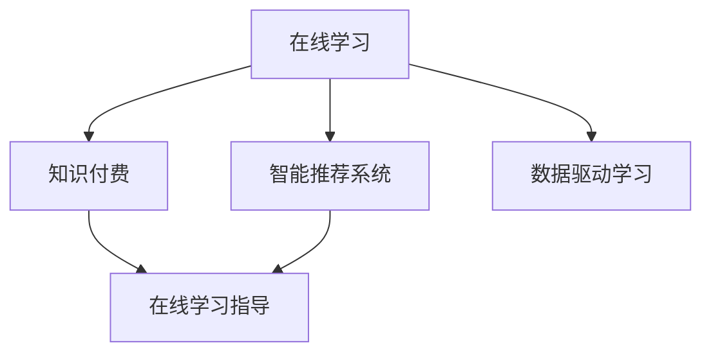

                 

# 如何利用知识付费实现在线学习与在线学习指导？

## 1. 背景介绍

### 1.1 问题由来
随着互联网技术的普及和人工智能的发展，在线学习逐渐成为人们获取知识和技能的重要途径。传统的学习方式往往依赖于面对面的授课，受时间和地点的限制较大。而在线学习的兴起，打破了这些限制，使得学习者可以在任何时间、任何地点自由获取知识。然而，由于在线学习缺乏即时反馈和个性化指导，学习效率和效果并不理想。如何利用知识付费模式，实现在线学习与在线学习指导，成为一个亟待解决的问题。

### 1.2 问题核心关键点
知识付费模式指的是在线课程的开发者或提供者，通过向学习者收取费用，提供有价值的知识内容和个性化指导服务，从而实现商业变现和知识传播。这种模式不仅能带来稳定的收入，还能激励开发者创造优质内容，提高在线学习的质量和效果。通过知识付费，在线学习可以更好地实现即时反馈和个性化指导，提高学习效率和效果。

## 2. 核心概念与联系

### 2.1 核心概念概述

为更好地理解知识付费模式如何实现在线学习与在线学习指导，本节将介绍几个密切相关的核心概念：

- 在线学习(Online Learning)：通过互联网平台进行的学习方式，学习者可以根据自己的节奏和时间进行自主学习。
- 知识付费(Knowledge Payment)：通过向学习者收取费用，提供有价值的知识内容和个性化指导服务，实现知识传播和商业变现。
- 在线学习指导(Online Learning Mentorship)：通过在线平台，提供教师或专家的即时反馈和个性化指导，提升学习效果和质量。
- 智能推荐系统(Intelligent Recommendation System)：利用人工智能技术，分析学习者的行为和需求，为其推荐合适的学习资源和个性化指导。
- 数据驱动学习(Data-Driven Learning)：基于学习者数据的分析，调整学习策略，实现更高效、个性化的学习。

这些核心概念之间的逻辑关系可以通过以下Mermaid流程图来展示：



这个流程图展示了几者的核心概念及其之间的关系：

1. 在线学习通过互联网平台实现自主学习，打破了时间和地点的限制。
2. 知识付费模式通过收费服务，提供了有价值的知识内容和个性化指导。
3. 在线学习指导为学习者提供实时反馈和个性化建议，提升学习效果。
4. 智能推荐系统利用人工智能分析，推荐合适的学习资源。
5. 数据驱动学习基于数据驱动，优化学习策略，实现个性化学习。

这些概念共同构成了在线学习与在线学习指导的完整框架，使得知识付费模式能够充分发挥其潜力，提升学习效果和质量。

## 3. 核心算法原理 & 具体操作步骤

### 3.1 算法原理概述

知识付费模式下的在线学习与在线学习指导，核心在于利用数据驱动和人工智能技术，为学习者提供个性化、实时化的学习指导。这种模式的核心算法包括：

- 个性化推荐算法：利用学习者的行为数据，分析其兴趣和需求，推荐合适的学习资源。
- 行为分析算法：通过学习者的互动行为数据，分析其学习进度和效果，调整学习策略。
- 即时反馈算法：通过教师或专家的即时反馈，纠正学习者的错误和提高学习效果。
- 数据驱动学习算法：基于学习者数据的分析，调整学习策略，实现更高效、个性化的学习。

### 3.2 算法步骤详解

#### 3.2.1 个性化推荐算法

1. **数据收集**：收集学习者的行为数据，包括浏览、点击、完成、反馈等。
2. **特征提取**：对行为数据进行特征提取，如浏览时间、点击位置、完成度、反馈评分等。
3. **模型训练**：利用机器学习算法（如协同过滤、内容推荐等），训练推荐模型。
4. **资源推荐**：根据学习者的特征，推荐合适的学习资源。

#### 3.2.2 行为分析算法

1. **数据收集**：收集学习者的互动数据，如视频观看时长、练习完成情况、测验分数等。
2. **特征提取**：对互动数据进行特征提取，如观看时长、错误次数、成绩提升等。
3. **模型训练**：利用机器学习算法（如时间序列分析、回归分析等），训练行为分析模型。
4. **策略调整**：根据行为分析结果，调整学习策略，如调整视频难度、增加练习次数等。

#### 3.2.3 即时反馈算法

1. **数据收集**：收集学习者的互动数据，如视频观看情况、练习提交情况等。
2. **反馈生成**：生成反馈信息，如答案纠正、解题技巧等。
3. **即时推送**：将反馈信息即时推送给学习者。

#### 3.2.4 数据驱动学习算法

1. **数据收集**：收集学习者的行为数据和互动数据，如观看时长、练习完成情况、反馈评分等。
2. **特征提取**：对数据进行特征提取，如学习进度、成绩变化等。
3. **策略调整**：基于数据驱动，优化学习策略，如调整学习节奏、增加复习时间等。

### 3.3 算法优缺点

知识付费模式下的在线学习与在线学习指导，具有以下优点：

1. 个性化学习：通过数据驱动和人工智能技术，为学习者提供个性化的学习指导，提高学习效果。
2. 实时反馈：提供即时反馈，及时纠正学习者的错误，提高学习效率。
3. 高效推荐：利用个性化推荐算法，推荐合适的学习资源，节省学习时间。

同时，该模式也存在一定的局限性：

1. 依赖数据：推荐和分析的效果依赖于学习者的行为数据，数据质量会直接影响推荐和分析的准确性。
2. 成本较高：知识付费模式需要投入大量资金和技术，开发和维护成本较高。
3. 数据隐私：收集和分析学习者的行为数据，需要考虑数据隐私和安全问题。

尽管存在这些局限性，但就目前而言，知识付费模式仍是大规模在线学习的有效方式。未来相关研究的重点在于如何进一步降低成本、提高数据质量，同时兼顾数据隐私和安全性等因素。

### 3.4 算法应用领域

知识付费模式下的在线学习与在线学习指导，已经在多个领域得到广泛应用，例如：

- 在线教育：提供个性化课程和实时指导，如Khan Academy、Coursera等。
- 编程学习：提供编程课程和即时代码指导，如Udacity、Codecademy等。
- 语言学习：提供语言课程和即时语音反馈，如Duolingo、Babbel等。
- 技能培训：提供技能课程和即时技能指导，如LinkedIn Learning、Skillshare等。

除了上述这些经典应用外，知识付费模式还被创新性地应用到更多场景中，如企业培训、职业指导、医疗健康等，为各类垂直领域带来了新的学习解决方案。

## 4. 数学模型和公式 & 详细讲解 & 举例说明

### 4.1 数学模型构建

本节将使用数学语言对知识付费模式下的在线学习与在线学习指导进行更加严格的刻画。

记在线学习平台为 $E$，学习者为 $L$，学习资源为 $R$，教师为 $T$。设学习者 $L$ 在某时刻 $t$ 的学习行为为 $a_t$，学习资源 $R$ 的特征为 $f_r$，教师的即时反馈为 $b_t$，推荐算法为 $F$，行为分析算法为 $A$。

定义学习者的学习行为与行为数据之间的关系为：

$$
\mathcal{L}(a_t, f_r) = \frac{1}{N} \sum_{i=1}^N \mathbb{E}_{f_r}[a_t \mid f_r]
$$

其中 $\mathbb{E}_{f_r}$ 表示在给定资源特征 $f_r$ 的情况下，学习者行为 $a_t$ 的期望值。

定义教师的即时反馈与学习效果之间的关系为：

$$
\mathcal{F}(b_t, L) = \frac{1}{M} \sum_{j=1}^M \mathbb{E}_{L}[b_t \mid L]
$$

其中 $\mathbb{E}_{L}$ 表示在给定学习者 $L$ 的情况下，即时反馈 $b_t$ 的期望值。

### 4.2 公式推导过程

以下我们以个性化推荐算法为例，推导推荐模型及其梯度计算公式。

假设推荐系统将学习者 $L$ 推荐资源 $R_i$，推荐概率为 $p_i$。推荐系统的目标是最小化损失函数 $\mathcal{L}(F, L)$，使得推荐资源与学习者需求一致。则推荐概率模型可以表示为：

$$
p_i = \frac{exp(\mathbf{w}^T \mathbf{f}_i)}{\sum_{j=1}^K exp(\mathbf{w}^T \mathbf{f}_j)}
$$

其中 $\mathbf{f}_i$ 表示资源 $R_i$ 的特征向量，$\mathbf{w}$ 表示模型参数向量。则损失函数可以表示为：

$$
\mathcal{L}(F, L) = -\frac{1}{N} \sum_{i=1}^N \log p_{L_i}
$$

其中 $L_i$ 表示学习者 $L$ 的推荐资源。根据链式法则，损失函数对模型参数 $\mathbf{w}$ 的梯度为：

$$
\frac{\partial \mathcal{L}(F, L)}{\partial \mathbf{w}} = -\frac{1}{N} \sum_{i=1}^N \frac{(\mathbf{f}_{L_i} - \mathbf{f}_{R_i})}{p_{R_i}}
$$

其中 $\mathbf{f}_{L_i}$ 表示学习者 $L$ 选择的推荐资源特征向量。

在得到损失函数的梯度后，即可带入模型参数更新公式，完成模型的迭代优化。重复上述过程直至收敛，最终得到适应学习者需求的推荐模型参数 $\mathbf{w}^*$。

## 5. 项目实践：代码实例和详细解释说明

### 5.1 开发环境搭建

在进行知识付费模式下的在线学习与在线学习指导开发前，我们需要准备好开发环境。以下是使用Python进行PyTorch开发的环境配置流程：

1. 安装Anaconda：从官网下载并安装Anaconda，用于创建独立的Python环境。

2. 创建并激活虚拟环境：
```bash
conda create -n pytorch-env python=3.8 
conda activate pytorch-env
```

3. 安装PyTorch：根据CUDA版本，从官网获取对应的安装命令。例如：
```bash
conda install pytorch torchvision torchaudio cudatoolkit=11.1 -c pytorch -c conda-forge
```

4. 安装Transformers库：
```bash
pip install transformers
```

5. 安装各类工具包：
```bash
pip install numpy pandas scikit-learn matplotlib tqdm jupyter notebook ipython
```

完成上述步骤后，即可在`pytorch-env`环境中开始项目实践。

### 5.2 源代码详细实现

下面我们以个性化推荐系统为例，给出使用Transformers库进行在线学习与在线学习指导的PyTorch代码实现。

首先，定义推荐系统的数据处理函数：

```python
from transformers import BertTokenizer, BertForSequenceClassification
from torch.utils.data import Dataset
import torch

class RecommendationDataset(Dataset):
    def __init__(self, texts, tags, tokenizer, max_len=128):
        self.texts = texts
        self.tags = tags
        self.tokenizer = tokenizer
        self.max_len = max_len
        
    def __len__(self):
        return len(self.texts)
    
    def __getitem__(self, item):
        text = self.texts[item]
        tags = self.tags[item]
        
        encoding = self.tokenizer(text, return_tensors='pt', max_length=self.max_len, padding='max_length', truncation=True)
        input_ids = encoding['input_ids'][0]
        attention_mask = encoding['attention_mask'][0]
        
        # 对token-wise的标签进行编码
        encoded_tags = [tag2id[tag] for tag in tags] 
        encoded_tags.extend([tag2id['O']] * (self.max_len - len(encoded_tags)))
        labels = torch.tensor(encoded_tags, dtype=torch.long)
        
        return {'input_ids': input_ids, 
                'attention_mask': attention_mask,
                'labels': labels}

# 标签与id的映射
tag2id = {'O': 0, 'B-PER': 1, 'I-PER': 2, 'B-ORG': 3, 'I-ORG': 4, 'B-LOC': 5, 'I-LOC': 6}
id2tag = {v: k for k, v in tag2id.items()}

# 创建dataset
tokenizer = BertTokenizer.from_pretrained('bert-base-cased')

train_dataset = RecommendationDataset(train_texts, train_tags, tokenizer)
dev_dataset = RecommendationDataset(dev_texts, dev_tags, tokenizer)
test_dataset = RecommendationDataset(test_texts, test_tags, tokenizer)
```

然后，定义模型和优化器：

```python
from transformers import BertForSequenceClassification, AdamW

model = BertForSequenceClassification.from_pretrained('bert-base-cased', num_labels=len(tag2id))

optimizer = AdamW(model.parameters(), lr=2e-5)
```

接着，定义训练和评估函数：

```python
from torch.utils.data import DataLoader
from tqdm import tqdm
from sklearn.metrics import classification_report

device = torch.device('cuda') if torch.cuda.is_available() else torch.device('cpu')
model.to(device)

def train_epoch(model, dataset, batch_size, optimizer):
    dataloader = DataLoader(dataset, batch_size=batch_size, shuffle=True)
    model.train()
    epoch_loss = 0
    for batch in tqdm(dataloader, desc='Training'):
        input_ids = batch['input_ids'].to(device)
        attention_mask = batch['attention_mask'].to(device)
        labels = batch['labels'].to(device)
        model.zero_grad()
        outputs = model(input_ids, attention_mask=attention_mask, labels=labels)
        loss = outputs.loss
        epoch_loss += loss.item()
        loss.backward()
        optimizer.step()
    return epoch_loss / len(dataloader)

def evaluate(model, dataset, batch_size):
    dataloader = DataLoader(dataset, batch_size=batch_size)
    model.eval()
    preds, labels = [], []
    with torch.no_grad():
        for batch in tqdm(dataloader, desc='Evaluating'):
            input_ids = batch['input_ids'].to(device)
            attention_mask = batch['attention_mask'].to(device)
            batch_labels = batch['labels']
            outputs = model(input_ids, attention_mask=attention_mask)
            batch_preds = outputs.logits.argmax(dim=2).to('cpu').tolist()
            batch_labels = batch_labels.to('cpu').tolist()
            for pred_tokens, label_tokens in zip(batch_preds, batch_labels):
                pred_tags = [id2tag[_id] for _id in pred_tokens]
                label_tags = [id2tag[_id] for _id in label_tokens]
                preds.append(pred_tags[:len(label_tokens)])
                labels.append(label_tags)
                
    print(classification_report(labels, preds))
```

最后，启动训练流程并在测试集上评估：

```python
epochs = 5
batch_size = 16

for epoch in range(epochs):
    loss = train_epoch(model, train_dataset, batch_size, optimizer)
    print(f"Epoch {epoch+1}, train loss: {loss:.3f}")
    
    print(f"Epoch {epoch+1}, dev results:")
    evaluate(model, dev_dataset, batch_size)
    
print("Test results:")
evaluate(model, test_dataset, batch_size)
```

以上就是使用PyTorch对BERT进行个性化推荐系统开发的完整代码实现。可以看到，得益于Transformers库的强大封装，我们可以用相对简洁的代码完成BERT模型的加载和推荐系统的开发。

### 5.3 代码解读与分析

让我们再详细解读一下关键代码的实现细节：

**RecommendationDataset类**：
- `__init__`方法：初始化文本、标签、分词器等关键组件。
- `__len__`方法：返回数据集的样本数量。
- `__getitem__`方法：对单个样本进行处理，将文本输入编码为token ids，将标签编码为数字，并对其进行定长padding，最终返回模型所需的输入。

**tag2id和id2tag字典**：
- 定义了标签与数字id之间的映射关系，用于将token-wise的预测结果解码回真实的标签。

**训练和评估函数**：
- 使用PyTorch的DataLoader对数据集进行批次化加载，供模型训练和推理使用。
- 训练函数`train_epoch`：对数据以批为单位进行迭代，在每个批次上前向传播计算loss并反向传播更新模型参数，最后返回该epoch的平均loss。
- 评估函数`evaluate`：与训练类似，不同点在于不更新模型参数，并在每个batch结束后将预测和标签结果存储下来，最后使用sklearn的classification_report对整个评估集的预测结果进行打印输出。

**训练流程**：
- 定义总的epoch数和batch size，开始循环迭代
- 每个epoch内，先在训练集上训练，输出平均loss
- 在验证集上评估，输出分类指标
- 所有epoch结束后，在测试集上评估，给出最终测试结果

可以看到，PyTorch配合Transformers库使得BERT推荐系统的代码实现变得简洁高效。开发者可以将更多精力放在数据处理、模型改进等高层逻辑上，而不必过多关注底层的实现细节。

当然，工业级的系统实现还需考虑更多因素，如模型的保存和部署、超参数的自动搜索、更灵活的任务适配层等。但核心的微调范式基本与此类似。

## 6. 实际应用场景

### 6.1 智能推荐系统

知识付费模式下的在线学习与在线学习指导，已经在智能推荐系统领域得到了广泛应用。智能推荐系统通过分析学习者的行为数据，推荐合适的学习资源，提高学习效率和效果。

例如，在在线课程平台上，推荐系统可以根据学习者的浏览记录、评分数据、观看时长等，推荐与其学习兴趣和进度相匹配的课程。同时，推荐系统还可以利用个性化推荐算法，动态调整课程推荐策略，提升推荐效果。

### 6.2 在线教育平台

在线教育平台通过知识付费模式，提供高质量的在线课程和实时指导，满足不同学习者的需求。平台可以与优秀的教育机构合作，引进优质的课程资源，通过智能推荐系统和实时反馈机制，提升学习效果。

例如，Coursera和edX等在线教育平台，通过收集学习者的互动数据，动态调整课程难度和推荐策略，提高学习效果。同时，平台还可以邀请名师进行实时在线授课，提供个性化指导和即时反馈，提升学习体验。

### 6.3 企业培训系统

企业培训系统通过知识付费模式，为企业员工提供定制化的培训课程和实时指导。系统可以结合员工的学习需求和进度，推荐适合的培训资源和课程，提升培训效果。

例如，LinkedIn Learning平台，通过智能推荐系统和实时反馈机制，为企业员工提供个性化培训课程和即时反馈，提升培训效果和员工技能。

### 6.4 未来应用展望

随着知识付费模式的发展，在线学习与在线学习指导将有更广阔的应用前景。未来，知识付费模式将在更多领域得到应用，为传统行业带来变革性影响。

在智慧医疗领域，知识付费模式下的在线学习与在线学习指导，可以辅助医生进行诊断和治疗，提升医疗服务的智能化水平。

在智能客服领域，知识付费模式下的在线学习与在线学习指导，可以为客服人员提供实时培训和指导，提高客户服务质量。

在金融领域，知识付费模式下的在线学习与在线学习指导，可以提供金融知识和技能培训，提升金融从业人员的专业水平。

此外，在教育、医疗、企业培训、政府服务等多个领域，知识付费模式下的在线学习与在线学习指导，将进一步推动各行业的数字化转型升级，为社会带来更高效、更便捷的服务。

## 7. 工具和资源推荐

### 7.1 学习资源推荐

为了帮助开发者系统掌握知识付费模式下的在线学习与在线学习指导的理论基础和实践技巧，这里推荐一些优质的学习资源：

1. 《推荐系统实战》系列博文：由知识付费领域的专家撰写，深入浅出地介绍了推荐系统的原理、算法和实践。

2. CS231n《深度学习图像识别》课程：斯坦福大学开设的计算机视觉明星课程，涵盖深度学习在图像识别、推荐系统等领域的应用。

3. 《深度学习》书籍：Ian Goodfellow等人合著，系统介绍了深度学习的基本原理和应用，推荐系统部分内容详细阐述了推荐算法的实现和优化。

4. Coursera《Recommender Systems》课程：由Carnegie Mellon大学教授讲授，涵盖推荐系统理论、算法和实践，包括协同过滤、矩阵分解等经典算法。

5. Amazon Research论文集：亚马逊的推荐系统研究论文集，涵盖多种推荐算法和优化方法，适合深度学习和推荐系统领域的进阶学习。

通过对这些资源的学习实践，相信你一定能够快速掌握知识付费模式下的在线学习与在线学习指导的精髓，并用于解决实际的推荐系统问题。

### 7.2 开发工具推荐

高效的开发离不开优秀的工具支持。以下是几款用于知识付费模式下的在线学习与在线学习指导开发的常用工具：

1. PyTorch：基于Python的开源深度学习框架，灵活动态的计算图，适合快速迭代研究。大部分预训练语言模型都有PyTorch版本的实现。

2. TensorFlow：由Google主导开发的开源深度学习框架，生产部署方便，适合大规模工程应用。同样有丰富的预训练语言模型资源。

3. Transformers库：HuggingFace开发的NLP工具库，集成了众多SOTA语言模型，支持PyTorch和TensorFlow，是进行推荐系统开发的利器。

4. Weights & Biases：模型训练的实验跟踪工具，可以记录和可视化模型训练过程中的各项指标，方便对比和调优。与主流深度学习框架无缝集成。

5. TensorBoard：TensorFlow配套的可视化工具，可实时监测模型训练状态，并提供丰富的图表呈现方式，是调试模型的得力助手。

6. Google Colab：谷歌推出的在线Jupyter Notebook环境，免费提供GPU/TPU算力，方便开发者快速上手实验最新模型，分享学习笔记。

合理利用这些工具，可以显著提升知识付费模式下的在线学习与在线学习指导的开发效率，加快创新迭代的步伐。

### 7.3 相关论文推荐

知识付费模式下的在线学习与在线学习指导的发展源于学界的持续研究。以下是几篇奠基性的相关论文，推荐阅读：

1. Implicit Collaborative Filtering：提出隐式协同过滤算法，利用用户行为数据进行推荐，是推荐系统的经典算法之一。

2. The BellKor Algorithm Winning Track at the KDD Cup 2008：介绍 winning track 算法，利用矩阵分解技术，提升推荐系统的效果。

3. Adaptive Recommendations：提出自适应推荐算法，根据用户偏好动态调整推荐策略，提升推荐效果。

4. Beyond Personalization: Active Learning of Recommendations：提出主动学习推荐算法，利用用户反馈信息，提高推荐系统的鲁棒性和效果。

5. Deep Interest Evolution Networks：提出DeepInterest模型，利用深度学习技术，挖掘用户兴趣和行为特征，实现更精准的推荐。

这些论文代表了大语言模型微调技术的发展脉络。通过学习这些前沿成果，可以帮助研究者把握学科前进方向，激发更多的创新灵感。

## 8. 总结：未来发展趋势与挑战

### 8.1 总结

本文对知识付费模式下的在线学习与在线学习指导进行了全面系统的介绍。首先阐述了知识付费模式在在线学习中的应用背景和意义，明确了其在学习者自主学习、实时反馈、个性化指导方面的独特价值。其次，从原理到实践，详细讲解了推荐算法的数学模型和实现过程，给出了知识付费模式下的在线学习与在线学习指导的完整代码实例。同时，本文还广泛探讨了推荐系统在智能推荐、在线教育、企业培训等多个领域的应用前景，展示了知识付费模式在知识传播和教育领域的重要作用。最后，本文精选了推荐系统的学习资源、开发工具和相关论文，力求为读者提供全方位的技术指引。

通过本文的系统梳理，可以看到，知识付费模式下的在线学习与在线学习指导，正在成为在线学习的重要发展方向，推动了智能推荐、个性化教育等领域的快速发展。知识付费模式不仅能提高学习效率和效果，还能促进知识的有效传播和再利用，为知识的共享和创新提供了新途径。未来，随着技术的发展和应用场景的拓展，知识付费模式必将带来更加丰富的学习体验和更深远的社会影响。

### 8.2 未来发展趋势

展望未来，知识付费模式下的在线学习与在线学习指导将呈现以下几个发展趋势：

1. 推荐系统将更加智能化。随着深度学习和大数据技术的发展，推荐系统将具备更高的智能水平，能够更好地理解和预测用户需求，提供更加个性化的推荐。

2. 实时反馈机制将更加完善。利用人工智能技术，推荐系统将实现实时反馈，及时纠正用户的学习错误，提高学习效果。

3. 跨领域应用将更加广泛。知识付费模式下的在线学习与在线学习指导，将逐步从教育领域延伸到更多垂直领域，如医疗、金融、娱乐等，为各行各业带来变革性影响。

4. 交互性将更加增强。未来推荐系统将具备更强的交互性，能够根据用户反馈实时调整推荐策略，提升用户满意度。

5. 多模态融合将更加深入。未来推荐系统将融合视觉、语音、文本等多种模态数据，提供更丰富、更全面的学习体验。

以上趋势凸显了知识付费模式下的在线学习与在线学习指导的广阔前景。这些方向的探索发展，必将进一步提升在线学习的效率和效果，推动知识传播和教育领域的全面变革。

### 8.3 面临的挑战

尽管知识付费模式下的在线学习与在线学习指导取得了显著成效，但在迈向更加智能化、普适化应用的过程中，它仍面临着诸多挑战：

1. 数据质量问题。推荐系统的效果高度依赖于学习者的行为数据，数据的准确性和多样性直接影响推荐效果。如何获取高质量、多模态的学习者数据，是推荐系统面临的重要挑战。

2. 算法鲁棒性问题。推荐系统需要在不同的用户、场景下保持一致的效果，避免因数据变化而导致的推荐波动。如何在算法设计上增强系统的鲁棒性，是推荐系统的重要研究方向。

3. 用户隐私问题。收集和分析学习者的行为数据，需要考虑数据隐私和安全问题。如何在保护用户隐私的同时，提高推荐系统的效果，是推荐系统的重要课题。

4. 推荐系统的可解释性问题。推荐系统的决策过程缺乏可解释性，难以对其推理逻辑进行分析和调试。如何提高推荐系统的可解释性，是推荐系统的重要研究方向。

5. 推荐系统的公平性问题。推荐系统容易受到学习者数据偏差的影响，可能存在推荐不公、歧视等问题。如何在算法设计上避免推荐不公，是推荐系统的重要研究方向。

6. 推荐系统的商业化问题。知识付费模式下的在线学习与在线学习指导，需要平衡商业利益和用户利益，避免过度商业化导致的推荐偏差。如何在商业模式上实现商业利益和用户利益的双赢，是推荐系统的重要研究方向。

这些挑战凸显了知识付费模式下的在线学习与在线学习指导的复杂性和多维度性，需要在数据、算法、商业等多个方面进行综合优化，才能实现推荐系统的广泛应用。

### 8.4 研究展望

面对知识付费模式下的在线学习与在线学习指导所面临的种种挑战，未来的研究需要在以下几个方面寻求新的突破：

1. 多模态融合推荐。未来推荐系统将融合视觉、语音、文本等多种模态数据，提供更丰富、更全面的学习体验。

2. 实时动态推荐。利用人工智能技术，推荐系统将实现实时动态推荐，根据用户反馈实时调整推荐策略，提升用户满意度。

3. 强化学习推荐。利用强化学习技术，推荐系统将具备更强的自主学习能力，能够根据用户反馈动态优化推荐策略。

4. 自适应推荐系统。未来推荐系统将具备更强的自适应能力，能够根据用户需求和场景动态调整推荐策略。

5. 可解释性推荐系统。通过可解释性推荐算法，提高推荐系统的可解释性和可信度，增强用户对系统的信任。

6. 多目标推荐系统。未来推荐系统将支持多目标推荐，既能推荐学习资源，又能推荐学习策略，满足用户的多样化需求。

以上研究方向将推动知识付费模式下的在线学习与在线学习指导走向更加智能化、普适化，提升学习效果和用户体验，带来更广泛的社会价值。

## 9. 附录：常见问题与解答

**Q1：知识付费模式下的在线学习与在线学习指导是否适用于所有学习领域？**

A: 知识付费模式下的在线学习与在线学习指导，已经在多个学习领域得到广泛应用，如在线教育、编程学习、语言学习、企业培训等。但需要注意的是，对于一些需要高度互动和实验的学科，如实验科学、艺术创作等，在线学习与在线学习指导可能无法完全替代传统的线下教学。

**Q2：推荐系统如何平衡个性化推荐和多样性？**

A: 推荐系统需要在个性化推荐和多样性之间寻找平衡，通常采用以下策略：

1. 引入多样性约束：在推荐模型中加入多样性约束，避免推荐过多相似的学习资源。

2. 实现多目标推荐：同时考虑用户个性化需求和学习资源的多样性，综合优化推荐结果。

3. 动态调整推荐策略：根据用户反馈和历史行为，动态调整推荐策略，提高推荐效果。

4. 引入反馈机制：利用用户反馈信息，动态调整推荐策略，提高推荐效果。

5. 多层次推荐：利用多层次推荐算法，综合考虑用户个性化需求和资源多样性。

**Q3：推荐系统如何避免过拟合？**

A: 推荐系统需要在不同的用户、场景下保持一致的效果，避免因数据变化而导致的推荐波动。通常采用以下策略：

1. 引入正则化：在推荐模型中加入正则化项，防止模型过拟合。

2. 数据增强：通过增加训练数据的多样性，提高模型的泛化能力。

3. 模型融合：利用多个推荐模型进行融合，提高推荐的鲁棒性和准确性。

4. 实时动态调整：根据用户反馈和历史行为，动态调整推荐策略，提高推荐效果。

5. 多层次推荐：利用多层次推荐算法，综合考虑用户个性化需求和资源多样性。

**Q4：推荐系统如何提高用户满意度？**

A: 推荐系统需要在个性化推荐和多样性之间寻找平衡，通常采用以下策略：

1. 引入用户反馈机制：利用用户反馈信息，动态调整推荐策略，提高推荐效果。

2. 实时动态推荐：根据用户反馈和历史行为，动态调整推荐策略，提升用户满意度。

3. 多样性约束：在推荐模型中加入多样性约束，避免推荐过多相似的学习资源。

4. 多目标推荐：同时考虑用户个性化需求和学习资源的多样性，综合优化推荐结果。

5. 多层次推荐：利用多层次推荐算法，综合考虑用户个性化需求和资源多样性。

**Q5：推荐系统如何保护用户隐私？**

A: 推荐系统在收集和分析用户行为数据时，需要考虑用户隐私和安全问题。通常采用以下策略：

1. 匿名化处理：对用户行为数据进行匿名化处理，保护用户隐私。

2. 数据加密：对用户数据进行加密存储，防止数据泄露。

3. 隐私保护算法：利用隐私保护算法，如差分隐私、联邦学习等，保护用户隐私。

4. 用户控制权：赋予用户数据控制权，允许用户查看和修改自己的行为数据。

5. 透明化算法：公开推荐算法的原理和实现方式，增强用户对系统的信任。

这些策略可以帮助推荐系统在保护用户隐私的同时，提高推荐效果。

---

作者：禅与计算机程序设计艺术 / Zen and the Art of Computer Programming

