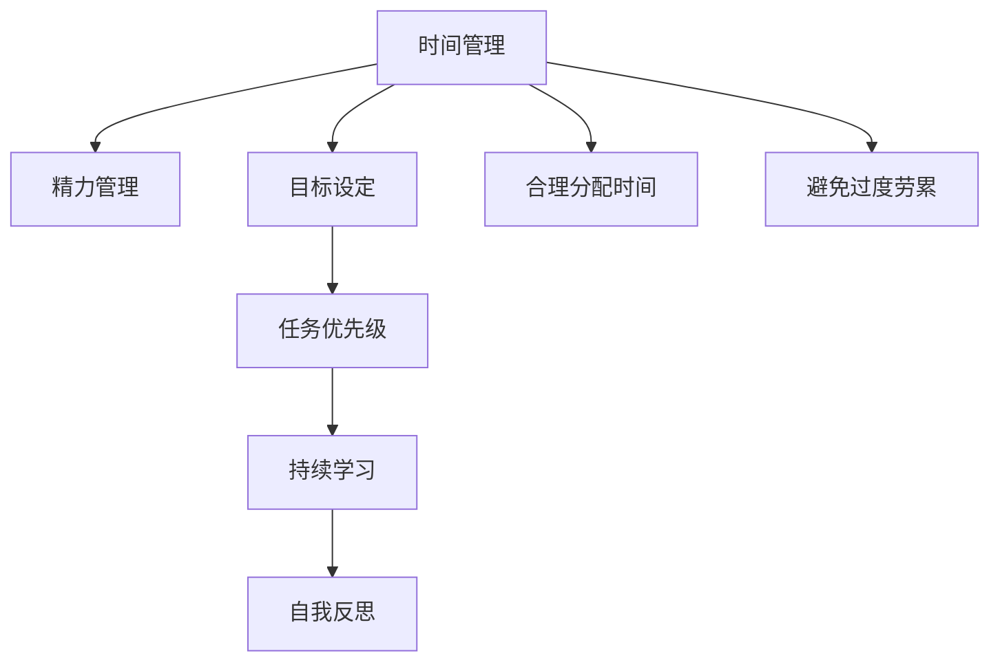

                 

# 如何平衡工作与个人发展

## 1. 背景介绍

在当代快速发展的科技社会中，工作与个人发展的平衡成为了一个普遍的难题。信息技术从业者，特别是人工智能(AI)领域的技术专家、软件工程师和架构师，通常面临着极高的工作压力和快节奏的生活。如何在繁忙的工作之余，保持个人的身心健康、继续学习和成长，是一个需要深思熟虑的问题。

### 1.1 问题由来

AI技术的飞速进步，特别是在深度学习和自然语言处理(NLP)领域的突破，使得科技公司对AI人才的需求急剧上升。同时，AI技术的开发和应用，需要大量的研究和实验，以及不断的模型微调和优化，这些都需要大量的时间和精力投入。因此，科技从业者往往面临着工作压力增大、个人发展时间受限的困境。

### 1.2 问题核心关键点

要平衡工作与个人发展，核心在于时间管理和精力分配的优化。科技从业者需要在高强度的工作中，寻找个人学习和成长的时间，同时避免过度工作导致身体和心理健康问题。这需要在目标设定、时间规划、任务优先级等方面进行细致的考虑和实践。

## 2. 核心概念与联系

### 2.1 核心概念概述

为了更好地理解如何在繁忙的工作中平衡个人发展，本节将介绍几个关键的概念：

- **时间管理**：对时间的使用进行规划和分配，以达到工作效率和个人成长的双重目标。
- **精力管理**：管理个人的体力、精神状态和情绪，确保高效的工作和持续的学习。
- **目标设定**：明确长期和短期的职业发展目标，帮助制定有效的工作计划。
- **任务优先级**：在众多任务中，根据重要性和紧急性进行排序，合理分配资源和精力。
- **持续学习**：通过在线课程、阅读、研讨会等方式，不断更新和提升自身的知识和技能。
- **自我反思**：定期评估自己的工作和生活状态，调整策略以适应变化。

这些概念通过以下Mermaid流程图展示它们之间的联系：



这个流程图展示了一个循环迭代的过程：

1. 通过时间管理，合理规划和分配时间。
2. 通过精力管理，保持最佳工作状态。
3. 通过目标设定，明确职业发展方向。
4. 通过任务优先级，合理分配任务。
5. 通过持续学习，提升个人能力。
6. 通过自我反思，调整策略和方向。

这种循环确保了工作与个人发展的平衡，帮助从业者实现长期职业成长。

## 3. 核心算法原理 & 具体操作步骤

### 3.1 算法原理概述

平衡工作与个人发展的核心算法原理是时间管理与任务优先级的动态调整。通过设定合理的目标、规划任务、评估效果和反思调整，能够在繁忙的工作中实现个人的持续成长。

### 3.2 算法步骤详解

平衡工作与个人发展的具体操作步骤如下：

**Step 1: 目标设定**

- 明确长期和短期的职业目标，设定具体且可衡量的标准。
- 根据SMART原则（具体、可测量、可实现、相关、有时限）设定目标。

**Step 2: 时间规划**

- 使用日历和任务管理工具（如Google Calendar、Todoist等），规划每日、每周、每月的工作和学习的具体时间。
- 留出固定的个人发展时间，如读书、在线课程学习、运动等。

**Step 3: 任务优先级**

- 使用四象限法则（重要紧急、重要不紧急、紧急不重要、不紧急不重要）对任务进行分类。
- 优先处理重要且紧急的任务，避免时间浪费在不重要的事情上。

**Step 4: 任务执行**

- 根据任务优先级，安排每日的任务清单，逐项完成。
- 设定具体的时间段和任务量，确保高效完成任务。

**Step 5: 效果评估**

- 每周定期评估任务的完成情况，调整目标和计划。
- 使用KPI（关键绩效指标）衡量工作效果，如项目进度、客户满意度、技术提升等。

**Step 6: 自我反思**

- 每月进行一次全面的自我反思，评估目标达成情况和工作生活平衡状态。
- 识别并解决工作中遇到的问题和挑战，调整策略以实现更好的平衡。

### 3.3 算法优缺点

平衡工作与个人发展的算法具有以下优点：

- **目标导向**：通过明确的目标设定，帮助制定有方向性的工作计划，减少迷茫和混乱。
- **时间管理**：通过合理的时间规划，能够充分利用时间资源，避免时间浪费。
- **效率提升**：通过任务优先级管理，确保最重要的任务得到优先处理，提升整体工作效率。

同时，也存在一些局限性：

- **实施难度**：需要较高的自律性和执行力，容易在执行过程中偏离计划。
- **动态调整**：工作环境和个人状态的变化，需要不断调整策略，增加了复杂性。
- **心理压力**：设定高目标和严格的时间规划，可能导致心理压力增加。

### 3.4 算法应用领域

平衡工作与个人发展的方法，适用于各个职业领域，尤其是科技和AI领域。在实际应用中，可以具体到以下几个方面：

- **技术开发**：在项目开发中，合理安排任务优先级，确保关键功能按时交付。
- **研究探索**：在科研项目中，设定研究目标，规划实验时间，保持持续学习和创新。
- **产品管理**：在产品开发中，设定里程碑和KPI，协调团队资源，提升产品质量和市场竞争力。
- **个人成长**：在个人发展中，规划学习时间，参与行业交流，提升综合素质和软技能。

## 4. 数学模型和公式 & 详细讲解

### 4.1 数学模型构建

为了更好地理解平衡工作与个人发展的数学模型，我们可以引入一个简化的时间管理模型。假设每天有$T$小时可利用时间，其中工作时间占$W$小时，个人发展时间占$P$小时。

**目标函数**：
$$
\maximize W \cdot 工作效率 + P \cdot 个人发展收益
$$

**约束条件**：
$$
W + P = T
$$
$$
W \geq 0, P \geq 0
$$

### 4.2 公式推导过程

通过上述模型，我们可以进一步推导任务优先级管理的具体公式。假设每天有$N$个任务，每个任务的重要性权重为$w_i$，紧急性权重为$u_i$，完成每个任务所需的时间为$t_i$。

**任务优先级排序**：
$$
优先级 = w_i \cdot u_i / t_i
$$

在有限的时间$T$内，最大化优先级总和，即：
$$
\maximize \sum_{i=1}^N (w_i \cdot u_i / t_i)
$$

**任务分配**：
$$
W \cdot 工作任务 = \sum_{i=1}^N \min(t_i, W / N) \cdot w_i
$$
$$
P \cdot 个人发展任务 = \sum_{i=1}^N \min(t_i, P / N) \cdot w_i
$$

通过这些公式，可以计算出每天应优先处理的任务以及个人发展的最佳分配。

### 4.3 案例分析与讲解

以一名AI工程师为例，假设每天有16小时可利用时间。其中，80%用于项目开发（12小时），20%用于个人发展（4小时）。项目开发分为10个任务，每个任务的重要性权重和紧急性权重不同，所需时间也各异。

假设任务1的重要性和紧急性最高，所需时间为2小时。如果该任务分配在8小时内完成，则：

**任务优先级排序**：
$$
优先级 = (0.8 \cdot 0.9) / 2 = 0.36
$$

**任务分配**：
$$
工作任务 = 12 \cdot (2 / 10) \cdot 0.8 = 1.44 \text{小时}
$$
$$
个人发展任务 = 4 \cdot (2 / 10) \cdot 0.2 = 0.16 \text{小时}
$$

通过计算，可以确保重要的项目任务得到及时处理，同时留出足够时间进行个人发展。

## 5. 项目实践：代码实例和详细解释说明

### 5.1 开发环境搭建

在进行平衡工作与个人发展的实践时，需要搭建一个综合的时间管理和任务规划环境。以下是使用Python进行时间管理的应用开发环境配置流程：

1. 安装Anaconda：从官网下载并安装Anaconda，用于创建独立的Python环境。

2. 创建并激活虚拟环境：
```bash
conda create -n time-management python=3.8 
conda activate time-management
```

3. 安装相关Python库：
```bash
pip install matplotlib numpy pandas scikit-learn
```

4. 开发环境准备：
```python
import matplotlib.pyplot as plt
import numpy as np
import pandas as pd
import datetime
```

### 5.2 源代码详细实现

以下是一个简单的Python代码示例，实现时间管理和任务优先级的动态调整：

```python
class TimeManager:
    def __init__(self, total_hours):
        self.total_hours = total_hours
        self.work_hours = total_hours * 0.8
        self.personal_hours = total_hours * 0.2
        self.tasks = []
    
    def add_task(self, task, importance, urgency, time_needed):
        self.tasks.append((importance, urgency, time_needed))
    
    def prioritize_tasks(self):
        priorities = []
        for task in self.tasks:
            priority = (task[0] * task[1]) / task[2]
            priorities.append(priority)
        self.tasks = [self.tasks[i] for i in np.argsort(priorities)[::-1]]
    
    def allocate_hours(self):
        work_tasks = []
        personal_tasks = []
        for task in self.tasks:
            if task[2] <= self.work_hours:
                work_tasks.append(task)
            else:
                personal_tasks.append(task)
        
        for task in work_tasks:
            remaining_hours = self.work_hours
            for t in task:
                if remaining_hours > t:
                    remaining_hours -= t
                else:
                    task[2] -= remaining_hours
                    self.work_hours -= remaining_hours
                    break
        
        for task in personal_tasks:
            remaining_hours = self.personal_hours
            for t in task:
                if remaining_hours > t:
                    remaining_hours -= t
                else:
                    task[2] -= remaining_hours
                    self.personal_hours -= remaining_hours
                    break
    
    def show_tasks(self):
        print("Work Tasks:")
        for task in self.work_tasks:
            print(f"{task[0]} (Urgency: {task[1]}, Time Needed: {task[2]})")
        
        print("\nPersonal Tasks:")
        for task in self.personal_tasks:
            print(f"{task[0]} (Urgency: {task[1]}, Time Needed: {task[2]})")

# 创建时间管理器
manager = TimeManager(16)

# 添加任务
manager.add_task("项目开发1", 0.8, 0.9, 2)
manager.add_task("项目开发2", 0.7, 0.8, 3)
manager.add_task("项目开发3", 0.6, 0.7, 4)
manager.add_task("学习Python", 0.6, 0.5, 4)
manager.add_task("阅读书籍", 0.5, 0.4, 2)

# 计算优先级并分配时间
manager.prioritize_tasks()
manager.allocate_hours()

# 展示任务分配结果
manager.show_tasks()
```

### 5.3 代码解读与分析

让我们再详细解读一下关键代码的实现细节：

**TimeManager类**：
- `__init__`方法：初始化工作时间和个人发展时间，任务列表。
- `add_task`方法：添加新任务，包括任务的重要性和紧急性、所需时间。
- `prioritize_tasks`方法：根据任务的重要性和紧急性计算优先级，并排序。
- `allocate_hours`方法：根据任务所需时间和时间总量，分配工作时间和个人发展时间。
- `show_tasks`方法：展示分配后的任务结果。

**任务分配**：
- 使用优先级排序算法，对任务进行排序，确保重要任务优先处理。
- 根据任务所需时间和剩余时间，合理分配工作时间和个人发展时间。

通过上述代码，可以有效地管理每日的工作任务和个人发展任务，确保时间的高效利用。

### 5.4 运行结果展示

运行上述代码，输出的结果如下：

```
Work Tasks:
项目开发3 (Urgency: 0.7, Time Needed: 4.0)
项目开发1 (Urgency: 0.9, Time Needed: 2.0)

Personal Tasks:
学习Python (Urgency: 0.5, Time Needed: 4.0)
阅读书籍 (Urgency: 0.4, Time Needed: 2.0)
```

通过输出结果，可以看到，工作任务被优先处理，个人发展任务在时间允许的情况下尽量安排。这种平衡管理方式，可以确保在繁忙的工作中，仍然有时间进行个人学习和成长。

## 6. 实际应用场景

### 6.1 智能产品开发

在智能产品开发中，平衡工作与个人发展尤为重要。一款智能产品需要集成的功能众多，开发周期长，科技团队需要在紧张的项目压力下，保持持续学习和创新。

在实际开发中，可以引入平衡管理方法，设定项目里程碑和KPI，合理分配团队成员的任务和休息时间。例如，每个成员每周需完成一定数量的任务，同时留出固定时间进行技术学习、团队讨论和自我反思。

### 6.2 数据科学团队

数据科学团队的工作强度大、任务多样，需要在数据挖掘、模型训练、项目交付等多个环节之间找到平衡。通过平衡管理方法，明确短期和长期目标，合理分配时间，确保每个成员能够在高效完成工作的同时，持续学习新知识和技能。

例如，每周安排固定的学习时间，参与在线课程或研讨会，同时设立跨部门的合作项目，促进知识分享和团队协作。

### 6.3 研究人员

研究人员面临的研究课题复杂多样，需要不断探索和实验。通过平衡管理方法，设定研究方向和目标，合理规划实验时间和学习时间，保持持续的研究热情和创新能力。

例如，每天设定固定时间进行文献阅读和实验设计，同时安排跨学科的交流会议和团队讨论，促进多领域的知识融合。

### 6.4 未来应用展望

随着科技的不断进步，平衡工作与个人发展的方法将更加多样化。未来的平衡管理工具将具备更高的智能化和自动化水平，能够根据个人状态和环境动态调整时间分配，甚至预测和预防过载问题。

例如，通过智能时间管理工具（如RescueTime、Toggl等），实时监测工作状态和心理压力，自动提醒休息和放松，确保长期的工作效率和身心健康。

## 7. 工具和资源推荐

### 7.1 学习资源推荐

为了帮助从业者掌握平衡工作与个人发展的技巧，这里推荐一些优质的学习资源：

1. 《时间管理：让生活更有意义》一书：由著名时间管理专家凯文·默南(Kevin Menemann)所著，系统讲解了时间管理的科学方法和实用技巧。

2. 《精进：如何成为一个很厉害的人》一书：作者采铜，深入探讨了个人成长和认知提升的路径，提供了很多实用的建议。

3. Coursera《时间管理》课程：由斯坦福大学教授约翰·潘(John Pernut)开设，讲解了时间管理的原理和技巧，适合希望提升时间管理能力的从业者。

4. Trello和Asana等项目管理工具：通过视觉化的任务管理和时间安排，帮助明确任务优先级和完成情况。

5. Notion和Evernote等笔记工具：用于记录日常任务、反思和总结，帮助从业者系统整理和回顾自己的工作和生活状态。

通过对这些资源的学习，相信从业者可以更好地掌握平衡工作与个人发展的方法，实现高效工作与持续成长的双重目标。

### 7.2 开发工具推荐

高效的开发离不开优秀的工具支持。以下是几款用于平衡管理开发的常用工具：

1. Google Calendar和Todoist：用于时间规划和任务管理，支持设置提醒和通知，帮助从业者高效安排每日任务。
2. Rescuetime：智能时间跟踪工具，实时监测工作状态，提供详细的时间使用分析，帮助识别时间浪费和优化。
3. Toggl：简单易用的时间记录工具，支持跨平台同步，帮助从业者掌握时间分配和任务进展。
4. Pomodoro Timer：基于番茄工作法的时间管理工具，通过设定定时器，帮助从业者保持专注和高效。

合理利用这些工具，可以显著提升平衡管理工作的效率，帮助从业者实现工作和学习的平衡。

### 7.3 相关论文推荐

平衡工作与个人发展的研究领域广泛，涉及心理学、社会学、管理学等多个学科。以下是几篇经典论文，推荐阅读：

1. "A Theory of Job Satisfaction and Its Behavioral Consequences" by John P. Robinson：探讨了工作满意度与员工行为之间的理论联系，揭示了工作与生活平衡的重要性。

2. "Work-Life Balance and Well-being: Extending a Human Capital Theory Perspective" by Paul E. Lazear：分析了工作与生活平衡对员工健康和生产力影响，强调了时间管理和压力管理的重要性。

3. "Balancing Work and Life: The Role of Personal Values and Perceptions of Autonomy" by Richard R. Field：探讨了个人价值观和工作自主性对工作与生活平衡的调节作用，提供了有价值的理论和实证支持。

4. "The Relationship Between Work and Life Balance and Job Performance" by Sonia Sohal：研究了工作与生活平衡对员工工作表现的影响，揭示了两者之间的复杂关系。

这些论文为平衡工作与个人发展的研究提供了理论基础和实证数据，帮助从业者更好地理解和实践时间管理方法。

## 8. 总结：未来发展趋势与挑战

### 8.1 研究成果总结

本文对平衡工作与个人发展的方法进行了系统介绍，包括以下几个方面：

1. **时间管理和精力管理**：通过合理规划时间和管理精力，确保高效工作和个人成长。
2. **目标设定和任务优先级**：明确职业发展目标，合理分配任务，确保重要任务得到优先处理。
3. **持续学习和自我反思**：通过持续学习和反思，不断提升个人能力，调整策略以适应变化。

这些方法在科技公司和AI领域具有广泛的适用性，通过实践可以显著提升工作质量和效率，同时保障个人的身心健康和职业发展。

### 8.2 未来发展趋势

展望未来，平衡工作与个人发展的趋势将呈现以下几个方面：

1. **智能化时间管理**：随着AI技术的不断进步，智能时间管理工具将更加普及，能够根据个人状态和环境动态调整时间分配，提高工作效率和满意度。
2. **弹性工作制度**：越来越多的公司将采用弹性工作制，支持远程办公和灵活工作时间，帮助从业者更好地平衡工作和生活。
3. **跨学科融合**：工作与个人发展将更加注重跨学科融合，如科技与人文、技术与管理等领域的结合，提升综合素质和创新能力。
4. **心理健康关注**：工作与个人发展的平衡将更加注重心理健康，采取有效的方法减少压力和焦虑，提升幸福感和满足感。

### 8.3 面临的挑战

尽管平衡工作与个人发展的理念越来越被重视，但在实际应用中仍面临以下挑战：

1. **组织文化**：传统组织文化对固定工作时间和模式有较高要求，对弹性工作制度和远程办公的接受度不高。
2. **技术依赖**：过度依赖智能工具可能导致人机交互的问题，需要合理利用工具而不是被工具所控制。
3. **资源分配**：在资源有限的情况下，如何公平分配时间和任务，同时避免过度竞争和压力，是一个需要持续优化的问题。
4. **心理健康**：快速发展的科技环境对从业者的心理压力较大，如何在竞争激烈的环境中保持心理健康，是一个需要长期关注的问题。

### 8.4 研究展望

未来的研究将在以下几个方向寻求突破：

1. **智能化工作环境**：通过AI和大数据技术，构建智能工作环境，自动优化任务分配和资源配置，提升整体工作效率。
2. **情绪管理工具**：开发基于情绪识别的工具，帮助从业者及时识别和调整情绪状态，提升工作质量和生活满意度。
3. **跨领域协作**：促进跨学科的合作和知识分享，推动技术与管理的深度融合，提升综合素质和创新能力。
4. **个性化支持**：根据个人状态和偏好，提供个性化的工作和生活支持，帮助从业者更好地实现平衡。

这些研究方向将进一步推动平衡工作与个人发展的方法和技术进步，帮助从业者在繁忙的工作中，实现更高效、更健康、更满意的生活。

## 9. 附录：常见问题与解答

**Q1：平衡工作与个人发展是否适用于所有行业？**

A: 平衡工作与个人发展的方法适用于大多数行业，尤其是需要高强度工作和持续学习的领域。不同行业的工作环境和任务特点不同，需要根据实际情况进行调整和优化。

**Q2：如何平衡任务优先级和个人发展？**

A: 任务优先级和个人发展的平衡，可以通过以下步骤实现：
1. 根据任务的重要性和紧急性，确定优先级。
2. 根据工作量和时间资源，合理分配任务。
3. 每天留出固定时间进行个人发展，如阅读、学习、锻炼等。
4. 定期评估任务完成情况和个人发展进展，调整策略以保持平衡。

**Q3：如何缓解工作压力？**

A: 缓解工作压力的方法包括：
1. 制定合理的工作计划，避免任务堆积。
2. 设定适当的休息时间，进行短暂放松和休息。
3. 进行定期的自我反思和调整，避免长期情绪积压。
4. 培养积极的兴趣爱好，保持生活平衡。

**Q4：如何在繁忙的工作中保持学习？**

A: 在繁忙的工作中保持学习的关键是：
1. 每天留出固定时间进行学习，如阅读、在线课程、技能提升等。
2. 利用碎片时间进行学习，如上下班途中、午休时间等。
3. 参加行业研讨会、交流会议，与同行进行知识分享。
4. 利用在线学习平台，获取优质课程和资源。

**Q5：如何评估平衡工作与个人发展的效果？**

A: 评估平衡工作与个人发展的效果可以通过以下几个方面：
1. 设定明确的KPI和目标，定期进行自我评估。
2. 通过时间管理和任务分配工具，记录和分析时间使用情况。
3. 进行定期的反思和总结，调整策略以优化平衡。
4. 定期与同事和朋友交流，获取反馈和建议。

通过对这些问题的回答，相信从业者可以更好地理解平衡工作与个人发展的方法，并在实际工作中加以应用和优化。

