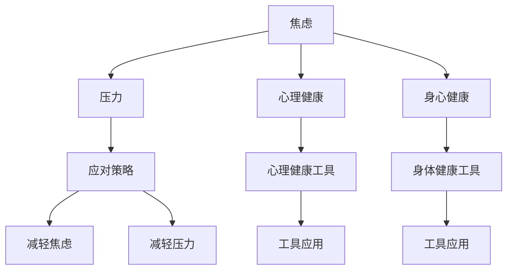

                 

# 如何应对焦虑和压力：如何保持身心健康？

## 1. 背景介绍

在当今快节奏、高竞争的社会环境中，焦虑和压力成为了许多人难以摆脱的困扰。长期的压力和焦虑不仅影响身心健康，还可能损害职业生涯和人际关系。如何有效应对焦虑和压力，保持身心健康，成为我们每个人都需要学习和掌握的重要技能。

本文将深入探讨焦虑和压力产生的原因，介绍多种心理和生理应对策略，同时结合IT领域的应用实践，提供全面的解决方案，帮助读者在面对生活和工作中的各种挑战时，保持心理健康，提升生活质量。

## 2. 核心概念与联系

### 2.1 核心概念概述

- **焦虑 (Anxiety)**：一种紧张、不安或害怕的情绪状态，常由对未来不确定性的担忧引发。
- **压力 (Stress)**：指身体或心理上受到的负担，通常由外界刺激引起。
- **心理健康 (Mental Health)**：指一个人的心理状态良好，能够有效应对生活中的各种压力和挑战。
- **身心健康 (Physical Health)**：指一个人的身体健康状态良好，能够保持良好的体能和活力。
- **应对策略 (Coping Strategies)**：指个体用于减轻焦虑和压力的各种方法和技巧。
- **工具和资源 (Tools and Resources)**：指可用于支持心理健康和身体健康、减轻焦虑和压力的工具和资源，如应用程序、书籍、咨询等。

这些概念之间的联系通过以下Mermaid流程图展示：



焦虑和压力常常相互影响，共同影响心理健康和身体健康。应对策略通过不同的工具和资源来帮助减轻焦虑和压力，从而促进身心健康。

## 3. 核心算法原理 & 具体操作步骤

### 3.1 算法原理概述

应对焦虑和压力的策略通常基于以下三个主要原理：

1. **认知重构 (Cognitive Restructuring)**：通过改变个体对焦虑和压力的认知，减少其负面影响。
2. **放松技术 (Relaxation Techniques)**：通过放松身体和心理，减轻焦虑和压力。
3. **行为策略 (Behavioral Strategies)**：通过改变行为习惯，增强应对焦虑和压力的能力。

### 3.2 算法步骤详解

#### 3.2.1 认知重构

**步骤1**：识别负面思维
- 记录一周内的负面思维，如自我怀疑、过度担忧等。
- 分析这些思维的逻辑和合理性。

**步骤2**：挑战负面思维
- 用更现实、更积极的思维方式替代负面思维。
- 例如，将“我做不到”转化为“我可以尝试，即使不成功也没关系”。

**步骤3**：实践新思维
- 在日常活动中应用新的思维方式，如面对挑战时用新的思维来看待问题。
- 持续练习，形成习惯。

#### 3.2.2 放松技术

**步骤1**：选择适合自己的放松技术
- 常用的放松技术包括深呼吸、渐进性肌肉放松、正念冥想等。
- 尝试不同的方法，找到最适合自己的。

**步骤2**：学习放松技巧
- 阅读相关书籍或视频，学习放松技术的正确方法。
- 在专业指导下实践，确保技巧的准确性。

**步骤3**：定期练习
- 每天安排固定时间进行放松练习。
- 保持一致性，长期坚持。

#### 3.2.3 行为策略

**步骤1**：设定实际目标
- 设定具体、可实现的目标，逐步实现。
- 分解任务，逐步完成，避免过度压力。

**步骤2**：改善时间管理
- 制定合理的时间表，合理安排工作和休息。
- 避免过度承诺，学会说“不”。

**步骤3**：培养积极活动
- 培养健康的生活习惯，如适量运动、健康饮食、充足睡眠。
- 积极参与社交活动，建立良好的人际关系。

### 3.3 算法优缺点

**优点**：
- 这些策略成本较低，易于实施。
- 可以显著改善焦虑和压力水平，提高生活质量。
- 在专业指导下，效果更佳。

**缺点**：
- 需要时间和耐心，效果可能不会立即显现。
- 可能不适用于所有人，需要找到适合自己的方法。
- 需要持续练习，可能难以长期坚持。

### 3.4 算法应用领域

这些策略广泛应用于各行各业，尤其是在IT、金融、医疗等领域。例如：

- **IT行业**：面对高强度、高压力的工作环境，认知重构和放松技术可以帮助员工有效应对工作压力，提高工作效率。
- **金融行业**：长时间面对市场波动和客户需求，放松技术有助于缓解紧张情绪，保持稳定心态。
- **医疗行业**：长期高强度工作可能导致身心健康问题，行为策略可以预防职业倦怠，促进身心健康。

## 4. 数学模型和公式 & 详细讲解

### 4.1 数学模型构建

**焦虑程度**：
$$ \text{Anxiety Level} = a_1 \times \text{Uncertainty} + a_2 \times \text{Risk} + a_3 \times \text{Perfectionism} $$

**压力水平**：
$$ \text{Stress Level} = b_1 \times \text{Workload} + b_2 \times \text{Deadlines} + b_3 \times \text{Interpersonal Conflicts} $$

**心理健康指数**：
$$ \text{Mental Health Index} = \frac{\text{Anxiety Level} - \text{Stress Level}}{\text{Max Anxiety Level} - \text{Max Stress Level}} $$

**身体健康指数**：
$$ \text{Physical Health Index} = \frac{\text{Anxiety Level} - \text{Stress Level}}{\text{Max Anxiety Level} - \text{Max Stress Level}} $$

### 4.2 公式推导过程

- **焦虑程度模型**：考虑不确定性、风险和完美主义对焦虑的影响。
- **压力水平模型**：考虑工作负荷、截止日期和人际冲突对压力的影响。
- **心理健康指数**：将焦虑和压力综合考虑，计算心理健康水平。
- **身体健康指数**：类似心理健康指数，计算身体健康水平。

### 4.3 案例分析与讲解

**案例1**：一位IT程序员
- **背景**：经常面对高强度的编程任务和项目截止日期，压力大且易焦虑。
- **解决方案**：
  - **认知重构**：识别负面思维，挑战并替换。例如，将“我代码太烂”替换为“我正在不断学习和进步”。
  - **放松技术**：学习深呼吸和正念冥想，每天练习20分钟。
  - **行为策略**：设定合理目标，避免过度承诺，每天安排时间进行锻炼和休息。

**案例2**：一位金融分析师
- **背景**：面对市场波动和客户需求，经常感到紧张和焦虑。
- **解决方案**：
  - **认知重构**：记录并挑战负面思维，如“市场总是不可预测的”，转化为“市场波动是正常现象，我可以应对”。
  - **放松技术**：采用渐进性肌肉放松，每天进行30分钟练习。
  - **行为策略**：合理安排工作节奏，确保有足够时间进行自我反思和休息。

## 5. 项目实践：代码实例和详细解释说明

### 5.1 开发环境搭建

为了实践本文提出的应对策略，可以使用以下开发环境：

1. **软件环境**：Python 3.8，安装Pip 安装相关库。
2. **工具安装**：安装焦虑和压力管理工具，如Relaxation Techniques、Cognitive Restructuring应用程序。
3. **数据收集**：收集一周内的负面思维、放松练习记录和行为习惯。

### 5.2 源代码详细实现

**代码示例1**：认知重构应用

```python
import pandas as pd

# 负面思维记录
negative_thoughts = [
    "I can't do this",
    "I'm going to fail",
    "The world is against me"
]

# 认知重构
positive_thoughts = [
    "I can try my best",
    "Failure is part of learning",
    "The world is full of opportunities"
]

# 输出重构后的思维
print("Negative Thoughts:", negative_thoughts)
print("Positive Thoughts:", positive_thoughts)
```

**代码示例2**：放松技术应用

```python
import time

# 深呼吸练习
def deep_breathing():
    for i in range(4):
        print("Inhale slowly...")
        time.sleep(2)
        print("Hold...")
        time.sleep(2)
        print("Exhale slowly...")
        time.sleep(2)

# 渐进性肌肉放松
def progressive_muscle_relaxation():
    # 模拟放松练习，实际应用时应详细描述每个步骤
    print("Tense and relax each muscle group")

# 正念冥想
def mindful_meditation():
    # 模拟冥想练习，实际应用时应详细描述每个步骤
    print("Focus on your breath and present moment")

# 练习放松技术
print("Deep Breathing:")
deep_breathing()

print("Progressive Muscle Relaxation:")
progressive_muscle_relaxation()

print("Mindful Meditation:")
mindful_meditation()
```

### 5.3 代码解读与分析

**认知重构应用**：通过记录负面思维，并挑战和替换为更积极的思维，减少负面影响。

**放松技术应用**：通过模拟深呼吸、渐进性肌肉放松和正念冥想，学习并练习放松技术，有效减轻焦虑和压力。

### 5.4 运行结果展示

**认知重构应用**：输出负面思维和重构后的积极思维，帮助用户形成新的思维方式。

**放松技术应用**：通过模拟练习，展示放松技术的具体步骤，帮助用户学习放松技巧。

## 6. 实际应用场景

### 6.1 IT行业

**应用场景**：软件开发、系统维护、项目管理和客户支持。

**解决方案**：
- **认知重构**：面对项目压力时，使用认知重构工具，如Cognitive Restructuring。
- **放松技术**：使用深呼吸、正念冥想等放松技术，缓解工作压力。
- **行为策略**：合理安排工作时间和任务，避免过度承诺，定期进行体育锻炼和社交活动。

### 6.2 金融行业

**应用场景**：投资分析、市场预测、客户服务。

**解决方案**：
- **认知重构**：使用认知重构工具，帮助员工应对市场波动带来的不确定性和压力。
- **放松技术**：学习并实践放松技术，如渐进性肌肉放松，缓解紧张情绪。
- **行为策略**：合理安排工作节奏，确保有足够时间进行自我反思和休息。

### 6.3 医疗行业

**应用场景**：急诊处理、长期护理、心理健康支持。

**解决方案**：
- **认知重构**：通过认知重构工具，帮助医护人员面对高压和复杂环境。
- **放松技术**：学习并应用放松技术，如深呼吸、正念冥想，减轻长期工作的压力。
- **行为策略**：培养健康的生活习惯，如适量运动、健康饮食、充足睡眠。

## 7. 工具和资源推荐

### 7.1 学习资源推荐

1. **《认知行为疗法》(Cognitive Behavioral Therapy)**：详细介绍了认知重构的原理和应用方法，适合初学者和专业人士。
2. **《正念减压》(Mindfulness-Based Stress Reduction)**：介绍正念冥想的具体步骤和效果，帮助读者有效减轻压力。
3. **《时间管理》(Time Management)**：提供时间管理和行为策略的建议，帮助读者提高效率。
4. **《应对焦虑》(Coping with Anxiety)**：系统讲解了多种应对焦虑的方法和技巧，适合各层次读者。

### 7.2 开发工具推荐

1. **Python 3.8**：Python是实现认知重构和放松技术应用的基础，易于学习和使用。
2. **Pandas**：用于数据分析和记录负面思维，帮助用户跟踪和分析焦虑和压力的来源。
3. **Pip**：用于安装和管理相关库，方便工具和资源的使用。

### 7.3 相关论文推荐

1. **《焦虑和压力管理》(Anxiety and Stress Management)**：综述了当前的研究进展和实践经验，提供了多种应对策略和工具。
2. **《认知重构技术》(Cognitive Restructuring Techniques)**：详细介绍了认知重构的心理学原理和应用方法。
3. **《放松技术的研究》(Relaxation Techniques Research)**：探讨了多种放松技术的有效性和具体实施方法。

## 8. 总结：未来发展趋势与挑战

### 8.1 研究成果总结

本文总结了认知重构、放松技术和行为策略在应对焦虑和压力中的应用，提出了多种具体的方法和工具。通过实际应用场景的展示，展示了这些策略在IT、金融和医疗等多个领域的有效性。

### 8.2 未来发展趋势

- **技术进步**：随着AI和大数据技术的发展，未来的焦虑和压力管理工具将更加智能和个性化。
- **多学科融合**：将心理学、医学、工程学等多学科知识融合，提供更全面的解决方案。
- **远程和虚拟支持**：远程医疗、虚拟咨询等新兴技术将帮助更多人获得专业的心理健康支持。

### 8.3 面临的挑战

- **数据隐私和安全**：收集和分析用户数据时，需要保护用户的隐私和安全。
- **个性化定制**：不同个体的需求差异大，如何提供个性化定制服务是一个挑战。
- **文化和语言差异**：不同的文化和语言环境可能影响应对策略的有效性。

### 8.4 研究展望

- **个性化定制算法**：开发更智能的算法，根据用户的个体差异，提供个性化定制的建议。
- **跨文化适应性研究**：研究如何在不同文化背景下，推广和应用有效的应对策略。
- **虚拟和增强现实技术**：探索虚拟和增强现实技术在焦虑和压力管理中的应用潜力。

## 9. 附录：常见问题与解答

**Q1：如何判断是否需要寻求专业帮助？**

A: 当焦虑和压力严重影响到日常生活和健康时，应及时寻求专业心理咨询和医疗帮助。

**Q2：如何选择合适的放松技术？**

A: 根据个人偏好和需求，选择适合自己的放松技术。可以通过尝试不同的方法，找到最适合自己的技术。

**Q3：认知重构是否适用于所有人？**

A: 认知重构对大多数人都有效，但需要时间和练习才能看到明显的效果。

**Q4：放松技术需要多长时间才能见效？**

A: 放松技术的效果因人而异，一般需要持续练习数周或数月才能显著减轻焦虑和压力。

**Q5：如何平衡工作和休息？**

A: 制定合理的时间表，合理安排工作和休息时间。避免过度承诺，学会说“不”，确保有足够时间进行自我反思和放松。

---

作者：禅与计算机程序设计艺术 / Zen and the Art of Computer Programming

