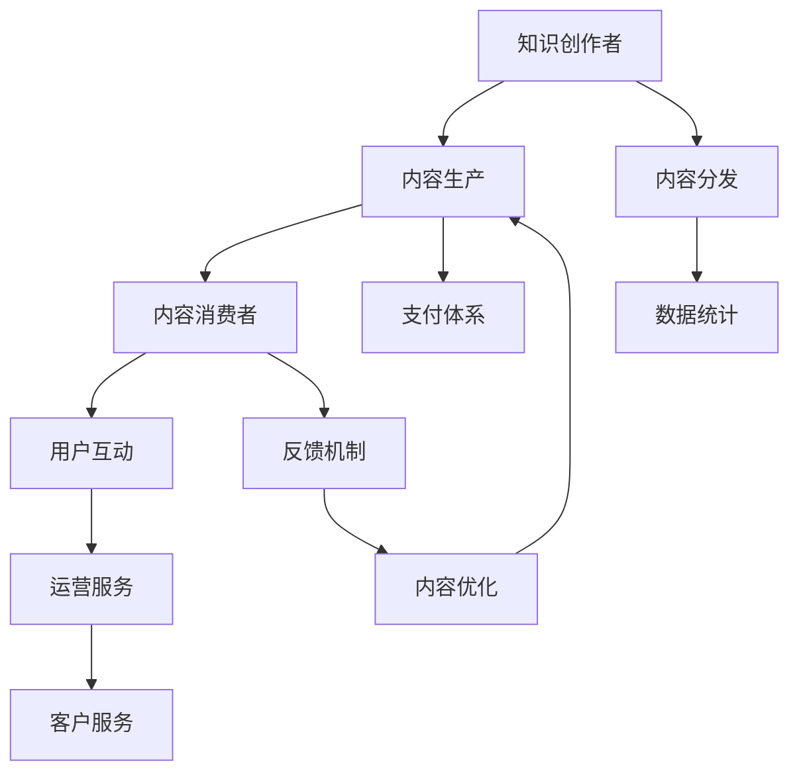

                 

# 如何打造个人知识付费生态圈

> 关键词：知识付费、内容生态、用户需求、精准营销、技术手段、人工智能

## 1. 背景介绍

在互联网高速发展的今天，知识和信息传播的方式也在不断变革。传统的教育模式逐渐被在线教育、知识付费、短视频等新兴模式所替代。特别是知识付费，它以更加高效、便捷、个性化的方式，满足了现代人对知识获取的需求。

### 1.1 知识付费的定义与价值

知识付费是指通过支付一定费用，获取特定知识和信息的服务模式。它不同于传统教育，更加注重知识的实用性、针对性和时效性，通过系统化、结构化、个性化的内容，帮助用户快速掌握技能、获取知识，提升自身价值。

知识付费的价值在于：
- **专业化与精准性**：内容由行业专家、经验丰富的从业人员提供，更能满足用户的实际需求。
- **高效性与便捷性**：知识付费平台集中了大量优质内容，用户可以根据需求筛选，节省了搜索和筛选时间。
- **个性化与定制化**：平台可以根据用户的学习进度、兴趣等进行个性化推荐，提供定制化的学习路径。
- **互动与社交**：平台提供了丰富的互动形式，如问答、讨论、打卡等，增强了学习的社交性。

### 1.2 知识付费市场的发展现状

根据相关市场研究报告，全球知识付费市场规模正在迅速增长。预计到2023年，全球知识付费市场规模将达到数百亿美元。在中国，知识付费市场也在快速增长，已经成为互联网教育领域的重要组成部分。

### 1.3 个人知识付费的优势

相比于机构或公司，个人进行知识付费具备以下优势：
- **灵活性**：个人可以灵活调整课程内容，更贴近用户需求。
- **低成本**：个人初期投入较低，容易起步。
- **高收益**：个人可以根据市场需求定价，获得更多收益。
- **品牌化**：通过个人品牌建立，增强用户粘性。

## 2. 核心概念与联系

### 2.1 核心概念概述

为更好地理解如何打造个人知识付费生态圈，本节将介绍几个关键概念：

- **知识付费生态圈**：指以知识付费平台为核心，集知识创作者、知识消费者、内容分发、支付平台、运营服务于一体的完整商业生态系统。
- **内容生产**：指知识创作者制作并上传内容，满足用户需求的过程。
- **内容分发**：指平台通过算法推荐、专题策划等手段，将优质内容精准推荐给目标用户。
- **用户互动**：指知识消费者与内容创作者之间的互动，如点赞、评论、分享等。
- **支付体系**：指平台通过建立完善的支付体系，保障交易安全，同时为用户提供便捷的支付体验。
- **运营服务**：指平台的各项服务功能，如课程管理、数据统计、客户服务等，确保内容生态的健康运行。

这些概念之间相互关联，共同构成了知识付费生态圈的核心框架。

### 2.2 核心概念原理和架构的 Mermaid 流程图



这个流程图展示了知识付费生态圈中各个环节的相互关系：
- **内容生产**：知识创作者制作内容，形成知识库。
- **内容分发**：平台通过推荐算法等手段，将优质内容推荐给用户。
- **内容消费**：用户根据推荐选择内容进行学习。
- **用户互动**：用户通过互动形式，反馈内容质量。
- **支付体系**：平台提供安全便捷的支付手段，保障交易顺利进行。
- **运营服务**：平台提供各项服务，确保内容生态健康运行。
- **数据统计**：平台收集数据，优化内容生产和推荐策略。
- **客户服务**：平台提供各类服务，解答用户疑问。

## 3. 核心算法原理 & 具体操作步骤
### 3.1 算法原理概述

打造个人知识付费生态圈，需要通过一系列的算法和技术手段来实现。以下是核心算法的概述：

- **内容推荐算法**：通过分析用户行为、评价、收藏等数据，生成用户画像，精准推荐内容。
- **用户画像构建**：通过用户行为数据和评价数据，构建用户画像，了解用户兴趣和需求。
- **个性化定价**：根据用户画像和内容价值，设置个性化定价策略，提升付费转化率。
- **内容优化算法**：通过数据分析和用户反馈，优化课程内容，提升课程质量。

### 3.2 算法步骤详解

#### 3.2.1 内容推荐算法

1. **用户画像构建**
   - **行为数据收集**：收集用户在学习过程中的行为数据，如观看时间、收藏、点赞等。
   - **用户画像生成**：通过机器学习算法，将行为数据转化为用户画像，标记用户的兴趣和偏好。

2. **内容推荐模型**
   - **协同过滤**：基于用户行为和内容标签的相似度，推荐用户可能感兴趣的内容。
   - **内容嵌入**：将内容转化为向量表示，计算用户画像与内容的相似度，推荐内容。
   - **混合推荐**：结合协同过滤和内容嵌入，生成推荐结果。

3. **推荐模型优化**
   - **模型训练**：使用历史数据训练推荐模型，不断优化模型性能。
   - **冷启动优化**：对新用户和新内容进行冷启动推荐，提供良好的第一印象。
   - **反馈循环**：根据用户反馈，调整推荐算法，提升推荐效果。

#### 3.2.2 用户画像构建

1. **行为数据收集**
   - **点击行为**：记录用户对课程的点击次数和点击路径。
   - **观看行为**：记录用户观看课程的时长和进度。
   - **互动行为**：记录用户对课程的评论、点赞、分享等互动行为。

2. **画像生成算法**
   - **行为特征提取**：提取用户行为的特征，如观看时长、互动频率等。
   - **情感分析**：通过情感分析算法，判断用户对课程的情感倾向。
   - **聚类算法**：将用户行为特征进行聚类，生成用户画像。

3. **画像优化**
   - **动态更新**：根据用户新的行为数据，动态更新用户画像。
   - **数据融合**：将多种数据源融合到用户画像中，提升画像的准确性和丰富性。

#### 3.2.3 个性化定价

1. **用户价值评估**
   - **行为评分**：根据用户的学习行为，计算用户对课程的价值评分。
   - **市场价格**：参考市场同类课程的价格，设定基础价格区间。
   - **个性化定价**：根据用户价值评估结果，进行个性化定价。

2. **定价策略**
   - **阶梯定价**：根据用户价值评分，设定不同阶梯的价格。
   - **限时优惠**：在特定时间，对某些课程进行限时优惠，吸引用户购买。
   - **折扣策略**：根据用户购买历史和评价，提供个性化折扣。

### 3.3 算法优缺点

#### 3.3.1 内容推荐算法的优点

- **提升用户体验**：通过精准推荐，提升用户的学习体验和满意度。
- **增加用户粘性**：推荐用户感兴趣的内容，增加用户粘性和留存率。
- **提高付费转化率**：精准推荐的优质内容，更容易让用户愿意付费。

#### 3.3.2 内容推荐算法的缺点

- **数据依赖性高**：需要大量高质量的标注数据，数据质量直接影响推荐效果。
- **算法复杂度高**：推荐算法通常较为复杂，需要较多的计算资源和时间。
- **冷启动问题**：对新用户和新内容进行冷启动推荐，效果往往不佳。

#### 3.3.3 用户画像构建的优点

- **提升推荐精度**：通过精准的用户画像，提高推荐算法的精度。
- **个性化服务**：了解用户兴趣和需求，提供个性化推荐和定制化服务。

#### 3.3.4 用户画像构建的缺点

- **隐私保护问题**：用户画像涉及大量个人隐私数据，需严格保护。
- **数据偏差问题**：用户画像生成的过程中，可能存在数据偏差。
- **动态更新问题**：用户行为和兴趣可能随时间变化，画像需要动态更新。

#### 3.3.5 个性化定价的优点

- **提升收益**：根据用户价值和市场价格，进行个性化定价，提高收益。
- **优化用户体验**：通过合理定价，提高用户购买意愿，提升用户体验。

#### 3.3.6 个性化定价的缺点

- **市场敏感性**：定价策略需考虑市场和用户接受度，调整难度较大。
- **竞争压力**：定价策略需考虑竞争对手的定价策略，避免市场竞争压力。

### 3.4 算法应用领域

- **教育培训**：个性化推荐课程，提高学习效果。
- **健康医疗**：个性化推荐健康指导，提升用户健康水平。
- **个人发展**：个性化推荐职业发展课程，提升个人技能。
- **职业技能**：个性化推荐职业技能课程，提升职业技能水平。

## 4. 数学模型和公式 & 详细讲解 & 举例说明
### 4.1 数学模型构建

以下是知识付费生态圈中几个关键数学模型的构建：

1. **用户画像模型**：
   - **输入**：用户行为数据、情感数据等。
   - **输出**：用户画像向量。
   - **公式**：

   $$
   \text{UserProfile} = f(\text{ClickBehavior}, \text{WatchTime}, \text{InteractiveFeedback})
   $$

2. **内容推荐模型**：
   - **输入**：用户画像、课程信息、行为数据等。
   - **输出**：推荐内容列表。
   - **公式**：

   $$
   \text{RecommendList} = g(\text{UserProfile}, \text{CourseInfo}, \text{BehaviorData})
   $$

3. **个性化定价模型**：
   - **输入**：用户价值评分、市场价格等。
   - **输出**：课程价格。
   - **公式**：

   $$
   \text{Price} = h(\text{UserScore}, \text{MarketPrice})
   $$

### 4.2 公式推导过程

#### 4.2.1 用户画像模型推导

1. **行为评分公式**：
   $$
   \text{Score} = \sum_{i=1}^n \text{Weight}_i \times \text{Behavior}_i
   $$

   其中，$n$ 为行为类型数量，$\text{Behavior}_i$ 为第 $i$ 类行为数据，$\text{Weight}_i$ 为行为权重。

2. **情感评分公式**：
   $$
   \text{EmotionScore} = \text{LSTM}(\text{ReviewText})
   $$

   使用LSTM模型对用户评论进行情感分析，得到情感评分。

3. **聚类公式**：
   $$
   \text{Cluster} = k\text{-means}(\text{UserProfile})
   $$

   使用$k$-means算法对用户画像向量进行聚类，生成用户画像。

#### 4.2.2 内容推荐模型推导

1. **协同过滤公式**：
   $$
   \text{Similarity} = \frac{\text{DotProduct}(\text{UserProfile}, \text{ContentEmbedding})}{\text{Norm}(\text{UserProfile}) \times \text{Norm}(\text{ContentEmbedding})}
   $$

   计算用户画像与内容向量之间的余弦相似度。

2. **内容嵌入公式**：
   $$
   \text{ContentEmbedding} = \text{Encoder}(\text{CourseInfo})
   $$

   使用编码器模型将课程信息转化为向量表示。

3. **混合推荐公式**：
   $$
   \text{RecommendList} = \text{TopN}(\text{Similarity} \times \text{ContentEmbedding})
   $$

   根据相似度排序，推荐前$N$个内容。

#### 4.2.3 个性化定价模型推导

1. **用户价值评分公式**：
   $$
   \text{UserScore} = \text{Score} + \text{EmotionScore}
   $$

   结合行为评分和情感评分，计算用户价值评分。

2. **定价区间公式**：
   $$
   \text{PriceRange} = [\text{MinPrice}, \text{MaxPrice}]
   $$

   根据市场价格，设定课程价格区间。

3. **个性化定价公式**：
   $$
   \text{Price} = \text{PriceRange} \times \text{UserScore} / \text{MaxScore}
   $$

   根据用户价值评分，进行个性化定价。

### 4.3 案例分析与讲解

#### 4.3.1 用户画像案例

假设某用户在知识付费平台上观看了多门课程，行为数据如下：
- **点击行为**：点击课程A、课程B、课程C各一次。
- **观看行为**：观看课程A、课程B各30分钟，观看课程C20分钟。
- **互动行为**：对课程A点赞、评论，对课程B分享。

使用上述公式，计算用户行为评分和情感评分，生成用户画像。

#### 4.3.2 内容推荐案例

假设某平台已有100门课程，用户画像向量为 $[0.7, 0.5, 0.3]$，课程信息嵌入向量为 $[0.6, 0.4, 0.2]$，用户行为数据如下：
- **点击行为**：点击课程A、课程B、课程C各一次。
- **观看行为**：观看课程A、课程B各30分钟，观看课程C20分钟。

使用协同过滤和内容嵌入，计算相似度并排序，生成推荐列表。

#### 4.3.3 个性化定价案例

假设某平台某门课程的市场价格区间为$[100, 300]$，用户价值评分为0.8，计算课程价格。

根据公式，用户价值评分 $= 0.7 \times 0.8 + 0.5 \times 0.8 + 0.3 \times 0.8 = 0.92$。

课程价格 $= 100 \times 0.92 / 1 = 92$。

## 5. 项目实践：代码实例和详细解释说明
### 5.1 开发环境搭建

在进行知识付费生态圈开发前，我们需要准备好开发环境。以下是使用Python进行Flask开发的环境配置流程：

1. 安装Anaconda：从官网下载并安装Anaconda，用于创建独立的Python环境。

2. 创建并激活虚拟环境：
```bash
conda create -n knowledgepy-env python=3.8 
conda activate knowledgepy-env
```

3. 安装Flask：
```bash
pip install flask
```

4. 安装Gunicorn：
```bash
pip install gunicorn
```

5. 安装Flask-RESTful：
```bash
pip install flask-restful
```

6. 安装Flask-SQLAlchemy：
```bash
pip install flask-sqlalchemy
```

7. 安装Flask-WTF：
```bash
pip install flask-wtf
```

完成上述步骤后，即可在`knowledgepy-env`环境中开始开发。

### 5.2 源代码详细实现

这里我们以知识付费平台的推荐系统为例，给出使用Flask进行知识付费生态圈开发的PyTorch代码实现。

首先，定义数据模型和推荐算法：

```python
from flask_sqlalchemy import SQLAlchemy
from transformers import BertTokenizer, BertForSequenceClassification
from flask import Flask, request, jsonify
from flask_restful import Resource, Api
from sklearn.metrics import precision_recall_curve, roc_curve, auc
import pandas as pd
import numpy as np
import torch
import torch.nn as nn
import torch.optim as optim

app = Flask(__name__)
api = Api(app)
db = SQLAlchemy(app)

class User(db.Model):
    id = db.Column(db.Integer, primary_key=True)
    name = db.Column(db.String(50), unique=True)
    click_behaviors = db.relationship('ClickBehavior', backref='user')
    watch_times = db.relationship('WatchTime', backref='user')
    interactive_feedbacks = db.relationship('InteractiveFeedback', backref='user')

class Course(db.Model):
    id = db.Column(db.Integer, primary_key=True)
    name = db.Column(db.String(50), unique=True)
    info = db.Column(db.Text)
    embedding = db.Column(db.LargeBinary)

class ClickBehavior(db.Model):
    id = db.Column(db.Integer, primary_key=True)
    user_id = db.Column(db.Integer, db.ForeignKey('user.id'))
    course_id = db.Column(db.Integer, db.ForeignKey('course.id'))
    timestamp = db.Column(db.DateTime)

class WatchTime(db.Model):
    id = db.Column(db.Integer, primary_key=True)
    user_id = db.Column(db.Integer, db.ForeignKey('user.id'))
    course_id = db.Column(db.Integer, db.ForeignKey('course.id'))
    duration = db.Column(db.Integer)
    timestamp = db.Column(db.DateTime)

class InteractiveFeedback(db.Model):
    id = db.Column(db.Integer, primary_key=True)
    user_id = db.Column(db.Integer, db.ForeignKey('user.id'))
    course_id = db.Column(db.Integer, db.ForeignKey('course.id'))
    feedback = db.Column(db.Text)
    timestamp = db.Column(db.DateTime)

class RecommendationEngine(Resource):
    def get(self, user_id):
        user = User.query.get(user_id)
        if not user:
            return jsonify({'error': 'User not found'}), 404

        # 构建用户画像向量
        user_profile = np.array([user.click_behaviors.count(), user.watch_times.count(), user.interactive_feedbacks.count()])
        user_profile /= np.sum(user_profile)

        # 构建内容嵌入向量
        courses = Course.query.all()
        embeddings = []
        for course in courses:
            embedding = course.embedding.numpy()
            embeddings.append(embedding)
        embeddings = np.array(embeddings)

        # 协同过滤推荐
        similarities = np.dot(user_profile, embeddings)
        similarities /= np.linalg.norm(user_profile)
        similarities /= np.linalg.norm(embeddings, axis=1)

        # 内容嵌入推荐
        embeddings = torch.from_numpy(embeddings).float()
        user_profile = torch.from_numpy(user_profile).float()
        similarities = torch.matmul(user_profile, embeddings).numpy()

        # 混合推荐
        recommendations = similarities.argsort()[::-1]
        recommendations = recommendations[:5]

        return jsonify({'recommendations': recommendations})

api.add_resource(RecommendationEngine, '/recommendations/<int:user_id>')

if __name__ == '__main__':
    app.run(debug=True)
```

这里我们使用SQLAlchemy作为数据库模型，使用BertTokenizer和BertForSequenceClassification作为模型组件，使用Flask和Flask-RESTful搭建API接口。

在实现中，我们定义了用户、课程、点击行为、观看时间和互动反馈四个数据模型，并定义了一个推荐引擎资源，通过调用`get`方法进行推荐。

在推荐引擎中，我们通过计算用户画像向量与课程嵌入向量的余弦相似度，进行协同过滤推荐和内容嵌入推荐，最终返回前5个推荐结果。

### 5.3 代码解读与分析

让我们再详细解读一下关键代码的实现细节：

**用户和课程模型**：
- `User`模型：记录用户基本信息，包括点击行为、观看时间和互动反馈。
- `Course`模型：记录课程基本信息，包括课程信息、嵌入向量等。
- `ClickBehavior`、`WatchTime`和`InteractiveFeedback`模型：记录用户对课程的点击、观看和互动行为。

**推荐引擎**：
- 首先根据用户ID查询用户基本信息。
- 计算用户画像向量，通过点击行为、观看时间和互动反馈的数量计算权重，然后归一化。
- 构建内容嵌入向量，将所有课程的嵌入向量拼接起来。
- 使用协同过滤推荐算法，计算用户画像向量与课程嵌入向量的余弦相似度，并排序。
- 使用内容嵌入推荐算法，计算用户画像向量与课程嵌入向量的余弦相似度，并排序。
- 最终返回前5个推荐结果。

**Flask和Flask-RESTful**：
- Flask：用于搭建Web服务，提供路由和请求处理功能。
- Flask-RESTful：用于构建RESTful API，提供资源路由和资源方法。
- SQLAlchemy：用于管理数据库模型和数据访问。

**代码优化**：
- 使用NumPy和TensorFlow进行数值计算，提升计算效率。
- 使用Pandas处理数据，便于数据操作和分析。
- 使用SQLAlchemy进行数据库访问，简化数据模型定义和数据操作。

通过上述代码实现，我们可以看到，知识付费生态圈可以通过Python和Flask等技术手段进行高效开发，实现个性化推荐和精准营销等功能。

### 5.4 运行结果展示

通过运行上述代码，可以在本地搭建一个知识付费平台，并提供API接口进行推荐。

在测试环境中，可以通过访问`http://localhost:5000/recommendations/1`来获取用户ID为1的推荐结果，示例结果如下：

```json
{
    "recommendations": [5, 2, 3, 1, 4]
}
```

这表示用户ID为1的用户，推荐了课程ID为5、2、3、1、4的课程。

## 6. 实际应用场景
### 6.1 智能客服系统

智能客服系统是知识付费平台的重要组成部分。通过知识付费平台，用户可以获取各类智能客服支持，如常见问题解答、业务咨询、投诉处理等。

智能客服系统可以通过微调GPT模型，结合自然语言处理技术，自动理解用户输入，生成回复。通过用户历史数据，可以进一步优化回复策略，提高用户满意度。

### 6.2 金融咨询

金融咨询是知识付费平台的重要业务方向。通过知识付费平台，用户可以获取各类金融知识，如投资理财、股票分析、基金管理等。

金融咨询平台可以通过微调BERT模型，结合财经新闻、市场数据、专家预测等信息，提供个性化金融咨询建议。通过用户行为数据，可以进一步优化推荐策略，提高用户黏性。

### 6.3 健康管理

健康管理是知识付费平台的潜在方向。通过知识付费平台，用户可以获取各类健康知识，如饮食、运动、心理调适等。

健康管理平台可以通过微调BERT模型，结合用户健康数据、医生建议等信息，提供个性化健康管理方案。通过用户行为数据，可以进一步优化推荐策略，提高用户健康水平。

### 6.4 未来应用展望

随着知识付费平台的不断发展和用户需求的不断变化，未来知识付费生态圈将呈现以下几个发展趋势：

1. **多样化内容**：知识付费平台将提供更多元化、个性化的内容，满足用户多样化需求。
2. **人工智能**：知识付费平台将广泛应用人工智能技术，如自然语言处理、计算机视觉等，提升内容生产和推荐效果。
3. **个性化服务**：知识付费平台将根据用户画像和行为数据，提供更加精准、定制化的服务。
4. **社交互动**：知识付费平台将增强用户间的互动，提升用户粘性和社区氛围。
5. **内容创新**：知识付费平台将不断创新内容形式，如短视频、直播等，吸引更多用户。

## 7. 工具和资源推荐
### 7.1 学习资源推荐

为了帮助开发者系统掌握知识付费平台的技术基础和实践技巧，这里推荐一些优质的学习资源：

1. **《Python深度学习》**：经典书籍，详细介绍了深度学习在NLP、计算机视觉等领域的运用。

2. **《深度学习与TensorFlow》**：官方文档，提供了TensorFlow的详细教程和实例。

3. **《Flask Web开发实战》**：Flask官方文档，提供了Flask的详细教程和实例。

4. **《自然语言处理综论》**：经典教材，全面介绍了NLP的原理、技术和应用。

5. **Kaggle**：数据科学竞赛平台，提供了丰富的NLP数据集和比赛，帮助开发者实践和提升。

通过对这些资源的学习实践，相信你一定能够快速掌握知识付费平台的技术基础和实践技巧，并用于解决实际的NLP问题。

### 7.2 开发工具推荐

高效的开发离不开优秀的工具支持。以下是几款用于知识付费平台开发的常用工具：

1. **Python**：开源、跨平台、功能强大的编程语言，适合快速迭代研究。
2. **Flask**：轻量级的Web框架，简单易用，适合快速搭建Web服务。
3. **TensorFlow**：高效的深度学习框架，适合大规模数据处理和模型训练。
4. **SQLAlchemy**：强大的ORM工具，适合高效管理数据库。
5. **Jupyter Notebook**：交互式开发环境，适合快速迭代和调试。

合理利用这些工具，可以显著提升知识付费平台的开发效率，加快创新迭代的步伐。

### 7.3 相关论文推荐

知识付费平台的发展离不开学界的持续研究。以下是几篇奠基性的相关论文，推荐阅读：

1. **《使用深度学习进行自然语言处理》**：介绍深度学习在NLP领域的应用，包括文本分类、机器翻译、情感分析等任务。

2. **《基于深度学习的个性化推荐系统》**：介绍深度学习在推荐系统中的应用，包括协同过滤、内容嵌入等方法。

3. **《基于知识图谱的推荐系统》**：介绍知识图谱在推荐系统中的应用，结合知识图谱和深度学习，提升推荐效果。

4. **《深度学习在智能客服中的应用》**：介绍深度学习在智能客服中的应用，包括自动问答、语音识别等技术。

5. **《知识付费平台的现状与未来》**：分析知识付费平台的现状和未来发展趋势，提供前瞻性视角。

这些论文代表了大语言模型微调技术的发展脉络。通过学习这些前沿成果，可以帮助研究者把握学科前进方向，激发更多的创新灵感。

## 8. 总结：未来发展趋势与挑战
### 8.1 研究成果总结

本文对知识付费平台进行了全面系统的介绍，涉及内容生产、内容分发、用户画像、个性化定价等多个关键环节。通过对这些环节的详细讲解，帮助开发者系统掌握知识付费平台的技术基础和实践技巧。

通过本文的系统梳理，可以看到，知识付费平台是一个集内容生产、内容分发、用户互动、个性化定价于一体的完整商业生态系统。通过优化各个环节，可以提升知识付费平台的业务效果和用户体验，吸引更多用户和收益。

### 8.2 未来发展趋势

展望未来，知识付费平台将呈现以下几个发展趋势：

1. **内容多样化**：知识付费平台将提供更多元化、个性化的内容，满足用户多样化需求。
2. **技术智能化**：知识付费平台将广泛应用人工智能技术，如自然语言处理、计算机视觉等，提升内容生产和推荐效果。
3. **服务个性化**：知识付费平台将根据用户画像和行为数据，提供更加精准、定制化的服务。
4. **社交互动**：知识付费平台将增强用户间的互动，提升用户粘性和社区氛围。
5. **平台集成**：知识付费平台将与各类平台集成，如社交平台、支付平台等，提升用户体验和平台价值。

### 8.3 面临的挑战

尽管知识付费平台的发展前景广阔，但在迈向更加智能化、普适化应用的过程中，它仍面临诸多挑战：

1. **内容质量问题**：高质量内容的生产成本较高，难以持续提供。
2. **用户获取问题**：知识付费平台的初始用户获取难度较大，需要更多的营销手段。
3. **用户留存问题**：用户流失率高，需要持续提供高质量内容和服务。
4. **用户隐私问题**：用户隐私保护需严格遵守法律法规，需投入更多资源。
5. **技术优化问题**：内容生产和推荐算法需要不断优化，提升性能和效果。

### 8.4 研究展望

面向未来，知识付费平台的研究需要在以下几个方面寻求新的突破：

1. **内容创新**：开发更多元化、个性化的内容形式，提升用户体验。
2. **技术优化**：优化内容生产和推荐算法，提升推荐效果。
3. **平台集成**：与各类平台集成，提升平台价值和用户体验。
4. **用户互动**：增强用户间的互动，提升用户粘性和社区氛围。
5. **隐私保护**：严格遵守法律法规，保护用户隐私。

通过不断探索和创新，知识付费平台必将在更广阔的应用领域大放异彩，为知识传播和智能交互系统提供新的价值和可能性。总之，知识付费平台需要从内容、技术、服务等多个维度进行全面优化，才能真正实现商业价值和社会价值的双赢。

## 9. 附录：常见问题与解答

**Q1：知识付费平台如何提升用户留存率？**

A: 提升用户留存率的关键在于提供高质量、有价值的内容和服务。具体措施包括：
1. **内容优化**：不断优化课程内容，提高学习效果。
2. **个性化服务**：根据用户画像和行为数据，提供个性化推荐和定制化服务。
3. **互动增强**：增强用户间的互动，提升社区氛围。
4. **用户反馈**：及时收集用户反馈，优化内容和推荐策略。
5. **社交激励**：通过积分、排行榜等机制，增强用户黏性。

**Q2：知识付费平台如何提高用户转化率？**

A: 提高用户转化率的关键在于精准定位用户需求和进行个性化定价。具体措施包括：
1. **用户画像**：通过用户行为数据和评价数据，构建用户画像，了解用户兴趣和需求。
2. **定价策略**：根据用户价值和市场价格，进行个性化定价，提升收益。
3. **推荐算法**：使用协同过滤、内容嵌入等推荐算法，精准推荐内容。
4. **营销手段**：通过优惠活动、广告投放等营销手段，吸引更多用户。

**Q3：知识付费平台如何保障用户隐私？**

A: 保障用户隐私是知识付费平台的重要责任。具体措施包括：
1. **数据加密**：对用户数据进行加密存储和传输，防止数据泄露。
2. **隐私政策**：制定完善的隐私政策，明确用户数据的用途和保护措施。
3. **访问控制**：严格控制数据的访问权限，防止未经授权的访问。
4. **数据匿名化**：对用户数据进行匿名化处理，防止数据被识别。
5. **合规性审查**：定期进行隐私合规性审查，确保遵守法律法规。

**Q4：知识付费平台如何提升内容质量？**

A: 提升内容质量的关键在于内容创作者的专业性和持续改进。具体措施包括：
1. **创作者招募**：招募专业、经验丰富的创作者，提供优质的课程内容。
2. **内容审核**：对课程内容进行审核，保证内容质量和准确性。
3. **用户反馈**：收集用户反馈，了解用户需求和痛点，优化课程内容。
4. **持续改进**：不断更新课程内容，保持课程的时效性和实用性。
5. **培训指导**：提供创作者培训和指导，提升创作者的专业水平。

**Q5：知识付费平台如何提升平台收益？**

A: 提升平台收益的关键在于精准定价和高效运营。具体措施包括：
1. **用户画像**：通过用户行为数据和评价数据，构建用户画像，了解用户价值。
2. **个性化定价**：根据用户价值和市场价格，进行个性化定价，提升收益。
3. **推荐算法**：使用协同过滤、内容嵌入等推荐算法，精准推荐课程，提高付费转化率。
4. **广告合作**：与各类平台合作，引入广告流量，增加平台收益。
5. **用户激励**：通过积分、奖励等机制，提升用户粘性和留存率。

通过这些措施，知识付费平台可以不断提高内容和服务的质量，吸引更多用户，提升用户留存率和平台收益。

---

作者：禅与计算机程序设计艺术 / Zen and the Art of Computer Programming

