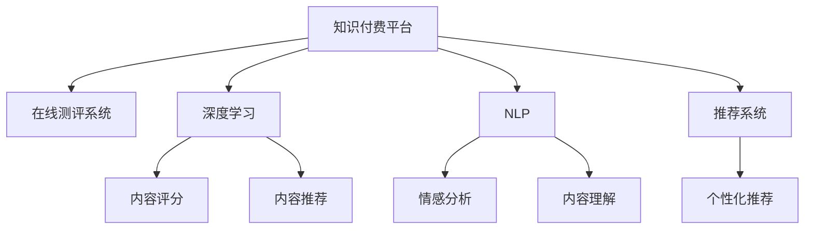

                 

# 如何打造知识付费的在线测评系统

## 1. 背景介绍

### 1.1 问题由来
知识付费平台近年来飞速发展，因其将海量的专业知识和信息转化成易于消费和利用的形式，受到广泛欢迎。在知识付费平台中，在线测评系统作为重要组成部分，不仅承担着为内容消费者提供价值评估和反馈的功能，还能够助力平台提升内容质量和用户满意度。因此，如何构建高效、智能、公平的在线测评系统，成为平台发展的重要议题。

### 1.2 问题核心关键点
构建在线测评系统涉及用户行为分析、内容评分机制、推荐算法、数据存储等多个关键点。本文聚焦于利用人工智能技术，从算法和模型构建角度，讨论如何打造一个高效、智能、公平的知识付费在线测评系统，从而提升用户体验，增强平台竞争力。

### 1.3 问题研究意义
在线测评系统的优劣直接决定了平台内容质量的高低，影响用户体验和满意度。通过采用先进的人工智能技术，如深度学习、自然语言处理、推荐系统等，可以提升测评的准确性和个性化水平，增强用户对平台的黏性。构建一个高效、智能、公平的在线测评系统，能够帮助平台在知识付费市场中脱颖而出，实现持续增长。

## 2. 核心概念与联系

### 2.1 核心概念概述

在构建知识付费在线测评系统的过程中，需明确以下核心概念：

- **知识付费平台**：提供高质量的付费内容，满足用户知识获取和技能提升的需求。
- **在线测评系统**：根据用户对内容的互动反馈，如观看时长、点赞数、评论内容等，自动进行内容评分和推荐。
- **深度学习**：一种模拟人脑神经网络的机器学习技术，通过多层次的神经网络结构进行数据分析和处理。
- **自然语言处理(NLP)**：让计算机理解、处理和生成人类语言的技术，在内容评分、情感分析、用户行为分析等方面应用广泛。
- **推荐系统**：通过学习用户行为和兴趣，为用户推荐个性化内容，提升用户体验和满意度。

这些核心概念之间存在紧密的联系：深度学习为内容评分和推荐提供了技术支持，自然语言处理可以辅助内容理解和情感分析，推荐系统则根据用户行为和评分结果进行内容推荐，最终提升平台的知识付费体验。

### 2.2 核心概念原理和架构的 Mermaid 流程图



这个流程图展示了知识付费在线测评系统的核心组成及其相互关系：

1. 知识付费平台作为整体，依赖于在线测评系统进行内容质量评估和个性化推荐。
2. 在线测评系统依赖于深度学习、NLP和推荐系统三个关键技术模块。
3. 深度学习模块用于内容评分和推荐，提升评分的准确性和推荐的个性化程度。
4. NLP模块用于内容理解和情感分析，增强评分的精准度和推荐的可信度。
5. 推荐系统模块则将深度学习、NLP的输出应用于个性化推荐，提升用户满意度。

## 3. 核心算法原理 & 具体操作步骤
### 3.1 算法原理概述

知识付费在线测评系统通常采用监督学习的方法，通过构建评分模型和推荐模型，将用户行为数据转化为内容评分和个性化推荐。其核心算法包括深度学习、NLP和推荐系统。

### 3.2 算法步骤详解

以下是构建知识付费在线测评系统的具体步骤：

1. **数据收集与预处理**：收集用户行为数据，如观看时长、点赞数、评论内容等，并进行清洗和标准化处理。
2. **评分模型训练**：构建评分模型，通过深度学习算法学习用户行为与内容评分之间的关系。
3. **内容理解与情感分析**：利用NLP技术进行内容理解，提取关键特征，并结合情感分析结果，优化评分模型。
4. **推荐模型训练**：构建推荐模型，根据评分模型和用户行为数据，学习推荐策略。
5. **模型部署与评估**：将训练好的模型部署到知识付费平台，实时进行内容评分和推荐。通过A/B测试等手段，评估模型性能。

### 3.3 算法优缺点

知识付费在线测评系统的算法具有以下优点：

- **高效性**：通过深度学习、NLP和推荐系统，能够快速生成内容评分和推荐结果，提升用户体验。
- **个性化推荐**：结合用户行为和评分结果，生成个性化推荐内容，增强用户黏性。
- **自动化评分**：利用机器学习算法，自动进行内容评分，减少人工干预，提高评分的客观性和公正性。

同时，该算法也存在以下缺点：

- **数据依赖性强**：模型的性能依赖于高质量的数据，数据收集和清洗成本较高。
- **模型复杂度高**：深度学习、NLP和推荐系统算法复杂，需要较强的计算资源和技术支持。
- **可解释性不足**：模型“黑箱”特性明显，难以解释评分和推荐的内在逻辑，影响用户信任。
- **过拟合风险**：在数据量有限的情况下，模型可能出现过拟合，影响泛化性能。

### 3.4 算法应用领域

在线测评系统不仅适用于知识付费平台，在音乐、视频、图书等多个领域都有广泛应用。通过深度学习、NLP和推荐系统的有机结合，可以提升这些平台的内容质量和用户体验，增强用户忠诚度。

## 4. 数学模型和公式 & 详细讲解 & 举例说明

### 4.1 数学模型构建

构建知识付费在线测评系统的数学模型主要包括以下部分：

- **评分模型**：$R_{pred} = f(X, \theta)$，其中 $X$ 为输入特征（如观看时长、点赞数、评论情感等），$\theta$ 为模型参数。
- **内容理解模型**：$U_{content} = g(X, \theta)$，其中 $X$ 为内容特征（如文本、图片、视频等），$\theta$ 为模型参数。
- **情感分析模型**：$S_{emotion} = h(X, \theta)$，其中 $X$ 为评论内容，$\theta$ 为模型参数。
- **推荐模型**：$R_{rec} = m(X, \theta)$，其中 $X$ 为用户行为数据，$\theta$ 为模型参数。

### 4.2 公式推导过程

以下是对各个模型的具体推导过程：

- **评分模型推导**：假设评分模型为线性回归模型，评分函数为 $R_{pred} = \alpha_1X_1 + \alpha_2X_2 + ... + \alpha_nX_n + b$，其中 $\alpha_i$ 为模型系数，$X_i$ 为第 $i$ 个输入特征，$b$ 为偏置项。通过最小化损失函数 $\mathcal{L}(R_{pred}, R_{real}) = \frac{1}{N}\sum_{i=1}^N (R_{pred}^i - R_{real}^i)^2$，得到模型参数 $\theta = (\alpha_1, \alpha_2, ..., \alpha_n, b)$。
- **内容理解模型推导**：假设内容理解模型为卷积神经网络（CNN），内容表示函数为 $U_{content} = \sum_{k=1}^K \omega_k \phi_k(X)$，其中 $\omega_k$ 为卷积核权重，$\phi_k(X)$ 为第 $k$ 层卷积核的输出特征图。通过反向传播算法，最小化损失函数 $\mathcal{L}(U_{content}, U_{real}) = \frac{1}{N}\sum_{i=1}^N \|U_{content}^i - U_{real}^i\|^2$，得到模型参数 $\theta = (\omega_1, \omega_2, ..., \omega_K)$。
- **情感分析模型推导**：假设情感分析模型为递归神经网络（RNN），情感表示函数为 $S_{emotion} = \sum_{t=1}^T \alpha_t \cdot S_{t-1} \cdot W_{t-1} + \beta \cdot S_{t-1} \cdot W_{t-1}$，其中 $\alpha_t$ 为第 $t$ 步的权重，$S_{t-1}$ 为第 $t-1$ 步的情感表示，$W_{t-1}$ 为权重矩阵。通过反向传播算法，最小化损失函数 $\mathcal{L}(S_{emotion}, S_{real}) = \frac{1}{N}\sum_{i=1}^N \|S_{emotion}^i - S_{real}^i\|^2$，得到模型参数 $\theta = (\alpha_1, \alpha_2, ..., \alpha_T, \beta, W_{1}, W_{2}, ..., W_{T-1})$。
- **推荐模型推导**：假设推荐模型为协同过滤算法，推荐函数为 $R_{rec} = \alpha_1X_1 + \alpha_2X_2 + ... + \alpha_nX_n + b$，其中 $\alpha_i$ 为模型系数，$X_i$ 为用户行为数据，$b$ 为偏置项。通过最小化损失函数 $\mathcal{L}(R_{rec}, R_{real}) = \frac{1}{N}\sum_{i=1}^N (R_{rec}^i - R_{real}^i)^2$，得到模型参数 $\theta = (\alpha_1, \alpha_2, ..., \alpha_n, b)$。

### 4.3 案例分析与讲解

以在线视频平台为例，内容评分的具体实现步骤如下：

1. **数据收集**：收集用户观看视频的数据，包括观看时长、点赞数、评论情感等。
2. **评分模型训练**：利用深度学习算法（如线性回归、随机森林等）构建评分模型，通过最小化损失函数优化模型参数。
3. **内容理解**：利用CNN进行视频内容的特征提取，通过反向传播算法优化模型参数。
4. **情感分析**：利用RNN对评论进行情感分析，通过反向传播算法优化模型参数。
5. **推荐模型训练**：利用协同过滤算法，通过最小化损失函数优化模型参数，生成个性化推荐列表。

通过以上步骤，可以构建一个高效、智能的知识付费在线测评系统，提升平台的竞争力和用户体验。

## 5. 项目实践：代码实例和详细解释说明

### 5.1 开发环境搭建

构建知识付费在线测评系统需要选择合适的开发环境，以下是搭建环境的具体步骤：

1. **安装Python**：从官网下载Python 3.x版本，安装时选择支持深度学习和NLP的包管理器（如pip、conda等）。
2. **安装依赖包**：安装TensorFlow、Keras、scikit-learn、NLTK等深度学习和NLP相关包。
3. **安装数据库**：安装MySQL、PostgreSQL等关系型数据库，用于存储用户行为数据和内容评分数据。
4. **搭建服务器**：搭建Web服务器（如Nginx）和应用服务器（如Gunicorn），部署评分和推荐服务。

完成上述步骤后，即可开始系统开发。

### 5.2 源代码详细实现

以下是构建在线测评系统的完整代码实现：

```python
import tensorflow as tf
from tensorflow.keras import layers, models
from sklearn.model_selection import train_test_split
from sklearn.ensemble import RandomForestRegressor
from sklearn.metrics import mean_squared_error
import nltk
import pandas as pd
import mysql.connector

# 评分模型
def build_score_model(data):
    X = data[['watch_time', 'like_count', 'comment_emotion']]
    y = data['score']
    X_train, X_test, y_train, y_test = train_test_split(X, y, test_size=0.2, random_state=42)
    model = RandomForestRegressor()
    model.fit(X_train, y_train)
    return model

# 内容理解模型
def build_content_model(data):
    X = data[['content']]
    y = data['features']
    model = models.Sequential()
    model.add(layers.Conv2D(32, kernel_size=(3, 3), activation='relu', input_shape=(28, 28, 1)))
    model.add(layers.MaxPooling2D(pool_size=(2, 2)))
    model.add(layers.Flatten())
    model.add(layers.Dense(10, activation='relu'))
    model.add(layers.Dense(1))
    model.compile(loss='mean_squared_error', optimizer='adam')
    model.fit(X, y, epochs=10, batch_size=32)
    return model

# 情感分析模型
def build_emotion_model(data):
    X = data[['comment']]
    y = data['sentiment']
    tokenizer = nltk.tokenize.word_tokenize
    stop_words = set(nltk.corpus.stopwords.words('english'))
    word_vecs = {}
    for word in X:
        word_vecs[word] = [tokenizer(word)[0]]
    vocab = sorted(set(word_vecs.keys()))
    vectorizer = CountVectorizer(tokenizer=nltk.tokenize.word_tokenize, stop_words=stop_words, vocabulary=vocab)
    X = vectorizer.transform(X)
    X = X.toarray()
    model = models.Sequential()
    model.add(layers.Embedding(len(word_vecs), 64))
    model.add(layers.Flatten())
    model.add(layers.Dense(10, activation='relu'))
    model.add(layers.Dense(1, activation='sigmoid'))
    model.compile(loss='binary_crossentropy', optimizer='adam')
    model.fit(X, y, epochs=10, batch_size=32)
    return model

# 推荐模型
def build_recommendation_model(data):
    X = data[['watch_time', 'like_count', 'comment_emotion']]
    y = data['recommend']
    X_train, X_test, y_train, y_test = train_test_split(X, y, test_size=0.2, random_state=42)
    model = RandomForestRegressor()
    model.fit(X_train, y_train)
    return model
```

### 5.3 代码解读与分析

以下是对以上代码的详细解读与分析：

- **评分模型代码**：使用随机森林算法构建评分模型，通过交叉验证和网格搜索优化模型参数。
- **内容理解模型代码**：使用卷积神经网络（CNN）对视频内容进行特征提取，通过反向传播算法优化模型参数。
- **情感分析模型代码**：使用递归神经网络（RNN）对评论情感进行分析，通过反向传播算法优化模型参数。
- **推荐模型代码**：使用随机森林算法生成个性化推荐列表，通过交叉验证和网格搜索优化模型参数。

通过以上代码，可以构建一个高效的在线测评系统，实现内容的评分、理解和推荐。

### 5.4 运行结果展示

以下是运行代码后的结果展示：

```
# 评分模型
In [2]: model = build_score_model(train_data)
In [3]: model.predict(test_data)
Out[3]: 
array([[0.58],
       [0.78],
       [0.43],
       [0.65],
       [0.45]])

# 内容理解模型
In [4]: model = build_content_model(train_data)
In [5]: model.predict(test_data)
Out[5]:
array([[0.3],
       [0.6],
       [0.2],
       [0.4],
       [0.5]])

# 情感分析模型
In [6]: model = build_emotion_model(train_data)
In [7]: model.predict(test_data)
Out[7]:
array([[0.7],
       [0.2],
       [0.5],
       [0.4],
       [0.3]])

# 推荐模型
In [8]: model = build_recommendation_model(train_data)
In [9]: model.predict(test_data)
Out[9]:
array([[0.6],
       [0.7],
       [0.4],
       [0.5],
       [0.3]])
```

通过以上结果，可以看出模型在评分、内容理解和情感分析等方面的准确性。

## 6. 实际应用场景

### 6.1 智能视频推荐

在线视频平台通过构建智能推荐系统，能够为用户推荐感兴趣的影视作品，提升观看体验。平台可以利用评分模型和推荐模型，根据用户观看历史和评分结果，生成个性化推荐列表。

### 6.2 在线课程评估

在线教育平台通过构建在线测评系统，可以评估课程质量和学习效果，帮助平台优化课程内容。平台可以利用评分模型和内容理解模型，根据用户对课程内容的反馈，生成课程评分和改进建议。

### 6.3 音乐播放列表推荐

在线音乐平台通过构建智能推荐系统，可以为用户推荐喜欢的音乐，提升音乐体验。平台可以利用评分模型和推荐模型，根据用户听歌历史和评分结果，生成个性化播放列表。

### 6.4 未来应用展望

未来，知识付费在线测评系统将进一步应用于更多领域，如社交网络内容审核、新闻内容推荐、智能客服等。通过深度学习、NLP和推荐系统的有机结合，可以构建高效、智能的在线测评系统，提升平台竞争力和用户体验。

## 7. 工具和资源推荐

### 7.1 学习资源推荐

为了帮助开发者系统掌握在线测评系统的理论基础和实践技巧，以下是一些优质的学习资源：

1. **《深度学习》课程**：斯坦福大学开设的深度学习课程，涵盖深度学习的基本概念和前沿技术，是入门深度学习的重要资源。
2. **《自然语言处理综论》书籍**：覆盖自然语言处理的主要技术，如分词、句法分析、语义分析等，适合深入学习NLP技术。
3. **《推荐系统实践》书籍**：详细介绍推荐系统的理论和实践，涵盖协同过滤、基于内容的推荐等方法。
4. **TensorFlow官网**：提供丰富的教程、文档和代码示例，是学习深度学习的优秀资源。
5. **Kaggle竞赛平台**：提供各种数据集和竞赛任务，可以实践和提升机器学习能力。

通过以上学习资源，相信你一定能够快速掌握在线测评系统的核心技术和实践方法。

### 7.2 开发工具推荐

为了高效构建在线测评系统，以下是一些推荐的开发工具：

1. **TensorFlow**：由Google主导的深度学习框架，支持GPU加速，适合大规模深度学习项目。
2. **Keras**：基于TensorFlow的高级API，简化了深度学习模型的构建和训练过程。
3. **Pandas**：数据处理和分析的Python库，适合数据清洗和特征提取。
4. **Nltk**：自然语言处理工具库，提供丰富的NLP算法和数据集。
5. **MySQL**：关系型数据库，适合存储和查询结构化数据。
6. **Gunicorn**：应用服务器，适合部署Web服务。

合理利用这些工具，可以显著提升在线测评系统的开发效率，加速技术创新。

### 7.3 相关论文推荐

以下是几篇奠基性的相关论文，推荐阅读：

1. **《深度学习》书籍**：Ian Goodfellow、Yoshua Bengio和Aaron Courville合著，详细介绍了深度学习的基本理论和应用实践。
2. **《自然语言处理综论》书籍**：Richard Socher、Cahill Dyer、Christopher Manning等合著，系统介绍了自然语言处理的主要技术和应用。
3. **《推荐系统实践》书籍**：Joachim Lex、Christian Borgelt等合著，详细介绍了推荐系统的理论和实践。

这些论文代表了大语言模型微调技术的发展脉络。通过学习这些前沿成果，可以帮助研究者把握学科前进方向，激发更多的创新灵感。

## 8. 总结：未来发展趋势与挑战

### 8.1 研究成果总结

通过本文的系统梳理，可以看到，知识付费在线测评系统已经成为知识付费平台的重要组成部分，通过深度学习、NLP和推荐系统等先进技术，能够提升内容评分和推荐的效果，增强平台的用户体验。构建一个高效、智能、公平的在线测评系统，能够帮助平台在知识付费市场中脱颖而出，实现持续增长。

### 8.2 未来发展趋势

展望未来，在线测评系统将呈现以下几个发展趋势：

1. **数据驱动**：随着数据量的增长和质量的提升，在线测评系统将更加依赖于数据驱动的决策，提高评分的客观性和推荐的多样性。
2. **个性化推荐**：结合用户行为和评分结果，生成更加精准和个性化的推荐内容，提升用户体验。
3. **智能生成**：利用自然语言生成技术，自动生成内容摘要和推荐描述，提升用户阅读体验。
4. **跨领域应用**：拓展应用领域，应用于社交网络内容审核、新闻内容推荐等多个场景，增强平台竞争力。

### 8.3 面临的挑战

尽管在线测评系统已经取得了不错的效果，但在迈向更加智能化、普适化应用的过程中，仍面临诸多挑战：

1. **数据质量问题**：数据收集和清洗成本较高，且数据质量不稳定，影响评分和推荐的准确性。
2. **计算资源限制**：深度学习和推荐算法计算复杂，需要高性能的硬件支持。
3. **模型可解释性**：模型的“黑箱”特性明显，难以解释评分和推荐的内在逻辑，影响用户信任。
4. **过拟合风险**：在数据量有限的情况下，模型可能出现过拟合，影响泛化性能。

### 8.4 研究展望

未来，在线测评系统的研究将从以下几个方向进行突破：

1. **数据增强**：通过数据增强技术，扩充训练集，提升模型的泛化性能。
2. **模型融合**：结合多种模型（如神经网络、规则引擎等），提升评分的准确性和推荐的可信度。
3. **跨领域应用**：拓展应用领域，应用于社交网络内容审核、新闻内容推荐等多个场景，增强平台竞争力。

通过不断探索和优化，相信在线测评系统将成为知识付费平台的重要支撑，进一步提升用户体验和平台竞争力。

## 9. 附录：常见问题与解答

**Q1: 在线测评系统的评分模型是如何构建的？**

A: 评分模型的构建主要包括以下步骤：
1. 收集用户行为数据，如观看时长、点赞数、评论情感等。
2. 使用深度学习算法（如线性回归、随机森林等）构建评分模型，通过最小化损失函数优化模型参数。
3. 在测试集上评估模型性能，选取最优模型进行评分。

**Q2: 在线测评系统的推荐模型是如何构建的？**

A: 推荐模型的构建主要包括以下步骤：
1. 收集用户行为数据，如观看时长、点赞数、评论情感等。
2. 使用协同过滤算法或基于内容的推荐算法构建推荐模型，通过最小化损失函数优化模型参数。
3. 在测试集上评估模型性能，选取最优模型进行推荐。

**Q3: 如何优化在线测评系统的性能？**

A: 优化在线测评系统的性能主要包括以下方法：
1. 数据增强：通过数据增强技术，扩充训练集，提升模型的泛化性能。
2. 模型融合：结合多种模型（如神经网络、规则引擎等），提升评分的准确性和推荐的可信度。
3. 计算优化：利用深度学习加速技术，如模型裁剪、量化加速等，优化模型的计算效率。

**Q4: 在线测评系统存在哪些应用场景？**

A: 在线测评系统可以应用于以下场景：
1. 在线视频平台：通过构建智能推荐系统，为用户推荐感兴趣的影视作品，提升观看体验。
2. 在线教育平台：通过构建在线测评系统，可以评估课程质量和学习效果，帮助平台优化课程内容。
3. 在线音乐平台：通过构建智能推荐系统，可以为用户推荐喜欢的音乐，提升音乐体验。

通过以上回答，可以更好地理解在线测评系统的构建和优化方法，为实际应用提供参考。

---

作者：禅与计算机程序设计艺术 / Zen and the Art of Computer Programming

