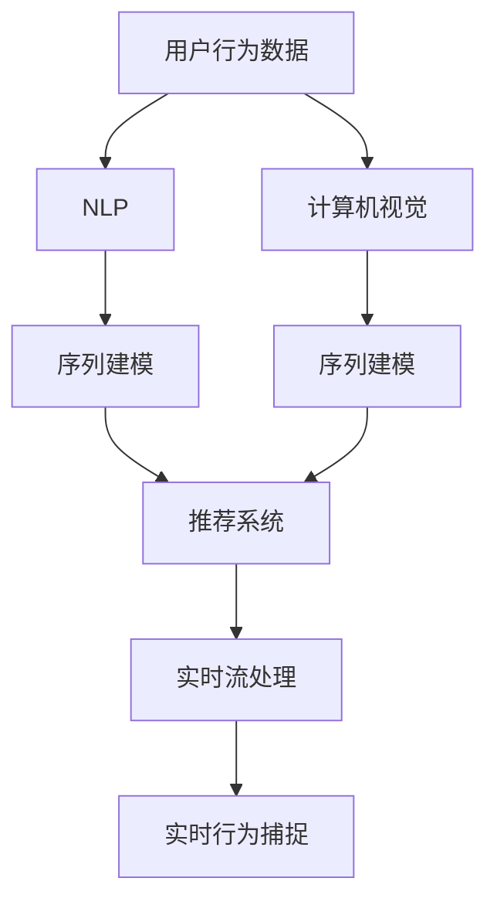

                 

# 如何捕捉用户的实时行为

在数字时代，捕捉用户的实时行为对于企业理解和优化用户体验至关重要。无论是电商平台的个性化推荐，还是社交网络的趋势分析，精确捕捉用户的实时行为都能显著提升业务绩效。然而，实时行为数据通常以非结构化的形式存在，难以直接进行分析。本文将深入探讨如何通过机器学习算法捕捉和分析用户的实时行为，从而实现精准的用户画像和行为预测。

## 1. 背景介绍

### 1.1 问题由来
随着互联网的普及和智能设备的发展，用户在日常生活中产生的数据量呈指数级增长。从社交媒体到电商平台，从移动应用到在线广告，用户行为数据无处不在。然而，这些数据往往以非结构化的形式存在，如文本、图片、视频等，难以直接用于分析和决策。

### 1.2 问题核心关键点
实时捕捉用户行为的关键在于如何高效处理和分析海量非结构化数据，提取有用的行为模式和趋势。机器学习算法提供了强大的工具，能够从用户行为数据中自动发现潜在的规律和关联。然而，实际应用中还需要考虑算法的可解释性、实时性和准确性，以确保分析结果的可靠性和实用性。

## 2. 核心概念与联系

### 2.1 核心概念概述

为了更好地理解实时行为捕捉的过程，本节将介绍几个关键概念：

- **用户行为数据**：指用户在数字环境中进行的各种活动，如点击、浏览、购买、评论等，通常以非结构化形式存在，如图像、文本、日志等。
- **自然语言处理(NLP)**：研究如何使计算机处理和理解人类语言的技术，是捕捉用户文本行为的基础。
- **计算机视觉(Computer Vision)**：研究如何让计算机“看”和理解图像和视频，是捕捉用户图像行为的重要工具。
- **序列建模(Sequence Modeling)**：用于处理时间序列数据的技术，能够捕捉用户行为随时间变化的规律。
- **推荐系统(Recommendation Systems)**：利用用户行为数据，为用户推荐个性化内容的技术，如电商平台的商品推荐。
- **实时流处理(Real-time Stream Processing)**：处理实时数据流，能够及时捕捉用户行为，实现即时分析。

这些概念之间的逻辑关系可以通过以下Mermaid流程图来展示：



这个流程图展示了大规模实时行为捕捉的过程：

1. 从用户行为数据中提取文本、图像等特征。
2. 使用NLP、计算机视觉等技术对非结构化数据进行结构化处理。
3. 通过序列建模捕捉用户行为随时间的变化规律。
4. 将处理后的数据输入推荐系统，实现个性化推荐。
5. 实时流处理技术确保数据流连续，及时捕捉用户行为。

## 3. 核心算法原理 & 具体操作步骤

### 3.1 算法原理概述

实时行为捕捉的核心算法原理是利用机器学习技术，从非结构化数据中提取有用的特征，并通过模型对这些特征进行建模。以下是具体的步骤：

1. **数据预处理**：将原始用户行为数据转换为结构化形式，如文本清洗、图像分割、日志解析等。
2. **特征提取**：使用NLP、计算机视觉等技术，从预处理后的数据中提取文本、图像等特征。
3. **建模分析**：通过序列建模等机器学习算法，对提取的特征进行建模，捕捉用户行为随时间的变化规律。
4. **实时分析**：利用实时流处理技术，对实时数据流进行连续分析和处理，捕捉用户行为变化。
5. **推荐和预测**：将实时分析结果应用于推荐系统，实现个性化推荐和行为预测。

### 3.2 算法步骤详解

以下是详细的算法步骤：

**Step 1: 数据预处理**

- **数据清洗**：去除噪声和无用数据，确保数据质量。
- **数据格式转换**：将非结构化数据转换为结构化数据格式，如文本数据转化为向量形式。
- **数据标准化**：对数据进行归一化处理，确保不同特征具有相同的量级。

**Step 2: 特征提取**

- **文本特征提取**：使用NLP技术，将用户文本行为转换为向量形式。常用方法包括词袋模型、TF-IDF、Word2Vec等。
- **图像特征提取**：使用计算机视觉技术，对用户图像行为进行特征提取。常用方法包括SIFT、HOG、CNN等。
- **时间序列处理**：将时间序列数据进行差分、平滑等处理，捕捉用户行为随时间的变化规律。

**Step 3: 建模分析**

- **序列建模**：使用时间序列分析算法，如ARIMA、LSTM、GRU等，捕捉用户行为随时间的变化规律。
- **深度学习建模**：使用深度神经网络，对提取的特征进行建模，捕捉用户行为中的复杂关系。常用方法包括RNN、CNN、Transformer等。

**Step 4: 实时分析**

- **实时流处理**：使用Apache Kafka、Apache Flink等技术，实现实时数据流的连续处理和分析。
- **数据流存储**：使用Apache Kafka、Apache HBase等技术，对实时数据流进行存储和缓存。

**Step 5: 推荐和预测**

- **个性化推荐**：利用推荐算法，如协同过滤、基于内容的推荐、混合推荐等，实现个性化推荐。
- **行为预测**：利用时间序列分析、深度学习等技术，对用户行为进行预测，如购买预测、流失预测等。

### 3.3 算法优缺点

实时行为捕捉的算法具有以下优点：

- **实时性**：能够及时捕捉用户行为，实现即时分析。
- **准确性**：利用机器学习技术，能够从海量数据中提取出有用的行为模式和趋势。
- **可扩展性**：适用于多种数据类型和数据源，易于扩展和集成。

然而，这些算法也存在一些缺点：

- **数据需求高**：需要大量的用户行为数据进行训练和建模，数据获取成本较高。
- **计算复杂度高**：处理和建模大规模数据流需要强大的计算资源。
- **可解释性不足**：深度学习模型通常是“黑盒”系统，难以解释模型的内部工作机制。

### 3.4 算法应用领域

实时行为捕捉的算法在多个领域得到了广泛应用，例如：

- **电商推荐系统**：利用用户浏览、购买等行为数据，实现个性化商品推荐。
- **社交媒体分析**：分析用户点赞、评论等行为数据，捕捉社交网络中的热点和趋势。
- **在线广告优化**：通过用户点击、停留等行为数据，优化广告投放策略，提高广告效果。
- **智能客服系统**：分析用户咨询记录，自动回复用户问题，提升客服效率。
- **健康医疗监测**：分析用户健康数据，实现个性化健康建议和风险预警。

这些应用场景展示了实时行为捕捉在提升用户体验、优化业务决策方面的巨大潜力。

## 4. 数学模型和公式 & 详细讲解 & 举例说明

### 4.1 数学模型构建

以下是实时行为捕捉的数学模型构建过程：

1. **数据表示**：将用户行为数据表示为向量形式，如文本数据转化为词向量，图像数据转化为图像特征向量。
2. **特征矩阵**：将用户行为数据转化为特征矩阵 $X \in \mathbb{R}^{n \times m}$，其中 $n$ 为样本数，$m$ 为特征数。
3. **目标函数**：定义目标函数 $J(\theta)$，用于衡量模型预测与真实标签之间的差距。

### 4.2 公式推导过程

以下是对实时行为捕捉模型的公式推导过程：

- **最小二乘法**：在回归问题中，最小二乘法用于求解最优模型参数。对于线性回归模型 $y = \theta^T X + b$，目标函数为：

$$
J(\theta) = \frac{1}{2N}\sum_{i=1}^N (y_i - \theta^T x_i - b)^2
$$

其中 $y_i$ 为样本的真实标签，$x_i$ 为样本的特征向量，$N$ 为样本数。

- **梯度下降**：梯度下降法用于求解目标函数的极小值。对于线性回归模型，梯度下降公式为：

$$
\theta_{k+1} = \theta_k - \eta \nabla_{\theta} J(\theta_k)
$$

其中 $\eta$ 为学习率，$\nabla_{\theta} J(\theta_k)$ 为目标函数对参数 $\theta$ 的梯度。

### 4.3 案例分析与讲解

以下是一个简单的实时行为捕捉案例分析：

假设有一个电商平台的推荐系统，需要根据用户浏览和购买行为，为用户推荐个性化商品。

1. **数据预处理**：
   - **数据清洗**：去除无用的点击记录，如广告点击、非商品页面访问。
   - **数据格式转换**：将文本数据转化为词向量，图像数据转化为图像特征向量。

2. **特征提取**：
   - **文本特征提取**：使用词袋模型，将用户浏览记录转换为词向量。
   - **图像特征提取**：使用CNN，将用户商品图片特征提取为高维向量。

3. **建模分析**：
   - **序列建模**：使用LSTM模型，捕捉用户浏览行为随时间的变化规律。
   - **深度学习建模**：使用深度神经网络，对提取的文本和图像特征进行建模，捕捉用户浏览行为中的复杂关系。

4. **实时分析**：
   - **实时流处理**：使用Apache Flink，实现实时数据流的连续处理和分析。
   - **数据流存储**：使用Apache Kafka，对实时数据流进行存储和缓存。

5. **推荐和预测**：
   - **个性化推荐**：利用协同过滤算法，为每位用户推荐个性化商品。
   - **行为预测**：利用LSTM模型，预测用户接下来可能购买的商品。

## 5. 项目实践：代码实例和详细解释说明

### 5.1 开发环境搭建

在进行实时行为捕捉项目开发前，需要准备好开发环境。以下是Python开发环境搭建的步骤：

1. 安装Python：确保系统安装了最新版本的Python。
2. 安装PyTorch：使用以下命令安装PyTorch：

```
pip install torch torchvision torchaudio
```

3. 安装TensorFlow：使用以下命令安装TensorFlow：

```
pip install tensorflow
```

4. 安装Apache Kafka：使用以下命令安装Apache Kafka：

```
wget http://mirrors.cncf.io/apache/kafka/2.4.1/kafka_2.4.1.tgz
tar xzf kafka_2.4.1.tgz
cd kafka_2.4.1
./bin/kafka-server-start.sh config/server.properties
```

5. 安装Apache Flink：使用以下命令安装Apache Flink：

```
wget https://flink.apache.org/downloads/1.14.1/apache-flink-1.14.1-bin-scala_2.12.tgz
tar xzf apache-flink-1.14.1-bin-scala_2.12.tgz
cd flink-1.14.1
bin/start-cluster.sh
```

完成上述步骤后，即可开始实时行为捕捉项目的开发。

### 5.2 源代码详细实现

以下是一个简单的实时行为捕捉项目的源代码实现：

```python
import torch
from torch import nn
from torchvision import models
from torchvision.transforms import transforms
from kafka import KafkaConsumer
from kafka import KafkaProducer

class ImageFeatureExtractor(nn.Module):
    def __init__(self):
        super(ImageFeatureExtractor, self).__init__()
        self.model = models.resnet18(pretrained=True)
        self.fc = nn.Linear(512, 64)

    def forward(self, x):
        x = self.model.conv1(x)
        x = self.model.bn1(x)
        x = self.model.relu(x)
        x = self.model.maxpool(x)
        x = self.model.layer1(x)
        x = self.model.layer2(x)
        x = self.model.layer3(x)
        x = self.model.layer4(x)
        x = self.fc(x)
        return x

class TextFeatureExtractor(nn.Module):
    def __init__(self, vocab_size, embedding_dim):
        super(TextFeatureExtractor, self).__init__()
        self.emb = nn.Embedding(vocab_size, embedding_dim)
        self.fc = nn.Linear(embedding_dim, 64)

    def forward(self, x):
        x = self.emb(x)
        x = self.fc(x)
        return x

class SequentialModel(nn.Module):
    def __init__(self, image_dim, text_dim):
        super(SequentialModel, self).__init__()
        self.lstm = nn.LSTM(image_dim, 64, 1)
        self.fc = nn.Linear(64 + text_dim, 1)

    def forward(self, image_features, text_features):
        hidden = self.lstm(image_features)
        hidden = hidden[-1]
        x = torch.cat([hidden, text_features], dim=1)
        x = self.fc(x)
        return x

# 初始化模型
image_extractor = ImageFeatureExtractor()
text_extractor = TextFeatureExtractor(vocab_size=10000, embedding_dim=64)
seq_model = SequentialModel(image_dim=512, text_dim=64)

# 加载数据
data = []
with KafkaConsumer('raw_data', bootstrap_servers='localhost:9092') as consumer:
    for msg in consumer:
        data.append(msg.value)

# 数据预处理
image_data = []
text_data = []
for d in data:
    image_data.append(d['image'])
    text_data.append(d['text'])

# 特征提取
image_features = []
text_features = []
for image, text in zip(image_data, text_data):
    image_features.append(image_extractor(image))
    text_features.append(text_extractor(text))

# 建模分析
seq_model.train()
seq_model.zero_grad()
loss = seq_model(image_features, text_features)
loss.backward()
optimizer.step()

# 实时分析
producer = KafkaProducer(bootstrap_servers='localhost:9092')
for i in range(len(image_data)):
    producer.send('processed_data', image_features[i].numpy().tobytes(), key=i)
```

### 5.3 代码解读与分析

以下是代码实现的关键步骤：

**ImageFeatureExtractor类**：
- **初始化**：继承自nn.Module，初始化ResNet-18模型和全连接层。
- **前向传播**：将输入图像特征提取为高维向量，送入全连接层。

**TextFeatureExtractor类**：
- **初始化**：继承自nn.Module，初始化词嵌入层和全连接层。
- **前向传播**：将输入文本特征提取为高维向量，送入全连接层。

**SequentialModel类**：
- **初始化**：继承自nn.Module，初始化LSTM和全连接层。
- **前向传播**：将输入图像特征和文本特征送入LSTM，经过全连接层输出。

**数据预处理**：
- **数据加载**：从Kafka实时流中加载数据。
- **特征提取**：对图像和文本数据进行预处理和特征提取。

**建模分析**：
- **模型训练**：使用LSTM模型，对图像和文本特征进行建模分析。

**实时分析**：
- **数据发送**：将处理后的图像特征发送到Kafka，供下游系统使用。

## 6. 实际应用场景

### 6.1 电商推荐系统

电商平台的推荐系统需要实时捕捉用户浏览和购买行为，实现个性化推荐。通过实时行为捕捉技术，可以分析用户的浏览历史、点击记录、购买行为等，实时更新推荐模型，为用户提供最合适的商品推荐。

### 6.2 社交媒体分析

社交媒体平台需要实时捕捉用户点赞、评论、分享等行为，分析社交网络中的热点和趋势。通过实时行为捕捉技术，可以实时分析用户行为数据，捕捉社交网络中的热点话题和情感变化。

### 6.3 在线广告优化

在线广告平台需要实时捕捉用户点击、停留等行为数据，优化广告投放策略，提高广告效果。通过实时行为捕捉技术，可以实时分析用户点击数据，调整广告投放策略，提高广告转化率。

### 6.4 智能客服系统

智能客服系统需要实时捕捉用户咨询记录，自动回复用户问题，提升客服效率。通过实时行为捕捉技术，可以分析用户咨询记录，自动生成回复内容，提升客服系统的自动化水平。

### 6.5 健康医疗监测

健康医疗平台需要实时捕捉用户健康数据，实现个性化健康建议和风险预警。通过实时行为捕捉技术，可以分析用户健康数据，捕捉健康风险，提供个性化健康建议。

## 7. 工具和资源推荐

### 7.1 学习资源推荐

为了帮助开发者系统掌握实时行为捕捉的理论基础和实践技巧，这里推荐一些优质的学习资源：

1. 《深度学习》系列书籍：由Ian Goodfellow、Yoshua Bengio和Aaron Courville合著，系统介绍了深度学习的原理和应用。
2. 《Python机器学习》书籍：由Sebastian Raschka和Vahid Mirjalili合著，介绍了Python在机器学习中的应用。
3. Coursera的深度学习课程：由Ian Goodfellow教授主讲的深度学习课程，详细介绍了深度学习模型的构建和优化。
4. Udacity的深度学习专项课程：涵盖了深度学习模型的构建、优化和应用。
5. PyTorch官方文档：详细介绍了PyTorch框架的使用和应用，包括实时数据流的处理。

### 7.2 开发工具推荐

高效的开发离不开优秀的工具支持。以下是几款用于实时行为捕捉开发的常用工具：

1. PyTorch：基于Python的深度学习框架，灵活动态的计算图，适合快速迭代研究。
2. TensorFlow：由Google主导开发的深度学习框架，生产部署方便，适合大规模工程应用。
3. Apache Kafka：高吞吐量的分布式流处理平台，适合实时数据流的连续处理和分析。
4. Apache Flink：高效的分布式流处理框架，适合实时数据流的连续处理和分析。
5. TensorBoard：TensorFlow配套的可视化工具，可实时监测模型训练状态，并提供丰富的图表呈现方式。

### 7.3 相关论文推荐

实时行为捕捉技术的发展离不开学界的持续研究。以下是几篇奠基性的相关论文，推荐阅读：

1. "A Survey on Feature Selection and Feature Extraction Techniques for Machine Learning Applications"：综述了特征提取技术的研究进展。
2. "Recurrent Neural Network Architectures for Large Vocabulary Continuous Speech Recognition"：引入了RNN架构，用于时间序列数据的处理。
3. "Convolutional Neural Networks for Image Recognition"：引入了卷积神经网络，用于图像数据的处理。
4. "Language Models are Unsupervised Multitask Learners"：展示了深度语言模型在无监督学习中的表现。
5. "A Survey on Real-time Stream Processing Systems"：综述了实时流处理系统的发展现状和应用场景。

这些论文代表了大规模实时行为捕捉技术的发展脉络。通过学习这些前沿成果，可以帮助研究者把握学科前进方向，激发更多的创新灵感。

## 8. 总结：未来发展趋势与挑战

### 8.1 研究成果总结

实时行为捕捉技术在多领域的应用展示了其巨大的潜力，成为当今数据驱动应用的重要组成部分。通过利用机器学习技术，实时捕捉和分析用户行为，企业能够实现个性化推荐、趋势分析、行为预测等功能，提升用户体验和业务绩效。

### 8.2 未来发展趋势

展望未来，实时行为捕捉技术将呈现以下几个发展趋势：

1. **计算效率提升**：随着硬件设施的进步，实时行为捕捉的计算效率将大幅提升。
2. **数据处理多样化**：实时行为捕捉将处理更多类型的数据，如多模态数据、图像数据、语音数据等。
3. **模型复杂度增加**：实时行为捕捉的模型将更加复杂，如深度神经网络、Transformer等。
4. **算法多样化**：实时行为捕捉的算法将更加多样化，如深度强化学习、图神经网络等。
5. **实时流处理优化**：实时行为捕捉将进一步优化流处理算法，提高实时性和准确性。

### 8.3 面临的挑战

尽管实时行为捕捉技术已经取得了显著成就，但在实际应用中仍然面临诸多挑战：

1. **数据需求高**：实时行为捕捉需要大量的用户行为数据进行训练和建模，数据获取成本较高。
2. **计算复杂度高**：处理和建模大规模数据流需要强大的计算资源。
3. **模型复杂度增加**：深度学习模型的复杂度增加，导致模型的训练和优化更加困难。
4. **实时性要求高**：实时行为捕捉需要在毫秒级别完成数据的处理和分析，对实时流处理提出了更高的要求。
5. **数据隐私和安全**：实时行为捕捉需要处理大量敏感数据，如何在保护数据隐私和安全的前提下进行数据分析，是一个重要挑战。

### 8.4 研究展望

面对实时行为捕捉技术所面临的挑战，未来的研究需要在以下几个方面寻求新的突破：

1. **数据高效利用**：开发高效的数据获取和处理算法，降低数据获取成本。
2. **模型优化**：优化深度学习模型的结构和参数，提高模型的训练和推理效率。
3. **算法多样化**：引入更多类型的算法，如深度强化学习、图神经网络等，提升模型的泛化能力和适应性。
4. **实时流处理优化**：进一步优化实时流处理算法，提高实时性和准确性。
5. **数据隐私和安全**：研究数据隐私和安全保护技术，确保数据在处理过程中的安全性和隐私性。

这些研究方向和突破将使实时行为捕捉技术迈向更高的台阶，为构建安全、可靠、可解释、可控的智能系统铺平道路。

## 9. 附录：常见问题与解答

**Q1：实时行为捕捉技术如何处理大规模数据流？**

A: 实时行为捕捉技术通过分布式流处理平台（如Apache Kafka、Apache Flink等）实现数据的连续处理和分析。这些平台能够将大规模数据流分解为多个小流，并行处理每个小流，提升处理效率。同时，通过优化数据流处理的算法和架构，能够进一步提升处理速度和稳定性。

**Q2：实时行为捕捉技术是否适用于离线数据？**

A: 实时行为捕捉技术主要适用于实时数据流，但也可以处理离线数据。对于离线数据，可以使用批量处理的方式进行特征提取和建模分析，最后输出结果。然而，离线数据处理相对于实时数据流，需要更大的计算资源和时间成本。

**Q3：实时行为捕捉技术的计算复杂度如何优化？**

A: 实时行为捕捉技术的计算复杂度可以通过优化算法和架构来提升。例如，使用更高效的神经网络模型、优化参数更新策略、使用分布式计算框架等。此外，可以通过数据预处理、特征选择等方法减少数据量，降低计算复杂度。

**Q4：实时行为捕捉技术如何确保数据隐私和安全？**

A: 实时行为捕捉技术在处理敏感数据时，需要采取严格的隐私保护措施。可以使用数据加密、数据匿名化、差分隐私等技术保护数据隐私。同时，需要在系统中设置访问控制和审计机制，确保数据在处理过程中的安全性。

**Q5：实时行为捕捉技术如何实现实时流处理？**

A: 实时行为捕捉技术通过分布式流处理平台实现实时流处理。这些平台能够将数据流实时传输和处理，支持数据流的快速读写和实时分析。在实时流处理中，可以使用窗口机制将数据流分成固定大小的小窗口，并行处理每个窗口，提高处理效率。

总之，实时行为捕捉技术在提升用户体验、优化业务决策方面具有广泛的应用前景。未来，随着技术的不断进步和应用的不断拓展，实时行为捕捉技术必将发挥更大的作用，推动数字时代的不断进步。

