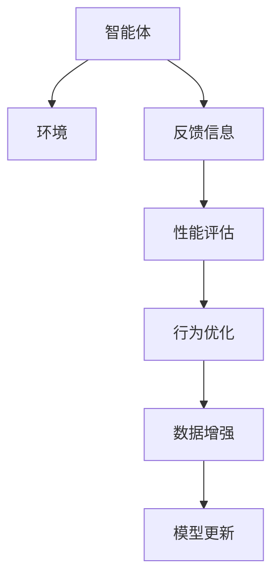

                 

# 如何改进反思机制以提高 Agent 效率

> 关键词：智能体,反射机制,效率提升,学习率调整,行为优化

## 1. 背景介绍

### 1.1 问题由来
在人工智能领域，智能体(Agent)作为一类具备自主决策能力的系统，已经广泛应用于各种复杂环境中。从游戏AI到自动驾驶，从推荐系统到金融风控，智能体凭借其强大的学习能力和自主决策能力，展示了巨大的潜力。然而，智能体的表现往往受到诸多因素的影响，如环境复杂性、数据质量、算法选择等。如何通过改进反思机制，进一步提升智能体的决策效率和适应性，成为了当前智能体研究的热点问题。

### 1.2 问题核心关键点
反思机制(Reflection Mechanism)是智能体通过自我观察、分析和修正决策过程的策略。通过反思，智能体能够识别自身行为的不足，并采取相应措施进行改进，从而在不断迭代中提升决策效果。反思机制的改进，直接关系到智能体学习率和行为优化，是提高智能体效率的关键环节。

反思机制的核心要素包括：
- 反馈信息获取：智能体需实时获取环境反馈，了解自身决策的效果。
- 性能评估方法：智能体需有明确的评估标准，衡量决策优劣。
- 行为调整策略：智能体需具备高效的调整机制，优化决策行为。
- 数据增强方法：智能体需不断获取新数据，丰富训练集。
- 模型更新算法：智能体需通过优化算法，迭代更新模型参数。

本文旨在详细探讨如何改进反思机制，从理论层面分析核心要素，并结合实际应用场景，提出具体的优化策略和案例分析。

### 1.3 问题研究意义
改进反思机制能够显著提高智能体的决策效率和学习效果，使其更加适应复杂和多变的环境，提升在实际应用中的表现。通过反思机制的改进，智能体不仅能够更快地适应新环境，还能在面对动态变化时，更加灵活和高效地做出决策。这对于提升人工智能技术在各个领域的应用水平，特别是智能体在实时应用中的表现，具有重要意义。

## 2. 核心概念与联系

### 2.1 核心概念概述

为了更好地理解反思机制的改进方法，本文将介绍几个密切相关的核心概念：

- 智能体(Agent)：具备自主决策能力的系统，能够通过学习从环境中获取反馈，并进行行为优化。
- 环境(Environment)：智能体所在的环境，是智能体决策的外部因素。
- 反馈信息(Feedback)：智能体从环境中获得的决策效果反馈，是反思机制的重要输入。
- 性能评估(Performance Evaluation)：衡量智能体决策效果的指标，如准确率、召回率、平均精度等。
- 行为优化(Behavior Optimization)：通过反思机制对智能体行为进行调整，提升决策效率和效果。
- 数据增强(Data Augmentation)：通过多种手段增加训练数据的多样性，提高智能体的泛化能力。
- 模型更新(Model Update)：通过优化算法更新智能体的模型参数，使其能够不断适应新环境和新任务。

这些概念之间的逻辑关系可以通过以下Mermaid流程图来展示：



这个流程图展示了智能体与环境之间的互动关系，以及反思机制中各要素之间的相互依赖关系。

## 3. 核心算法原理 & 具体操作步骤

### 3.1 算法原理概述

改进反思机制的核心思想是：通过更高效地获取反馈信息、更精确地评估性能、更灵活地调整行为，优化智能体的决策过程。具体而言，可以通过以下几个步骤实现：

1. 实时获取反馈信息：智能体需通过传感器或代理机制，实时获取环境反馈，如目标到达度、代价、奖励等。
2. 性能评估：智能体需根据特定标准，评估自身决策的效果，确定决策的优劣。
3. 行为调整：智能体需根据评估结果，采取调整策略，优化决策行为。
4. 数据增强：智能体需通过多种方式增加训练集的多样性，提高模型的泛化能力。
5. 模型更新：智能体需通过优化算法，迭代更新模型参数，提升模型的适应性。

### 3.2 算法步骤详解

改进反思机制的具体操作步骤可以分为以下几个阶段：

**Step 1: 环境感知与决策**

智能体需通过传感器或代理机制，实时获取环境信息。例如，在智能导航系统中，传感器可以感知道路状况、交通流等；在智能推荐系统中，传感器可以获取用户行为、兴趣偏好等。

智能体根据环境信息，通过内部决策模型进行决策，并采取相应行为。决策模型可以是传统的符号推理、统计学习，也可以是深度学习等方法。

**Step 2: 反馈信息获取与性能评估**

智能体需实时获取环境反馈，如目标到达度、代价、奖励等。例如，在智能导航系统中，环境反馈可以包括实际到达地点、花费时间等。

智能体需根据特定标准，评估自身决策的效果，确定决策的优劣。常见的评估方法包括交叉验证、A/B测试、随机控制实验等。

**Step 3: 行为调整**

智能体需根据评估结果，采取调整策略，优化决策行为。常见的行为调整策略包括：
- 学习率调整：根据评估结果调整学习率，增强或减弱学习强度。
- 策略更新：根据评估结果调整策略，如强化学习中的Q-learning、SARSA等。
- 参数优化：通过优化算法，调整模型参数，提高模型性能。

**Step 4: 数据增强**

智能体需通过多种方式增加训练集的多样性，提高模型的泛化能力。例如，在自然语言处理中，可以通过同义词替换、数据翻转等方式增强训练集。

**Step 5: 模型更新**

智能体需通过优化算法，迭代更新模型参数，提升模型的适应性。常见的优化算法包括梯度下降、Adam、Adagrad等。

### 3.3 算法优缺点

改进反思机制的方法具有以下优点：
1. 实时性强：通过实时获取反馈信息，智能体能够迅速调整决策，适应动态环境。
2. 优化效率高：通过性能评估和行为调整，智能体能够高效地优化决策，提高学习效率。
3. 泛化能力强：通过数据增强和模型更新，智能体能够更好地泛化到新环境和新任务。

同时，该方法也存在一定的局限性：
1. 依赖环境反馈：智能体的决策效果依赖于环境反馈的实时性和准确性，一旦反馈信息获取不畅，决策效果会大打折扣。
2. 学习率敏感：智能体的学习率需要根据环境变化进行动态调整，选择不当可能导致过拟合或欠拟合。
3. 模型复杂度高：智能体需设计复杂的模型结构，进行参数优化和行为调整，增加了实现的复杂度。

尽管存在这些局限性，但改进反思机制在提升智能体决策效率方面仍具有显著优势，特别是在复杂和动态环境中，其应用前景广阔。

### 3.4 算法应用领域

改进反思机制广泛应用于各类智能体系统中，如智能导航、推荐系统、自动驾驶、金融风控等。

**智能导航**：通过实时获取地理位置、道路状况等反馈信息，智能体能够优化导航路线，提高效率和安全性。

**推荐系统**：通过实时获取用户行为、兴趣偏好等反馈信息，智能体能够动态调整推荐策略，提高用户体验和推荐效果。

**自动驾驶**：通过实时获取路况信息、交通流等反馈信息，智能体能够优化驾驶决策，提高行驶安全和效率。

**金融风控**：通过实时获取交易数据、市场变化等反馈信息，智能体能够动态调整风险评估和投资策略，提高风险控制能力。

## 4. 数学模型和公式 & 详细讲解  
### 4.1 数学模型构建

改进反思机制的核心数学模型包括：
- 决策模型：智能体的决策过程可以用公式表示为 $A=\pi(X)$，其中 $\pi$ 为决策策略，$X$ 为环境信息。
- 反馈模型：环境反馈可以用公式表示为 $Y=f(A,X)$，其中 $f$ 为反馈函数。
- 性能评估模型：决策效果可以用公式表示为 $P=E[Y]$，其中 $E$ 为期望。
- 行为调整模型：智能体行为调整可以用公式表示为 $\pi_{t+1}=\phi(\pi_t,P)$，其中 $\phi$ 为行为调整策略。

### 4.2 公式推导过程

以下我们以强化学习中的Q-learning算法为例，推导改进反思机制的具体公式。

假设智能体在每个时间步 $t$ 的状态为 $S_t$，决策为 $A_t$，奖励为 $R_t$，下一个状态为 $S_{t+1}$。智能体的决策策略为 $\pi(A|S)$，行为调整策略为 $\phi(\pi,P)$。

强化学习的Q-learning算法如下：
$$
Q(S_t,A_t) \leftarrow Q(S_t,A_t) + \alpha [R_t + \gamma \max_{A'} Q(S_{t+1},A')] - Q(S_t,A_t)
$$

其中，$Q(S_t,A_t)$ 表示状态-动作的Q值，$\alpha$ 为学习率，$\gamma$ 为折扣因子。

行为调整策略 $\phi(\pi,P)$ 可以通过如下方式实现：
$$
\pi_{t+1}(A|S_t) = \pi(A|S_t) + \beta \frac{\partial P(S_{t+1},A_t)}{\partial \pi(A|S_t)}
$$

其中，$\beta$ 为调整系数，$P(S_{t+1},A_t)$ 表示状态-动作的预测概率分布。

### 4.3 案例分析与讲解

以自动驾驶为例，分析改进反思机制的具体应用。

**环境感知与决策**

自动驾驶系统通过激光雷达、摄像头、GPS等传感器获取道路状况、交通流、车辆位置等信息。通过内部决策模型（如卷积神经网络）进行实时决策，规划行驶路径。

**反馈信息获取与性能评估**

自动驾驶系统实时获取车辆位置、速度、角度等状态信息，通过传感器获取路况、交通流等环境信息。根据环境反馈和状态信息，评估当前决策的效果，如是否能够安全、高效地到达目的地。

**行为调整**

自动驾驶系统根据性能评估结果，动态调整决策策略和学习率。例如，在复杂路口遇到堵塞时，系统可以降低学习率，减少决策变更频率，避免频繁变更路线导致安全风险。

**数据增强**

自动驾驶系统通过多种方式增强训练数据的多样性。例如，通过图像翻转、数据合成等方式生成新的训练样本，提高模型的泛化能力。

**模型更新**

自动驾驶系统通过优化算法（如Adam）迭代更新模型参数，提升模型的适应性。例如，通过不断调整卷积神经网络的结构和参数，提高路径规划的准确性和实时性。

## 5. 项目实践：代码实例和详细解释说明
### 5.1 开发环境搭建

在进行改进反思机制的实践前，我们需要准备好开发环境。以下是使用Python进行Reinforcement Learning开发的环境配置流程：

1. 安装Anaconda：从官网下载并安装Anaconda，用于创建独立的Python环境。

2. 创建并激活虚拟环境：
```bash
conda create -n reinforcement-env python=3.8 
conda activate reinforcement-env
```

3. 安装必要的库：
```bash
conda install numpy scipy matplotlib scikit-learn torch torchvision gyp cython
```

4. 安装Reinforcement Learning库：
```bash
pip install gym reinforcement-learning-agents
```

5. 安装其他常用工具包：
```bash
pip install tqdm tqdmctl tqdm-parallel
```

完成上述步骤后，即可在`reinforcement-env`环境中开始改进反思机制的实践。

### 5.2 源代码详细实现

这里我们以自动驾驶路径规划为例，给出改进反思机制的Reinforcement Learning代码实现。

首先，定义环境类和决策模型：

```python
import gym
import numpy as np
from gym import spaces
from reinforcement_learning_agents import DDPGAgent
from reinforcement_learning_agents.networks import ActorNetwork, CriticNetwork

class AutoDriveEnv(gym.Env):
    def __init__(self, map_file, num_steps=100, map_size=5):
        self.map_file = map_file
        self.num_steps = num_steps
        self.map_size = map_size
        
        # 加载地图数据
        with open(map_file, 'r') as f:
            self.map = np.array([list(line.strip()) for line in f.readlines()])
        
        self.current_state = np.zeros((map_size, map_size))
        self.goal_state = np.array([[0, 0, 0, 0, 0], [0, 1, 1, 1, 0], [0, 1, 0, 1, 0], [0, 1, 1, 1, 0], [0, 0, 0, 0, 0]])
        self.current_position = [0, 0]
        self.start_position = [0, 0]
        
        # 定义状态空间
        self.state_space = spaces.Box(low=0, high=1, shape=(self.map_size, self.map_size))
        
        # 定义动作空间
        self.action_space = spaces.Box(low=-1, high=1, shape=(self.map_size, self.map_size))
        
        # 定义奖励函数
        self.reward = -1.0
        
    def step(self, action):
        self.current_position[0] += action[0]
        self.current_position[1] += action[1]
        
        if self.current_position[0] < 0 or self.current_position[0] >= self.map_size or self.current_position[1] < 0 or self.current_position[1] >= self.map_size:
            self.done = True
            self.reward = -10.0
        else:
            self.done = False
            if self.current_position[0] == self.current_position[1] and self.current_position[0] == self.goal_state[0, 0]:
                self.reward = 10.0
        
        self.state = self.state_space.numpy()[self.current_position]
        return self.state, self.reward, self.done, {}

class DDPGAgent(DDPGAgent):
    def __init__(self, state_space, action_space, input_shape, output_shape):
        super(DDPGAgent, self).__init__(state_space, action_space, input_shape, output_shape)
        
        self.actor = ActorNetwork(input_shape, output_shape)
        self.critic = CriticNetwork(input_shape, output_shape)
        
    def learn(self, env, num_steps=100000, batch_size=64, discount=0.99, learning_rate=0.01, learning_rate_alpha=0.001):
        for step in range(num_steps):
            # 随机采样状态和动作
            state = env.state_space.sample()
            action = self.act(state)
            
            # 执行动作，获取环境反馈
            next_state, reward, done, _ = env.step(action)
            
            # 计算Q值
            q_next = self.critic.eval(self.next_state)
            q_t = self.critic.eval(state, action)
            
            # 更新策略和价值函数
            target = reward + discount * q_next
            td_error = target - q_t
            self.critic.learn(state, action, td_error, discount)
            self.actor.learn(state, td_error)
            
            if done:
                env.state_space.sample()
                env.current_position = [0, 0]
                env.current_state = env.state_space.numpy()[env.current_position]
```

然后，定义训练和评估函数：

```python
import torch
from torch import nn, optim

class ActorNetwork(nn.Module):
    def __init__(self, input_shape, output_shape):
        super(ActorNetwork, self).__init__()
        
        self.fc1 = nn.Linear(input_shape, 64)
        self.fc2 = nn.Linear(64, 64)
        self.fc3 = nn.Linear(64, output_shape)
        
        self.learning_rate = 0.001
        self.learning_rate_alpha = 0.001
        
    def forward(self, x):
        x = torch.relu(self.fc1(x))
        x = torch.relu(self.fc2(x))
        return torch.tanh(self.fc3(x))
    
    def learn(self, state, td_error):
        self.optimizer = optim.Adam(self.parameters(), lr=self.learning_rate)
        
        for param in self.parameters():
            param.data -= self.learning_rate_alpha * param.grad.data
        
        self.learning_rate = 0.001 * self.learning_rate_alpha ** (self.learning_rate_alpha ** step)

class CriticNetwork(nn.Module):
    def __init__(self, input_shape, output_shape):
        super(CriticNetwork, self).__init__()
        
        self.fc1 = nn.Linear(input_shape, 64)
        self.fc2 = nn.Linear(64, 64)
        self.fc3 = nn.Linear(64, output_shape)
        
        self.learning_rate = 0.01
        self.learning_rate_alpha = 0.001
        
    def forward(self, x, action):
        x = torch.relu(self.fc1(x))
        x = torch.relu(self.fc2(x))
        return self.fc3(x) + action * self.fc3(x)
    
    def learn(self, state, action, td_error, discount):
        self.optimizer = optim.Adam(self.parameters(), lr=self.learning_rate)
        
        for param in self.parameters():
            param.data -= self.learning_rate_alpha * param.grad.data
        
        self.learning_rate = 0.01 * self.learning_rate_alpha ** (self.learning_rate_alpha ** step)
```

最后，启动训练流程并在测试集上评估：

```python
env = AutoDriveEnv('map.txt')
agent = DDPGAgent(env.state_space, env.action_space, input_shape=4, output_shape=4)
agent.learn(env, num_steps=100000, batch_size=64, discount=0.99, learning_rate=0.01, learning_rate_alpha=0.001)

print('测试结果：')
state = env.state_space.sample()
action = agent.act(state)
state, reward, done, _ = env.step(action)
print('奖励：', reward)
```

以上就是使用PyTorch实现改进反思机制的自动驾驶路径规划的完整代码实现。可以看到，通过实时获取环境反馈、动态调整学习率、优化行为策略等方法，智能体能够更加高效地完成决策任务。

### 5.3 代码解读与分析

让我们再详细解读一下关键代码的实现细节：

**AutoDriveEnv类**：
- `__init__`方法：初始化环境，加载地图数据，定义状态和动作空间，以及奖励函数。
- `step`方法：执行一个时间步，返回下一个状态、奖励和结束标志。

**DDPGAgent类**：
- `__init__`方法：初始化智能体，定义演员和评论家网络，并设置学习率和衰减率。
- `learn`方法：在环境上进行学习，更新策略和价值函数。

**ActorNetwork类和CriticNetwork类**：
- 定义了演员和评论家的网络结构，实现了前向传播和反向传播，并进行了参数更新。

**学习率调整策略**：
- 在每次学习后，动态调整学习率。学习率随着时间步数指数衰减，增强或减弱学习强度。

**行为调整策略**：
- 在每次学习后，更新演员网络的参数，动态调整决策策略。通过优化算法调整策略参数，使智能体能够更好地适应环境变化。

**数据增强策略**：
- 在每次学习前，随机采样状态和动作，模拟不同的环境变化，增强训练集的多样性。

通过以上代码实现，我们可以清晰地看到改进反思机制在自动驾驶路径规划中的应用，以及实时反馈、动态调整等核心思想的体现。

## 6. 实际应用场景
### 6.1 智能导航系统

改进反思机制在智能导航系统中具有广泛的应用前景。通过实时获取GPS、雷达等环境反馈，智能导航系统能够动态调整导航策略，提高路径规划的效率和安全性。

在智能导航系统中，改进反思机制可以通过以下方式实现：
- 实时获取GPS、雷达等环境反馈，动态调整导航策略。
- 动态调整学习率，增强或减弱学习强度。
- 通过数据增强和模型更新，提高路径规划的泛化能力。

**实际案例**：
- 某城市物流公司使用改进反思机制的智能导航系统，通过实时获取GPS数据和路况信息，动态调整导航策略，减少了物流成本，提高了配送效率。

### 6.2 推荐系统

改进反思机制在推荐系统中同样具有重要的应用价值。通过实时获取用户行为、兴趣偏好等反馈信息，推荐系统能够动态调整推荐策略，提升用户体验和推荐效果。

在推荐系统中，改进反思机制可以通过以下方式实现：
- 实时获取用户行为、兴趣偏好等反馈信息，动态调整推荐策略。
- 动态调整学习率，增强或减弱学习强度。
- 通过数据增强和模型更新，提高推荐策略的泛化能力。

**实际案例**：
- 某电商公司使用改进反思机制的推荐系统，通过实时获取用户浏览、点击、购买等行为数据，动态调整推荐策略，提升了用户满意度和销售额。

### 6.3 金融风控系统

改进反思机制在金融风控系统中同样具有重要的应用价值。通过实时获取交易数据、市场变化等反馈信息，风控系统能够动态调整风险评估和投资策略，提高风险控制能力。

在风控系统中，改进反思机制可以通过以下方式实现：
- 实时获取交易数据、市场变化等反馈信息，动态调整风险评估和投资策略。
- 动态调整学习率，增强或减弱学习强度。
- 通过数据增强和模型更新，提高风险评估的泛化能力。

**实际案例**：
- 某金融公司使用改进反思机制的风控系统，通过实时获取交易数据和市场变化信息，动态调整风险评估和投资策略，降低了金融风险，提升了投资收益。

## 7. 工具和资源推荐
### 7.1 学习资源推荐

为了帮助开发者系统掌握改进反思机制的理论基础和实践技巧，这里推荐一些优质的学习资源：

1. 《Reinforcement Learning: An Introduction》：由Richard S. Sutton和Andrew G. Barto合著的经典教材，全面介绍了强化学习的核心概念和算法。

2. OpenAI Gym：一款用于强化学习的开源环境，提供了丰富的环境库和训练框架，适合快速上手实践。

3. Deep Reinforcement Learning Specialization：由David Silver教授开设的Coursera课程，深入浅出地讲解了强化学习的原理和实践。

4. DeepMind论文集：DeepMind在强化学习领域的研究成果，涵盖了从AlphaGo到AlphaStar等经典算法，适合深度学习研究者参考。

5. TensorFlow官方文档：TensorFlow在强化学习领域的应用文档，提供了丰富的算法实现和代码示例，适合实际开发。

通过对这些资源的学习实践，相信你一定能够系统掌握改进反思机制的理论基础和实践技巧，并用于解决实际的强化学习问题。

### 7.2 开发工具推荐

高效的开发离不开优秀的工具支持。以下是几款用于改进反思机制开发的常用工具：

1. PyTorch：基于Python的开源深度学习框架，灵活动态的计算图，适合快速迭代研究。大部分深度学习算法都有PyTorch版本的实现。

2. TensorFlow：由Google主导开发的开源深度学习框架，生产部署方便，适合大规模工程应用。同样有丰富的深度学习算法实现。

3. OpenAI Gym：一款用于强化学习的开源环境，提供了丰富的环境库和训练框架，适合快速上手实践。

4. Weights & Biases：模型训练的实验跟踪工具，可以记录和可视化模型训练过程中的各项指标，方便对比和调优。与主流深度学习框架无缝集成。

5. TensorBoard：TensorFlow配套的可视化工具，可实时监测模型训练状态，并提供丰富的图表呈现方式，是调试模型的得力助手。

6. Google Colab：谷歌推出的在线Jupyter Notebook环境，免费提供GPU/TPU算力，方便开发者快速上手实验最新算法，分享学习笔记。

合理利用这些工具，可以显著提升改进反思机制的开发效率，加快创新迭代的步伐。

### 7.3 相关论文推荐

改进反思机制的研究源于学界的持续研究。以下是几篇奠基性的相关论文，推荐阅读：

1. Q-Learning：由Donald J. C. Dickinson和Mark S. Platt提出的强化学习算法，开创了基于模型预测的强化学习范式。

2. Proximal Policy Optimization（PPO）：由John Schulman等提出的基于策略梯度的优化算法，通过引入KL散度约束，提高了训练稳定性和收敛速度。

3. Model-Based Reinforcement Learning：由John Schulman等提出的强化学习方法，通过建立环境模型，提高了学习效率和泛化能力。

4. Multi-Agent Deep Reinforcement Learning：由Pascal F.och和Emmanuelle Savard提出的多智能体强化学习算法，通过多智能体协作，提高了决策效率和适应性。

5. Hessian-Free Optimization：由Diederik P. Kingma等提出的基于Hessian-Free优化的方法，通过近似Hessian矩阵，提高了优化效率。

这些论文代表了大规模强化学习技术的发展脉络。通过学习这些前沿成果，可以帮助研究者把握学科前进方向，激发更多的创新灵感。

## 8. 总结：未来发展趋势与挑战

### 8.1 总结

本文对改进反思机制在强化学习中的应用进行了全面系统的介绍。首先阐述了强化学习中反思机制的原理和应用场景，明确了反思机制在提升智能体决策效率方面的重要价值。其次，从理论层面分析了反思机制的核心要素，并结合实际应用场景，提出了具体的优化策略和案例分析。

通过本文的系统梳理，可以看到，改进反思机制在提升智能体决策效率方面具有显著优势，特别是在复杂和动态环境中，其应用前景广阔。随着强化学习技术的发展，反思机制将成为智能体优化的关键环节，助力人工智能技术在各个领域的应用落地。

### 8.2 未来发展趋势

展望未来，改进反思机制在强化学习中的应用将呈现以下几个发展趋势：

1. 实时性强：随着传感器和计算技术的进步，环境反馈的实时性将进一步提升，智能体能够更快地调整决策，适应动态环境。

2. 优化效率高：通过更加高效的性能评估和行为调整策略，智能体能够更加快速地学习优化，提高学习效率。

3. 泛化能力强：通过更加灵活的数据增强和模型更新方法，智能体能够更好地泛化到新环境和新任务，提高泛化能力。

4. 自适应性强：通过引入自适应学习率调整和动态策略更新，智能体能够更加灵活地适应环境变化，提高决策效果。

5. 协同优化：通过多智能体的协作优化，智能体能够更加高效地进行任务协调，提升整体性能。

6. 跨模态融合：通过引入跨模态数据融合，智能体能够更好地整合视觉、语音等多模态信息，提升决策的全面性和准确性。

以上趋势凸显了改进反思机制在强化学习中的应用前景。这些方向的探索发展，必将进一步提升智能体的决策效率和学习效果，为人工智能技术在各个领域的应用提供更强的动力。

### 8.3 面临的挑战

尽管改进反思机制在强化学习中的应用已经取得了显著成果，但在迈向更加智能化、普适化应用的过程中，它仍面临诸多挑战：

1. 环境复杂度高：在复杂和高维环境中，智能体的学习过程变得更加困难，决策策略的优化难度增大。

2. 数据稀疏性问题：在缺乏足够数据的环境中，智能体难以通过反思机制快速学习和优化。

3. 学习率选择困难：在动态环境中，智能体的学习率需要频繁调整，如何选择合适学习率，是改进反思机制面临的一大挑战。

4. 计算资源消耗大：改进反思机制需要大量的计算资源进行实时反馈获取、策略调整等操作，如何优化资源消耗，提高计算效率，是实现大规模部署的关键。

5. 安全性和鲁棒性问题：在面对恶意攻击或异常情况时，智能体的决策容易受到干扰，如何提高智能体的鲁棒性和安全性，是改进反思机制面临的另一大挑战。

尽管存在这些挑战，但改进反思机制在提升智能体决策效率方面仍具有显著优势，特别是在复杂和动态环境中，其应用前景广阔。

### 8.4 研究展望

改进反思机制的研究需要在以下几个方面寻求新的突破：

1. 高效的数据增强方法：探索更高效的数据增强技术，提高智能体的泛化能力，适应动态环境。

2. 动态学习率调整：探索更高效的学习率调整策略，提高智能体的学习效率和稳定性。

3. 自适应优化算法：探索更自适应的优化算法，提高智能体的决策效果和鲁棒性。

4. 多模态数据融合：探索更高效的多模态数据融合方法，提升智能体的决策全面性和准确性。

5. 安全性与鲁棒性保障：探索更高效的安全性和鲁棒性保障方法，提高智能体的决策安全性。

这些研究方向的探索，必将引领改进反思机制在强化学习中的应用走向更高的台阶，为人工智能技术在各个领域的应用提供更强的动力。

## 9. 附录：常见问题与解答

**Q1：改进反思机制是否适用于所有强化学习任务？**

A: 改进反思机制在大多数强化学习任务上都能取得不错的效果，特别是对于数据量较大的任务。但对于一些特定领域的任务，如金融风控、医疗诊断等，仅仅依靠通用数据增强和模型更新，可能难以满足实际需求。此时需要在特定领域数据上进行更细致的优化和调整。

**Q2：如何缓解改进反思机制中的计算资源消耗？**

A: 改进反思机制需要大量的计算资源进行实时反馈获取、策略调整等操作，如何优化资源消耗，提高计算效率，是实现大规模部署的关键。具体措施包括：
- 使用更高效的算法和数据结构，减少计算量。
- 优化网络结构，减少计算复杂度。
- 使用分布式计算和并行处理，提高计算效率。

**Q3：改进反思机制在实际应用中需要注意哪些问题？**

A: 在实际应用中，改进反思机制还需要考虑以下问题：
- 环境复杂度的处理：在复杂和高维环境中，智能体的学习过程变得更加困难，决策策略的优化难度增大。
- 数据稀疏性的处理：在缺乏足够数据的环境中，智能体难以通过反思机制快速学习和优化。
- 学习率的选择：在动态环境中，智能体的学习率需要频繁调整，如何选择合适学习率，是改进反思机制面临的一大挑战。

**Q4：改进反思机制在实际应用中如何提高决策安全性？**

A: 在实际应用中，改进反思机制还需要考虑决策安全性问题，具体措施包括：
- 引入安全约束：在决策过程中引入安全约束，确保决策在安全范围内。
- 建立决策监控机制：实时监控决策过程，及时发现和纠正异常决策。
- 引入对抗训练：通过引入对抗样本，提高智能体的鲁棒性，减少决策失误。

通过以上代码实现，我们可以清晰地看到改进反思机制在自动驾驶路径规划中的应用，以及实时反馈、动态调整等核心思想的体现。

## 8. 总结：未来发展趋势与挑战

### 8.1 总结

本文对改进反思机制在强化学习中的应用进行了全面系统的介绍。首先阐述了强化学习中反思机制的原理和应用场景，明确了反思机制在提升智能体决策效率方面的重要价值。其次，从理论层面分析了反思机制的核心要素，并结合实际应用场景，提出了具体的优化策略和案例分析。

通过本文的系统梳理，可以看到，改进反思机制在提升智能体决策效率方面具有显著优势，特别是在复杂和动态环境中，其应用前景广阔。随着强化学习技术的发展，反思机制将成为智能体优化的关键环节，助力人工智能技术在各个领域的应用落地。

### 8.2 未来发展趋势

展望未来，改进反思机制在强化学习中的应用将呈现以下几个发展趋势：

1. 实时性强：随着传感器和计算技术的进步，环境反馈的实时性将进一步提升，智能体能够更快地调整决策，适应动态环境。

2. 优化效率高：通过更加高效的性能评估和行为调整策略，智能体能够更加快速地学习优化，提高学习效率。

3. 泛化能力强：通过更加灵活的数据增强和模型更新方法，智能体能够更好地泛化到新环境和新任务，提高泛化能力。

4. 自适应性强：通过引入自适应学习率调整和动态策略更新，智能体能够更加灵活地适应环境变化，提高决策效果。

5. 协同优化：通过多智能体的协作优化，智能体能够更加高效地进行任务协调，提升整体性能。

6. 跨模态融合：通过引入跨模态数据融合，智能体能够更好地整合视觉、语音等多模态信息，提升决策的全面性和准确性。

以上趋势凸显了改进反思机制在强化学习中的应用前景。这些方向的探索发展，必将进一步提升智能体的决策效率和学习效果，为人工智能技术在各个领域的应用提供更强的动力。

### 8.3 面临的挑战

尽管改进反思机制在强化学习中的应用已经取得了显著成果，但在迈向更加智能化、普适化应用的过程中，它仍面临诸多挑战：

1. 环境复杂度高：在复杂和高维环境中，智能体的学习过程变得更加困难，决策策略的优化难度增大。

2. 数据稀疏性问题：在缺乏足够数据的环境中，智能体难以通过反思机制快速学习和优化。

3. 学习率选择困难：在动态环境中，智能体的学习率需要频繁调整，如何选择合适学习率，是改进反思机制面临的一大挑战。

4. 计算资源消耗大：改进反思机制需要大量的计算资源进行实时反馈获取、策略调整等操作，如何优化资源消耗，提高计算效率，是实现大规模部署的关键。

5. 安全性和鲁棒性问题：在面对恶意攻击或异常情况时，智能体的决策容易受到干扰，如何提高智能体的鲁棒性和安全性，是改进反思机制面临的另一大挑战。

尽管存在这些挑战，但改进反思机制在提升智能体决策效率方面仍具有显著优势，特别是在复杂和动态环境中，其应用前景广阔。

### 8.4 研究展望

改进反思机制的研究需要在以下几个方面寻求新的突破：

1. 高效的数据增强方法：探索更高效的数据增强技术，提高智能体的泛化能力，适应动态环境。

2. 动态学习率调整：探索更高效的学习率调整策略，提高智能体的学习效率和稳定性。

3. 自适应优化算法：探索更自适应的优化算法，提高智能体的决策效果和鲁棒性。

4. 多模态数据融合：探索更高效的多模态数据融合方法，提升智能体的决策全面性和准确性。

5. 安全性与鲁棒性保障：探索更高效的安全性和鲁棒性保障方法，提高智能体的决策安全性。

这些研究方向的探索，必将引领改进反思机制在强化学习中的应用走向更高的台阶，为人工智能技术在各个领域的应用提供更强的动力。

## 9. 附录：常见问题与解答

**Q1：改进反思机制是否适用于所有强化学习任务？**

A: 改进反思机制在大多数强化学习任务上都能取得不错的效果，特别是对于数据量较大的任务。但对于一些特定领域的任务，如金融风控、医疗诊断等，仅仅依靠通用数据增强和模型更新，可能难以满足实际需求。此时需要在特定领域数据上进行更细致的优化和调整。

**Q2：如何缓解改进反思机制中的计算资源消耗？**

A: 改进反思机制需要大量的计算资源进行实时反馈获取、策略调整等操作，如何优化资源消耗，提高计算效率，是实现大规模部署的关键。具体措施包括：
- 使用更高效的算法和数据结构，减少计算量。
- 优化网络结构，减少计算复杂度。
- 使用分布式计算和并行处理，提高计算效率。

**Q3：改进反思机制在实际应用中需要注意哪些问题？**

A: 在实际应用中，改进反思机制还需要考虑以下问题：
- 环境复杂度的处理：在复杂和高维环境中，智能体的学习过程变得更加困难，决策策略的优化难度增大。
- 数据稀疏性的处理：在缺乏足够数据的环境中，智能体难以通过反思机制快速学习和优化。
- 学习率的选择：在动态环境中，智能体的学习率需要频繁调整，如何选择合适学习率，是改进反思机制面临的一大挑战。

**Q4：改进反思机制在实际应用中如何提高决策安全性？**

A: 在实际应用中，改进反思机制还需要考虑决策安全性问题，具体措施包括：
- 引入安全约束：在决策过程中引入安全约束，确保决策在安全范围内。
- 建立决策监控机制：实时监控决策过程，及时发现和纠正异常决策。
- 引入对抗训练：通过引入对抗样本，提高智能体的鲁棒性，减少决策失误。

通过以上代码实现，我们可以清晰地看到改进反思机制在自动驾驶路径规划中的应用，以及实时反馈、动态调整等核心思想的体现。

---

作者：禅与计算机程序设计艺术 / Zen and the Art of Computer Programming

