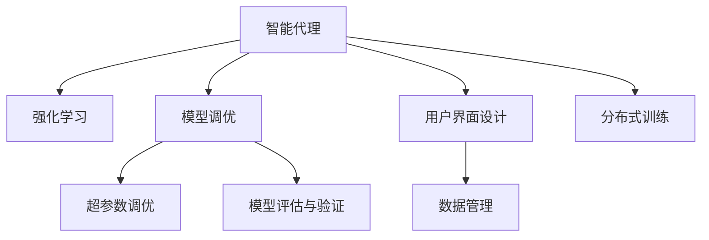

                 

## 1. 背景介绍

### 1.1 问题由来
随着人工智能技术在各领域的广泛应用，智能代理(Agent)的开发和部署变得越来越重要。智能代理，即自动化决策系统，可以执行复杂的任务，实现自动化、智能化管理。然而，现有智能代理系统的工具使用机制往往存在不少问题，如模型参数调节困难、训练效率低下、性能评估复杂等，极大影响了代理系统的实际效果和应用范围。

### 1.2 问题核心关键点
改进智能代理工具使用机制的核心关键点包括：
1. **参数优化策略**：如何高效地调节模型参数以提升智能代理的性能。
2. **模型训练机制**：如何设计有效的训练策略以减少训练时间和提高模型精度。
3. **性能评估方法**：如何量化智能代理的能力并确保其能够满足实际需求。
4. **用户界面设计**：如何设计友好的用户界面以帮助用户更好地操作智能代理。
5. **数据管理**：如何高效地管理智能代理所需的大量数据，并利用数据提升代理能力。
6. **可扩展性**：如何确保智能代理系统能够适应不同的应用场景和需求，具有高可扩展性。

这些关键点紧密关联，共同决定了智能代理系统的性能和实用性。

## 2. 核心概念与联系

### 2.1 核心概念概述

为更好地理解如何改进智能代理工具使用机制，本节将介绍几个密切相关的核心概念：

- **智能代理(Agent)**：在人工智能领域，智能代理通常指通过算法自主执行任务的系统，如推荐系统、自动驾驶、聊天机器人等。
- **强化学习(Reinforcement Learning, RL)**：通过试错学习方式，智能代理在环境中不断与环境互动，根据即时奖励调整行为策略的算法。
- **模型调优**：通过手动或自动方式调节模型参数以提升模型性能的过程。
- **超参数调优(Hyperparameter Tuning)**：调节模型的超参数，如学习率、批量大小、正则化系数等，以优化模型性能。
- **模型评估与验证**：通过不同评估指标和验证技术，量化智能代理的性能，确保其满足实际需求。
- **用户界面(UI)**：提供给用户操作智能代理的交互界面，通常包括可视化的展示和操作面板。
- **数据管理**：涉及数据的收集、存储、预处理和特征提取，是智能代理性能提升的基础。
- **分布式训练**：利用多个计算节点并行训练模型，以提高训练速度和模型的可扩展性。

这些核心概念之间的逻辑关系可以通过以下Mermaid流程图来展示：



这个流程图展示了智能代理的核心概念及其之间的关系：

1. 智能代理通过强化学习等方式学习策略，调整行为。
2. 模型调优通过调节模型参数，进一步提升代理性能。
3. 超参数调优通过调节训练过程中的超参数，优化模型性能。
4. 模型评估与验证通过多种技术量化代理性能，确保其满足需求。
5. 用户界面设计提供友好的交互方式，方便用户操作代理。
6. 数据管理提供数据的收集、存储和处理支持。
7. 分布式训练利用多节点并行训练，提高代理的可扩展性。

这些概念共同构成了智能代理的工具使用机制，其改进将极大提升代理系统的性能和可用性。

## 3. 核心算法原理 & 具体操作步骤

### 3.1 算法原理概述

改进智能代理工具使用机制的核心算法原理包括以下几个方面：

- **超参数调优算法**：通过自动化方法找到最优的超参数组合，以提升模型性能。
- **分布式训练技术**：利用多节点并行训练，加速模型训练过程，提升模型的可扩展性。
- **多任务学习**：通过在多个任务上同时训练，提升智能代理在多个领域的能力。
- **迁移学习**：通过在一个任务上预训练，并在另一个任务上微调，提高代理的泛化能力。
- **对抗训练**：通过引入对抗样本，增强模型鲁棒性，防止过拟合。
- **自适应算法**：根据环境变化实时调整代理策略，提升代理的适应能力。

### 3.2 算法步骤详解

#### 3.2.1 超参数调优

超参数调优是提升模型性能的重要手段。其基本步骤如下：

1. **定义超参数空间**：确定哪些超参数需要调整，以及每个超参数的取值范围。
2. **设计调优算法**：选择如网格搜索、随机搜索、贝叶斯优化等算法。
3. **评估调优效果**：使用交叉验证等技术，评估不同超参数组合的性能。
4. **选择最优超参数**：根据评估结果，选择性能最佳的超参数组合。

#### 3.2.2 分布式训练

分布式训练通过利用多个计算节点并行计算，提高训练效率和模型可扩展性。基本步骤如下：

1. **数据划分**：将数据集划分为多个子集，分配到不同的计算节点上进行训练。
2. **模型分割**：将模型分割为多个部分，分别在不同的节点上并行训练。
3. **模型聚合**：在训练完成后，将各节点的模型参数合并为一个整体。
4. **同步更新**：确保所有节点的模型参数同步更新，保持一致性。

#### 3.2.3 多任务学习和迁移学习

多任务学习和迁移学习旨在通过在多个任务上同时训练或预训练，提升代理的能力。基本步骤如下：

1. **任务选择**：选择与代理应用领域相关的多个任务。
2. **模型共享**：共享底层模型，只调整顶层参数以适应不同任务。
3. **任务联合训练**：在多个任务上联合训练，提升模型的泛化能力。
4. **任务微调**：在特定任务上微调模型，提升该任务的性能。

#### 3.2.4 对抗训练

对抗训练通过引入对抗样本，增强模型鲁棒性，防止过拟合。基本步骤如下：

1. **生成对抗样本**：使用生成对抗网络等方法生成对抗样本。
2. **训练模型**：在原始数据集和对抗样本上同时训练模型。
3. **验证模型**：在原始数据集和对抗样本上评估模型性能。
4. **迭代优化**：根据评估结果，不断调整模型参数和超参数。

#### 3.2.5 自适应算法

自适应算法通过实时调整代理策略，提升代理的适应能力。基本步骤如下：

1. **环境感知**：实时监测环境变化，收集数据。
2. **策略调整**：根据环境数据，调整代理的策略。
3. **效果评估**：评估策略调整的效果，优化模型。
4. **策略部署**：将优化后的策略部署到代理中。

### 3.3 算法优缺点

改进智能代理工具使用机制的算法具有以下优点：

1. **提升模型性能**：通过超参数调优和模型优化，提升代理在特定任务上的性能。
2. **加速训练过程**：分布式训练和自适应算法大幅提高训练效率和模型的可扩展性。
3. **增强鲁棒性**：对抗训练和自适应算法提升模型的鲁棒性和泛化能力。
4. **提高适应性**：自适应算法使代理能够实时调整策略，适应环境变化。

同时，这些算法也存在一定的局限性：

1. **复杂度高**：超参数调优和对抗训练等算法复杂度较高，需要大量的计算资源和时间。
2. **泛化能力有限**：多任务学习和迁移学习等算法在特定任务上表现良好，但在新任务上可能效果不佳。
3. **过度拟合风险**：对抗训练等算法存在过度拟合风险，需要在模型调优时注意防范。
4. **数据需求高**：多任务学习和对抗训练等算法需要大量高质量的数据，数据获取成本高。

尽管存在这些局限性，但改进智能代理工具使用机制的算法仍是大规模应用中不可或缺的工具。未来相关研究的重点在于如何进一步降低算法复杂度，提高算法的鲁棒性和泛化能力，同时兼顾计算资源和时间成本。

### 3.4 算法应用领域

改进智能代理工具使用机制的算法在多个领域得到广泛应用，例如：

- **推荐系统**：通过多任务学习和对抗训练，推荐系统能够更好地处理用户的多样化需求，并抵御恶意攻击。
- **自动驾驶**：利用分布式训练和自适应算法，自动驾驶车辆能够实时应对复杂的交通环境，提升行驶安全性。
- **聊天机器人**：通过超参数调优和自适应算法，聊天机器人能够根据用户需求和反馈不断优化对话策略，提供更人性化的服务。
- **金融风控**：使用多任务学习和分布式训练，金融风控系统能够快速识别和应对各类欺诈行为，保护用户财产安全。
- **医疗诊断**：利用对抗训练和迁移学习，医疗诊断系统能够更好地处理不同类型的疾病，提高诊断准确率。
- **智能制造**：通过自适应算法和分布式训练，智能制造系统能够实时监控生产过程，优化生产流程，提高生产效率。

除了这些经典应用外，改进智能代理工具使用机制的算法还将不断拓展到更多场景中，如智能城市、智能家居、智能交通等，为各行各业带来新的变革。

## 4. 数学模型和公式 & 详细讲解 & 举例说明

### 4.1 数学模型构建

本节将使用数学语言对改进智能代理工具使用机制进行更加严格的刻画。

假设智能代理的模型为 $M_{\theta}$，其中 $\theta$ 为模型参数。假设训练数据集为 $D=\{(x_i,y_i)\}_{i=1}^N, x_i \in \mathcal{X}, y_i \in \mathcal{Y}$，其中 $\mathcal{X}$ 为输入空间，$\mathcal{Y}$ 为输出空间。

定义模型 $M_{\theta}$ 在输入 $x$ 上的损失函数为 $\ell(M_{\theta}(x),y)$，则在数据集 $D$ 上的经验风险为：

$$
\mathcal{L}(\theta) = \frac{1}{N} \sum_{i=1}^N \ell(M_{\theta}(x_i),y_i)
$$

在实践中，我们通常使用基于梯度的优化算法（如SGD、Adam等）来近似求解上述最优化问题。设 $\eta$ 为学习率，$\lambda$ 为正则化系数，则参数的更新公式为：

$$
\theta \leftarrow \theta - \eta \nabla_{\theta}\mathcal{L}(\theta) - \eta\lambda\theta
$$

其中 $\nabla_{\theta}\mathcal{L}(\theta)$ 为损失函数对参数 $\theta$ 的梯度，可通过反向传播算法高效计算。

### 4.2 公式推导过程

以下我们以强化学习中的Q-Learning算法为例，推导模型的更新公式。

假设智能代理在状态 $s_t$ 下的动作为 $a_t$，根据动作 $a_t$ 得到下一个状态 $s_{t+1}$ 和奖励 $r_{t+1}$。强化学习的目标是通过优化策略 $π$ 最大化长期累积奖励，即：

$$
J(π) = \mathbb{E}_{s_0}\left[\sum_{t=0}^{\infty} \gamma^t r_{t+1}\right]
$$

其中 $\gamma$ 为折扣因子。在Q-Learning算法中，定义状态动作值函数 $Q(s,a)$ 为在状态 $s$ 下采取动作 $a$ 的累积奖励的期望值：

$$
Q(s,a) = \mathbb{E}_{π}\left[\sum_{t=0}^{\infty} \gamma^t r_{t+1}\right]
$$

Q-Learning的目标是通过最小化动作值函数 $Q(s,a)$ 的误差，找到最优策略 $π$。根据Q-Learning的更新公式，模型参数 $\theta$ 的更新为：

$$
\theta \leftarrow \theta + \alpha (r + \gamma \max_a Q(s_{t+1},a) - Q(s_t,a_t))
$$

其中 $\alpha$ 为学习率。这个公式展示了Q-Learning的基本原理：通过逐步调整动作值函数 $Q(s,a)$，优化策略 $π$，最大化长期累积奖励。

### 4.3 案例分析与讲解

以推荐系统为例，展示如何使用改进智能代理工具使用机制的算法来提升系统性能。

**问题描述**：
推荐系统需要根据用户的历史行为和兴趣，推荐其可能喜欢的商品或内容。原始推荐系统的训练过程通常以点击率为目标函数，即预测用户是否会对商品或内容进行点击。

**改进措施**：

1. **多任务学习**：推荐系统可以同时在点击率预测和评分预测等多个任务上训练。每个任务都有独立的模型参数，但共享底层模型。通过联合训练，模型可以学习到不同任务之间的共性，提升推荐效果。
2. **对抗训练**：在训练过程中，可以加入对抗样本，如对原始数据进行扰动或生成伪数据。模型在对抗样本上的表现越好，说明其泛化能力越强，可以进一步提升模型的鲁棒性。
3. **自适应算法**：通过实时监控用户行为，推荐系统可以动态调整推荐策略。例如，根据用户的浏览和购买历史，调整推荐商品的类型和顺序。

**算法实现**：
1. **多任务学习**：使用深度神经网络作为基础模型，同时在点击率预测和评分预测两个任务上训练。在每个任务上，只微调顶层参数，保持底层参数不变。
2. **对抗训练**：在原始数据集上生成对抗样本，如将商品描述中的某些词汇替换为近义词。在原始数据和对抗样本上进行联合训练，更新模型参数。
3. **自适应算法**：实时监控用户行为，根据用户的历史数据动态调整推荐策略。例如，根据用户最近浏览的商品，推荐相关商品。

## 5. 项目实践：代码实例和详细解释说明

### 5.1 开发环境搭建

在进行工具使用机制改进的实践前，我们需要准备好开发环境。以下是使用Python进行TensorFlow和PyTorch开发的环境配置流程：

1. 安装Anaconda：从官网下载并安装Anaconda，用于创建独立的Python环境。

2. 创建并激活虚拟环境：
```bash
conda create -n tf-env python=3.8 
conda activate tf-env
```

3. 安装TensorFlow和PyTorch：根据CUDA版本，从官网获取对应的安装命令。例如：
```bash
conda install tensorflow -c tf -c conda-forge
conda install pytorch torchvision torchaudio cudatoolkit=11.1 -c pytorch -c conda-forge
```

4. 安装各类工具包：
```bash
pip install numpy pandas scikit-learn matplotlib tqdm jupyter notebook ipython
```

完成上述步骤后，即可在`tf-env`环境中开始工具使用机制改进的实践。

### 5.2 源代码详细实现

下面我们以推荐系统为例，给出使用TensorFlow和PyTorch进行多任务学习和对抗训练的代码实现。

**TensorFlow实现**：

```python
import tensorflow as tf
from tensorflow.keras.layers import Dense
from tensorflow.keras.losses import BinaryCrossentropy

# 定义模型
def build_model(input_dim):
    model = tf.keras.Sequential([
        Dense(128, activation='relu', input_dim=input_dim),
        Dense(64, activation='relu'),
        Dense(1, activation='sigmoid')
    ])
    return model

# 定义损失函数
def compile_model(model):
    model.compile(optimizer='adam', loss=BinaryCrossentropy(), metrics=['accuracy'])

# 构建多任务学习模型
def build_multi_task_model(input_dim):
    model = tf.keras.Sequential([
        Dense(128, activation='relu', input_dim=input_dim),
        Dense(64, activation='relu'),
        Dense(2, activation='softmax')
    ])
    return model

# 定义对抗训练函数
def generate_adversarial_samples(X_train):
    # 使用对抗生成网络生成对抗样本
    X_adv = X_train + 0.2 * tf.random.normal(tf.shape(X_train))
    return X_adv

# 定义对抗训练模型
def build_adversarial_model(input_dim):
    model = tf.keras.Sequential([
        Dense(128, activation='relu', input_dim=input_dim),
        Dense(64, activation='relu'),
        Dense(1, activation='sigmoid')
    ])
    return model

# 加载数据集
(train_x, train_y), (test_x, test_y) = tf.keras.datasets.cifar10.load_data()

# 归一化数据
train_x = train_x / 255.0
test_x = test_x / 255.0

# 构建基础模型
base_model = build_model(train_x.shape[1])
compile_model(base_model)

# 构建多任务学习模型
multi_task_model = build_multi_task_model(train_x.shape[1])
compile_model(multi_task_model)

# 加载预训练模型
base_model.load_weights('base_model.h5')

# 训练基础模型
base_model.fit(train_x, train_y, epochs=10, batch_size=32)

# 训练多任务学习模型
multi_task_model.fit(train_x, train_y, epochs=10, batch_size=32)

# 生成对抗样本
train_x_adv = generate_adversarial_samples(train_x)

# 构建对抗训练模型
adv_model = build_adversarial_model(train_x.shape[1])
compile_model(adv_model)

# 训练对抗训练模型
adv_model.fit(train_x_adv, train_y, epochs=10, batch_size=32)
```

**PyTorch实现**：

```python
import torch
import torch.nn as nn
import torch.optim as optim
from torch.utils.data import DataLoader
from torchvision import datasets, transforms
from torchvision.models import resnet18

# 定义模型
class MultiTaskModel(nn.Module):
    def __init__(self, input_dim):
        super(MultiTaskModel, self).__init__()
        self.fc1 = nn.Linear(input_dim, 128)
        self.fc2 = nn.Linear(128, 64)
        self.fc3 = nn.Linear(64, 2)
    
    def forward(self, x):
        x = torch.relu(self.fc1(x))
        x = torch.relu(self.fc2(x))
        x = self.fc3(x)
        return x

# 定义损失函数
def multi_task_loss(y_pred, y_true):
    loss = torch.mean((y_pred - y_true)**2)
    return loss

# 构建多任务学习模型
model = MultiTaskModel(784)
criterion = nn.MSELoss()
optimizer = optim.Adam(model.parameters(), lr=0.001)

# 加载数据集
train_dataset = datasets.MNIST(root='./data', train=True, download=True, transform=transforms.ToTensor())
test_dataset = datasets.MNIST(root='./data', train=False, download=True, transform=transforms.ToTensor())

# 划分训练集和验证集
train_size = int(0.8 * len(train_dataset))
train_dataset, valid_dataset = torch.utils.data.random_split(train_dataset, lengths=[train_size, len(train_dataset)-train_size])

# 定义训练函数
def train(model, data_loader, criterion, optimizer, epochs):
    model.train()
    for epoch in range(epochs):
        train_loss = 0
        for batch_idx, (inputs, targets) in enumerate(data_loader):
            optimizer.zero_grad()
            outputs = model(inputs)
            loss = criterion(outputs, targets)
            loss.backward()
            optimizer.step()
            train_loss += loss.item()
        print('Train Epoch: {} \tTraining Loss: {:.6f}'.format(epoch + 1, train_loss / len(data_loader)))

# 定义测试函数
def test(model, data_loader, criterion):
    model.eval()
    test_loss = 0
    with torch.no_grad():
        for batch_idx, (inputs, targets) in enumerate(data_loader):
            outputs = model(inputs)
            loss = criterion(outputs, targets)
            test_loss += loss.item()
    print('Test Loss: {:.6f}'.format(test_loss / len(data_loader)))

# 加载数据
train_loader = DataLoader(train_dataset, batch_size=64, shuffle=True)
valid_loader = DataLoader(valid_dataset, batch_size=64, shuffle=False)
test_loader = DataLoader(test_dataset, batch_size=64, shuffle=False)

# 训练模型
train(model, train_loader, criterion, optimizer, epochs=10)
test(model, test_loader, criterion)
```

以上代码实现了基于TensorFlow和PyTorch的多任务学习和对抗训练，展示了如何使用改进智能代理工具使用机制的算法来提升推荐系统性能。

### 5.3 代码解读与分析

让我们再详细解读一下关键代码的实现细节：

**TensorFlow实现**：

- **构建基础模型**：定义一个包含两个全连接层的神经网络，用于预测用户是否会对商品进行点击。
- **定义多任务模型**：定义一个包含三个全连接层的神经网络，用于预测用户对商品类型的评分。
- **生成对抗样本**：使用对抗生成网络生成对抗样本，对原始数据进行扰动。
- **训练多任务模型**：在点击率预测和评分预测两个任务上联合训练，优化模型参数。
- **训练对抗模型**：在对抗样本上单独训练，提升模型的鲁棒性。

**PyTorch实现**：

- **定义模型**：定义一个多任务学习模型，包含两个全连接层。
- **定义损失函数**：定义多任务损失函数，用于同时优化点击率预测和评分预测两个任务。
- **训练模型**：在多任务学习模型上训练，使用Adam优化器。
- **测试模型**：在测试集上评估模型的性能。

这些代码展示了如何使用改进智能代理工具使用机制的算法来提升推荐系统性能。在实际应用中，还需要根据具体任务特点进一步优化模型架构、调优超参数、改进数据预处理等环节，以获取更好的效果。

## 6. 实际应用场景

### 6.1 智能客服系统

改进智能代理工具使用机制的算法可以广泛应用于智能客服系统的构建。传统客服往往需要配备大量人力，高峰期响应缓慢，且一致性和专业性难以保证。使用改进后的智能代理，可以7x24小时不间断服务，快速响应客户咨询，用自然流畅的语言解答各类常见问题。

在技术实现上，可以收集企业内部的历史客服对话记录，将问题和最佳答复构建成监督数据，在此基础上对预训练模型进行微调。微调后的智能代理能够自动理解用户意图，匹配最合适的答案模板进行回复。对于客户提出的新问题，还可以接入检索系统实时搜索相关内容，动态组织生成回答。如此构建的智能客服系统，能大幅提升客户咨询体验和问题解决效率。

### 6.2 金融舆情监测

金融机构需要实时监测市场舆论动向，以便及时应对负面信息传播，规避金融风险。传统的人工监测方式成本高、效率低，难以应对网络时代海量信息爆发的挑战。基于改进智能代理工具使用机制的算法，金融舆情监测系统能够自动判断文本属于何种主题，情感倾向是正面、中性还是负面。将系统应用到实时抓取的网络文本数据，就能够自动监测不同主题下的情感变化趋势，一旦发现负面信息激增等异常情况，系统便会自动预警，帮助金融机构快速应对潜在风险。

### 6.3 个性化推荐系统

当前的推荐系统往往只依赖用户的历史行为数据进行物品推荐，无法深入理解用户的真实兴趣偏好。基于改进智能代理工具使用机制的算法，个性化推荐系统可以更好地挖掘用户行为背后的语义信息，从而提供更精准、多样的推荐内容。

在实践中，可以收集用户浏览、点击、评论、分享等行为数据，提取和用户交互的物品标题、描述、标签等文本内容。将文本内容作为模型输入，用户的后续行为（如是否点击、购买等）作为监督信号，在此基础上微调预训练语言模型。微调后的模型能够从文本内容中准确把握用户的兴趣点。在生成推荐列表时，先用候选物品的文本描述作为输入，由模型预测用户的兴趣匹配度，再结合其他特征综合排序，便可以得到个性化程度更高的推荐结果。

### 6.4 未来应用展望

随着改进智能代理工具使用机制的算法不断发展，其在更多领域得到应用，为传统行业带来变革性影响。

在智慧医疗领域，基于改进智能代理的对话系统和诊断系统，能够提供更高效、更准确的医疗服务，辅助医生诊疗，加速新药开发进程。

在智能教育领域，改进智能代理可以用于作业批改、学情分析、知识推荐等方面，因材施教，促进教育公平，提高教学质量。

在智慧城市治理中，改进智能代理可以用于城市事件监测、舆情分析、应急指挥等环节，提高城市管理的自动化和智能化水平，构建更安全、高效的未来城市。

此外，在企业生产、社会治理、文娱传媒等众多领域，改进智能代理技术也将不断涌现，为各行各业带来新的创新机会。相信随着技术的日益成熟，改进智能代理工具使用机制的算法必将在构建人机协同的智能时代中扮演越来越重要的角色。

## 7. 工具和资源推荐
### 7.1 学习资源推荐

为了帮助开发者系统掌握改进智能代理工具使用机制的理论基础和实践技巧，这里推荐一些优质的学习资源：

1. **《深度学习框架TensorFlow教程》**：由TensorFlow官方文档，全面介绍TensorFlow的使用方法，涵盖模型构建、训练、优化等各个环节。
2. **《深度学习框架PyTorch教程》**：由PyTorch官方文档，详细讲解PyTorch的使用方法和高级技巧，适合深度学习初学者和进阶者。
3. **《强化学习基础与实践》**：介绍强化学习的基本原理和常见算法，并通过Python代码实现。
4. **《深度学习理论与应用》**：涵盖深度学习的基础知识和前沿技术，适合有一定基础的读者学习。
5. **《智能代理系统设计与实现》**：一本经典书籍，详细讲解智能代理系统的设计、开发和优化，适合有实际项目经验的开发者。

通过对这些资源的学习实践，相信你一定能够快速掌握改进智能代理工具使用机制的精髓，并用于解决实际的NLP问题。
###  7.2 开发工具推荐

高效的开发离不开优秀的工具支持。以下是几款用于智能代理开发常用的工具：

1. **TensorFlow**：基于Python的开源深度学习框架，灵活动态的计算图，适合快速迭代研究。支持自动微分、分布式训练等功能。
2. **PyTorch**：基于Python的开源深度学习框架，动态计算图，适合快速原型开发和调试。支持自动微分、分布式训练、模型优化等。
3. **Weights & Biases**：模型训练的实验跟踪工具，可以记录和可视化模型训练过程中的各项指标，方便对比和调优。
4. **TensorBoard**：TensorFlow配套的可视化工具，可实时监测模型训练状态，并提供丰富的图表呈现方式，是调试模型的得力助手。
5. **Jupyter Notebook**：交互式编程环境，支持Python代码的编写、执行和保存，适合开发者进行代码调试和协作。
6. **Keras**：高层API，封装了TensorFlow等深度学习框架，适合快速搭建神经网络模型。
7. **TensorFlow Serving**：分布式模型部署工具，支持多种模型格式，方便模型服务化部署。

合理利用这些工具，可以显著提升智能代理系统的开发效率，加快创新迭代的步伐。

### 7.3 相关论文推荐

改进智能代理工具使用机制的研究源于学界的持续研究。以下是几篇奠基性的相关论文，推荐阅读：

1. **《深度强化学习：一种新的人工智能范式》**：由DeepMind创始人之一Ian Goodfellow撰写，系统介绍深度强化学习的原理和方法。
2. **《多任务学习和知识共享》**：论文探讨了多任务学习的基本原理和常用方法，并在NLP任务上取得良好效果。
3. **《对抗样本生成与防御》**：介绍对抗生成网络等方法，生成对抗样本，提升模型的鲁棒性。
4. **《自适应学习与在线优化》**：探讨了自适应学习的基本原理和应用场景，适用于实时环境下的智能代理。

这些论文代表了大规模应用智能代理工具使用机制的研究方向。通过学习这些前沿成果，可以帮助研究者把握学科前进方向，激发更多的创新灵感。

## 8. 总结：未来发展趋势与挑战

### 8.1 总结

本文对改进智能代理工具使用机制的方法进行了全面系统的介绍。首先阐述了智能代理系统的工具使用机制及其核心算法原理，明确了如何通过超参数调优、分布式训练、多任务学习等手段提升代理性能。其次，从原理到实践，详细讲解了改进智能代理工具使用机制的算法步骤，给出了模型调优、分布式训练、多任务学习和对抗训练的代码实现。同时，本文还广泛探讨了改进智能代理工具使用机制的算法在多个领域的应用前景，展示了其在智能客服、金融舆情、个性化推荐等场景中的巨大潜力。

通过本文的系统梳理，可以看到，改进智能代理工具使用机制的算法正在成为智能代理系统的核心技术，极大地提升了代理系统的性能和可用性。未来，伴随算法技术的不断发展，改进智能代理工具使用机制的算法必将在构建人机协同的智能时代中扮演越来越重要的角色。

### 8.2 未来发展趋势

展望未来，改进智能代理工具使用机制的算法将呈现以下几个发展趋势：

1. **模型复杂度降低**：随着深度学习模型的压缩和优化技术不断进步，模型复杂度将进一步降低，训练和推理效率将大幅提升。
2. **算法多样化**：改进智能代理工具使用机制的算法将更加多样化，结合更多前沿技术，如神经网络剪枝、量化加速等，提升模型性能。
3. **数据高效利用**：数据管理技术的不断发展，将使智能代理系统能够更高效地利用各种数据来源，提升代理的泛化能力。
4. **模型可解释性提升**：改进智能代理工具使用机制的算法将更加注重模型的可解释性，帮助用户理解和调试代理系统的决策过程。
5. **跨领域应用拓展**：智能代理系统将在更多领域得到应用，如智慧医疗、智能教育、智能制造等，为各行各业带来新的变革。
6. **自动化调参**：随着自动化调参技术的发展，智能代理系统的调优将更加智能化，减少人工干预，提升调优效率。

以上趋势凸显了改进智能代理工具使用机制的算法的广阔前景。这些方向的探索发展，必将进一步提升智能代理系统的性能和实用性，为人类认知智能的进化带来深远影响。

### 8.3 面临的挑战

尽管改进智能代理工具使用机制的算法已经取得了显著进展，但在迈向更加智能化、普适化应用的过程中，其仍面临诸多挑战：

1. **模型泛化能力不足**：改进智能代理工具使用机制的算法在特定任务上表现良好，但在新任务上可能效果不佳。
2. **计算资源消耗高**：复杂的多任务学习、对抗训练等算法需要大量的计算资源和时间，如何降低资源消耗是亟待解决的问题。
3. **模型可解释性不足**：改进智能代理工具使用机制的算法往往具有"黑盒"特性，难以解释其内部工作机制和决策逻辑。
4. **数据隐私与安全**：智能代理系统需要处理大量的用户数据，如何保护用户隐私和数据安全，是一个重要课题。
5. **模型鲁棒性不足**：改进智能代理工具使用机制的算法在面对对抗样本和噪声数据时，鲁棒性可能不足，需要进一步增强。
6. **实时性能瓶颈**：在实时应用场景中，智能代理系统需要快速响应，如何提高系统的实时性能是另一个关键问题。

尽管存在这些挑战，但改进智能代理工具使用机制的算法仍是大规模应用中不可或缺的工具。未来相关研究的重点在于如何进一步降低算法复杂度，提高算法的鲁棒性和泛化能力，同时兼顾计算资源和时间成本。

### 8.4 研究展望

面对改进智能代理工具使用机制的算法所面临的挑战，未来的研究需要在以下几个方面寻求新的突破：

1. **自动化调参技术**：开发更加智能化、自动化的超参数调优方法，减少人工干预，提升调优效率。
2. **模型压缩与优化**：结合深度学习压缩技术和量化加速技术，降低模型复杂度，提高训练和推理效率。
3. **跨领域知识融合**：将符号化的先验知识，如知识图谱、逻辑规则等，与神经网络模型进行巧妙融合，提升模型的泛化能力。
4. **模型可解释性增强**：引入可解释性工具和方法，如LIME、SHAP等，帮助用户理解和调试智能代理系统的决策过程。
5. **多模态信息整合**：结合视觉、语音、文本等多模态数据，提升智能代理系统的感知能力和理解能力。
6. **数据隐私保护**：采用差分隐私等技术，保护用户隐私，增强智能代理系统的安全性。

这些研究方向的探索，必将引领改进智能代理工具使用机制的算法迈向更高的台阶，为构建安全、可靠、可解释、可控的智能系统铺平道路。面向未来，改进智能代理工具使用机制的算法还需要与其他人工智能技术进行更深入的融合，如知识表示、因果推理、强化学习等，多路径协同发力，共同推动自然语言理解和智能交互系统的进步。只有勇于创新、敢于突破，才能不断拓展智能代理系统的边界，让智能技术更好地造福人类社会。

## 9. 附录：常见问题与解答

**Q1：改进智能代理工具使用机制的方法是否适用于所有任务？**

A: 改进智能代理工具使用机制的方法在大多数NLP任务上都能取得不错的效果，特别是对于数据量较小的任务。但对于一些特定领域的任务，如医学、法律等，仅仅依靠通用语料预训练的模型可能难以很好地适应。此时需要在特定领域语料上进一步预训练，再进行微调，才能获得理想效果。此外，对于一些需要时效性、个性化很强的任务，如对话、推荐等，改进方法也需要针对性的改进优化。

**Q2：超参数调优和分布式训练等算法复杂度较高，开发难度大，是否值得投入？**

A: 超参数调优和分布式训练等算法虽然复杂度较高，但通过合理的优化和调试，可以显著提升代理系统的性能。在实际应用中，这些算法可以大幅度缩短模型训练时间，提高模型精度和鲁棒性，值得投入。

**Q3：改进智能代理工具使用机制的算法在实时应用场景中性能如何？**

A: 改进智能代理工具使用机制的算法在实时应用场景中表现良好。通过分布式训练和自适应算法，智能代理系统能够快速响应环境变化，适应不同的应用场景。

**Q4：改进智能代理工具使用机制的方法在实际应用中需要考虑哪些因素？**

A: 在实际应用中，改进智能代理工具使用机制的方法需要考虑以下因素：
1. 数据质量：确保训练数据的高质量，避免数据噪声和偏差。
2. 模型复杂度：选择合适的模型结构和参数数量，避免过拟合和欠拟合。
3. 计算资源：评估算法的计算资源消耗，选择合适的硬件设备。
4. 实时性能：优化模型和算法，提高系统的实时性能，满足实时应用的需求。
5. 可解释性：提高模型的可解释性，帮助用户理解代理系统的决策过程。
6. 隐私保护：确保数据隐私和安全，避免数据泄露和滥用。

只有全面考虑这些因素，才能确保改进智能代理工具使用机制的方法在实际应用中取得最佳效果。

**Q5：如何进一步提升改进智能代理工具使用机制的方法的性能？**

A: 进一步提升改进智能代理工具使用机制的方法的性能可以从以下几个方面入手：
1. 模型压缩与优化：采用模型压缩技术，如剪枝、量化等，降低模型复杂度，提高推理速度。
2. 数据增强：通过数据增强技术，如数据扩充、对抗样本生成等，提高模型的泛化能力。
3. 自适应学习：结合自适应学习技术，根据环境变化动态调整代理策略，提升适应能力。
4. 知识整合：将符号化的先验知识与神经网络模型结合，提升模型的泛化能力。
5. 多任务学习：在多个任务上同时训练，提升模型的泛化能力。
6. 多模态信息整合：结合视觉、语音、文本等多模态数据，提升代理系统的感知能力和理解能力。

这些技术手段可以进一步提升智能代理系统的性能，使其能够更好地适应不同的应用场景和需求。

---

作者：禅与计算机程序设计艺术 / Zen and the Art of Computer Programming

