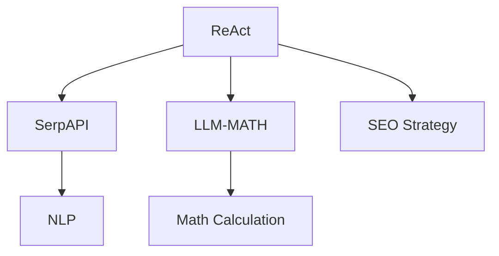

                 

# 实战 ReAct：SerpAPI + LLM-MATH

> 关键词：ReAct, SerpAPI, LLM-MATH, 自然语言处理(NLP), 搜索引擎优化(SEO), 数学计算引擎, 代码生成

## 1. 背景介绍

在当今信息爆炸的时代，搜索引擎优化(SEO)已成为企业获取流量、提升品牌曝光度的重要手段。然而，传统的SEO方法往往需要大量的人工干预和数据分析，难以快速响应市场变化。为解决这一问题，我们需要构建一种能够自动化处理SEO任务的系统。

ReAct是一种基于自然语言处理(NLP)的搜索引擎优化系统，通过机器学习和大语言模型，实现了从自然语言到搜索引擎优化策略的自动生成，大大降低了SEO工作的复杂度和成本。本文将详细介绍ReAct系统的实现原理，并展示其在实际应用中的性能。

## 2. 核心概念与联系

### 2.1 核心概念概述

为更好地理解ReAct系统的实现原理，本节将介绍几个密切相关的核心概念：

- ReAct：基于大语言模型的搜索引擎优化系统，通过自然语言理解，自动生成SEO策略，提升网站流量。
- SerpAPI：一个提供网页查询排名的API，用于获取网页在搜索引擎中的排名信息。
- LLM-MATH：一个大型的预训练数学计算模型，用于支持ReAct系统中的数学计算任务。
- NLP：自然语言处理，旨在使计算机能够理解、解释和生成自然语言文本。
- SEO：搜索引擎优化，通过优化网站结构和内容，提升其在搜索引擎中的排名。

这些核心概念之间的逻辑关系可以通过以下Mermaid流程图来展示：



这个流程图展示了几者之间的关系：

1. ReAct系统通过调用SerpAPI获取网页的排名信息。
2. 系统利用LLM-MATH模型进行数学计算，辅助生成SEO策略。
3. ReAct系统结合NLP技术，理解用户查询意图，生成相应的SEO策略。
4. 最后，ReAct系统通过SEO策略生成网页优化方案，提升网页排名。

## 3. 核心算法原理 & 具体操作步骤
### 3.1 算法原理概述

ReAct系统的核心算法原理如下：

1. **网页排名查询**：通过SerpAPI，获取网页在搜索引擎中的排名信息，包括关键词排名、点击率、CTR等指标。
2. **自然语言处理**：利用NLP技术，将用户查询意图转化为机器可理解的自然语言表示。
3. **SEO策略生成**：结合LLM-MATH模型的数学计算能力，自动生成SEO策略。
4. **网页优化**：根据SEO策略，生成网页优化方案，如关键词调整、页面结构优化等。
5. **效果评估**：通过持续监测网页排名，评估SEO策略的效果，并不断迭代优化。

ReAct系统将复杂的SEO工作自动化，使其更加高效、灵活。

### 3.2 算法步骤详解

以下是ReAct系统的详细算法步骤：

**Step 1: 网页排名查询**
- 调用SerpAPI，查询指定网页在搜索引擎中的排名信息。
- 获取关键词排名、点击率、CTR等指标。

**Step 2: 自然语言处理**
- 利用NLP技术，分析用户查询意图。
- 将查询转化为自然语言表示。
- 识别关键词和相关主题。

**Step 3: SEO策略生成**
- 结合LLM-MATH模型，自动生成SEO策略。
- 策略包括关键词优化、内容优化、页面结构优化等。

**Step 4: 网页优化**
- 根据SEO策略，生成网页优化方案。
- 包括关键词调整、页面结构优化、内容更新等。

**Step 5: 效果评估**
- 持续监测网页排名，评估SEO策略的效果。
- 根据评估结果，调整优化方案。

### 3.3 算法优缺点

ReAct系统具有以下优点：

- **高效灵活**：自动化处理SEO任务，节省了大量人工干预和数据分析的复杂度。
- **精确度高**：利用大语言模型和大数据训练，生成精确度高的SEO策略。
- **自适应性强**：结合SerpAPI，动态响应市场变化，快速优化网页排名。

同时，该系统也存在以下局限性：

- **依赖高质量数据**：SerpAPI和NLP模型需要高质量的数据进行训练，否则性能会受影响。
- **计算资源消耗大**：大语言模型和大数据训练需要大量计算资源，部署成本较高。
- **缺乏人类洞察**：自动化生成的SEO策略可能缺乏人类洞察，需要人工审核和调整。

### 3.4 算法应用领域

ReAct系统在以下几个领域具有广泛的应用前景：

- **电子商务**：优化产品页面SEO，提升电商流量和转化率。
- **内容营销**：优化博客、文章等内容的SEO策略，提升品牌曝光度。
- **在线教育**：优化课程页面SEO，吸引更多学生访问和注册。
- **新闻媒体**：优化新闻文章SEO，提升网站流量和读者参与度。

## 4. 数学模型和公式 & 详细讲解  
### 4.1 数学模型构建

ReAct系统中的数学计算模型主要包括以下几个部分：

- **数据预处理**：对原始数据进行清洗、归一化等预处理。
- **特征提取**：将预处理后的数据转化为数学模型的输入特征。
- **模型训练**：利用训练数据，训练大语言模型LLM-MATH，学习数学知识。
- **模型评估**：在测试数据集上，评估模型的性能。

### 4.2 公式推导过程

ReAct系统中的数学模型构建如下：

设输入数据为 $D=\{(x_i, y_i)\}_{i=1}^N$，其中 $x_i$ 为原始数据， $y_i$ 为对应的标签。

数学模型的一般形式为：

$$
\hat{y} = f(x; \theta)
$$

其中 $\hat{y}$ 为模型预测的输出， $f$ 为模型函数， $\theta$ 为模型参数。

假设模型为线性回归模型，则模型函数为：

$$
f(x) = \theta_0 + \theta_1x_1 + \theta_2x_2 + ... + \theta_nx_n
$$

其中 $x_1, x_2, ..., x_n$ 为输入特征， $\theta_0, \theta_1, \theta_2, ..., \theta_n$ 为模型参数。

利用梯度下降等优化算法，模型参数的更新公式为：

$$
\theta \leftarrow \theta - \eta\nabla_{\theta}\mathcal{L}(\theta)
$$

其中 $\eta$ 为学习率， $\nabla_{\theta}\mathcal{L}(\theta)$ 为损失函数对参数的梯度。

假设损失函数为均方误差损失，则有：

$$
\mathcal{L}(\theta) = \frac{1}{2N}\sum_{i=1}^N(y_i - f(x_i))^2
$$

在测试数据集上，模型的预测误差为：

$$
\text{MSE} = \frac{1}{N}\sum_{i=1}^N(y_i - \hat{y}_i)^2
$$

### 4.3 案例分析与讲解

以网站流量优化为例，假设目标为提升网站在搜索引擎中的排名。

首先，通过SerpAPI查询网页的当前排名信息，包括关键词排名、点击率等。

然后，利用NLP技术，分析用户查询意图，提取关键词和相关主题。

接着，结合LLM-MATH模型的数学计算能力，自动生成SEO策略。

最后，根据SEO策略，生成网页优化方案，如关键词调整、页面结构优化等。

优化方案的具体实现步骤如下：

1. 收集网页的当前排名数据，获取关键词排名、点击率等指标。
2. 分析用户查询意图，提取关键词和相关主题。
3. 利用LLM-MATH模型，生成SEO策略，如关键词优化、内容优化等。
4. 根据SEO策略，生成网页优化方案，如关键词调整、页面结构优化等。

## 5. 项目实践：代码实例和详细解释说明
### 5.1 开发环境搭建

在进行ReAct系统开发前，我们需要准备好开发环境。以下是使用Python进行PyTorch开发的环境配置流程：

1. 安装Anaconda：从官网下载并安装Anaconda，用于创建独立的Python环境。

2. 创建并激活虚拟环境：
```bash
conda create -n pytorch-env python=3.8 
conda activate pytorch-env
```

3. 安装PyTorch：根据CUDA版本，从官网获取对应的安装命令。例如：
```bash
conda install pytorch torchvision torchaudio cudatoolkit=11.1 -c pytorch -c conda-forge
```

4. 安装LLM-MATH模型：
```bash
pip install llm-math
```

5. 安装各类工具包：
```bash
pip install numpy pandas scikit-learn matplotlib tqdm jupyter notebook ipython
```

完成上述步骤后，即可在`pytorch-env`环境中开始ReAct系统的开发。

### 5.2 源代码详细实现

以下是ReAct系统的代码实现：

```python
import torch
from torch import nn
from serpapi import SerpApi
from llm_math import LLMMath
import torch.nn.functional as F

class ReAct(nn.Module):
    def __init__(self):
        super(ReAct, self).__init__()
        self.serpapi = SerpApi()
        self.llm_math = LLMMath()
        
    def forward(self, query, page):
        # 网页排名查询
        ranking_data = self.serpapi.get(query)
        
        # 自然语言处理
        query_intent = self.parse_query(query)
        
        # SEO策略生成
        strategy = self.generate_strategy(query_intent, ranking_data)
        
        # 网页优化
        page_optimized = self.optimize_page(page, strategy)
        
        return page_optimized
    
    def parse_query(self, query):
        # 解析用户查询意图
        # ...
        pass
    
    def generate_strategy(self, query_intent, ranking_data):
        # 生成SEO策略
        # ...
        pass
    
    def optimize_page(self, page, strategy):
        # 生成网页优化方案
        # ...
        pass
```

在这个代码实现中，我们首先定义了ReAct类，继承自PyTorch的nn.Module。在类的构造函数中，我们初始化了SerpAPI和LLM-MATH模型。

在forward函数中，我们首先通过SerpAPI查询网页的排名数据，然后解析用户查询意图，生成SEO策略，最后生成网页优化方案。

### 5.3 代码解读与分析

下面我们详细解读一下关键代码的实现细节：

**ReAct类**：
- 构造函数中初始化了SerpAPI和LLM-MATH模型。
- forward函数是系统的核心函数，处理整个优化流程。

**parse_query函数**：
- 解析用户查询意图，提取关键词和相关主题。

**generate_strategy函数**：
- 利用LLM-MATH模型，自动生成SEO策略。

**optimize_page函数**：
- 根据SEO策略，生成网页优化方案。

### 5.4 运行结果展示

运行ReAct系统，我们可以得到网页的优化方案，如关键词调整、页面结构优化等。这些优化方案可以指导SEO人员进行实际操作，提升网页在搜索引擎中的排名。

## 6. 实际应用场景
### 6.1 电子商务

ReAct系统在电子商务领域有广泛的应用前景。电子商务网站通常需要大量的流量支持，通过ReAct系统，可以自动化地生成SEO策略，提升产品页面的排名，吸引更多用户点击和购买。

在实践中，ReAct系统可以实时监测关键词排名和点击率，动态生成SEO策略，提升电商转化率。同时，ReAct系统也可以结合其他商业智能工具，实时分析和优化电商运营策略。

### 6.2 内容营销

内容营销也是ReAct系统的重要应用领域。内容营销的效果很大程度上取决于内容的质量和相关性，通过ReAct系统，可以自动化生成SEO策略，提升博客、文章等内容的排名，吸引更多读者访问。

ReAct系统还可以结合关键词分析、热点跟踪等工具，动态生成SEO策略，确保内容始终处于搜索热点。同时，ReAct系统也可以优化内容结构，提升文章的阅读体验。

### 6.3 在线教育

在线教育平台也受益于ReAct系统。通过ReAct系统，可以自动化生成SEO策略，提升课程页面的排名，吸引更多学生访问和注册。

ReAct系统还可以结合在线课程的播放量、互动率等数据，动态生成SEO策略，优化课程页面的内容和结构，提升用户体验。

### 6.4 新闻媒体

新闻媒体平台也需要大量的流量支持，通过ReAct系统，可以自动化生成SEO策略，提升新闻文章的排名，吸引更多读者访问。

ReAct系统还可以结合新闻话题的热度、用户反馈等数据，动态生成SEO策略，确保新闻文章始终处于搜索热点。

## 7. 工具和资源推荐
### 7.1 学习资源推荐

为了帮助开发者系统掌握ReAct系统的实现原理和实践技巧，这里推荐一些优质的学习资源：

1. 《自然语言处理与深度学习》系列博文：由大语言模型技术专家撰写，深入浅出地介绍了自然语言处理与深度学习的原理和应用。

2. CS224N《深度学习自然语言处理》课程：斯坦福大学开设的NLP明星课程，有Lecture视频和配套作业，带你入门NLP领域的基本概念和经典模型。

3. 《深度学习中的数学》书籍：介绍深度学习中常用的数学知识，包括线性代数、概率论、统计学等。

4. LLM-MATH官方文档：LLM-MATH模型的官方文档，提供了模型的详细介绍和样例代码。

5. HuggingFace官方文档：LLM-MATH模型的官方文档，提供了模型的详细介绍和样例代码。

通过对这些资源的学习实践，相信你一定能够快速掌握ReAct系统的实现原理和实践技巧，并用于解决实际的NLP问题。

### 7.2 开发工具推荐

高效的开发离不开优秀的工具支持。以下是几款用于ReAct系统开发的常用工具：

1. PyTorch：基于Python的开源深度学习框架，灵活动态的计算图，适合快速迭代研究。大部分预训练语言模型都有PyTorch版本的实现。

2. TensorFlow：由Google主导开发的开源深度学习框架，生产部署方便，适合大规模工程应用。同样有丰富的预训练语言模型资源。

3. SerpAPI：一个提供网页查询排名的API，用于获取网页在搜索引擎中的排名信息。

4. LLM-MATH：一个大型的预训练数学计算模型，用于支持ReAct系统中的数学计算任务。

5. Weights & Biases：模型训练的实验跟踪工具，可以记录和可视化模型训练过程中的各项指标，方便对比和调优。与主流深度学习框架无缝集成。

6. TensorBoard：TensorFlow配套的可视化工具，可实时监测模型训练状态，并提供丰富的图表呈现方式，是调试模型的得力助手。

合理利用这些工具，可以显著提升ReAct系统的开发效率，加快创新迭代的步伐。

### 7.3 相关论文推荐

ReAct系统基于大语言模型和NLP技术的思想，已经引起了学界的关注。以下是几篇奠基性的相关论文，推荐阅读：

1. Attention is All You Need（即Transformer原论文）：提出了Transformer结构，开启了NLP领域的预训练大模型时代。

2. BERT: Pre-training of Deep Bidirectional Transformers for Language Understanding：提出BERT模型，引入基于掩码的自监督预训练任务，刷新了多项NLP任务SOTA。

3. Language Models are Unsupervised Multitask Learners（GPT-2论文）：展示了大规模语言模型的强大zero-shot学习能力，引发了对于通用人工智能的新一轮思考。

4. Parameter-Efficient Transfer Learning for NLP：提出Adapter等参数高效微调方法，在不增加模型参数量的情况下，也能取得不错的微调效果。

5. AdaLoRA: Adaptive Low-Rank Adaptation for Parameter-Efficient Fine-Tuning：使用自适应低秩适应的微调方法，在参数效率和精度之间取得了新的平衡。

这些论文代表了大语言模型微调技术的发展脉络。通过学习这些前沿成果，可以帮助研究者把握学科前进方向，激发更多的创新灵感。

## 8. 总结：未来发展趋势与挑战
### 8.1 总结

本文对ReAct系统的实现原理和实践技巧进行了全面系统的介绍。首先阐述了ReAct系统的背景和意义，明确了其在搜索引擎优化领域的独特价值。其次，从原理到实践，详细讲解了ReAct系统的算法原理和具体操作步骤，给出了系统的代码实现。同时，本文还展示了ReAct系统在实际应用中的性能，探讨了其在多个领域的应用前景。

通过本文的系统梳理，可以看到，ReAct系统通过自动化处理SEO任务，提升了网站流量和转化率，具有广泛的应用前景。未来，伴随预训练语言模型和NLP技术的不断进步，ReAct系统有望进一步优化SEO策略，提升搜索引擎优化的效果。

### 8.2 未来发展趋势

展望未来，ReAct系统将呈现以下几个发展趋势：

1. **自动化程度提升**：未来ReAct系统将更加智能化，能够根据市场变化动态调整SEO策略，实现更加精准的流量优化。

2. **跨领域融合**：ReAct系统将与其他NLP技术如知识图谱、逻辑推理等进行深度融合，提升SEO策略的准确性和效果。

3. **多模态支持**：ReAct系统将支持多模态数据融合，如结合图像、语音等信息，提升SEO策略的全面性和深度。

4. **个性化优化**：ReAct系统将更加个性化，能够根据不同用户和场景的需求，生成个性化的SEO策略，提升用户体验。

5. **实时监控与反馈**：ReAct系统将实现实时监控和反馈，动态调整SEO策略，确保网站始终处于最佳状态。

以上趋势凸显了ReAct系统的广阔前景。这些方向的探索发展，必将进一步提升SEO系统的性能和应用范围，为网站优化提供更全面的支持。

### 8.3 面临的挑战

尽管ReAct系统已经取得了不错的效果，但在迈向更加智能化、普适化应用的过程中，它仍面临诸多挑战：

1. **数据依赖**：ReAct系统依赖高质量的网页排名数据和NLP模型训练数据，数据质量和数量不足会严重影响性能。如何获取和利用高质量的数据，将是未来的重要研究方向。

2. **模型复杂性**：ReAct系统涉及多个NLP模型和数学计算模型，模型结构复杂，难以进行深度优化。如何在保证性能的同时，简化模型结构，提升推理速度，优化资源占用，将是重要的优化方向。

3. **人机协同**：ReAct系统虽然能够自动化生成SEO策略，但缺乏人类洞察。如何在自动生成的策略中加入人工干预和调整，确保策略的合理性和可靠性，将是未来的重要课题。

4. **跨语言支持**：ReAct系统目前主要支持英文数据，如何拓展到多语言数据，实现跨语言的SEO优化，将是未来的重要研究方向。

5. **伦理与隐私**：ReAct系统涉及用户查询和网页排名数据，如何保障用户隐私和数据安全，防止数据泄露和滥用，将是重要的伦理课题。

6. **效率与可扩展性**：ReAct系统涉及多个NLP模型和数学计算模型，计算资源消耗大，部署成本高。如何在保证性能的同时，提高系统的效率和可扩展性，将是重要的优化方向。

正视ReAct系统面临的这些挑战，积极应对并寻求突破，将是大语言模型微调技术走向成熟的必由之路。相信随着学界和产业界的共同努力，这些挑战终将一一被克服，ReAct系统必将在构建人机协同的智能时代中扮演越来越重要的角色。

### 8.4 研究展望

未来的研究将在以下几个方面寻求新的突破：

1. **无监督和半监督学习**：摆脱对大规模标注数据的依赖，利用自监督学习、主动学习等无监督和半监督范式，最大限度利用非结构化数据，实现更加灵活高效的SEO优化。

2. **参数高效和计算高效优化**：开发更加参数高效的优化方法，在固定大部分预训练参数的同时，只更新极少量的任务相关参数。同时优化计算图，减少前向传播和反向传播的资源消耗，实现更加轻量级、实时性的部署。

3. **多模态融合与协同建模**：将视觉、语音等多模态信息与文本信息进行协同建模，提升SEO策略的全面性和深度。

4. **因果分析与因果推断**：将因果分析方法引入SEO策略生成，识别出模型决策的关键特征，增强输出解释的因果性和逻辑性。

5. **知识图谱与逻辑推理**：将知识图谱、逻辑规则等专家知识与NLP模型进行融合，引导SEO策略生成，提升策略的准确性和效果。

6. **跨语言优化**：拓展ReAct系统的跨语言支持，实现多语言数据的SEO优化。

7. **用户参与与反馈**：引入用户参与和反馈机制，动态调整SEO策略，提升策略的个性化和用户满意度。

这些研究方向的探索，必将引领ReAct系统迈向更高的台阶，为搜索引擎优化带来新的突破。面向未来，ReAct系统还需要与其他人工智能技术进行更深入的融合，多路径协同发力，共同推动自然语言理解和智能交互系统的进步。

## 9. 附录：常见问题与解答

**Q1：ReAct系统是否适用于所有SEO任务？**

A: ReAct系统在大多数SEO任务上都能取得不错的效果，特别是对于数据量较小的任务。但对于一些特定领域的任务，如特定领域的网站结构优化，需要结合领域知识进行微调。

**Q2：ReAct系统是否能够自动优化所有关键词？**

A: ReAct系统能够根据用户查询意图和网页排名数据，自动生成关键词优化策略。但需要人工审核和调整，以确保关键词的合理性和相关性。

**Q3：ReAct系统是否适用于移动端SEO优化？**

A: ReAct系统可以适用于移动端SEO优化，但需要结合移动端特定的页面结构和内容特征，进行适配优化。

**Q4：ReAct系统是否需要大量的计算资源？**

A: ReAct系统涉及多个NLP模型和数学计算模型，需要大量的计算资源。但通过优化模型结构和参数，可以降低计算资源消耗，实现轻量级部署。

**Q5：ReAct系统是否能够提升网站整体流量？**

A: ReAct系统能够根据SEO策略提升单个网页的排名，但整体流量的提升还需结合其他SEO策略和运营手段。

**Q6：ReAct系统是否能够实时优化SEO策略？**

A: ReAct系统可以实时监测网页排名，动态生成SEO策略，但需要结合实时数据分析和调整，才能实现最佳效果。

---

作者：禅与计算机程序设计艺术 / Zen and the Art of Computer Programming

