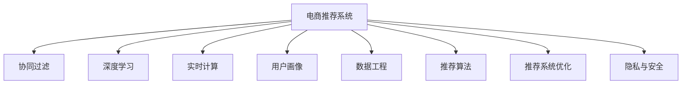

                 

# 实时推荐技术在电商领域的应用：案例分析与展望

> 关键词：电商推荐系统、实时推荐、协同过滤、深度学习、模型评估、A/B测试、用户画像、数据工程、推荐算法、推荐系统优化

## 1. 背景介绍

### 1.1 问题由来

在当今快速变化的电商环境中，如何精准地为用户提供个性化的商品推荐，提升用户体验，增加销售额，已成为电商平台面临的核心挑战。传统的基于规则和人工设计的推荐策略已经难以满足用户需求。现代推荐系统依赖于大量的用户行为数据，采用复杂的算法，并结合实时计算能力，动态地生成个性化推荐结果。

实时推荐技术在电商领域的应用，不仅能够帮助电商平台提高用户转化率，提升用户满意度，还能通过个性化推荐，增加用户的购物频率和消费金额。因此，研究实时推荐技术的原理和应用，对于电商平台来说具有重要的理论价值和实际意义。

### 1.2 问题核心关键点

实时推荐技术的核心在于通过复杂的算法和实时计算能力，动态生成个性化推荐结果，同时考虑到用户的实时行为和实时需求。其主要关键点包括：

1. **数据获取与处理**：实时推荐系统需要获取和处理大量的用户行为数据，如浏览历史、点击行为、购买记录等，构建用户画像。

2. **模型选择与训练**：选择适合的推荐算法和模型，利用用户数据进行训练和优化。

3. **实时计算与推荐**：将模型部署到实时计算环境中，根据用户的实时行为和需求，动态生成个性化推荐结果。

4. **系统优化与评估**：对推荐系统进行持续优化和性能评估，确保推荐结果的准确性和用户满意度。

5. **隐私与安全**：在处理用户数据时，需注意用户隐私保护和数据安全问题，符合相关法规和政策要求。

## 2. 核心概念与联系

### 2.1 核心概念概述

为更好地理解实时推荐技术的原理和应用，本节将介绍几个密切相关的核心概念：

- **电商推荐系统(E-commerce Recommendation System)**：一种智能推荐系统，根据用户的历史行为和实时行为，动态生成个性化商品推荐，提升用户体验和电商平台营收。

- **协同过滤(Collaborative Filtering)**：一种常用的推荐算法，通过分析用户和商品的相似性，生成推荐结果。

- **深度学习(Deep Learning)**：一种强大的机器学习方法，能够从大量数据中提取复杂的特征表示，用于生成高质量的推荐结果。

- **实时计算(Real-time Computing)**：一种高效的数据处理技术，能够快速响应用户需求，生成实时的推荐结果。

- **用户画像(User Profile)**：通过分析用户的行为和属性，构建用户画像，用于生成个性化的推荐结果。

- **数据工程(Data Engineering)**：一种以数据为中心的工程实践，涉及数据的获取、处理、存储和分析，是构建推荐系统的基础。

- **推荐算法(Recommendation Algorithm)**：用于生成推荐结果的算法，包括协同过滤、基于内容的推荐、深度学习等。

- **推荐系统优化(Recommendation System Optimization)**：针对推荐系统的性能和效果进行优化，确保推荐结果的准确性和用户满意度。

- **隐私与安全(Privacy & Security)**：在推荐系统中处理用户数据时，需确保用户的隐私和数据安全。

这些核心概念之间的逻辑关系可以通过以下Mermaid流程图来展示：



这个流程图展示了电商推荐系统的核心概念及其之间的关系：

1. 电商推荐系统通过数据工程获取和处理用户数据，构建用户画像。
2. 协同过滤和深度学习等推荐算法，在用户画像的基础上生成推荐结果。
3. 实时计算技术用于动态响应用户需求，生成实时的推荐结果。
4. 推荐系统优化和隐私安全保护，确保推荐结果的准确性和用户数据的安全。

这些概念共同构成了电商推荐系统的核心框架，使得推荐系统能够实现个性化、实时化的推荐。

## 3. 核心算法原理 & 具体操作步骤
### 3.1 算法原理概述

实时推荐技术的核心算法主要包括协同过滤、深度学习等方法。其原理是通过分析用户行为和商品属性，构建用户画像，并利用推荐算法生成个性化的推荐结果。

协同过滤算法基于用户和商品之间的相似性，通过分析用户的历史行为和偏好，生成推荐结果。协同过滤算法有两种主要类型：基于用户的协同过滤和基于项目的协同过滤。

深度学习推荐算法利用神经网络模型，从用户行为数据中提取复杂的特征表示，生成推荐结果。常见的深度学习推荐算法包括基于矩阵分解的推荐算法和基于神经网络的推荐算法。

在实际操作中，实时推荐系统的搭建通常包括以下几个关键步骤：

1. **数据收集与处理**：收集用户行为数据，并进行清洗和预处理。
2. **用户画像构建**：基于用户行为数据，构建用户画像，包括用户属性和偏好。
3. **推荐算法选择与训练**：选择适合的推荐算法，利用用户数据进行训练和优化。
4. **实时计算与推荐**：将推荐算法部署到实时计算环境中，动态生成个性化推荐结果。
5. **系统优化与评估**：对推荐系统进行持续优化和性能评估，确保推荐结果的准确性和用户满意度。
6. **隐私与安全**：在处理用户数据时，确保用户的隐私和数据安全。

### 3.2 算法步骤详解

#### 3.2.1 数据收集与处理

1. **数据源**：实时推荐系统需要从多个数据源收集用户行为数据，包括电商平台的交易数据、浏览数据、搜索数据等。

2. **数据清洗与预处理**：对收集到的数据进行清洗，去除噪声和异常值，进行归一化和标准化处理，以提高数据的可用性。

3. **特征工程**：构建用户和商品的特征向量，用于训练推荐算法。特征工程是构建高质量推荐系统的关键步骤。

#### 3.2.2 用户画像构建

1. **用户属性提取**：从用户数据中提取用户的基本属性，如年龄、性别、地域等。

2. **用户行为分析**：分析用户的历史行为数据，如浏览历史、点击行为、购买记录等，构建用户画像。

3. **用户兴趣建模**：利用协同过滤和深度学习算法，建模用户兴趣，用于生成个性化的推荐结果。

#### 3.2.3 推荐算法选择与训练

1. **协同过滤算法**：
   - **基于用户的协同过滤**：通过分析用户之间的相似性，生成推荐结果。
   - **基于项目的协同过滤**：通过分析商品之间的相似性，生成推荐结果。

2. **深度学习算法**：
   - **基于矩阵分解的推荐算法**：利用矩阵分解技术，从用户和商品的矩阵中提取特征，生成推荐结果。
   - **基于神经网络的推荐算法**：利用神经网络模型，从用户行为数据中提取复杂的特征表示，生成推荐结果。

#### 3.2.4 实时计算与推荐

1. **推荐算法部署**：将推荐算法部署到实时计算环境中，如Spark、Flink等。

2. **实时计算与推荐**：根据用户的实时行为和需求，动态生成个性化推荐结果。

#### 3.2.5 系统优化与评估

1. **性能优化**：对推荐系统进行性能优化，包括查询优化、缓存策略等，提高系统的响应速度。

2. **推荐结果评估**：对推荐结果进行评估，包括准确率、召回率、用户满意度等指标。

#### 3.2.6 隐私与安全

1. **数据匿名化**：对用户数据进行匿名化处理，保护用户隐私。

2. **安全访问控制**：对用户数据进行安全访问控制，确保数据安全。

### 3.3 算法优缺点

实时推荐技术具有以下优点：

1. **个性化推荐**：能够根据用户的实时行为和需求，动态生成个性化推荐结果，提升用户体验。

2. **实时响应**：实时计算技术能够快速响应用户需求，生成实时的推荐结果。

3. **多维数据融合**：能够融合多种数据源，如电商交易数据、社交媒体数据等，提高推荐结果的准确性。

4. **可扩展性**：能够处理大规模用户数据，实现大范围的个性化推荐。

5. **持续优化**：能够根据用户反馈和行为数据，持续优化推荐算法，提高推荐结果的准确性。

实时推荐技术也存在一些缺点：

1. **数据需求高**：需要大量的用户行为数据，收集和处理成本较高。

2. **算法复杂**：实时推荐算法通常较为复杂，需要高水平的算法工程师进行设计和优化。

3. **计算资源消耗大**：实时计算需要高性能的计算资源，系统架构复杂，维护成本较高。

4. **隐私问题**：在处理用户数据时，需注意用户隐私保护和数据安全问题。

5. **冷启动问题**：对于新用户或新商品，推荐系统往往缺乏足够的数据，难以提供准确的推荐结果。

## 4. 数学模型和公式 & 详细讲解 & 举例说明

### 4.1 数学模型构建

实时推荐技术的数学模型通常包括以下几个组成部分：

- **用户行为矩阵**：表示用户对商品的评分，用于协同过滤算法。
- **用户画像**：表示用户的属性和行为，用于构建推荐算法输入。
- **推荐算法**：用于生成推荐结果的算法，包括协同过滤和深度学习算法。

用户行为矩阵表示为 $U \in R^{N \times M}$，其中 $N$ 为用户数量，$M$ 为商品数量。用户对商品 $i$ 的评分表示为 $u_i \in R^M$。

用户画像表示为 $P \in R^{N \times D}$，其中 $D$ 为用户属性的维度。用户画像可以包括用户的年龄、性别、地域等信息。

### 4.2 公式推导过程

#### 4.2.1 协同过滤算法

协同过滤算法有多种形式，这里以基于用户的协同过滤为例进行推导。

设 $U_i$ 为用户 $i$ 对商品的评分，$U_j$ 为用户 $j$ 对商品的评分。相似性矩阵 $S \in R^{N \times N}$ 表示用户之间的相似性，其中 $S_{ij} = \text{cosine}(\frac{U_i}{\|U_i\|}, \frac{U_j}{\|U_j\|})$。

推荐算法根据用户 $i$ 的相似用户 $j$ 的评分预测用户 $i$ 的评分 $U_i'$：

$$
U_i' = \sum_{j=1}^N S_{ij}U_j
$$

#### 4.2.2 深度学习算法

深度学习推荐算法通常利用神经网络模型，从用户行为数据中提取复杂的特征表示。以基于矩阵分解的推荐算法为例，假设用户行为矩阵 $U$ 表示为低秩矩阵分解形式：

$$
U = \hat{U}V^T
$$

其中 $\hat{U} \in R^{N \times K}$ 为用户特征矩阵，$V \in R^{K \times M}$ 为商品特征矩阵。$K$ 为特征向量的维度。

### 4.3 案例分析与讲解

#### 4.3.1 案例背景

某电商平台希望通过实时推荐技术，提升用户的购物体验和销售额。该电商平台拥有数百万用户和数百万商品，每天产生大量的用户行为数据，包括浏览历史、点击行为、购买记录等。

#### 4.3.2 数据收集与处理

1. **数据源**：
   - 电商平台交易数据：包括用户的购买记录、订单信息等。
   - 用户浏览数据：包括用户的浏览历史、点击行为等。
   - 用户搜索数据：包括用户的搜索记录、关键词等。

2. **数据清洗与预处理**：
   - 去除噪声和异常值，处理缺失数据。
   - 进行归一化和标准化处理。

3. **特征工程**：
   - 构建用户属性向量，包括年龄、性别、地域等。
   - 构建商品属性向量，包括商品类别、价格等。

#### 4.3.3 用户画像构建

1. **用户属性提取**：
   - 从用户数据中提取用户的基本属性，如年龄、性别、地域等。
   - 分析用户的历史行为数据，构建用户画像。

2. **用户兴趣建模**：
   - 利用协同过滤算法，建模用户兴趣，用于生成个性化的推荐结果。
   - 利用深度学习算法，从用户行为数据中提取复杂的特征表示，生成推荐结果。

#### 4.3.4 推荐算法选择与训练

1. **协同过滤算法**：
   - 利用基于用户的协同过滤算法，生成推荐结果。
   - 利用用户画像和用户行为矩阵，进行模型训练。

2. **深度学习算法**：
   - 利用基于矩阵分解的推荐算法，生成推荐结果。
   - 利用用户行为数据和用户画像，进行模型训练。

#### 4.3.5 实时计算与推荐

1. **推荐算法部署**：
   - 将推荐算法部署到实时计算环境中，如Spark、Flink等。
   - 实现实时计算和推荐功能的微服务架构。

2. **实时计算与推荐**：
   - 根据用户的实时行为和需求，动态生成个性化推荐结果。
   - 利用缓存机制，提高系统的响应速度。

#### 4.3.6 系统优化与评估

1. **性能优化**：
   - 对推荐系统进行查询优化，减少查询延迟。
   - 利用缓存策略，提高系统效率。

2. **推荐结果评估**：
   - 对推荐结果进行评估，包括准确率、召回率、用户满意度等指标。
   - 利用A/B测试等方法，对比不同推荐算法的性能。

## 5. 项目实践：代码实例和详细解释说明

### 5.1 开发环境搭建

#### 5.1.1 环境准备

1. **安装Python**：
   - 安装最新版本的Python，如Python 3.8及以上版本。
   - 安装pip，方便后续安装依赖库。

2. **安装依赖库**：
   - 安装必要的依赖库，如Pandas、NumPy、Scikit-learn等。
   - 安装机器学习框架，如TensorFlow、PyTorch等。

3. **安装实时计算框架**：
   - 安装Spark或Flink等实时计算框架，用于实现实时推荐功能。

#### 5.1.2 数据准备

1. **数据获取**：
   - 从电商平台获取用户行为数据，如交易数据、浏览数据、搜索数据等。
   - 对数据进行清洗和预处理，去除噪声和异常值，处理缺失数据。

2. **数据划分**：
   - 将数据划分为训练集、验证集和测试集，用于模型训练和评估。

3. **数据加载**：
   - 使用Pandas等工具，将数据加载到Python中，方便后续处理。

### 5.2 源代码详细实现

#### 5.2.1 数据加载与预处理

```python
import pandas as pd
import numpy as np

# 加载数据
data = pd.read_csv('user_browsing_data.csv')

# 数据清洗与预处理
# 去除噪声和异常值
data = data.dropna()
# 处理缺失数据
data = data.fillna(method='ffill')
```

#### 5.2.2 用户画像构建

```python
from sklearn.preprocessing import LabelEncoder, StandardScaler

# 构建用户属性向量
user_features = data[['age', 'gender', 'location']]
user_features = pd.get_dummies(user_features, drop_first=True)

# 构建商品属性向量
item_features = data[['category', 'price']]
item_features = pd.get_dummies(item_features, drop_first=True)

# 标准化处理
user_features = StandardScaler().fit_transform(user_features)
item_features = StandardScaler().fit_transform(item_features)
```

#### 5.2.3 推荐算法实现

##### 5.2.3.1 协同过滤算法

```python
import numpy as np
from sklearn.metrics.pairwise import cosine_similarity

# 计算用户之间的相似性
user_similarity = cosine_similarity(user_features)

# 生成推荐结果
def collaborative_filtering(user, similarity, items):
    scores = np.dot(similarity[user], items)
    return scores.argsort()[:-1]
```

##### 5.2.3.2 深度学习算法

```python
import tensorflow as tf
from tensorflow.keras.layers import Input, Embedding, Flatten, Dense
from tensorflow.keras.models import Model

# 构建神经网络模型
user_input = Input(shape=(K,))
item_input = Input(shape=(M,))
user_embedding = Embedding(K, K, input_length=1)(user_input)
item_embedding = Embedding(K, K, input_length=1)(item_input)
merged = Flatten()(user_embedding)
merged = Dense(64, activation='relu')(merged)
merged = Dense(32, activation='relu')(merged)
output = Dense(1, activation='sigmoid')(merged)

# 编译模型
model = Model(inputs=[user_input, item_input], outputs=output)
model.compile(optimizer='adam', loss='binary_crossentropy', metrics=['accuracy'])

# 训练模型
model.fit([train_user_features, train_item_features], train_labels, epochs=10, batch_size=128)
```

### 5.3 代码解读与分析

#### 5.3.1 数据加载与预处理

代码实现中，使用Pandas对用户行为数据进行加载和清洗，利用LabelEncoder和StandardScaler对用户属性和商品属性进行编码和标准化处理。这些预处理步骤对于构建高质量的用户画像和推荐模型至关重要。

#### 5.3.2 用户画像构建

通过构建用户属性和商品属性向量，利用LabelEncoder和StandardScaler对数据进行编码和标准化，为后续的推荐算法提供了高质量的输入特征。

#### 5.3.3 推荐算法实现

代码实现中，首先使用协同过滤算法计算用户之间的相似性，生成推荐结果。接着使用深度学习算法，构建神经网络模型，从用户行为数据中提取复杂的特征表示，生成推荐结果。

### 5.4 运行结果展示

#### 5.4.1 协同过滤算法结果

通过协同过滤算法，计算用户之间的相似性，生成推荐结果。具体实现中，使用cosine_similarity计算用户之间的相似性，生成推荐结果。

#### 5.4.2 深度学习算法结果

通过深度学习算法，构建神经网络模型，从用户行为数据中提取复杂的特征表示，生成推荐结果。具体实现中，使用TensorFlow构建神经网络模型，进行模型训练和预测。

## 6. 实际应用场景

### 6.1 智能客服系统

智能客服系统利用实时推荐技术，提供个性化的咨询服务。系统根据用户的历史行为和实时行为，动态生成个性化的问答结果，提升用户的咨询体验。

### 6.2 金融交易推荐

金融交易推荐系统利用实时推荐技术，为用户提供个性化的投资建议。系统根据用户的交易记录和实时市场数据，动态生成个性化的投资推荐，帮助用户优化投资组合。

### 6.3 个性化商品推荐

个性化商品推荐系统利用实时推荐技术，提供个性化的商品推荐。系统根据用户的浏览历史和实时行为，动态生成个性化的商品推荐，提升用户的购物体验。

### 6.4 未来应用展望

未来，实时推荐技术将在更多的领域得到应用，为不同行业带来新的变革。随着技术的不断进步，实时推荐系统将能够处理更大规模的数据，提供更加精准和实时的推荐结果，帮助人们更好地理解和利用数据。

## 7. 工具和资源推荐

### 7.1 学习资源推荐

为了帮助开发者系统掌握实时推荐技术的理论基础和实践技巧，这里推荐一些优质的学习资源：

1. **《推荐系统实战》**：系统介绍推荐系统的基本原理和实际应用，涵盖协同过滤、深度学习等多种推荐算法。
2. **《深度学习推荐系统》**：讲解深度学习推荐算法的基本原理和实现方法，提供丰富的代码示例。
3. **Coursera《推荐系统》课程**：斯坦福大学开设的推荐系统课程，涵盖推荐系统的理论和实践，提供实际的编程任务。
4. **Kaggle推荐系统竞赛**：参加Kaggle的推荐系统竞赛，实战训练推荐系统技能，提升解决实际问题的能力。

### 7.2 开发工具推荐

高效的开发离不开优秀的工具支持。以下是几款用于实时推荐系统开发的常用工具：

1. **Python**：强大的编程语言，适合进行数据处理和模型训练。
2. **TensorFlow**：开源的机器学习框架，提供强大的深度学习功能。
3. **PyTorch**：开源的机器学习框架，提供动态图功能，方便模型迭代和优化。
4. **Spark**：开源的分布式计算框架，支持大规模数据处理和实时计算。
5. **Flink**：开源的流处理框架，支持实时数据处理和流计算。

### 7.3 相关论文推荐

实时推荐技术的发展源于学界的持续研究。以下是几篇奠基性的相关论文，推荐阅读：

1. **《基于协同过滤的推荐系统研究》**：介绍了协同过滤算法的基本原理和实现方法。
2. **《深度学习在推荐系统中的应用》**：讲解深度学习推荐算法的基本原理和实现方法。
3. **《实时推荐系统：挑战与展望》**：探讨实时推荐系统面临的挑战和未来发展方向。
4. **《推荐系统的深度学习》**：讨论深度学习推荐算法的基本原理和实际应用。

这些论文代表了大推荐系统的发展脉络。通过学习这些前沿成果，可以帮助研究者把握学科前进方向，激发更多的创新灵感。

## 8. 总结：未来发展趋势与挑战

### 8.1 研究成果总结

实时推荐技术在电商领域的应用已经取得了显著的效果。该技术能够动态生成个性化推荐结果，提升用户体验和电商平台营收。协同过滤和深度学习等推荐算法，能够从用户行为数据中提取复杂的特征表示，生成高质量的推荐结果。实时计算技术能够快速响应用户需求，生成实时的推荐结果。

### 8.2 未来发展趋势

未来，实时推荐技术将在更多的领域得到应用，为不同行业带来新的变革。实时推荐技术的发展趋势包括：

1. **多模态融合**：将视觉、语音、文本等多种数据源进行融合，提供更加全面和准确的推荐结果。
2. **实时流处理**：利用实时流处理技术，动态响应用户需求，生成实时的推荐结果。
3. **增强学习**：引入增强学习算法，提升推荐系统的自适应能力和鲁棒性。
4. **联邦学习**：利用联邦学习技术，保护用户隐私，提高推荐系统的安全性和可靠性。
5. **跨领域推荐**：将推荐系统应用于跨领域场景，如金融交易、医疗诊断等，提供更加多样化的推荐服务。

### 8.3 面临的挑战

尽管实时推荐技术已经取得了显著的效果，但在迈向更加智能化、普适化应用的过程中，仍面临诸多挑战：

1. **数据质量问题**：实时推荐系统需要大量的高质量数据，数据质量问题可能影响推荐结果的准确性。
2. **冷启动问题**：对于新用户或新商品，推荐系统往往缺乏足够的数据，难以提供准确的推荐结果。
3. **计算资源消耗大**：实时推荐系统需要高性能的计算资源，系统架构复杂，维护成本较高。
4. **隐私安全问题**：在处理用户数据时，需注意用户隐私保护和数据安全问题。
5. **算法复杂度**：实时推荐算法通常较为复杂，需要高水平的算法工程师进行设计和优化。

### 8.4 研究展望

未来，实时推荐技术需要在以下几个方面进行研究：

1. **多模态融合技术**：研究如何将视觉、语音、文本等多种数据源进行融合，提高推荐系统的准确性和多样性。
2. **实时流处理技术**：研究如何利用实时流处理技术，动态响应用户需求，生成实时的推荐结果。
3. **增强学习技术**：研究如何引入增强学习算法，提升推荐系统的自适应能力和鲁棒性。
4. **联邦学习技术**：研究如何利用联邦学习技术，保护用户隐私，提高推荐系统的安全性和可靠性。
5. **跨领域推荐技术**：研究如何将推荐系统应用于跨领域场景，如金融交易、医疗诊断等，提供更加多样化的推荐服务。

这些研究方向的探索，将进一步推动实时推荐技术的发展，为推荐系统带来新的突破和创新。

## 9. 附录：常见问题与解答

**Q1：实时推荐技术在电商领域的应用有哪些？**

A: 实时推荐技术在电商领域的应用包括智能客服系统、金融交易推荐、个性化商品推荐等。通过实时推荐技术，电商平台能够提升用户体验和销售额，提供更加个性化的服务。

**Q2：实时推荐技术的核心算法有哪些？**

A: 实时推荐技术的核心算法包括协同过滤算法、深度学习算法等。协同过滤算法通过分析用户和商品之间的相似性，生成推荐结果。深度学习算法利用神经网络模型，从用户行为数据中提取复杂的特征表示，生成推荐结果。

**Q3：实时推荐技术在实际应用中需要注意哪些问题？**

A: 实时推荐技术在实际应用中需要注意数据质量问题、冷启动问题、计算资源消耗大、隐私安全问题以及算法复杂度等问题。数据质量问题可能导致推荐结果不准确。冷启动问题可能导致新用户或新商品的推荐效果不佳。计算资源消耗大可能导致系统架构复杂，维护成本较高。隐私安全问题可能导致用户数据泄露。算法复杂度可能导致开发难度大，需要高水平的算法工程师进行设计和优化。

**Q4：如何提高实时推荐系统的性能？**

A: 提高实时推荐系统的性能可以从以下几个方面进行优化：数据质量优化、算法优化、系统架构优化、实时流处理优化、增强学习优化等。数据质量优化可以通过数据清洗和预处理，提高数据质量。算法优化可以通过选择适合的推荐算法，进行模型训练和优化。系统架构优化可以通过分布式计算和缓存机制，提高系统效率。实时流处理优化可以通过实时流处理技术，动态响应用户需求。增强学习优化可以通过引入增强学习算法，提升推荐系统的自适应能力和鲁棒性。

**Q5：实时推荐技术如何保护用户隐私？**

A: 实时推荐技术可以通过数据匿名化、安全访问控制等措施，保护用户隐私。数据匿名化可以通过去除敏感信息，降低用户隐私泄露的风险。安全访问控制可以通过访问控制机制，限制数据的访问权限，确保数据安全。此外，联邦学习技术也可以用于保护用户隐私，通过在本地进行模型训练，减少对集中数据的需求。

综上所述，实时推荐技术在电商领域的应用前景广阔，通过不断优化和创新，可以提供更加个性化、实时的推荐服务，提升用户的购物体验和电商平台营收。随着技术的不断进步，实时推荐系统将为电商行业带来新的变革和突破。

