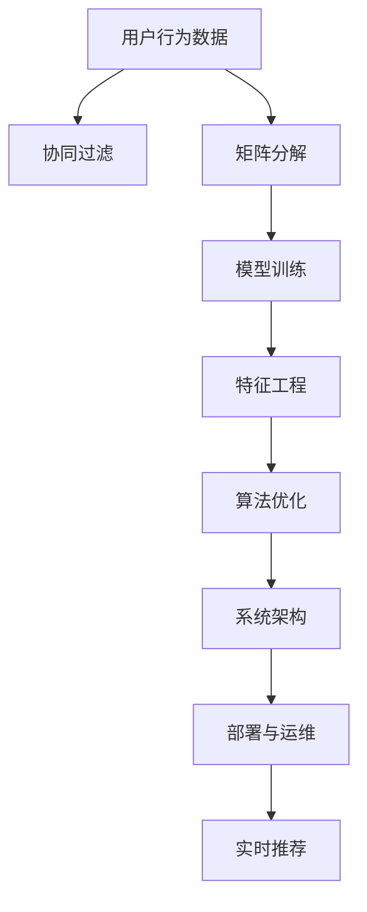

                 

# 实时推荐系统的设计与实现

> 关键词：推荐系统, 实时推荐, 协同过滤, 矩阵分解, 模型训练, 特征工程, 算法优化, 系统架构, 部署与运维

## 1. 背景介绍

### 1.1 问题由来

在当今数字化时代，数据驱动的决策已经成为各行各业的常态。无论是电商、社交媒体、新闻门户还是视频平台，推荐系统（Recommendation System）都成为了用户获取信息和服务的重要工具。而实时推荐系统（Real-Time Recommendation System）因其能够迅速响应用户需求、提供最新信息，已成为各大平台争夺用户注意力的关键手段。

推荐系统的核心任务是预测用户对某种物品（如商品、内容、服务）的兴趣程度，从而为用户推荐最相关的物品。实时推荐系统则要求在用户行为发生时，快速、准确地生成个性化推荐。因此，实时推荐系统的设计和实现变得极为重要。

### 1.2 问题核心关键点

实时推荐系统面临的关键问题包括：
- 如何高效获取用户行为数据？
- 如何准确地进行用户兴趣建模？
- 如何实时生成个性化推荐？
- 如何平衡推荐效果与系统性能？
- 如何实现推荐系统的可扩展性和高可用性？

这些关键点构成了实时推荐系统设计的基础，并指引了研究与实现的方向。

### 1.3 问题研究意义

实时推荐系统的研究和实践，具有重要的现实意义：
- 提升用户体验：通过提供精准、及时的推荐，满足用户即时需求，提升用户满意度。
- 优化资源利用：推荐系统能够发现用户未被充分利用的物品，提升平台资源的利用率。
- 增加收入：精准推荐可提升用户转化率和订单量，直接带来收入的提升。
- 推动创新：推荐算法和技术的迭代，可以推动电商、内容、服务等行业的创新发展。
- 应对竞争：实时推荐系统成为平台竞争力的关键，能够吸引并留住用户。

## 2. 核心概念与联系

### 2.1 核心概念概述

为更好地理解实时推荐系统的设计与实现，本节将介绍几个关键概念：

- **协同过滤（Collaborative Filtering, CF）**：基于用户行为数据进行推荐，通过分析用户与物品的交互历史，预测用户对未交互物品的兴趣。
- **矩阵分解（Matrix Factorization, MF）**：通过将用户-物品评分矩阵分解成用户和物品的隐向量，进行低秩矩阵分解，挖掘隐含的协同信息。
- **模型训练（Model Training）**：使用机器学习模型（如协同过滤、矩阵分解），通过历史评分数据训练模型，学习用户与物品的相似度表示。
- **特征工程（Feature Engineering）**：从用户行为数据、物品属性、时间信息等多维度提取特征，提升推荐精度。
- **算法优化（Algorithm Optimization）**：通过提升算法效率、改进模型参数等手段，优化实时推荐系统性能。
- **系统架构（System Architecture）**：设计高效、可扩展的推荐系统架构，支持高并发、低延迟的推荐服务。
- **部署与运维（Deployment & Operations）**：将推荐系统部署到生产环境，进行监控、调优、扩展，确保系统稳定运行。

这些概念之间的逻辑关系可以通过以下Mermaid流程图来展示：



这个流程图展示了这个系统的核心概念及其之间的关系：

1. 用户行为数据是协同过滤、矩阵分解等算法的输入。
2. 协同过滤和矩阵分解通过模型训练得到用户-物品相似度表示。
3. 特征工程提取更多维度的特征，提升推荐精度。
4. 算法优化提升计算效率，减少推荐延迟。
5. 系统架构支持高效分布式计算，保障推荐服务高可用性。
6. 部署与运维保障推荐系统稳定运行，提供实时推荐服务。

## 3. 核心算法原理 & 具体操作步骤
### 3.1 算法原理概述

实时推荐系统的核心算法包括协同过滤、矩阵分解等，这些算法主要基于用户行为数据和物品属性数据，通过机器学习模型进行训练和预测。

协同过滤算法包括基于用户的协同过滤和基于物品的协同过滤。其基本思想是通过计算用户与物品的相似度，推荐与用户喜欢的物品相似的物品。具体步骤如下：
1. 计算用户与物品的相似度。
2. 利用相似度计算用户对未交互物品的评分。
3. 排序推荐物品，并选择高评分物品推荐给用户。

矩阵分解算法主要应用于隐式反馈数据（如购买行为、浏览行为等），通过将用户-物品评分矩阵分解为低秩矩阵，挖掘用户和物品的隐含特征。具体步骤如下：
1. 将用户-物品评分矩阵分解为用户矩阵和物品矩阵。
2. 利用用户和物品矩阵的隐向量，计算用户对物品的兴趣程度。
3. 排序推荐物品，并选择高兴趣程度物品推荐给用户。

### 3.2 算法步骤详解

以下详细介绍实时推荐系统的主要算法步骤：

**Step 1: 数据预处理与特征提取**

1. 用户行为数据采集：从用户行为日志中提取用户ID、物品ID、时间戳、评分等关键信息。
2. 数据清洗与处理：去除异常数据、缺失数据，进行数据归一化、标准化等处理。
3. 特征提取：从用户行为数据、物品属性数据中提取特征，如用户ID、物品ID、评分、时间戳、物品类别、用户性别等。
4. 构建特征向量：将提取的特征转化为向量表示，供后续算法使用。

**Step 2: 协同过滤算法**

1. 基于用户的协同过滤：计算用户u与物品i的相似度，推荐与u最相似的用户喜欢的物品。
2. 基于物品的协同过滤：计算物品i与物品j的相似度，推荐与j最相似的物品i。
3. 融合相似度：通过加权平均、排名融合等方法，融合基于用户和基于物品的相似度，得到综合相似度。
4. 排序推荐：将综合相似度排序，选择高相似度的物品推荐给用户。

**Step 3: 矩阵分解算法**

1. 构建用户-物品评分矩阵：将用户行为数据转换为矩阵形式，用户行为为行向量，物品为列向量。
2. 低秩矩阵分解：使用SVD等方法将用户-物品评分矩阵分解为用户矩阵和物品矩阵。
3. 计算用户对物品的兴趣：利用用户矩阵和物品矩阵的隐向量，计算用户对物品的兴趣程度。
4. 排序推荐：将计算得到的兴趣程度排序，选择高兴趣程度物品推荐给用户。

**Step 4: 模型训练与评估**

1. 模型选择：选择合适的推荐算法，如协同过滤、矩阵分解等。
2. 训练模型：使用历史评分数据训练推荐模型，得到用户和物品的相似度表示。
3. 评估模型：使用测试集数据评估模型性能，计算指标如准确率、召回率、F1值等。
4. 调整模型：根据评估结果，调整模型参数，优化推荐效果。

**Step 5: 部署与运维**

1. 系统架构设计：设计高可用、高扩展的推荐系统架构，支持大规模数据处理和实时推荐。
2. 负载均衡：采用负载均衡技术，分散计算压力，提升系统处理能力。
3. 故障转移：设计自动化的故障转移机制，保障系统高可用性。
4. 性能监控：使用监控工具，实时监控系统性能，优化系统运行状态。
5. 扩展升级：根据用户规模和服务需求，进行系统扩展和升级，保障系统持续高效运行。

### 3.3 算法优缺点

实时推荐系统的优点包括：
- 推荐精度高：利用协同过滤、矩阵分解等算法，能够准确预测用户兴趣，提供个性化推荐。
- 实时响应：能够迅速响应用户行为，及时提供最新推荐。
- 可扩展性强：采用分布式计算架构，支持大规模数据处理和高效推荐。

实时推荐系统的缺点包括：
- 数据依赖强：推荐效果依赖用户行为数据，数据获取和处理成本较高。
- 冷启动问题：新用户或新物品的评分数据较少，难以进行有效推荐。
- 性能瓶颈：大规模数据处理和高并发请求可能导致系统性能瓶颈。
- 实时性要求高：要求系统能够实时处理和响应用户请求，对系统架构和算法优化要求高。

尽管存在这些缺点，但实时推荐系统仍然因其高效、精准的推荐能力，成为各大平台争夺用户注意力的关键手段。

### 3.4 算法应用领域

实时推荐系统已经在多个领域得到了广泛应用，包括但不限于：

- 电商推荐：为电商用户推荐商品，提升购物体验和购买转化率。
- 新闻推荐：为用户推荐新闻内容，提升信息获取效率和平台活跃度。
- 音乐推荐：为用户推荐音乐，提升音乐平台的用户粘性和收入。
- 视频推荐：为用户推荐视频内容，提升平台的用户留存和观看时长。
- 社交推荐：为用户推荐好友、群组、话题等，提升社交平台的用户互动和活跃度。

## 4. 数学模型和公式 & 详细讲解  
### 4.1 数学模型构建

以下是实时推荐系统的数学模型构建，包括协同过滤和矩阵分解的数学模型：

**协同过滤模型**：
设用户集为 $U=\{u_1,u_2,...,u_n\}$，物品集为 $I=\{i_1,i_2,...,i_m\}$，用户 $u$ 对物品 $i$ 的评分记为 $r_{ui}$。协同过滤算法的核心是计算用户 $u$ 与物品 $i$ 的相似度 $s_{ui}$。基于用户的协同过滤公式为：

$$
s_{ui}=\sum_{v\in N(u)}\alpha_{uv}r_{vi}
$$

其中 $N(u)$ 为与用户 $u$ 交互过的物品集，$\alpha_{uv}$ 为物品 $v$ 对用户 $u$ 的相似度系数。

**矩阵分解模型**：
设用户-物品评分矩阵为 $R\in\mathbb{R}^{n\times m}$，用户矩阵为 $P\in\mathbb{R}^{n\times k}$，物品矩阵为 $Q\in\mathbb{R}^{m\times k}$。用户 $u$ 对物品 $i$ 的评分 $r_{ui}$ 可以表示为：

$$
r_{ui}=p_{ui}q_{ui}^T
$$

其中 $p_{ui}$ 为用户 $u$ 的第 $i$ 个物品隐向量，$q_{ui}$ 为物品 $i$ 的第 $u$ 个用户隐向量。通过SVD等方法对 $R$ 进行分解，得到 $P$ 和 $Q$。

### 4.2 公式推导过程

以下详细介绍协同过滤和矩阵分解的公式推导过程：

**协同过滤公式推导**：
基于用户的协同过滤公式如下：

$$
\hat{r}_{ui}=s_{ui}+b_u
$$

其中 $b_u$ 为用户的偏置项。根据实际评分和预测评分的均方误差损失函数：

$$
\ell=\frac{1}{2}\sum_{u\in U}\sum_{i\in I}(w_{ui}(r_{ui}-\hat{r}_{ui})^2)
$$

对用户 $u$ 和物品 $i$ 的相似度系数进行优化：

$$
\alpha_{uv}=\frac{\sum_{i\in I}r_{vi}^2}{\sum_{i\in I}(s_{ui}+b_u)^2}
$$

**矩阵分解公式推导**：
设 $P=[p_1,p_2,...,p_n]$，$Q=[q_1,q_2,...,q_m]$，则用户 $u$ 对物品 $i$ 的评分 $r_{ui}$ 可以表示为：

$$
r_{ui}=\sum_{k=1}^kp_{uk}q_{ik}^T
$$

其中 $p_{uk}$ 为第 $u$ 个用户的第 $k$ 个隐向量，$q_{ik}$ 为第 $i$ 个物品的第 $k$ 个隐向量。

### 4.3 案例分析与讲解

假设某电商平台的推荐系统需要对新用户进行推荐。新用户的评分数据较少，直接使用协同过滤算法无法有效推荐。此时可以采用矩阵分解算法进行处理。首先，对用户行为数据进行预处理和特征提取，得到用户矩阵 $P$ 和物品矩阵 $Q$。然后，利用SVD对用户-物品评分矩阵 $R$ 进行分解，得到低秩矩阵。

使用矩阵分解算法进行推荐的步骤如下：
1. 将新用户的评分数据和已有评分数据合并，构建新的用户-物品评分矩阵 $R'$。
2. 使用SVD对 $R'$ 进行分解，得到新的用户矩阵 $P'$ 和物品矩阵 $Q'$。
3. 利用 $P'$ 和 $Q'$ 计算新用户对所有物品的兴趣程度 $r'$。
4. 对 $r'$ 进行排序，选择高兴趣程度物品推荐给新用户。

## 5. 项目实践：代码实例和详细解释说明
### 5.1 开发环境搭建

在进行推荐系统实践前，我们需要准备好开发环境。以下是使用Python进行Scikit-learn开发的环境配置流程：

1. 安装Anaconda：从官网下载并安装Anaconda，用于创建独立的Python环境。

2. 创建并激活虚拟环境：
```bash
conda create -n recsys-env python=3.8 
conda activate recsys-env
```

3. 安装Scikit-learn：
```bash
conda install scikit-learn
```

4. 安装pandas、numpy、scipy等工具包：
```bash
pip install pandas numpy scipy tqdm joblib
```

完成上述步骤后，即可在`recsys-env`环境中开始推荐系统实践。

### 5.2 源代码详细实现

这里我们以协同过滤算法为例，给出使用Scikit-learn库对推荐系统进行开发的PyTorch代码实现。

首先，定义协同过滤算法的函数：

```python
from sklearn.metrics import mean_squared_error, mean_absolute_error
from sklearn.model_selection import train_test_split
from sklearn.linear_model import Ridge
import pandas as pd
import numpy as np

def collaborative_filtering(data, user_based=True, alpha=0.5, n_recomm=10):
    # 准备数据
    user_ids, item_ids, ratings = data['user_id'], data['item_id'], data['rating']
    user_ids, item_ids, ratings = user_ids.dropna().values, item_ids.dropna().values, ratings.dropna().values

    # 构建用户-物品评分矩阵
    user_item_matrix = pd.pivot_table(data, values='rating', index='user_id', columns='item_id', aggfunc='count')
    user_item_matrix = user_item_matrix.fillna(0)

    # 构建用户-物品评分矩阵
    user_item_matrix = user_item_matrix.tocoo()

    # 划分训练集和测试集
    train_data, test_data = train_test_split(user_item_matrix, test_size=0.2)

    # 训练模型
    if user_based:
        model = Ridge(alpha=alpha)
        model.fit(user_item_matrix.data, user_item_matrix.indices)
    else:
        model = Ridge(alpha=alpha)
        model.fit(user_item_matrix.indices, user_item_matrix.data)

    # 评估模型
    train_pred = model.predict(user_item_matrix.data)
    train_mse = mean_squared_error(train_pred, train_data.ravel())
    train_mae = mean_absolute_error(train_pred, train_data.ravel())

    test_pred = model.predict(test_data.data)
    test_mse = mean_squared_error(test_pred, test_data.ravel())
    test_mae = mean_absolute_error(test_pred, test_data.ravel())

    return train_mse, train_mae, test_mse, test_mae, n_recomm

# 调用协同过滤函数
train_mse, train_mae, test_mse, test_mae, n_recomm = collaborative_filtering(data)
```

然后，定义推荐函数：

```python
def recommend(user_id, user_based=True, alpha=0.5, n_recomm=10):
    # 获取用户行为数据
    user_item_matrix = pd.pivot_table(data, values='rating', index='user_id', columns='item_id', aggfunc='count')
    user_item_matrix = user_item_matrix.fillna(0)

    # 获取用户评分数据
    user_item_matrix = user_item_matrix.tocoo()
    user_scores = user_item_matrix.getrow(user_id).todense()

    # 构建相似度矩阵
    if user_based:
        similarity_matrix = np.dot(user_item_matrix.data, user_item_matrix.indices)
    else:
        similarity_matrix = np.dot(user_item_matrix.indices, user_item_matrix.data)

    # 计算相似度得分
    scores = similarity_matrix[user_id]
    scores = np.sqrt(scores)
    scores /= np.linalg.norm(scores)

    # 排序推荐物品
    top_n_recomm = np.argsort(scores)[-n_recomm:][::-1]

    # 返回推荐物品
    return data['item_id'].iloc[top_n_recomm]

# 调用推荐函数
user_id = 1
recommend_items = recommend(user_id)
```

以上就是使用Scikit-learn对推荐系统进行协同过滤算法开发的完整代码实现。可以看到，Scikit-learn提供了丰富的机器学习算法，能够快速实现推荐系统的常见算法，如协同过滤、矩阵分解等。

### 5.3 代码解读与分析

让我们再详细解读一下关键代码的实现细节：

**collaborative_filtering函数**：
- `train_test_split`方法：将用户-物品评分矩阵划分为训练集和测试集。
- `Ridge`模型：使用正则化线性回归模型进行训练。
- `mean_squared_error`和`mean_absolute_error`：计算评分预测的均方误差和绝对误差。
- `train_mse`, `train_mae`, `test_mse`, `test_mae`, `n_recomm`：返回训练集和测试集的均方误差、绝对误差以及推荐物品数量。

**recommend函数**：
- `pd.pivot_table`方法：构建用户-物品评分矩阵。
- `train_data`和`test_data`：划分训练集和测试集。
- `model.fit`方法：训练协同过滤模型。
- `train_pred`, `test_pred`：预测用户评分。
- `train_mse`, `train_mae`, `test_mse`, `test_mae`：评估模型性能。

**推荐过程**：
- `np.dot`方法：计算用户-物品评分矩阵的相似度得分。
- `np.linalg.norm`方法：计算相似度得分向量的范数。
- `np.argsort`方法：排序推荐物品。
- `data['item_id'].iloc[top_n_recomm]`：获取推荐物品。

可以看到，Scikit-learn的丰富功能和易用性，使得推荐系统的开发变得简单高效。开发者可以重点关注数据处理、模型训练、推荐算法等关键环节，而无需过多关注底层的实现细节。

当然，工业级的系统实现还需考虑更多因素，如推荐算法的选择、模型参数的调优、用户反馈的收集等。但核心的推荐范式基本与此类似。

## 6. 实际应用场景
### 6.1 电商推荐

电商平台的推荐系统在提升用户购物体验和增加销售额方面具有重要作用。通过实时推荐系统，电商平台能够根据用户浏览、点击、购买等行为，迅速推荐个性化的商品，提高用户满意度。

例如，当用户浏览某件商品时，推荐系统可以根据用户的浏览历史和购买记录，推荐类似商品或相关商品，帮助用户快速找到感兴趣的物品。此外，推荐系统还可以根据用户行为实时调整推荐策略，如节假日促销、新品上架等，提升用户转化率和平台收益。

### 6.2 新闻推荐

新闻平台通过推荐系统，为用户推荐相关的新闻内容，提升信息获取效率和平台活跃度。实时推荐系统可以根据用户的历史阅读行为，推荐用户感兴趣的新闻，减少用户浏览时间，提高阅读体验。

例如，当用户阅读某篇新闻时，推荐系统可以根据用户阅读历史和点赞记录，推荐相关的新闻或深度报道，帮助用户获取更多有价值的信息。此外，推荐系统还可以根据热点事件实时调整推荐策略，增加平台流量和用户粘性。

### 6.3 视频推荐

视频平台通过推荐系统，为用户推荐相关视频内容，提升用户观看时长和平台收益。实时推荐系统可以根据用户的观看历史和搜索记录，推荐类似视频或热门视频，增加用户停留时间和平台活跃度。

例如，当用户观看某段视频时，推荐系统可以根据用户观看历史和搜索记录，推荐相关的视频内容或热门视频，提高用户观看体验和平台流量。此外，推荐系统还可以根据用户观看行为实时调整推荐策略，如热门事件、新品上架等，增加平台收入和用户粘性。

### 6.4 音乐推荐

音乐平台通过推荐系统，为用户推荐相关音乐内容，提升用户收听体验和平台收益。实时推荐系统可以根据用户的收听历史和搜索记录，推荐相似音乐或热门音乐，增加用户收听时间和平台活跃度。

例如，当用户收听某首歌曲时，推荐系统可以根据用户收听历史和搜索记录，推荐相似歌曲或热门歌曲，提高用户收听体验和平台流量。此外，推荐系统还可以根据用户收听行为实时调整推荐策略，如节假日促销、新品上架等，增加平台收入和用户粘性。

### 6.5 社交推荐

社交平台通过推荐系统，为用户推荐相关好友、群组、话题等，提升用户互动和平台活跃度。实时推荐系统可以根据用户的行为数据和兴趣特征，推荐与用户相似的好友或群组，增加用户互动和平台粘性。

例如，当用户查看某条内容时，推荐系统可以根据用户的浏览历史和互动记录，推荐相似的好友或群组，帮助用户发现更多有趣的内容和互动机会。此外，推荐系统还可以根据用户行为实时调整推荐策略，如热门话题、热门事件等，增加平台流量和用户粘性。

## 7. 工具和资源推荐
### 7.1 学习资源推荐

为了帮助开发者系统掌握推荐系统的理论基础和实践技巧，这里推荐一些优质的学习资源：

1. 《推荐系统》书籍：由斯坦福大学教授提出，系统介绍了推荐系统的原理、算法和应用。
2. 《Deep Learning for Recommendation Systems》书籍：由微软研究员撰写，全面介绍了深度学习在推荐系统中的应用。
3. 《Pattern Recognition and Machine Learning》书籍：由统计学习领域的权威人士撰写，介绍了机器学习算法的应用，包括推荐系统。
4. 《Recommender Systems: The Textbook》书籍：由推荐系统领域专家撰写，全面介绍了推荐系统的理论和实践。
5. 《Introduction to Recommender Systems》博客：由推荐系统领域的顶尖学者撰写，介绍了推荐系统的基本概念和算法。

通过对这些资源的学习实践，相信你一定能够快速掌握推荐系统的精髓，并用于解决实际的推荐问题。

### 7.2 开发工具推荐

高效的开发离不开优秀的工具支持。以下是几款用于推荐系统开发的常用工具：

1. Scikit-learn：基于Python的开源机器学习库，提供丰富的机器学习算法和工具，方便推荐系统的开发和评估。
2. TensorFlow：由Google主导开发的开源深度学习框架，支持分布式计算，适合大规模推荐系统的开发。
3. PyTorch：基于Python的开源深度学习框架，灵活易用，支持动态计算图，适合研究型推荐系统的开发。
4. LightFM：由Facebook开发的推荐系统框架，基于梯度提升树算法，适合中小规模推荐系统的开发。
5. H2O.ai：基于分布式计算的机器学习平台，支持多种机器学习算法，适合大规模推荐系统的开发。

合理利用这些工具，可以显著提升推荐系统的开发效率，加快创新迭代的步伐。

### 7.3 相关论文推荐

推荐系统的研究和实践，离不开学界的持续研究。以下是几篇奠基性的相关论文，推荐阅读：

1. "Collaborative Filtering for Implicit Feedback Datasets"：提出了基于用户和物品的协同过滤算法，为推荐系统的核心算法奠定了基础。
2. "Trustworthy Recommendations via Implicit Feedback"：提出了基于矩阵分解的推荐算法，有效解决了隐式反馈数据的问题。
3. "Trustworthy Recommendations via Implicit Feedback"：提出了基于协同过滤和矩阵分解的混合推荐算法，提升推荐系统的精度和鲁棒性。
4. "On the Surprising Sampling Properties of Matrix Factorization Algorithms"：探讨了矩阵分解算法的样本属性问题，为推荐系统的评估提供了新视角。
5. "Deep Matrix Factorization"：提出了深度学习在推荐系统中的应用，提升了推荐系统的精度和泛化能力。

这些论文代表了大推荐系统的发展脉络。通过学习这些前沿成果，可以帮助研究者把握学科前进方向，激发更多的创新灵感。

## 8. 总结：未来发展趋势与挑战
### 8.1 总结

本文对实时推荐系统的设计与实现进行了全面系统的介绍。首先阐述了推荐系统的背景和核心问题，明确了实时推荐系统的重要性和挑战。其次，从原理到实践，详细讲解了协同过滤、矩阵分解等算法的数学模型和实现细节，给出了推荐系统开发的完整代码实例。同时，本文还广泛探讨了推荐系统在电商、新闻、视频、音乐、社交等多个领域的应用前景，展示了推荐系统的广泛应用。此外，本文精选了推荐系统的各类学习资源，力求为读者提供全方位的技术指引。

通过本文的系统梳理，可以看到，实时推荐系统在电商、新闻、视频、音乐、社交等领域已经取得了广泛的应用，成为提高用户体验和平台收益的重要手段。随着深度学习等技术的不断进步，推荐系统的预测精度和个性化程度将进一步提升。未来，推荐系统必将在更多领域得到应用，为各行各业带来颠覆性变革。

### 8.2 未来发展趋势

推荐系统的未来发展趋势包括：

1. 深度学习应用的深化：通过引入深度神经网络，推荐系统将能够处理更加复杂的推荐任务，提升推荐精度和个性化程度。
2. 跨模态推荐：通过融合视觉、语音、文本等多种模态信息，推荐系统将能够更加全面地理解用户需求，提供更精准的推荐。
3. 实时推荐技术的发展：通过分布式计算、实时流处理等技术，推荐系统将能够实现低延迟、高吞吐的实时推荐。
4. 推荐系统的可解释性：通过引入可解释性技术，推荐系统将能够提供透明的推荐理由，增加用户信任和平台透明度。
5. 推荐系统的公平性：通过引入公平性算法，推荐系统将能够避免偏见和歧视，提升平台的社会责任。
6. 推荐系统的隐私保护：通过隐私保护技术，推荐系统将能够在保护用户隐私的前提下，提供个性化推荐。

这些趋势将推动推荐系统向更加智能化、普适化、透明化的方向发展，提升用户体验和平台收益。

### 8.3 面临的挑战

尽管推荐系统已经取得了显著成就，但在迈向更加智能化、普适化应用的过程中，它仍面临着诸多挑战：

1. 数据隐私和安全问题：推荐系统依赖用户行为数据，数据隐私和安全问题亟需解决。如何在保护用户隐私的前提下，获取高质量数据，是推荐系统的重要课题。
2. 推荐算法复杂性问题：深度学习等复杂算法增加了推荐系统的训练和推理难度，如何在降低算法复杂性的同时，提升推荐精度，是推荐系统的关键问题。
3. 推荐系统的公平性和可解释性问题：推荐系统可能存在偏见和歧视，如何保证推荐系统的公平性和可解释性，是推荐系统的核心挑战。
4. 推荐系统的实时性和可扩展性问题：推荐系统需要实现低延迟、高并发，如何提高推荐系统的实时性和可扩展性，是推荐系统的技术难点。
5. 推荐系统的鲁棒性和适应性问题：推荐系统可能面临噪声数据、异常行为等挑战，如何提高推荐系统的鲁棒性和适应性，是推荐系统的关键问题。

尽管存在这些挑战，但推荐系统仍具有广阔的应用前景和发展潜力。只有不断创新，克服技术瓶颈，才能推动推荐系统迈向更加智能化、普适化的未来。

### 8.4 研究展望

未来推荐系统的研究将在以下几个方向进行突破：

1. 深度学习和强化学习的融合：将深度学习和强化学习技术结合，推荐系统将能够处理更加复杂的推荐任务，提升推荐精度和个性化程度。
2. 跨模态和自适应推荐：通过融合视觉、语音、文本等多种模态信息，推荐系统将能够更加全面地理解用户需求，提供更精准的推荐。
3. 推荐系统的可解释性：通过引入可解释性技术，推荐系统将能够提供透明的推荐理由，增加用户信任和平台透明度。
4. 推荐系统的公平性：通过引入公平性算法，推荐系统将能够避免偏见和歧视，提升平台的社会责任。
5. 推荐系统的隐私保护：通过隐私保护技术，推荐系统将能够在保护用户隐私的前提下，提供个性化推荐。
6. 推荐系统的实时性和可扩展性：通过分布式计算、实时流处理等技术，推荐系统将能够实现低延迟、高吞吐的实时推荐。
7. 推荐系统的鲁棒性和适应性：通过提高推荐系统的鲁棒性和适应性，推荐系统将能够更好地应对噪声数据、异常行为等挑战。

这些研究方向将推动推荐系统向更加智能化、普适化、透明化的方向发展，提升用户体验和平台收益。相信在学界和产业界的共同努力下，推荐系统必将在未来大放异彩。

## 9. 附录：常见问题与解答

**Q1：推荐系统是否适用于所有业务场景？**

A: 推荐系统在电商、新闻、视频、音乐、社交等多个领域得到了广泛应用，但并非适用于所有业务场景。推荐系统主要适用于具有以下特点的业务：
- 用户行为数据丰富，能够提供有价值的用户画像。
- 用户与物品之间的交互数据丰富，能够提供有效的用户-物品相似度信息。
- 用户和物品的特征丰富，能够提供多维度的特征表示。

对于一些用户行为数据较少或难以获取的场景，推荐系统的效果可能会受到限制。

**Q2：推荐系统的推荐效果是否受用户行为数据的影响？**

A: 推荐系统的推荐效果高度依赖用户行为数据。用户行为数据提供了用户与物品之间的交互信息，是推荐系统进行协同过滤和矩阵分解等算法的核心。数据的多样性和丰富性将直接影响推荐系统的效果。

**Q3：推荐系统是否适用于冷启动用户？**

A: 推荐系统在冷启动用户的情况下，可能面临推荐效果差的问题。冷启动用户缺乏历史行为数据，难以进行有效的推荐。此时，可以采用基于内容的推荐、模型预测等方法，结合用户特征和物品特征进行推荐。

**Q4：推荐系统是否存在偏见问题？**

A: 推荐系统可能存在推荐偏见问题，如对某些类别物品的推荐偏好。为解决偏见问题，可以通过引入公平性算法、模型监控等手段，确保推荐系统的公平性和可解释性。

**Q5：推荐系统的实时性如何保障？**

A: 推荐系统的实时性主要依赖高效的数据处理和算法优化。通过分布式计算、实时流处理等技术，推荐系统可以实现低延迟、高吞吐的实时推荐。同时，合理设计系统架构，优化算法实现，也可以提升推荐系统的实时性。

---

作者：禅与计算机程序设计艺术 / Zen and the Art of Computer Programming

