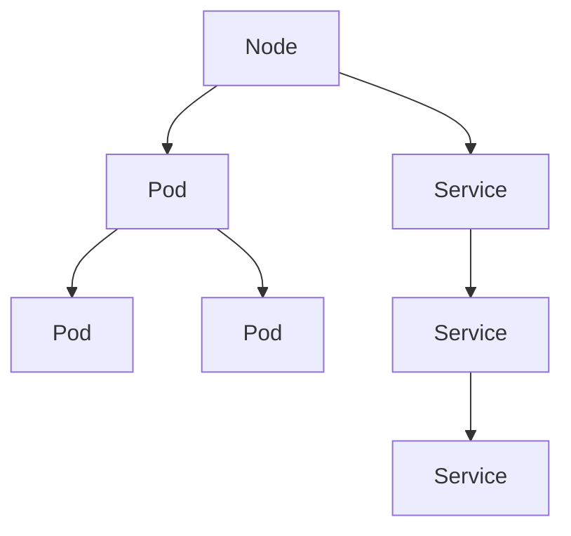

                 

# 容器化和 Kubernetes：管理应用程序部署

> 关键词：容器化, Kubernetes, 微服务, DevOps, 持续集成, 持续部署, 自动化

## 1. 背景介绍

### 1.1 问题由来

在软件工程领域，应用程序部署一直是技术栈中最具挑战性的部分。早期，传统的一体化部署方式，即一次性将代码和依赖部署到服务器上，由于依赖关系错综复杂、系统状态难以管理，经常导致部署失败或故障。

随着微服务架构的兴起，将应用拆分为多个独立的服务，每个服务独立部署、单独管理，可以有效降低系统复杂度，但同时也带来了新的挑战。比如服务之间的通信、配置管理、负载均衡等问题，仍需要有效的手段来管理。

容器化技术应运而生，它通过将应用打包到轻量级的容器中，实现了应用的独立性和可移植性。Docker等容器化工具的广泛应用，极大简化了部署过程，提高了系统的稳定性和可扩展性。然而，当系统规模扩大后，单个容器进行管理显得力不从心，如何高效地管理海量容器成为了新的问题。

### 1.2 问题核心关键点

容器化技术虽然解决了部署和运维上的许多问题，但它也有自身的限制。首先，容器化应用之间如何有效通信？其次，大量容器如何管理和调度？最后，如何保证容器的稳定性和高可用性？

为解决这些问题，Kubernetes应运而生，它是一个开源的容器编排平台，专门用于管理和调度容器化应用。本文将系统介绍容器化技术和Kubernetes的核心概念与联系，探索容器化在应用部署中的实际应用。

## 2. 核心概念与联系

### 2.1 核心概念概述

- **容器化**：通过将应用程序及其依赖打包到可移植、可复用的容器中，使得应用在不同环境之间一致运行。
- **Docker**：一款流行的容器化工具，提供了轻量级的容器实现，简化了应用部署和运维。
- **微服务**：将应用拆分为多个独立的服务，每个服务独立部署、单独管理，便于横向扩展和故障隔离。
- **Kubernetes**：一个开源的容器编排平台，用于管理、调度、部署和维护容器化应用，支持自动化运维和持续部署。
- **DevOps**：软件开发和运维的集成和协同，倡导快速部署、持续集成和持续部署(CICD)。

这些概念之间具有紧密联系：容器化提供了应用程序的轻量级封装，微服务实现了应用的高内聚低耦合，Kubernetes则通过容器编排和调度实现了自动化运维，而DevOps则是持续集成和持续部署的实践方法。通过这些技术的协同，我们可以高效地管理和部署大规模的应用程序。

## 3. 核心算法原理 & 具体操作步骤
### 3.1 算法原理概述

Kubernetes作为容器编排平台，其核心思想是通过抽象出一组资源概念，对这些资源进行管理、调度、部署和监控。Kubernetes的管理对象包括Node（节点）、Pod（容器组）、Service（服务）等，它们之间的相互依赖关系如下图所示：



- **Node**：Kubernetes集群中的计算节点，通常是一台物理服务器或虚拟机。
- **Pod**：Kubernetes中最小的部署单元，一个Pod包含一个或多个容器，它们共享网络命名空间，能够互相通信。
- **Service**：提供对一组Pod的抽象访问接口，实现Pod的负载均衡和自动扩展。

Kubernetes通过定义一组抽象的资源概念，对容器化应用进行管理。在实践中，我们需要将应用程序打包为Docker镜像，并将其部署到Kubernetes集群中。

### 3.2 算法步骤详解

Kubernetes的部署和管理流程通常包括以下几个关键步骤：

**Step 1: 准备Docker镜像**
- 构建Docker镜像：使用Dockerfile编写应用程序的Docker镜像构建指令。
- 推送Docker镜像：将构建好的镜像推送到Docker Hub或私有镜像仓库。

**Step 2: 创建Kubernetes部署配置**
- 编写Kubernetes Deployment文件，定义Pod的容器配置、资源需求、重启策略等。
- 定义Service和Ingress配置，配置Pod的负载均衡、自动扩展、访问规则等。

**Step 3: 初始化Kubernetes集群**
- 安装Kubernetes集群，选择一台机器作为Master节点，多台机器作为Worker节点。
- 安装Kubernetes节点代理，使Worker节点可以与Master节点进行通信。

**Step 4: 部署应用到Kubernetes集群**
- 在Kubernetes Master节点上运行kubectl命令行工具，创建Deployment和Service资源。
- 等待Pod创建和运行，验证应用是否正常工作。

**Step 5: 监控和维护**
- 使用kubectl命令行工具监控Pod和Service的运行状态，查看日志和资源使用情况。
- 定期检查应用性能，根据负载情况进行扩缩容。
- 设置报警规则，自动告警系统故障。

### 3.3 算法优缺点

容器化和Kubernetes具有以下优点：
1. 容器化实现了应用的无缝部署，简化了运维管理。
2. Kubernetes提供了强大的资源管理能力和调度机制，支持自动扩展和负载均衡。
3. 支持跨平台和环境的一致性，使得应用在不同环境间无缝迁移。
4. 支持持续集成和持续部署，提高了开发效率和系统稳定性。

同时，这些技术也存在一些缺点：
1. 初始部署和配置复杂，需要一定的技术门槛。
2. 资源消耗较大，尤其是集群管理节点和监控工具。
3. 网络配置复杂，需要灵活的路由和负载均衡策略。
4. 依赖性较强，需要同时管理容器、网络、存储等多个方面。

尽管如此，容器化和Kubernetes在应用部署和运维上的优势，使其成为当前主流的技术方案，广泛应用于大型分布式系统的构建。

### 3.4 算法应用领域

容器化和Kubernetes在多个领域得到了广泛应用，包括但不限于：

- **互联网服务**：如电商、社交网络、在线广告等，支持高并发的服务请求。
- **云服务提供商**：如AWS、Azure、Google Cloud等，提供虚拟化的计算资源，实现弹性扩展。
- **企业内部应用**：如ERP、CRM、HR等，支持内部数据的流通和处理。
- **大数据应用**：如Hadoop、Spark等，支持大规模数据的处理和分析。
- **物联网应用**：如IoT设备、传感器数据等，支持海量数据的实时采集和处理。

这些应用场景中，容器化和Kubernetes的灵活性和扩展性，使其成为理想的部署和运维方案。

## 4. 数学模型和公式 & 详细讲解 & 举例说明

### 4.1 数学模型构建

Kubernetes的资源管理主要通过抽象的资源概念进行管理，这些资源概念之间的关系可以通过如下数学模型来描述：

- **Pod**：抽象的容器组，包含多个容器，定义了容器之间的依赖关系和资源分配。
- **Service**：定义了对一组Pod的抽象访问接口，实现Pod的负载均衡和自动扩展。

Pod的资源配置可以通过Deployment文件来描述，例如：

```yaml
apiVersion: apps/v1
kind: Deployment
metadata:
  name: myapp
spec:
  replicas: 3
  selector:
    matchLabels:
      app: myapp
  template:
    metadata:
      labels:
        app: myapp
    spec:
      containers:
      - name: myapp
        image: myapp:latest
        ports:
        - containerPort: 8080
        resources:
          requests:
            cpu: "100m"
            memory: "256Mi"
```

在上述配置中，我们定义了一个名为myapp的Deployment，包含3个Pod副本，每个Pod使用myapp:latest镜像，并开放了8080端口。

### 4.2 公式推导过程

Pod的资源管理可以通过以下数学公式来推导：

- **CPU资源**：定义了Pod所需的CPU资源，包括CPU请求和限制。CPU请求表示Pod运行所需的最低CPU资源，CPU限制表示Pod运行的最大CPU资源。

- **内存资源**：定义了Pod所需的内存资源，包括内存请求和限制。内存请求表示Pod运行所需的最低内存资源，内存限制表示Pod运行的最大内存资源。

Pod的CPU和内存资源可以分别通过如下公式来计算：

$$
\text{CPU请求} = \sum_{i=1}^n (\text{CPU请求}_i)
$$

$$
\text{CPU限制} = \max(\text{CPU限制}_i)
$$

$$
\text{内存请求} = \sum_{i=1}^n (\text{内存请求}_i)
$$

$$
\text{内存限制} = \max(\text{内存限制}_i)
$$

其中，$i$表示容器中容器的序号，$\text{CPU请求}_i$和$\text{内存请求}_i$分别表示容器的CPU和内存请求，$\text{CPU限制}_i$和$\text{内存限制}_i$分别表示容器的CPU和内存限制。

### 4.3 案例分析与讲解

假设我们有一个简单的应用，由两个容器组成，一个用于HTTP服务，另一个用于日志记录。这两个容器的CPU和内存需求如下：

- HTTP服务容器：CPU请求100m，CPU限制200m，内存请求256Mi，内存限制512Mi。
- 日志记录容器：CPU请求50m，CPU限制100m，内存请求128Mi，内存限制256Mi。

通过上面的公式计算，可以得到：

- HTTP服务容器的CPU请求为150m，内存请求为384Mi，CPU限制为200m，内存限制为512Mi。
- 日志记录容器的CPU请求为50m，内存请求为128Mi，CPU限制为100m，内存限制为256Mi。

将这些资源需求传递给Kubernetes的Deployment文件，即可实现Pod的资源管理。

## 5. 项目实践：代码实例和详细解释说明
### 5.1 开发环境搭建

在进行容器化和Kubernetes的实践前，我们需要准备好开发环境。以下是使用Linux进行Kubernetes开发的流程：

1. 安装Docker：
```bash
sudo apt-get update
sudo apt-get install docker.io
```

2. 安装kubectl：
```bash
sudo apt-get install kubectl
```

3. 创建Kubernetes集群：
```bash
kubectl create cluster
```

4. 登录集群：
```bash
kubectl get pods
```

5. 初始化集群：
```bash
kubectl init
```

完成上述步骤后，即可在本地环境中搭建Kubernetes集群，并准备后续的容器化应用部署。

### 5.2 源代码详细实现

下面我们以简单的Web应用为例，使用Docker和Kubernetes进行容器化和部署。

首先，构建Docker镜像：

```bash
docker build -t myapp:latest .
```

然后，编写Kubernetes Deployment文件：

```yaml
apiVersion: apps/v1
kind: Deployment
metadata:
  name: myapp
spec:
  replicas: 3
  selector:
    matchLabels:
      app: myapp
  template:
    metadata:
      labels:
        app: myapp
    spec:
      containers:
      - name: myapp
        image: myapp:latest
        ports:
        - containerPort: 8080
        resources:
          requests:
            cpu: "100m"
            memory: "256Mi"
```

最后，部署应用到Kubernetes集群：

```bash
kubectl apply -f deployment.yaml
```

### 5.3 代码解读与分析

让我们再详细解读一下关键代码的实现细节：

**Dockerfile文件**：
- `FROM`指令指定基础镜像。
- `ADD`指令将应用代码添加到镜像中。
- `COPY`指令将配置文件复制到镜像中。
- `RUN`指令执行shell命令，构建镜像。

**Kubernetes Deployment文件**：
- `kind`和`metadata`定义Deployment的元数据信息。
- `spec`定义Deployment的配置，包括Pod副本数、Pod选择器、Pod模板等。
- `template`定义Pod的模板，包括容器的定义、资源配置等。

**kubectl命令行工具**：
- `kubectl apply`命令将YAML文件应用到Kubernetes集群中。
- `kubectl get pods`命令查看Pod的状态。
- `kubectl logs`命令查看Pod的日志信息。

通过上述代码和工具，我们可以完成Docker镜像的构建和Kubernetes应用的部署。

### 5.4 运行结果展示

在Kubernetes集群中，我们可以使用`kubectl get pods`命令查看Pod的状态，使用`kubectl logs`命令查看Pod的日志信息，确保应用正常运行。

## 6. 实际应用场景
### 6.1 云计算服务

Kubernetes在云计算服务中得到了广泛应用，如AWS、Azure、Google Cloud等云服务提供商，都支持基于Kubernetes的容器编排和部署。云计算服务提供商通过Kubernetes实现了弹性扩展、自动扩展和负载均衡，能够高效管理大规模的容器化应用。

在实际应用中，Kubernetes可以部署各种类型的服务，如Web服务、数据库服务、缓存服务、消息队列服务等，支持高可用性、高并发、高弹性的云计算服务。

### 6.2 企业内部系统

Kubernetes在企业内部系统的构建中也发挥了重要作用。企业内部的数据中心、ERP、CRM、HR等系统，通过容器化和Kubernetes，实现了应用的快速部署、灵活扩展和自动运维。

在实际应用中，企业可以通过Kubernetes实现应用的高可用性，通过Ingress和Service实现网络的负载均衡和路由，通过Horizontal Pod Autoscaler实现自动扩展，通过Node标签和节点选择器实现资源管理。

### 6.3 大数据处理

Kubernetes在大数据处理中也得到了广泛应用。Hadoop、Spark等大数据处理框架，通过Kubernetes实现了资源的灵活分配和动态扩展。

在实际应用中，企业可以通过Kubernetes实现Hadoop集群的自动化部署和管理，通过Kubernetes调度Spark作业，实现大数据处理的高性能和高效性。

### 6.4 物联网应用

Kubernetes在物联网应用中也发挥了重要作用。物联网设备通过容器化和Kubernetes，实现了设备的快速部署和灵活管理。

在实际应用中，企业可以通过Kubernetes实现物联网设备的自动化部署和管理，通过Kubernetes调度设备作业，实现物联网应用的自动化和高效性。

## 7. 工具和资源推荐
### 7.1 学习资源推荐

为了帮助开发者系统掌握容器化和Kubernetes的理论基础和实践技巧，这里推荐一些优质的学习资源：

1. **《Kubernetes权威指南》**：Google开源的Kubernetes官方文档，详细介绍了Kubernetes的架构、核心概念和实践方法。

2. **《Docker技术详解》**：Docker官方文档，介绍了Docker的基本原理、容器化技术和应用场景。

3. **《Kubernetes实战》**：通过实际案例，介绍了Kubernetes的部署、管理、扩展和监控方法。

4. **《DevOps实践指南》**：介绍了DevOps的持续集成、持续部署、自动化运维等最佳实践，结合Kubernetes和Docker等工具。

5. **《容器化和Docker实战》**：通过实际案例，介绍了Docker镜像的构建、推送和容器化应用的管理方法。

这些资源覆盖了容器化和Kubernetes的核心概念和实践技巧，可以帮助开发者快速上手，并深入理解这些技术的实际应用。

### 7.2 开发工具推荐

高效的开发离不开优秀的工具支持。以下是几款用于容器化和Kubernetes开发和管理的常用工具：

1. **Kubernetes**：Google开源的容器编排平台，用于管理和调度容器化应用。

2. **Docker**：Docker官方提供的容器化工具，用于打包和运行应用。

3. **Helm**：Kubernetes的应用管理工具，用于部署和管理Kubernetes应用。

4. **Jenkins**：持续集成和持续部署工具，结合Kubernetes和Docker等工具，实现自动化构建和部署。

5. **Prometheus**：监控和告警工具，用于实时监控Kubernetes集群的资源使用情况。

6. **Grafana**：可视化工具，用于监控和分析Kubernetes集群的数据。

这些工具在实际应用中可以帮助开发者高效地进行容器化和Kubernetes的开发和管理。

### 7.3 相关论文推荐

容器化和Kubernetes的研究源于学界的持续研究。以下是几篇奠基性的相关论文，推荐阅读：

1. **《Kubernetes: A Distributed, Extensible, Cloud-Native Container Orchestration System》**：介绍Kubernetes的架构、核心概念和设计原则。

2. **《Docker: The Containerization Era》**：介绍Docker的容器化技术和应用场景。

3. **《Continuous Deployment at Netflix with Kubernetes》**：介绍Netflix如何使用Kubernetes实现持续集成和持续部署。

4. **《Scalable and Reliable Container Management with Kubernetes》**：介绍Kubernetes的资源管理和调度机制。

5. **《Kubernetes in Production at Scale》**：介绍Kubernetes在生产环境中的实践经验。

这些论文代表了大规模容器化和Kubernetes技术的研究方向，通过学习这些前沿成果，可以帮助研究者把握学科前进方向，激发更多的创新灵感。

## 8. 总结：未来发展趋势与挑战
### 8.1 研究成果总结

本文对容器化和Kubernetes的核心概念与联系进行了全面系统的介绍。首先阐述了容器化和Kubernetes的研究背景和意义，明确了容器化在简化部署和运维上的独特价值。其次，从原理到实践，详细讲解了Kubernetes的资源管理、调度、部署和监控机制，给出了容器化和Kubernetes应用部署的完整代码实例。同时，本文还广泛探讨了容器化在云计算、企业内部系统、大数据处理、物联网应用等领域的实际应用。

通过本文的系统梳理，可以看到，容器化和Kubernetes在应用部署和运维上的优势，使其成为当前主流的技术方案，广泛应用于大型分布式系统的构建。

### 8.2 未来发展趋势

展望未来，容器化和Kubernetes的发展趋势如下：

1. **云原生架构的普及**：容器化和Kubernetes将进一步推动云原生架构的普及，实现应用的弹性扩展、自动扩展和持续部署。

2. **多云和混合云的融合**：Kubernetes将支持多云和混合云的环境，实现跨云平台的资源管理和应用部署。

3. **服务网格的普及**：Istio等服务网格技术将进一步普及，实现微服务的通信管理、负载均衡和故障恢复。

4. **云原生安全**：Kubernetes将提供更加安全可靠的安全机制，实现应用的安全性和隐私保护。

5. **Kubernetes周边的生态系统**：Kubernetes周边将涌现更多的生态系统和工具，如Helm、Helmfile、Helmfile-hooks等，进一步简化Kubernetes的应用开发和运维。

6. **自动化和智能化运维**：Kubernetes将进一步实现自动化和智能化运维，实现应用的自动调度和自动优化。

以上趋势凸显了容器化和Kubernetes技术的广阔前景，这些方向的探索发展，必将进一步提升应用部署和运维的效率，推动云计算和软件产业的发展。

### 8.3 面临的挑战

尽管容器化和Kubernetes在应用部署和运维上的优势明显，但在迈向更加智能化、普适化应用的过程中，仍面临诸多挑战：

1. **学习曲线较陡**：容器化和Kubernetes需要一定的技术门槛，学习曲线较陡，需要花费时间和精力掌握。

2. **资源消耗较大**：Kubernetes集群的管理节点和监控工具需要较大的资源消耗，可能影响系统的稳定性和可扩展性。

3. **网络配置复杂**：Kubernetes的路由和负载均衡需要复杂的网络配置，需要灵活的路由策略和负载均衡算法。

4. **依赖性较强**：Kubernetes的部署和运维需要依赖多个组件和工具，需要综合考虑各个组件的兼容性和稳定性。

5. **数据安全问题**：Kubernetes集群的数据安全问题需要特别注意，避免数据泄露和攻击。

6. **性能瓶颈**：Kubernetes的性能瓶颈需要特别注意，避免单点故障和性能瓶颈。

尽管如此，容器化和Kubernetes在应用部署和运维上的优势，使其成为当前主流的技术方案，广泛应用于大型分布式系统的构建。

### 8.4 研究展望

面向未来，容器化和Kubernetes的研究方向将包括：

1. **容器化和Kubernetes的结合**：容器化和Kubernetes的进一步结合，实现应用的快速部署和灵活扩展。

2. **微服务架构的优化**：微服务架构的优化，实现应用的横向扩展和自动扩展。

3. **多云和混合云的优化**：多云和混合云的优化，实现跨云平台的资源管理和应用部署。

4. **云原生安全的提升**：云原生安全的提升，实现应用的安全性和隐私保护。

5. **自动化和智能化运维的提升**：自动化和智能化运维的提升，实现应用的自动调度和自动优化。

6. **容器化和Kubernetes的持续演进**：容器化和Kubernetes的持续演进，实现应用的弹性扩展、自动扩展和持续部署。

这些研究方向将推动容器化和Kubernetes技术的发展，提升应用部署和运维的效率，推动云计算和软件产业的发展。

## 9. 附录：常见问题与解答

**Q1: 容器化和Kubernetes是否适用于所有应用场景？**

A: 容器化和Kubernetes适用于大部分应用场景，但不适用于所有场景。对于一些对实时性要求极高的应用，可能需要采用其他架构，如流式处理等。

**Q2: 容器化和Kubernetes的学习门槛高吗？**

A: 容器化和Kubernetes的学习门槛较高，需要一定的技术背景和实践经验。但通过系统的学习和实践，可以逐步掌握其核心概念和实践方法。

**Q3: 容器化和Kubernetes的资源消耗大吗？**

A: 容器化和Kubernetes的资源消耗较大，尤其是管理节点和监控工具。但通过优化和资源分配，可以最小化资源消耗，实现高效的管理和部署。

**Q4: 容器化和Kubernetes的扩展性如何？**

A: 容器化和Kubernetes具有良好的扩展性，支持大规模的分布式应用部署。但需要特别注意负载均衡和扩展策略，避免资源浪费和性能瓶颈。

**Q5: 容器化和Kubernetes的安全性如何？**

A: 容器化和Kubernetes具有良好的安全性，但需要特别注意数据泄露和攻击。通过采用数据加密、访问控制等措施，可以有效保障数据安全和系统稳定。

**Q6: 容器化和Kubernetes的性能瓶颈如何？**

A: 容器化和Kubernetes的性能瓶颈需要特别注意，避免单点故障和性能瓶颈。通过采用负载均衡、自动扩展等措施，可以最大限度地提升系统的性能和稳定性。

通过本文的系统梳理，可以看到，容器化和Kubernetes在应用部署和运维上的优势，使其成为当前主流的技术方案，广泛应用于大型分布式系统的构建。尽管存在一些挑战，但通过系统的学习和实践，可以逐步掌握其核心概念和实践方法，推动容器化和Kubernetes技术的进一步发展。

---

作者：禅与计算机程序设计艺术 / Zen and the Art of Computer Programming

