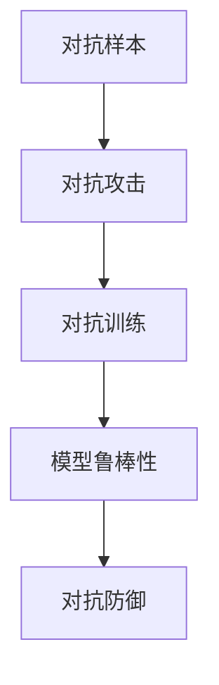

                 

## 1. 背景介绍

随着软件技术的快速演进，我们进入了所谓的"软件2.0"时代。在这个新时代中，机器学习模型已经成为了软件系统不可或缺的组成部分。从自然语言处理到计算机视觉，从推荐系统到金融预测，机器学习模型被广泛应用于各行各业，极大地提升了软件的智能化水平和用户体验。然而，随着模型复杂度的不断增加，软件系统的脆弱性也随之暴露。特别是在对抗样本攻击下，软件系统的稳定性、安全性和可信性受到了严重挑战。本文将从对抗样本的概念、原理、影响以及防御策略等多个方面进行深入探讨，揭示软件2.0时代的脆弱性，并提出一些切实可行的防护措施。

## 2. 核心概念与联系

### 2.1 核心概念概述

为了更好地理解对抗样本攻击，我们先梳理几个关键概念及其之间的联系：

1. **对抗样本（Adversarial Samples）**：指在数据空间内，对原始数据进行微小扰动后生成的样本，这些扰动后样本虽然对人类观察者不易察觉，但对机器学习模型来说，却会导致极大的性能下降，甚至模型失效。

2. **对抗攻击（Adversarial Attacks）**：指攻击者通过生成对抗样本，破坏机器学习模型的预测能力。对抗攻击可以分为多种类型，如语法欺骗（Semantic Attack）、语义欺骗（Semantic Attack）、语音欺骗（Acoustic Attack）等。

3. **对抗训练（Adversarial Training）**：指在模型训练过程中，加入对抗样本作为负样本进行训练，增强模型的鲁棒性和抗攻击能力。

4. **模型鲁棒性（Model Robustness）**：指模型面对对抗样本时，仍能保持较高性能的能力。

5. **对抗防御（Adversarial Defense）**：指在模型部署后，通过各种方法提高模型的鲁棒性，防止对抗样本攻击。

这些概念共同构成了对抗样本攻击的基本框架，帮助研究者从不同角度理解并应对这一挑战。

### 2.2 核心概念原理和架构的 Mermaid 流程图



该流程图展示了对抗样本攻击的基本流程：
1. 攻击者生成对抗样本。
2. 将对抗样本作为攻击手段，破坏模型性能。
3. 在模型训练中加入对抗样本，提升模型鲁棒性。
4. 在模型部署后，采取多种方法提高模型鲁棒性。

## 3. 核心算法原理 & 具体操作步骤

### 3.1 算法原理概述

对抗样本攻击的根本原理是利用模型对于数据的微小扰动高度敏感的特性。通过对模型训练数据进行微小扰动，可以使模型学习到对抗样本，进而生成更多的对抗样本。这些对抗样本在输入给模型时，会导致模型输出结果的显著偏差。

对抗攻击的数学原理可以简单表述为：对于模型 $f$ 和样本 $x$，如果存在一个扰动 $\delta$，使得 $f(x + \delta) \neq f(x)$，那么 $x + \delta$ 就是对抗样本。对抗样本生成的过程可以用如下数学公式表示：

$$
x' = x + \delta
$$

其中，$x$ 是原始样本，$x'$ 是对抗样本，$\delta$ 是对抗扰动。

### 3.2 算法步骤详解

对抗样本攻击的典型步骤包括：
1. **生成对抗样本**：在原始样本上加入扰动，生成对抗样本。
2. **检测对抗样本**：使用各种技术手段检测样本是否为对抗样本。
3. **利用对抗样本攻击**：将对抗样本输入模型，造成模型输出错误。
4. **防御对抗攻击**：增强模型鲁棒性，防止对抗攻击。

下面以图像对抗样本攻击为例，详细讲解这些步骤：

**Step 1: 生成对抗样本**

对抗样本生成方法有多种，常见的有FGSM（Fast Gradient Sign Method）、PGD（Projected Gradient Descent）等。以FGSM为例，其生成过程如下：

1. 随机初始化扰动向量 $\delta$，大小与原始样本 $x$ 相同。
2. 计算梯度 $\nabla_{x} L(f(x))$，其中 $L(f(x))$ 是模型的损失函数，$f(x)$ 是模型的输出。
3. 将梯度乘以一个超参数 $\epsilon$，得到扰动向量 $\delta = \epsilon \nabla_{x} L(f(x))$。
4. 将扰动向量加到原始样本 $x$ 上，得到对抗样本 $x' = x + \delta$。

**Step 2: 检测对抗样本**

对抗样本检测方法包括但不限于：
1. 梯度掩蔽（Gradient Masking）：检查梯度的变化情况，如果梯度变化极大，则可能是对抗样本。
2. 离群值检测（Outlier Detection）：利用统计学方法检测数据是否异常。
3. 分布检测（Distribution Detection）：检查样本是否符合原始数据分布。

**Step 3: 利用对抗样本攻击**

攻击者将生成的对抗样本输入模型，观察模型的输出结果。如果模型输出错误，则攻击成功。

**Step 4: 防御对抗攻击**

防御方法包括但不限于：
1. 对抗训练：在训练过程中加入对抗样本，增强模型鲁棒性。
2. 梯度截断（Gradient Clipping）：限制梯度的范围，防止模型学习到对抗样本。
3. 噪声注入（Noise Injection）：在输入数据中加入噪声，防止模型学习到对抗样本。
4. 模型蒸馏（Model Distillation）：利用原始模型输出和对抗样本输出来训练新模型。

### 3.3 算法优缺点

对抗样本攻击的优点在于，可以通过生成对抗样本，以较低的代价对模型进行攻击，揭示模型的脆弱性。这种方法简单易行，不需要复杂的攻击设备。

然而，对抗样本攻击的缺点也非常明显：
1. 依赖模型结构：对抗样本攻击需要深入了解模型结构和优化器特性，才能有效生成对抗样本。
2. 难以检测：对抗样本在视觉上往往与原始样本差别极小，难以通过传统手段检测。
3. 鲁棒性差：对抗样本攻击的效果依赖于对抗样本生成的方法和参数设置，一旦对抗样本生成方法被揭露，攻击效果将大大降低。

对抗训练的优点在于，通过在训练过程中加入对抗样本，能够增强模型的鲁棒性，提高模型的防御能力。然而，对抗训练也存在以下缺点：
1. 增加计算成本：对抗训练需要额外计算梯度，增加了训练时间和计算资源。
2. 对抗训练后模型的泛化能力可能下降：对抗训练可能会导致模型在正常数据上的性能下降。
3. 对抗训练参数敏感：对抗训练的参数设置（如对抗样本数量、扰动大小等）对模型的鲁棒性有较大影响。

## 4. 数学模型和公式 & 详细讲解 & 举例说明

### 4.1 数学模型构建

对抗样本攻击的数学模型构建基于以下假设：
1. 模型是可微分的。
2. 攻击者知道模型的损失函数和优化器参数。
3. 攻击者能够控制扰动向量 $\delta$ 的生成过程。

攻击者的目标是找到最小的扰动 $\delta$，使得对抗样本 $x'$ 能够欺骗模型。设模型的损失函数为 $L(f(x'))$，攻击者的目标是：

$$
\min_{\delta} L(f(x + \delta))
$$

### 4.2 公式推导过程

以FGSM攻击为例，推导对抗样本生成的过程。设模型输出为 $y = f(x)$，其中 $f$ 为模型，$x$ 为输入样本。对抗样本生成的公式如下：

$$
x' = x + \epsilon \nabla_{x} L(f(x))
$$

其中，$\epsilon$ 为扰动向量的超参数，$\nabla_{x} L(f(x))$ 为梯度向量。

### 4.3 案例分析与讲解

以CIFAR-10图像分类任务为例，介绍对抗样本攻击的过程：

1. 假设我们有一个预先训练好的卷积神经网络，用于图像分类。
2. 攻击者选取CIFAR-10中的样本 $x$，并使用FGSM生成对抗样本 $x'$。
3. 将对抗样本 $x'$ 输入模型，观察模型输出结果是否发生变化。
4. 如果模型输出错误，则攻击成功。

## 5. 项目实践：代码实例和详细解释说明

### 5.1 开发环境搭建

在进行对抗样本攻击的实践前，我们需要准备好开发环境。以下是使用Python进行PyTorch开发的环境配置流程：

1. 安装Anaconda：从官网下载并安装Anaconda，用于创建独立的Python环境。

2. 创建并激活虚拟环境：
```bash
conda create -n pytorch-env python=3.8 
conda activate pytorch-env
```

3. 安装PyTorch：根据CUDA版本，从官网获取对应的安装命令。例如：
```bash
conda install pytorch torchvision torchaudio cudatoolkit=11.1 -c pytorch -c conda-forge
```

4. 安装对抗样本攻击的库：
```bash
pip install adversarial-robustness-toolbox
```

5. 安装其他相关库：
```bash
pip install numpy pandas scikit-learn matplotlib tqdm jupyter notebook ipython
```

完成上述步骤后，即可在`pytorch-env`环境中开始对抗样本攻击的实践。

### 5.2 源代码详细实现

以下是使用PyTorch进行图像分类任务对抗样本攻击的代码实现：

```python
import torch
import torchvision.transforms as transforms
import torchvision.datasets as datasets
import adversarial_robustness_toolbox as art
from adversarial_robustness_toolbox.attacks import FGSM

# 加载CIFAR-10数据集
train_data = datasets.CIFAR10(root='./data', train=True, download=True, transform=transforms.ToTensor())
test_data = datasets.CIFAR10(root='./data', train=False, download=True, transform=transforms.ToTensor())

# 加载模型
model = torchvision.models.resnet18(pretrained=True)
model.eval()

# 设置对抗攻击参数
epsilon = 0.01
num_iter = 20
target_label = 3

# 定义对抗样本生成函数
def generate_adversarial_example(x, target_label):
    x_adv = art.utils.adversarial_cleaning(model, x, target_label, epsilon=epsilon, num_iter=num_iter)
    return x_adv

# 生成对抗样本
x, y = next(iter(test_data))
x_adv = generate_adversarial_example(x, target_label)

# 检测对抗样本
y_pred = model(x_adv)
print('Predicted label:', y_pred.argmax().item())
print('True label:', y)
```

在上述代码中，我们使用了`adversarial_robustness_toolbox`库中的`FGSM`函数，生成对抗样本。具体步骤如下：
1. 加载CIFAR-10数据集和预训练模型。
2. 设置对抗样本的扰动大小和迭代次数。
3. 生成对抗样本。
4. 检测对抗样本的输出结果。

### 5.3 代码解读与分析

让我们再详细解读一下关键代码的实现细节：

**CIFAR-10数据集**：
- `datasets.CIFAR10`：用于加载CIFAR-10数据集。
- `transforms.ToTensor()`：将数据转换为PyTorch张量，方便模型处理。

**模型加载**：
- `torchvision.models.resnet18(pretrained=True)`：加载预训练的ResNet-18模型。

**对抗样本生成**：
- `generate_adversarial_example(x, target_label)`：定义生成对抗样本的函数，使用`adversarial_cleaning`函数生成对抗样本。

**对抗样本检测**：
- `y_pred = model(x_adv)`：将对抗样本输入模型，获取模型输出。
- `y_pred.argmax().item()`：获取模型输出的预测标签。

**代码展示**：
```python
print('Predicted label:', y_pred.argmax().item())
print('True label:', y)
```

**运行结果展示**：
- 输出预测标签和真实标签，检查对抗样本是否成功欺骗模型。

## 6. 实际应用场景

### 6.1 安全验证

在安全验证领域，对抗样本攻击可以用于检测模型的鲁棒性和安全性。例如，金融机构可以利用对抗样本攻击，检测模型的风险评估和欺诈检测能力。

### 6.2 自动驾驶

在自动驾驶领域，对抗样本攻击可以用于检测模型的鲁棒性和可靠性。例如，通过生成对抗样本，检测自动驾驶模型是否能够在面对复杂交通环境时，做出正确决策。

### 6.3 网络安全

在网络安全领域，对抗样本攻击可以用于检测模型的漏洞和安全防护能力。例如，网络安全公司可以利用对抗样本攻击，检测入侵检测系统(IDS)和入侵防御系统(IPS)的防护效果。

## 7. 工具和资源推荐

### 7.1 学习资源推荐

为了帮助开发者系统掌握对抗样本攻击的理论基础和实践技巧，这里推荐一些优质的学习资源：

1. 《Adversarial Machine Learning》系列书籍：详细介绍了对抗样本攻击的基本概念、方法和防御策略。
2. ICML 2017论文《Towards Evasion Adversarial Examples》：介绍了基于梯度下降的对抗样本生成方法和防御策略。
3 CSAPP课程《Computer Systems: A Programmer's Perspective》：介绍了计算机系统的底层原理，帮助理解对抗样本攻击的原理。

### 7.2 开发工具推荐

高效的开发离不开优秀的工具支持。以下是几款用于对抗样本攻击开发的常用工具：

1. PyTorch：基于Python的开源深度学习框架，灵活动态的计算图，适合快速迭代研究。
2. TensorFlow：由Google主导开发的开源深度学习框架，生产部署方便，适合大规模工程应用。
3. Adversarial Robustness Toolbox：开源的对抗样本攻击工具库，支持多种对抗样本生成方法和防御策略。
4. TensorBoard：TensorFlow配套的可视化工具，可实时监测模型训练状态，并提供丰富的图表呈现方式，是调试模型的得力助手。
5. Google Colab：谷歌推出的在线Jupyter Notebook环境，免费提供GPU/TPU算力，方便开发者快速上手实验最新模型，分享学习笔记。

合理利用这些工具，可以显著提升对抗样本攻击的开发效率，加快创新迭代的步伐。

### 7.3 相关论文推荐

对抗样本攻击的研究源于学界的持续研究。以下是几篇奠基性的相关论文，推荐阅读：

1. Adversarial Examples in the Physical World（即 FGSM 原论文）：提出FGSM攻击方法，成为对抗样本攻击的经典。
2. Deep Learning Under the Adversarial Lights（即 PGD 原论文）：提出PGD攻击方法，成为对抗样本攻击的另一经典。
3. Practical Black-box Adversarial Attacks on Deep Learning Models（即L-BFGS攻击原论文）：提出L-BFGS攻击方法，成为黑盒对抗样本攻击的典范。
4. Semantic Accuracy: Evaluating Adversarial Examples in Natural Language Processing（即语义准确性论文）：提出语义准确性指标，评估对抗样本在自然语言处理任务上的效果。
5. Fast Adversarial Examples Generation via Nearest-Parameter Attack（即邻参数攻击原论文）：提出邻参数攻击方法，进一步提升对抗样本生成效率。

这些论文代表了大规模语言模型微调技术的发展脉络。通过学习这些前沿成果，可以帮助研究者把握学科前进方向，激发更多的创新灵感。

## 8. 总结：未来发展趋势与挑战

### 8.1 总结

本文对对抗样本攻击的概念、原理、影响以及防御策略进行了全面系统的介绍。首先阐述了对抗样本攻击的基本原理和应用场景，揭示了软件2.0时代下的脆弱性。其次，从算法原理、具体操作步骤到实际应用，详细讲解了对抗样本攻击的实现过程，并给出了对抗样本生成和防御的代码实现。最后，本文展望了对抗样本攻击的未来发展趋势，并探讨了面临的挑战。

通过本文的系统梳理，可以看到，对抗样本攻击已经成为软件2.0时代下的重要挑战。如何更好地理解和应对这一挑战，还需要我们继续探索和努力。

### 8.2 未来发展趋势

展望未来，对抗样本攻击的研究将呈现以下几个发展趋势：

1. 对抗样本生成技术更加先进。未来的对抗样本生成方法将更加智能、高效，能够在更短的时间内生成更有效的对抗样本。
2. 对抗防御策略更加多样。未来的对抗防御策略将更加灵活，能够适应多种攻击手段。
3. 对抗样本攻击的范围将进一步扩大。未来的对抗样本攻击将不仅仅限于图像、语音等领域，还将扩展到更多领域，如自然语言处理、推荐系统等。
4. 对抗样本攻击的伦理和安全问题将更加突出。未来的对抗样本攻击将更加复杂，需要更加严格的伦理和安全约束。

以上趋势凸显了对抗样本攻击技术的发展方向。这些方向的探索，必将推动对抗样本攻击技术迈向更高的台阶，为构建安全、可靠、可信的软件系统提供有力保障。

### 8.3 面临的挑战

尽管对抗样本攻击技术已经取得了一定的进展，但在迈向更加智能化、普适化应用的过程中，它仍面临着诸多挑战：

1. 对抗样本生成成本高。现有的对抗样本生成方法需要耗费大量时间和计算资源，攻击成本较高。如何降低对抗样本生成成本，提高生成效率，是一个重要问题。
2. 对抗样本检测难度大。对抗样本在视觉上往往与原始样本差别极小，难以通过传统手段检测。如何设计更加有效的对抗样本检测方法，是一个关键问题。
3. 对抗样本攻击的鲁棒性差。对抗样本攻击的效果依赖于对抗样本生成方法和参数设置，一旦对抗样本生成方法被揭露，攻击效果将大大降低。如何提升对抗样本攻击的鲁棒性，是一个挑战。
4. 对抗样本攻击的伦理和安全问题。对抗样本攻击可能会带来伦理和安全问题，如误导性、歧视性等。如何规范对抗样本攻击的使用，保护社会公众的安全，是一个重要问题。

这些挑战都需要我们在理论、技术、伦理等多方面进行深入研究，才能应对未来的挑战。

### 8.4 未来突破

面对对抗样本攻击面临的挑战，未来的研究需要在以下几个方面寻求新的突破：

1. 探索无监督和半监督对抗样本生成方法。摆脱对大量标注数据的依赖，利用自监督学习、主动学习等无监督和半监督范式，最大限度利用非结构化数据，实现更加灵活高效的对抗样本生成。
2. 研究对抗样本检测技术。开发更加智能、高效的对抗样本检测方法，提高对抗样本检测的准确性和实时性。
3. 提升对抗样本攻击的鲁棒性。开发更加鲁棒、高效的对抗样本生成方法，使对抗样本攻击更加难以检测和防御。
4. 结合伦理和安全的对抗样本攻击。制定更加严格的伦理和安全规范，确保对抗样本攻击在符合伦理和安全要求的前提下进行。
5. 引入更多先验知识。将符号化的先验知识，如知识图谱、逻辑规则等，与神经网络模型进行巧妙融合，引导对抗样本攻击过程学习更准确、合理的对抗样本。

这些研究方向的探索，必将引领对抗样本攻击技术迈向更高的台阶，为构建安全、可靠、可信的软件系统提供有力保障。面向未来，对抗样本攻击技术还需要与其他人工智能技术进行更深入的融合，如知识表示、因果推理、强化学习等，多路径协同发力，共同推动自然语言理解和智能交互系统的进步。只有勇于创新、敢于突破，才能不断拓展对抗样本攻击的边界，让智能技术更好地造福人类社会。

## 9. 附录：常见问题与解答

**Q1：对抗样本攻击是否可以用于检测模型的鲁棒性？**

A: 是的，对抗样本攻击可以用于检测模型的鲁棒性。通过生成对抗样本，检测模型是否能够在面对攻击时，保持稳定输出，从而评估模型的鲁棒性。

**Q2：对抗样本攻击是否可以用于提升模型的鲁棒性？**

A: 对抗训练是提升模型鲁棒性的一种常见方法，通过在训练过程中加入对抗样本，增强模型的鲁棒性，提高模型的抗攻击能力。

**Q3：对抗样本攻击是否具有广泛的应用前景？**

A: 是的，对抗样本攻击具有广泛的应用前景。除了安全验证和自动驾驶，对抗样本攻击还可以应用于图像分类、自然语言处理、推荐系统等多个领域。

**Q4：对抗样本攻击是否会对模型性能产生负面影响？**

A: 对抗样本攻击会对模型性能产生负面影响。对抗样本攻击会使得模型在正常数据上的性能下降，因此需要采取适当的防御措施，避免对抗样本攻击对模型性能的负面影响。

**Q5：如何设计有效的对抗样本攻击策略？**

A: 设计有效的对抗样本攻击策略需要考虑多个因素，如对抗样本生成方法、攻击目标、攻击手段等。需要深入了解模型的特性，并结合实际应用场景进行设计。

通过本文的系统梳理，可以看到，对抗样本攻击已经成为软件2.0时代下的重要挑战。如何更好地理解和应对这一挑战，还需要我们继续探索和努力。只有在理论、技术、工程、伦理等多个维度协同发力，才能构建安全、可靠、可信的软件系统。

