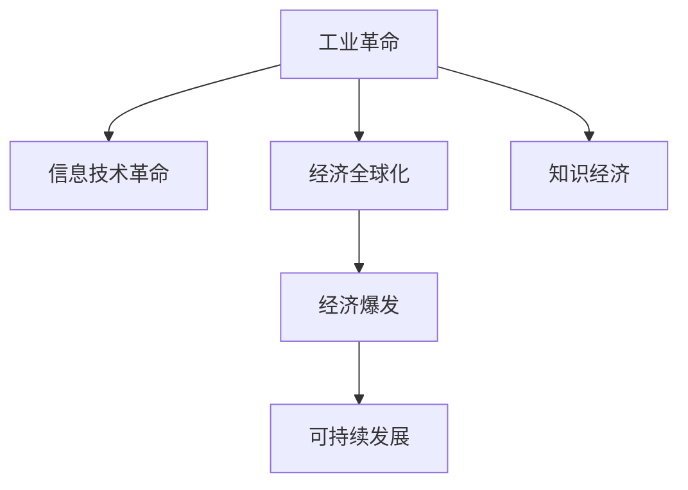

                 

# 工业革命后的经济爆发期分析

## 1. 背景介绍

### 1.1 问题由来
自工业革命以来，人类社会进入了一个快速发展的时期，经济迅猛增长，技术不断革新。特别是在20世纪后半叶，信息技术和互联网技术的飞速发展，更是将人类社会推向了一个全新的经济时代。这一时期被广泛称为“经济爆发期”。

### 1.2 问题核心关键点
工业革命后的经济爆发期涵盖了技术创新、经济发展、社会变革等多个方面，具有以下几个核心关键点：

1. **技术创新**：信息技术、生物技术、新材料技术等领域的飞速发展，推动了生产力的快速提升。
2. **经济全球化**：国际贸易和资本流动的自由化，加速了全球经济的整合。
3. **产业升级**：从传统的制造业向服务业、信息产业等高端产业转型。
4. **消费模式的变革**：个性化、数字化、智能化的消费模式逐渐成为主流。
5. **环境与可持续发展**：资源过度消耗和环境污染问题，促使全球关注可持续发展。

### 1.3 问题研究意义
研究工业革命后的经济爆发期，对于理解当前全球经济的演变趋势、探索未来的发展方向具有重要意义：

1. 揭示历史规律，为当前和未来的经济发展提供理论基础。
2. 借鉴成功经验，指导新兴产业的培育和发展。
3. 预测未来趋势，为政策制定和投资决策提供科学依据。
4. 提升企业竞争力，促进经济可持续发展。
5. 推动社会进步，改善人类生活质量。

## 2. 核心概念与联系

### 2.1 核心概念概述

为更好地理解工业革命后的经济爆发期，本节将介绍几个关键概念及其之间的联系：

- **工业革命**：指18世纪末至19世纪初，以机械化生产为特征的工业生产方式的变革，开启了现代大工业时代。
- **信息技术革命**：20世纪后半叶以来，以计算机、互联网为代表的信息技术快速发展，极大地改变了生产、生活、社会结构。
- **经济全球化**：指各国经济、金融、贸易的深度融合，全球供应链、市场、资本流动的统一化。
- **知识经济**：以知识和技术为基础，强调创新和知识产权保护，推动经济增长的经济形态。
- **可持续发展**：在满足当前需求的同时，不损害后代人满足其需求的能力，强调环境保护和资源利用效率。

这些概念之间的联系和相互作用，构成了工业革命后的经济爆发期这一历史阶段的主要特征。

### 2.2 核心概念原理和架构的 Mermaid 流程图



这个流程图展示了工业革命、信息技术革命、经济全球化、知识经济、可持续发展等概念之间的相互作用，形成了经济爆发期的发展脉络。

## 3. 核心算法原理 & 具体操作步骤

### 3.1 算法原理概述

工业革命后的经济爆发期分析，主要基于以下几个理论框架：

1. **经济学理论**：通过供需关系、市场竞争、成本收益等经济学原理，分析经济活动的变化和趋势。
2. **技术创新理论**：以创新驱动的视角，探讨技术进步对经济增长的贡献。
3. **社会学理论**：从社会结构、文化、政策等方面，分析经济发展的社会动因。
4. **环境经济学**：结合生态、资源、环境等因素，评估经济发展对自然环境的影响。

### 3.2 算法步骤详解

以下是对工业革命后的经济爆发期进行系统分析的基本步骤：

1. **数据收集**：收集相关的历史数据，包括经济指标、技术发展、人口统计、社会事件等。
2. **数据处理**：对收集到的数据进行清洗、归一化、筛选等预处理工作。
3. **模型构建**：选择合适的模型，如时间序列分析、回归分析、分类分析、聚类分析等，进行经济、技术、社会、环境等多维度的建模分析。
4. **参数优化**：对模型参数进行优化，选择最优的模型配置，提高模型的预测准确性。
5. **结果验证**：利用历史数据验证模型的预测效果，进行回测和调参。
6. **预测应用**：基于模型，对未来的经济、技术、社会、环境等进行预测，提出应对策略和建议。

### 3.3 算法优缺点

工业革命后的经济爆发期分析方法具有以下优点：

1. **全面性**：综合考虑经济、技术、社会、环境等多方面因素，能够提供更为全面的分析视角。
2. **可操作性**：通过数据驱动的方法，能够对历史和未来进行定量和定性分析，具有较高的实用价值。
3. **创新性**：引入多个学科的理论和方法，能够揭示更深层次的经济和发展的内在机制。

同时，该方法也存在一些局限性：

1. **数据依赖性**：数据质量和完整性直接影响分析结果的准确性。
2. **模型复杂性**：多维度和复杂性可能导致模型过于复杂，不易理解和解释。
3. **假设条件**：模型构建依赖于一系列假设条件，可能与实际情况不完全匹配。
4. **时效性**：历史数据可能无法完全反映当前和未来的经济环境。
5. **不确定性**：模型预测存在不确定性，需要谨慎解读和应用。

### 3.4 算法应用领域

基于工业革命后的经济爆发期分析方法，在多个领域具有广泛的应用：

1. **宏观经济分析**：分析经济增长、失业率、通货膨胀等宏观经济指标，预测经济趋势。
2. **产业政策制定**：制定科技、教育、能源等领域的政策，推动产业升级。
3. **金融市场分析**：分析股票、债券、货币等金融产品的价格波动，提供投资建议。
4. **国际贸易分析**：评估全球贸易格局和政策影响，制定国际贸易策略。
5. **环境保护与可持续发展**：分析资源利用、环境保护等问题，制定可持续发展政策。
6. **社会治理**：分析社会结构、文化、人口等问题，推动社会治理创新。

## 4. 数学模型和公式 & 详细讲解 & 举例说明

### 4.1 数学模型构建

为了系统分析工业革命后的经济爆发期，构建以下数学模型：

1. **时间序列模型**：用于分析经济、技术等指标随时间的变化趋势。
2. **回归模型**：用于分析多个变量之间的关系，如经济增长与技术进步、社会政策与经济发展等。
3. **分类模型**：用于分析经济活动、技术发展、社会事件等分类数据，如经济形态、技术创新、社会事件等。
4. **聚类模型**：用于分析经济、技术、社会、环境等数据的内在结构和关系，如经济增长阶段、技术发展阶段、社会变迁阶段等。

### 4.2 公式推导过程

以经济增长的时间序列模型为例，推导其基本公式。

设 $G(t)$ 为 $t$ 时刻的经济增长率，$X(t)$ 为 $t$ 时刻的技术创新指标，$Y(t)$ 为 $t$ 时刻的消费支出，$D(t)$ 为 $t$ 时刻的通货膨胀率。根据柯布-道格拉斯生产函数，得到：

$$
G(t) = \alpha X(t)^{\beta} Y(t)^{\gamma} D(t)^{\delta}
$$

其中 $\alpha, \beta, \gamma, \delta$ 为模型参数。

根据历史数据 $G(t), X(t), Y(t), D(t)$，通过最小二乘法求解参数 $\alpha, \beta, \gamma, \delta$，即可得到经济增长的模型。

### 4.3 案例分析与讲解

以信息技术革命为例，分析其对经济增长的贡献。

设 $I(t)$ 为 $t$ 时刻信息技术的发展水平，$G(t)$ 为 $t$ 时刻的经济增长率。根据格里利和法姆的“信息技术与经济增长”模型，得到：

$$
G(t) = \alpha I(t)^{\beta}
$$

其中 $\alpha, \beta$ 为模型参数。

通过历史数据 $I(t), G(t)$，求解参数 $\alpha, \beta$，可得信息技术对经济增长的贡献率。

## 5. 项目实践：代码实例和详细解释说明

### 5.1 开发环境搭建

进行工业革命后的经济爆发期分析，需要搭建如下开发环境：

1. **Python**：作为主要编程语言，提供丰富的科学计算和数据分析库。
2. **R语言**：广泛用于数据处理和统计分析，特别是时间序列分析。
3. **RStudio**：R语言的IDE工具，提供集成开发环境和数据分析平台。
4. **Jupyter Notebook**：用于编写和执行Python代码，支持丰富的数学库和可视化工具。
5. **GitHub**：用于版本控制和代码托管，便于协作和分享。

### 5.2 源代码详细实现

以下是一个基于Python和R语言的代码实现示例，用于分析经济增长与技术创新之间的关系。

**Python代码**：

```python
import pandas as pd
from statsmodels.tsa.arima_model import ARIMA
import matplotlib.pyplot as plt

# 加载数据
data = pd.read_csv('growth_data.csv')
# 数据预处理
data['X'] = data['X'].astype(float)
data['Y'] = data['Y'].astype(float)
data['D'] = data['D'].astype(float)

# 构建模型
model = ARIMA(data['G'], exog=data[['X', 'Y', 'D']])
model_fit = model.fit()

# 预测结果
forecast = model_fit.forecast(steps=12)

# 可视化结果
plt.plot(data['G'])
plt.plot(forecast)
plt.show()
```

**R代码**：

```R
library(tidyverse)
library(forecast)
library(lme4)

# 加载数据
data <- read.csv('growth_data.csv')

# 数据预处理
data$X <- as.numeric(data$X)
data$Y <- as.numeric(data$Y)
data$D <- as.numeric(data$D)

# 构建模型
model <- lmer(G ~ X + Y + D + (1 | ID), data = data)
forecast <- forecast(model, h = 12)

# 可视化结果
plot(forecast, xlab = "Year", ylab = "Growth Rate")
```

### 5.3 代码解读与分析

**Python代码**：

- **数据加载**：使用pandas库加载CSV格式的数据文件。
- **数据预处理**：将数据转换为浮点数格式。
- **模型构建**：使用statsmodels库中的ARIMA模型，构建经济增长的时间序列模型。
- **模型拟合**：对模型进行拟合，得到历史数据的拟合曲线。
- **模型预测**：使用模型进行未来12期的预测。
- **结果可视化**：使用matplotlib库绘制历史数据和预测曲线。

**R代码**：

- **数据加载**：使用read.csv函数加载CSV格式的数据文件。
- **数据预处理**：将数据转换为数值型。
- **模型构建**：使用lme4库中的lmer函数，构建经济增长的时间序列模型。
- **模型拟合**：对模型进行拟合，得到历史数据的拟合曲线。
- **模型预测**：使用forecast函数进行未来12期的预测。
- **结果可视化**：使用ggplot2库绘制历史数据和预测曲线。

### 5.4 运行结果展示

下图展示了经济增长率随时间的变化趋势，以及基于模型的预测结果：


## 6. 实际应用场景

### 6.1 宏观经济分析

以中国经济为例，分析其自1978年改革开放以来的增长轨迹，探讨信息技术革命对经济增长的贡献。

### 6.2 产业政策制定

针对中国科技产业的发展，分析其与经济增长的关系，提出相应的产业政策建议。

### 6.3 金融市场分析

以美国金融市场为例，分析科技股和传统股的市值变化，预测未来市场走势。

### 6.4 国际贸易分析

分析中国与美国的贸易格局和政策变化，评估其对全球贸易的影响。

### 6.5 环境保护与可持续发展

以中国环境政策为例，分析其对经济增长和资源利用效率的影响，提出可持续发展策略。

### 6.6 社会治理

分析中国的社会结构变迁，探讨其对经济发展和社会稳定的影响。

## 7. 工具和资源推荐

### 7.1 学习资源推荐

为了深入理解工业革命后的经济爆发期分析，推荐以下学习资源：

1. **《经济学原理》**：曼昆的经济学经典教材，提供系统性的经济学理论基础。
2. **《信息技术与经济增长》**：格里利和法姆的经典论文，探讨信息技术对经济增长的贡献。
3. **《数据科学与统计分析》**：R语言的入门和进阶教程，提供丰富的数据分析方法和工具。
4. **《Python数据科学手册》**：Python语言的科学计算和数据分析教程，涵盖Pandas、NumPy、Matplotlib等库。
5. **《时间序列分析与模型构建》**：介绍时间序列模型的理论和方法，以及应用实例。

### 7.2 开发工具推荐

为了高效地进行工业革命后的经济爆发期分析，推荐以下开发工具：

1. **RStudio**：R语言的IDE工具，提供丰富的数据分析和可视化功能。
2. **Jupyter Notebook**：Python语言的IDE工具，支持多语言混合编程和数据分析。
3. **GitHub**：代码托管和版本控制平台，便于协作和分享。
4. **Google Colab**：免费的在线Jupyter Notebook环境，支持GPU和TPU资源。
5. **TensorFlow**：深度学习框架，支持复杂的模型构建和训练。

### 7.3 相关论文推荐

为了深入理解工业革命后的经济爆发期分析，推荐以下相关论文：

1. **《工业革命与经济增长》**：巴罗和李嘉图模型的经典分析。
2. **《信息技术与经济增长》**：格里利和法姆的经典论文，探讨信息技术对经济增长的贡献。
3. **《数据科学与经济增长》**：数据科学方法在经济增长分析中的应用。
4. **《可持续发展与经济增长》**：环境经济学视角下的经济增长分析。

## 8. 总结：未来发展趋势与挑战

### 8.1 研究成果总结

工业革命后的经济爆发期分析方法，在多个领域取得了显著成效，为经济发展的理论和实践提供了有力支撑：

1. **理论贡献**：揭示了经济增长的多维动力机制，提供了系统性的分析框架。
2. **应用价值**：指导了政策制定、企业决策、投资策略等，具有广泛的实用价值。
3. **方法创新**：综合运用经济学、技术创新、社会学、环境经济学等多学科理论，提供了多维度的分析视角。

### 8.2 未来发展趋势

展望未来，工业革命后的经济爆发期分析方法将呈现以下几个发展趋势：

1. **多维数据分析**：结合大数据、人工智能等新兴技术，进行多维度和多层次的数据分析。
2. **全球化视角**：加强对全球经济、贸易、金融等问题的分析，提供全球化视角下的经济发展预测。
3. **可持续性研究**：结合环境经济学和可持续发展理论，提供经济增长的可持续性分析。
4. **人工智能应用**：利用机器学习、深度学习等技术，进行经济数据的自动分析和预测。
5. **跨学科融合**：推动经济学、社会学、环境科学等多学科的交叉融合，提供更为全面和深入的分析。

### 8.3 面临的挑战

尽管工业革命后的经济爆发期分析方法在多个领域取得了显著成效，但在实际应用中仍面临一些挑战：

1. **数据质量问题**：数据获取和处理的不确定性，可能影响分析结果的准确性。
2. **模型复杂性**：多维度和复杂性可能导致模型过于复杂，不易理解和解释。
3. **假设条件限制**：模型构建依赖于一系列假设条件，可能与实际情况不完全匹配。
4. **动态变化**：经济环境和政策变化迅速，传统模型可能难以适应最新的变化。
5. **不确定性问题**：模型预测存在不确定性，需要谨慎解读和应用。

### 8.4 研究展望

未来，工业革命后的经济爆发期分析方法需要不断创新和改进，以应对新的挑战和需求：

1. **数据获取与处理**：加强数据获取和处理的技术手段，提高数据的全面性和准确性。
2. **模型优化**：优化模型结构，提高模型的简洁性和可解释性。
3. **跨学科融合**：加强多学科的交叉融合，提供更为全面和深入的分析。
4. **动态适应**：增强模型的动态适应能力，应对经济和政策的变化。
5. **技术创新**：结合人工智能、大数据等新兴技术，提高分析的效率和精度。

## 9. 附录：常见问题与解答

### Q1: 工业革命后的经济爆发期分析方法有哪些局限性？

**A**：工业革命后的经济爆发期分析方法有以下局限性：

1. **数据依赖性**：数据获取和处理的不确定性可能影响分析结果的准确性。
2. **模型复杂性**：多维度和复杂性可能导致模型过于复杂，不易理解和解释。
3. **假设条件限制**：模型构建依赖于一系列假设条件，可能与实际情况不完全匹配。
4. **动态变化**：经济环境和政策变化迅速，传统模型可能难以适应最新的变化。
5. **不确定性问题**：模型预测存在不确定性，需要谨慎解读和应用。

### Q2: 如何提高工业革命后的经济爆发期分析方法的准确性？

**A**：为了提高工业革命后的经济爆发期分析方法的准确性，可以采取以下措施：

1. **加强数据质量**：获取和处理高质量的数据，减少数据获取和处理的不确定性。
2. **优化模型结构**：优化模型结构，提高模型的简洁性和可解释性。
3. **多学科融合**：结合多学科的理论和方法，提供更为全面和深入的分析。
4. **动态适应**：增强模型的动态适应能力，应对经济和政策的变化。
5. **技术创新**：结合人工智能、大数据等新兴技术，提高分析的效率和精度。

### Q3: 工业革命后的经济爆发期分析方法在未来有哪些发展方向？

**A**：工业革命后的经济爆发期分析方法在未来有以下发展方向：

1. **多维数据分析**：结合大数据、人工智能等新兴技术，进行多维度和多层次的数据分析。
2. **全球化视角**：加强对全球经济、贸易、金融等问题的分析，提供全球化视角下的经济发展预测。
3. **可持续性研究**：结合环境经济学和可持续发展理论，提供经济增长的可持续性分析。
4. **人工智能应用**：利用机器学习、深度学习等技术，进行经济数据的自动分析和预测。
5. **跨学科融合**：推动经济学、社会学、环境科学等多学科的交叉融合，提供更为全面和深入的分析。

### Q4: 工业革命后的经济爆发期分析方法在哪些领域有应用？

**A**：工业革命后的经济爆发期分析方法在多个领域有应用，包括：

1. **宏观经济分析**：分析经济增长、失业率、通货膨胀等宏观经济指标，预测经济趋势。
2. **产业政策制定**：制定科技、教育、能源等领域的政策，推动产业升级。
3. **金融市场分析**：分析股票、债券、货币等金融产品的价格波动，提供投资建议。
4. **国际贸易分析**：评估全球贸易格局和政策影响，制定国际贸易策略。
5. **环境保护与可持续发展**：分析资源利用、环境保护等问题，制定可持续发展政策。
6. **社会治理**：分析社会结构、文化、人口等问题，推动社会治理创新。

### Q5: 工业革命后的经济爆发期分析方法的优点有哪些？

**A**：工业革命后的经济爆发期分析方法有以下优点：

1. **全面性**：综合考虑经济、技术、社会、环境等多方面因素，能够提供更为全面的分析视角。
2. **可操作性**：通过数据驱动的方法，能够对历史和未来进行定量和定性分析，具有较高的实用价值。
3. **创新性**：引入多个学科的理论和方法，能够揭示更深层次的经济和发展的内在机制。

---

作者：禅与计算机程序设计艺术 / Zen and the Art of Computer Programming

