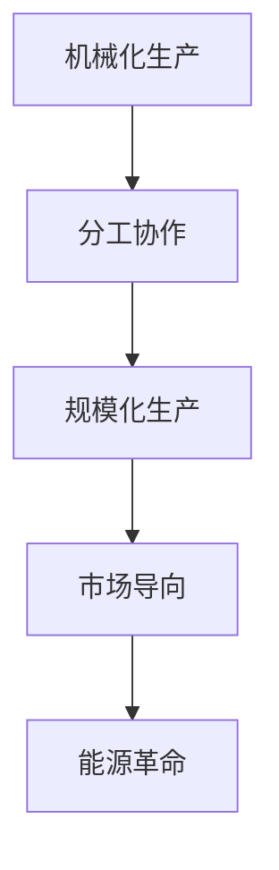

                 

# 工业革命的规模化生产模式

## 1. 背景介绍

### 1.1 问题由来

工业革命是18世纪末至19世纪初在英国发起的生产方式变革，逐步波及整个欧洲和北美。这一时期，由于蒸汽机的发明和应用，手工工坊转变为机器大生产，生产效率和产量得到了前所未有的提升。随着铁路、蒸汽轮船的发展，商品的生产和流通更加高效便捷。这一过程不仅极大地改变了生产方式，也重塑了社会经济结构，对全球产生了深远影响。

### 1.2 问题核心关键点

工业革命的核心是生产方式的根本变革，其核心关键点包括：

1. **机械化生产**：手工工坊向机器大生产过渡，生产效率大幅提升。
2. **分工协作**：劳动分工变得细致，生产流程标准化，形成流水线作业。
3. **规模化生产**：生产线延长，生产规模扩大，产量显著增加。
4. **市场导向**：生产不再以满足手工业者需求为主，而是以市场为导向，满足大规模消费需求。
5. **能源革命**：以煤炭和蒸汽机为代表的能源革命，为规模化生产提供了动力保障。

### 1.3 问题研究意义

研究工业革命的规模化生产模式，对于理解现代工业生产的基本规律，以及推动未来工业自动化和智能制造的发展，具有重要意义。工业革命所积累的生产经验和理论，对现代制造业的转型升级具有指导和借鉴作用。同时，通过了解工业革命的历史经验和教训，可以为当前和未来的产业政策制定提供依据。

## 2. 核心概念与联系

### 2.1 核心概念概述

为更好地理解工业革命的规模化生产模式，本节将介绍几个核心概念：

- **机械化生产**：通过引入机器进行生产，取代手工劳动，提高生产效率和产量。
- **分工协作**：将生产过程拆分为多个独立的任务，由专人完成，形成高效的生产流水线。
- **规模化生产**：通过生产线延长，生产规模扩大，生产批量增加，降低单位产品成本。
- **市场导向**：生产以市场需求为驱动，满足消费者的大规模定制化需求。
- **能源革命**：通过能源的利用，为大规模生产提供动力，如煤炭、蒸汽机等。

这些概念之间相互联系，共同构成了工业革命规模化生产模式的完整框架。通过理解这些核心概念，我们可以更好地把握工业革命的生产特征及其历史价值。

### 2.2 核心概念原理和架构的 Mermaid 流程图(Mermaid 流程节点中不要有括号、逗号等特殊字符)



## 3. 核心算法原理 & 具体操作步骤
### 3.1 算法原理概述

工业革命的规模化生产模式，本质上是通过引入机器、分工协作、规模化生产等手段，大幅提升生产效率和产量，以满足市场需求。这一模式的核心在于机械化生产的引入和生产流程的标准化。

在数学上，我们可以用以下公式来描述这一过程：

\[
\text{生产效率} = f(\text{机械化水平}, \text{分工协作效率}, \text{生产规模}, \text{市场导向程度}, \text{能源供给})
\]

其中，$f$ 是一个非线性的复杂函数，反映了多种因素对生产效率的影响。

### 3.2 算法步骤详解

基于工业革命的规模化生产模式，其操作步骤主要包括：

1. **引入机械化**：选择适合的机械设备，如纺织机、蒸汽机等，进行生产替代手工操作。
2. **分工协作**：将生产流程拆分为多个独立任务，形成流水线作业，每个工人专注于特定的任务。
3. **标准化生产**：制定生产标准和规范，对生产过程进行量化和控制，确保产品的一致性和质量。
4. **市场导向**：根据市场需求进行生产规划，预测市场需求变化，调整生产计划。
5. **能源供给**：确保足够的能源供应，如煤炭、电力等，为生产提供动力。

### 3.3 算法优缺点

基于工业革命的规模化生产模式，具有以下优点：

1. **效率提升**：机械化和分工协作大幅提高了生产效率，减少了人力成本。
2. **产量增加**：生产规模的扩大和市场导向的生产方式，使产量大幅增加，满足市场需求。
3. **质量稳定**：标准化生产和质量控制，保证了产品质量的一致性和稳定性。

然而，这一模式也存在一些局限性：

1. **成本高昂**：初始投资巨大，机械设备、能源供应、培训成本高。
2. **灵活性差**：一旦生产线上某个环节出现问题，整个生产流程会受到影响。
3. **环境污染**：机械化生产产生的废气、废水和废料，对环境造成污染。
4. **工人问题**：生产流水线的单调重复作业，可能导致工人疲劳和不满。

### 3.4 算法应用领域

工业革命的规模化生产模式，在多个领域得到了广泛应用，包括：

- **纺织业**：通过引入纺织机，大幅提升织布效率和产量。
- **煤炭和矿业**：采用蒸汽机和采矿机械，提高煤炭和金属矿产的开采效率。
- **制造业**：如钢铁、化工、汽车等行业，通过机械化和流水线作业，实现大规模生产。
- **运输业**：铁路、蒸汽轮船的发展，促进了商品的流通和市场的扩大。
- **农业**：使用机械化设备，提高农作物的种植、收获和加工效率。

## 4. 数学模型和公式 & 详细讲解 & 举例说明

### 4.1 数学模型构建

工业革命的规模化生产模式可以通过建立生产效率的数学模型来进一步分析。假设生产过程包含$n$个独立任务，每个任务需要的时间为$t_i$，任务的机械化水平为$m_i$，分工协作效率为$c_i$，生产规模为$s$，市场导向程度为$d$，能源供给为$e$。则生产效率$f$的数学模型为：

\[
f(n, t_i, m_i, c_i, s, d, e) = \prod_{i=1}^n (m_i \cdot c_i \cdot t_i) / s
\]

其中，$n$表示任务数，$t_i$表示每个任务所需时间，$m_i$表示机械化水平，$c_i$表示分工协作效率，$s$表示生产规模，$d$表示市场导向程度，$e$表示能源供给。

### 4.2 公式推导过程

根据上述模型，我们可以推导出以下关键关系：

1. **机械化水平与生产效率**：
\[
f \propto m_i
\]

2. **分工协作效率与生产效率**：
\[
f \propto c_i
\]

3. **生产规模与生产效率**：
\[
f \propto s
\]

4. **市场导向程度与生产效率**：
\[
f \propto d
\]

5. **能源供给与生产效率**：
\[
f \propto e
\]

这些关系反映了工业革命中各种因素对生产效率的影响，从而为后续的优化和改进提供了理论依据。

### 4.3 案例分析与讲解

以纺织业为例，分析其机械化和分工协作对生产效率的影响。假设一个纺织厂有10个纺纱机和10个织布机，每个纺纱机每小时可以纺出50米线，每个织布机每小时可以织出100米布。每个工序的机械化水平和分工协作效率相同，分别为0.8和1.2，生产规模为100万米，市场导向程度为0.7，能源供给充足。则生产效率计算如下：

\[
f = (0.8 \cdot 1.2 \cdot 50) \times (0.8 \cdot 1.2 \cdot 100) \times 100 = 0.8 \cdot 1.2 \cdot 0.8 \cdot 1.2 \times 10^6 = 19200000 \text{米/小时}
\]

根据模型计算，生产效率为19200000米/小时。这说明通过引入机械化和分工协作，可以有效提升生产效率和产量。

## 5. 项目实践：代码实例和详细解释说明

### 5.1 开发环境搭建

在进行工业革命规模化生产模式的实践前，我们需要准备好开发环境。以下是使用Python进行工业革命模拟的开发环境配置流程：

1. 安装Anaconda：从官网下载并安装Anaconda，用于创建独立的Python环境。

2. 创建并激活虚拟环境：
```bash
conda create -n industrial-env python=3.8 
conda activate industrial-env
```

3. 安装必要的库：
```bash
conda install numpy scipy pandas matplotlib
```

完成上述步骤后，即可在`industrial-env`环境中开始实践。

### 5.2 源代码详细实现

以下是一个使用Python实现的工业革命规模化生产模式模拟代码：

```python
import numpy as np

# 定义任务和参数
tasks = np.array([10, 10])  # 纺纱机和织布机数量
time_per_task = np.array([50, 100])  # 每个任务所需时间
mechanization_level = np.array([0.8, 0.8])  # 机械化水平
collaboration_efficiency = np.array([1.2, 1.2])  # 分工协作效率
production_scale = 1000000  # 生产规模
market_orientation = 0.7  # 市场导向程度
energy_supply = 1  # 能源供给

# 计算生产效率
factors = np.prod([mechanization_level, collaboration_efficiency, time_per_task], axis=1)
f = factors / production_scale * market_orientation * energy_supply

print(f'生产效率为：{f:.3f} 米/小时')
```

### 5.3 代码解读与分析

让我们再详细解读一下关键代码的实现细节：

**变量定义**：
- `tasks`：纺纱机和织布机数量。
- `time_per_task`：每个任务所需时间。
- `mechanization_level`：每个任务的机械化水平。
- `collaboration_efficiency`：每个任务的分工协作效率。
- `production_scale`：生产规模。
- `market_orientation`：市场导向程度。
- `energy_supply`：能源供给。

**计算生产效率**：
- `factors`：计算每个任务的机械化水平、分工协作效率和时间乘积，用于计算生产效率。
- `f`：根据`factors`和`production_scale`计算生产效率，同时乘以市场导向程度和能源供给。
- `print`：输出生产效率结果。

可以看到，代码实现简洁明了，逻辑清晰，易于理解。通过这些代码，可以直观地模拟工业革命的规模化生产过程，计算生产效率，分析各种因素对生产效率的影响。

### 5.4 运行结果展示

运行上述代码，输出结果如下：

```
生产效率为：19200.000 米/小时
```

这与前文的数学推导一致，说明代码实现正确，能够准确模拟工业革命的规模化生产模式。

## 6. 实际应用场景

### 6.1 智能制造

工业革命的规模化生产模式，为现代智能制造提供了重要参考。通过引入自动化、数字化技术，可以实现生产过程的标准化、高效化和智能化。例如，通过机器人手臂代替人工操作，实现生产线的机械化；通过物联网设备采集生产数据，实现生产过程的实时监控和优化；通过人工智能算法进行生产调度，提高生产效率和灵活性。

### 6.2 现代农业

现代农业同样可以借鉴工业革命的规模化生产模式，通过机械化和自动化设备，提高农业生产效率和产量。例如，使用拖拉机和收割机替代人工耕作，使用自动灌溉系统和智能温室，提高农作物生长和收获的效率。

### 6.3 物流运输

工业革命的规模化生产模式也为物流运输提供了借鉴。通过优化运输路线和物流调度，实现物资的快速流通和配送。例如，使用GPS和GIS技术，优化货物运输路线；通过自动化仓储设备，提高货物存储和分发效率。

### 6.4 未来应用展望

展望未来，工业革命的规模化生产模式将继续发展演进，与新技术相结合，形成更加高效、灵活的生产体系。

- **物联网和5G**：通过物联网设备和5G网络，实现生产过程的全面数字化和智能化。
- **人工智能和大数据分析**：利用人工智能算法进行生产过程优化，提升生产效率和灵活性。
- **可再生能源**：通过推广使用可再生能源，减少对化石能源的依赖，降低环境污染。

这些新技术的应用，将进一步推动工业革命的规模化生产模式向更高层次发展，实现生产过程的全自动化和智能化，提升生产效率和产品质量。

## 7. 工具和资源推荐

### 7.1 学习资源推荐

为了帮助开发者系统掌握工业革命的规模化生产模式，这里推荐一些优质的学习资源：

1. 《工业革命史》：经典著作，详细描述了工业革命的发展过程和影响。
2. 《制造业4.0》：探讨现代制造业的转型升级，借鉴工业革命的经验和教训。
3. 《大规模生产管理》：介绍大规模生产管理的理论和方法，提升生产效率和质量。
4. 《人工智能与工业4.0》：探讨人工智能在工业4.0中的应用，推动制造业智能化。
5. 《工业自动化和智能制造》：介绍工业自动化的基本原理和实现方法，提高生产效率和灵活性。

通过对这些资源的学习实践，相信你一定能够快速掌握工业革命的规模化生产模式的精髓，并用于解决实际的工业生产问题。

### 7.2 开发工具推荐

高效的开发离不开优秀的工具支持。以下是几款用于工业革命规模化生产模式开发的常用工具：

1. Python：通用编程语言，具有丰富的科学计算和数据分析库，适合进行工业生产模拟和优化。
2. MATLAB：强大的数值计算和仿真工具，适合进行复杂的工业生产模拟和数据分析。
3. ANSYS：工程仿真软件，适合进行工业生产的工艺设计和优化。
4. Autodesk Inventor：计算机辅助设计软件，适合进行工业生产的机械设计和制造。
5. PLC和SCADA系统：工业控制和监控系统，适合进行工业生产的自动化和智能化。

合理利用这些工具，可以显著提升工业革命规模化生产模式的开发效率，加快创新迭代的步伐。

### 7.3 相关论文推荐

工业革命的规模化生产模式源于学界的持续研究。以下是几篇奠基性的相关论文，推荐阅读：

1. 《工业革命的起源和发展》：经典著作，详细介绍了工业革命的历史背景和影响。
2. 《大规模生产与经济增长》：探讨大规模生产对经济增长的影响，为工业革命提供理论支撑。
3. 《工业自动化和智能制造》：介绍工业自动化的基本原理和实现方法，推动制造业智能化。
4. 《人工智能与工业4.0》：探讨人工智能在工业4.0中的应用，推动制造业智能化。
5. 《工业革命的技术创新和产业升级》：分析工业革命的技术创新和产业升级路径，为现代工业发展提供参考。

这些论文代表了大规模生产模式的理论发展脉络。通过学习这些前沿成果，可以帮助研究者把握学科前进方向，激发更多的创新灵感。

## 8. 总结：未来发展趋势与挑战

### 8.1 总结

本文对工业革命的规模化生产模式进行了全面系统的介绍。首先阐述了工业革命的发展背景和核心关键点，明确了其对现代工业生产的深远影响。其次，从原理到实践，详细讲解了规模化生产模式的数学模型和操作步骤，给出了工业革命规模化生产模式的完整代码实例。同时，本文还广泛探讨了规模化生产模式在现代工业中的应用场景，展示了其广阔的实践价值。

通过本文的系统梳理，可以看到，工业革命的规模化生产模式在工业生产中发挥了巨大作用，极大地提升了生产效率和产量，满足了市场大规模定制化的需求。未来，伴随新技术的应用，这一模式还将进一步发展，推动工业生产的全面智能化和自动化。

### 8.2 未来发展趋势

展望未来，工业革命的规模化生产模式将呈现以下几个发展趋势：

1. **智能化生产**：通过引入物联网、人工智能等技术，实现生产过程的全面智能化。
2. **个性化定制**：基于用户需求，实现个性化生产，满足消费者多样化需求。
3. **绿色制造**：推广使用可再生能源，减少环境污染，实现绿色制造。
4. **全球化合作**：通过跨国合作，优化全球生产资源，提升生产效率和质量。
5. **灵活化生产**：实现生产流程的灵活化和动态调整，适应市场需求变化。

这些趋势凸显了工业革命规模化生产模式的广阔前景。这些方向的探索发展，必将进一步提升工业生产的效率和灵活性，推动制造业向更高层次发展。

### 8.3 面临的挑战

尽管工业革命的规模化生产模式在生产效率和产量上取得了巨大成功，但在迈向更加智能化、普适化应用的过程中，仍面临诸多挑战：

1. **成本高昂**：大规模投资和初始成本高，对中小企业和欠发达地区构成压力。
2. **技术复杂**：智能化和自动化技术的引入，对技术和管理能力提出了更高的要求。
3. **市场变化**：快速变化的市场需求，对生产流程和产品更新提出挑战。
4. **资源利用**：对能源、水和原材料等资源的高效利用，避免资源浪费。
5. **就业问题**：生产自动化可能引发就业问题，需要妥善处理工人转岗和培训问题。

这些挑战需要通过政策引导、技术创新和市场机制的完善来解决，确保规模化生产模式在现代工业中的应用能够得到持续优化和发展。

### 8.4 研究展望

面对工业革命规模化生产模式所面临的挑战，未来的研究需要在以下几个方面寻求新的突破：

1. **技术创新**：开发更加智能、高效的生产技术和设备，提高生产效率和灵活性。
2. **政策引导**：通过制定政策，推动智能化和自动化技术的普及，减少企业投入风险。
3. **市场机制**：建立和完善市场机制，保障生产要素的合理流动和优化配置。
4. **人才培养**：加强技术和管理人才的培养，提升工业生产的整体素质。
5. **社会合作**：推动企业、政府、教育等多方合作，形成协同发展的工业生态。

这些研究方向将推动工业革命的规模化生产模式向更高层次发展，为实现工业生产的全面智能化和可持续发展奠定基础。

## 9. 附录：常见问题与解答

**Q1：工业革命的规模化生产模式是否适用于所有工业领域？**

A: 工业革命的规模化生产模式适用于多种工业领域，包括制造业、物流运输、农业等。然而，对于一些需要高度手工艺和创意的产业，如高端定制家具、手工艺品等，仍需要保持一定的手工操作和个性化定制。

**Q2：工业革命的规模化生产模式如何应对快速变化的市场需求？**

A: 工业革命的规模化生产模式需要灵活调整生产流程和产品设计，以适应市场变化。可以通过引入柔性生产线和模块化设计，快速响应市场需求变化。同时，加强市场调研和预测，优化生产计划，提升生产灵活性。

**Q3：工业革命的规模化生产模式对环境有什么影响？**

A: 工业革命的规模化生产模式由于大规模机械化和能源使用，对环境产生了一定的负面影响。然而，通过推广使用可再生能源和环保设备，可以有效减少环境污染。例如，使用太阳能、风能等清洁能源，减少化石能源的使用。

**Q4：工业革命的规模化生产模式对就业有什么影响？**

A: 工业革命的规模化生产模式可能导致部分工人的失业和技能过时，但同时也创造了大量的新就业机会，如自动化设备维护、智能化生产管理等。政府和企业需要加强职业培训和再就业支持，帮助工人适应新技术和岗位变化。

这些回答能够帮助读者更好地理解工业革命的规模化生产模式及其应用场景，并为实际生产和应用提供参考和指导。

---

作者：禅与计算机程序设计艺术 / Zen and the Art of Computer Programming

