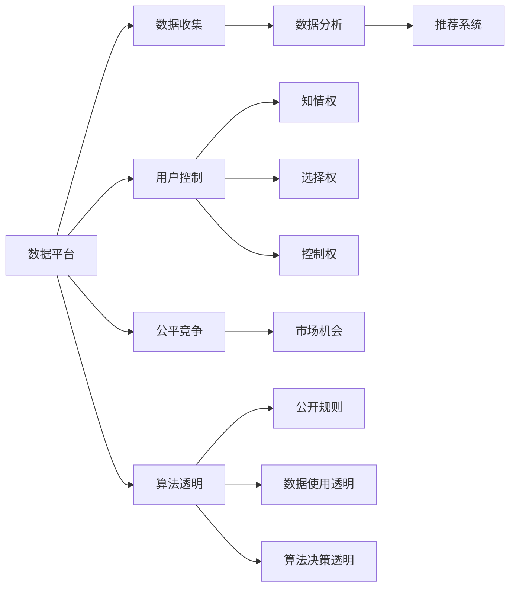

                 

# 平台的野心：控制用户，垄断数据

> 关键词：平台经济,数据垄断,用户控制,反垄断,数据隐私,算法透明,公平竞争

## 1. 背景介绍

在过去几十年里，互联网平台通过收集和分析用户数据，建立了强大的市场优势，逐步形成了数据垄断的局面。这些数据不仅包含了用户的基本信息、行为轨迹、偏好数据等，还涉及到了政治、经济、文化等各个方面的敏感信息。平台对数据的控制，既赋予了它们无与伦比的商业竞争优势，也带来了隐私安全、公平竞争等诸多社会问题。本文将深入探讨平台经济下数据的收集和分析，以及如何构建一个更加公平、透明的数字社会。

### 1.1 平台经济兴起

平台经济是基于网络外部性和规模经济，能够显著降低交易成本，提高市场效率的一种新型经济模式。典型的平台型企业如电商平台、社交平台、搜索引擎等，它们通过构建用户网络，实现信息和服务的高效匹配，从而获得显著的竞争优势。这些平台公司通过免费提供服务吸引用户，再通过广告、交易佣金等手段获取收入。

以社交平台为例，通过不断收集用户的个人信息、社交关系、兴趣爱好等数据，平台可以精准推荐广告，从而实现商业变现。这种模式虽然提高了广告投放的精准性，但同时给用户隐私带来威胁，也给市场公平竞争带来挑战。

### 1.2 数据垄断的成因

数据垄断的形成与平台经济的特性密切相关。首先，数据对于平台的价值极高，平台通过收集和分析用户数据，可以显著提升其服务的质量和用户粘性。其次，平台的用户越多，数据质量越高，平台的竞争优势越明显。因此，平台有强烈动机收集尽可能多的用户数据，从而形成数据垄断的局面。

此外，平台的数据收集方式多样，包括用户主动提供、爬虫抓取、合作伙伴分享等多种途径。数据类型也覆盖了用户的各种行为轨迹，如购物记录、浏览历史、社交互动、位置信息等。数据的丰富性和多样性，使得平台能够构建复杂的用户画像，实现精准的用户分析和推荐。

### 1.3 数据垄断的后果

数据垄断不仅影响了市场竞争，还对用户隐私、数据安全和公平竞争带来严重威胁。数据平台通过控制数据，可以轻易地压制竞争对手，实现市场独占。这不仅剥夺了用户的公平选择权，也损害了创新和市场活力。此外，数据垄断可能导致算法偏见和歧视，对弱势群体造成不公待遇。

平台对数据的控制，也带来了用户隐私泄露的风险。用户数据被收集、存储、分析后，可能会被滥用，如泄露个人隐私、遭遇钓鱼攻击等。平台在数据使用上缺乏透明度，用户难以知晓自己的数据被如何使用，也无法获得合理的控制权。

## 2. 核心概念与联系

### 2.1 核心概念概述

为了更好地理解数据垄断问题，本文将介绍几个关键概念：

- **数据平台(Data Platform)**：指基于互联网，通过收集和分析用户数据，提供信息和服务匹配的平台。如电商平台、社交平台、搜索引擎等。
- **数据垄断(Data Monopoly)**：指平台通过控制大量用户数据，获得市场竞争优势，压制竞争对手，形成市场独占的局面。
- **用户控制(User Control)**：指用户对自己的数据享有知情权、选择权和控制权，能够决定哪些数据可以被收集、如何使用和分享。
- **公平竞争(Fair Competition)**：指市场中各类企业有机会公平竞争，不被任何一方通过数据垄断压制。
- **算法透明(Algorithm Transparency)**：指平台需要公开其数据使用和算法决策的规则，确保算法的公正性和透明性。

这些概念之间存在紧密的联系。数据平台通过收集和分析用户数据，获得市场竞争优势，但这种优势是建立在数据垄断的基础上的。用户控制强调了用户对数据的主导权，公平竞争则要求市场各方在数据使用上拥有平等的权利。算法透明则是确保数据使用和算法决策公正性的重要保障。

### 2.2 核心概念原理和架构的 Mermaid 流程图



这个流程图展示了数据平台、数据收集、数据分析、推荐系统、用户控制、公平竞争、算法透明等核心概念之间的逻辑关系。数据平台通过收集和分析用户数据，构建推荐系统，为用户提供个性化的服务。用户控制涉及到用户的知情权、选择权和控制权，公平竞争要求市场各方拥有平等的机会，而算法透明则要求平台公开其数据使用和算法决策的规则。

## 3. 核心算法原理 & 具体操作步骤

### 3.1 算法原理概述

平台通过数据收集和分析，构建推荐系统，为用户提供个性化的服务。推荐系统的核心算法包括协同过滤、内容推荐、混合推荐等，这些算法依赖于大量的用户数据和行为数据。用户数据通常包括基本信息（如年龄、性别）、行为数据（如浏览记录、购买记录）、社交数据（如好友关系、社交互动）等。通过分析这些数据，平台可以构建用户画像，实现精准推荐。

推荐系统的算法原理可以概括为以下几步：

1. **数据收集**：通过爬虫、API接口、用户主动提供等方式收集用户数据。
2. **数据预处理**：对收集到的数据进行清洗、去重、归一化等预处理操作，生成用户行为向量。
3. **模型训练**：使用协同过滤、内容推荐等算法，训练推荐模型，生成用户画像。
4. **推荐生成**：根据用户画像和商品特征，生成个性化推荐结果。
5. **结果评估**：使用点击率、转化率等指标评估推荐效果，不断优化模型。

### 3.2 算法步骤详解

#### 3.2.1 数据收集

数据收集是推荐系统的第一步。平台通常通过以下几种方式收集用户数据：

- **用户主动提供**：用户在使用服务时，主动提供一些基本信息，如姓名、邮箱、生日等。
- **爬虫抓取**：平台通过爬虫技术，抓取用户的网络行为数据，如浏览记录、点击记录等。
- **API接口**：平台与其他服务提供商合作，通过API接口获取用户数据。
- **社交数据**：平台通过社交网络，获取用户的社交关系和互动数据。

#### 3.2.2 数据预处理

数据预处理是对收集到的数据进行清洗和归一化操作，生成用户行为向量。数据预处理包括以下步骤：

- **数据清洗**：去除重复数据、噪音数据、异常数据等。
- **数据归一化**：将数据转换为标准化的数值范围，如将年龄归一化为0-1的区间。
- **特征工程**：通过提取、组合、降维等技术，生成高维用户行为特征向量。

#### 3.2.3 模型训练

模型训练是推荐系统的核心步骤，通过训练推荐模型，生成用户画像。常用的推荐模型包括协同过滤、内容推荐、混合推荐等：

- **协同过滤**：基于用户-商品矩阵，计算用户之间的相似度和商品之间的相似度，生成推荐结果。
- **内容推荐**：基于商品特征和用户偏好，计算推荐相似度，生成推荐结果。
- **混合推荐**：结合多种推荐算法，综合生成推荐结果。

#### 3.2.4 推荐生成

推荐生成是根据用户画像和商品特征，生成个性化推荐结果。推荐生成过程包括以下步骤：

- **数据查询**：根据用户画像查询推荐系统，获取推荐结果。
- **结果排序**：根据推荐算法对推荐结果进行排序，生成推荐列表。
- **展示推荐**：将推荐结果展示给用户，供用户选择。

#### 3.2.5 结果评估

结果评估是推荐系统的反馈环节，通过点击率、转化率等指标评估推荐效果，不断优化模型。结果评估包括以下步骤：

- **点击率**：评估用户点击推荐结果的比例。
- **转化率**：评估用户购买推荐商品的比例。
- **用户满意度**：通过用户反馈，评估推荐系统的满意度。

### 3.3 算法优缺点

#### 3.3.1 优点

1. **精准推荐**：通过分析用户数据和行为数据，实现精准推荐，提升用户体验。
2. **个性化服务**：根据用户画像和偏好，提供个性化服务，满足用户需求。
3. **降低成本**：通过数据驱动的推荐系统，降低了营销成本和运营成本。

#### 3.3.2 缺点

1. **数据隐私**：大量收集和分析用户数据，可能侵犯用户隐私，带来数据安全风险。
2. **算法偏见**：推荐系统可能存在算法偏见，导致不公平待遇。
3. **市场垄断**：平台通过数据垄断获得市场优势，压制竞争对手，影响市场公平竞争。

### 3.4 算法应用领域

推荐系统广泛应用在电子商务、社交网络、内容平台等多个领域，具体包括：

- **电商平台**：通过推荐系统，提升商品推荐精度，提高用户转化率。
- **社交平台**：通过推荐系统，推荐好友、内容、活动等，提升用户粘性。
- **内容平台**：通过推荐系统，推荐文章、视频、音乐等，提升用户留存率。

## 4. 数学模型和公式 & 详细讲解 & 举例说明

### 4.1 数学模型构建

推荐系统的数学模型可以概括为以下几种：

1. **协同过滤模型**：基于用户-商品矩阵，计算用户之间的相似度和商品之间的相似度，生成推荐结果。
2. **内容推荐模型**：基于商品特征和用户偏好，计算推荐相似度，生成推荐结果。
3. **混合推荐模型**：结合多种推荐算法，综合生成推荐结果。

### 4.2 公式推导过程

#### 4.2.1 协同过滤模型

协同过滤模型基于用户-商品矩阵，计算用户之间的相似度和商品之间的相似度，生成推荐结果。协同过滤模型的公式如下：

$$
\theta_{i,j} = \alpha \frac{\sum_{k=1}^N a_{i,k}a_{k,j}}{\sqrt{\sum_{k=1}^N a_{i,k}^2 \sum_{k=1}^N a_{k,j}^2}}
$$

其中，$\theta_{i,j}$表示用户$i$对商品$j$的兴趣度，$a_{i,k}$表示用户$i$对商品$k$的评分，$N$表示商品总数。公式中，$\alpha$为相似度系数，$\sqrt{\sum_{k=1}^N a_{i,k}^2 \sum_{k=1}^N a_{k,j}^2}$为归一化因子。

#### 4.2.2 内容推荐模型

内容推荐模型基于商品特征和用户偏好，计算推荐相似度，生成推荐结果。内容推荐模型的公式如下：

$$
\theta_{i,j} = \alpha \frac{\sum_{k=1}^N \omega_k w_{i,k}w_{k,j}}{\sqrt{\sum_{k=1}^N \omega_k^2 w_{i,k}^2 \sum_{k=1}^N \omega_k^2 w_{k,j}^2}}
$$

其中，$\theta_{i,j}$表示用户$i$对商品$j$的兴趣度，$\omega_k$表示商品$k$的特征向量，$w_{i,k}$表示用户$i$对商品$k$的兴趣度，$N$表示商品总数。公式中，$\alpha$为相似度系数，$\sqrt{\sum_{k=1}^N \omega_k^2 w_{i,k}^2 \sum_{k=1}^N \omega_k^2 w_{k,j}^2}$为归一化因子。

### 4.3 案例分析与讲解

#### 4.3.1 协同过滤案例

假设某电商平台收集了用户对商品的评分数据，使用协同过滤模型推荐新商品。用户$i$对商品$j$的评分向量为：

$$
\vec{a_i} = [a_{i,1}, a_{i,2}, ..., a_{i,n}]
$$

商品$j$的评分向量为：

$$
\vec{a_j} = [a_{1,j}, a_{2,j}, ..., a_{m,j}]
$$

其中，$n$表示用户总数，$m$表示商品总数。用户$i$对商品$j$的兴趣度$\theta_{i,j}$可以通过协同过滤模型计算得出：

$$
\theta_{i,j} = \alpha \frac{\sum_{k=1}^N a_{i,k}a_{k,j}}{\sqrt{\sum_{k=1}^N a_{i,k}^2 \sum_{k=1}^N a_{k,j}^2}}
$$

#### 4.3.2 内容推荐案例

假设某内容平台收集了用户对文章、视频、音乐等内容的评分数据，使用内容推荐模型推荐新内容。用户$i$对文章$j$的评分向量为：

$$
\vec{w_i} = [w_{i,1}, w_{i,2}, ..., w_{i,m}]
$$

文章$j$的特征向量为：

$$
\vec{\omega_j} = [\omega_{1,j}, \omega_{2,j}, ..., \omega_{n,j}]
$$

其中，$m$表示内容总数。用户$i$对文章$j$的兴趣度$\theta_{i,j}$可以通过内容推荐模型计算得出：

$$
\theta_{i,j} = \alpha \frac{\sum_{k=1}^N \omega_k w_{i,k}w_{k,j}}{\sqrt{\sum_{k=1}^N \omega_k^2 w_{i,k}^2 \sum_{k=1}^N \omega_k^2 w_{k,j}^2}}
$$

## 5. 项目实践：代码实例和详细解释说明

### 5.1 开发环境搭建

在进行推荐系统开发前，我们需要准备好开发环境。以下是使用Python进行PyTorch开发的环境配置流程：

1. 安装Anaconda：从官网下载并安装Anaconda，用于创建独立的Python环境。

2. 创建并激活虚拟环境：
```bash
conda create -n recommendation-env python=3.8 
conda activate recommendation-env
```

3. 安装PyTorch：根据CUDA版本，从官网获取对应的安装命令。例如：
```bash
conda install pytorch torchvision torchaudio cudatoolkit=11.1 -c pytorch -c conda-forge
```

4. 安装Scikit-Learn：用于数据预处理和特征工程。
```bash
pip install scikit-learn
```

5. 安装Tensorboard：用于可视化模型训练过程。
```bash
pip install tensorboard
```

完成上述步骤后，即可在`recommendation-env`环境中开始推荐系统开发。

### 5.2 源代码详细实现

以下是一个简单的协同过滤推荐系统的代码实现，用于推荐电商平台上的商品。

```python
import numpy as np
from sklearn.metrics.pairwise import cosine_similarity
from sklearn.feature_extraction.text import CountVectorizer

class CollaborativeFiltering:
    def __init__(self, similarity='cosine'):
        self.similarity = similarity
        self.data = {}
    
    def fit(self, data):
        self.data = data
    
    def predict(self, user, item):
        similarities = []
        for user2, item2, rating2 in self.data:
            if user2 == user:
                continue
            if item2 == item:
                continue
            similarities.append(self.similarity(similarity_matrix[self.data[user2]][self.data[user]][self.data[item2]][self.data[item]])
        return np.mean(similarities)
    
    def fit_predict(self, user, item):
        return self.predict(user, item)

# 示例数据
data = [
    ('user1', 'item1', 5),
    ('user1', 'item2', 4),
    ('user1', 'item3', 3),
    ('user2', 'item1', 5),
    ('user2', 'item2', 4),
    ('user2', 'item3', 2),
    ('user2', 'item4', 5),
    ('user3', 'item1', 5),
    ('user3', 'item2', 3),
    ('user3', 'item3', 2),
    ('user3', 'item4', 4),
    ('user3', 'item5', 5)
]

# 将数据转换为列表形式
train_data = [(d[0], d[1], d[2]) for d in data]
test_data = [d for d in data if d[0] not in ['user1', 'user2']]

# 创建协同过滤模型
model = CollaborativeFiltering(similarity='cosine')

# 训练模型
model.fit(train_data)

# 预测测试集
for user, item in test_data:
    prediction = model.predict(user, item)
    print(f"Predicted rating for user {user} on item {item}: {prediction}")
```

### 5.3 代码解读与分析

让我们再详细解读一下关键代码的实现细节：

**CollaborativeFiltering类**：
- `__init__`方法：初始化协同过滤模型，定义相似度度量方法。
- `fit`方法：训练模型，收集用户-商品评分数据。
- `predict`方法：根据用户和商品ID预测推荐评分。

**数据格式**：
- `train_data`和`test_data`：包含用户ID、商品ID和评分的训练数据和测试数据。

**模型训练**：
- 通过`fit`方法，模型收集训练数据，并计算用户-商品相似度矩阵。
- 在预测时，模型根据相似度矩阵计算推荐评分，并返回预测结果。

**预测输出**：
- 通过`predict`方法，模型对测试数据进行预测，输出推荐评分。

以上代码展示了使用协同过滤模型进行推荐系统开发的简单实现。开发者可以根据实际需求，不断优化模型结构和参数，提升推荐效果。

## 6. 实际应用场景

### 6.1 电商平台推荐系统

电商平台通过推荐系统，提升用户购物体验和转化率。推荐系统可以根据用户的浏览记录、购买历史、搜索记录等数据，生成个性化的商品推荐，帮助用户快速找到心仪的商品。例如，亚马逊、京东等电商平台，都广泛应用了推荐系统。

### 6.2 内容平台推荐系统

内容平台通过推荐系统，提升用户粘性和留存率。推荐系统可以根据用户的浏览历史、观看记录、点赞评论等数据，生成个性化的内容推荐，提高用户的满意度和参与度。例如，Netflix、Bilibili等视频平台，都广泛应用了推荐系统。

### 6.3 社交平台推荐系统

社交平台通过推荐系统，提升用户互动和参与度。推荐系统可以根据用户的社交关系、互动记录、兴趣爱好等数据，生成个性化的好友、内容、活动推荐，增强用户粘性和活跃度。例如，Facebook、微博等社交平台，都广泛应用了推荐系统。

### 6.4 未来应用展望

随着推荐系统的不断进步，未来的推荐技术将更加智能化和个性化。以下是几个未来应用展望：

1. **跨领域推荐**：推荐系统可以跨领域推荐商品、内容、活动等，实现全渠道的个性化推荐。
2. **实时推荐**：推荐系统可以实现实时推荐，根据用户当前行为，动态调整推荐结果。
3. **多模态推荐**：推荐系统可以融合图像、视频、语音等多模态数据，提升推荐效果。
4. **动态调整**：推荐系统可以根据用户反馈和市场变化，动态调整推荐策略，提高推荐效果。

## 7. 工具和资源推荐

### 7.1 学习资源推荐

为了帮助开发者系统掌握推荐系统的理论和实践，这里推荐一些优质的学习资源：

1. 《推荐系统实战》系列博文：由推荐系统专家撰写，深入浅出地介绍了推荐系统的基本概念和常用算法。

2. CS229《机器学习》课程：斯坦福大学开设的经典机器学习课程，有Lecture视频和配套作业，适合入门推荐系统基础。

3. 《推荐系统》书籍：清华大学出版社的推荐系统教材，全面介绍了推荐系统的原理、算法和应用。

4. Kaggle推荐系统竞赛：Kaggle平台上举办的多场推荐系统竞赛，提供大量数据和代码，帮助开发者实践推荐系统。

通过对这些资源的学习实践，相信你一定能够快速掌握推荐系统的精髓，并用于解决实际的推荐问题。

### 7.2 开发工具推荐

高效的开发离不开优秀的工具支持。以下是几款用于推荐系统开发的常用工具：

1. PyTorch：基于Python的开源深度学习框架，灵活动态的计算图，适合快速迭代研究。

2. TensorFlow：由Google主导开发的开源深度学习框架，生产部署方便，适合大规模工程应用。

3. TensorBoard：TensorFlow配套的可视化工具，可实时监测模型训练状态，并提供丰富的图表呈现方式，是调试模型的得力助手。

4. Weights & Biases：模型训练的实验跟踪工具，可以记录和可视化模型训练过程中的各项指标，方便对比和调优。

5. Scikit-Learn：用于数据预处理和特征工程的Python库，提供了丰富的算法和工具。

合理利用这些工具，可以显著提升推荐系统的开发效率，加快创新迭代的步伐。

### 7.3 相关论文推荐

推荐系统的研究源于学界的持续努力。以下是几篇奠基性的相关论文，推荐阅读：

1. 《基于协同过滤的推荐系统》：介绍了协同过滤推荐系统的基本原理和算法。

2. 《基于内容的推荐系统》：介绍了内容推荐系统的基本原理和算法。

3. 《混合推荐系统》：介绍了混合推荐系统的基本原理和算法。

4. 《推荐系统的评价指标》：介绍了推荐系统的评价指标和评估方法。

5. 《推荐系统的实时推荐》：介绍了实时推荐系统的基本原理和算法。

这些论文代表了大数据推荐系统的研究方向，通过学习这些前沿成果，可以帮助研究者把握学科前进方向，激发更多的创新灵感。

## 8. 总结：未来发展趋势与挑战

### 8.1 研究成果总结

本文对基于数据平台的大规模推荐系统进行了全面系统的介绍。首先阐述了数据平台的兴起、数据垄断的成因和后果，明确了数据控制和用户控制的重要性。其次，详细讲解了推荐系统的核心算法和操作步骤，包括数据收集、数据预处理、模型训练、推荐生成和结果评估。最后，介绍了推荐系统的实际应用场景和未来应用展望，提供了学习资源、开发工具和相关论文推荐。

通过本文的系统梳理，可以看到，推荐系统在电商平台、内容平台、社交平台等多个领域广泛应用，极大地提升了用户体验和业务效果。未来，伴随推荐算法的不断进步，推荐系统将在更多领域得到应用，为数字社会带来变革性影响。

### 8.2 未来发展趋势

推荐系统的未来发展趋势主要体现在以下几个方面：

1. **跨领域推荐**：推荐系统可以跨领域推荐商品、内容、活动等，实现全渠道的个性化推荐。
2. **实时推荐**：推荐系统可以实现实时推荐，根据用户当前行为，动态调整推荐结果。
3. **多模态推荐**：推荐系统可以融合图像、视频、语音等多模态数据，提升推荐效果。
4. **动态调整**：推荐系统可以根据用户反馈和市场变化，动态调整推荐策略，提高推荐效果。
5. **隐私保护**：推荐系统将更加重视用户隐私保护，通过差分隐私等技术，确保用户数据的安全和隐私。

### 8.3 面临的挑战

尽管推荐系统取得了显著的成果，但仍面临着诸多挑战：

1. **数据隐私**：大规模推荐系统需要收集大量用户数据，如何保护用户隐私，避免数据滥用，是一个重要问题。
2. **算法偏见**：推荐系统可能存在算法偏见，导致不公平待遇。
3. **市场垄断**：推荐系统通过数据垄断获得市场优势，压制竞争对手，影响市场公平竞争。
4. **系统鲁棒性**：推荐系统需要面对数据稀疏、噪声干扰等问题，如何提高系统的鲁棒性，是一个挑战。

### 8.4 研究展望

未来的研究需要在以下几个方面寻求新的突破：

1. **隐私保护技术**：开发隐私保护算法，如差分隐私、联邦学习等，确保用户数据的安全和隐私。
2. **公平性算法**：开发公平性算法，如对抗性训练、权重调整等，消除推荐系统的偏见和歧视。
3. **跨模态融合**：开发跨模态推荐算法，如视觉-文本推荐、语音-文本推荐等，提升推荐效果。
4. **鲁棒性算法**：开发鲁棒性算法，如稀疏编码、噪声滤波等，提高推荐系统的鲁棒性和稳定性。
5. **实时推荐算法**：开发实时推荐算法，如在线学习、增量学习等，实现动态推荐。

这些研究方向将引领推荐系统迈向更高的台阶，为数字社会带来更多的价值。

## 9. 附录：常见问题与解答

**Q1：推荐系统如何实现跨领域推荐？**

A: 实现跨领域推荐的主要方法包括：

1. **用户画像融合**：将不同领域的数据融合到用户画像中，生成统一的推荐策略。
2. **联合模型训练**：在多个领域的数据上训练联合模型，实现多领域数据的协同推荐。
3. **模型迁移**：将某个领域的推荐模型迁移到另一个领域，结合领域特有的数据进行微调。

**Q2：推荐系统如何保护用户隐私？**

A: 保护用户隐私的主要方法包括：

1. **数据匿名化**：将用户数据进行匿名化处理，去除敏感信息，保护用户隐私。
2. **差分隐私**：通过加入随机噪声，确保用户数据不被恶意利用。
3. **联邦学习**：在用户数据本地处理，不将数据上传到中央服务器，保护用户隐私。

**Q3：推荐系统如何消除算法偏见？**

A: 消除推荐系统算法偏见的主要方法包括：

1. **公平性约束**：在推荐模型中加入公平性约束，确保不同用户和群体的公平待遇。
2. **对抗性训练**：通过对抗性训练，消除推荐模型中的偏见和歧视。
3. **数据多样性**：确保训练数据的多样性，避免模型对某些群体的偏见。

**Q4：推荐系统如何提高系统鲁棒性？**

A: 提高推荐系统鲁棒性的主要方法包括：

1. **稀疏编码**：使用稀疏编码技术，减少模型对噪声和异常数据的敏感性。
2. **噪声滤波**：使用噪声滤波技术，减少异常数据对推荐模型的影响。
3. **鲁棒性算法**：开发鲁棒性算法，如基于梯度的鲁棒优化算法、基于样本的鲁棒优化算法等。

这些方法可以提升推荐系统的鲁棒性和稳定性，使其在实际应用中更加可靠和有效。

**Q5：推荐系统如何实现实时推荐？**

A: 实现实时推荐的主要方法包括：

1. **在线学习**：在实时数据上不断更新推荐模型，实现动态推荐。
2. **增量学习**：在原有模型基础上，不断加入新数据进行训练，提高推荐效果。
3. **缓存技术**：使用缓存技术，减少重复计算，提高推荐效率。

通过这些方法，推荐系统可以实现实时推荐，根据用户当前行为，动态调整推荐结果，提升用户体验。

---

作者：禅与计算机程序设计艺术 / Zen and the Art of Computer Programming

