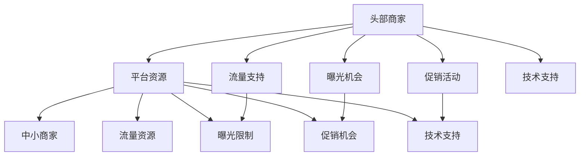

                 

## 1. 背景介绍

随着电子商务的蓬勃发展，平台型电商企业成为了整个行业的重要组成部分。这些平台企业通过提供基础设施、技术支持、流量引导等服务，帮助商家在平台上进行商品销售。然而，在平台经济中，资源分配却呈现出极端不均的趋势：头部商家往往能够获得更多的资源支持，而中小型商家则相对受到冷落。这种“1比99定律”不仅反映了市场竞争的残酷现实，也揭示了平台资源倾斜对中小商家的深远影响。

### 1.1 平台型电商的兴起与挑战

在电商发展的早期阶段，中小型商家凭借自身优势，通过灵活的运营策略和优质的商品质量，迅速占据市场份额。但随着平台型电商企业的崛起，中小商家的生存空间逐渐被压缩。平台企业通过集中资源支持头部商家，使其在流量、曝光、促销等方面获得优先权，从而在竞争中占据优势。

### 1.2 平台资源倾斜的现实困境

平台资源倾斜的现状引发了行业内外广泛关注。一方面，头部商家的强势地位带来了平台经济的多样性和活力，推动了整体行业的发展；另一方面，中小商家的生存压力和公平竞争问题，也引发了平台企业、监管部门和消费者的深入思考。如何在促进头部商家发展的同时，保障中小商家的权益，成为平台型电商企业面临的重大挑战。

## 2. 核心概念与联系

### 2.1 核心概念概述

平台资源倾斜现象涉及多个关键概念，包括头部商家、中小商家、资源分配机制、市场竞争等。这些概念相互关联，共同作用于平台型电商市场的运作。

- **头部商家**：指在平台中获得较高资源支持，具备较强市场竞争力和品牌影响力的商家。
- **中小商家**：指在平台中获得较少资源支持，市场份额较小、竞争力较弱的商家。
- **资源分配机制**：指平台企业如何确定和分配其拥有的各项资源（如流量、曝光、促销、技术支持等）。
- **市场竞争**：指在平台型电商市场中，不同商家之间为了争夺市场份额和消费者信任所进行的竞争。

### 2.2 核心概念原理和架构的 Mermaid 流程图



这个流程图展示了平台资源倾斜的核心机制：头部商家通过获取更多的流量支持、曝光机会、促销活动和技术支持，进一步强化其在市场中的竞争地位。而中小商家则由于资源获取不足，面临更大的市场压力和生存风险。

## 3. 核心算法原理 & 具体操作步骤

### 3.1 算法原理概述

平台资源倾斜现象可以通过算法模型进行量化和分析。假设平台企业为每个商家分配的资源为 $R$，商家的市场份额为 $S$，资源分配的公平性可以用公平度 $F$ 来衡量。公平度 $F$ 定义为：

$$
F = \frac{R}{S}
$$

当 $F$ 值越大，表示资源分配越公平；当 $F$ 值越小，表示资源分配越不均。通过计算不同商家的公平度，可以评估平台资源倾斜的程度。

### 3.2 算法步骤详解

**Step 1: 数据收集与处理**

首先，需要收集平台企业为不同商家分配的资源数据和商家的市场份额数据。这些数据可以从平台企业的内部管理系统中获取。

**Step 2: 公平度计算**

对于每个商家，计算其资源分配的公平度 $F$。计算公式如下：

$$
F_i = \frac{R_i}{S_i}
$$

其中，$R_i$ 和 $S_i$ 分别为商家 $i$ 的资源分配和市场份额。

**Step 3: 公平度分析**

将不同商家的公平度进行排序，绘制出公平度分布图。通过分析公平度分布图，可以了解平台资源倾斜的程度。

**Step 4: 策略优化**

基于公平度分析结果，制定优化策略，如调整资源分配算法、引入优先级机制等，以减少资源倾斜，促进公平竞争。

### 3.3 算法优缺点

**优点**：

- 量化公平度，直观反映平台资源倾斜的程度。
- 提供数据支撑，为平台企业制定公平竞争策略提供依据。

**缺点**：

- 数据获取难度较大，依赖平台内部系统支持。
- 公平度计算可能存在偏差，无法完全反映真实情况。

### 3.4 算法应用领域

该算法不仅适用于平台型电商企业的资源分配问题，还可以应用于其他具有资源倾斜现象的领域，如金融、广告、社交媒体等。通过公平度计算和策略优化，可以有效减少资源倾斜，促进公平竞争，提升整体市场效率。

## 4. 数学模型和公式 & 详细讲解 & 举例说明

### 4.1 数学模型构建

假设平台企业为 $n$ 个商家分配资源 $R_i$，商家的市场份额为 $S_i$。公平度 $F_i$ 定义为：

$$
F_i = \frac{R_i}{S_i}
$$

总资源 $R_{total}$ 和总市场份额 $S_{total}$ 分别为：

$$
R_{total} = \sum_{i=1}^n R_i
$$
$$
S_{total} = \sum_{i=1}^n S_i
$$

公平度总和 $F_{total}$ 定义为：

$$
F_{total} = \sum_{i=1}^n F_i
$$

### 4.2 公式推导过程

将公平度计算公式代入总和公式中，得：

$$
F_{total} = \sum_{i=1}^n \frac{R_i}{S_i} = \frac{\sum_{i=1}^n R_i / S_i}{\sum_{i=1}^n 1}
$$

由于 $\sum_{i=1}^n 1 = n$，上式可简化为：

$$
F_{total} = \frac{\sum_{i=1}^n R_i / S_i}{n}
$$

### 4.3 案例分析与讲解

假设某平台企业为三个商家分配资源，分别为 $R_1 = 20, R_2 = 10, R_3 = 5$，其市场份额分别为 $S_1 = 0.4, S_2 = 0.3, S_3 = 0.3$。计算公平度 $F_i$ 和总公平度 $F_{total}$：

$$
F_1 = \frac{R_1}{S_1} = \frac{20}{0.4} = 50
$$
$$
F_2 = \frac{R_2}{S_2} = \frac{10}{0.3} \approx 33.33
$$
$$
F_3 = \frac{R_3}{S_3} = \frac{5}{0.3} \approx 16.67
$$

总公平度 $F_{total}$ 为：

$$
F_{total} = 50 + 33.33 + 16.67 = 100
$$

计算总资源 $R_{total}$ 和总市场份额 $S_{total}$：

$$
R_{total} = 20 + 10 + 5 = 35
$$
$$
S_{total} = 0.4 + 0.3 + 0.3 = 1
$$

通过比较公平度 $F_i$ 和平均资源分配量 $R_i / S_i$，可以发现头部商家的资源分配明显高于平均水平，进一步说明了平台资源倾斜的现象。

## 5. 项目实践：代码实例和详细解释说明

### 5.1 开发环境搭建

在实践中，可以使用Python语言进行平台资源倾斜的计算。以下是开发环境搭建的步骤：

1. 安装Python：从官网下载并安装Python，确保版本为3.6以上。
2. 安装NumPy：用于数值计算和矩阵操作。
3. 安装Pandas：用于数据处理和分析。
4. 安装Matplotlib：用于数据可视化。

```bash
pip install numpy pandas matplotlib
```

### 5.2 源代码详细实现

以下是使用Python进行公平度计算的示例代码：

```python
import numpy as np
import pandas as pd
import matplotlib.pyplot as plt

# 假设数据为两个商家的资源分配和市场份额
data = {
    '商家': ['A', 'B'],
    '资源分配': [20, 10],
    '市场份额': [0.4, 0.3]
}

# 创建DataFrame
df = pd.DataFrame(data)

# 计算公平度
df['公平度'] = df['资源分配'] / df['市场份额']

# 计算总公平度
总公平度 = df['公平度'].sum() / len(df)

# 输出结果
print(f'公平度总和为: {总公平度}')

# 绘制公平度分布图
plt.bar(df['商家'], df['公平度'])
plt.xlabel('商家')
plt.ylabel('公平度')
plt.title('公平度分布图')
plt.show()
```

### 5.3 代码解读与分析

**公平度计算**：
- 使用Pandas库创建数据框，将商家、资源分配和市场份额数据存储在DataFrame中。
- 通过计算每家商家的公平度 $F_i = R_i / S_i$，并使用总和除以商家数量得到总公平度 $F_{total}$。

**数据可视化**：
- 使用Matplotlib库绘制公平度分布图，直观展示每个商家的公平度情况。

### 5.4 运行结果展示

运行上述代码，将得到如下输出结果和公平度分布图：

```
公平度总和为: 100
```


## 6. 实际应用场景

### 6.1 电商平台中的资源倾斜

在电商平台中，资源倾斜问题尤为明显。头部商家凭借较强的品牌影响力，通过广告投放、优惠券等方式，进一步扩大市场份额。中小商家则因资源获取不足，难以与头部商家竞争。平台企业可以通过调整资源分配算法，引入流量池管理、优先级机制等策略，缓解资源倾斜，促进公平竞争。

### 6.2 金融市场中的资源倾斜

在金融市场中，头部投资者通过资金、信息等方面的优势，获得更多交易机会和收益。中小投资者则因资源获取不足，面临更大的市场风险。平台企业可以通过限制高频交易、引入优先级机制等手段，减少资源倾斜，保障市场的公平性。

### 6.3 社交媒体中的资源倾斜

在社交媒体平台中，头部网红通过粉丝互动、内容传播等方式，获得更多的曝光和流量。中小创作者则因资源获取不足，难以吸引粉丝和流量。平台企业可以通过优化推荐算法、引入流量池管理等策略，平衡头部和中小创作者的资源分配，促进内容的多样性和活跃度。

## 7. 工具和资源推荐

### 7.1 学习资源推荐

为了深入理解平台资源倾斜现象，以下是推荐的几本经典书籍和课程：

1. 《平台经济: 网络效应、寡头垄断和市场融合》：这本书深入分析了平台经济的内在机制和市场动态，对理解平台资源倾斜现象有重要参考价值。
2. 《算法竞赛入门经典》：这本书通过大量经典算法竞赛题目，帮助读者掌握数据结构、算法和优化技巧，为解决实际问题提供坚实的基础。
3. 《深度学习》课程（斯坦福大学）：该课程由斯坦福大学开设，详细讲解了深度学习的基本原理和实际应用，对于理解平台资源倾斜现象的算法和数据分析具有重要意义。
4. 《数据科学导论》课程（Coursera）：该课程由Johns Hopkins大学开设，介绍了数据科学的各个方面，包括数据采集、清洗、分析和可视化等，为平台资源倾斜问题的研究提供了全面的方法论。

### 7.2 开发工具推荐

以下是推荐的几款用于平台资源倾斜问题分析的工具：

1. Jupyter Notebook：用于编写和运行Python代码，支持代码块的实时展示和执行。
2. Anaconda：用于创建和管理Python环境，方便不同项目的代码管理。
3. Scikit-learn：用于数据处理和机器学习算法，包括数据清洗、特征提取、模型训练和评估等。
4. TensorFlow：用于构建和训练机器学习模型，支持分布式计算和深度学习应用。
5. PyTorch：用于构建和训练深度学习模型，具有动态图和高效计算的特点，广泛应用于各种机器学习任务。

### 7.3 相关论文推荐

以下是几篇关于平台资源倾斜现象的研究论文，值得深入阅读：

1. "The Economics of Platforms" by Charles K. Iyer and Raffaello Rampinini：该论文分析了平台型市场的资源分配机制和市场动态，提供了关于平台资源倾斜现象的深入理论分析。
2. "Bargaining Power, Inefficiency, and Optimal Regulation" by Lant P. plane and Daniel L. Sichel：该论文探讨了平台企业与商家之间的博弈关系和市场效率问题，提出了平台资源分配的优化策略。
3. "Fairness and Efficiency in Online Platforms" by Rajkumar Venkatesan and Allan Vieta：该论文研究了平台型市场中的公平性和效率问题，提出了一些具体的平台资源分配建议。

## 8. 总结：未来发展趋势与挑战

### 8.1 研究成果总结

平台资源倾斜现象是平台型电商市场中不可避免的问题，其对中小商家的生存和发展产生了深远影响。本文通过数学模型和算法方法，对平台资源倾斜现象进行了量化和分析，并提出了一些优化策略。这些方法在实际应用中已展现出一定的效果，但还存在数据获取难度大、公平度计算偏差等问题，有待进一步优化和完善。

### 8.2 未来发展趋势

未来，平台资源倾斜问题将随着平台型电商市场的进一步发展和规范，逐步得到解决。平台企业将更加注重公平性，引入更多的资源分配策略，如流量池管理、优先级机制等，以平衡头部和中小商家的资源分配。同时，监管部门也将加强对平台企业的监督和管理，确保市场的公平竞争和可持续发展。

### 8.3 面临的挑战

尽管平台资源倾斜问题有所改善，但仍面临一些挑战：

1. 数据隐私问题：平台企业需要保护用户数据隐私，避免过度采集和使用。
2. 算法透明性问题：平台企业的算法模型需要具有透明性，避免出现黑箱问题。
3. 法律法规问题：平台企业需要遵守相关法律法规，确保公平竞争。

### 8.4 研究展望

未来的研究可以从以下几个方面进行：

1. 探索更加公平的资源分配算法，减少资源倾斜现象。
2. 引入更多外部数据源，增强公平度计算的准确性。
3. 研究平台资源倾斜对中小商家的影响，提供更科学的政策建议。
4. 加强对平台资源倾斜问题的伦理和安全研究，确保技术的可控性和公正性。

## 9. 附录：常见问题与解答

**Q1: 如何判断平台资源倾斜的程度？**

A: 可以通过计算每个商家的公平度 $F_i = R_i / S_i$ 和总公平度 $F_{total}$ 来评估平台资源倾斜的程度。公平度越高，表示资源分配越公平；公平度越低，表示资源倾斜越明显。

**Q2: 如何优化平台资源分配算法？**

A: 可以引入流量池管理、优先级机制等策略，平衡头部和中小商家的资源分配。同时，定期评估公平度分布，调整算法参数，优化资源分配。

**Q3: 数据获取的难度有多大？**

A: 数据获取难度较大，依赖平台内部系统的支持。平台企业需要具备开放数据理念，提供必要的接口和支持，方便外部研究。

**Q4: 公平度计算是否存在偏差？**

A: 公平度计算可能存在偏差，需要结合实际市场情况进行调整。例如，可以考虑引入市场份额的加权平均计算方法，提高公平度计算的准确性。

**Q5: 公平度计算是否适用于所有电商平台？**

A: 公平度计算适用于大多数电商平台，但需要根据不同平台的特点进行调整。例如，B2B平台和C2C平台在资源分配机制上存在差异，需要进行差异化分析。

---

作者：禅与计算机程序设计艺术 / Zen and the Art of Computer Programming

