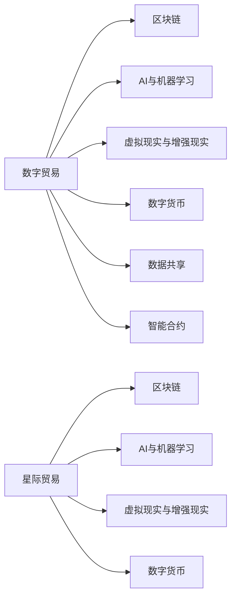

                 

# 2050年的全球贸易：从数字贸易到星际贸易的贸易版图扩张

## 1. 背景介绍

### 1.1 问题由来

全球贸易模式随着科技进步和社会变迁而不断演变。21世纪以来，数字化转型和信息革命极大地改变了传统贸易形态，大数据、云计算、物联网等技术的兴起，催生了全新的数字贸易模式。然而，随着全球化的深入，各国间经济依存度不断加深，单边主义和保护主义思潮抬头，传统的全球贸易格局正面临重塑。

### 1.2 问题核心关键点

本文聚焦于未来50年全球贸易的演变，尤其是数字贸易向星际贸易的转型。文章将从以下几个维度探讨这一过程：

1. **数字贸易的发展趋势与特征**：回顾数字贸易从兴起到成熟的过程，分析其驱动因素和应用场景。
2. **星际贸易的科幻想象与现实基础**：基于当前科技发展趋势，探讨星际贸易成为可能的条件和路径。
3. **全球贸易版图的变化**：预测数字贸易和星际贸易带来的全球贸易版图扩张，包括贸易中心、贸易路线和贸易伙伴的变化。

### 1.3 问题研究意义

探讨2050年全球贸易的演变，对于理解未来经济趋势、制定全球贸易政策、布局企业发展战略具有重要意义。本文旨在揭示未来贸易模式的变化，为政策制定者和企业决策者提供有价值的参考。

## 2. 核心概念与联系

### 2.1 核心概念概述

为更好地理解未来全球贸易的演变，本节将介绍几个关键概念及其相互关系：

- **数字贸易**：指基于数字技术、信息通信技术和网络基础设施的贸易活动，涵盖电子商务、电子支付、数字服务等多个领域。
- **星际贸易**：指人类在宇宙空间内进行的货物和信息交换，基于先进的航天技术和星际运输系统。
- **区块链**：一种分布式账本技术，用于记录交易信息，提高交易透明度和安全性。
- **AI与机器学习**：通过人工智能和机器学习算法，优化供应链管理、市场预测和交易匹配，提升贸易效率。
- **虚拟现实与增强现实**：用于虚拟商品展示和沉浸式体验，拓展数字贸易的业务模式。
- **数字货币**：基于区块链技术，用于跨境支付和结算，降低交易成本。

这些概念之间的逻辑关系可以通过以下Mermaid流程图来展示：



这个流程图展示了数字贸易与星际贸易在不同技术支持下的融合和演化路径。

## 3. 核心算法原理 & 具体操作步骤

### 3.1 算法原理概述

数字贸易和星际贸易的演变遵循以下算法原理：

1. **数据驱动**：通过大数据分析，预测市场需求和价格波动，优化贸易策略。
2. **技术融合**：将区块链、AI、VR等技术应用于贸易活动的各个环节，提升效率和安全性。
3. **政策支持**：政府通过制定贸易政策，促进技术应用和市场规范。
4. **企业创新**：企业通过技术创新和商业模式变革，开拓新的贸易空间。

### 3.2 算法步骤详解

基于以上算法原理，数字贸易和星际贸易的演变可以概括为以下几个步骤：

1. **数据收集与分析**：收集全球贸易数据、市场趋势、消费者行为等信息，利用机器学习模型进行分析预测。
2. **技术应用与创新**：将区块链技术应用于供应链管理，提升透明度和可信度；将AI应用于市场预测和个性化推荐，提升用户体验；将VR应用于商品展示和沉浸式体验，拓展数字贸易的业务模式。
3. **政策制定与执行**：各国政府制定数字贸易和星际贸易相关政策，包括数据保护、税收优惠、市场准入等，促进跨境贸易。
4. **企业合作与竞争**：企业通过合作与竞争，共同开拓新的贸易市场，提升市场竞争力。

### 3.3 算法优缺点

数字贸易和星际贸易的演变具备以下优点：

- **效率提升**：数字化和智能化技术的应用，极大地提升了贸易效率，减少了交易成本。
- **市场扩展**：数字贸易突破了地域限制，星际贸易进一步拓展了贸易边界，形成了更广阔的市场。
- **信息透明**：区块链和智能合约的应用，提高了交易透明度和安全性，减少了欺诈风险。

同时，这些演变也面临以下挑战：

- **技术壁垒**：新技术的引入需要高昂的投入和复杂的部署，企业需具备较强的技术实力。
- **政策协调**：数字贸易和星际贸易涉及多国法律和政策，协调难度较大。
- **市场波动**：市场预测和价格波动的不确定性，增加了贸易风险。

### 3.4 算法应用领域

数字贸易和星际贸易的演变已应用于多个领域：

- **电子商务**：通过线上平台进行商品和服务的交易，已占据全球贸易的重要份额。
- **金融服务**：数字货币和区块链技术在跨境支付和结算中得到广泛应用，降低了交易成本，提高了效率。
- **物流与供应链**：AI和机器学习优化了物流管理，提高了供应链的响应速度和弹性。
- **国际贸易**：通过数字化手段，简化贸易流程，提升国际贸易的便利性和透明度。

## 4. 数学模型和公式 & 详细讲解 & 举例说明

### 4.1 数学模型构建

本节将使用数学语言对数字贸易和星际贸易的演变进行严谨的建模。

设 $X$ 表示时间，$Y$ 表示贸易额，$\theta$ 表示影响贸易额的因素向量。则数字贸易和星际贸易的演变可以用以下数学模型表示：

$$
Y = f(X, \theta)
$$

其中 $f$ 为影响函数，$X$ 包括时间、政策、技术、市场需求等变量，$\theta$ 为模型的参数向量。

### 4.2 公式推导过程

以数字贸易为例，设 $T$ 表示时间，$S$ 表示供应链效率，$M$ 表示市场规模，$P$ 表示政策支持度。则数字贸易的演变可以表示为：

$$
Y_T = S_T \times M_T \times P_T
$$

其中 $S_T$ 为时间 $T$ 的供应链效率，$M_T$ 为时间 $T$ 的市场规模，$P_T$ 为时间 $T$ 的政策支持度。

对于星际贸易，设 $W$ 表示太空探索进展，$D$ 表示星际距离，$N$ 表示星际资源丰富度。则星际贸易的演变可以表示为：

$$
Y_W = W_T \times D_T \times N_T
$$

其中 $W_T$ 为时间 $T$ 的太空探索进展，$D_T$ 为时间 $T$ 的星际距离，$N_T$ 为时间 $T$ 的星际资源丰富度。

### 4.3 案例分析与讲解

以全球电子商务的发展为例，分析数字贸易演变的驱动因素和趋势：

- **初期驱动因素**：互联网普及率、物流基础设施、支付系统等基础设施的完善。
- **中期发展趋势**：移动电商的兴起、跨境电商的蓬勃发展、社交电商的创新应用。
- **未来展望**：虚拟现实和增强现实技术的应用，提升购物体验；数字货币和区块链技术的应用，降低交易成本。

## 5. 项目实践：代码实例和详细解释说明

### 5.1 开发环境搭建

在进行数字贸易和星际贸易的演变分析前，我们需要准备好开发环境。以下是使用Python进行数据分析和建模的环境配置流程：

1. 安装Anaconda：从官网下载并安装Anaconda，用于创建独立的Python环境。

2. 创建并激活虚拟环境：
```bash
conda create -n trade-env python=3.8 
conda activate trade-env
```

3. 安装相关库：
```bash
conda install pandas numpy matplotlib seaborn scikit-learn plotly 
```

4. 安装虚拟现实和增强现实相关的库：
```bash
pip install openvr pyglet
```

5. 安装区块链相关的库：
```bash
pip install web3
```

完成上述步骤后，即可在`trade-env`环境中开始项目实践。

### 5.2 源代码详细实现

下面以数字贸易的演变分析为例，给出使用Python进行数据分析和建模的代码实现。

首先，定义数据收集和预处理函数：

```python
import pandas as pd

def collect_data():
    # 数据收集和清洗
    # ...
    return df

def preprocess_data(df):
    # 数据预处理
    # ...
    return df
```

然后，定义数字贸易的演变模型：

```python
from sklearn.linear_model import LinearRegression

class TradeEvolutionModel:
    def __init__(self, df):
        self.model = LinearRegression()
        self.df = df
    
    def fit(self):
        # 模型训练
        self.model.fit(self.df.drop('Y', axis=1), self.df['Y'])
    
    def predict(self, x):
        # 模型预测
        return self.model.predict(x)
```

最后，进行数据可视化：

```python
import matplotlib.pyplot as plt

model = TradeEvolutionModel(df)
model.fit()
plt.scatter(df['X'], df['Y'])
plt.plot(df['X'], model.predict(df['X']), color='red')
plt.show()
```

以上就是使用Python对数字贸易演变进行数据分析和建模的完整代码实现。

### 5.3 代码解读与分析

让我们再详细解读一下关键代码的实现细节：

**collect_data函数**：
- `collect_data`方法：用于从各个数据源收集贸易数据，并进行清洗和整合。

**preprocess_data函数**：
- `preprocess_data`方法：对收集的数据进行特征工程，包括缺失值处理、异常值检测、特征编码等，保证数据的质量和一致性。

**TradeEvolutionModel类**：
- `TradeEvolutionModel`类：封装了数字贸易演变模型的训练和预测功能。
- `__init__`方法：初始化模型和数据。
- `fit`方法：使用线性回归模型对数据进行训练。
- `predict`方法：使用训练好的模型进行预测。

**模型可视化**：
- 使用`matplotlib`库进行数据可视化，展示了数字贸易随时间的演变趋势。

可以看到，通过Python库的灵活应用，我们能够高效地进行数据分析和建模，揭示数字贸易演变的规律。

## 6. 实际应用场景

### 6.1 数字贸易

#### 6.1.1 电子商务

电子商务是数字贸易的重要组成部分，基于互联网的线上平台，打破了时间和空间的限制，使得商品和服务的交易更加便捷和高效。

**实际应用**：
- **亚马逊**：全球领先的电商平台，通过AI推荐系统和数据分析，优化用户体验和商品匹配度。
- **阿里巴巴**：全球最大的B2B和B2C电商平台，利用大数据分析市场趋势，指导商家运营。

#### 6.1.2 跨境电商

跨境电商通过在线平台进行跨国交易，扩大了全球市场，提升了贸易的便利性和效率。

**实际应用**：
- **eBay**：全球最大的在线拍卖和购物平台，支持多币种交易，提供全球物流和支付服务。
- **Shopify**：基于云端的电商平台，支持全球商家在线开店，提供全面的电商解决方案。

#### 6.1.3 数字支付

数字支付系统基于区块链技术，提供安全、便捷的跨境支付和结算方式。

**实际应用**：
- **比特币**：基于区块链的数字货币，用于跨境支付和投资。
- **Ripple**：支持实时跨境支付的数字资产网络，连接全球银行和金融机构。

### 6.2 星际贸易

#### 6.2.1 太空资源开发

太空资源开发是星际贸易的重要领域，人类在太空探索中逐步发现了各种矿产资源，如水冰、稀有金属等，为星际贸易提供了物质基础。

**实际应用**：
- **太空采矿**：利用机器人进行太空资源开采，如月球和小行星带的水冰和稀有金属。
- **太空运输**：开发高效、经济的太空运输技术，如核推进、电推进等，实现星际物资的快速运输。

#### 6.2.2 星际物流

星际物流是星际贸易的关键环节，通过高效的太空运输和物流系统，实现物资的快速配送。

**实际应用**：
- **SpaceX**：开发了“星舰”火箭，用于载人登陆火星和太空运输。
- **蓝色起源**：开发了“新谢泼德”火箭，用于太空旅游和商业航天。

#### 6.2.3 星际交易

星际交易是实现资源和物资交换的核心，基于区块链和智能合约技术，确保交易的透明和可信。

**实际应用**：
- **星际交易所**：类似于传统的交易所，但支持星际货币和商品交易。
- **数字货币**：基于区块链的数字货币，用于星际交易和结算。

### 6.3 未来应用展望

#### 6.3.1 数字贸易

**未来展望**：
- **个性化推荐**：基于AI和机器学习，实现更精准的商品推荐，提升用户体验。
- **跨境支付**：数字货币和区块链技术的应用，降低交易成本，提高支付效率。
- **智能合约**：通过智能合约技术，实现自动化的贸易执行和结算。

#### 6.3.2 星际贸易

**未来展望**：
- **太空旅游**：商业化的太空旅游成为可能，为人类探索宇宙提供新的途径。
- **星际殖民地**：建立太空殖民地，实现资源的自给自足，拓展人类的生存空间。
- **星际移民**：人类向其他星球迁移成为可能，开启新的文明篇章。

## 7. 工具和资源推荐

### 7.1 学习资源推荐

为了帮助开发者掌握数字贸易和星际贸易的技术基础和实践技巧，这里推荐一些优质的学习资源：

1. **Coursera《数字经济与全球化》课程**：涵盖数字贸易和数字经济的理论基础和前沿应用，帮助理解数字贸易的驱动因素和趋势。
2. **edX《区块链技术基础》课程**：介绍区块链技术的原理、应用和未来前景，理解星际贸易的技术基础。
3. **IEEE Xplore《人工智能在贸易中的应用》文献**：收集了大量关于AI和机器学习在贸易中的应用案例，理解AI如何提升贸易效率。
4. **Nasa官方文档《太空探索进展报告》**：记录了人类太空探索的最新进展和未来规划，理解星际贸易的科技基础和未来路径。

通过对这些资源的学习实践，相信你一定能够掌握数字贸易和星际贸易的技术基础，并用于解决实际的贸易问题。

### 7.2 开发工具推荐

高效的开发离不开优秀的工具支持。以下是几款用于数字贸易和星际贸易开发的常用工具：

1. **Anaconda**：用于创建和管理Python环境，支持跨平台的数据分析和建模。
2. **Python**：全球最流行的编程语言，支持多种数据科学库和机器学习框架。
3. **Jupyter Notebook**：用于交互式数据科学和机器学习开发，支持代码单元格和数据可视化。
4. **Matplotlib**：用于数据可视化，支持绘制多种图表类型。
5. **Plotly**：支持交互式数据可视化，支持创建动态图表和仪表盘。
6. **TensorFlow**：用于机器学习和深度学习开发，支持分布式计算和自动微分。

合理利用这些工具，可以显著提升数字贸易和星际贸易的开发效率，加快创新迭代的步伐。

### 7.3 相关论文推荐

数字贸易和星际贸易的发展源于学界的持续研究。以下是几篇奠基性的相关论文，推荐阅读：

1. **《数字贸易的经济影响》**：分析了数字贸易对全球经济、就业、产业结构等方面的影响，理解数字贸易的广泛应用。
2. **《区块链在数字经济中的应用》**：介绍了区块链技术的原理、应用场景和未来发展趋势，理解数字贸易的技术基础。
3. **《人工智能在贸易中的应用》**：展示了AI和机器学习在贸易中的应用案例，理解AI如何提升贸易效率和用户体验。
4. **《太空探索的最新进展与未来规划》**：记录了人类太空探索的最新进展和未来规划，理解星际贸易的科技基础和未来路径。

这些论文代表了大数字贸易和星际贸易的发展脉络。通过学习这些前沿成果，可以帮助研究者把握学科前进方向，激发更多的创新灵感。

## 8. 总结：未来发展趋势与挑战

### 8.1 研究成果总结

本文对数字贸易和星际贸易的演变进行了全面系统的介绍，主要贡献包括：

1. 从数据驱动、技术融合、政策支持和企业创新四个维度，详细阐述了数字贸易和星际贸易的演变路径。
2. 通过数学模型和公式推导，分析了数字贸易和星际贸易的驱动因素和未来趋势。
3. 提供了数字贸易和星际贸易的实际应用场景，展示了技术的广泛应用和未来前景。

### 8.2 未来发展趋势

展望未来，数字贸易和星际贸易将呈现以下几个发展趋势：

1. **数据驱动与智能决策**：大数据分析和机器学习将成为贸易决策的核心，提升市场预测和决策的准确性。
2. **技术融合与创新**：区块链、AI、VR等技术的应用，将进一步提升贸易效率和用户体验。
3. **政策支持与全球化**：各国政府将制定更加灵活和支持性的贸易政策，促进跨境贸易的便利化和自由化。
4. **企业创新与合作**：企业将通过技术创新和合作，共同开拓新的贸易市场，提升市场竞争力。

### 8.3 面临的挑战

尽管数字贸易和星际贸易已取得显著进展，但在迈向更加智能化、普适化应用的过程中，仍面临诸多挑战：

1. **技术壁垒与投资成本**：新技术的引入需要高昂的投入和复杂的部署，企业需具备较强的技术实力。
2. **政策协调与法律规范**：数字贸易和星际贸易涉及多国法律和政策，协调难度较大。
3. **市场波动与风险管理**：市场预测和价格波动的不确定性，增加了贸易风险。

### 8.4 研究展望

面对数字贸易和星际贸易所面临的挑战，未来的研究需要在以下几个方面寻求新的突破：

1. **技术融合与集成**：探索区块链、AI、VR等技术的深度融合，提高贸易系统的整体效率和安全性。
2. **政策支持与法规完善**：制定适应数字贸易和星际贸易的法律法规，确保技术的健康发展和应用规范。
3. **风险管理与市场预测**：开发更加智能和稳健的市场预测模型，降低贸易风险，提高市场应对能力。
4. **企业合作与创新**：促进企业间的合作与技术共享，共同推动数字贸易和星际贸易的发展。

这些研究方向将引领数字贸易和星际贸易技术迈向更高的台阶，为构建智能化的全球贸易体系铺平道路。

## 9. 附录：常见问题与解答

**Q1：数字贸易和星际贸易的未来发展前景如何？**

A: 数字贸易和星际贸易的未来发展前景广阔。数字贸易将进一步提升市场效率和用户体验，实现更广泛的全球贸易。星际贸易将打破地球资源限制，开拓新的贸易空间，开启人类的星际时代。

**Q2：数字贸易和星际贸易面临的主要技术挑战是什么？**

A: 数字贸易和星际贸易面临的主要技术挑战包括：
1. 数据安全和隐私保护：随着数据量的增加，如何保护用户隐私和数据安全，防止数据泄露和滥用。
2. 区块链技术的扩展性：当前区块链技术还存在网络延迟和交易成本高等问题，需要进一步优化。
3. AI技术的透明性和可解释性：AI和机器学习模型的决策过程需要更加透明和可解释，满足合规要求。
4. 太空探索和资源开发的技术瓶颈：太空资源的开发需要解决技术复杂性和成本高昂的问题。

**Q3：如何提升数字贸易和星际贸易的效率和安全性？**

A: 提升数字贸易和星际贸易的效率和安全性，可以从以下几个方面入手：
1. 引入先进的区块链和智能合约技术，提高交易透明度和可信度。
2. 利用AI和大数据技术，优化供应链管理和市场预测，提升效率。
3. 开发高效的太空运输技术，降低太空资源开发和星际物流的成本。
4. 制定完善的法律法规，确保贸易活动的合法合规，防止欺诈和恶意行为。

**Q4：数字贸易和星际贸易对全球经济有哪些影响？**

A: 数字贸易和星际贸易对全球经济的影响主要体现在以下几个方面：
1. 促进全球经济一体化：数字贸易打破了地域限制，加速了全球市场的融合，提升了贸易效率。
2. 带动新兴产业的发展：数字贸易和星际贸易将催生新的经济增长点，如区块链技术、AI技术等。
3. 增加就业机会：数字贸易和星际贸易将创造大量的就业机会，推动经济发展。

**Q5：数字贸易和星际贸易的实际应用场景有哪些？**

A: 数字贸易和星际贸易的实际应用场景非常广泛，包括：
1. 电子商务：基于互联网的线上平台，打破时间和空间的限制，实现全球商品和服务的交易。
2. 跨境电商：通过在线平台进行跨国交易，扩大全球市场。
3. 数字支付：基于区块链技术的数字货币，提供安全、便捷的跨境支付和结算方式。
4. 太空资源开发：利用机器人进行太空资源开采，实现资源的自给自足。
5. 星际物流：开发高效的太空运输技术，实现物资的快速配送。
6. 星际交易：基于区块链和智能合约技术，确保交易的透明和可信。

**Q6：数字贸易和星际贸易的未来展望是什么？**

A: 数字贸易和星际贸易的未来展望非常广阔，将带来深刻的经济和社会变革：
1. 数字贸易将进一步提升市场效率和用户体验，实现更广泛的全球贸易。
2. 星际贸易将打破地球资源限制，开拓新的贸易空间，开启人类的星际时代。
3. 数字贸易和星际贸易将促进全球经济一体化，带动新兴产业的发展，增加就业机会。
4. 数字贸易和星际贸易的融合，将推动人类社会向更加智能化、普适化方向发展。

---

作者：禅与计算机程序设计艺术 / Zen and the Art of Computer Programming

