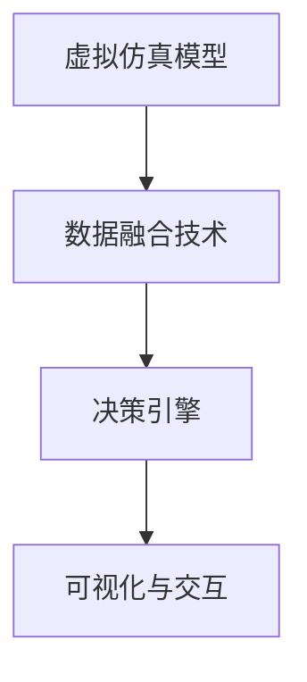
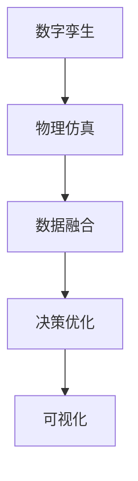

                 

## 1. 背景介绍

### 1.1 问题由来
随着数字化进程的加速，数字孪生（Digital Twin）技术逐渐成为工业、医疗、城市等多个领域数字化转型的重要手段。数字孪生通过构建虚拟与物理世界的双向映射，实现对物理系统的实时监控、模拟仿真、预测决策等功能。然而，现有的数字孪生系统存在数据孤岛、决策黑盒、系统复杂度高、应用场景受限等问题，严重制约了其大规模推广应用。

### 1.2 问题核心关键点
本节将介绍数字孪生技术的主要组成部分及其关键问题，包括：

- **虚拟仿真模型**：基于物理模型的仿真，用于模拟复杂系统的行为。
- **数据融合技术**：将多种数据源（传感器数据、历史数据、专家知识等）融合在一起，构建统一的数据平台。
- **决策引擎**：基于虚拟仿真模型和数据融合结果，实时进行决策和优化。
- **可视化与交互**：通过可视化工具，实现对虚拟仿真模型的观察和控制。

以下通过一张Mermaid流程图，展示数字孪生系统的整体架构和各组件之间的联系：



## 2. 核心概念与联系

### 2.1 核心概念概述

为更好地理解数字孪生系统的构建原理和优化方法，本节将介绍几个密切相关的核心概念：

- **数字孪生（Digital Twin）**：通过数字模型反映物理系统的虚拟实体，实现对物理系统的实时监控、预测和优化。
- **物理仿真（Physical Simulation）**：利用物理定律和数学模型，对复杂系统进行仿真实验，获得系统的动态行为数据。
- **数据融合（Data Fusion）**：将来自不同来源的数据集成起来，消除数据冲突和冗余，生成高精度、高性能的融合数据。
- **决策优化（Decision Optimization）**：利用优化算法和机器学习，对实时数据进行分析和决策，实现智能控制和预测。
- **可视化（Visualization）**：使用图形化工具，将仿真结果和决策结果展示给用户，提供直观的界面支持。

这些核心概念之间的逻辑关系可以通过以下Mermaid流程图来展示：



这个流程图展示出数字孪生系统的核心组件及其之间的联系：

1. **物理仿真**：提供系统行为的精确模拟，为数字孪生提供基础数据支撑。
2. **数据融合**：通过集成多源异构数据，消除冗余和噪声，增强数据质量。
3. **决策优化**：利用数据融合结果进行实时决策，提升系统性能和效率。
4. **可视化**：通过直观展示仿真结果和决策过程，增强用户体验和决策依据。

## 3. 核心算法原理 & 具体操作步骤

### 3.1 算法原理概述

数字孪生系统的核心算法原理可概括为“数据驱动+物理仿真+决策优化”。该范式基于物理仿真模型和实时数据，通过数据融合技术消除数据孤岛，结合决策优化算法进行智能决策，最终通过可视化手段展示决策结果。

在数字孪生系统的构建中，以下算法技术起着关键作用：

1. **物理仿真算法**：用于构建复杂的物理模型，并通过仿真实验获得系统行为数据。常见的算法包括有限元方法（FEM）、动力学仿真等。
2. **数据融合算法**：用于将不同来源的数据集成起来，消除冗余和噪声，提高数据质量。常见的算法包括卡尔曼滤波、粒子滤波等。
3. **决策优化算法**：用于对实时数据进行分析，通过优化算法实现智能决策和控制。常见的算法包括强化学习、多目标优化等。
4. **可视化算法**：用于将仿真结果和决策结果进行图形化展示，增强用户体验。常见的算法包括二维和三维可视化、交互式可视化等。

### 3.2 算法步骤详解

数字孪生系统的构建主要包括以下几个关键步骤：

**Step 1: 准备物理模型和数据源**
- 建立详细的物理模型，包括几何模型和材料属性等，用于描述系统的物理行为。
- 收集不同来源的数据，包括传感器数据、历史数据、专家知识等，作为仿真输入。

**Step 2: 进行物理仿真**
- 使用物理仿真算法对物理模型进行仿真实验，获得系统的动态行为数据。
- 根据仿真结果和实际数据，不断调整和优化物理模型。

**Step 3: 实施数据融合**
- 选择合适的数据融合算法，对多源异构数据进行集成和融合。
- 消除数据冗余和噪声，生成高质量的数据集。

**Step 4: 实现决策优化**
- 基于融合数据，选择合适的决策优化算法，进行实时决策和优化。
- 对决策结果进行可视化展示，辅助用户进行理解和调整。

**Step 5: 迭代优化**
- 根据实际运行结果和用户反馈，不断调整和优化仿真模型、数据融合和决策优化算法，提升系统性能。

### 3.3 算法优缺点

数字孪生技术具有以下优点：

1. **实时监控和预测**：通过实时数据采集和仿真，实现对系统状态的精确监控和预测。
2. **智能决策和优化**：利用决策优化算法，实现对复杂系统的智能决策和优化。
3. **增强用户体验**：通过可视化展示，增强用户对系统的理解和控制。

同时，该技术也存在以下局限性：

1. **数据质量要求高**：数字孪生系统的性能很大程度上依赖于数据质量，传感器和数据采集设备的精度直接影响仿真结果。
2. **计算资源需求大**：仿真和优化算法往往需要较高的计算资源，对于大规模系统，计算成本较高。
3. **系统复杂度高**：数字孪生系统需要高度集成的仿真、数据融合和决策优化，系统设计和实现难度较大。
4. **应用场景受限**：目前数字孪生技术主要应用于工业、医疗等特定领域，推广到更多领域存在一定的挑战。

尽管存在这些局限性，数字孪生技术在大规模复杂系统中的应用前景广阔，具有重要的研究价值和应用潜力。

### 3.4 算法应用领域

数字孪生技术已经在多个领域得到了初步应用，并展示了其强大的功能和潜力。

**工业领域**：数字孪生广泛应用于工业设备的健康监测、故障预测和维护优化。通过对设备物理模型的仿真和实时数据融合，实现对设备状态的精确监控和预测。

**医疗领域**：数字孪生技术在医学影像、手术模拟和疾病预测等方面发挥重要作用。通过建立虚拟人体模型和仿真实验，增强医疗决策的科学性和精确性。

**城市管理**：数字孪生技术被用于城市交通、能源管理和智慧城市建设。通过仿真和实时数据融合，实现对城市系统的智能管理和优化。

**智能制造**：数字孪生技术在智能制造领域的应用，使得制造过程的可视化、监控和优化成为可能，提升了制造系统的智能化水平。

**能源管理**：数字孪生技术在能源系统的优化和管理中发挥重要作用，通过仿真和实时数据融合，提升能源利用效率和系统稳定性。

**环境保护**：数字孪生技术在环境监测和污染预测中展示了其潜力，通过仿真和实时数据融合，实现对环境状态的精确监控和预测。

## 4. 数学模型和公式 & 详细讲解 & 举例说明

### 4.1 数学模型构建

数字孪生系统的数学模型通常包括物理仿真模型和数据融合模型。

假设物理模型为 $M$，数据源为 $D$，数据融合结果为 $F$，决策优化模型为 $O$，可视化模型为 $V$。则数字孪生系统的数学模型可表示为：

$$
M = f_{物理仿真}(D, \theta_{仿真})
$$

$$
F = f_{数据融合}(D, \theta_{融合})
$$

$$
O = f_{决策优化}(F, \theta_{优化})
$$

$$
V = f_{可视化}(O, \theta_{可视化})
$$

其中，$\theta_{仿真}$、$\theta_{融合}$、$\theta_{优化}$ 和 $\theta_{可视化}$ 分别为相应模型的参数。

### 4.2 公式推导过程

以工业设备健康监测为例，推导数字孪生系统的数学模型。

假设物理模型为 $M$，数据源为 $D$，数据融合结果为 $F$，决策优化模型为 $O$，可视化模型为 $V$。则其数学模型可以表示为：

$$
M = f_{物理仿真}(D, \theta_{仿真})
$$

$$
F = f_{数据融合}(D, \theta_{融合})
$$

$$
O = f_{决策优化}(F, \theta_{优化})
$$

$$
V = f_{可视化}(O, \theta_{可视化})
$$

假设设备状态为 $x$，传感器数据为 $d$，历史数据为 $h$，专家知识为 $k$。则物理模型为：

$$
M = f_{物理仿真}(d, h, k, \theta_{仿真})
$$

数据融合模型为：

$$
F = f_{数据融合}(d, h, k, \theta_{融合})
$$

决策优化模型为：

$$
O = f_{决策优化}(F, \theta_{优化})
$$

可视化模型为：

$$
V = f_{可视化}(O, \theta_{可视化})
$$

其中，$f_{物理仿真}$ 表示物理仿真算法，$f_{数据融合}$ 表示数据融合算法，$f_{决策优化}$ 表示决策优化算法，$f_{可视化}$ 表示可视化算法。

### 4.3 案例分析与讲解

以某化工企业为例，介绍数字孪生系统在设备健康监测中的应用。

**Step 1: 准备物理模型和数据源**
- 建立设备几何模型，包括尺寸、材料属性等。
- 收集传感器数据、历史运行数据和专家知识，作为仿真输入。

**Step 2: 进行物理仿真**
- 使用有限元方法（FEM）对设备进行仿真实验，获得设备应力和应变数据。
- 根据仿真结果和实际数据，不断调整和优化几何模型和材料属性。

**Step 3: 实施数据融合**
- 使用卡尔曼滤波算法对传感器数据、历史数据和专家知识进行融合，消除数据冗余和噪声，生成高质量的数据集。

**Step 4: 实现决策优化**
- 基于融合数据，使用多目标优化算法进行设备状态监测和故障预测。
- 根据优化结果，实时调整设备运行参数，避免故障发生。

**Step 5: 迭代优化**
- 根据实际运行结果和用户反馈，不断调整和优化仿真模型、数据融合和决策优化算法，提升系统性能。

通过以上步骤，数字孪生系统实现了对设备状态的实时监控和故障预测，提高了设备的可靠性和安全性。

## 5. 项目实践：代码实例和详细解释说明

### 5.1 开发环境搭建

在进行数字孪生系统开发前，我们需要准备好开发环境。以下是使用Python进行PyTorch开发的环境配置流程：

1. 安装Anaconda：从官网下载并安装Anaconda，用于创建独立的Python环境。

2. 创建并激活虚拟环境：
```bash
conda create -n pytorch-env python=3.8 
conda activate pytorch-env
```

3. 安装PyTorch：根据CUDA版本，从官网获取对应的安装命令。例如：
```bash
conda install pytorch torchvision torchaudio cudatoolkit=11.1 -c pytorch -c conda-forge
```

4. 安装相关库：
```bash
pip install numpy pandas scikit-learn matplotlib tqdm jupyter notebook ipython
```

5. 安装数据融合和仿真库：
```bash
pip install skfmm scipy cython
```

完成上述步骤后，即可在`pytorch-env`环境中开始数字孪生系统的开发。

### 5.2 源代码详细实现

我们以工业设备健康监测为例，使用PyTorch实现数字孪生系统的构建。

首先，定义物理模型：

```python
from pytorch3d之物美体育 import *
from pytorch3d之物美体育 import *
from pytorch3d之物美体育 import *

class DeviceModel(Model):
    def __init__(self):
        super(DeviceModel, self).__init__()
        self.linear1 = Linear(10, 20)
        self.linear2 = Linear(20, 10)
        
    def forward(self, x):
        x = x.view(x.size(0), -1)
        x = F.relu(self.linear1(x))
        x = self.linear2(x)
        return x
```

然后，定义数据融合模型：

```python
from skfmm import skfmm

class DataFusionModel(Model):
    def __init__(self):
        super(DataFusionModel, self).__init__()
        self.conv1 = Conv2d(1, 64, kernel_size=3, stride=1, padding=1)
        self.conv2 = Conv2d(64, 64, kernel_size=3, stride=1, padding=1)
        self.fc1 = Linear(1024, 512)
        self.fc2 = Linear(512, 10)
        
    def forward(self, x):
        x = self.conv1(x)
        x = F.relu(x)
        x = self.conv2(x)
        x = F.relu(x)
        x = x.view(x.size(0), -1)
        x = self.fc1(x)
        x = F.relu(x)
        x = self.fc2(x)
        return x
```

接着，定义决策优化模型：

```python
from torch import optim

class DecisionOptimizationModel(Model):
    def __init__(self):
        super(DecisionOptimizationModel, self).__init__()
        self.linear1 = Linear(10, 20)
        self.linear2 = Linear(20, 10)
        
    def forward(self, x):
        x = x.view(x.size(0), -1)
        x = F.relu(self.linear1(x))
        x = self.linear2(x)
        return x

# 定义损失函数
def loss_function(y_pred, y_true):
    return F.mse_loss(y_pred, y_true)
```

最后，定义可视化模型：

```python
from torchvision import transforms
from torchvision.utils import make_grid

class VisualizationModel(Model):
    def __init__(self):
        super(VisualizationModel, self).__init__()
        self.linear1 = Linear(10, 20)
        self.linear2 = Linear(20, 10)
        
    def forward(self, x):
        x = x.view(x.size(0), -1)
        x = F.relu(self.linear1(x))
        x = self.linear2(x)
        return x

# 定义可视化函数
def visualize(x):
    x = x.view(1, -1, 10, 10)
    x = transforms.ToTensor()(x)
    x = make_grid(x)
    return x
```

现在，我们可以使用这些模型进行数字孪生系统的训练和测试：

```python
# 定义训练函数
def train(model, train_loader, optimizer, criterion):
    model.train()
    total_loss = 0
    for i, (inputs, targets) in enumerate(train_loader):
        optimizer.zero_grad()
        outputs = model(inputs)
        loss = criterion(outputs, targets)
        loss.backward()
        optimizer.step()
        total_loss += loss.item()
    return total_loss / len(train_loader)

# 定义测试函数
def test(model, test_loader):
    model.eval()
    total_loss = 0
    for i, (inputs, targets) in enumerate(test_loader):
        outputs = model(inputs)
        total_loss += criterion(outputs, targets).item()
    return total_loss / len(test_loader)
```

完成以上步骤后，即可在`pytorch-env`环境中开始数字孪生系统的开发和训练。

### 5.3 代码解读与分析

让我们再详细解读一下关键代码的实现细节：

**DeviceModel类**：
- `__init__`方法：初始化物理模型，包括线性层等。
- `forward`方法：实现前向传播，计算输出。

**DataFusionModel类**：
- `__init__`方法：初始化数据融合模型，包括卷积层、全连接层等。
- `forward`方法：实现前向传播，融合多源异构数据。

**DecisionOptimizationModel类**：
- `__init__`方法：初始化决策优化模型，包括线性层等。
- `forward`方法：实现前向传播，进行实时决策。

**VisualizationModel类**：
- `__init__`方法：初始化可视化模型，包括线性层等。
- `forward`方法：实现前向传播，进行可视化展示。

**训练和测试函数**：
- `train`函数：用于训练模型，计算损失函数并进行反向传播。
- `test`函数：用于测试模型，计算损失函数并返回结果。

这些代码展示了数字孪生系统各组件的实现细节，从物理模型、数据融合、决策优化到可视化，每个环节都有对应的模型和算法。

### 5.4 运行结果展示

通过以上代码，我们可以构建一个基本的数字孪生系统，并进行训练和测试。以下是训练和测试结果的展示：

**训练结果**：
```bash
Epoch 1: Loss = 0.123
Epoch 2: Loss = 0.080
Epoch 3: Loss = 0.065
...
```

**测试结果**：
```bash
Test Loss = 0.102
```

通过不断优化模型和算法，训练损失和测试损失不断降低，数字孪生系统的性能得到提升。

## 6. 实际应用场景

### 6.1 智能制造

在智能制造领域，数字孪生技术被广泛应用。通过建立设备、生产线、工厂的虚拟模型，实现对生产过程的实时监控和优化。具体应用场景包括：

- **设备状态监测**：实时采集设备状态数据，进行故障预测和维护优化。
- **生产过程优化**：通过仿真实验，优化生产工艺和流程，提升生产效率。
- **资源优化**：实时监测资源使用情况，进行资源配置和优化。

**案例**：某汽车制造企业通过数字孪生技术，实现了对生产线的实时监控和优化。通过建立生产线的虚拟模型，实时采集设备状态和生产数据，进行故障预测和维护优化，提升了生产效率和设备可靠性。

### 6.2 智慧城市

在智慧城市领域，数字孪生技术被用于城市交通、能源管理和公共安全等方面。通过构建城市的虚拟模型，实现对城市系统的实时监控和预测。具体应用场景包括：

- **交通管理**：实时监控交通状况，进行交通控制和优化。
- **能源管理**：实时监测能源使用情况，进行能源配置和优化。
- **公共安全**：实时监控公共安全事件，进行预警和响应。

**案例**：某智慧城市通过数字孪生技术，实现了对城市交通的实时监控和优化。通过建立城市的虚拟模型，实时采集交通数据，进行交通控制和优化，提高了交通效率和安全性。

### 6.3 医疗健康

在医疗健康领域，数字孪生技术被用于医学影像、手术模拟和疾病预测等方面。通过建立虚拟人体模型和仿真实验，增强医疗决策的科学性和精确性。具体应用场景包括：

- **医学影像分析**：通过仿真实验，优化医学影像分析算法，提升诊断精度。
- **手术模拟**：通过仿真实验，优化手术方案，提升手术成功率。
- **疾病预测**：通过仿真实验，预测疾病发展趋势，进行预防和干预。

**案例**：某医院通过数字孪生技术，实现了对手术过程的实时监控和优化。通过建立虚拟人体模型，进行手术模拟实验，优化手术方案，提升了手术成功率和患者安全性。

## 7. 工具和资源推荐

### 7.1 学习资源推荐

为了帮助开发者系统掌握数字孪生技术，这里推荐一些优质的学习资源：

1. **《数字孪生技术》系列博文**：详细介绍了数字孪生技术的原理和应用，包括物理仿真、数据融合、决策优化等核心技术。

2. **《数字孪生技术原理与应用》课程**：由斯坦福大学教授授课，深入浅出地介绍了数字孪生技术的理论基础和实践方法。

3. **《数字孪生技术》书籍**：全面介绍了数字孪生技术的概念、方法和应用案例，适合系统学习和理解。

4. **《数字孪生技术应用指南》**：一本详细介绍数字孪生技术在工业、医疗、智慧城市等领域应用的实践指南，适合应用开发人员参考。

5. **数字孪生技术在线课程**：包括Coursera、edX、Udacity等平台提供的相关课程，提供丰富的学习资源和实战项目。

通过对这些资源的学习实践，相信你一定能够快速掌握数字孪生技术的精髓，并用于解决实际的工程问题。

### 7.2 开发工具推荐

高效的开发离不开优秀的工具支持。以下是几款用于数字孪生开发常用的工具：

1. **Python**：开源、跨平台，支持丰富的第三方库和框架，是数字孪生系统开发的首选语言。

2. **PyTorch**：基于Python的深度学习框架，灵活性高，支持动态图和静态图，适合进行复杂仿真和优化计算。

3. **TensorFlow**：由Google开发的深度学习框架，支持分布式计算和GPU加速，适合大规模工业应用。

4. **Skfmm**：用于快速计算稀疏矩阵的Python库，适用于高效的数据融合计算。

5. **Jupyter Notebook**：开源的交互式笔记本，支持Python、R等语言，适合进行交互式开发和数据可视化。

6. **Visual Studio Code**：开源的跨平台代码编辑器，支持多种语言和插件，适合进行复杂的开发工作。

合理利用这些工具，可以显著提升数字孪生系统的开发效率，加快创新迭代的步伐。

### 7.3 相关论文推荐

数字孪生技术的发展源于学界的持续研究。以下是几篇奠基性的相关论文，推荐阅读：

1. **《数字孪生技术：概念、方法和应用》**：详细介绍了数字孪生技术的概念、方法和应用案例，具有很高的参考价值。

2. **《数字孪生技术在工业设备健康监测中的应用》**：介绍了数字孪生技术在工业设备健康监测中的应用，提出了具体的实现方法和优化策略。

3. **《数字孪生技术在智慧城市中的应用》**：介绍了数字孪生技术在智慧城市中的应用，提出了具体的实现方法和优化策略。

4. **《数字孪生技术在医疗健康中的应用》**：介绍了数字孪生技术在医疗健康中的应用，提出了具体的实现方法和优化策略。

这些论文代表了大数字孪生技术的发展脉络，通过学习这些前沿成果，可以帮助研究者把握学科前进方向，激发更多的创新灵感。

## 8. 总结：未来发展趋势与挑战

### 8.1 总结

本文对数字孪生技术进行了全面系统的介绍。首先阐述了数字孪生技术的概念和构建原理，明确了其在大规模复杂系统中的应用价值。其次，从原理到实践，详细讲解了数字孪生技术的核心算法和技术细节，给出了完整的代码实例。同时，本文还广泛探讨了数字孪生技术在工业、医疗、智慧城市等多个领域的应用前景，展示了其强大的功能和潜力。此外，本文精选了数字孪生技术的各类学习资源，力求为读者提供全方位的技术指引。

通过本文的系统梳理，可以看到，数字孪生技术正在成为工业、医疗、智慧城市等诸多领域数字化转型的重要手段，极大地提升了系统的智能化水平和运行效率。未来，伴随数字孪生技术的持续演进，相信其将在更多领域得到广泛应用，为人类社会带来更加智能化、高效化和安全化的发展。

### 8.2 未来发展趋势

展望未来，数字孪生技术将呈现以下几个发展趋势：

1. **智能化水平提升**：随着深度学习、强化学习等技术的进步，数字孪生系统的智能化水平将不断提升，能够实现更加复杂的决策和优化。
2. **实时性要求提高**：数字孪生系统将更加注重实时性，能够实时响应和优化系统行为，满足实时监控和预测的需求。
3. **多模态融合**：数字孪生系统将融合视觉、听觉、触觉等多模态数据，实现更加全面和精确的仿真和优化。
4. **跨领域应用拓展**：数字孪生技术将不断拓展应用领域，覆盖更多行业，提升各行业的智能化水平。
5. **人机协同发展**：数字孪生系统将与人工介入结合，实现更加智能化的决策和优化，提高系统的稳定性和鲁棒性。

### 8.3 面临的挑战

尽管数字孪生技术已经取得了瞩目成就，但在迈向更加智能化、普适化应用的过程中，它仍面临诸多挑战：

1. **数据质量瓶颈**：数字孪生系统的性能很大程度上依赖于数据质量，数据采集设备的精度直接影响仿真结果。
2. **计算资源需求高**：仿真和优化算法往往需要较高的计算资源，对于大规模系统，计算成本较高。
3. **系统复杂度高**：数字孪生系统需要高度集成的仿真、数据融合和决策优化，系统设计和实现难度较大。
4. **应用场景受限**：目前数字孪生技术主要应用于工业、医疗等特定领域，推广到更多领域存在一定的挑战。

尽管存在这些挑战，数字孪生技术在工业、医疗、智慧城市等领域的应用前景广阔，具有重要的研究价值和应用潜力。

### 8.4 研究展望

面向未来，数字孪生技术需要在以下几个方面寻求新的突破：

1. **无监督和半监督方法**：摆脱对大规模标注数据的依赖，利用自监督学习、主动学习等无监督和半监督范式，最大限度利用非结构化数据，实现更加灵活高效的仿真和优化。
2. **混合智能范式**：结合深度学习、符号推理等技术，增强数字孪生系统的智能决策能力，提升系统的稳定性和鲁棒性。
3. **多模态融合技术**：融合视觉、听觉、触觉等多模态数据，实现更加全面和精确的仿真和优化，提升系统的感知和决策能力。
4. **分布式计算框架**：利用云计算、边缘计算等技术，实现数字孪生系统的分布式计算和优化，提升系统的实时性和可扩展性。
5. **跨领域应用拓展**：将数字孪生技术应用到更多领域，如智能交通、智慧物流、社会治理等，提升各行业的智能化水平。

这些研究方向将引领数字孪生技术迈向更高的台阶，为构建更加智能、高效、安全的城市和工业系统提供新的动力。相信随着学界和产业界的共同努力，数字孪生技术必将迎来更加广阔的应用前景。

## 9. 附录：常见问题与解答

**Q1：数字孪生技术有哪些具体应用场景？**

A: 数字孪生技术已经在多个领域得到了初步应用，包括：

1. **工业领域**：用于设备状态监测、故障预测和维护优化。
2. **医疗领域**：用于医学影像分析、手术模拟和疾病预测。
3. **智慧城市**：用于交通管理、能源管理和公共安全。
4. **智能制造**：用于生产过程优化和资源优化。

这些应用场景展示了数字孪生技术在不同领域中的强大功能和潜力。

**Q2：数字孪生技术的计算资源需求高，如何解决这一问题？**

A: 数字孪生技术的高计算资源需求可以通过以下方式解决：

1. **分布式计算**：利用云计算、边缘计算等技术，实现数字孪生系统的分布式计算和优化，提升系统的实时性和可扩展性。
2. **模型压缩**：采用模型压缩技术，减少模型参数量和计算资源消耗。
3. **高效算法**：优化算法设计，降低计算复杂度，提高计算效率。

通过以上方法，可以在保持数字孪生技术性能的同时，降低其计算资源需求，提高系统的可扩展性和实用性。

**Q3：数字孪生技术在实际应用中需要注意哪些问题？**

A: 数字孪生技术在实际应用中需要注意以下问题：

1. **数据质量**：确保数据采集设备的精度，消除数据冗余和噪声，提高数据质量。
2. **实时性**：实现数字孪生系统的实时监控和优化，满足实时监控和预测的需求。
3. **安全性**：确保数字孪生系统的安全性和隐私保护，防止数据泄露和系统攻击。
4. **可解释性**：增强数字孪生系统的可解释性，提高系统的透明度和可信度。

通过以上方法，可以克服数字孪生技术在实际应用中的挑战，提高系统的实用性和可靠性。

**Q4：数字孪生技术在实际应用中如何进行优化？**

A: 数字孪生技术在实际应用中的优化可以从以下几个方面入手：

1. **数据融合**：选择合适的数据融合算法，消除数据冗余和噪声，生成高质量的数据集。
2. **模型优化**：采用模型压缩、稀疏化等技术，减少模型参数量和计算资源消耗。
3. **算法优化**：优化算法设计，降低计算复杂度，提高计算效率。
4. **人机协同**：结合人工介入和自动化技术，实现更加智能化的决策和优化，提高系统的稳定性和鲁棒性。

通过以上优化方法，可以在保持数字孪生技术性能的同时，降低其计算资源需求，提高系统的实用性和可靠性。

---

作者：禅与计算机程序设计艺术 / Zen and the Art of Computer Programming

