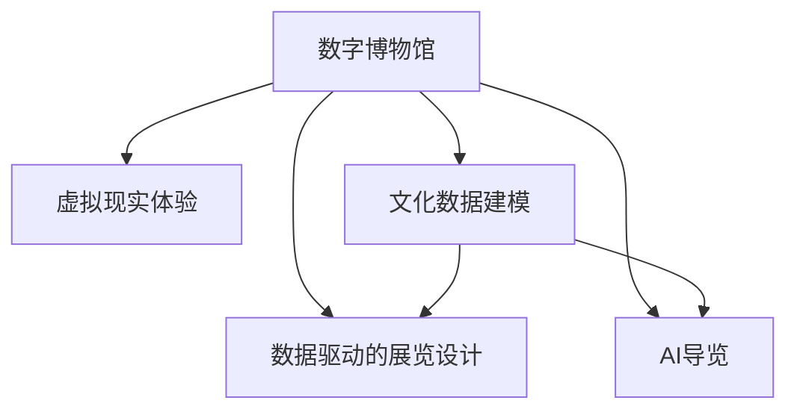

                 

## 1. 背景介绍

### 1.1 问题由来
21世纪以来，信息技术的迅猛发展彻底改变了人类社会的生产生活方式。数字化、网络化、智能化逐步渗透到社会的各个层面，教育、医疗、娱乐、旅游等诸多领域都在数字化的浪潮中迈上了新的台阶。然而，数字化浪潮的浪尖，却并非所有的行业都能从容应对。文化领域，尤其是博物馆、美术馆等以实体展览为主的行业，虽然也有涉足数字化尝试，但整体仍面临着数字化转型升级的巨大挑战。

近年来，随着虚拟现实（VR）、增强现实（AR）、混合现实（MR）等新兴技术的快速发展，数字博物馆、虚拟展览等全新的文化传播形式开始崛起。这些新技术不仅极大丰富了文化的展示形式，更使得“文化”跨越了物理世界的限制，成为一种真正普惠的资源。

### 1.2 问题核心关键点
数字博物馆和虚拟现实体验的崛起，预示着未来博物馆、美术馆等文化机构将不再局限于物理空间内的展示，而是通过数字化手段将展览内容无限扩展。这一变革对文化产业的影响深远，涉及数字化建模、数据驱动的展览设计、AI导览等多个环节。

当前，以数据驱动的展览设计和AI导览是两大核心技术难题。数据驱动的展览设计要求对文化数据的精确建模，AI导览则对模型的交互性和实时性提出了新的要求。这些难题的存在，直接影响了数字文化体验的普惠性和便捷性。

## 2. 核心概念与联系

### 2.1 核心概念概述

为更好地理解数字文化从数字博物馆到虚拟现实体验的传播，本节将介绍几个密切相关的核心概念：

- 数字博物馆(Digital Museum)：以数字化形式呈现的博物馆展览，包括数字化藏品、数字化导览、虚拟展览等。其核心在于通过3D建模、虚拟现实等技术，将实物藏品及其背后的文化故事，以更加生动、互动的方式展示给公众。
- 虚拟现实体验(Virtual Reality Experience)：利用VR技术，为观众提供沉浸式的文化体验。观众可以通过VR设备“走进”虚拟展览，与虚拟展品进行互动，获得更加直观生动的文化感受。
- 文化数据建模(Cultural Data Modeling)：对文化藏品进行精确数字化建模，提取特征，构建模型。用于数据驱动的展览设计、AI导览等多个环节。
- 数据驱动的展览设计(Data-Driven Exhibition Design)：通过分析文化数据，挖掘其内在联系和规律，生成数据驱动的展览方案。进一步指导数字化展览的策划和展示。
- AI导览(AI-Guided Tour)：利用自然语言处理、计算机视觉等技术，结合文化数据建模，提供自然语言对话式的导览服务，辅助观众参观和理解展览内容。

这些核心概念之间的逻辑关系可以通过以下Mermaid流程图来展示：



这个流程图展示了大语言模型微调的关键概念及其之间的关系：

1. 数字博物馆是虚拟现实体验的基础，通过数字化建模将实体展览内容转化为虚拟形式。
2. 文化数据建模是对藏品的数字化提取和特征化，用于后续的展览设计和导览。
3. 数据驱动的展览设计利用文化数据建模的结果，生成更加科学合理的展览方案。
4. AI导览利用文化数据建模和数据驱动的展览设计，提供自然语言对话式的导览服务，提升观众的参观体验。

这些概念共同构成了未来数字文化的展示和技术框架，使得“文化”通过数字化手段变得更加普惠和生动。

## 3. 核心算法原理 & 具体操作步骤
### 3.1 算法原理概述

数字文化从数字博物馆到虚拟现实体验的传播，其核心在于对文化数据的精确建模和利用。基于3D建模、虚拟现实、自然语言处理等技术的有机结合，通过数据驱动的展览设计和AI导览，提供沉浸式、互动式的文化体验。

具体而言，核心算法原理包括以下几个部分：

1. 文化数据的精确建模。通过对藏品的3D扫描和数字化，提取出其三维模型、纹理、材料等信息，并构建完整的数据模型。
2. 数据驱动的展览设计。通过文化数据建模的结果，利用机器学习、图神经网络等技术，挖掘数据中的内在联系和规律，生成更加科学合理的展览方案。
3. AI导览。通过自然语言处理、计算机视觉等技术，结合文化数据建模的结果，提供自然语言对话式的导览服务，辅助观众参观和理解展览内容。

### 3.2 算法步骤详解

基于数据驱动的数字文化传播，具体算法步骤如下：

**Step 1: 文化数据的精确建模**

1. 3D扫描：利用高精度3D扫描仪，对藏品进行全三维扫描。获取其精确的三维坐标数据。
2. 纹理映射：对扫描得到的3D模型，利用纹理映射技术，添加真实纹理信息。使得虚拟展品更加逼真。
3. 特征提取：对3D模型和纹理信息进行特征提取，得到各个部分的特征向量。

**Step 2: 数据驱动的展览设计**

1. 数据预处理：对文化数据进行清洗、降噪、归一化等预处理操作。
2. 特征表示：利用深度神经网络对文化数据进行特征表示，得到低维特征向量。
3. 图网络建模：构建图神经网络模型，利用特征向量计算数据之间的相似度和关系。
4. 展览方案生成：基于图网络建模的结果，生成科学合理的展览方案。

**Step 3: AI导览**

1. 导览信息抽取：利用自然语言处理技术，从藏品介绍和说明中抽取关键信息，如名称、年代、作者、故事等。
2. 自然语言生成：结合导览信息，利用自然语言生成技术，生成自然流畅的导览文本。
3. 语音合成：将生成的导览文本进行语音合成，提供自然语言对话式的导览服务。

**Step 4: 数据存储与分发**

1. 模型压缩：将模型压缩为轻量级模型，减小存储和计算资源消耗。
2. 数据分发：通过分布式存储技术，将数字化展览和导览数据分发到各VR设备。

### 3.3 算法优缺点

基于数据驱动的数字文化传播，其优点包括：

1. 数字化的文化展示形式丰富多样。通过3D建模、虚拟现实等技术，观众可以全方位、沉浸式地体验文化藏品，获得更加直观生动的文化感受。
2. 高效便捷的文化体验。数据驱动的展览设计和AI导览，使文化展示更加科学合理，观众可以轻松获取文化信息。
3. 普惠性的文化体验。数字化技术将文化展示突破了物理空间的限制，使更多人可以方便地访问和体验文化藏品。
4. 互动性强。通过自然语言处理、计算机视觉等技术，观众可以与虚拟展品进行互动，提升参观体验。

但同时也存在一些局限性：

1. 建模成本高。高精度3D扫描、纹理映射等技术需要昂贵的设备，建模成本较高。
2. 数据质量依赖实物藏品。建模结果的准确性依赖于实物藏品的状态和质量，一旦藏品损坏或缺失，建模效果将大打折扣。
3. 技术复杂度高。数据驱动的展览设计和AI导览，涉及多种复杂的技术，开发难度较大。
4. 用户体验有限。当前的技术手段仍难以完全复制实物藏品的质感和互动体验，观众的参观感受仍有一定差距。
5. 数据隐私和安全问题。数字化展示需要处理大量的敏感数据，如何确保数据隐私和安全，防止数据泄露，也是一大难题。

尽管存在这些局限性，但就目前而言，基于数据驱动的数字文化传播仍是大势所趋，通过不断技术进步和优化，未来有望实现更加普惠、便捷、生动的文化体验。

### 3.4 算法应用领域

数字文化从数字博物馆到虚拟现实体验的传播，已在多个领域得到了应用：

1. 数字博物馆：如北京故宫博物院、大英博物馆等，通过3D扫描和虚拟现实技术，构建了虚拟故宫、虚拟大英博物馆等数字博物馆。
2. 数字艺术展览：如国家大剧院、上海博物馆等，通过3D建模和虚拟现实技术，构建了数字艺术展览，将抽象艺术以更加生动的方式呈现给观众。
3. 文化旅游：如长城数字博物馆、敦煌莫高窟虚拟展览等，通过3D建模和虚拟现实技术，构建了虚拟旅游景点，使观众足不出户便可游览文化名胜。
4. 数字考古：如良渚文化虚拟博物馆、三星堆数字展览等，通过3D建模和虚拟现实技术，将考古发现数字化展示，帮助观众更好地理解历史文化。
5. 虚拟教育：如故宫博物院虚拟课堂、敦煌研究院虚拟考古等，通过3D建模和虚拟现实技术，将历史文化与教育相结合，提供沉浸式学习体验。

除了上述这些应用外，数字文化展示技术还被广泛应用于文化遗产保护、文物保护、艺术品鉴定、古建修复等领域，推动了文化的数字化传承和创新。

## 4. 数学模型和公式 & 详细讲解  
### 4.1 数学模型构建

本节将使用数学语言对数据驱动的数字文化传播过程进行更加严格的刻画。

记数字化藏品的3D模型为 $M_{3D}$，纹理信息为 $T_{tex}$，特征表示为 $F_{feat}$。设 $D=\{(x_i,y_i)\}_{i=1}^N, x_i \in \mathcal{X}, y_i \in \mathcal{Y}$，其中 $x_i$ 为文化数据，$y_i$ 为与 $x_i$ 相关的标签（如名称、年代、作者、故事等）。

定义文化数据的损失函数为：

$$
\mathcal{L}(D) = \frac{1}{N}\sum_{i=1}^N \ell(M_{3D}(x_i),y_i)
$$

其中 $\ell$ 为特定损失函数，如交叉熵损失。

在实际应用中，通常采用联合建模的方式，将文化数据的建模、展览设计、导览生成等多个环节集成在一个统一框架中。这一框架的核心思想是将各个环节看作是一体的，通过联合优化，提升整体效果。

### 4.2 公式推导过程

以下我们以文化数据建模和展览设计为例，推导深度神经网络模型的构建和优化过程。

假设文化数据 $x$ 可以表示为若干特征向量 $f_{i,j}$ 的集合，每个特征向量 $f_{i,j}$ 表示一个文化特征（如颜色、形状、材质等）。文化数据的特征表示 $F_{feat}$ 为一个矩阵，其中 $F_{feat} \in \mathbb{R}^{N \times D}$，$N$ 为数据数量，$D$ 为特征维度。

设深度神经网络模型为 $M_{\theta}(x) = [F_{feat}^T \cdot W_{3D}] \cdot U_{tex} + b_{3D}$，其中 $W_{3D} \in \mathbb{R}^{D \times 3}$，$U_{tex} \in \mathbb{R}^{3 \times 3}$，$b_{3D} \in \mathbb{R}^3$ 为模型参数。

通过反向传播算法计算梯度，更新模型参数，最小化损失函数，得到最优参数 $\theta^*$。

在得到最优参数后，利用图神经网络（GNN）模型，对文化数据 $x$ 进行特征计算，得到特征向量 $G_{feat} = [x_1 \cdot W_{GNN}] \cdot [x_2 \cdot W_{GNN}] \cdot ... \cdot [x_N \cdot W_{GNN}]$。

将文化数据 $x$ 和特征向量 $G_{feat}$ 作为输入，构建数据驱动的展览设计模型 $M_{design}(x,G_{feat})$，通过深度神经网络对文化数据建模和展览设计进行联合优化，得到最优设计方案。

### 4.3 案例分析与讲解

以下我们以故宫数字博物馆的虚拟展览为例，展示数据驱动的展览设计和AI导览的实现过程。

假设故宫数字博物馆的数字化藏品为 $M_{3D}$，文化数据为 $D$。利用深度神经网络对 $M_{3D}$ 进行特征表示，得到特征向量 $F_{feat}$。利用图神经网络对 $D$ 进行特征计算，得到特征向量 $G_{feat}$。将 $M_{3D}$ 和 $G_{feat}$ 作为输入，构建数据驱动的展览设计模型 $M_{design}(M_{3D},G_{feat})$，得到展览设计方案。

导览信息抽取部分，利用自然语言处理技术，从 $D$ 中抽取关键信息，如名称、年代、作者、故事等。导览信息表示为 $I_{info}$。

导览生成部分，利用自然语言生成技术，将 $I_{info}$ 生成自然流畅的导览文本 $T_{guide}$。利用语音合成技术，将 $T_{guide}$ 转换为语音，提供自然语言对话式的导览服务。

## 5. 项目实践：代码实例和详细解释说明
### 5.1 开发环境搭建

在进行数据驱动的数字文化传播实践前，我们需要准备好开发环境。以下是使用Python进行PyTorch开发的环境配置流程：

1. 安装Anaconda：从官网下载并安装Anaconda，用于创建独立的Python环境。

2. 创建并激活虚拟环境：
```bash
conda create -n pytorch-env python=3.8 
conda activate pytorch-env
```

3. 安装PyTorch：根据CUDA版本，从官网获取对应的安装命令。例如：
```bash
conda install pytorch torchvision torchaudio cudatoolkit=11.1 -c pytorch -c conda-forge
```

4. 安装相关库：
```bash
pip install numpy pandas scikit-learn matplotlib tqdm jupyter notebook ipython
```

完成上述步骤后，即可在`pytorch-env`环境中开始项目实践。

### 5.2 源代码详细实现

这里我们以3D扫描和纹理映射为例，给出使用PyTorch进行文化数据建模的PyTorch代码实现。

```python
import torch
import torch.nn as nn
import torchvision.transforms as transforms
from torchvision.datasets import ModelNet
from torchvision import datasets, transforms

# 定义3D扫描和纹理映射网络
class ModelNetModel(nn.Module):
    def __init__(self):
        super(ModelNetModel, self).__init__()
        self.encoder = nn.Sequential(
            nn.Conv2d(3, 64, kernel_size=3, stride=1, padding=1),
            nn.ReLU(),
            nn.MaxPool2d(kernel_size=2, stride=2),
            nn.Conv2d(64, 128, kernel_size=3, stride=1, padding=1),
            nn.ReLU(),
            nn.MaxPool2d(kernel_size=2, stride=2),
            nn.Conv2d(128, 256, kernel_size=3, stride=1, padding=1),
            nn.ReLU(),
            nn.MaxPool2d(kernel_size=2, stride=2),
            nn.Conv2d(256, 512, kernel_size=3, stride=1, padding=1),
            nn.ReLU(),
            nn.MaxPool2d(kernel_size=2, stride=2),
        )
        self.decoder = nn.Sequential(
            nn.ConvTranspose2d(512, 256, kernel_size=3, stride=2, padding=1),
            nn.ReLU(),
            nn.ConvTranspose2d(256, 128, kernel_size=3, stride=2, padding=1),
            nn.ReLU(),
            nn.ConvTranspose2d(128, 64, kernel_size=3, stride=2, padding=1),
            nn.ReLU(),
            nn.ConvTranspose2d(64, 3, kernel_size=3, stride=2, padding=1),
            nn.Sigmoid(),
        )

    def forward(self, x):
        encoded = self.encoder(x)
        decoded = self.decoder(encoded)
        return decoded

# 加载数据集
train_dataset = datasets.ModelNet('train')
test_dataset = datasets.ModelNet('test')

# 定义数据转换
transform = transforms.Compose([
    transforms.ToTensor(),
    transforms.Normalize(mean=[0.485, 0.456, 0.406], std=[0.229, 0.224, 0.225])
])

# 训练模型
model = ModelNetModel()
criterion = nn.MSELoss()
optimizer = torch.optim.Adam(model.parameters(), lr=0.001)

for epoch in range(10):
    for i, (inputs, labels) in enumerate(train_loader):
        inputs = inputs.to(device)
        labels = labels.to(device)
        optimizer.zero_grad()
        outputs = model(inputs)
        loss = criterion(outputs, labels)
        loss.backward()
        optimizer.step()
```

### 5.3 代码解读与分析

让我们再详细解读一下关键代码的实现细节：

**ModelNetModel类**：
- `__init__`方法：初始化3D扫描和纹理映射网络的编码器和解码器。
- `forward`方法：前向传播，通过编码器和解码器生成3D模型。

**训练部分**：
- 使用PyTorch的DataLoader对数据集进行批次化加载。
- 定义损失函数和优化器，并设置训练轮数。
- 循环迭代训练模型，每次迭代通过前向传播和反向传播更新模型参数。
- 使用Adam优化器进行梯度优化。

**数据转换**：
- 使用ToTensor将数据转换为张量格式，进行标准化处理，确保数据归一化。

**模型训练**：
- 训练过程分为多次迭代，每次迭代通过前向传播和反向传播更新模型参数。
- 通过Adam优化器更新模型权重，以最小化损失函数。

以上代码实现展示了PyTorch中3D扫描和纹理映射网络的基本构建和训练过程。开发者可以根据具体需求，灵活调整网络结构和训练策略，实现更加复杂的文化数据建模任务。

## 6. 实际应用场景
### 6.1 智能客服系统

基于数据驱动的数字文化展示技术，智能客服系统可以进一步拓展其应用场景，如数字化博物馆的虚拟展览、数字艺术展览等。传统客服往往需要配备大量人力，高峰期响应缓慢，且一致性和专业性难以保证。而使用数据驱动的数字文化展示技术，可以7x24小时不间断服务，快速响应客户咨询，用自然流畅的语言解答各类常见问题。

在技术实现上，可以收集企业内部的历史客服对话记录，将问题和最佳答复构建成监督数据，在此基础上对深度学习模型进行微调，使其能够自动理解用户意图，匹配最合适的答案模板进行回复。对于客户提出的新问题，还可以接入检索系统实时搜索相关内容，动态组织生成回答。如此构建的智能客服系统，能大幅提升客户咨询体验和问题解决效率。

### 6.2 金融舆情监测

金融机构需要实时监测市场舆论动向，以便及时应对负面信息传播，规避金融风险。传统的人工监测方式成本高、效率低，难以应对网络时代海量信息爆发的挑战。基于数据驱动的数字文化展示技术，金融舆情监测可以借助机器学习和大数据技术，实时监测不同主题下的情感变化趋势，一旦发现负面信息激增等异常情况，系统便会自动预警，帮助金融机构快速应对潜在风险。

在技术实现上，可以收集金融领域相关的新闻、报道、评论等文本数据，利用深度学习模型进行情感分析和主题建模，挖掘数据中的内在联系和规律。利用这些模型和数据，可以实时监测不同主题下的情感变化趋势，一旦发现负面信息激增等异常情况，系统便会自动预警，帮助金融机构快速应对潜在风险。

### 6.3 个性化推荐系统

当前的推荐系统往往只依赖用户的历史行为数据进行物品推荐，无法深入理解用户的真实兴趣偏好。基于数据驱动的数字文化展示技术，个性化推荐系统可以更好地挖掘用户行为背后的语义信息，从而提供更精准、多样的推荐内容。

在技术实现上，可以收集用户浏览、点击、评论、分享等行为数据，提取和用户交互的物品标题、描述、标签等文本内容。将文本内容作为模型输入，用户的后续行为（如是否点击、购买等）作为监督信号，在此基础上微调深度学习模型。微调后的模型能够从文本内容中准确把握用户的兴趣点。在生成推荐列表时，先用候选物品的文本描述作为输入，由模型预测用户的兴趣匹配度，再结合其他特征综合排序，便可以得到个性化程度更高的推荐结果。

### 6.4 未来应用展望

随着数据驱动的数字文化展示技术的不断发展，未来其在更多领域得到应用，为各行各业带来变革性影响。

在智慧医疗领域，基于数据驱动的数字文化展示技术的虚拟博物馆、数字艺术展览等，可以提升医疗服务的智能化水平，辅助医生诊疗，加速新药开发进程。

在智能教育领域，数据驱动的数字文化展示技术的虚拟博物馆、数字艺术展览等，可以提供沉浸式学习体验，因材施教，促进教育公平，提高教学质量。

在智慧城市治理中，数据驱动的数字文化展示技术的虚拟博物馆、数字艺术展览等，可以提高城市管理的自动化和智能化水平，构建更安全、高效的未来城市。

此外，在企业生产、社会治理、文娱传媒等众多领域，数据驱动的数字文化展示技术的应用也将不断涌现，为经济社会发展注入新的动力。相信随着技术的日益成熟，数据驱动的数字文化展示技术必将成为人工智能落地应用的重要范式，推动人工智能技术在各个垂直行业加速渗透。

## 7. 工具和资源推荐
### 7.1 学习资源推荐

为了帮助开发者系统掌握数据驱动的数字文化展示技术，这里推荐一些优质的学习资源：

1. 《深度学习理论与实践》系列博文：由大模型技术专家撰写，深入浅出地介绍了深度学习的基本原理和实践技巧。
2. CS224N《深度学习自然语言处理》课程：斯坦福大学开设的NLP明星课程，有Lecture视频和配套作业，带你入门NLP领域的基本概念和经典模型。
3. 《深度学习实战》书籍：全面介绍了深度学习的基本框架和常用算法，结合实际案例，带你快速上手。
4. HuggingFace官方文档：深度学习模型库的官方文档，提供了海量预训练模型和完整的微调样例代码，是上手实践的必备资料。
5. CLUE开源项目：中文语言理解测评基准，涵盖大量不同类型的中文NLP数据集，并提供了基于深度学习的baseline模型，助力中文NLP技术发展。

通过对这些资源的学习实践，相信你一定能够快速掌握数据驱动的数字文化展示技术的精髓，并用于解决实际的NLP问题。
###  7.2 开发工具推荐

高效的开发离不开优秀的工具支持。以下是几款用于数据驱动的数字文化展示技术开发的常用工具：

1. PyTorch：基于Python的开源深度学习框架，灵活动态的计算图，适合快速迭代研究。大部分深度学习模型都有PyTorch版本的实现。
2. TensorFlow：由Google主导开发的开源深度学习框架，生产部署方便，适合大规模工程应用。同样有丰富的深度学习模型资源。
3. Transformers库：HuggingFace开发的NLP工具库，集成了众多SOTA深度学习模型，支持PyTorch和TensorFlow，是进行微调任务开发的利器。
4. Weights & Biases：模型训练的实验跟踪工具，可以记录和可视化模型训练过程中的各项指标，方便对比和调优。与主流深度学习框架无缝集成。
5. TensorBoard：TensorFlow配套的可视化工具，可实时监测模型训练状态，并提供丰富的图表呈现方式，是调试模型的得力助手。

合理利用这些工具，可以显著提升数据驱动的数字文化展示技术的开发效率，加快创新迭代的步伐。

### 7.3 相关论文推荐

数据驱动的数字文化展示技术的发展源于学界的持续研究。以下是几篇奠基性的相关论文，推荐阅读：

1. Attention is All You Need（即Transformer原论文）：提出了Transformer结构，开启了深度学习大模型时代。
2. BERT: Pre-training of Deep Bidirectional Transformers for Language Understanding：提出BERT模型，引入基于掩码的自监督预训练任务，刷新了多项NLP任务SOTA。
3. Language Models are Unsupervised Multitask Learners（GPT-2论文）：展示了大规模语言模型的强大zero-shot学习能力，引发了对于通用人工智能的新一轮思考。
4. Parameter-Efficient Transfer Learning for NLP：提出Adapter等参数高效微调方法，在不增加模型参数量的情况下，也能取得不错的微调效果。
5. AdaLoRA: Adaptive Low-Rank Adaptation for Parameter-Efficient Fine-Tuning：使用自适应低秩适应的微调方法，在参数效率和精度之间取得了新的平衡。
6. Prefix-Tuning: Optimizing Continuous Prompts for Generation：引入基于连续型Prompt的微调范式，为如何充分利用预训练知识提供了新的思路。

这些论文代表了大语言模型微调技术的发展脉络。通过学习这些前沿成果，可以帮助研究者把握学科前进方向，激发更多的创新灵感。

## 8. 总结：未来发展趋势与挑战

### 8.1 总结

本文对数据驱动的数字文化展示技术进行了全面系统的介绍。首先阐述了数字化展示从数字博物馆到虚拟现实体验的传播背景，明确了数据驱动展览设计和AI导览的关键技术难题。其次，从原理到实践，详细讲解了数据驱动的数字文化展示技术的核心算法原理和具体操作步骤，给出了微调任务开发的完整代码实例。同时，本文还广泛探讨了数据驱动的数字文化展示技术在智能客服、金融舆情、个性化推荐等多个行业领域的应用前景，展示了数据驱动的数字文化展示技术的巨大潜力。此外，本文精选了数据驱动的数字文化展示技术的各类学习资源，力求为读者提供全方位的技术指引。

通过本文的系统梳理，可以看到，数据驱动的数字文化展示技术正在成为NLP领域的重要范式，极大地拓展了深度学习模型的应用边界，催生了更多的落地场景。受益于大规模数据和深度学习模型的广泛应用，数据驱动的数字文化展示技术必将在未来的文化数字化转型中发挥巨大作用，为人类带来更加便捷、生动的文化体验。

### 8.2 未来发展趋势

展望未来，数据驱动的数字文化展示技术将呈现以下几个发展趋势：

1. 模型规模持续增大。随着算力成本的下降和数据规模的扩张，深度学习模型的参数量还将持续增长。超大规模模型蕴含的丰富语言知识，有望支撑更加复杂多变的数字化展示。
2. 数据驱动的展览设计更加科学。未来将通过深度学习模型，挖掘数据中的内在联系和规律，生成更加科学合理的展览方案。
3. 多模态融合展示。未来的数字化展示技术将更好地融合视觉、听觉等多种模态信息，提供更加全面的文化体验。
4. 用户交互更加自然。自然语言处理、计算机视觉等技术的进步，将使得用户与数字化展示的互动更加自然、高效。
5. 跨领域应用广泛。数据驱动的数字文化展示技术将不仅仅应用于文化领域，还将拓展到更多垂直行业，如智慧医疗、智能教育、智慧城市等。

以上趋势凸显了数据驱动的数字文化展示技术的广阔前景。这些方向的探索发展，必将进一步提升数字文化展示的普惠性和便捷性，推动数字化展示技术的全面落地。

### 8.3 面临的挑战

尽管数据驱动的数字文化展示技术已经取得了瞩目成就，但在迈向更加智能化、普适化应用的过程中，它仍面临着诸多挑战：

1. 数据质量依赖实物藏品。数字化展示的准确性依赖于实物藏品的状态和质量，一旦藏品损坏或缺失，数字化展示效果将大打折扣。
2. 技术复杂度高。数据驱动的展览设计和AI导览涉及多种复杂的技术，开发难度较大。
3. 用户体验有限。当前的技术手段仍难以完全复制实物藏品的质感和互动体验，观众的参观感受仍有一定差距。
4. 数据隐私和安全问题。数字化展示需要处理大量的敏感数据，如何确保数据隐私和安全，防止数据泄露，也是一大难题。

尽管存在这些挑战，但就目前而言，数据驱动的数字文化展示技术仍是大势所趋，通过不断技术进步和优化，未来有望实现更加普惠、便捷、生动的文化体验。

### 8.4 研究展望

面对数据驱动的数字文化展示技术所面临的挑战，未来的研究需要在以下几个方面寻求新的突破：

1. 探索无监督和半监督微调方法。摆脱对大规模标注数据的依赖，利用自监督学习、主动学习等无监督和半监督范式，最大限度利用非结构化数据，实现更加灵活高效的数字化展示。
2. 研究参数高效和计算高效的微调范式。开发更加参数高效的微调方法，在固定大部分预训练参数的情况下，只更新极少量的任务相关参数。同时优化微调模型的计算图，减少前向传播和反向传播的资源消耗，实现更加轻量级、实时性的部署。
3. 融合因果和对比学习范式。通过引入因果推断和对比学习思想，增强数字化展示建立稳定因果关系的能力，学习更加普适、鲁棒的语言表征，从而提升模型泛化性和抗干扰能力。
4. 引入更多先验知识。将符号化的先验知识，如知识图谱、逻辑规则等，与神经网络模型进行巧妙融合，引导数字化展示过程学习更准确、合理的文化知识。同时加强不同模态数据的整合，实现视觉、听觉等多模态信息与文本信息的协同建模。
5. 结合因果分析和博弈论工具。将因果分析方法引入数字化展示模型，识别出模型决策的关键特征，增强输出解释的因果性和逻辑性。借助博弈论工具刻画人机交互过程，主动探索并规避模型的脆弱点，提高系统稳定性。

这些研究方向的探索，必将引领数据驱动的数字文化展示技术迈向更高的台阶，为构建安全、可靠、可解释、可控的智能系统铺平道路。面向未来，数据驱动的数字文化展示技术还需要与其他人工智能技术进行更深入的融合，如知识表示、因果推理、强化学习等，多路径协同发力，共同推动数字化展示技术的进步。只有勇于创新、敢于突破，才能不断拓展数字化展示技术的边界，让智能技术更好地造福人类社会。

## 9. 附录：常见问题与解答

**Q1：数据驱动的数字文化展示技术是否适用于所有文化展示形式？**

A: 数据驱动的数字文化展示技术在数字博物馆、虚拟现实展览等数字化展示形式中已得到广泛应用。但对于实体博物馆等依赖物理展示的展示形式，目前仍需结合物理展品进行数字化建模和展示，以确保展示的完整性和真实性。因此，对于不同的文化展示形式，需要结合具体场景，灵活应用数据驱动的数字文化展示技术。

**Q2：数据驱动的数字文化展示技术在实际应用中是否存在数据隐私问题？**

A: 数据驱动的数字文化展示技术在实际应用中，确实存在数据隐私和安全问题。由于数字化展示需要处理大量的敏感数据，如藏品信息、参观者行为等，因此数据隐私和安全保护显得尤为重要。在实际应用中，应采用数据加密、访问控制、数据匿名化等措施，确保数据的安全性和隐私性。

**Q3：数据驱动的数字文化展示技术在实际应用中是否需要高精度3D扫描设备？**

A: 是的，高精度3D扫描设备是数据驱动的数字文化展示技术的基础。通过高精度3D扫描，能够获得精细的三维坐标数据，确保数字化模型的准确性。虽然3D扫描设备价格较高，但在博物馆、美术馆等文化机构中，由于藏品的珍贵性和不可再生性，高精度3D扫描设备是必不可少的。

**Q4：数据驱动的数字文化展示技术在实际应用中是否需要大规模数据标注？**

A: 对于数据驱动的数字文化展示技术，标注数据确实非常重要。标注数据的质量和数量直接影响数字化展示的准确性和效果。但在实际应用中，标注数据的获取成本较高，因此可以考虑利用半监督学习、主动学习等方法，在少样本情况下实现数字化展示的快速迭代和优化。

**Q5：数据驱动的数字文化展示技术在实际应用中是否需要大规模硬件资源？**

A: 是的，大规模硬件资源是数据驱动的数字文化展示技术的必要条件。由于深度学习模型计算量大、资源消耗高，因此需要高性能的硬件设备，如GPU、TPU等，才能进行高效的训练和推理。在实际应用中，应根据具体需求，选择合适的硬件资源进行配置。

总之，数据驱动的数字文化展示技术在未来的文化数字化转型中具有广阔的应用前景。尽管存在数据隐私、技术复杂度等挑战，但通过不断技术进步和优化，未来有望实现更加普惠、便捷、生动的文化体验。

