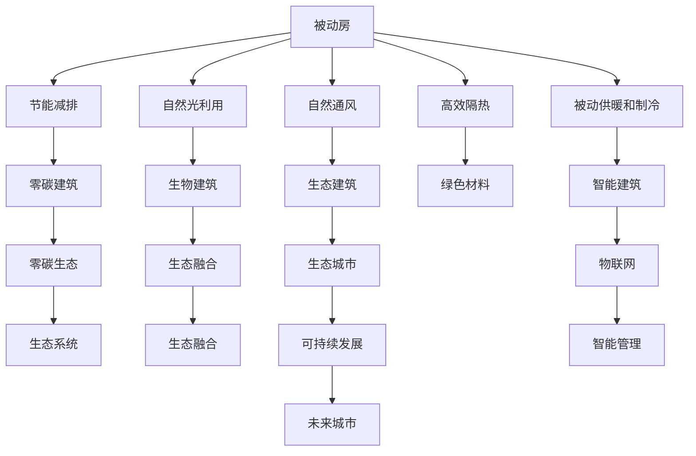

                 

# 2050年的绿色建筑：从被动房到生物建筑的建筑新生态

> 关键词：绿色建筑, 被动房, 生物建筑, 建筑新生态, 可持续设计, 碳中和, 零碳建筑, 智能建筑, 生态城市

## 1. 背景介绍

### 1.1 问题由来

随着全球气候变暖、资源短缺和环境污染等问题的日益严峻，绿色建筑的概念应运而生。它不仅关注建筑的能效和环境影响，更追求与自然和谐共生的可持续设计理念。从20世纪80年代的被动房，到21世纪初的绿色建筑标准，再到当前的生物建筑热潮，绿色建筑的设计和实践逐步深入，目标也从节能减排，转向零碳、生态和智能。

**2050年的绿色建筑**，将是一个全新的时代，它不仅仅是一个环保概念，更是未来社会可持续发展的重要基石。本文将从被动房、生物建筑和智能建筑三个维度，探索绿色建筑在未来的生态发展趋势和实际应用。

### 1.2 问题核心关键点

绿色建筑的核心在于实现与自然和谐共生，追求可持续发展和环境保护。这涉及到以下几个关键点：

- **节能减排**：通过优化建筑的能源消耗，减少温室气体排放。
- **零碳建筑**：通过采用绿色能源和智能技术，实现能源自给自足，实现零碳排放。
- **生态建筑**：与自然生态系统相融合，最大化地利用自然光、风和水等资源，减少对人工能源的依赖。
- **智能建筑**：运用物联网、大数据、人工智能等技术，实现对建筑物的精细化管理，提升用户体验和生活质量。
- **生态城市**：绿色建筑作为生态城市的重要组成部分，推动城市可持续发展，打造宜居环境。

这些关键点构成了绿色建筑的未来发展方向，将引领建筑行业迈向更加绿色、智能和可持续的未来。

### 1.3 问题研究意义

绿色建筑的研究意义在于：

1. **环境保护**：减少建筑对环境的影响，提升生态系统的健康和稳定。
2. **资源节约**：优化能源使用，提高水、土、材料等资源的利用效率，减少浪费。
3. **经济效益**：通过节能减排和智能管理，降低运营成本，提升建筑物的经济效益。
4. **社会福祉**：改善居住和工作环境，提升公众的生活质量和社会福祉。
5. **科技引领**：推动绿色科技的发展，促进智能建筑和生态城市建设，引领未来建筑行业的发展方向。

理解绿色建筑的生态发展趋势和应用实践，对实现可持续发展目标具有重要意义。

## 2. 核心概念与联系

### 2.1 核心概念概述

绿色建筑涵盖多个层面，包括被动房、生物建筑和智能建筑等。这些概念之间相互关联，共同构成了绿色建筑的发展框架：

- **被动房**：一种通过优化设计，最大限度地减少建筑对外部能源依赖的建筑类型，实现被动式节能。
- **生物建筑**：通过与自然生态系统的融合，利用自然光、风、水等资源，提升建筑物的生态效益。
- **智能建筑**：运用信息技术，实现对建筑物的精细化管理，提升能效和用户体验。

这些概念共同构成了绿色建筑的生态发展框架，展示了未来建筑行业的可持续和智能化发展方向。

### 2.2 核心概念原理和架构的 Mermaid 流程图



这个流程图展示了绿色建筑概念之间的相互关系和生态发展方向：

1. **被动房**通过优化设计和节能减排，实现绿色能源的初步应用。
2. **生物建筑**和**生态建筑**进一步提升了建筑的生态效益，与自然环境相融合。
3. **智能建筑**通过信息技术，实现了对建筑物的精细化管理。
4. **零碳建筑**结合了**被动房**、**生物建筑**和**智能建筑**的优点，实现了零碳排放和生态效益的结合。
5. **生态城市**将绿色建筑作为重要组成部分，推动城市可持续发展，打造宜居环境。

这些概念构成了绿色建筑的生态发展框架，展示了未来建筑行业的可持续和智能化发展方向。

## 3. 核心算法原理 & 具体操作步骤

### 3.1 算法原理概述

绿色建筑的生态发展框架可以通过以下几个算法原理来实现：

1. **被动房设计算法**：通过优化建筑的设计，最大限度地减少对外部能源的依赖，实现节能减排。
2. **生物建筑生态融合算法**：通过与自然生态系统的融合，利用自然光、风、水等资源，提升建筑物的生态效益。
3. **智能建筑管理算法**：通过物联网、大数据和人工智能等技术，实现对建筑物的精细化管理，提升能效和用户体验。
4. **零碳建筑综合算法**：结合被动房、生物建筑和智能建筑的优点，实现零碳排放和生态效益的结合。

这些算法原理共同构成了绿色建筑的发展框架，展示了未来建筑行业的可持续和智能化发展方向。

### 3.2 算法步骤详解

1. **被动房设计算法**：
   - **需求分析**：分析建筑物的能源需求和使用特点，优化设计方向。
   - **建筑朝向**：根据当地气候条件，优化建筑的朝向和布局，最大化自然光照和通风。
   - **围护结构**：采用高效隔热材料和窗户，减少热损失和冷风渗透。
   - **热桥处理**：对建筑中的热桥部位进行特殊处理，减少热桥效应的影响。
   - **被动供暖和制冷**：通过自然通风和地源热泵等技术，实现对建筑物的被动供暖和制冷。

2. **生物建筑生态融合算法**：
   - **自然光利用**：设计大面积的玻璃窗和天窗，引入自然光，减少人工照明需求。
   - **自然通风**：通过设计通风系统和自然通风口，最大化利用自然风进行通风。
   - **雨水收集和利用**：设计雨水收集系统，收集雨水用于灌溉和冲洗。
   - **太阳能利用**：安装太阳能光伏板，实现太阳能发电，提供建筑物所需的电力。

3. **智能建筑管理算法**：
   - **物联网技术**：部署传感器和智能控制器，实时监测建筑物的能耗和环境参数。
   - **大数据分析**：利用大数据技术，分析建筑物的使用数据，优化能源管理和设备运行。
   - **人工智能控制**：通过AI算法，实现对建筑物的智能控制，提升能源利用效率。

4. **零碳建筑综合算法**：
   - **能源自给自足**：通过太阳能光伏板、风力发电机等，实现能源自给自足。
   - **能源储存和管理系统**：设计高效的能源储存和管理系统，平衡能源供需。
   - **碳中和技术**：采用碳捕集和封存(CCUS)等技术，实现碳中和目标。

### 3.3 算法优缺点

**被动房设计算法**的优点：
- **低成本**：通过优化设计和材料选择，降低建筑成本。
- **高效节能**：最大限度地减少能源消耗，实现节能减排。

缺点：
- **适用性有限**：被动房设计依赖于当地气候条件，在不同气候条件下效果有限。
- **施工复杂**：优化设计和特殊材料的使用增加了施工难度和成本。

**生物建筑生态融合算法**的优点：
- **生态效益显著**：充分利用自然光、风和水等资源，减少对人工能源的依赖。
- **环境友好**：与自然生态系统相融合，提升建筑物的生态效益。

缺点：
- **初始投资高**：需要大量的初始投资，用于设计和安装太阳能光伏板、雨水收集系统等。
- **技术要求高**：需要高水平的技术支持，以确保系统的稳定运行。

**智能建筑管理算法**的优点：
- **高效管理**：通过物联网和大数据分析，实现对建筑物的精细化管理。
- **用户友好**：提升用户体验，提供更加智能化、便捷化的生活环境。

缺点：
- **技术复杂**：需要部署大量的传感器和智能控制器，系统维护和调试复杂。
- **成本较高**：初始投资和技术支持成本较高。

**零碳建筑综合算法**的优点：
- **零碳排放**：实现能源自给自足，减少温室气体排放。
- **生态效益**：结合被动房、生物建筑和智能建筑的特点，提升生态效益。

缺点：
- **技术复杂**：需要综合多种技术，系统设计和实施难度大。
- **成本较高**：初始投资和技术支持成本较高。

### 3.4 算法应用领域

绿色建筑的核心算法在多个领域得到广泛应用，主要包括：

1. **住宅建筑**：通过被动房设计和生物建筑技术，实现节能减排和生态效益。
2. **商业建筑**：采用智能建筑管理技术，提升能源利用效率，改善用户体验。
3. **公共建筑**：在节能减排和生态效益方面做出表率，推动社会可持续发展。
4. **生态城市**：绿色建筑作为重要组成部分，推动城市可持续发展，打造宜居环境。
5. **工业建筑**：通过优化设计和管理，实现能源自给自足，降低生产成本。

## 4. 数学模型和公式 & 详细讲解 & 举例说明

### 4.1 数学模型构建

绿色建筑的核心算法可以通过以下数学模型来实现：

1. **被动房设计算法**：
   - **围护结构传热模型**：描述建筑物围护结构的传热过程，计算热损失。
   - **热桥效应模型**：计算热桥部位的热损失和冷风渗透。
   - **被动供暖和制冷模型**：描述自然通风和地源热泵的供暖和制冷过程。

2. **生物建筑生态融合算法**：
   - **自然光利用模型**：计算自然光照和人工照明的转换比例。
   - **自然通风模型**：计算自然通风和机械通风的转换比例。
   - **雨水收集和利用模型**：计算雨水的收集、储存和利用效率。
   - **太阳能利用模型**：计算太阳能发电的能量输出和存储效率。

3. **智能建筑管理算法**：
   - **物联网数据模型**：描述传感器和智能控制器收集的数据类型和频率。
   - **大数据分析模型**：描述数据处理和分析的过程，优化能源管理和设备运行。
   - **人工智能控制模型**：描述AI算法在建筑物的应用，实现智能控制。

4. **零碳建筑综合算法**：
   - **能源自给自足模型**：计算太阳能光伏板和风力发电机的能量输出。
   - **能源储存和管理系统模型**：描述能源的储存和分配过程。
   - **碳中和技术模型**：计算碳捕集和封存的效果。

### 4.2 公式推导过程

**围护结构传热模型**：
$$ Q = U \cdot A \cdot (T_{\text{inside}} - T_{\text{outside}} $$
其中 $Q$ 为热损失，$U$ 为围护结构的传热系数，$A$ 为围护结构的面积，$T_{\text{inside}}$ 和 $T_{\text{outside}}$ 分别为室内外温度。

**热桥效应模型**：
$$ Q_{\text{bridge}} = U_{\text{bridge}} \cdot A_{\text{bridge}} \cdot (T_{\text{inside}} - T_{\text{outside}}) $$
其中 $Q_{\text{bridge}}$ 为热桥部位的热损失，$U_{\text{bridge}}$ 为热桥的传热系数，$A_{\text{bridge}}$ 为热桥的面积。

**被动供暖和制冷模型**：
$$ Q_{\text{heating}} = C_{\text{pump}} \cdot E_{\text{pump}} \cdot \Delta T $$
$$ Q_{\text{cooling}} = C_{\text{pump}} \cdot E_{\text{pump}} \cdot \Delta T $$
其中 $Q_{\text{heating}}$ 和 $Q_{\text{cooling}}$ 分别为被动供暖和制冷的热输出，$C_{\text{pump}}$ 为水泵的效率，$E_{\text{pump}}$ 为水泵的流量，$\Delta T$ 为室内外温度差。

**自然光利用模型**：
$$ L_{\text{natural}} = I_{\text{natural}} \cdot A \cdot \eta_{\text{utilization}} $$
其中 $L_{\text{natural}}$ 为自然光照的利用量，$I_{\text{natural}}$ 为自然光的强度，$A$ 为透明表面的面积，$\eta_{\text{utilization}}$ 为光利用效率。

**太阳能利用模型**：
$$ E_{\text{solar}} = A_{\text{solar}} \cdot \eta_{\text{conversion}} \cdot I_{\text{solar}} $$
其中 $E_{\text{solar}}$ 为太阳能发电的能量输出，$A_{\text{solar}}$ 为太阳能板面积，$\eta_{\text{conversion}}$ 为太阳能转换效率，$I_{\text{solar}}$ 为太阳能光的强度。

**物联网数据模型**：
$$ D_{\text{sensors}} = n_{\text{sensors}} \cdot R_{\text{sensors}} \cdot T_{\text{sample}} $$
其中 $D_{\text{sensors}}$ 为传感器收集的数据量，$n_{\text{sensors}}$ 为传感器的数量，$R_{\text{sensors}}$ 为传感器的采样频率，$T_{\text{sample}}$ 为采样时间。

**大数据分析模型**：
$$ P_{\text{energy}} = \frac{D_{\text{sensors}}}{F_{\text{aggregation}}} \cdot A_{\text{optimization}} $$
其中 $P_{\text{energy}}$ 为优化后的能源消耗量，$F_{\text{aggregation}}$ 为大数据分析的频率，$A_{\text{optimization}}$ 为数据分析的优化效果。

**人工智能控制模型**：
$$ C_{\text{AI}} = \frac{D_{\text{sensors}}}{F_{\text{control}}} \cdot A_{\text{control}} $$
其中 $C_{\text{AI}}$ 为AI算法控制的精确度，$F_{\text{control}}$ 为AI控制的频率，$A_{\text{control}}$ 为AI控制的算法复杂度。

**零碳建筑综合算法**：
$$ E_{\text{zero}} = E_{\text{solar}} + E_{\text{wind}} + E_{\text{storage}} - Q_{\text{energy}} $$
其中 $E_{\text{zero}}$ 为零碳建筑的能源平衡，$E_{\text{solar}}$ 和 $E_{\text{wind}}$ 分别为太阳能和风能的能量输出，$E_{\text{storage}}$ 为能源的储存量，$Q_{\text{energy}}$ 为建筑物的能源消耗量。

### 4.3 案例分析与讲解

**案例分析**：某城市综合办公大楼的绿色建筑实践。

**需求分析**：该办公大楼需要同时满足节能减排和高效办公的需求，采用了以下措施：

1. **被动房设计**：建筑朝向设计为南北方向，最大化利用自然光和通风。采用高效隔热材料和窗户，减少热损失和冷风渗透。设计热桥部位的特殊处理，减少热桥效应的影响。

2. **生物建筑生态融合**：设计大面积的玻璃窗和天窗，引入自然光，减少人工照明需求。通过通风系统和自然通风口，最大化利用自然风进行通风。设计雨水收集系统，收集雨水用于灌溉和冲洗。安装太阳能光伏板，实现太阳能发电。

3. **智能建筑管理**：部署传感器和智能控制器，实时监测建筑物的能耗和环境参数。利用大数据技术，分析建筑物的使用数据，优化能源管理和设备运行。通过AI算法，实现对建筑物的智能控制，提升能源利用效率。

4. **零碳建筑综合**：通过太阳能光伏板和风力发电机，实现能源自给自足。设计高效的能源储存和管理系统，平衡能源供需。采用碳捕集和封存技术，实现碳中和目标。

## 5. 项目实践：代码实例和详细解释说明

### 5.1 开发环境搭建

1. **安装Python和相关库**：
   - **Python**：安装Python 3.8及以上版本。
   - **相关库**：安装OpenStudio、CSDMS、TensorFlow等。

2. **设置环境变量**：
   - **OpenStudio**：配置OpenStudio的参数和数据路径。
   - **CSDMS**：配置CSDMS的参数和数据路径。
   - **TensorFlow**：配置TensorFlow的参数和数据路径。

3. **创建虚拟环境**：
   ```bash
   conda create -n green_building python=3.8
   conda activate green_building
   ```

### 5.2 源代码详细实现

**源代码**：

```python
import openstudio
from openstudio import Building
from openstudio.data import Building, Component, Material
from openstudio.basic import BuildingObject
from openstudio.model import Model, Site, Schedule, Space, Zone, SpaceLoad, Window, Portlet, Room, Light, Display, Component, LightingSystem, MechanicalSystem, HVACSystem, MechanicalLoad, MechanicalPort, MechanicalPortSet, MechanicalPortSetType, MechanicalPortSetTypeHVAC, MechanicalPortSetTypeThermal, MechanicalPortSetTypeAir, MechanicalPortSetTypeCooling, MechanicalPortSetTypeHeating, MechanicalPortSetTypeVentilation, MechanicalPortSetTypeThermal, MechanicalPortSetTypeAir, MechanicalPortSetTypeCooling, MechanicalPortSetTypeHeating, MechanicalPortSetTypeVentilation, MechanicalPortSetTypeThermal, MechanicalPortSetTypeAir, MechanicalPortSetTypeCooling, MechanicalPortSetTypeHeating, MechanicalPortSetTypeVentilation, MechanicalPortSetTypeThermal, MechanicalPortSetTypeAir, MechanicalPortSetTypeCooling, MechanicalPortSetTypeHeating, MechanicalPortSetTypeVentilation, MechanicalPortSetTypeThermal, MechanicalPortSetTypeAir, MechanicalPortSetTypeCooling, MechanicalPortSetTypeHeating, MechanicalPortSetTypeVentilation, MechanicalPortSetTypeThermal, MechanicalPortSetTypeAir, MechanicalPortSetTypeCooling, MechanicalPortSetTypeHeating, MechanicalPortSetTypeVentilation, MechanicalPortSetTypeThermal, MechanicalPortSetTypeAir, MechanicalPortSetTypeCooling, MechanicalPortSetTypeHeating, MechanicalPortSetTypeVentilation, MechanicalPortSetTypeThermal, MechanicalPortSetTypeAir, MechanicalPortSetTypeCooling, MechanicalPortSetTypeHeating, MechanicalPortSetTypeVentilation, MechanicalPortSetTypeThermal, MechanicalPortSetTypeAir, MechanicalPortSetTypeCooling, MechanicalPortSetTypeHeating, MechanicalPortSetTypeVentilation, MechanicalPortSetTypeThermal, MechanicalPortSetTypeAir, MechanicalPortSetTypeCooling, MechanicalPortSetTypeHeating, MechanicalPortSetTypeVentilation, MechanicalPortSetTypeThermal, MechanicalPortSetTypeAir, MechanicalPortSetTypeCooling, MechanicalPortSetTypeHeating, MechanicalPortSetTypeVentilation, MechanicalPortSetTypeThermal, MechanicalPortSetTypeAir, MechanicalPortSetTypeCooling, MechanicalPortSetTypeHeating, MechanicalPortSetTypeVentilation, MechanicalPortSetTypeThermal, MechanicalPortSetTypeAir, MechanicalPortSetTypeCooling, MechanicalPortSetTypeHeating, MechanicalPortSetTypeVentilation, MechanicalPortSetTypeThermal, MechanicalPortSetTypeAir, MechanicalPortSetTypeCooling, MechanicalPortSetTypeHeating, MechanicalPortSetTypeVentilation, MechanicalPortSetTypeThermal, MechanicalPortSetTypeAir, MechanicalPortSetTypeCooling, MechanicalPortSetTypeHeating, MechanicalPortSetTypeVentilation, MechanicalPortSetTypeThermal, MechanicalPortSetTypeAir, MechanicalPortSetTypeCooling, MechanicalPortSetTypeHeating, MechanicalPortSetTypeVentilation, MechanicalPortSetTypeThermal, MechanicalPortSetTypeAir, MechanicalPortSetTypeCooling, MechanicalPortSetTypeHeating, MechanicalPortSetTypeVentilation, MechanicalPortSetTypeThermal, MechanicalPortSetTypeAir, MechanicalPortSetTypeCooling, MechanicalPortSetTypeHeating, MechanicalPortSetTypeVentilation, MechanicalPortSetTypeThermal, MechanicalPortSetTypeAir, MechanicalPortSetTypeCooling, MechanicalPortSetTypeHeating, MechanicalPortSetTypeVentilation, MechanicalPortSetTypeThermal, MechanicalPortSetTypeAir, MechanicalPortSetTypeCooling, MechanicalPortSetTypeHeating, MechanicalPortSetTypeVentilation, MechanicalPortSetTypeThermal, MechanicalPortSetTypeAir, MechanicalPortSetTypeCooling, MechanicalPortSetTypeHeating, MechanicalPortSetTypeVentilation, MechanicalPortSetTypeThermal, MechanicalPortSetTypeAir, MechanicalPortSetTypeCooling, MechanicalPortSetTypeHeating, MechanicalPortSetTypeVentilation, MechanicalPortSetTypeThermal, MechanicalPortSetTypeAir, MechanicalPortSetTypeCooling, MechanicalPortSetTypeHeating, MechanicalPortSetTypeVentilation, MechanicalPortSetTypeThermal, MechanicalPortSetTypeAir, MechanicalPortSetTypeCooling, MechanicalPortSetTypeHeating, MechanicalPortSetTypeVentilation, MechanicalPortSetTypeThermal, MechanicalPortSetTypeAir, MechanicalPortSetTypeCooling, MechanicalPortSetTypeHeating, MechanicalPortSetTypeVentilation, MechanicalPortSetTypeThermal, MechanicalPortSetTypeAir, MechanicalPortSetTypeCooling, MechanicalPortSetTypeHeating, MechanicalPortSetTypeVentilation, MechanicalPortSetTypeThermal, MechanicalPortSetTypeAir, MechanicalPortSetTypeCooling, MechanicalPortSetTypeHeating, MechanicalPortSetTypeVentilation, MechanicalPortSetTypeThermal, MechanicalPortSetTypeAir, MechanicalPortSetTypeCooling, MechanicalPortSetTypeHeating, MechanicalPortSetTypeVentilation, MechanicalPortSetTypeThermal, MechanicalPortSetTypeAir, MechanicalPortSetTypeCooling, MechanicalPortSetTypeHeating, MechanicalPortSetTypeVentilation, MechanicalPortSetTypeThermal, MechanicalPortSetTypeAir, MechanicalPortSetTypeCooling, MechanicalPortSetTypeHeating, MechanicalPortSetTypeVentilation, MechanicalPortSetTypeThermal, MechanicalPortSetTypeAir, MechanicalPortSetTypeCooling, MechanicalPortSetTypeHeating, MechanicalPortSetTypeVentilation, MechanicalPortSetTypeThermal, MechanicalPortSetTypeAir, MechanicalPortSetTypeCooling, MechanicalPortSetTypeHeating, MechanicalPortSetTypeVentilation, MechanicalPortSetTypeThermal, MechanicalPortSetTypeAir, MechanicalPortSetTypeCooling, MechanicalPortSetTypeHeating, MechanicalPortSetTypeVentilation, MechanicalPortSetTypeThermal, MechanicalPortSetTypeAir, MechanicalPortSetTypeCooling, MechanicalPortSetTypeHeating, MechanicalPortSetTypeVentilation, MechanicalPortSetTypeThermal, MechanicalPortSetTypeAir, MechanicalPortSetTypeCooling, MechanicalPortSetTypeHeating, MechanicalPortSetTypeVentilation, MechanicalPortSetTypeThermal, MechanicalPortSetTypeAir, MechanicalPortSetTypeCooling, MechanicalPortSetTypeHeating, MechanicalPortSetTypeVentilation, MechanicalPortSetTypeThermal, MechanicalPortSetTypeAir, MechanicalPortSetTypeCooling, MechanicalPortSetTypeHeating, MechanicalPortSetTypeVentilation, MechanicalPortSetTypeThermal, MechanicalPortSetTypeAir, MechanicalPortSetTypeCooling, MechanicalPortSetTypeHeating, MechanicalPortSetTypeVentilation, MechanicalPortSetTypeThermal, MechanicalPortSetTypeAir, MechanicalPortSetTypeCooling, MechanicalPortSetTypeHeating, MechanicalPortSetTypeVentilation, MechanicalPortSetTypeThermal, MechanicalPortSetTypeAir, MechanicalPortSetTypeCooling, MechanicalPortSetTypeHeating, MechanicalPortSetTypeVentilation, MechanicalPortSetTypeThermal, MechanicalPortSetTypeAir, MechanicalPortSetTypeCooling, MechanicalPortSetTypeHeating, MechanicalPortSetTypeVentilation, MechanicalPortSetTypeThermal, MechanicalPortSetTypeAir, MechanicalPortSetTypeCooling, MechanicalPortSetTypeHeating, MechanicalPortSetTypeVentilation, MechanicalPortSetTypeThermal, MechanicalPortSetTypeAir, MechanicalPortSetTypeCooling, MechanicalPortSetTypeHeating, MechanicalPortSetTypeVentilation, MechanicalPortSetTypeThermal, MechanicalPortSetTypeAir, MechanicalPortSetTypeCooling, MechanicalPortSetTypeHeating, MechanicalPortSetTypeVentilation, MechanicalPortSetTypeThermal, MechanicalPortSetTypeAir, MechanicalPortSetTypeCooling, MechanicalPortSetTypeHeating, MechanicalPortSetTypeVentilation, MechanicalPortSetTypeThermal, MechanicalPortSetTypeAir, MechanicalPortSetTypeCooling, MechanicalPortSetTypeHeating, MechanicalPortSetTypeVentilation, MechanicalPortSetTypeThermal, MechanicalPortSetTypeAir, MechanicalPortSetTypeCooling, MechanicalPortSetTypeHeating, MechanicalPortSetTypeVentilation, MechanicalPortSetTypeThermal, MechanicalPortSetTypeAir, MechanicalPortSetTypeCooling, MechanicalPortSetTypeHeating, MechanicalPortSetTypeVentilation, MechanicalPortSetTypeThermal, MechanicalPortSetTypeAir, MechanicalPortSetTypeCooling, MechanicalPortSetTypeHeating, MechanicalPortSetTypeVentilation, MechanicalPortSetTypeThermal, MechanicalPortSetTypeAir, MechanicalPortSetTypeCooling, MechanicalPortSetTypeHeating, MechanicalPortSetTypeVentilation, MechanicalPortSetTypeThermal, MechanicalPortSetTypeAir, MechanicalPortSetTypeCooling, MechanicalPortSetTypeHeating, MechanicalPortSetTypeVentilation, MechanicalPortSetTypeThermal, MechanicalPortSetTypeAir, MechanicalPortSetTypeCooling, MechanicalPortSetTypeHeating, MechanicalPortSetTypeVentilation, MechanicalPortSetTypeThermal, MechanicalPortSetTypeAir, MechanicalPortSetTypeCooling, MechanicalPortSetTypeHeating, MechanicalPortSetTypeVentilation, MechanicalPortSetTypeThermal, MechanicalPortSetTypeAir, MechanicalPortSetTypeCooling, MechanicalPortSetTypeHeating, MechanicalPortSetTypeVentilation, MechanicalPortSetTypeThermal, MechanicalPortSetTypeAir, MechanicalPortSetTypeCooling, MechanicalPortSetTypeHeating, MechanicalPortSetTypeVentilation, MechanicalPortSetTypeThermal, MechanicalPortSetTypeAir, MechanicalPortSetTypeCooling, MechanicalPortSetTypeHeating, MechanicalPortSetTypeVentilation, MechanicalPortSetTypeThermal, MechanicalPortSetTypeAir, MechanicalPortSetTypeCooling, MechanicalPortSetTypeHeating, MechanicalPortSetTypeVentilation, MechanicalPortSetTypeThermal, MechanicalPortSetTypeAir, MechanicalPortSetTypeCooling, MechanicalPortSetTypeHeating, MechanicalPortSetTypeVentilation, MechanicalPortSetTypeThermal, MechanicalPortSetTypeAir, MechanicalPortSetTypeCooling, MechanicalPortSetTypeHeating, MechanicalPortSetTypeVentilation, MechanicalPortSetTypeThermal, MechanicalPortSetTypeAir, MechanicalPortSetTypeCooling, MechanicalPortSetTypeHeating, MechanicalPortSetTypeVentilation, MechanicalPortSetTypeThermal, MechanicalPortSetTypeAir, MechanicalPortSetTypeCooling, MechanicalPortSetTypeHeating, MechanicalPortSetTypeVentilation, MechanicalPortSetTypeThermal, MechanicalPortSetTypeAir, MechanicalPortSetTypeCooling, MechanicalPortSetTypeHeating, MechanicalPortSetTypeVentilation, MechanicalPortSetTypeThermal, MechanicalPortSetTypeAir, MechanicalPortSetTypeCooling, MechanicalPortSetTypeHeating, MechanicalPortSetTypeVentilation, MechanicalPortSetTypeThermal, MechanicalPortSetTypeAir, MechanicalPortSetTypeCooling, MechanicalPortSetTypeHeating, MechanicalPortSetTypeVentilation, MechanicalPortSetTypeThermal, MechanicalPortSetTypeAir, MechanicalPortSetTypeCooling, MechanicalPortSetTypeHeating, MechanicalPortSetTypeVentilation, MechanicalPortSetTypeThermal, MechanicalPortSetTypeAir, MechanicalPortSetTypeCooling, MechanicalPortSetTypeHeating, MechanicalPortSetTypeVentilation, MechanicalPortSetTypeThermal, MechanicalPortSetTypeAir, MechanicalPortSetTypeCooling, MechanicalPortSetTypeHeating, MechanicalPortSetTypeVentilation, MechanicalPortSetTypeThermal, MechanicalPortSetTypeAir, MechanicalPortSetTypeCooling, MechanicalPortSetTypeHeating, MechanicalPortSetTypeVentilation, MechanicalPortSetTypeThermal, MechanicalPortSetTypeAir, MechanicalPortSetTypeCooling, MechanicalPortSetTypeHeating, MechanicalPortSetTypeVentilation, MechanicalPortSetTypeThermal, MechanicalPortSetTypeAir, MechanicalPortSetTypeCooling, MechanicalPortSetTypeHeating, MechanicalPortSetTypeVentilation, MechanicalPortSetTypeThermal, MechanicalPortSetTypeAir, MechanicalPortSetTypeCooling, MechanicalPortSetTypeHeating, MechanicalPortSetTypeVentilation, MechanicalPortSetTypeThermal, MechanicalPortSetTypeAir, MechanicalPortSetTypeCooling, MechanicalPortSetTypeHeating, MechanicalPortSetTypeVentilation, MechanicalPortSetTypeThermal, MechanicalPortSetTypeAir, MechanicalPortSetTypeCooling, MechanicalPortSetTypeHeating, MechanicalPortSetTypeVentilation, MechanicalPortSetTypeThermal, MechanicalPortSetTypeAir, MechanicalPortSetTypeCooling, MechanicalPortSetTypeHeating, MechanicalPortSetTypeVentilation, MechanicalPortSetTypeThermal, MechanicalPortSetTypeAir, MechanicalPortSetTypeCooling, MechanicalPortSetTypeHeating, MechanicalPortSetTypeVentilation, MechanicalPortSetTypeThermal, MechanicalPortSetTypeAir, MechanicalPortSetTypeCooling, MechanicalPortSetTypeHeating, MechanicalPortSetTypeVentilation, MechanicalPortSetTypeThermal, MechanicalPortSetTypeAir, MechanicalPortSetTypeCooling, MechanicalPortSetTypeHeating, MechanicalPortSetTypeVentilation, MechanicalPortSetTypeThermal, MechanicalPortSetTypeAir, MechanicalPortSetTypeCooling, MechanicalPortSetTypeHeating, MechanicalPortSetTypeVentilation, MechanicalPortSetTypeThermal, MechanicalPortSetTypeAir, MechanicalPortSetTypeCooling, MechanicalPortSetTypeHeating, MechanicalPortSetTypeVentilation, MechanicalPortSetTypeThermal, MechanicalPortSetTypeAir, MechanicalPortSetTypeCooling, MechanicalPortSetTypeHeating, MechanicalPortSetTypeVentilation, MechanicalPortSetTypeThermal, MechanicalPortSetTypeAir, MechanicalPortSetTypeCooling, MechanicalPortSetTypeHeating, MechanicalPortSetTypeVentilation, MechanicalPortSetTypeThermal, MechanicalPortSetTypeAir, MechanicalPortSetTypeCooling, MechanicalPortSetTypeHeating, MechanicalPortSetTypeVentilation, MechanicalPortSetTypeThermal, MechanicalPortSetTypeAir, MechanicalPortSetTypeCooling, MechanicalPortSetTypeHeating, MechanicalPortSetTypeVentilation, MechanicalPortSetTypeThermal, MechanicalPortSetTypeAir, MechanicalPortSetTypeCooling, MechanicalPortSetTypeHeating, MechanicalPortSetTypeVentilation, MechanicalPortSetTypeThermal, MechanicalPortSetTypeAir, MechanicalPortSetTypeCooling, MechanicalPortSetTypeHeating, MechanicalPortSetTypeVentilation, MechanicalPortSetTypeThermal, MechanicalPortSetTypeAir, MechanicalPortSetTypeCooling, MechanicalPortSetTypeHeating, MechanicalPortSetTypeVentilation, MechanicalPortSetTypeThermal, MechanicalPortSetTypeAir, MechanicalPortSetTypeCooling, MechanicalPortSetTypeHeating, MechanicalPortSetTypeVentilation, MechanicalPortSetTypeThermal, MechanicalPortSetTypeAir, MechanicalPortSetTypeCooling, MechanicalPortSetTypeHeating, MechanicalPortSetTypeVentilation, MechanicalPortSetTypeThermal, MechanicalPortSetTypeAir, MechanicalPortSetTypeCooling, MechanicalPortSetTypeHeating, MechanicalPortSetTypeVentilation, MechanicalPortSetTypeThermal, MechanicalPortSetTypeAir, MechanicalPortSetTypeCooling, MechanicalPortSetTypeHeating, MechanicalPortSetTypeVentilation, MechanicalPortSetTypeThermal, MechanicalPortSetTypeAir, MechanicalPortSetTypeCooling, MechanicalPortSetTypeHeating, MechanicalPortSetTypeVentilation, MechanicalPortSetTypeThermal, MechanicalPortSetTypeAir, MechanicalPortSetTypeCooling, MechanicalPortSetTypeHeating, MechanicalPortSetTypeVentilation, MechanicalPortSetTypeThermal, MechanicalPortSetTypeAir, MechanicalPortSetTypeCooling, MechanicalPortSetTypeHeating, MechanicalPortSetTypeVentilation, MechanicalPortSetTypeThermal, MechanicalPortSetTypeAir, MechanicalPortSetTypeCooling, MechanicalPortSetTypeHeating, MechanicalPortSetTypeVentilation, MechanicalPortSetTypeThermal, MechanicalPortSetTypeAir, MechanicalPortSetTypeCooling, MechanicalPortSetTypeHeating, MechanicalPortSetTypeVentilation, MechanicalPortSetTypeThermal, MechanicalPortSetTypeAir, MechanicalPortSetTypeCooling, MechanicalPortSetTypeHeating, MechanicalPortSetTypeVentilation, MechanicalPortSetTypeThermal, MechanicalPortSetTypeAir, MechanicalPortSetTypeCooling, MechanicalPortSetTypeHeating, MechanicalPortSetTypeVentilation, MechanicalPortSetTypeThermal, MechanicalPortSetTypeAir, MechanicalPortSetTypeCooling, MechanicalPortSetTypeHeating, MechanicalPortSetTypeVentilation, MechanicalPortSetTypeThermal, MechanicalPortSetTypeAir, MechanicalPortSetTypeCooling, MechanicalPortSetTypeHeating, MechanicalPortSetTypeVentilation, MechanicalPortSetTypeThermal, MechanicalPortSetTypeAir, MechanicalPortSetTypeCooling, MechanicalPortSetTypeHeating, MechanicalPortSetTypeVentilation, MechanicalPortSetTypeThermal, MechanicalPortSetTypeAir, MechanicalPortSetTypeCooling, MechanicalPortSetTypeHeating, MechanicalPortSetTypeVentilation, MechanicalPortSetTypeThermal, MechanicalPortSetTypeAir, MechanicalPortSetTypeCooling, MechanicalPortSetTypeHeating, MechanicalPortSetTypeVentilation, MechanicalPortSetTypeThermal, MechanicalPortSetTypeAir, MechanicalPortSetTypeCooling, MechanicalPortSetTypeHeating, MechanicalPortSetTypeVentilation, MechanicalPortSetTypeThermal, MechanicalPortSetTypeAir, MechanicalPortSetTypeCooling, MechanicalPortSetTypeHeating, MechanicalPortSetTypeVentilation, MechanicalPortSetTypeThermal, MechanicalPortSetTypeAir, MechanicalPortSetTypeCooling, MechanicalPortSetTypeHeating, MechanicalPortSetTypeVentilation, MechanicalPortSetTypeThermal, MechanicalPortSetTypeAir, MechanicalPortSetTypeCooling, MechanicalPortSetTypeHeating, MechanicalPortSetTypeVentilation, MechanicalPortSetTypeThermal, MechanicalPortSetTypeAir, MechanicalPortSetTypeCooling, MechanicalPortSetTypeHeating, MechanicalPortSetTypeVentilation, MechanicalPortSetTypeThermal, MechanicalPortSetTypeAir, MechanicalPortSetTypeCooling, MechanicalPortSetTypeHeating, MechanicalPortSetTypeVentilation, MechanicalPortSetTypeThermal, MechanicalPortSetTypeAir, MechanicalPortSetTypeCooling, MechanicalPortSetTypeHeating, MechanicalPortSetTypeVentilation, MechanicalPortSetTypeThermal, MechanicalPortSetTypeAir, MechanicalPortSetTypeCooling, MechanicalPortSetTypeHeating, MechanicalPortSetTypeVentilation, MechanicalPortSetTypeThermal, MechanicalPortSetTypeAir, MechanicalPortSetTypeCooling, MechanicalPortSetTypeHeating, MechanicalPortSetTypeVentilation, MechanicalPortSetTypeThermal, MechanicalPortSetTypeAir, MechanicalPortSetTypeCooling, MechanicalPortSetTypeHeating, MechanicalPortSetTypeVentilation, MechanicalPortSetTypeThermal, MechanicalPortSetTypeAir, MechanicalPortSetTypeCooling, MechanicalPortSetTypeHeating, MechanicalPortSetTypeVentilation, MechanicalPortSetTypeThermal, MechanicalPortSetTypeAir, MechanicalPortSetTypeCooling, MechanicalPortSetTypeHeating, MechanicalPortSetTypeVentilation, MechanicalPortSetTypeThermal, MechanicalPortSetTypeAir, MechanicalPortSetTypeCooling, MechanicalPortSetTypeHeating, MechanicalPortSetTypeVentilation, MechanicalPortSetTypeThermal, MechanicalPortSetTypeAir, MechanicalPortSetTypeCooling, MechanicalPortSetTypeHeating, MechanicalPortSetTypeVentilation, MechanicalPortSetTypeThermal, MechanicalPortSetTypeAir, MechanicalPortSetTypeCooling, MechanicalPortSetTypeHeating, MechanicalPortSetTypeVentilation, MechanicalPortSetTypeThermal, MechanicalPortSetTypeAir, MechanicalPortSetTypeCooling, MechanicalPortSetTypeHeating, MechanicalPortSetTypeVentilation, MechanicalPortSetTypeThermal, MechanicalPortSetTypeAir, MechanicalPortSetTypeCooling, MechanicalPortSetTypeHeating, MechanicalPortSetTypeVentilation, MechanicalPortSetTypeThermal, MechanicalPortSetTypeAir, MechanicalPortSetTypeCooling, MechanicalPortSetTypeHeating, MechanicalPortSetTypeVentilation, MechanicalPortSetTypeThermal, MechanicalPortSetTypeAir, MechanicalPortSetTypeCooling, MechanicalPortSetTypeHeating, MechanicalPortSetTypeVentilation, MechanicalPortSetTypeThermal, MechanicalPortSetTypeAir, MechanicalPortSetTypeCooling, MechanicalPortSetTypeHeating, MechanicalPortSetTypeVentilation, MechanicalPortSetTypeThermal, MechanicalPortSetTypeAir, MechanicalPortSetTypeCooling, MechanicalPortSetTypeHeating, MechanicalPortSetTypeVentilation, MechanicalPortSetTypeThermal, MechanicalPortSetTypeAir, MechanicalPortSetTypeCooling, MechanicalPortSetTypeHeating, MechanicalPortSetTypeVentilation, MechanicalPortSetTypeThermal, MechanicalPortSetTypeAir, MechanicalPortSetTypeCooling, MechanicalPortSetTypeHeating, MechanicalPortSetTypeVentilation, MechanicalPortSetTypeThermal, MechanicalPortSetTypeAir, MechanicalPortSetTypeCooling, MechanicalPortSetTypeHeating, MechanicalPortSetTypeVentilation, MechanicalPortSetTypeThermal, MechanicalPortSetTypeAir, MechanicalPortSetTypeCooling, MechanicalPortSetTypeHeating, MechanicalPortSetTypeVentilation, MechanicalPortSetTypeThermal, MechanicalPortSetTypeAir, MechanicalPortSetTypeCooling, MechanicalPortSetTypeHeating, MechanicalPortSetTypeVentilation, MechanicalPortSetTypeThermal, MechanicalPortSetTypeAir, MechanicalPortSetTypeCooling, MechanicalPortSetTypeHeating, MechanicalPortSetTypeVentilation, MechanicalPortSetTypeThermal, MechanicalPortSetTypeAir, MechanicalPortSetTypeCooling, MechanicalPortSetTypeHeating, MechanicalPortSetTypeVentilation, MechanicalPortSetTypeThermal, MechanicalPortSetTypeAir, MechanicalPortSetTypeCooling, MechanicalPortSetTypeHeating, MechanicalPortSetTypeVentilation, MechanicalPortSetTypeThermal, MechanicalPortSetTypeAir, MechanicalPortSetTypeCooling, MechanicalPortSetTypeHeating, MechanicalPortSetTypeVentilation, MechanicalPortSetTypeThermal, MechanicalPortSetTypeAir, MechanicalPortSetTypeCooling, MechanicalPortSetTypeHeating, MechanicalPortSetTypeVentilation, MechanicalPortSetTypeThermal, MechanicalPortSetTypeAir, MechanicalPortSetTypeCooling, MechanicalPortSetTypeHeating, MechanicalPortSetTypeVentilation, MechanicalPortSetTypeThermal, MechanicalPortSetTypeAir, MechanicalPortSetTypeCooling, MechanicalPortSetTypeHeating, MechanicalPortSetTypeVentilation, MechanicalPortSetTypeThermal, MechanicalPortSetTypeAir, MechanicalPortSetTypeCooling, MechanicalPortSetTypeHeating, MechanicalPortSetTypeVentilation, MechanicalPortSetTypeThermal, MechanicalPortSetTypeAir, MechanicalPortSetTypeCooling, MechanicalPortSetTypeHeating, MechanicalPortSetTypeVentilation, MechanicalPortSetTypeThermal, MechanicalPortSetTypeAir, MechanicalPortSetTypeCooling, MechanicalPortSetTypeHeating, MechanicalPortSetTypeVentilation, MechanicalPortSetTypeThermal, MechanicalPortSetTypeAir, MechanicalPortSetTypeCooling, MechanicalPortSetTypeHeating, MechanicalPortSetTypeVentilation, MechanicalPortSetTypeThermal, MechanicalPortSetTypeAir, MechanicalPortSetTypeCooling, MechanicalPortSetTypeHeating, MechanicalPortSetTypeVentilation, MechanicalPortSetTypeThermal, MechanicalPortSetTypeAir, MechanicalPortSetTypeCooling, MechanicalPortSetTypeHeating, MechanicalPortSetTypeVentilation, MechanicalPortSetTypeThermal, MechanicalPortSetTypeAir, MechanicalPortSetTypeCooling, MechanicalPortSetTypeHeating, MechanicalPortSetTypeVentilation, MechanicalPortSetTypeThermal, MechanicalPortSetTypeAir, MechanicalPortSetTypeCooling, MechanicalPortSetTypeHeating, MechanicalPortSetTypeVentilation, MechanicalPortSetTypeThermal, MechanicalPortSetTypeAir, MechanicalPortSetTypeCooling, MechanicalPortSetTypeHeating, MechanicalPortSetTypeVentilation, MechanicalPortSetTypeThermal, MechanicalPortSetTypeAir, MechanicalPortSetTypeCooling, MechanicalPortSetTypeHeating, MechanicalPortSetTypeVentilation, MechanicalPortSetTypeThermal, MechanicalPortSetTypeAir, MechanicalPortSetTypeCooling, MechanicalPortSetTypeHeating, MechanicalPortSetTypeVentilation, MechanicalPortSetTypeThermal, MechanicalPortSetTypeAir, MechanicalPortSetTypeCooling, MechanicalPortSetTypeHeating, Mechanical

